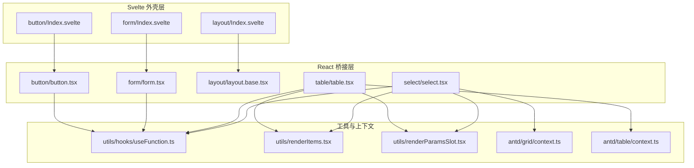
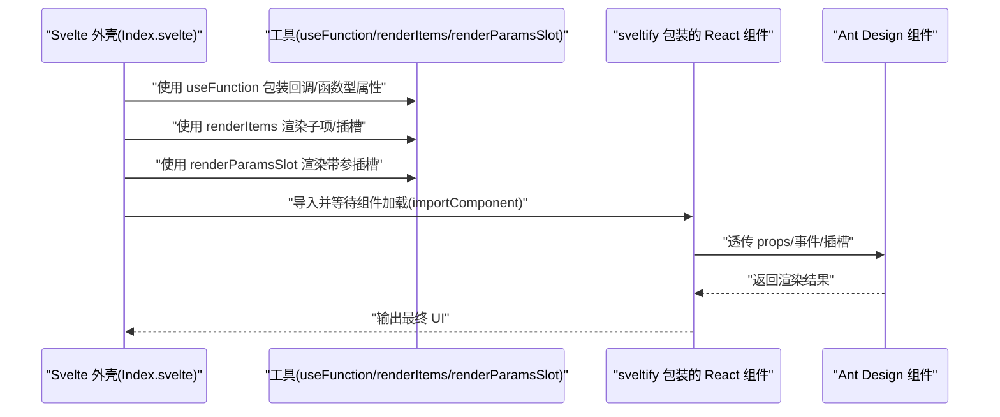
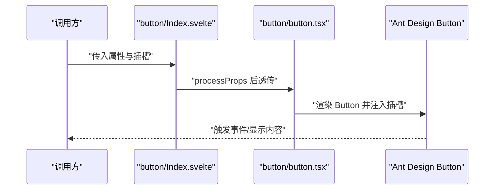
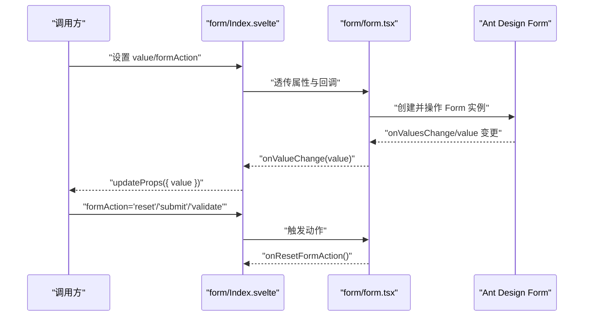
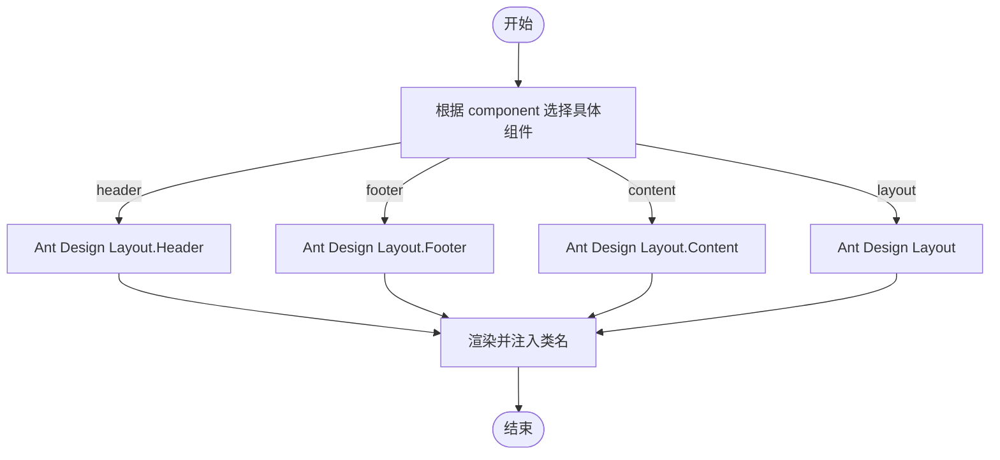
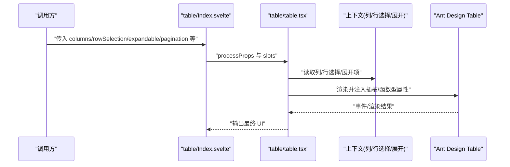
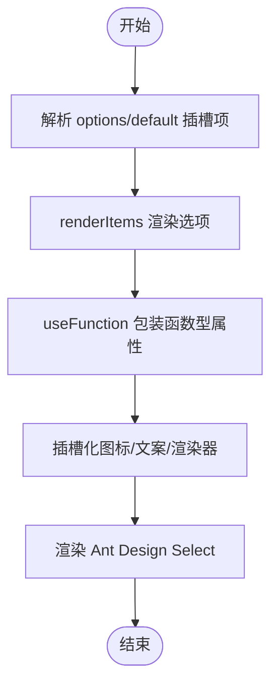
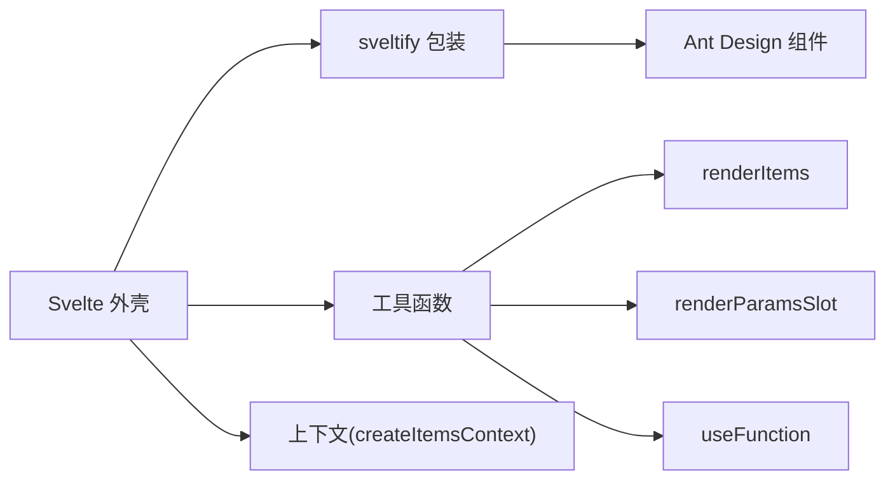

# Ant Design 组件 API

<cite>
**本文引用的文件**
- [frontend/antd/package.json](file://frontend/antd/package.json)
- [backend/modelscope_studio/components/antd/components.py](file://backend/modelscope_studio/components/antd/components.py)
- [frontend/antd/button/Index.svelte](file://frontend/antd/button/Index.svelte)
- [frontend/antd/button/button.tsx](file://frontend/antd/button/button.tsx)
- [frontend/antd/form/Index.svelte](file://frontend/antd/form/Index.svelte)
- [frontend/antd/form/form.tsx](file://frontend/antd/form/form.tsx)
- [frontend/antd/layout/Index.svelte](file://frontend/antd/layout/Index.svelte)
- [frontend/antd/layout/layout.base.tsx](file://frontend/antd/layout/layout.base.tsx)
- [frontend/antd/table/table.tsx](file://frontend/antd/table/table.tsx)
- [frontend/antd/select/select.tsx](file://frontend/antd/select/select.tsx)
- [frontend/utils/hooks/useFunction.ts](file://frontend/utils/hooks/useFunction.ts)
- [frontend/utils/renderItems.tsx](file://frontend/utils/renderItems.tsx)
- [frontend/utils/renderParamsSlot.tsx](file://frontend/utils/renderParamsSlot.tsx)
- [frontend/antd/grid/context.ts](file://frontend/antd/grid/context.ts)
- [frontend/antd/table/context.ts](file://frontend/antd/table/context.ts)
</cite>

## 目录

1. [简介](#简介)
2. [项目结构](#项目结构)
3. [核心组件](#核心组件)
4. [架构总览](#架构总览)
5. [详细组件分析](#详细组件分析)
6. [依赖分析](#依赖分析)
7. [性能考虑](#性能考虑)
8. [故障排查指南](#故障排查指南)
9. [结论](#结论)
10. [附录](#附录)

## 简介

本文件为 ModelScope Studio 中基于 Ant Design Svelte 的组件 API 参考文档。目标是系统性梳理 Ant Design 组件在前端层的封装方式，覆盖通用组件、布局组件、导航组件、数据录入组件、数据展示组件、反馈组件等类别，明确每个组件的属性定义、事件处理、插槽系统、样式定制、状态管理与数据绑定机制，并给出与原生 Ant Design 组件的对应关系及 TypeScript 类型规范。同时提供实例化与配置的参考路径，以及性能优化与最佳实践建议。

## 项目结构

ModelScope Studio 的 Ant Design Svelte 组件采用“Svelte 外壳 + React 组件桥接”的架构：Svelte 层负责属性透传、插槽与可见性控制；React 层通过 sveltify 将 Ant Design 组件桥接到 Svelte 生态中。工具层提供统一的函数包装、插槽渲染与上下文注入能力。

图表来源

- [frontend/antd/button/Index.svelte:1-74](file://frontend/antd/button/Index.svelte#L1-L74)
- [frontend/antd/button/button.tsx:1-39](file://frontend/antd/button/button.tsx#L1-L39)
- [frontend/antd/form/Index.svelte:1-99](file://frontend/antd/form/Index.svelte#L1-L99)
- [frontend/antd/form/form.tsx:1-79](file://frontend/antd/form/form.tsx#L1-L79)
- [frontend/antd/layout/Index.svelte:1-18](file://frontend/antd/layout/Index.svelte#L1-L18)
- [frontend/antd/layout/layout.base.tsx:1-40](file://frontend/antd/layout/layout.base.tsx#L1-L40)
- [frontend/antd/table/table.tsx:1-279](file://frontend/antd/table/table.tsx#L1-L279)
- [frontend/antd/select/select.tsx:1-181](file://frontend/antd/select/select.tsx#L1-L181)
- [frontend/utils/hooks/useFunction.ts:1-13](file://frontend/utils/hooks/useFunction.ts#L1-L13)
- [frontend/utils/renderItems.tsx:1-114](file://frontend/utils/renderItems.tsx#L1-L114)
- [frontend/utils/renderParamsSlot.tsx:1-51](file://frontend/utils/renderParamsSlot.tsx#L1-L51)
- [frontend/antd/grid/context.ts:1-7](file://frontend/antd/grid/context.ts#L1-L7)
- [frontend/antd/table/context.ts:1-29](file://frontend/antd/table/context.ts#L1-L29)

章节来源

- [frontend/antd/package.json:1-6](file://frontend/antd/package.json#L1-L6)

## 核心组件

本节概述各组件层的职责与典型用法要点：

- 通用组件：如 Button，负责属性透传、插槽（图标、加载态图标）与可见性控制。
- 表单组件：如 Form，负责表单值双向绑定、动作触发（重置/提交/校验）、回调合并。
- 布局组件：如 Layout，通过 Base 组件按需选择 Header/Footer/Content/Layout 并注入样式类名。
- 数据展示组件：如 Table，支持列、展开、行选择、分页、粘性头部、汇总、标题/页脚插槽等复杂场景。
- 选择器组件：如 Select，支持选项列表、过滤、下拉/弹窗渲染、标签/标签项渲染等插槽。

章节来源

- [frontend/antd/button/Index.svelte:1-74](file://frontend/antd/button/Index.svelte#L1-L74)
- [frontend/antd/button/button.tsx:1-39](file://frontend/antd/button/button.tsx#L1-L39)
- [frontend/antd/form/Index.svelte:1-99](file://frontend/antd/form/Index.svelte#L1-L99)
- [frontend/antd/form/form.tsx:1-79](file://frontend/antd/form/form.tsx#L1-L79)
- [frontend/antd/layout/Index.svelte:1-18](file://frontend/antd/layout/Index.svelte#L1-L18)
- [frontend/antd/layout/layout.base.tsx:1-40](file://frontend/antd/layout/layout.base.tsx#L1-L40)
- [frontend/antd/table/table.tsx:1-279](file://frontend/antd/table/table.tsx#L1-L279)
- [frontend/antd/select/select.tsx:1-181](file://frontend/antd/select/select.tsx#L1-L181)

## 架构总览

Svelte 外壳通过 getProps/processProps/importComponent 等机制收集并转换属性，再由 sveltify 包装的 React 组件承载实际 UI 逻辑。插槽系统通过 ReactSlot 与 renderItems/renderParamsSlot 实现参数化渲染与上下文注入。

图表来源

- [frontend/antd/button/Index.svelte:1-74](file://frontend/antd/button/Index.svelte#L1-L74)
- [frontend/antd/button/button.tsx:1-39](file://frontend/antd/button/button.tsx#L1-L39)
- [frontend/antd/form/Index.svelte:1-99](file://frontend/antd/form/Index.svelte#L1-L99)
- [frontend/antd/form/form.tsx:1-79](file://frontend/antd/form/form.tsx#L1-L79)
- [frontend/antd/table/table.tsx:1-279](file://frontend/antd/table/table.tsx#L1-L279)
- [frontend/antd/select/select.tsx:1-181](file://frontend/antd/select/select.tsx#L1-L181)
- [frontend/utils/hooks/useFunction.ts:1-13](file://frontend/utils/hooks/useFunction.ts#L1-L13)
- [frontend/utils/renderItems.tsx:1-114](file://frontend/utils/renderItems.tsx#L1-L114)
- [frontend/utils/renderParamsSlot.tsx:1-51](file://frontend/utils/renderParamsSlot.tsx#L1-L51)

## 详细组件分析

### Button 组件

- 属性定义
  - 通用属性：继承 Ant Design Button 的全部属性。
  - 插槽：icon、loading.icon。
  - 元信息：elem_id、elem_classes、elem_style、visible 控制可见性与样式。
  - 链接行为：href_target 映射到 target。
- 事件处理
  - 通过 Ant Design Button 的 onClick 等事件透传。
- 插槽系统
  - 支持以插槽形式传入图标或加载态图标，内部通过 ReactSlot 渲染。
- 样式定制
  - 通过 elem_classes、elem_style 注入类名与内联样式。
- 状态管理与数据绑定
  - 无双向绑定；可通过外部更新 props 控制显示/隐藏。
- TypeScript 类型
  - 使用 Ant Design Button 的 GetProps 类型别名进行约束。
- 对应关系
  - React 组件：Ant Design Button。
- 示例参考路径
  - [frontend/antd/button/Index.svelte:1-74](file://frontend/antd/button/Index.svelte#L1-L74)
  - [frontend/antd/button/button.tsx:1-39](file://frontend/antd/button/button.tsx#L1-L39)

图表来源

- [frontend/antd/button/Index.svelte:1-74](file://frontend/antd/button/Index.svelte#L1-L74)
- [frontend/antd/button/button.tsx:1-39](file://frontend/antd/button/button.tsx#L1-L39)

章节来源

- [frontend/antd/button/Index.svelte:1-74](file://frontend/antd/button/Index.svelte#L1-L74)
- [frontend/antd/button/button.tsx:1-39](file://frontend/antd/button/button.tsx#L1-L39)

### Form 组件

- 属性定义
  - value：表单初始值或受控值。
  - formAction：'reset' | 'submit' | 'validate' | null，用于触发动作。
  - 回调：onValueChange、onResetFormAction。
  - 其他：requiredMark、feedbackIcons、as_item、visible 等。
- 事件处理
  - onValuesChange 合并 onValueChange，实现值变更通知。
  - 动作执行：根据 formAction 调用 form.resetFields/form.submit/form.validateFields。
- 插槽系统
  - requiredMark 可通过插槽渲染。
- 样式与可见性
  - elem_id、elem_classes、elem_style、visible 控制外观与显示。
- 状态管理与数据绑定
  - 双向绑定：onValueChange 更新外部 value；外部 value 变更时同步回表单。
  - 动作解耦：onResetFormAction 在动作完成后重置 formAction。
- TypeScript 类型
  - FormProps 扩展 Ant Design Form 的 GetProps，并声明 value、onValueChange、formAction 等。
- 对应关系
  - React 组件：Ant Design Form。
- 示例参考路径
  - [frontend/antd/form/Index.svelte:1-99](file://frontend/antd/form/Index.svelte#L1-L99)
  - [frontend/antd/form/form.tsx:1-79](file://frontend/antd/form/form.tsx#L1-L79)

图表来源

- [frontend/antd/form/Index.svelte:1-99](file://frontend/antd/form/Index.svelte#L1-L99)
- [frontend/antd/form/form.tsx:1-79](file://frontend/antd/form/form.tsx#L1-L79)

章节来源

- [frontend/antd/form/Index.svelte:1-99](file://frontend/antd/form/Index.svelte#L1-L99)
- [frontend/antd/form/form.tsx:1-79](file://frontend/antd/form/form.tsx#L1-L79)

### Layout 组件

- 属性定义
  - component：'header' | 'footer' | 'content' | 'layout'，决定渲染的具体 Ant Design 组件。
  - 其他：className、id、style 等透传。
- 插槽系统
  - 通过 Base 组件接收 children 并渲染。
- 样式定制
  - Base 会为不同 component 注入不同的类名前缀，便于主题化。
- 对应关系
  - React 组件：Ant Design Layout 及其 Content/Header/Footer。
- 示例参考路径
  - [frontend/antd/layout/Index.svelte:1-18](file://frontend/antd/layout/Index.svelte#L1-L18)
  - [frontend/antd/layout/layout.base.tsx:1-40](file://frontend/antd/layout/layout.base.tsx#L1-L40)

图表来源

- [frontend/antd/layout/layout.base.tsx:1-40](file://frontend/antd/layout/layout.base.tsx#L1-L40)

章节来源

- [frontend/antd/layout/Index.svelte:1-18](file://frontend/antd/layout/Index.svelte#L1-L18)
- [frontend/antd/layout/layout.base.tsx:1-40](file://frontend/antd/layout/layout.base.tsx#L1-L40)

### Table 组件

- 属性定义
  - columns：列定义，支持默认列与扩展列常量。
  - rowSelection、expandable：行选择与可展开配置，支持插槽注入。
  - pagination：分页配置，支持插槽注入跳转按钮与页码渲染。
  - loading：支持 tip 与 indicator 插槽。
  - sticky、showSorterTooltip、footer、title、summary 等。
- 插槽系统
  - 通过 withColumnItemsContextProvider/withRowSelectionItemsContextProvider/withExpandableItemsContextProvider 注入列、行选择与展开项。
  - renderItems 渲染列与子项；renderParamsSlot 渲染带参插槽（如分页按钮、页码渲染、排序提示等）。
- 函数型属性
  - useFunction 包装 getPopupContainer、rowClassName、rowKey、summary、footer 等函数型属性。
- 性能注意
  - 列与行选择等配置通过 useMemo 优化渲染。
- 对应关系
  - React 组件：Ant Design Table。
- 示例参考路径
  - [frontend/antd/table/table.tsx:1-279](file://frontend/antd/table/table.tsx#L1-L279)
  - [frontend/antd/table/context.ts:1-29](file://frontend/antd/table/context.ts#L1-L29)
  - [frontend/utils/renderItems.tsx:1-114](file://frontend/utils/renderItems.tsx#L1-L114)
  - [frontend/utils/renderParamsSlot.tsx:1-51](file://frontend/utils/renderParamsSlot.tsx#L1-L51)

图表来源

- [frontend/antd/table/table.tsx:1-279](file://frontend/antd/table/table.tsx#L1-L279)
- [frontend/antd/table/context.ts:1-29](file://frontend/antd/table/context.ts#L1-L29)

章节来源

- [frontend/antd/table/table.tsx:1-279](file://frontend/antd/table/table.tsx#L1-L279)
- [frontend/antd/table/context.ts:1-29](file://frontend/antd/table/context.ts#L1-L29)

### Select 组件

- 属性定义
  - options：选项列表，支持通过插槽注入。
  - onChange/onValueChange：值变更回调。
  - filterOption/filterSort：过滤与排序函数。
  - dropdownRender/popupRender/optionRender/tagRender/labelRender：插槽化渲染。
  - allowClear.prefix/removeIcon/suffixIcon/notFoundContent/menuItemSelectedIcon：插槽化图标与文案。
- 插槽系统
  - withItemsContextProvider 注入 options/default 子项；renderItems 渲染选项。
  - renderParamsSlot 渲染带参插槽（如 maxTagPlaceholder）。
- 函数型属性
  - useFunction 包装 getPopupContainer、dropdownRender、popupRender、optionRender、tagRender、labelRender、filterOption、filterSort。
- 对应关系
  - React 组件：Ant Design Select。
- 示例参考路径
  - [frontend/antd/select/select.tsx:1-181](file://frontend/antd/select/select.tsx#L1-L181)
  - [frontend/antd/grid/context.ts:1-7](file://frontend/antd/grid/context.ts#L1-L7)
  - [frontend/utils/renderItems.tsx:1-114](file://frontend/utils/renderItems.tsx#L1-L114)
  - [frontend/utils/renderParamsSlot.tsx:1-51](file://frontend/utils/renderParamsSlot.tsx#L1-L51)

图表来源

- [frontend/antd/select/select.tsx:1-181](file://frontend/antd/select/select.tsx#L1-L181)
- [frontend/antd/grid/context.ts:1-7](file://frontend/antd/grid/context.ts#L1-L7)

章节来源

- [frontend/antd/select/select.tsx:1-181](file://frontend/antd/select/select.tsx#L1-L181)
- [frontend/antd/grid/context.ts:1-7](file://frontend/antd/grid/context.ts#L1-L7)

## 依赖分析

- 组件间依赖
  - Button/Form/Layout/Table/Select 均依赖 sveltify 将 Ant Design 组件桥接至 Svelte。
  - 插槽与上下文依赖 renderItems/renderParamsSlot 与 createItemsContext。
  - 函数型属性依赖 useFunction 包装为可执行函数。
- 外部依赖
  - Ant Design：作为 React 组件库，提供 UI 基础能力。
  - 工具库：classnames、lodash-es 等辅助样式与对象处理。
- 循环依赖
  - 未发现直接循环依赖；上下文注入通过独立模块导出。

图表来源

- [frontend/antd/button/button.tsx:1-39](file://frontend/antd/button/button.tsx#L1-L39)
- [frontend/antd/form/form.tsx:1-79](file://frontend/antd/form/form.tsx#L1-L79)
- [frontend/antd/table/table.tsx:1-279](file://frontend/antd/table/table.tsx#L1-L279)
- [frontend/antd/select/select.tsx:1-181](file://frontend/antd/select/select.tsx#L1-L181)
- [frontend/utils/hooks/useFunction.ts:1-13](file://frontend/utils/hooks/useFunction.ts#L1-L13)
- [frontend/utils/renderItems.tsx:1-114](file://frontend/utils/renderItems.tsx#L1-L114)
- [frontend/utils/renderParamsSlot.tsx:1-51](file://frontend/utils/renderParamsSlot.tsx#L1-L51)

章节来源

- [frontend/antd/button/button.tsx:1-39](file://frontend/antd/button/button.tsx#L1-L39)
- [frontend/antd/form/form.tsx:1-79](file://frontend/antd/form/form.tsx#L1-L79)
- [frontend/antd/table/table.tsx:1-279](file://frontend/antd/table/table.tsx#L1-L279)
- [frontend/antd/select/select.tsx:1-181](file://frontend/antd/select/select.tsx#L1-L181)
- [frontend/utils/hooks/useFunction.ts:1-13](file://frontend/utils/hooks/useFunction.ts#L1-L13)
- [frontend/utils/renderItems.tsx:1-114](file://frontend/utils/renderItems.tsx#L1-L114)
- [frontend/utils/renderParamsSlot.tsx:1-51](file://frontend/utils/renderParamsSlot.tsx#L1-L51)

## 性能考虑

- 函数型属性包装
  - 使用 useFunction 将传入的字符串/函数包装为可执行函数，避免每次渲染重新创建闭包。
- 插槽与上下文
  - renderItems 与 renderParamsSlot 支持克隆与参数化渲染，减少重复渲染开销。
- 计算缓存
  - Table/Select 中大量使用 useMemo 缓存计算结果（如列、行键、容器函数等）。
- 异步加载
  - Svelte 外壳通过 importComponent 异步加载 React 组件，降低首屏压力。
- 最佳实践
  - 尽量使用插槽而非内联 JSX，提升复用性与可维护性。
  - 对高频变化的 props 使用 $derived 或 useMemo 包装，避免不必要的重渲染。
  - 合理拆分组件，避免单个组件承担过多职责。

## 故障排查指南

- 插槽不生效
  - 检查插槽键是否正确（如 'loading.icon'、'pagination.showQuickJumper.goButton'），确保传递的是 HTMLElement 或带 withParams 的对象。
  - 确认 renderParamsSlot/renderItems 的 forceClone 与 clone 设置。
- 函数型属性无效
  - 确保传入字符串表达式被 useFunction 正确包装；必要时传入 plainText=true。
- 表单动作未触发
  - 确认 formAction 值为 'reset' | 'submit' | 'validate' | null，并在动作后重置 formAction。
- 样式异常
  - 检查 elem_classes、elem_style 是否正确注入；Layout 组件需确保 component 参数匹配实际布局元素。

章节来源

- [frontend/antd/button/button.tsx:1-39](file://frontend/antd/button/button.tsx#L1-L39)
- [frontend/antd/form/form.tsx:1-79](file://frontend/antd/form/form.tsx#L1-L79)
- [frontend/antd/table/table.tsx:1-279](file://frontend/antd/table/table.tsx#L1-L279)
- [frontend/antd/select/select.tsx:1-181](file://frontend/antd/select/select.tsx#L1-L181)
- [frontend/utils/hooks/useFunction.ts:1-13](file://frontend/utils/hooks/useFunction.ts#L1-L13)
- [frontend/utils/renderItems.tsx:1-114](file://frontend/utils/renderItems.tsx#L1-L114)
- [frontend/utils/renderParamsSlot.tsx:1-51](file://frontend/utils/renderParamsSlot.tsx#L1-L51)

## 结论

ModelScope Studio 的 Ant Design Svelte 组件通过清晰的分层设计与强大的插槽/上下文系统，实现了对 Ant Design 组件的高保真封装。开发者可以以最小成本在 Svelte 中使用 Ant Design 的丰富能力，同时保持良好的可维护性与性能表现。建议在复杂场景中优先使用插槽与上下文，配合函数型属性包装与 useMemo 缓存，获得更优的开发体验与运行效率。

## 附录

- 组件清单（按模块分类）
  - 通用组件：Button、Icon、Spin、Space、Typography 等。
  - 布局组件：Layout（Header/Footer/Content/Layout）、Grid（Row/Col）等。
  - 导航组件：Anchor、Breadcrumb、Dropdown、Menu、Pagination、Steps、Tabs、Tour 等。
  - 数据录入组件：AutoComplete、Cascader、Checkbox、ColorPicker、DatePicker、Mentions、Radio、Rate、Select、Slider、Switch、TimePicker、TreeSelect、Upload、Input/InputNumber/TextArea/Search/Password/OTP 等。
  - 数据展示组件：Avatar、Badge、Calendar、Card/Card.Grid/Card.Meta、Carousel、Descriptions、Divider、Empty、Image/Image.PreviewGroup、List/List.Item/List.Item.Meta、Masonry/Masonry.Item、Result、Statistical/Countdown/Timer、Table/Table.Column/Table.ColumnGroup/Table.Expandable/Table.RowSelection 等。
  - 反馈组件：Alert、Drawer、FloatButton/BackTop/Group、Modal/Static、Message、Notification、Popconfirm、Popover、Progress、QRCode、Result、Tour、Tooltip、Tour/Step、Tour/Step 等。
- 与原生 Ant Design 的对应关系
  - 每个 Svelte 组件均通过 sveltify 包装对应的 Ant Design React 组件，属性与事件保持一致。
- TypeScript 类型规范
  - 组件类型均基于 Ant Design 的 GetProps 类型别名扩展，确保类型安全。
- 示例参考路径
  - 通用组件：[frontend/antd/button/Index.svelte:1-74](file://frontend/antd/button/Index.svelte#L1-L74)
  - 表单组件：[frontend/antd/form/Index.svelte:1-99](file://frontend/antd/form/Index.svelte#L1-L99)
  - 布局组件：[frontend/antd/layout/Index.svelte:1-18](file://frontend/antd/layout/Index.svelte#L1-L18)
  - 数据展示组件：[frontend/antd/table/table.tsx:1-279](file://frontend/antd/table/table.tsx#L1-L279)
  - 选择器组件：[frontend/antd/select/select.tsx:1-181](file://frontend/antd/select/select.tsx#L1-L181)
