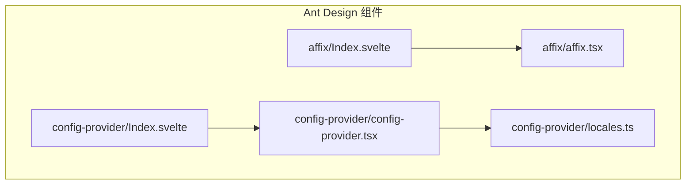
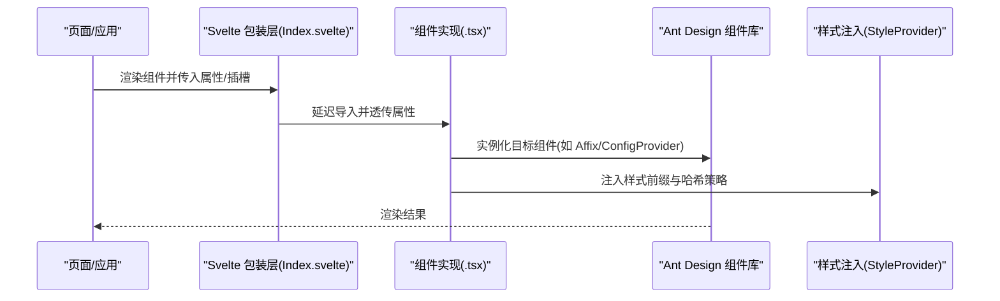
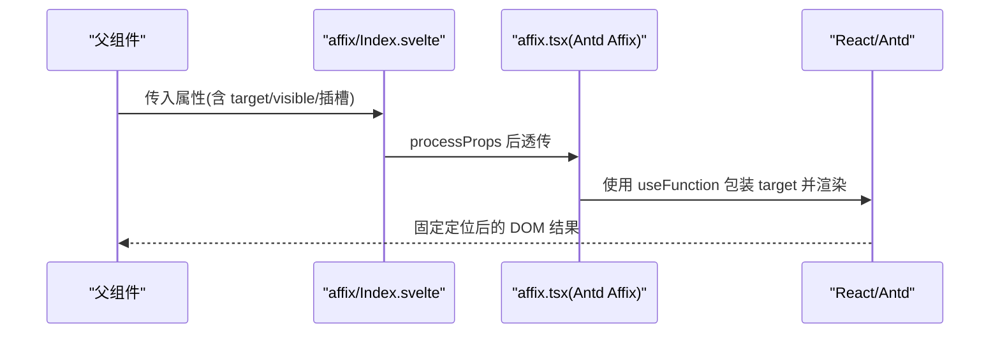
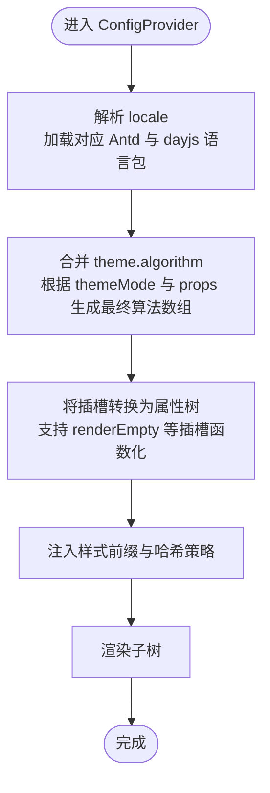
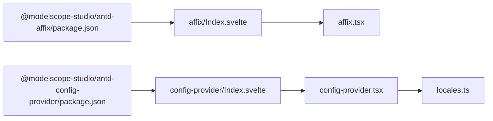

# 其他组件 API

<cite>
**本文引用的文件**
- [frontend/antd/affix/Index.svelte](file://frontend/antd/affix/Index.svelte)
- [frontend/antd/affix/affix.tsx](file://frontend/antd/affix/affix.tsx)
- [frontend/antd/affix/package.json](file://frontend/antd/affix/package.json)
- [frontend/antd/config-provider/Index.svelte](file://frontend/antd/config-provider/Index.svelte)
- [frontend/antd/config-provider/config-provider.tsx](file://frontend/antd/config-provider/config-provider.tsx)
- [frontend/antd/config-provider/locales.ts](file://frontend/antd/config-provider/locales.ts)
- [frontend/antd/config-provider/package.json](file://frontend/antd/config-provider/package.json)
- [docs/components/antd/affix/README.md](file://docs/components/antd/affix/README.md)
- [docs/components/antd/config_provider/README.md](file://docs/components/antd/config_provider/README.md)
</cite>

## 目录

1. [简介](#简介)
2. [项目结构](#项目结构)
3. [核心组件](#核心组件)
4. [架构总览](#架构总览)
5. [详细组件分析](#详细组件分析)
6. [依赖分析](#依赖分析)
7. [性能考虑](#性能考虑)
8. [故障排查指南](#故障排查指南)
9. [结论](#结论)
10. [附录](#附录)

## 简介

本文件面向 ModelScope Studio 的 Ant Design 特殊功能组件，系统性梳理 Affix（固定定位）与 ConfigProvider（全局配置）两大组件的 API、类型定义、上下文提供、主题与国际化机制、以及在组件系统中的集成方式。文档同时给出标准使用流程、典型场景与最佳实践，帮助开发者快速理解与正确使用。

## 项目结构

- 组件以 Svelte 包形式组织，每个组件目录包含：
  - Index.svelte：Gradio/Svelte 包装层，负责属性透传、插槽渲染、可见性控制与延迟加载。
  - 组件实现文件（如 affix.tsx、config-provider.tsx）：基于 @svelte-preprocess-react 将 React 组件桥接为 Svelte 可用形态，并扩展必要的类型与行为。
  - package.json：导出入口，支持 Gradio 与默认两种模式。
- 文档位于 docs/components/antd 下，提供示例与说明。

图表来源

- [frontend/antd/affix/Index.svelte:1-72](file://frontend/antd/affix/Index.svelte#L1-L72)
- [frontend/antd/affix/affix.tsx:1-14](file://frontend/antd/affix/affix.tsx#L1-L14)
- [frontend/antd/config-provider/Index.svelte:1-72](file://frontend/antd/config-provider/Index.svelte#L1-L72)
- [frontend/antd/config-provider/config-provider.tsx:1-154](file://frontend/antd/config-provider/config-provider.tsx#L1-L154)
- [frontend/antd/config-provider/locales.ts:1-863](file://frontend/antd/config-provider/locales.ts#L1-L863)

章节来源

- [frontend/antd/affix/Index.svelte:1-72](file://frontend/antd/affix/Index.svelte#L1-L72)
- [frontend/antd/affix/affix.tsx:1-14](file://frontend/antd/affix/affix.tsx#L1-L14)
- [frontend/antd/config-provider/Index.svelte:1-72](file://frontend/antd/config-provider/Index.svelte#L1-L72)
- [frontend/antd/config-provider/config-provider.tsx:1-154](file://frontend/antd/config-provider/config-provider.tsx#L1-L154)
- [frontend/antd/config-provider/locales.ts:1-863](file://frontend/antd/config-provider/locales.ts#L1-L863)
- [frontend/antd/affix/package.json:1-15](file://frontend/antd/affix/package.json#L1-L15)
- [frontend/antd/config-provider/package.json:1-15](file://frontend/antd/config-provider/package.json#L1-L15)
- [docs/components/antd/affix/README.md:1-9](file://docs/components/antd/affix/README.md#L1-L9)
- [docs/components/antd/config_provider/README.md:1-8](file://docs/components/antd/config_provider/README.md#L1-L8)

## 核心组件

- Affix（固定定位）
  - 职责：将子元素固定到视口或容器边界，常用于侧栏、回到顶部按钮等场景。
  - 关键点：通过 target 函数动态确定滚动容器；支持 visible 控制渲染；支持额外属性透传与插槽渲染。
- ConfigProvider（全局配置）
  - 职责：为 Ant Design 组件提供统一的全局配置，包括主题、语言、弹窗容器、空状态渲染等。
  - 关键点：支持主题算法开关（暗色/紧凑）、国际化语言切换、样式注入与容器函数回调；可作为上下文根节点使用。

章节来源

- [frontend/antd/affix/Index.svelte:1-72](file://frontend/antd/affix/Index.svelte#L1-L72)
- [frontend/antd/affix/affix.tsx:1-14](file://frontend/antd/affix/affix.tsx#L1-L14)
- [frontend/antd/config-provider/Index.svelte:1-72](file://frontend/antd/config-provider/Index.svelte#L1-L72)
- [frontend/antd/config-provider/config-provider.tsx:1-154](file://frontend/antd/config-provider/config-provider.tsx#L1-L154)

## 架构总览

下图展示从 Svelte 包装层到 React 组件的调用链路，以及 ConfigProvider 的主题与国际化处理流程。

图表来源

- [frontend/antd/affix/Index.svelte:55-68](file://frontend/antd/affix/Index.svelte#L55-L68)
- [frontend/antd/affix/affix.tsx:6-11](file://frontend/antd/affix/affix.tsx#L6-L11)
- [frontend/antd/config-provider/Index.svelte:54-71](file://frontend/antd/config-provider/Index.svelte#L54-L71)
- [frontend/antd/config-provider/config-provider.tsx:108-149](file://frontend/antd/config-provider/config-provider.tsx#L108-L149)

## 详细组件分析

### Affix 固定定位组件

- 组件职责
  - 将子内容固定在视口或指定容器边界，随滚动变化显示/隐藏。
- 属性与行为
  - 支持 target 容器函数，用于动态选择滚动容器。
  - 支持 visible 控制是否渲染。
  - 支持额外属性透传与插槽渲染。
- 使用场景
  - 侧边工具栏、回到顶部按钮、悬浮操作区等。
- 类型与实现要点
  - 通过 @svelte-preprocess-react 的 sveltify 将 Ant Design 的 Affix 桥接为 Svelte 组件。
  - target 通过 useFunction 包装，确保响应式更新。
- 示例与文档
  - 文档提供基础与“容器滚动”两个示例，便于快速上手。

图表来源

- [frontend/antd/affix/Index.svelte:23-49](file://frontend/antd/affix/Index.svelte#L23-L49)
- [frontend/antd/affix/affix.tsx:6-11](file://frontend/antd/affix/affix.tsx#L6-L11)

章节来源

- [frontend/antd/affix/Index.svelte:1-72](file://frontend/antd/affix/Index.svelte#L1-L72)
- [frontend/antd/affix/affix.tsx:1-14](file://frontend/antd/affix/affix.tsx#L1-L14)
- [docs/components/antd/affix/README.md:1-9](file://docs/components/antd/affix/README.md#L1-L9)

### ConfigProvider 全局配置组件

- 组件职责
  - 提供统一的全局配置，覆盖主题、语言、弹窗容器、空状态渲染等。
- 主题与算法
  - theme.algorithm 支持自动识别：暗色/紧凑算法可按 themeMode 或显式配置启用。
- 国际化
  - locale 支持多语言映射，根据浏览器语言或显式传入进行切换；同时设置 dayjs 的本地化。
- 插槽与属性组合
  - 支持将插槽转换为属性树，实现复杂配置项的声明式传递。
- 上下文与容器
  - 通过 setConfigType 标记为 antd 上下文，影响共享主题等行为。
  - 支持 getPopupContainer/getTargetContainer 自定义弹窗与挂载容器。

图表来源

- [frontend/antd/config-provider/config-provider.tsx:85-105](file://frontend/antd/config-provider/config-provider.tsx#L85-L105)
- [frontend/antd/config-provider/config-provider.tsx:127-143](file://frontend/antd/config-provider/config-provider.tsx#L127-L143)
- [frontend/antd/config-provider/config-provider.tsx:29-49](file://frontend/antd/config-provider/config-provider.tsx#L29-L49)
- [frontend/antd/config-provider/locales.ts:15-27](file://frontend/antd/config-provider/locales.ts#L15-L27)

章节来源

- [frontend/antd/config-provider/Index.svelte:1-72](file://frontend/antd/config-provider/Index.svelte#L1-L72)
- [frontend/antd/config-provider/config-provider.tsx:1-154](file://frontend/antd/config-provider/config-provider.tsx#L1-L154)
- [frontend/antd/config-provider/locales.ts:1-863](file://frontend/antd/config-provider/locales.ts#L1-L863)
- [docs/components/antd/config_provider/README.md:1-8](file://docs/components/antd/config_provider/README.md#L1-L8)

## 依赖分析

- 组件导出
  - 两者均通过 package.json 的 exports 字段提供 Gradio 与默认两种入口，便于在不同运行环境中使用。
- 运行时依赖
  - ConfigProvider 依赖 antd 的 ConfigProvider、主题算法与样式注入；同时依赖 dayjs 与 locales 映射。
  - Affix 依赖 antd 的 Affix 与 useFunction 工具以包装回调函数。
- 包装层耦合
  - 两组件均采用延迟导入与属性透传，降低初始加载压力，提升渲染可控性。

图表来源

- [frontend/antd/affix/package.json:1-15](file://frontend/antd/affix/package.json#L1-L15)
- [frontend/antd/config-provider/package.json:1-15](file://frontend/antd/config-provider/package.json#L1-L15)
- [frontend/antd/affix/Index.svelte:10-13](file://frontend/antd/affix/Index.svelte#L10-L13)
- [frontend/antd/config-provider/Index.svelte:11-13](file://frontend/antd/config-provider/Index.svelte#L11-L13)

章节来源

- [frontend/antd/affix/package.json:1-15](file://frontend/antd/affix/package.json#L1-L15)
- [frontend/antd/config-provider/package.json:1-15](file://frontend/antd/config-provider/package.json#L1-L15)

## 性能考虑

- 延迟加载
  - 通过 importComponent 与 {#await} 模式按需加载组件实现，避免首屏阻塞。
- 属性透传与派生计算
  - 使用 processProps 与 $derived 避免不必要的重渲染，仅在必要属性变化时更新。
- 样式注入策略
  - 使用 StyleProvider 并设置高优先级哈希，减少样式冲突与重绘成本。
- 回调函数包装
  - 使用 useFunction 包装 target/getPopupContainer 等回调，确保函数引用稳定，减少无效更新。

## 故障排查指南

- 固定定位不生效
  - 检查 target 是否返回正确的滚动容器；确认 visible 为 true 且容器存在滚动条。
  - 参考路径：[frontend/antd/affix/Index.svelte:47-49](file://frontend/antd/affix/Index.svelte#L47-L49)、[frontend/antd/affix/affix.tsx:7-10](file://frontend/antd/affix/affix.tsx#L7-L10)
- 弹窗/浮层位置异常
  - 检查 getPopupContainer 返回值是否指向正确容器；确认 ConfigProvider 的 getTargetContainer 设置。
  - 参考路径：[frontend/antd/config-provider/config-provider.tsx:93-95](file://frontend/antd/config-provider/config-provider.tsx#L93-L95)
- 主题未切换或算法未生效
  - 确认 themeMode 与 theme.algorithm 的组合；注意算法数组由多个算法函数组成。
  - 参考路径：[frontend/antd/config-provider/config-provider.tsx:88-91](file://frontend/antd/config-provider/config-provider.tsx#L88-L91)、[frontend/antd/config-provider/config-provider.tsx:127-143](file://frontend/antd/config-provider/config-provider.tsx#L127-L143)
- 国际化语言未生效
  - 检查 locale 参数格式与 locales 映射；确认 dayjs 语言已同步设置。
  - 参考路径：[frontend/antd/config-provider/config-provider.tsx:85-105](file://frontend/antd/config-provider/config-provider.tsx#L85-L105)、[frontend/antd/config-provider/locales.ts:15-27](file://frontend/antd/config-provider/locales.ts#L15-L27)

章节来源

- [frontend/antd/affix/Index.svelte:47-49](file://frontend/antd/affix/Index.svelte#L47-L49)
- [frontend/antd/affix/affix.tsx:7-10](file://frontend/antd/affix/affix.tsx#L7-L10)
- [frontend/antd/config-provider/config-provider.tsx:85-105](file://frontend/antd/config-provider/config-provider.tsx#L85-L105)
- [frontend/antd/config-provider/config-provider.tsx:88-91](file://frontend/antd/config-provider/config-provider.tsx#L88-L91)
- [frontend/antd/config-provider/config-provider.tsx:127-143](file://frontend/antd/config-provider/config-provider.tsx#L127-L143)
- [frontend/antd/config-provider/locales.ts:15-27](file://frontend/antd/config-provider/locales.ts#L15-L27)

## 结论

- Affix 与 ConfigProvider 在 ModelScope Studio 中通过统一的 Svelte 包装层与 @svelte-preprocess-react 桥接，实现了与 Ant Design 组件库的无缝集成。
- ConfigProvider 提供了强大的全局配置能力，涵盖主题、国际化与容器策略；Affix 则专注于固定定位场景，具备良好的可配置性与性能表现。
- 建议在应用根部放置 ConfigProvider 以统一风格与语言；对需要固定定位的区域使用 Affix，并合理设置 target 与 visible。

## 附录

- 示例与演示
  - Affix 示例：基础、容器滚动
  - ConfigProvider 示例：基础
- 参考文档
  - Ant Design 官方 Affix 与 ConfigProvider 文档链接见各组件 README

章节来源

- [docs/components/antd/affix/README.md:1-9](file://docs/components/antd/affix/README.md#L1-L9)
- [docs/components/antd/config_provider/README.md:1-8](file://docs/components/antd/config_provider/README.md#L1-L8)
