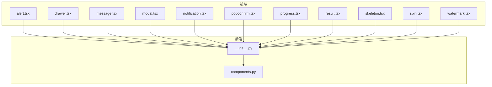
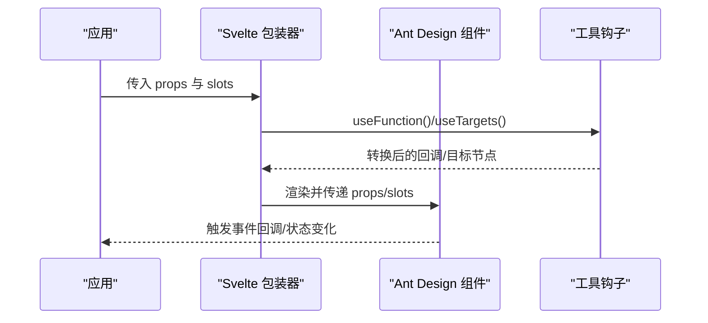
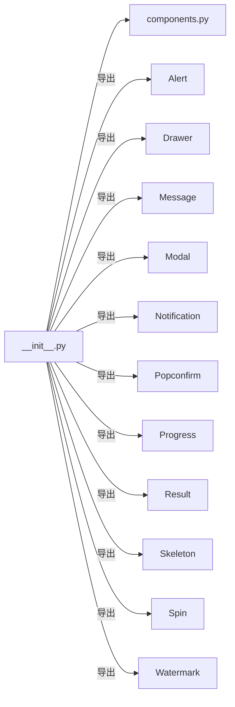

# 反馈组件 API

<cite>
**本文引用的文件**
- [frontend/antd/alert/alert.tsx](file://frontend/antd/alert/alert.tsx)
- [frontend/antd/drawer/drawer.tsx](file://frontend/antd/drawer/drawer.tsx)
- [frontend/antd/message/message.tsx](file://frontend/antd/message/message.tsx)
- [frontend/antd/modal/modal.tsx](file://frontend/antd/modal/modal.tsx)
- [frontend/antd/notification/notification.tsx](file://frontend/antd/notification/notification.tsx)
- [frontend/antd/popconfirm/popconfirm.tsx](file://frontend/antd/popconfirm/popconfirm.tsx)
- [frontend/antd/progress/progress.tsx](file://frontend/antd/progress/progress.tsx)
- [frontend/antd/result/result.tsx](file://frontend/antd/result/result.tsx)
- [frontend/antd/skeleton/skeleton.tsx](file://frontend/antd/skeleton/skeleton.tsx)
- [frontend/antd/spin/spin.tsx](file://frontend/antd/spin/spin.tsx)
- [frontend/antd/watermark/watermark.tsx](file://frontend/antd/watermark/watermark.tsx)
- [backend/modelscope_studio/components/antd/__init__.py](file://backend/modelscope_studio/components/antd/__init__.py)
- [backend/modelscope_studio/components/antd/components.py](file://backend/modelscope_studio/components/antd/components.py)
- [docs/components/antd/alert/README.md](file://docs/components/antd/alert/README.md)
- [docs/components/antd/drawer/README.md](file://docs/components/antd/drawer/README.md)
</cite>

## 目录

1. [简介](#简介)
2. [项目结构](#项目结构)
3. [核心组件](#核心组件)
4. [架构总览](#架构总览)
5. [详细组件分析](#详细组件分析)
6. [依赖关系分析](#依赖关系分析)
7. [性能考量](#性能考量)
8. [故障排查指南](#故障排查指南)
9. [结论](#结论)
10. [附录](#附录)

## 简介

本文件为 ModelScope Studio 中基于 Ant Design 的反馈类组件 API 参考文档，覆盖以下组件：Alert（警告提示）、Drawer（抽屉面板）、Message（全局消息）、Modal（对话框）、Notification（通知提醒）、Popconfirm（气泡确认）、Progress（进度条）、Result（结果页）、Skeleton（骨架屏）、Spin（加载中）、Watermark（水印）。内容包括：

- 属性定义与类型约束
- 状态管理与生命周期
- 动画与交互逻辑
- 标准实例化与配置示例路径
- 事件回调与异步处理
- 无障碍与用户体验设计原则

## 项目结构

反馈组件在前端以 Svelte 包装器形式桥接 Ant Design React 组件，并通过后端 Python 模块统一导出，便于在应用中按需引入。

图表来源

- [frontend/antd/alert/alert.tsx:1-46](file://frontend/antd/alert/alert.tsx#L1-L46)
- [frontend/antd/drawer/drawer.tsx:1-60](file://frontend/antd/drawer/drawer.tsx#L1-L60)
- [frontend/antd/message/message.tsx:1-79](file://frontend/antd/message/message.tsx#L1-L79)
- [frontend/antd/modal/modal.tsx:1-107](file://frontend/antd/modal/modal.tsx#L1-L107)
- [frontend/antd/notification/notification.tsx:1-106](file://frontend/antd/notification/notification.tsx#L1-L106)
- [frontend/antd/popconfirm/popconfirm.tsx:1-65](file://frontend/antd/popconfirm/popconfirm.tsx#L1-L65)
- [frontend/antd/progress/progress.tsx:1-24](file://frontend/antd/progress/progress.tsx#L1-L24)
- [frontend/antd/result/result.tsx:1-33](file://frontend/antd/result/result.tsx#L1-L33)
- [frontend/antd/skeleton/skeleton.tsx:1-7](file://frontend/antd/skeleton/skeleton.tsx#L1-L7)
- [frontend/antd/spin/spin.tsx:1-38](file://frontend/antd/spin/spin.tsx#L1-L38)
- [frontend/antd/watermark/watermark.tsx:1-6](file://frontend/antd/watermark/watermark.tsx#L1-L6)
- [backend/modelscope_studio/components/antd/**init**.py:1-151](file://backend/modelscope_studio/components/antd/__init__.py#L1-L151)
- [backend/modelscope_studio/components/antd/components.py:1-145](file://backend/modelscope_studio/components/antd/components.py#L1-L145)

章节来源

- [backend/modelscope_studio/components/antd/**init**.py:1-151](file://backend/modelscope_studio/components/antd/__init__.py#L1-L151)
- [backend/modelscope_studio/components/antd/components.py:1-145](file://backend/modelscope_studio/components/antd/components.py#L1-L145)

## 核心组件

- Alert：用于展示需要用户关注的警告信息，支持描述、图标、可关闭、操作按钮等插槽扩展。
- Drawer：从屏幕边缘滑出的抽屉面板，支持标题、页脚、额外操作、渲染钩子等。
- Message：全局提示消息，支持可见性控制、自定义内容与图标、销毁与打开。
- Modal：模态对话框，支持标题、页脚、按钮图标、渲染钩子、容器挂载等。
- Notification：全局通知提醒，支持位置、动作、关闭图标、描述、消息等。
- Popconfirm：气泡确认，支持确认/取消文案与图标、弹层容器。
- Progress：进度条，支持格式化与取整函数。
- Result：结果页，支持标题、副标题、图标、额外操作等。
- Skeleton：骨架屏占位。
- Spin：加载中，支持提示文本与指示器插槽。
- Watermark：水印。

章节来源

- [frontend/antd/alert/alert.tsx:1-46](file://frontend/antd/alert/alert.tsx#L1-L46)
- [frontend/antd/drawer/drawer.tsx:1-60](file://frontend/antd/drawer/drawer.tsx#L1-L60)
- [frontend/antd/message/message.tsx:1-79](file://frontend/antd/message/message.tsx#L1-L79)
- [frontend/antd/modal/modal.tsx:1-107](file://frontend/antd/modal/modal.tsx#L1-L107)
- [frontend/antd/notification/notification.tsx:1-106](file://frontend/antd/notification/notification.tsx#L1-L106)
- [frontend/antd/popconfirm/popconfirm.tsx:1-65](file://frontend/antd/popconfirm/popconfirm.tsx#L1-L65)
- [frontend/antd/progress/progress.tsx:1-24](file://frontend/antd/progress/progress.tsx#L1-L24)
- [frontend/antd/result/result.tsx:1-33](file://frontend/antd/result/result.tsx#L1-L33)
- [frontend/antd/skeleton/skeleton.tsx:1-7](file://frontend/antd/skeleton/skeleton.tsx#L1-L7)
- [frontend/antd/spin/spin.tsx:1-38](file://frontend/antd/spin/spin.tsx#L1-L38)
- [frontend/antd/watermark/watermark.tsx:1-6](file://frontend/antd/watermark/watermark.tsx#L1-L6)

## 架构总览

反馈组件采用“Svelte 包装器 + Ant Design React 组件 + 后端统一导出”的分层架构：

- 前端层：每个组件以 sveltify 包装 Ant Design 组件，支持 slots 插槽与函数回调转换。
- 交互层：通过 useFunction/useTargets 等工具实现回调与子节点的桥接。
- 导出层：Python 模块集中导出各组件，便于在应用中统一引用。

图表来源

- [frontend/antd/alert/alert.tsx:12-43](file://frontend/antd/alert/alert.tsx#L12-L43)
- [frontend/antd/drawer/drawer.tsx:24-57](file://frontend/antd/drawer/drawer.tsx#L24-L57)
- [frontend/antd/message/message.tsx:18-76](file://frontend/antd/message/message.tsx#L18-L76)
- [frontend/antd/modal/modal.tsx:22-104](file://frontend/antd/modal/modal.tsx#L22-L104)
- [frontend/antd/notification/notification.tsx:17-103](file://frontend/antd/notification/notification.tsx#L17-L103)

## 详细组件分析

### Alert（警告提示）

- 关键能力
  - 支持 message、description、icon、action、closable.closeIcon 等插槽
  - afterClose 回调通过 useFunction 转换
- 生命周期
  - 组件挂载后根据 props 渲染；关闭后触发 afterClose
- 交互与动画
  - 由 Ant Design 内置动画与过渡控制
- 示例路径
  - [docs/components/antd/alert/README.md:1-8](file://docs/components/antd/alert/README.md#L1-L8)

章节来源

- [frontend/antd/alert/alert.tsx:7-43](file://frontend/antd/alert/alert.tsx#L7-L43)

### Drawer（抽屉面板）

- 关键能力
  - 支持 title、footer、extra、closeIcon、closable.closeIcon、drawerRender 等插槽
  - afterOpenChange、getContainer、drawerRender 通过 useFunction/renderParamsSlot 处理
- 生命周期
  - 打开/关闭状态变更时触发 afterOpenChange
- 交互与动画
  - Ant Design 抽屉滑入滑出动画
- 示例路径
  - [docs/components/antd/drawer/README.md:1-9](file://docs/components/antd/drawer/README.md#L1-L9)

章节来源

- [frontend/antd/drawer/drawer.tsx:8-57](file://frontend/antd/drawer/drawer.tsx#L8-L57)

### Message（全局消息）

- 关键能力
  - 通过 message.useMessage 获取 API
  - 支持 visible 控制显示/隐藏，onVisible 回调
  - content、icon 插槽支持自定义
  - getContainer 函数化处理
- 生命周期
  - visible=true 时 open，visible=false 或卸载时 destroy
- 异步与事件
  - onClose 同时触发 onVisible(false) 与原 onClose
- 示例路径
  - 参见各组件 README 的 demo 示例

章节来源

- [frontend/antd/message/message.tsx:9-76](file://frontend/antd/message/message.tsx#L9-L76)

### Modal（对话框）

- 关键能力
  - 支持 okText、okButtonProps.icon、cancelText、cancelButtonProps.icon、footer、title、modalRender、closable.closeIcon、closeIcon 等
  - afterOpenChange、afterClose、getContainer、footer、modalRender 通过 useFunction/renderParamsSlot 处理
- 生命周期
  - 打开/关闭状态变更触发 afterOpenChange/afterClose
- 交互与动画
  - Ant Design 对话框开合动画与遮罩层行为

章节来源

- [frontend/antd/modal/modal.tsx:8-104](file://frontend/antd/modal/modal.tsx#L8-L104)

### Notification（通知提醒）

- 关键能力
  - 通过 notification.useNotification 获取 API
  - 支持 visible 控制显示/隐藏，onVisible 回调
  - 支持 btn、actions、closeIcon、description、icon、message 插槽
  - 位置参数：top、bottom、rtl、stack
- 生命周期
  - visible=true 时 open，visible=false 或卸载时 destroy
- 异步与事件
  - onClose 同时触发 onVisible(false) 与原 onClose

章节来源

- [frontend/antd/notification/notification.tsx:8-103](file://frontend/antd/notification/notification.tsx#L8-L103)

### Popconfirm（气泡确认）

- 关键能力
  - 支持 okText、okButtonProps.icon、cancelText、cancelButtonProps.icon、title、description
  - afterOpenChange、getPopupContainer 通过 useFunction 处理
- 生命周期
  - 弹层打开/关闭时触发 afterOpenChange
- 交互与动画
  - Ant Design 气泡确认弹层行为

章节来源

- [frontend/antd/popconfirm/popconfirm.tsx:7-62](file://frontend/antd/popconfirm/popconfirm.tsx#L7-L62)

### Progress（进度条）

- 关键能力
  - 支持 format、rounding 函数化处理
- 性能与复杂度
  - 纯展示组件，无复杂计算

章节来源

- [frontend/antd/progress/progress.tsx:5-21](file://frontend/antd/progress/progress.tsx#L5-L21)

### Result（结果页）

- 关键能力
  - 支持 title、subTitle、icon、extra 插槽
  - 使用 useTargets 管理子节点渲染策略
- 生命周期
  - 有插槽时渲染子节点，否则隐藏默认 children

章节来源

- [frontend/antd/result/result.tsx:7-30](file://frontend/antd/result/result.tsx#L7-L30)

### Skeleton（骨架屏）

- 关键能力
  - 直接包装 Ant Design Skeleton
- 使用建议
  - 用于数据加载前的占位展示

章节来源

- [frontend/antd/skeleton/skeleton.tsx:1-7](file://frontend/antd/skeleton/skeleton.tsx#L1-L7)

### Spin（加载中）

- 关键能力
  - 支持 tip、indicator 插槽
  - 使用 useTargets 控制子节点显示/隐藏
- 生命周期
  - 无插槽时显示 children，有插槽时隐藏 children 并交由 Spin 渲染

章节来源

- [frontend/antd/spin/spin.tsx:7-35](file://frontend/antd/spin/spin.tsx#L7-L35)

### Watermark（水印）

- 关键能力
  - 直接包装 Ant Design Watermark
- 使用建议
  - 用于内容保护与版权标识

章节来源

- [frontend/antd/watermark/watermark.tsx:1-6](file://frontend/antd/watermark/watermark.tsx#L1-L6)

## 依赖关系分析

- 统一导出
  - 后端模块集中导出各组件，便于应用侧统一导入与别名管理
- 组件间耦合
  - 各组件相对独立，主要通过 Ant Design 生态与通用工具钩子协作

图表来源

- [backend/modelscope_studio/components/antd/**init**.py:1-151](file://backend/modelscope_studio/components/antd/__init__.py#L1-L151)
- [backend/modelscope_studio/components/antd/components.py:1-145](file://backend/modelscope_studio/components/antd/components.py#L1-L145)

章节来源

- [backend/modelscope_studio/components/antd/**init**.py:1-151](file://backend/modelscope_studio/components/antd/__init__.py#L1-L151)
- [backend/modelscope_studio/components/antd/components.py:1-145](file://backend/modelscope_studio/components/antd/components.py#L1-L145)

## 性能考量

- 插槽与函数转换
  - 使用 useFunction 将回调函数桥接到 React 环境，避免重复创建导致的重渲染
- 条件渲染
  - Result/Spin 通过 useTargets 精准控制子节点渲染，减少不必要的 DOM 结构
- 销毁与清理
  - Message/Notification 在卸载或 visible=false 时主动 destroy，避免内存泄漏与重复提示

## 故障排查指南

- 插槽未生效
  - 确认插槽名称与组件定义一致（如 closable.closeIcon、okButtonProps.icon 等）
- 回调不触发
  - 检查是否通过 useFunction 包装回调，确保函数签名与 Ant Design 期望一致
- 容器挂载问题
  - getContainer 支持字符串选择器或函数，若传入字符串则内部会转为函数处理
- 通知/消息未消失
  - 确保 visible=false 或组件卸载时触发 destroy；检查 onClose 回调链路

章节来源

- [frontend/antd/alert/alert.tsx:12-43](file://frontend/antd/alert/alert.tsx#L12-L43)
- [frontend/antd/drawer/drawer.tsx:24-57](file://frontend/antd/drawer/drawer.tsx#L24-L57)
- [frontend/antd/message/message.tsx:35-68](file://frontend/antd/message/message.tsx#L35-L68)
- [frontend/antd/notification/notification.tsx:38-95](file://frontend/antd/notification/notification.tsx#L38-L95)

## 结论

ModelScope Studio 的反馈组件通过统一的 Svelte 包装器与工具钩子，实现了对 Ant Design 组件的灵活扩展与一致化使用体验。开发者可通过插槽与函数化回调快速定制交互与视觉表现，同时借助后端统一导出简化模块管理。建议在实际业务中结合加载策略、可见性控制与无障碍要求，合理使用各反馈组件以提升用户体验。

## 附录

- 示例与演示
  - 参考各组件 README 的 demo 示例进行快速上手
    - [docs/components/antd/alert/README.md:1-8](file://docs/components/antd/alert/README.md#L1-L8)
    - [docs/components/antd/drawer/README.md:1-9](file://docs/components/antd/drawer/README.md#L1-L9)
