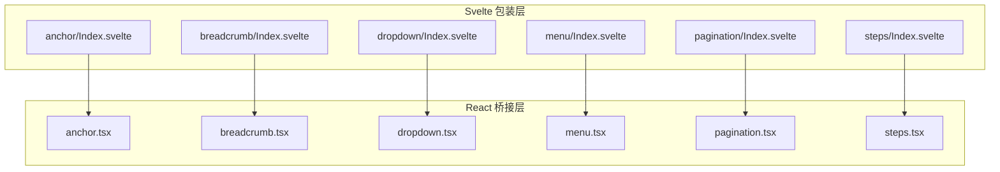
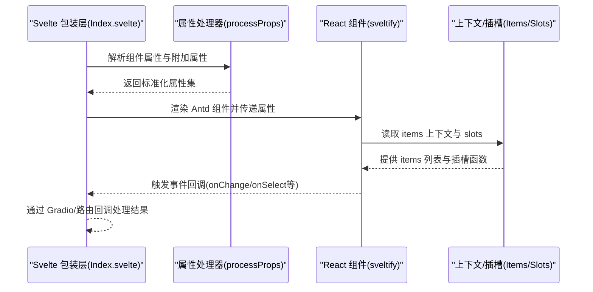
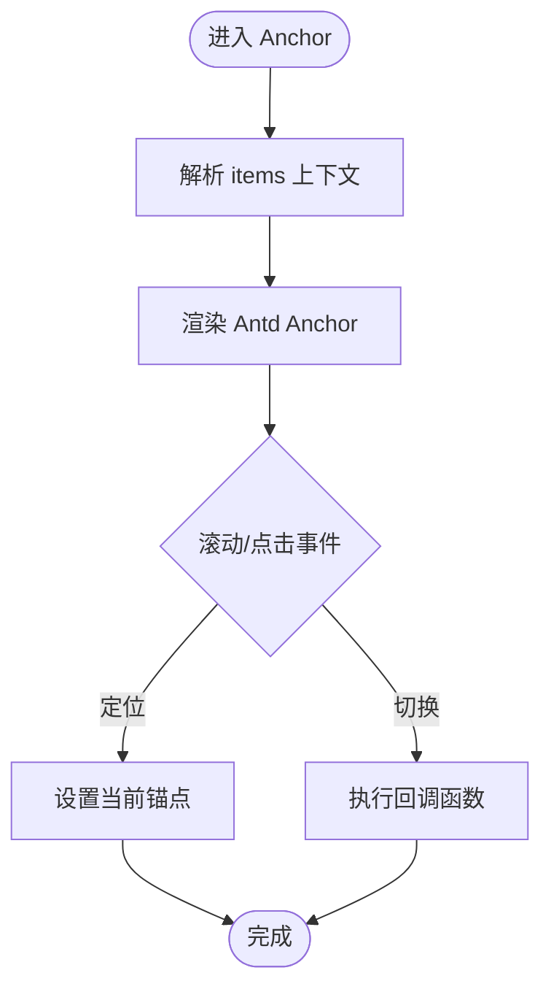
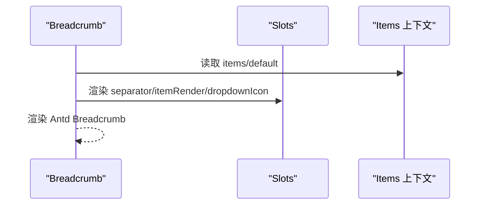
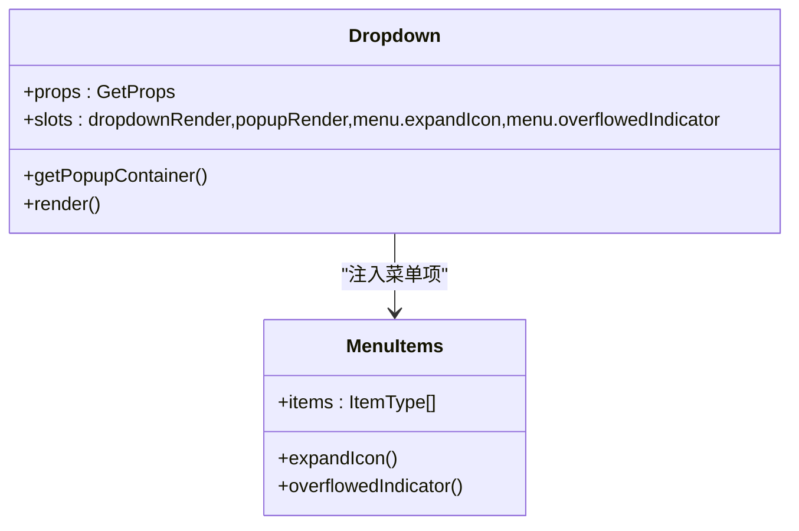
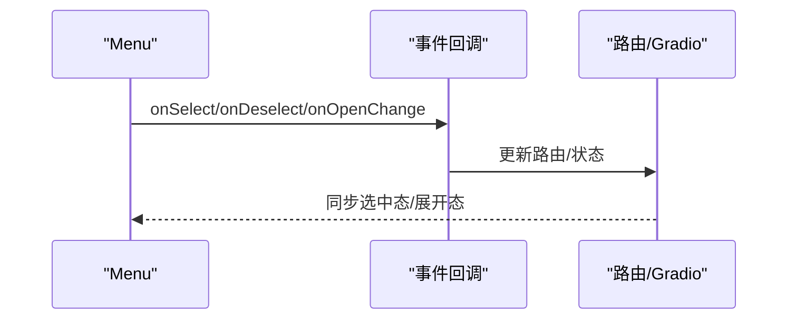
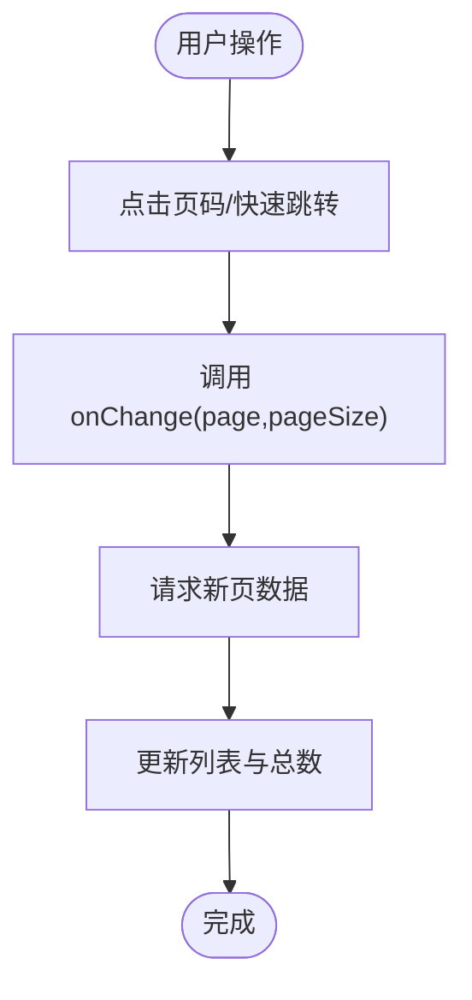
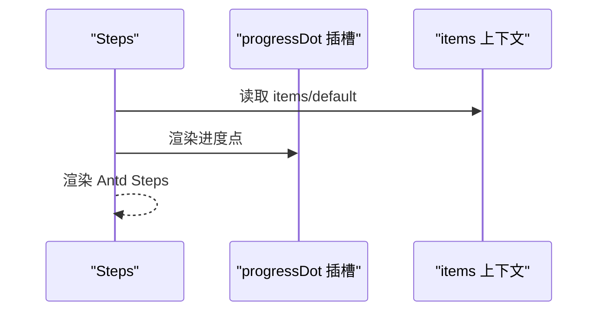
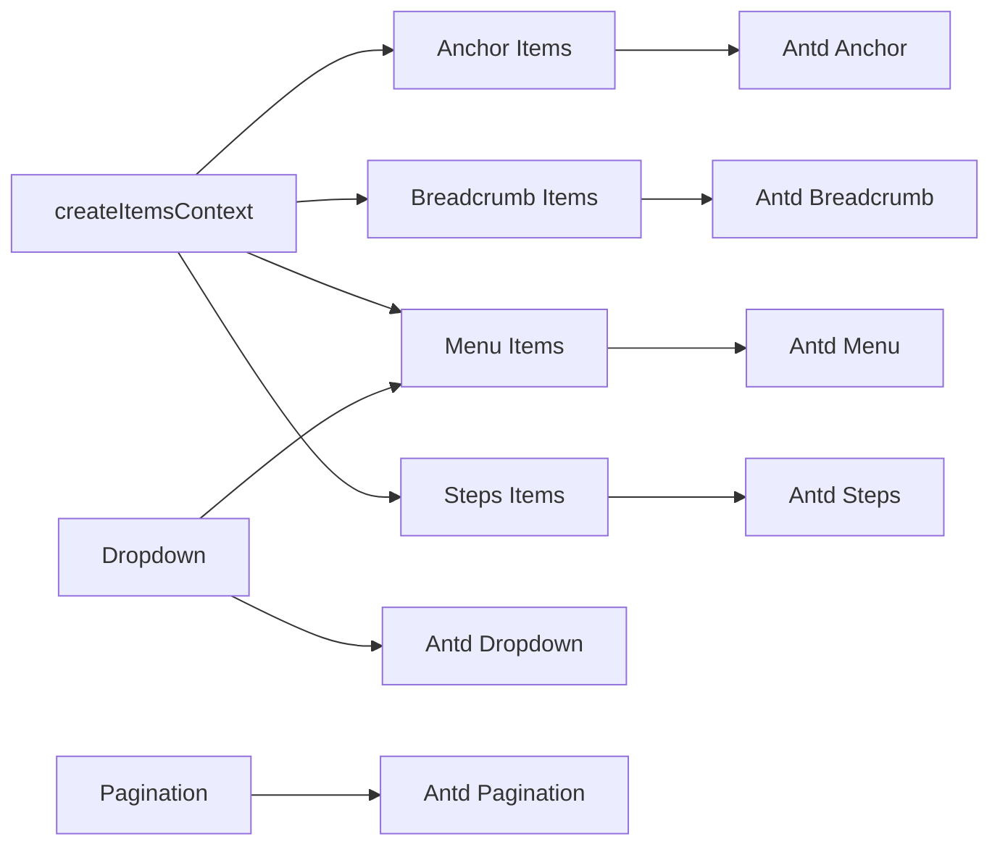

# 导航组件 API

<cite>
**本文引用的文件**
- [frontend/antd/anchor/Index.svelte](file://frontend/antd/anchor/Index.svelte)
- [frontend/antd/anchor/anchor.tsx](file://frontend/antd/anchor/anchor.tsx)
- [frontend/antd/anchor/context.ts](file://frontend/antd/anchor/context.ts)
- [frontend/antd/breadcrumb/Index.svelte](file://frontend/antd/breadcrumb/Index.svelte)
- [frontend/antd/breadcrumb/breadcrumb.tsx](file://frontend/antd/breadcrumb/breadcrumb.tsx)
- [frontend/antd/breadcrumb/context.ts](file://frontend/antd/breadcrumb/context.ts)
- [frontend/antd/breadcrumb/item/Index.svelte](file://frontend/antd/breadcrumb/item/Index.svelte)
- [frontend/antd/dropdown/Index.svelte](file://frontend/antd/dropdown/Index.svelte)
- [frontend/antd/dropdown/dropdown.tsx](file://frontend/antd/dropdown/dropdown.tsx)
- [frontend/antd/menu/Index.svelte](file://frontend/antd/menu/Index.svelte)
- [frontend/antd/menu/menu.tsx](file://frontend/antd/menu/menu.tsx)
- [frontend/antd/menu/context.ts](file://frontend/antd/menu/context.ts)
- [frontend/antd/menu/item/Index.svelte](file://frontend/antd/menu/item/Index.svelte)
- [frontend/antd/pagination/Index.svelte](file://frontend/antd/pagination/Index.svelte)
- [frontend/antd/pagination/pagination.tsx](file://frontend/antd/pagination/pagination.tsx)
- [frontend/antd/steps/Index.svelte](file://frontend/antd/steps/Index.svelte)
- [frontend/antd/steps/steps.tsx](file://frontend/antd/steps/steps.tsx)
- [frontend/antd/steps/context.ts](file://frontend/antd/steps/context.ts)
</cite>

## 目录

1. [简介](#简介)
2. [项目结构](#项目结构)
3. [核心组件](#核心组件)
4. [架构总览](#架构总览)
5. [详细组件分析](#详细组件分析)
6. [依赖关系分析](#依赖关系分析)
7. [性能考量](#性能考量)
8. [故障排查指南](#故障排查指南)
9. [结论](#结论)
10. [附录](#附录)

## 简介

本文件为 ModelScope Studio 中基于 Ant Design 的导航类组件 API 参考文档，覆盖以下组件：Anchor（锚点）、Breadcrumb（面包屑）、Dropdown（下拉菜单）、Menu（菜单）、Pagination（分页）、Steps（步骤条）。文档从架构设计、数据流、处理逻辑、类型定义、事件绑定、路由集成、权限控制与动态加载等方面进行系统性梳理，并提供可复用的使用范式与最佳实践。

## 项目结构

导航组件在前端采用统一的“Svelte 包装层 + React 组件桥接”的模式：

- Svelte 层负责属性透传、可见性控制、样式注入、插槽渲染与延迟加载。
- React 层通过 sveltify 将 Ant Design 原生组件桥接到 Svelte 生态，同时提供插槽渲染、函数钩子与上下文注入能力。

图表来源

- [frontend/antd/anchor/Index.svelte:1-66](file://frontend/antd/anchor/Index.svelte#L1-L66)
- [frontend/antd/anchor/anchor.tsx:1-46](file://frontend/antd/anchor/anchor.tsx#L1-L46)
- [frontend/antd/breadcrumb/Index.svelte:1-78](file://frontend/antd/breadcrumb/Index.svelte#L1-L78)
- [frontend/antd/breadcrumb/breadcrumb.tsx:1-67](file://frontend/antd/breadcrumb/breadcrumb.tsx#L1-L67)
- [frontend/antd/dropdown/Index.svelte:1-70](file://frontend/antd/dropdown/Index.svelte#L1-L70)
- [frontend/antd/dropdown/dropdown.tsx:1-111](file://frontend/antd/dropdown/dropdown.tsx#L1-L111)
- [frontend/antd/menu/Index.svelte:1-75](file://frontend/antd/menu/Index.svelte#L1-L75)
- [frontend/antd/menu/menu.tsx:1-96](file://frontend/antd/menu/menu.tsx#L1-L96)
- [frontend/antd/pagination/Index.svelte:1-68](file://frontend/antd/pagination/Index.svelte#L1-L68)
- [frontend/antd/pagination/pagination.tsx:1-55](file://frontend/antd/pagination/pagination.tsx#L1-L55)
- [frontend/antd/steps/Index.svelte:1-63](file://frontend/antd/steps/Index.svelte#L1-L63)
- [frontend/antd/steps/steps.tsx:1-52](file://frontend/antd/steps/steps.tsx#L1-L52)

章节来源

- [frontend/antd/anchor/Index.svelte:1-66](file://frontend/antd/anchor/Index.svelte#L1-L66)
- [frontend/antd/breadcrumb/Index.svelte:1-78](file://frontend/antd/breadcrumb/Index.svelte#L1-L78)
- [frontend/antd/dropdown/Index.svelte:1-70](file://frontend/antd/dropdown/Index.svelte#L1-L70)
- [frontend/antd/menu/Index.svelte:1-75](file://frontend/antd/menu/Index.svelte#L1-L75)
- [frontend/antd/pagination/Index.svelte:1-68](file://frontend/antd/pagination/Index.svelte#L1-L68)
- [frontend/antd/steps/Index.svelte:1-63](file://frontend/antd/steps/Index.svelte#L1-L63)

## 核心组件

本节概述六个导航组件的职责与通用特性：

- Anchor：用于页面内锚点跳转与滚动定位，支持容器选择与当前锚点回调。
- Breadcrumb：展示当前页面在层级结构中的位置，支持自定义分隔符、项渲染与下拉图标。
- Dropdown：包裹触发元素并渲染下拉菜单，支持自定义弹出渲染与菜单项注入。
- Menu：侧边或顶部导航菜单，支持主题、展开图标、溢出指示器与选择/展开事件。
- Pagination：数据分页控件，支持快速跳转按钮与页码渲染自定义。
- Steps：步骤流程指示器，支持步骤项列表与进度点自定义渲染。

章节来源

- [frontend/antd/anchor/anchor.tsx:1-46](file://frontend/antd/anchor/anchor.tsx#L1-L46)
- [frontend/antd/breadcrumb/breadcrumb.tsx:1-67](file://frontend/antd/breadcrumb/breadcrumb.tsx#L1-L67)
- [frontend/antd/dropdown/dropdown.tsx:1-111](file://frontend/antd/dropdown/dropdown.tsx#L1-L111)
- [frontend/antd/menu/menu.tsx:1-96](file://frontend/antd/menu/menu.tsx#L1-L96)
- [frontend/antd/pagination/pagination.tsx:1-55](file://frontend/antd/pagination/pagination.tsx#L1-L55)
- [frontend/antd/steps/steps.tsx:1-52](file://frontend/antd/steps/steps.tsx#L1-L52)

## 架构总览

组件桥接采用“延迟加载 + 插槽渲染 + 函数钩子”的统一模式：

- 属性透传：包装层将 visible、elem_id、elem_classes、elem_style、\_internal、as_item 等通用属性透传给 React 组件。
- 插槽渲染：通过 ReactSlot 与 renderParamsSlot 支持 slot 名称映射与参数化渲染。
- 动态注入：通过 withItemsContextProvider 注入 items 列表，支持默认插槽与显式 items 参数。
- 事件绑定：onOpenChange、onSelect、onDeselect、onChange 等事件通过 useFunction 钩子确保响应式更新。

图表来源

- [frontend/antd/anchor/Index.svelte:22-44](file://frontend/antd/anchor/Index.svelte#L22-L44)
- [frontend/antd/anchor/anchor.tsx:10-43](file://frontend/antd/anchor/anchor.tsx#L10-L43)
- [frontend/antd/breadcrumb/breadcrumb.tsx:15-63](file://frontend/antd/breadcrumb/breadcrumb.tsx#L15-L63)
- [frontend/antd/dropdown/dropdown.tsx:26-108](file://frontend/antd/dropdown/dropdown.tsx#L26-L108)
- [frontend/antd/menu/menu.tsx:18-92](file://frontend/antd/menu/menu.tsx#L18-L92)
- [frontend/antd/pagination/pagination.tsx:14-52](file://frontend/antd/pagination/pagination.tsx#L14-L52)
- [frontend/antd/steps/steps.tsx:16-49](file://frontend/antd/steps/steps.tsx#L16-L49)

## 详细组件分析

### Anchor（锚点）

- 职责：提供页面内锚点导航，支持容器选择与当前锚点回调。
- 关键属性与行为
  - 容器选择：getContainer 用于指定滚动容器。
  - 当前锚点：getCurrentAnchor 用于获取当前激活锚点。
  - items 注入：通过上下文注入 items，支持默认插槽与显式 items。
- 事件与状态
  - 无显式事件回调；通过回调函数实现滚动定位与高亮同步。
- 使用要点
  - 在长页面中配合锚点项使用，确保容器正确设置。
  - 通过插槽渲染自定义锚点标题。

图表来源

- [frontend/antd/anchor/anchor.tsx:10-43](file://frontend/antd/anchor/anchor.tsx#L10-L43)
- [frontend/antd/anchor/context.ts:1-7](file://frontend/antd/anchor/context.ts#L1-L7)

章节来源

- [frontend/antd/anchor/Index.svelte:1-66](file://frontend/antd/anchor/Index.svelte#L1-L66)
- [frontend/antd/anchor/anchor.tsx:1-46](file://frontend/antd/anchor/anchor.tsx#L1-L46)
- [frontend/antd/anchor/context.ts:1-7](file://frontend/antd/anchor/context.ts#L1-L7)

### Breadcrumb（面包屑）

- 职责：显示当前页面在层级结构中的路径，支持自定义分隔符、项渲染与下拉图标。
- 关键属性与行为
  - 分隔符：separator 支持插槽与函数。
  - 项渲染：itemRender 支持插槽与函数。
  - 下拉图标：dropdownIcon 支持插槽。
  - items 注入：支持 default 与 items 插槽。
- 事件与状态
  - 通过 props 与 slots 控制渲染；无直接事件回调。
- 使用要点
  - 结合路由系统生成层级结构，必要时使用 itemRender 自定义链接样式。

图表来源

- [frontend/antd/breadcrumb/breadcrumb.tsx:15-63](file://frontend/antd/breadcrumb/breadcrumb.tsx#L15-L63)
- [frontend/antd/breadcrumb/context.ts:1-7](file://frontend/antd/breadcrumb/context.ts#L1-L7)

章节来源

- [frontend/antd/breadcrumb/Index.svelte:1-78](file://frontend/antd/breadcrumb/Index.svelte#L1-L78)
- [frontend/antd/breadcrumb/breadcrumb.tsx:1-67](file://frontend/antd/breadcrumb/breadcrumb.tsx#L1-L67)
- [frontend/antd/breadcrumb/context.ts:1-7](file://frontend/antd/breadcrumb/context.ts#L1-L7)
- [frontend/antd/breadcrumb/item/Index.svelte:1-72](file://frontend/antd/breadcrumb/item/Index.svelte#L1-L72)

### Dropdown（下拉菜单）

- 职责：包裹触发元素并渲染下拉菜单，支持自定义弹出渲染与菜单项注入。
- 关键属性与行为
  - 弹出容器：getPopupContainer。
  - 下拉渲染：dropdownRender、popupRender 支持插槽与函数。
  - 菜单扩展图标：menu.expandIcon 支持插槽。
  - 溢出指示器：menu.overflowedIndicator 支持插槽。
  - 菜单项注入：通过菜单上下文注入 items。
- 事件与状态
  - 通过 props 与 slots 控制渲染；无直接事件回调。
- 使用要点
  - 将触发元素置于组件内部，避免样式被遮挡。
  - 通过插槽实现复杂下拉面板布局。

图表来源

- [frontend/antd/dropdown/dropdown.tsx:15-108](file://frontend/antd/dropdown/dropdown.tsx#L15-L108)
- [frontend/antd/menu/context.ts:1-7](file://frontend/antd/menu/context.ts#L1-L7)

章节来源

- [frontend/antd/dropdown/Index.svelte:1-70](file://frontend/antd/dropdown/Index.svelte#L1-L70)
- [frontend/antd/dropdown/dropdown.tsx:1-111](file://frontend/antd/dropdown/dropdown.tsx#L1-L111)
- [frontend/antd/menu/context.ts:1-7](file://frontend/antd/menu/context.ts#L1-L7)

### Menu（菜单）

- 职责：侧边或顶部导航菜单，支持主题、展开图标、溢出指示器与选择/展开事件。
- 关键属性与行为
  - 主题：theme 支持外部传入。
  - 展开图标：expandIcon 支持插槽。
  - 溢出指示器：overflowedIndicator 支持插槽。
  - 弹出渲染：popupRender 支持插槽。
  - 事件：onOpenChange、onSelect、onDeselect。
  - items 注入：支持 default 与 items 插槽。
- 事件与状态
  - 通过 onOpenChange、onSelect、onDeselect 实现状态管理与路由联动。
- 使用要点
  - 与路由库结合时，onSelect 中处理路由跳转与选中态同步。

图表来源

- [frontend/antd/menu/menu.tsx:18-92](file://frontend/antd/menu/menu.tsx#L18-L92)
- [frontend/antd/menu/context.ts:1-7](file://frontend/antd/menu/context.ts#L1-L7)

章节来源

- [frontend/antd/menu/Index.svelte:1-75](file://frontend/antd/menu/Index.svelte#L1-L75)
- [frontend/antd/menu/menu.tsx:1-96](file://frontend/antd/menu/menu.tsx#L1-L96)
- [frontend/antd/menu/context.ts:1-7](file://frontend/antd/menu/context.ts#L1-L7)
- [frontend/antd/menu/item/Index.svelte:1-84](file://frontend/antd/menu/item/Index.svelte#L1-L84)

### Pagination（分页）

- 职责：数据分页控件，支持快速跳转按钮与页码渲染自定义。
- 关键属性与行为
  - 快速跳转：showQuickJumper 支持插槽 goButton。
  - 总数显示：showTotal 支持函数。
  - 页码渲染：itemRender 支持插槽与函数。
  - 事件：onChange(page, pageSize)。
- 事件与状态
  - onChange 中处理分页逻辑与数据刷新。
- 使用要点
  - 与后端分页接口对接时，注意 page/pageSize 的转换与边界处理。

图表来源

- [frontend/antd/pagination/pagination.tsx:14-52](file://frontend/antd/pagination/pagination.tsx#L14-L52)

章节来源

- [frontend/antd/pagination/Index.svelte:1-68](file://frontend/antd/pagination/Index.svelte#L1-L68)
- [frontend/antd/pagination/pagination.tsx:1-55](file://frontend/antd/pagination/pagination.tsx#L1-L55)

### Steps（步骤条）

- 职责：步骤流程指示器，支持步骤项列表与进度点自定义渲染。
- 关键属性与行为
  - 步骤项：items 注入，支持 default 与 items 插槽。
  - 进度点：progressDot 支持插槽与函数。
  - 事件：通过回调函数实现步骤切换。
- 事件与状态
  - 无直接事件回调；通过函数钩子实现步骤状态管理。
- 使用要点
  - 与表单向导结合时，根据当前步骤控制下一步可用性。

图表来源

- [frontend/antd/steps/steps.tsx:16-49](file://frontend/antd/steps/steps.tsx#L16-L49)
- [frontend/antd/steps/context.ts:1-7](file://frontend/antd/steps/context.ts#L1-L7)

章节来源

- [frontend/antd/steps/Index.svelte:1-63](file://frontend/antd/steps/Index.svelte#L1-L63)
- [frontend/antd/steps/steps.tsx:1-52](file://frontend/antd/steps/steps.tsx#L1-L52)
- [frontend/antd/steps/context.ts:1-7](file://frontend/antd/steps/context.ts#L1-L7)

## 依赖关系分析

- 组件间耦合
  - Dropdown 依赖 Menu 的上下文注入，实现菜单项的统一管理。
  - 所有带 items 的组件均依赖 createItemsContext 提供的上下文与渲染工具。
- 外部依赖
  - Ant Design 原生组件作为渲染基础。
  - @svelte-preprocess-react 提供 sveltify、ReactSlot、renderItems、renderParamsSlot 等工具。
- 潜在循环依赖
  - 通过上下文注入避免直接循环导入；各组件独立维护自身上下文。

图表来源

- [frontend/antd/anchor/context.ts:1-7](file://frontend/antd/anchor/context.ts#L1-L7)
- [frontend/antd/breadcrumb/context.ts:1-7](file://frontend/antd/breadcrumb/context.ts#L1-L7)
- [frontend/antd/menu/context.ts:1-7](file://frontend/antd/menu/context.ts#L1-L7)
- [frontend/antd/steps/context.ts:1-7](file://frontend/antd/steps/context.ts#L1-L7)
- [frontend/antd/dropdown/dropdown.tsx:10-13](file://frontend/antd/dropdown/dropdown.tsx#L10-L13)

章节来源

- [frontend/antd/anchor/context.ts:1-7](file://frontend/antd/anchor/context.ts#L1-L7)
- [frontend/antd/breadcrumb/context.ts:1-7](file://frontend/antd/breadcrumb/context.ts#L1-L7)
- [frontend/antd/menu/context.ts:1-7](file://frontend/antd/menu/context.ts#L1-L7)
- [frontend/antd/steps/context.ts:1-7](file://frontend/antd/steps/context.ts#L1-L7)
- [frontend/antd/dropdown/dropdown.tsx:10-13](file://frontend/antd/dropdown/dropdown.tsx#L10-L13)

## 性能考量

- 延迟加载：Svelte 包装层对 React 组件采用延迟加载，减少首屏负担。
- 计算缓存：React 层使用 useMemo 对 items 进行稳定化处理，避免不必要的重渲染。
- 插槽克隆：插槽渲染默认启用克隆以保证独立性，但需注意克隆成本。
- 事件钩子：useFunction 钩子确保回调函数稳定，避免因函数引用变化导致的重渲染。

## 故障排查指南

- 事件未触发
  - 检查是否正确传入 onOpenChange/onSelect/onDeselect/onChange 等回调。
  - 确认回调函数通过 useFunction 钩子包裹。
- 插槽不生效
  - 确认插槽名称与映射一致（如 menu.expandIcon、itemRender 等）。
  - 检查插槽是否启用克隆（clone: true）。
- items 不显示
  - 确认已通过上下文注入 items 或显式传入 items。
  - 检查默认插槽与 items 插槽的优先级与命名。
- 样式冲突
  - 检查 elem_id/elem_classes 是否与全局样式冲突。
  - 确认组件样式类名前缀 ms-gr-antd-\* 未被覆盖。

章节来源

- [frontend/antd/anchor/anchor.tsx:10-43](file://frontend/antd/anchor/anchor.tsx#L10-L43)
- [frontend/antd/breadcrumb/breadcrumb.tsx:15-63](file://frontend/antd/breadcrumb/breadcrumb.tsx#L15-L63)
- [frontend/antd/dropdown/dropdown.tsx:26-108](file://frontend/antd/dropdown/dropdown.tsx#L26-L108)
- [frontend/antd/menu/menu.tsx:18-92](file://frontend/antd/menu/menu.tsx#L18-L92)
- [frontend/antd/pagination/pagination.tsx:14-52](file://frontend/antd/pagination/pagination.tsx#L14-L52)
- [frontend/antd/steps/steps.tsx:16-49](file://frontend/antd/steps/steps.tsx#L16-L49)

## 结论

ModelScope Studio 的导航组件通过统一的 Svelte 包装层与 React 桥接层，实现了 Ant Design 组件在前端生态中的无缝集成。其设计强调：

- 易用性：统一的属性透传与插槽映射。
- 可扩展性：上下文注入与函数钩子提升灵活性。
- 可维护性：清晰的职责划分与依赖关系。

建议在实际项目中结合路由系统与权限体系，将事件回调与状态管理规范化，以获得更佳的用户体验与开发效率。

## 附录

- 路由集成建议
  - Menu/Pagination/Steps 的回调中统一处理路由跳转与状态同步。
  - Anchor 与 Steps 的回调中统一处理滚动定位与高亮同步。
- 权限控制建议
  - 在 items 注入阶段过滤不可见项，或在渲染层根据权限条件隐藏。
- 动态加载建议
  - 使用延迟加载与 useMemo 缓存策略，避免频繁重新渲染。
- 无障碍访问建议
  - 为可点击项提供键盘可达性与屏幕阅读器友好的标签。
  - 为步骤条与分页控件提供明确的 ARIA 属性与状态提示。
