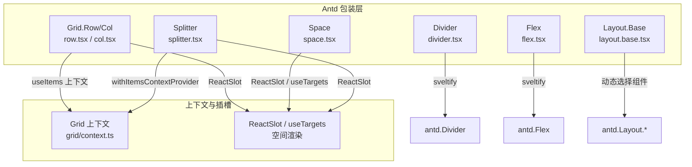
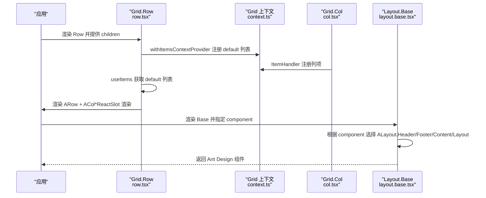
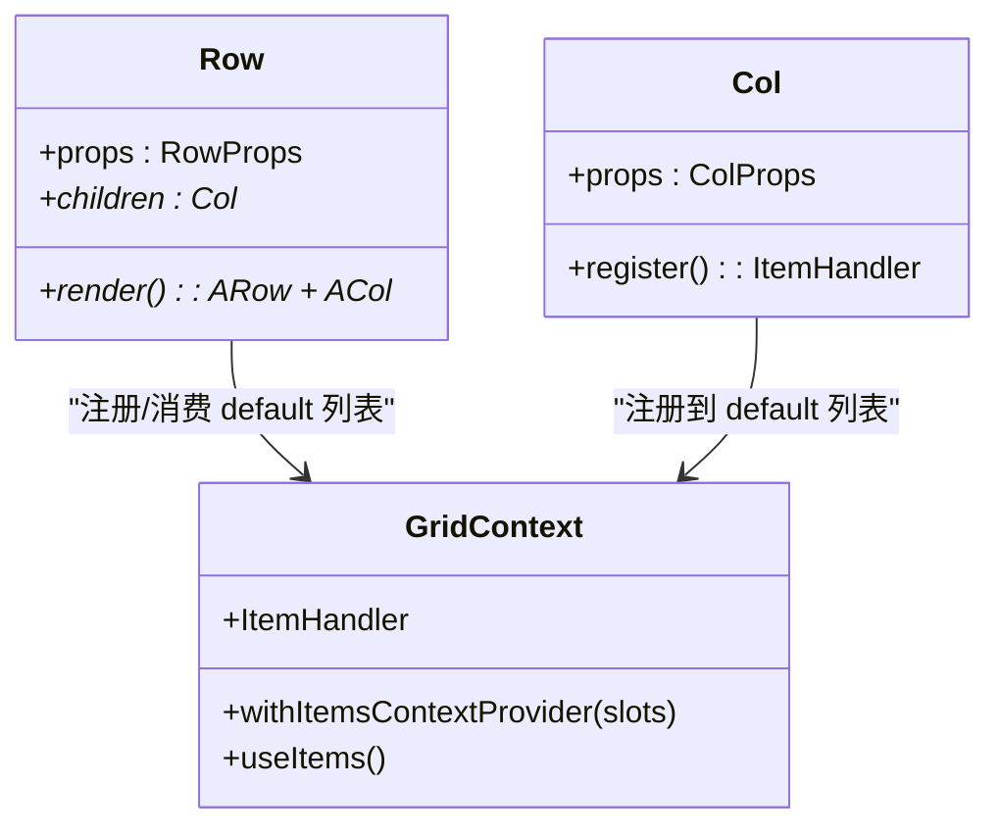
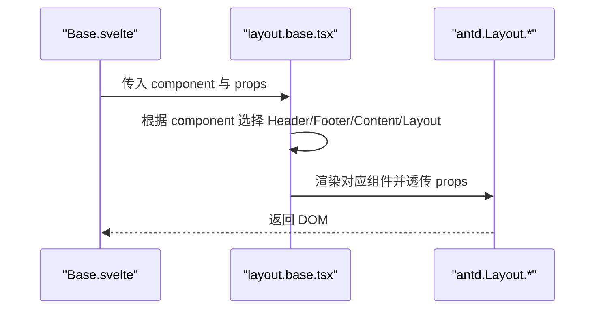
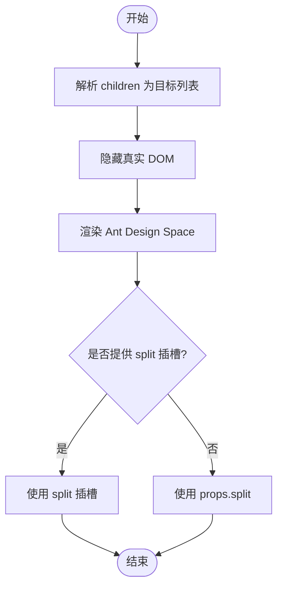
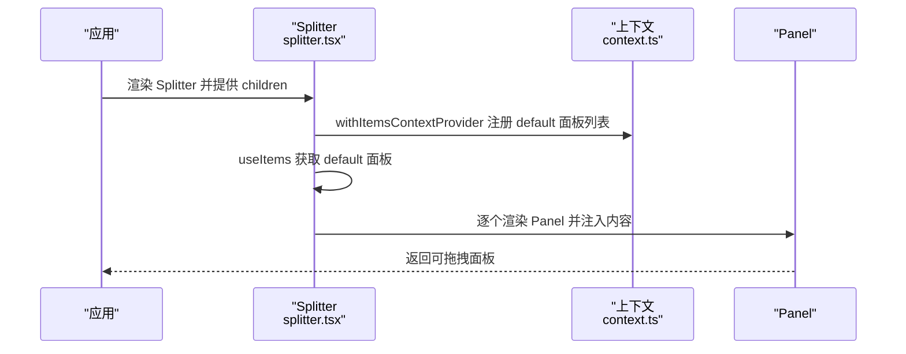
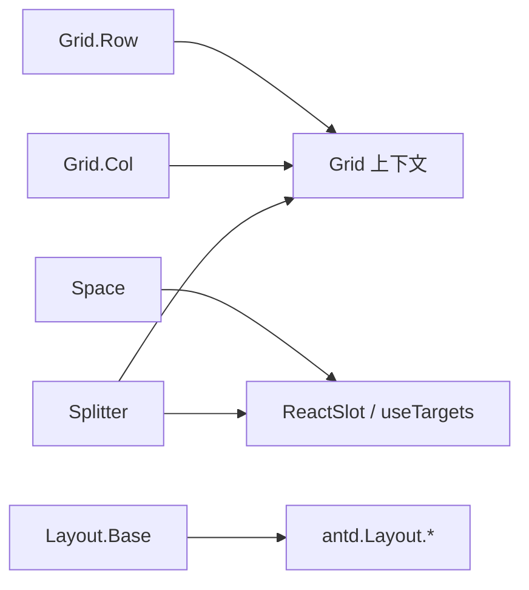

# 布局组件 API

<cite>
**本文引用的文件**
- [divider.tsx](file://frontend/antd/divider/divider.tsx)
- [flex.tsx](file://frontend/antd/flex/flex.tsx)
- [grid/context.ts](file://frontend/antd/grid/context.ts)
- [grid/row/row.tsx](file://frontend/antd/grid/row/row.tsx)
- [grid/col/col.tsx](file://frontend/antd/grid/col/col.tsx)
- [layout/layout.base.tsx](file://frontend/antd/layout/layout.base.tsx)
- [layout/Base.svelte](file://frontend/antd/layout/Base.svelte)
- [layout.sider/layout.sider.tsx](file://frontend/antd/layout/sider/layout.sider.tsx)
- [space/space.tsx](file://frontend/antd/space/space.tsx)
- [splitter/splitter.tsx](file://frontend/antd/splitter/splitter.tsx)
</cite>

## 目录

1. [简介](#简介)
2. [项目结构](#项目结构)
3. [核心组件](#核心组件)
4. [架构总览](#架构总览)
5. [详细组件分析](#详细组件分析)
6. [依赖分析](#依赖分析)
7. [性能考虑](#性能考虑)
8. [故障排查指南](#故障排查指南)
9. [结论](#结论)
10. [附录](#附录)

## 简介

本文件为 ModelScope Studio 中基于 Ant Design 的布局组件 API 参考文档，覆盖 Divider、Flex、Grid（Row/Col）、Layout（Header/Footer/Sider/Content）以及 Space、Splitter 组件。内容包括：

- 每个组件的属性定义与类型来源
- 布局算法与嵌套规则
- 响应式行为与尺寸计算要点
- 与 CSS Grid/Flexbox 的对应关系
- 标准使用路径与最佳实践
- 性能优化与移动端适配建议

## 项目结构

这些布局组件通过统一的 Svelte 预处理桥接方案，将 Ant Design 的 React 组件以 Svelte 组件形式暴露给前端应用。核心模式如下：

- 使用 sveltify 将 Ant Design 组件包装为 Svelte 组件
- 通过上下文与 Slot 机制实现子项收集与渲染
- 通过 Base 组件按需选择具体 Ant Design 子组件（如 Header/Footer/Content/Layout）

图表来源

- [divider.tsx:1-15](file://frontend/antd/divider/divider.tsx#L1-L15)
- [flex.tsx:1-11](file://frontend/antd/flex/flex.tsx#L1-L11)
- [grid/context.ts:1-7](file://frontend/antd/grid/context.ts#L1-L7)
- [grid/row/row.tsx:1-34](file://frontend/antd/grid/row/row.tsx#L1-L34)
- [grid/col/col.tsx:1-14](file://frontend/antd/grid/col/col.tsx#L1-L14)
- [layout/layout.base.tsx:1-40](file://frontend/antd/layout/layout.base.tsx#L1-L40)
- [space/space.tsx:1-29](file://frontend/antd/space/space.tsx#L1-L29)
- [splitter/splitter.tsx:1-38](file://frontend/antd/splitter/splitter.tsx#L1-L38)

章节来源

- [divider.tsx:1-15](file://frontend/antd/divider/divider.tsx#L1-L15)
- [flex.tsx:1-11](file://frontend/antd/flex/flex.tsx#L1-L11)
- [grid/context.ts:1-7](file://frontend/antd/grid/context.ts#L1-L7)
- [grid/row/row.tsx:1-34](file://frontend/antd/grid/row/row.tsx#L1-L34)
- [grid/col/col.tsx:1-14](file://frontend/antd/grid/col/col.tsx#L1-L14)
- [layout/layout.base.tsx:1-40](file://frontend/antd/layout/layout.base.tsx#L1-L40)
- [space/space.tsx:1-29](file://frontend/antd/space/space.tsx#L1-L29)
- [splitter/splitter.tsx:1-38](file://frontend/antd/splitter/splitter.tsx#L1-L38)

## 核心组件

- Divider：用于分隔线，支持传入子节点作为自定义内容或空内容。
- Flex：弹性布局容器，直接透传 Ant Design Flex 属性。
- Grid：Row/Col 组合实现栅格系统；Col 通过上下文注册到 Row。
- Layout：Base 组件根据 component 属性动态映射到 Header/Footer/Content/Layout。
- Space：在 Ant Design Space 基础上增强插槽渲染与分隔符插槽。
- Splitter：分割面板容器，通过上下文收集 Panel 子项并渲染。

章节来源

- [divider.tsx:1-15](file://frontend/antd/divider/divider.tsx#L1-L15)
- [flex.tsx:1-11](file://frontend/antd/flex/flex.tsx#L1-L11)
- [grid/context.ts:1-7](file://frontend/antd/grid/context.ts#L1-L7)
- [grid/row/row.tsx:1-34](file://frontend/antd/grid/row/row.tsx#L1-L34)
- [grid/col/col.tsx:1-14](file://frontend/antd/grid/col/col.tsx#L1-L14)
- [layout/layout.base.tsx:1-40](file://frontend/antd/layout/layout.base.tsx#L1-L40)
- [space/space.tsx:1-29](file://frontend/antd/space/space.tsx#L1-L29)
- [splitter/splitter.tsx:1-38](file://frontend/antd/splitter/splitter.tsx#L1-L38)

## 架构总览

以下图展示布局组件如何通过上下文与 Slot 机制组织子项，并最终渲染为 Ant Design 组件树。

图表来源

- [grid/row/row.tsx:7-31](file://frontend/antd/grid/row/row.tsx#L7-L31)
- [grid/context.ts:1-7](file://frontend/antd/grid/context.ts#L1-L7)
- [grid/col/col.tsx:7-11](file://frontend/antd/grid/col/col.tsx#L7-L11)
- [layout/layout.base.tsx:13-37](file://frontend/antd/layout/layout.base.tsx#L13-L37)

## 详细组件分析

### Divider（分隔线）

- 功能：提供水平或垂直分隔线，可选自定义子节点（如图标、文本）。
- 关键点：
  - 当存在子节点时，将子节点传递给 Ant Design Divider；否则渲染空分隔线。
  - 类型来自 Ant Design Divider Props。
- 典型用法路径
  - [divider.tsx:5-12](file://frontend/antd/divider/divider.tsx#L5-L12)

章节来源

- [divider.tsx:1-15](file://frontend/antd/divider/divider.tsx#L1-L15)

### Flex（弹性布局）

- 功能：Ant Design Flex 容器，支持主轴、交叉轴对齐、换行等布局属性。
- 关键点：
  - 直接透传 Ant Design Flex Props。
  - 适合复杂弹性布局场景。
- 典型用法路径
  - [flex.tsx:4-8](file://frontend/antd/flex/flex.tsx#L4-L8)

章节来源

- [flex.tsx:1-11](file://frontend/antd/flex/flex.tsx#L1-L11)

### Grid（栅格系统）

- Row/Col 组合
  - Row：通过上下文收集 Col 子项，渲染为 Ant Design Row，并将 Col 内容通过 Slot 渲染。
  - Col：通过 ItemHandler 注册到 Row 的上下文中。
- 上下文
  - 提供 withItemsContextProvider、useItems、ItemHandler，用于收集与分发子项。
- 响应式与嵌套
  - 支持响应式断点参数（由 Ant Design Row/Col Props 控制），Col 可嵌套在 Row 内。
- 典型用法路径
  - [grid/row/row.tsx:7-31](file://frontend/antd/grid/row/row.tsx#L7-L31)
  - [grid/col/col.tsx:7-11](file://frontend/antd/grid/col/col.tsx#L7-L11)
  - [grid/context.ts:3-4](file://frontend/antd/grid/context.ts#L3-L4)

图表来源

- [grid/context.ts:3-4](file://frontend/antd/grid/context.ts#L3-L4)
- [grid/row/row.tsx:7-31](file://frontend/antd/grid/row/row.tsx#L7-L31)
- [grid/col/col.tsx:7-11](file://frontend/antd/grid/col/col.tsx#L7-L11)

章节来源

- [grid/row/row.tsx:1-34](file://frontend/antd/grid/row/row.tsx#L1-L34)
- [grid/col/col.tsx:1-14](file://frontend/antd/grid/col/col.tsx#L1-L14)
- [grid/context.ts:1-7](file://frontend/antd/grid/context.ts#L1-L7)

### Layout（布局容器）

- Base 组件
  - 根据 component 属性动态映射到 Header/Footer/Content/Layout。
  - 支持额外类名与样式透传。
- Sider 子组件
  - 通过独立文件导出，配合 Layout 使用侧边栏。
- 典型用法路径
  - [layout/layout.base.tsx:13-37](file://frontend/antd/layout/layout.base.tsx#L13-L37)
  - [layout/Base.svelte:53-67](file://frontend/antd/layout/Base.svelte#L53-L67)
  - [layout.sider/layout.sider.tsx](file://frontend/antd/layout/sider/layout.sider.tsx)

图表来源

- [layout/Base.svelte:53-67](file://frontend/antd/layout/Base.svelte#L53-L67)
- [layout/layout.base.tsx:13-37](file://frontend/antd/layout/layout.base.tsx#L13-L37)

章节来源

- [layout/layout.base.tsx:1-40](file://frontend/antd/layout/layout.base.tsx#L1-L40)
- [layout/Base.svelte:1-71](file://frontend/antd/layout/Base.svelte#L1-L71)
- [layout.sider/layout.sider.tsx](file://frontend/antd/layout/sider/layout.sider.tsx)

### Space（间距）

- 功能：在元素之间插入间距，支持自定义分隔符插槽。
- 关键点：
  - 使用 useTargets 解析 children，隐藏真实 DOM，通过 Ant Design Space 渲染。
  - 支持 split 插槽，允许自定义分隔符。
- 典型用法路径
  - [space/space.tsx:7-26](file://frontend/antd/space/space.tsx#L7-L26)

图表来源

- [space/space.tsx:8-26](file://frontend/antd/space/space.tsx#L8-L26)

章节来源

- [space/space.tsx:1-29](file://frontend/antd/space/space.tsx#L1-L29)

### Splitter（分割面板）

- 功能：将区域分割为多个可拖拽调整大小的面板。
- 关键点：
  - 通过 withItemsContextProvider 收集默认插槽中的 Panel 子项。
  - 使用 ReactSlot 渲染每个 Panel 的内容。
- 典型用法路径
  - [splitter/splitter.tsx:7-35](file://frontend/antd/splitter/splitter.tsx#L7-L35)

图表来源

- [splitter/splitter.tsx:7-35](file://frontend/antd/splitter/splitter.tsx#L7-L35)
- [grid/context.ts:3-4](file://frontend/antd/grid/context.ts#L3-L4)

章节来源

- [splitter/splitter.tsx:1-38](file://frontend/antd/splitter/splitter.tsx#L1-L38)
- [grid/context.ts:1-7](file://frontend/antd/grid/context.ts#L1-L7)

## 依赖分析

- 组件间耦合
  - Grid.Row/Col 依赖 Grid 上下文进行子项收集与分发。
  - Space/Splitter 依赖通用 Slot 机制与目标解析工具。
  - Layout.Base 通过动态选择组件实现多形态布局。
- 外部依赖
  - Ant Design 组件库（Divider、Flex、Grid、Layout、Space、Splitter）。
  - Svelte 预处理工具链（sveltify、ReactSlot、useTargets）。
  - 样式工具（classnames）用于条件类名拼接。

图表来源

- [grid/row/row.tsx:7-31](file://frontend/antd/grid/row/row.tsx#L7-L31)
- [grid/col/col.tsx:7-11](file://frontend/antd/grid/col/col.tsx#L7-L11)
- [grid/context.ts:3-4](file://frontend/antd/grid/context.ts#L3-L4)
- [space/space.tsx:8-26](file://frontend/antd/space/space.tsx#L8-L26)
- [splitter/splitter.tsx:7-35](file://frontend/antd/splitter/splitter.tsx#L7-L35)
- [layout/layout.base.tsx:13-37](file://frontend/antd/layout/layout.base.tsx#L13-L37)

章节来源

- [grid/row/row.tsx:1-34](file://frontend/antd/grid/row/row.tsx#L1-L34)
- [grid/col/col.tsx:1-14](file://frontend/antd/grid/col/col.tsx#L1-L14)
- [grid/context.ts:1-7](file://frontend/antd/grid/context.ts#L1-L7)
- [space/space.tsx:1-29](file://frontend/antd/space/space.tsx#L1-L29)
- [splitter/splitter.tsx:1-38](file://frontend/antd/splitter/splitter.tsx#L1-L38)
- [layout/layout.base.tsx:1-40](file://frontend/antd/layout/layout.base.tsx#L1-L40)

## 性能考虑

- 虚拟化与懒加载
  - 对于长列表或大量子项的 Grid/Space/Splitter，优先采用虚拟化或分页策略减少一次性渲染开销。
- Slot 渲染优化
  - Space 通过隐藏真实 DOM 并仅渲染 Ant Design Space，避免重复渲染与样式抖动。
- 条件渲染
  - Layout.Base 根据 component 动态选择组件，避免不必要的 DOM 结构。
- 响应式断点
  - Grid 使用 Ant Design 断点参数，合理设置响应式阈值，避免频繁重排。
- 移动端适配
  - 在小屏设备上优先使用 Flex 或 Space 的紧凑模式，减少固定宽度布局带来的溢出问题。
  - Splitter 在移动端建议限制最小面板尺寸并禁用拖拽以提升交互稳定性。

## 故障排查指南

- Grid 子项未显示
  - 检查 Row 是否正确包裹 Col，且 Col 已通过 ItemHandler 注册到上下文。
  - 确认 Row 的 children 中包含 Col，且 Col 的 el 有效。
- Space 分隔符不生效
  - 确认已提供 split 插槽或 props.split，且插槽内容可被 ReactSlot 正确渲染。
- Splitter 面板为空
  - 确认 Panel 已在默认插槽中注册，且 Panel 的 el 有效。
- Layout 样式异常
  - 检查 Base 组件传入的 component 是否与预期一致，确认类名拼接逻辑未被覆盖。

章节来源

- [grid/row/row.tsx:12-29](file://frontend/antd/grid/row/row.tsx#L12-L29)
- [grid/col/col.tsx:7-11](file://frontend/antd/grid/col/col.tsx#L7-L11)
- [space/space.tsx:13-22](file://frontend/antd/space/space.tsx#L13-L22)
- [splitter/splitter.tsx:9-31](file://frontend/antd/splitter/splitter.tsx#L9-L31)
- [layout/layout.base.tsx:31-35](file://frontend/antd/layout/layout.base.tsx#L31-L35)

## 结论

ModelScope Studio 的布局组件通过统一的 Svelte 预处理桥接方案，将 Ant Design 的布局能力以更易用的方式呈现。Grid、Layout、Space、Splitter 等组件在保持与 Ant Design API 一致的同时，增强了插槽与上下文能力，便于复杂布局场景的组合与复用。遵循本文档的属性定义、嵌套规则与性能建议，可在桌面与移动端获得稳定高效的布局体验。

## 附录

- 与 CSS Grid/Flexbox 的对应关系
  - Grid.Row/Col 对应 CSS Grid 的行/列划分；Flex 对应 CSS Flexbox 的弹性布局。
  - Space 对应 Flex 的间距分配；Splitter 对应可拖拽的区域分割。
- 常见布局场景
  - 栅格系统：Row + Col 组合，按断点控制列宽与换行。
  - 弹性布局：Flex 容器内放置多个子元素，控制主轴与交叉轴对齐。
  - 分割面板：Splitter 内放置多个 Panel，支持拖拽调整大小。
  - 页面布局：Layout.Base 按需选择 Header/Footer/Content/Sider 组合。
