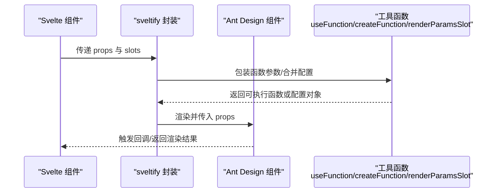
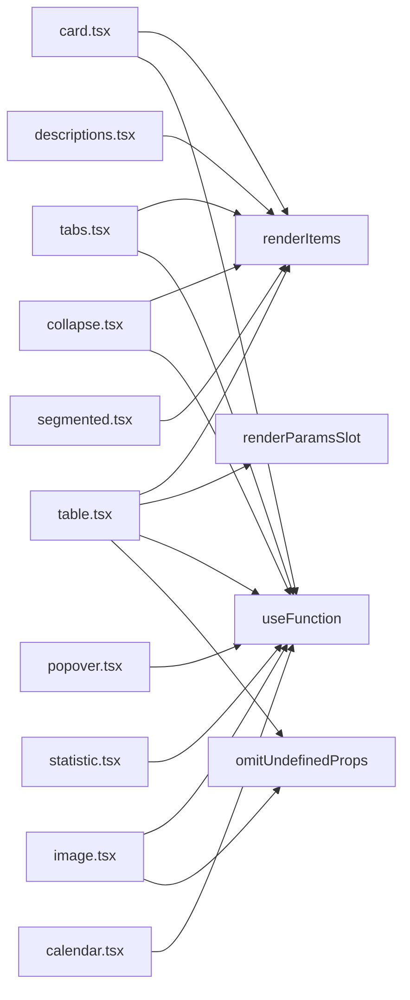

# 数据展示组件 API

<cite>
**本文引用的文件**
- [avatar.tsx](file://frontend/antd/avatar/avatar.tsx)
- [badge.tsx](file://frontend/antd/badge/badge.tsx)
- [calendar.tsx](file://frontend/antd/calendar/calendar.tsx)
- [card.tsx](file://frontend/antd/card/card.tsx)
- [carousel.tsx](file://frontend/antd/carousel/carousel.tsx)
- [collapse.tsx](file://frontend/antd/collapse/collapse.tsx)
- [descriptions.tsx](file://frontend/antd/descriptions/descriptions.tsx)
- [empty.tsx](file://frontend/antd/empty/empty.tsx)
- [image.tsx](file://frontend/antd/image/image.tsx)
- [list.tsx](file://frontend/antd/list/list.tsx)
- [popover.tsx](file://frontend/antd/popover/popover.tsx)
- [qr-code.tsx](file://frontend/antd/qr-code/qr-code.tsx)
- [segmented.tsx](file://frontend/antd/segmented/segmented.tsx)
- [statistic.tsx](file://frontend/antd/statistic/statistic.tsx)
- [table.tsx](file://frontend/antd/table/table.tsx)
- [tabs.tsx](file://frontend/antd/tabs/tabs.tsx)
- [tag.tsx](file://frontend/antd/tag/tag.tsx)
- [timeline.tsx](file://frontend/antd/timeline/timeline.tsx)
- [tooltip.tsx](file://frontend/antd/tooltip/tooltip.tsx)
- [tour.tsx](file://frontend/antd/tour/tour.tsx)
- [tree.tsx](file://frontend/antd/tree/tree.tsx)
</cite>

## 目录

1. [简介](#简介)
2. [项目结构](#项目结构)
3. [核心组件](#核心组件)
4. [架构总览](#架构总览)
5. [组件详细分析](#组件详细分析)
6. [依赖关系分析](#依赖关系分析)
7. [性能考量](#性能考量)
8. [故障排查指南](#故障排查指南)
9. [结论](#结论)
10. [附录](#附录)

## 简介

本文件为 ModelScope Studio 中基于 Ant Design 的数据展示类组件 API 参考文档，覆盖 Avatar、Badge、Calendar、Card、Carousel、Collapse、Descriptions、Empty、Image、List、Popover、QRCode、Segmented、Statistic、Table、Tabs、Tag、Timeline、Tooltip、Tour、Tree 等组件。内容包括：

- 属性定义与数据格式要求
- 显示逻辑与交互行为
- 标准实例化与配置示例（以路径形式给出）
- 数据绑定、虚拟滚动、懒加载与性能优化机制
- TypeScript 类型定义要点、数据转换与与图表库集成思路
- 视觉设计原则与用户体验优化建议

## 项目结构

这些组件均位于前端目录下的 antd 子模块中，采用统一的封装模式：通过 sveltify 将 Ant Design 组件桥接到 Svelte 生态，并使用 slots 与 renderParamsSlot 实现灵活的内容插槽与函数参数渲染。

```mermaid
graph TB
subgraph "Ant Design 组件层"
AD_Avatar["Avatar"]
AD_Badge["Badge"]
AD_Calendar["Calendar"]
AD_Card["Card"]
AD_Carousel["Carousel"]
AD_Collapse["Collapse"]
AD_Descriptions["Descriptions"]
AD_Empty["Empty"]
AD_Image["Image"]
AD_List["List"]
AD_Popover["Popover"]
AD_QRCode["QRCode"]
AD_Segmented["Segmented"]
AD_Statistic["Statistic"]
AD_Table["Table"]
AD_Tabs["Tabs"]
AD_Tag["Tag"]
AD_Timeline["Timeline"]
AD_Tooltip["Tooltip"]
AD_Tour["Tour"]
AD_Tree["Tree"]
end
subgraph "封装层sveltify"
S_Avatar["avatar.tsx"]
S_Badge["badge.tsx"]
S_Calendar["calendar.tsx"]
S_Card["card.tsx"]
S_Carousel["carousel.tsx"]
S_Collapse["collapse.tsx"]
S_Descriptions["descriptions.tsx"]
S_Empty["empty.tsx"]
S_Image["image.tsx"]
S_List["list.tsx"]
S_Popover["popover.tsx"]
S_QRCode["qr-code.tsx"]
S_Segmented["segmented.tsx"]
S_Statistic["statistic.tsx"]
S_Table["table.tsx"]
S_Tabs["tabs.tsx"]
S_Tag["tag.tsx"]
S_Timeline["timeline.tsx"]
S_Tooltip["tooltip.tsx"]
S_Tour["tour.tsx"]
S_Tree["tree.tsx"]
end
S_Avatar --> AD_Avatar
S_Badge --> AD_Badge
S_Calendar --> AD_Calendar
S_Card --> AD_Card
S_Carousel --> AD_Carousel
S_Collapse --> AD_Collapse
S_Descriptions --> AD_Descriptions
S_Empty --> AD_Empty
S_Image --> AD_Image
S_List --> AD_List
S_Popover --> AD_Popover
S_QRCode --> AD_QRCode
S_Segmented --> AD_Segmented
S_Statistic --> AD_Statistic
S_Table --> AD_Table
S_Tabs --> AD_Tabs
S_Tag --> AD_Tag
S_Timeline --> AD_Timeline
S_Tooltip --> AD_Tooltip
S_Tour --> AD_Tour
S_Tree --> AD_Tree
```

图表来源

- [avatar.tsx:1-28](file://frontend/antd/avatar/avatar.tsx#L1-L28)
- [badge.tsx:1-21](file://frontend/antd/badge/badge.tsx#L1-L21)
- [calendar.tsx:1-102](file://frontend/antd/calendar/calendar.tsx#L1-L102)
- [card.tsx:1-150](file://frontend/antd/card/card.tsx#L1-L150)
- [carousel.tsx:1-32](file://frontend/antd/carousel/carousel.tsx#L1-L32)
- [collapse.tsx:1-53](file://frontend/antd/collapse/collapse.tsx#L1-L53)
- [descriptions.tsx:1-41](file://frontend/antd/descriptions/descriptions.tsx#L1-L41)
- [empty.tsx:1-52](file://frontend/antd/empty/empty.tsx#L1-L52)
- [image.tsx:1-89](file://frontend/antd/image/image.tsx#L1-L89)
- [list.tsx:1-36](file://frontend/antd/list/list.tsx#L1-L36)
- [popover.tsx:1-37](file://frontend/antd/popover/popover.tsx#L1-L37)
- [qr-code.tsx:1-200](file://frontend/antd/qr-code/qr-code.tsx#L1-L200)
- [segmented.tsx:1-47](file://frontend/antd/segmented/segmented.tsx#L1-L47)
- [statistic.tsx:1-34](file://frontend/antd/statistic/statistic.tsx#L1-L34)
- [table.tsx:1-279](file://frontend/antd/table/table.tsx#L1-L279)
- [tabs.tsx:1-121](file://frontend/antd/tabs/tabs.tsx#L1-L121)
- [tag.tsx:1-200](file://frontend/antd/tag/tag.tsx#L1-L200)
- [timeline.tsx:1-200](file://frontend/antd/timeline/timeline.tsx#L1-L200)
- [tooltip.tsx:1-200](file://frontend/antd/tooltip/tooltip.tsx#L1-L200)
- [tour.tsx:1-200](file://frontend/antd/tour/tour.tsx#L1-L200)
- [tree.tsx:1-200](file://frontend/antd/tree/tree.tsx#L1-L200)

章节来源

- [avatar.tsx:1-28](file://frontend/antd/avatar/avatar.tsx#L1-L28)
- [badge.tsx:1-21](file://frontend/antd/badge/badge.tsx#L1-L21)
- [calendar.tsx:1-102](file://frontend/antd/calendar/calendar.tsx#L1-L102)
- [card.tsx:1-150](file://frontend/antd/card/card.tsx#L1-L150)
- [carousel.tsx:1-32](file://frontend/antd/carousel/carousel.tsx#L1-L32)
- [collapse.tsx:1-53](file://frontend/antd/collapse/collapse.tsx#L1-L53)
- [descriptions.tsx:1-41](file://frontend/antd/descriptions/descriptions.tsx#L1-L41)
- [empty.tsx:1-52](file://frontend/antd/empty/empty.tsx#L1-L52)
- [image.tsx:1-89](file://frontend/antd/image/image.tsx#L1-L89)
- [list.tsx:1-36](file://frontend/antd/list/list.tsx#L1-L36)
- [popover.tsx:1-37](file://frontend/antd/popover/popover.tsx#L1-L37)
- [segmented.tsx:1-47](file://frontend/antd/segmented/segmented.tsx#L1-L47)
- [statistic.tsx:1-34](file://frontend/antd/statistic/statistic.tsx#L1-L34)
- [table.tsx:1-279](file://frontend/antd/table/table.tsx#L1-L279)
- [tabs.tsx:1-121](file://frontend/antd/tabs/tabs.tsx#L1-L121)

## 核心组件

本节概述各组件的职责与通用封装策略：

- 统一使用 sveltify 包装 Ant Design 组件，支持 slots 插槽与 renderParamsSlot 渲染函数参数。
- 大多数组件支持 children 透传与多种具名插槽（如 title、extra、footer、header、content、image、description、placeholder、mask、toolbarRender、imageRender、tabBarExtraContent、tabProps.\* 等），用于灵活定制外观与行为。
- 部分组件对事件回调进行包装，确保在 Svelte 环境下正确执行。

章节来源

- [avatar.tsx:6-25](file://frontend/antd/avatar/avatar.tsx#L6-L25)
- [badge.tsx:6-18](file://frontend/antd/badge/badge.tsx#L6-L18)
- [card.tsx:37-146](file://frontend/antd/card/card.tsx#L37-L146)
- [carousel.tsx:8-28](file://frontend/antd/carousel/carousel.tsx#L8-L28)
- [collapse.tsx:11-49](file://frontend/antd/collapse/collapse.tsx#L11-L49)
- [descriptions.tsx:10-37](file://frontend/antd/descriptions/descriptions.tsx#L10-L37)
- [empty.tsx:6-49](file://frontend/antd/empty/empty.tsx#L6-L49)
- [image.tsx:15-85](file://frontend/antd/image/image.tsx#L15-L85)
- [list.tsx:8-33](file://frontend/antd/list/list.tsx#L8-L33)
- [popover.tsx:7-34](file://frontend/antd/popover/popover.tsx#L7-L34)
- [segmented.tsx:10-43](file://frontend/antd/segmented/segmented.tsx#L10-L43)
- [statistic.tsx:8-31](file://frontend/antd/statistic/statistic.tsx#L8-L31)
- [table.tsx:28-275](file://frontend/antd/table/table.tsx#L28-L275)
- [tabs.tsx:12-117](file://frontend/antd/tabs/tabs.tsx#L12-L117)

## 架构总览

以下序列图展示了组件封装到渲染的关键流程：Svelte 通过 sveltify 将 props 与 slots 转换为 Ant Design 组件的 props；对于函数型参数，使用 useFunction 或 createFunction 包装；对于复杂配置对象，使用 omitUndefinedProps 合并并注入 slots。

图表来源

- [table.tsx:76-134](file://frontend/antd/table/table.tsx#L76-L134)
- [card.tsx:40-49](file://frontend/antd/card/card.tsx#L40-L49)
- [image.tsx:32-34](file://frontend/antd/image/image.tsx#L32-L34)
- [popover.tsx:10-12](file://frontend/antd/popover/popover.tsx#L10-L12)

## 组件详细分析

### Avatar（头像）

- 作用：展示用户头像或图标，支持插槽 icon 与 src。
- 关键点：
  - 支持 slots.icon 与 slots.src；若存在插槽则优先使用插槽内容，否则回退到 props。
  - 通过 ReactSlot 渲染插槽。
- 常见用法路径示例：
  - [头像基础用法:6-25](file://frontend/antd/avatar/avatar.tsx#L6-L25)

章节来源

- [avatar.tsx:6-25](file://frontend/antd/avatar/avatar.tsx#L6-L25)

### Badge（徽标数）

- 作用：在头像、按钮等元素上展示徽标数或文本。
- 关键点：
  - 支持 slots.count 与 slots.text，动态渲染徽标内容。
- 常见用法路径示例：
  - [徽标计数与文本:6-18](file://frontend/antd/badge/badge.tsx#L6-L18)

章节来源

- [badge.tsx:6-18](file://frontend/antd/badge/badge.tsx#L6-L18)

### Calendar（日历）

- 作用：日期选择与日程展示。
- 关键点：
  - 对 value/defaultValue/validRange 进行 dayjs 格式化处理。
  - onChange/onPanelChange/onSelect 回调统一转换为秒级时间戳。
  - 支持 slots.cellRender/fullCellRender/headerRender 函数插槽。
- 常见用法路径示例：
  - [日历日期格式与回调:17-98](file://frontend/antd/calendar/calendar.tsx#L17-L98)

章节来源

- [calendar.tsx:17-98](file://frontend/antd/calendar/calendar.tsx#L17-L98)

### Card（卡片）

- 作用：容器组件，支持标题、额外操作、封面、动作区与标签页。
- 关键点：
  - 支持 slots.title/extra/cover/tabBarExtraContent/left/right 等。
  - actions 通过 useTargets 自动收集子节点。
  - tabList 通过 renderItems 从上下文解析。
  - tabProps.indicator.size、more.icon、tabProps.renderTabBar、tabProps.tabBarExtraContent.\* 等均可插槽化。
- 常见用法路径示例：
  - [卡片带标签页与动作区:37-146](file://frontend/antd/card/card.tsx#L37-L146)

章节来源

- [card.tsx:37-146](file://frontend/antd/card/card.tsx#L37-L146)

### Carousel（走马灯）

- 作用：轮播展示多张图片或内容。
- 关键点：
  - 使用 useTargets 提取子节点作为轮播项。
  - afterChange/beforeChange 通过 useFunction 包装。
- 常见用法路径示例：
  - [轮播图项渲染:8-28](file://frontend/antd/carousel/carousel.tsx#L8-L28)

章节来源

- [carousel.tsx:8-28](file://frontend/antd/carousel/carousel.tsx#L8-L28)

### Collapse（折叠面板）

- 作用：分组折叠/展开内容。
- 关键点：
  - 支持 slots.expandIcon 函数插槽。
  - items 通过 renderItems 从上下文解析，支持 label/extra/children 结构。
- 常见用法路径示例：
  - [折叠面板项与展开图标:11-49](file://frontend/antd/collapse/collapse.tsx#L11-L49)

章节来源

- [collapse.tsx:11-49](file://frontend/antd/collapse/collapse.tsx#L11-L49)

### Descriptions（描述列表）

- 作用：键值对形式展示信息。
- 关键点：
  - 支持 slots.title/extra；items 通过 renderItems 解析，字段为 label/children。
- 常见用法路径示例：
  - [描述列表项渲染:10-37](file://frontend/antd/descriptions/descriptions.tsx#L10-L37)

章节来源

- [descriptions.tsx:10-37](file://frontend/antd/descriptions/descriptions.tsx#L10-L37)

### Empty（空状态）

- 作用：无数据时的占位提示。
- 关键点：
  - 支持 slots.description/image；image 支持默认常量映射。
  - styles 支持函数式返回样式对象。
- 常见用法路径示例：
  - [空状态自定义图像与描述:6-49](file://frontend/antd/empty/empty.tsx#L6-L49)

章节来源

- [empty.tsx:6-49](file://frontend/antd/empty/empty.tsx#L6-L49)

### Image（图片）

- 作用：图片展示与预览。
- 关键点：
  - 支持 slots.placeholder、preview.mask、preview.closeIcon、preview.toolbarRender、preview.imageRender。
  - preview 通过 getConfig/omitUndefinedProps 合并配置；getContainer/toolbarRender/imageRender 通过 useFunction 包装。
- 常见用法路径示例：
  - [图片预览与工具栏渲染:15-85](file://frontend/antd/image/image.tsx#L15-L85)

章节来源

- [image.tsx:15-85](file://frontend/antd/image/image.tsx#L15-L85)

### List（列表）

- 作用：长列表展示与加载更多。
- 关键点：
  - 支持 slots.footer/header/loadMore/renderItem；renderItem 通过 renderParamsSlot 渲染，强制克隆。
- 常见用法路径示例：
  - [列表头部尾部与加载更多:8-33](file://frontend/antd/list/list.tsx#L8-L33)

章节来源

- [list.tsx:8-33](file://frontend/antd/list/list.tsx#L8-L33)

### Popover（气泡卡片）

- 作用：悬浮气泡展示标题与内容。
- 关键点：
  - 支持 slots.title/content；title/content 通过 ReactSlot 克隆。
  - afterOpenChange/getPopupContainer 通过 useFunction 包装。
- 常见用法路径示例：
  - [气泡卡片标题与内容:7-34](file://frontend/antd/popover/popover.tsx#L7-L34)

章节来源

- [popover.tsx:7-34](file://frontend/antd/popover/popover.tsx#L7-L34)

### QRCode（二维码）

- 作用：生成与展示二维码。
- 常见用法路径示例：
  - [二维码组件:1-200](file://frontend/antd/qr-code/qr-code.tsx#L1-L200)

章节来源

- [qr-code.tsx:1-200](file://frontend/antd/qr-code/qr-code.tsx#L1-L200)

### Segmented（分段控制器）

- 作用：在多个选项中进行切换。
- 关键点：
  - 支持 options/default 从上下文解析；onChange 通过 onValueChange 暴露选中值。
- 常见用法路径示例：
  - [分段控制器选项渲染:10-43](file://frontend/antd/segmented/segmented.tsx#L10-L43)

章节来源

- [segmented.tsx:10-43](file://frontend/antd/segmented/segmented.tsx#L10-L43)

### Statistic（统计数值）

- 作用：展示数值与单位、前缀、后缀。
- 关键点：
  - 支持 slots.prefix/suffix/title/formatter；formatter 通过 renderParamsSlot 渲染。
- 常见用法路径示例：
  - [统计数值格式化:8-31](file://frontend/antd/statistic/statistic.tsx#L8-L31)

章节来源

- [statistic.tsx:8-31](file://frontend/antd/statistic/statistic.tsx#L8-L31)

### Table（表格）

- 作用：数据表格展示与交互。
- 关键点：
  - 支持 columns、rowSelection、expandable、sticky、pagination、loading、footer、title、summary、showSorterTooltip 等复杂配置。
  - 通过多层 with\*ContextProvider 注入列、展开、行选择上下文。
  - 使用 renderItems 与 renderParamsSlot 动态解析 items 与函数参数；使用 createFunction/omitUndefinedProps 包装与合并配置。
- 常见用法路径示例：
  - [表格列与分页插槽:28-275](file://frontend/antd/table/table.tsx#L28-L275)

章节来源

- [table.tsx:28-275](file://frontend/antd/table/table.tsx#L28-L275)

### Tabs（标签页）

- 作用：标签页容器与切换。
- 关键点：
  - 支持 slots.addIcon/removeIcon/renderTabBar/tabBarExtraContent/left/right/more.icon。
  - indicator.size、more.getPopupContainer、renderTabBar 通过 useFunction 包装；items 通过 renderItems 解析。
- 常见用法路径示例：
  - [标签页与额外内容:12-117](file://frontend/antd/tabs/tabs.tsx#L12-L117)

章节来源

- [tabs.tsx:12-117](file://frontend/antd/tabs/tabs.tsx#L12-L117)

### Tag（标签）

- 作用：标记与分类。
- 常见用法路径示例：
  - [标签组件:1-200](file://frontend/antd/tag/tag.tsx#L1-L200)

章节来源

- [tag.tsx:1-200](file://frontend/antd/tag/tag.tsx#L1-L200)

### Timeline（时间轴）

- 作用：按时间顺序展示事件。
- 常见用法路径示例：
  - [时间轴组件:1-200](file://frontend/antd/timeline/timeline.tsx#L1-L200)

章节来源

- [timeline.tsx:1-200](file://frontend/antd/timeline/timeline.tsx#L1-L200)

### Tooltip（文字提示）

- 作用：简短提示信息。
- 常见用法路径示例：
  - [文字提示组件:1-200](file://frontend/antd/tooltip/tooltip.tsx#L1-L200)

章节来源

- [tooltip.tsx:1-200](file://frontend/antd/tooltip/tooltip.tsx#L1-L200)

### Tour（向导）

- 作用：引导式教程。
- 常见用法路径示例：
  - [向导组件:1-200](file://frontend/antd/tour/tour.tsx#L1-L200)

章节来源

- [tour.tsx:1-200](file://frontend/antd/tour/tour.tsx#L1-L200)

### Tree（树形控件）

- 作用：层级数据展示与选择。
- 常见用法路径示例：
  - [树形控件:1-200](file://frontend/antd/tree/tree.tsx#L1-L200)

章节来源

- [tree.tsx:1-200](file://frontend/antd/tree/tree.tsx#L1-L200)

## 依赖关系分析

- 组件间耦合：
  - Card 与 Tabs 存在上下文共享（Card 内嵌 Tabs 时复用 tabList 上下文）。
  - Table 通过多处 context provider 注入列、展开、行选择等上下文。
  - 多数组件共享 renderItems、renderParamsSlot、useFunction、omitUndefinedProps 等工具。
- 外部依赖：
  - Ant Design 组件库与 dayjs（日历组件）。
  - lodash-es（Empty 组件中的类型判断）。

图表来源

- [card.tsx:10-14](file://frontend/antd/card/card.tsx#L10-L14)
- [tabs.tsx:6-10](file://frontend/antd/tabs/tabs.tsx#L6-L10)
- [collapse.tsx:4-8](file://frontend/antd/collapse/collapse.tsx#L4-L8)
- [descriptions.tsx:4-7](file://frontend/antd/descriptions/descriptions.tsx#L4-L7)
- [table.tsx:7-18](file://frontend/antd/table/table.tsx#L7-L18)
- [image.tsx:3-6](file://frontend/antd/image/image.tsx#L3-L6)
- [popover.tsx:4-5](file://frontend/antd/popover/popover.tsx#L4-L5)
- [statistic.tsx:4-6](file://frontend/antd/statistic/statistic.tsx#L4-L6)
- [segmented.tsx:3-6](file://frontend/antd/segmented/segmented.tsx#L3-L6)
- [calendar.tsx:3-4](file://frontend/antd/calendar/calendar.tsx#L3-L4)

章节来源

- [card.tsx:10-14](file://frontend/antd/card/card.tsx#L10-L14)
- [tabs.tsx:6-10](file://frontend/antd/tabs/tabs.tsx#L6-L10)
- [table.tsx:7-18](file://frontend/antd/table/table.tsx#L7-L18)

## 性能考量

- 虚拟滚动与懒加载
  - 列表类组件（List、Table）可通过外部配置启用虚拟滚动与懒加载，减少 DOM 数量与重排开销。
  - 建议在大数据集场景下开启虚拟化与分页加载。
- 渲染优化
  - 使用 useMemo 缓存计算结果（如 Table 的 columns、rowSelection、expandable）。
  - 合理拆分插槽渲染，避免不必要的重复渲染。
- 事件与函数包装
  - 使用 useFunction/createFunction 包装回调，确保在 Svelte 生命周期内稳定执行，避免闭包陷阱。
- 图片与预览
  - Image 组件支持 placeholder 与 preview 工具栏自定义，合理设置尺寸与懒加载策略，降低首屏压力。

## 故障排查指南

- 插槽未生效
  - 确认插槽名称是否正确（如 preview.mask、tabProps.renderTabBar、loading.tip 等）。
  - 检查是否遗漏 slots.\* 与 props 的组合使用。
- 回调不触发
  - 确保回调通过 useFunction 包装；检查事件命名与参数签名。
- 时间格式问题（日历）
  - Calendar 组件内部将时间统一转换为秒级时间戳，请确认传入值类型与范围。
- 表格列与展开配置
  - 当 columns 为空时，组件会尝试从上下文解析；请确认上下文已正确提供 default/items。
- 样式覆盖
  - Empty 的 styles 支持函数式返回，注意返回对象结构与 key 名称。

章节来源

- [image.tsx:32-34](file://frontend/antd/image/image.tsx#L32-L34)
- [popover.tsx:10-12](file://frontend/antd/popover/popover.tsx#L10-L12)
- [calendar.tsx:85-94](file://frontend/antd/calendar/calendar.tsx#L85-L94)
- [table.tsx:67-75](file://frontend/antd/table/table.tsx#L67-L75)
- [empty.tsx:34-45](file://frontend/antd/empty/empty.tsx#L34-L45)

## 结论

ModelScope Studio 的数据展示组件通过统一的 sveltify 封装，实现了与 Ant Design 的无缝对接，并提供了强大的插槽与函数参数扩展能力。借助上下文解析与工具函数，开发者可以快速构建卡片布局、轮播图、折叠面板、描述列表、图片预览、表格展示、标签云等常见数据展示场景。建议在实际项目中结合虚拟滚动、懒加载与样式优化策略，进一步提升性能与用户体验。

## 附录

- TypeScript 类型定义要点
  - 大多数组件通过 GetProps<typeof AntD> 获取类型，再根据需要扩展 props（如 onValueChange、containsGrid 等）。
  - 对于复杂配置对象（如 preview、loading、pagination、sticky、showSorterTooltip、components），使用 getConfig/omitUndefinedProps 合并并注入 slots。
- 数据转换与图表集成
  - 日历组件内部将时间转换为 dayjs 并在回调中输出秒级时间戳，便于与后端或图表库对接。
  - 表格组件支持通过 slots 与 renderItems 将业务数据映射为列与行，便于与可视化库（如 ECharts、AntV）联动。
- 视觉设计与体验优化
  - 使用 Empty 提升空数据场景的可读性。
  - 使用 Tooltip/Popover 提供上下文帮助信息。
  - 使用 Statistic/Segmented/Tag 等组件增强信息密度与交互反馈。
