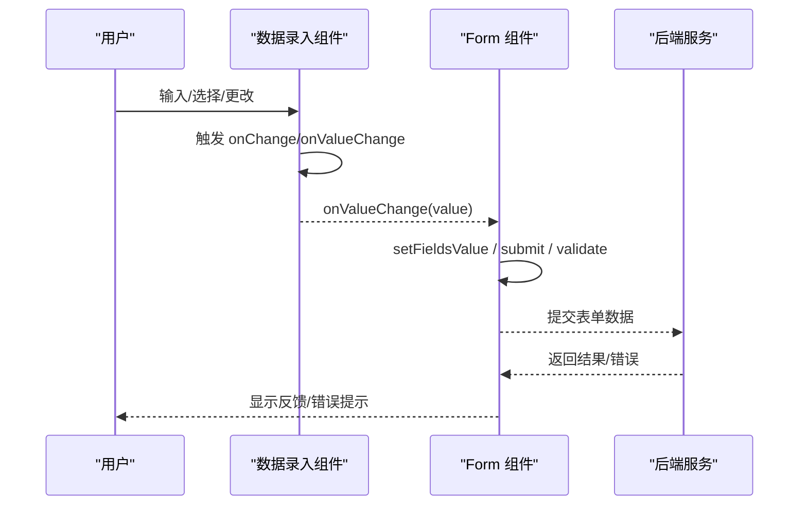
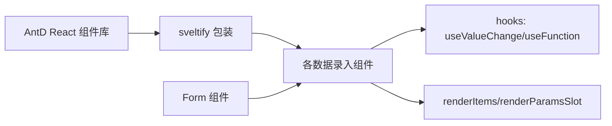

# 数据录入组件 API

<cite>
**本文引用的文件**
- [backend/modelscope_studio/components/antd/components.py](file://backend/modelscope_studio/components/antd/components.py)
- [frontend/antd/form/form.tsx](file://frontend/antd/form/form.tsx)
- [frontend/antd/auto-complete/auto-complete.tsx](file://frontend/antd/auto-complete/auto-complete.tsx)
- [frontend/antd/cascader/cascader.tsx](file://frontend/antd/cascader/cascader.tsx)
- [frontend/antd/checkbox/checkbox.tsx](file://frontend/antd/checkbox/checkbox.tsx)
- [frontend/antd/color-picker/color-picker.tsx](file://frontend/antd/color-picker/color-picker.tsx)
- [frontend/antd/date-picker/date-picker.tsx](file://frontend/antd/date-picker/date-picker.tsx)
- [frontend/antd/input/input.tsx](file://frontend/antd/input/input.tsx)
- [frontend/antd/input-number/input-number.tsx](file://frontend/antd/input-number/input-number.tsx)
- [frontend/antd/mentions/mentions.tsx](file://frontend/antd/mentions/mentions.tsx)
- [frontend/antd/radio/radio.tsx](file://frontend/antd/radio/radio.tsx)
- [frontend/antd/rate/rate.tsx](file://frontend/antd/rate/rate.tsx)
- [frontend/antd/select/select.tsx](file://frontend/antd/select/select.tsx)
- [frontend/antd/slider/slider.tsx](file://frontend/antd/slider/slider.tsx)
- [frontend/antd/switch/switch.tsx](file://frontend/antd/switch/switch.tsx)
- [frontend/antd/time-picker/time-picker.tsx](file://frontend/antd/time-picker/time-picker.tsx)
- [frontend/antd/transfer/transfer.tsx](file://frontend/antd/transfer/transfer.tsx)
- [frontend/antd/tree-select/tree-select.tsx](file://frontend/antd/tree-select/tree-select.tsx)
</cite>

## 目录

1. [简介](#简介)
2. [项目结构](#项目结构)
3. [核心组件](#核心组件)
4. [架构总览](#架构总览)
5. [组件详细分析](#组件详细分析)
6. [依赖关系分析](#依赖关系分析)
7. [性能考量](#性能考量)
8. [故障排查指南](#故障排查指南)
9. [结论](#结论)
10. [附录](#附录)

## 简介

本文件为 ModelScope Studio 中基于 Ant Design 的数据录入类组件 API 参考文档，覆盖 AutoComplete、Cascader、Checkbox、ColorPicker、DatePicker、Form、Input、InputNumber、Mentions、Radio、Rate、Select、Slider、Switch、TimePicker、Transfer、TreeSelect、Upload（后续补充）等组件。内容包括：

- 属性定义与类型约束
- 数据验证与格式化策略
- 事件回调与数据绑定机制
- 标准使用示例路径（以源码路径代替具体代码）
- 与后端 API 的对接建议
- 用户体验与性能优化要点

## 项目结构

ModelScope Studio 将 Ant Design 组件封装为 Svelte 组件，统一通过 sveltify 包装 React 版 AntD 组件，并在前端层提供统一的 onValueChange 回调、插槽渲染与值变更钩子，便于与 Python 后端进行双向数据绑定。

```mermaid
graph TB
subgraph "后端组件导出"
PY["components.py<br/>导出各 AntD 组件"]
end
subgraph "前端封装层"
F_FORM["form/form.tsx"]
F_AUTO["auto-complete/auto-complete.tsx"]
F_CASCADE["cascader/cascader.tsx"]
F_CHECK["checkbox/checkbox.tsx"]
F_COLOR["color-picker/color-picker.tsx"]
F_DATE["date-picker/date-picker.tsx"]
F_INPUT["input/input.tsx"]
F_NUM["input-number/input-number.tsx"]
F_MENTIONS["mentions/mentions.tsx"]
F_RADIO["radio/radio.tsx"]
F_RATE["rate/rate.tsx"]
F_SELECT["select/select.tsx"]
F_SLIDER["slider/slider.tsx"]
F_SWITCH["switch/switch.tsx"]
F_TIME["time-picker/time-picker.tsx"]
F_TRANS["transfer/transfer.tsx"]
F_TSELECT["tree-select/tree-select.tsx"]
end
PY --> F_FORM
PY --> F_AUTO
PY --> F_CASCADE
PY --> F_CHECK
PY --> F_COLOR
PY --> F_DATE
PY --> F_INPUT
PY --> F_NUM
PY --> F_MENTIONS
PY --> F_RADIO
PY --> F_RATE
PY --> F_SELECT
PY --> F_SLIDER
PY --> F_SWITCH
PY --> F_TIME
PY --> F_TRANS
PY --> F_TSELECT
```

图表来源

- [backend/modelscope_studio/components/antd/components.py:1-145](file://backend/modelscope_studio/components/antd/components.py#L1-L145)
- [frontend/antd/form/form.tsx:1-79](file://frontend/antd/form/form.tsx#L1-L79)
- [frontend/antd/auto-complete/auto-complete.tsx:1-151](file://frontend/antd/auto-complete/auto-complete.tsx#L1-L151)
- [frontend/antd/cascader/cascader.tsx:1-207](file://frontend/antd/cascader/cascader.tsx#L1-L207)
- [frontend/antd/checkbox/checkbox.tsx:1-22](file://frontend/antd/checkbox/checkbox.tsx#L1-L22)
- [frontend/antd/color-picker/color-picker.tsx:1-106](file://frontend/antd/color-picker/color-picker.tsx#L1-L106)
- [frontend/antd/date-picker/date-picker.tsx:1-234](file://frontend/antd/date-picker/date-picker.tsx#L1-L234)
- [frontend/antd/input/input.tsx:1-119](file://frontend/antd/input/input.tsx#L1-L119)
- [frontend/antd/input-number/input-number.tsx:1-92](file://frontend/antd/input-number/input-number.tsx#L1-L92)
- [frontend/antd/mentions/mentions.tsx:1-80](file://frontend/antd/mentions/mentions.tsx#L1-L80)
- [frontend/antd/radio/radio.tsx:1-32](file://frontend/antd/radio/radio.tsx#L1-L32)
- [frontend/antd/rate/rate.tsx:1-45](file://frontend/antd/rate/rate.tsx#L1-L45)
- [frontend/antd/select/select.tsx:1-181](file://frontend/antd/select/select.tsx#L1-L181)
- [frontend/antd/slider/slider.tsx:1-97](file://frontend/antd/slider/slider.tsx#L1-L97)
- [frontend/antd/switch/switch.tsx:1-42](file://frontend/antd/switch/switch.tsx#L1-L42)
- [frontend/antd/time-picker/time-picker.tsx:1-201](file://frontend/antd/time-picker/time-picker.tsx#L1-L201)
- [frontend/antd/transfer/transfer.tsx:1-112](file://frontend/antd/transfer/transfer.tsx#L1-L112)
- [frontend/antd/tree-select/tree-select.tsx:1-163](file://frontend/antd/tree-select/tree-select.tsx#L1-L163)

章节来源

- [backend/modelscope_studio/components/antd/components.py:1-145](file://backend/modelscope_studio/components/antd/components.py#L1-L145)

## 核心组件

本节概述所有数据录入组件的通用模式与关键接口：

- 值绑定：均支持 value 与 onValueChange，用于受控/非受控切换与双向绑定
- 插槽系统：大量组件支持 slots（如 allowClear.clearIcon、prefix、suffix、popupRender 等），用于自定义渲染
- 函数式属性：部分属性支持传入函数（如 formatter、parser、disabledDate 等），通过 useFunction 包装
- 选项/树数据：Select、Cascader、TreeSelect、AutoComplete、Mentions 等支持通过 children 或 options/treeData 渲染项
- 表单集成：Form 提供全局表单状态管理、重置、提交、校验动作与 requiredMark/feedbackIcons 支持

章节来源

- [frontend/antd/form/form.tsx:8-76](file://frontend/antd/form/form.tsx#L8-L76)
- [frontend/antd/select/select.tsx:11-178](file://frontend/antd/select/select.tsx#L11-L178)
- [frontend/antd/cascader/cascader.tsx:19-204](file://frontend/antd/cascader/cascader.tsx#L19-L204)
- [frontend/antd/tree-select/tree-select.tsx:14-161](file://frontend/antd/tree-select/tree-select.tsx#L14-L161)
- [frontend/antd/auto-complete/auto-complete.tsx:32-148](file://frontend/antd/auto-complete/auto-complete.tsx#L32-L148)
- [frontend/antd/mentions/mentions.tsx:11-77](file://frontend/antd/mentions/mentions.tsx#L11-L77)

## 架构总览

下图展示数据录入组件的通用调用链：前端组件通过 onValueChange 回调向上游传递值；Form 组件负责表单级动作（reset/submit/validate）与全局 requiredMark/feedbackIcons；部分组件内部对值进行格式化（如日期时间组件）。

图表来源

- [frontend/antd/form/form.tsx:27-76](file://frontend/antd/form/form.tsx#L27-L76)
- [frontend/antd/date-picker/date-picker.tsx:162-170](file://frontend/antd/date-picker/date-picker.tsx#L162-L170)
- [frontend/antd/time-picker/time-picker.tsx:131-143](file://frontend/antd/time-picker/time-picker.tsx#L131-L143)

## 组件详细分析

### Form（表单容器）

- 职责：封装 AntD Form，提供 value、onValueChange、formAction（reset/submit/validate）、requiredMark、feedbackIcons 等能力
- 关键点：
  - 通过 AForm.useForm 创建表单实例
  - formAction 变化时执行 reset/submit/validate
  - onValuesChange 同步上游值并触发 onValueChange
- 典型用法路径
  - [表单容器实现:15-76](file://frontend/antd/form/form.tsx#L15-L76)

章节来源

- [frontend/antd/form/form.tsx:8-76](file://frontend/antd/form/form.tsx#L8-L76)

### AutoComplete（自动完成）

- 能力：支持 options 列表、过滤、弹窗渲染、清空图标、无数据占位等
- 关键点：
  - 使用 useValueChange 实现受控 value
  - 支持 slots：allowClear.clearIcon、dropdownRender、popupRender、notFoundContent
  - 支持 filterOption 函数与 getPopupContainer
- 典型用法路径
  - [自动完成组件:32-148](file://frontend/antd/auto-complete/auto-complete.tsx#L32-L148)

章节来源

- [frontend/antd/auto-complete/auto-complete.tsx:32-148](file://frontend/antd/auto-complete/auto-complete.tsx#L32-L148)

### Cascader（级联选择）

- 能力：多级联动选择，支持动态加载、搜索、标签渲染、下拉面板自定义
- 关键点：
  - 支持 options 与 children 两种数据源
  - showSearch 支持对象配置与 slots['showSearch.render']
  - 支持 onLoadData 动态加载
- 典型用法路径
  - [级联选择组件:19-204](file://frontend/antd/cascader/cascader.tsx#L19-L204)

章节来源

- [frontend/antd/cascader/cascader.tsx:19-204](file://frontend/antd/cascader/cascader.tsx#L19-L204)

### Checkbox（复选框）

- 能力：布尔值选择，支持 onValueChange
- 关键点：
  - onChange 中透传原生事件并触发 onValueChange(value)
- 典型用法路径
  - [复选框组件:4-19](file://frontend/antd/checkbox/checkbox.tsx#L4-L19)

章节来源

- [frontend/antd/checkbox/checkbox.tsx:4-19](file://frontend/antd/checkbox/checkbox.tsx#L4-L19)

### ColorPicker（颜色选择器）

- 能力：支持单色/渐变色，预设颜色，多种输出格式（rgb/hex/hsb）
- 关键点：
  - onChange 内部根据是否渐变返回不同格式数组或单一字符串
  - 支持 presets 插槽与 panelRender/showText 自定义
- 典型用法路径
  - [颜色选择器组件:11-103](file://frontend/antd/color-picker/color-picker.tsx#L11-L103)

章节来源

- [frontend/antd/color-picker/color-picker.tsx:11-103](file://frontend/antd/color-picker/color-picker.tsx#L11-L103)

### DatePicker（日期选择）

- 能力：单日/范围选择、时间选择、预设快捷项、禁用日期/时间、单元格/面板自定义
- 关键点：
  - 内部将输入值格式化为 dayjs 并在 onChange/onPanelChange 输出秒级时间戳
  - 支持 showTime 对象中的 defaultValue 格式化
  - 支持 presets、cellRender、panelRender、renderExtraFooter 等 slots
- 典型用法路径
  - [日期选择组件:40-231](file://frontend/antd/date-picker/date-picker.tsx#L40-L231)

章节来源

- [frontend/antd/date-picker/date-picker.tsx:40-231](file://frontend/antd/date-picker/date-picker.tsx#L40-L231)

### Input（文本输入）

- 能力：基础文本输入，支持前后缀、计数器、清空图标、插槽扩展
- 关键点：
  - useValueChange 实现受控 value
  - 支持 showCount.formatter 插槽与 count 系列函数
  - 支持 addonBefore/After、prefix/suffix、allowClear.clearIcon
- 典型用法路径
  - [文本输入组件:10-116](file://frontend/antd/input/input.tsx#L10-L116)

章节来源

- [frontend/antd/input/input.tsx:10-116](file://frontend/antd/input/input.tsx#L10-L116)

### InputNumber（数值输入）

- 能力：数值输入，支持步进按钮自定义、前缀/后缀、formatter/parser
- 关键点：
  - useValueChange 实现受控 value
  - 支持 controls.upIcon/downIcon 插槽与 addonBefore/After、prefix/suffix
- 典型用法路径
  - [数值输入组件:7-91](file://frontend/antd/input-number/input-number.tsx#L7-L91)

章节来源

- [frontend/antd/input-number/input-number.tsx:7-91](file://frontend/antd/input-number/input-number.tsx#L7-L91)

### Mentions（提及）

- 能力：@ 提及功能，支持选项列表、过滤、弹窗渲染
- 关键点：
  - useValueChange 实现受控 value
  - 支持 options、filterOption、validateSearch、getPopupContainer
- 典型用法路径
  - [提及组件:11-77](file://frontend/antd/mentions/mentions.tsx#L11-L77)

章节来源

- [frontend/antd/mentions/mentions.tsx:11-77](file://frontend/antd/mentions/mentions.tsx#L11-L77)

### Radio（单选框）

- 能力：单选选择，支持 onValueChange
- 关键点：
  - onChange 中透传原生事件并触发 onValueChange(value)
  - 注入主题 token 以适配样式变量
- 典型用法路径
  - [单选框组件:6-29](file://frontend/antd/radio/radio.tsx#L6-L29)

章节来源

- [frontend/antd/radio/radio.tsx:6-29](file://frontend/antd/radio/radio.tsx#L6-L29)

### Rate（评分）

- 能力：星级评分，支持自定义字符
- 关键点：
  - 支持 character 插槽与函数式配置
  - onChange 触发 onValueChange
- 典型用法路径
  - [评分组件:6-42](file://frontend/antd/rate/rate.tsx#L6-L42)

章节来源

- [frontend/antd/rate/rate.tsx:6-42](file://frontend/antd/rate/rate.tsx#L6-L42)

### Select（选择器）

- 能力：单选/多选，支持标签渲染、下拉面板自定义、过滤排序
- 关键点：
  - 支持 options 与 children 两种数据源
  - 支持 allowClear.clearIcon、prefix/removeIcon/suffixIcon、notFoundContent、menuItemSelectedIcon
  - 支持 dropdownRender/popupRender/optionRender/tagRender/labelRender
  - 支持 filterOption/filterSort
- 典型用法路径
  - [选择器组件:11-178](file://frontend/antd/select/select.tsx#L11-L178)

章节来源

- [frontend/antd/select/select.tsx:11-178](file://frontend/antd/select/select.tsx#L11-L178)

### Slider（滑块）

- 能力：单/双滑块，支持刻度标记、工具提示格式化
- 关键点：
  - marks 通过 children 渲染，支持 label 子插槽
  - tooltip 支持 formatter 插槽与函数
- 典型用法路径
  - [滑块组件:37-94](file://frontend/antd/slider/slider.tsx#L37-L94)

章节来源

- [frontend/antd/slider/slider.tsx:37-94](file://frontend/antd/slider/slider.tsx#L37-L94)

### Switch（开关）

- 能力：布尔开关，支持自定义文案插槽
- 关键点：
  - 支持 checkedChildren/unCheckedChildren 插槽
  - onChange 触发 onValueChange
- 典型用法路径
  - [开关组件:6-39](file://frontend/antd/switch/switch.tsx#L6-L39)

章节来源

- [frontend/antd/switch/switch.tsx:6-39](file://frontend/antd/switch/switch.tsx#L6-L39)

### TimePicker（时间选择）

- 能力：时间选择、范围选择、面板自定义、禁用时间
- 关键点：
  - 内部将输入值格式化为 dayjs 并在 onChange/onPanelChange/onCalendarChange 输出秒级时间戳
  - 支持 cellRender、panelRender、renderExtraFooter 等 slots
- 典型用法路径
  - [时间选择组件:37-198](file://frontend/antd/time-picker/time-picker.tsx#L37-L198)

章节来源

- [frontend/antd/time-picker/time-picker.tsx:37-198](file://frontend/antd/time-picker/time-picker.tsx#L37-L198)

### Transfer（穿梭框）

- 能力：左右列表互转，支持标题、全选标签、操作按钮、渲染与过滤
- 关键点：
  - onChange 返回 targetKeys
  - 支持 titles/selectAllLabels/actions 插槽
  - 支持 render/footer/locale.notFoundContent
- 典型用法路径
  - [穿梭框组件:9-110](file://frontend/antd/transfer/transfer.tsx#L9-L110)

章节来源

- [frontend/antd/transfer/transfer.tsx:9-110](file://frontend/antd/transfer/transfer.tsx#L9-L110)

### TreeSelect（树选择）

- 能力：树形结构选择，支持动态加载、过滤、标签渲染、下拉面板自定义
- 关键点：
  - 支持 treeData 与 children 两种数据源
  - 支持 dropdownRender/popupRender/tagRender/treeTitleRender
  - 支持 allowClear.clearIcon、prefix/suffix、switcherIcon、maxTagPlaceholder、notFoundContent
  - onLoadData 通过包装函数接入
- 典型用法路径
  - [树选择组件:14-161](file://frontend/antd/tree-select/tree-select.tsx#L14-L161)

章节来源

- [frontend/antd/tree-select/tree-select.tsx:14-161](file://frontend/antd/tree-select/tree-select.tsx#L14-L161)

### Upload（文件上传，待完善）

- 当前仓库未提供 Upload 的前端封装实现，无法给出 API 详情与示例路径
- 建议参考 Ant Design 官方 Upload 组件并在前端层按现有封装模式添加 onValueChange 与插槽支持

[本节不涉及具体文件分析，故无章节来源]

## 依赖关系分析

- 组件间耦合：多数组件通过统一的 sveltify 包装与 hooks（useValueChange、useFunction、renderItems、renderParamsSlot）解耦
- 外部依赖：Ant Design React 组件库、dayjs（日期时间格式化）、React Slot/Svelte Preprocess（插槽系统）
- 表单集成：Form 组件集中管理表单状态与动作，其他组件通过 onValueChange 与其协作

图表来源

- [frontend/antd/form/form.tsx:1-79](file://frontend/antd/form/form.tsx#L1-L79)
- [frontend/antd/input/input.tsx:3-42](file://frontend/antd/input/input.tsx#L3-L42)
- [frontend/antd/select/select.tsx:49-56](file://frontend/antd/select/select.tsx#L49-L56)

章节来源

- [frontend/antd/form/form.tsx:1-79](file://frontend/antd/form/form.tsx#L1-L79)
- [frontend/antd/input/input.tsx:3-42](file://frontend/antd/input/input.tsx#L3-L42)
- [frontend/antd/select/select.tsx:49-56](file://frontend/antd/select/select.tsx#L49-L56)

## 性能考量

- 受控与非受控：优先使用受控组件（value + onValueChange），避免重复渲染与状态漂移
- 插槽与函数：尽量将复杂插槽逻辑外置为函数，减少不必要的重新渲染
- 选项渲染：Select/Cascader/TreeSelect/mentions 等组件建议传入静态 options，避免每次渲染生成新数组
- 日期时间：DatePicker/TimePicker 内部对 dayjs 进行格式化，避免在父组件中重复转换
- 滑块与评分：Rate/Slider 的自定义字符/标签应保持轻量，避免重型 DOM 结构

[本节为通用指导，不直接分析具体文件]

## 故障排查指南

- 表单动作无效
  - 确认 Form 的 formAction 设置为 reset/submit/validate，并在完成操作后重置该值
  - 参考路径：[表单动作处理:32-45](file://frontend/antd/form/form.tsx#L32-L45)
- 值未更新
  - 确保 onValueChange 已正确设置并触发
  - 参考路径：[输入组件值变更:49-54](file://frontend/antd/input/input.tsx#L49-L54)
- 日期时间格式异常
  - DatePicker/TimePicker 输出为秒级时间戳，确保后端按需转换
  - 参考路径：[日期格式化:26-38](file://frontend/antd/date-picker/date-picker.tsx#L26-L38)
- 选项不显示或过滤失效
  - 检查 options 是否传入，或 children 渲染是否正确
  - 参考路径：[Select 选项渲染:64-77](file://frontend/antd/select/select.tsx#L64-L77)
- 颜色格式不一致
  - ColorPicker 支持 rgb/hex/hsb 输出，确认 value_format 配置
  - 参考路径：[颜色格式化:71-95](file://frontend/antd/color-picker/color-picker.tsx#L71-L95)

章节来源

- [frontend/antd/form/form.tsx:32-45](file://frontend/antd/form/form.tsx#L32-L45)
- [frontend/antd/input/input.tsx:49-54](file://frontend/antd/input/input.tsx#L49-L54)
- [frontend/antd/date-picker/date-picker.tsx:26-38](file://frontend/antd/date-picker/date-picker.tsx#L26-L38)
- [frontend/antd/select/select.tsx:64-77](file://frontend/antd/select/select.tsx#L64-L77)
- [frontend/antd/color-picker/color-picker.tsx:71-95](file://frontend/antd/color-picker/color-picker.tsx#L71-L95)

## 结论

ModelScope Studio 的数据录入组件通过统一的封装模式实现了与 Ant Design 的无缝对接，提供了丰富的插槽与函数式属性，满足多样化的业务需求。建议在实际使用中遵循受控组件原则、合理利用插槽与函数、注意日期时间与颜色格式的转换，并结合 Form 组件实现完整的表单交互闭环。

[本节为总结性内容，不直接分析具体文件]

## 附录

### 组件 API 概览（按主题分类）

- 文本输入
  - Input：支持 value、onValueChange、addonBefore/After、prefix/suffix、allowClear.clearIcon、showCount.formatter
  - 参考路径：[文本输入组件:10-116](file://frontend/antd/input/input.tsx#L10-L116)
  - InputNumber：支持 value、onValueChange、formatter、parser、controls.upIcon/downIcon、addonBefore/After、prefix/suffix
  - 参考路径：[数值输入组件:7-91](file://frontend/antd/input-number/input-number.tsx#L7-L91)
  - AutoComplete：支持 value、onValueChange、options、filterOption、dropdownRender、popupRender、allowClear.clearIcon、notFoundContent
  - 参考路径：[自动完成组件:32-148](file://frontend/antd/auto-complete/auto-complete.tsx#L32-L148)
  - Mentions：支持 value、onValueChange、options、filterOption、validateSearch、getPopupContainer、notFoundContent
  - 参考路径：[提及组件:11-77](file://frontend/antd/mentions/mentions.tsx#L11-L77)

- 选择器
  - Select：支持 value、onValueChange、options、filterOption、filterSort、allowClear.clearIcon、prefix/removeIcon/suffixIcon、notFoundContent、menuItemSelectedIcon、dropdownRender/popupRender/optionRender/tagRender/labelRender
  - 参考路径：[选择器组件:11-178](file://frontend/antd/select/select.tsx#L11-L178)
  - Cascader：支持 value、onValueChange、options、showSearch、loadData、displayRender/tagRender/optionRender、dropdownRender/popupRender、allowClear.clearIcon、prefix/suffixIcon、expandIcon、removeIcon、notFoundContent、maxTagPlaceholder
  - 参考路径：[级联选择组件:19-204](file://frontend/antd/cascader/cascader.tsx#L19-L204)
  - TreeSelect：支持 value、onValueChange、treeData、filterTreeNode、loadData、dropdownRender/popupRender/tagRender/treeTitleRender、allowClear.clearIcon、prefix/suffix、switcherIcon、notFoundContent、maxTagPlaceholder
  - 参考路径：[树选择组件:14-161](file://frontend/antd/tree-select/tree-select.tsx#L14-L161)

- 日期与时间
  - DatePicker：支持 value、onChange/onPanelChange、pickerValue/defaultPickerValue、showTime、disabledDate/disabledTime、cellRender/panelRender、presets、renderExtraFooter、prevIcon/nextIcon/suffixIcon/superNextIcon/superPrevIcon、allowClear.clearIcon
  - 参考路径：[日期选择组件:40-231](file://frontend/antd/date-picker/date-picker.tsx#L40-L231)
  - TimePicker：支持 value、onChange/onPanelChange/onCalendarChange、pickerValue/defaultPickerValue、disabledDate/disabledTime、cellRender/panelRender、renderExtraFooter、prevIcon/nextIcon/suffixIcon/superNextIcon/superPrevIcon、allowClear.clearIcon
  - 参考路径：[时间选择组件:37-198](file://frontend/antd/time-picker/time-picker.tsx#L37-L198)

- 交互与评分
  - Checkbox：支持 value、onValueChange、onChange
  - 参考路径：[复选框组件:4-19](file://frontend/antd/checkbox/checkbox.tsx#L4-L19)
  - Radio：支持 value、onValueChange、onChange、主题 token 注入
  - 参考路径：[单选框组件:6-29](file://frontend/antd/radio/radio.tsx#L6-L29)
  - Rate：支持 value、onValueChange、onChange、character 插槽/函数
  - 参考路径：[评分组件:6-42](file://frontend/antd/rate/rate.tsx#L6-L42)
  - Switch：支持 value、onChange、checkedChildren/unCheckedChildren 插槽
  - 参考路径：[开关组件:6-39](file://frontend/antd/switch/switch.tsx#L6-L39)
  - Slider：支持 value、onChange、marks（children 渲染）、tooltip.formatter 插槽
  - 参考路径：[滑块组件:37-94](file://frontend/antd/slider/slider.tsx#L37-L94)

- 颜色与表单
  - ColorPicker：支持 value、onValueChange、onChange、value_format（rgb/hex/hsb）、presets、panelRender、showText
  - 参考路径：[颜色选择器组件:11-103](file://frontend/antd/color-picker/color-picker.tsx#L11-L103)
  - Form：支持 value、onValueChange、formAction（reset/submit/validate）、requiredMark、feedbackIcons
  - 参考路径：[表单组件:8-76](file://frontend/antd/form/form.tsx#L8-L76)

- 穿梭框
  - Transfer：支持 value（targetKeys）、onChange、titles/selectAllLabels/actions 插槽、render/footer/locale.notFoundContent、selectionsIcon
  - 参考路径：[穿梭框组件:9-110](file://frontend/antd/transfer/transfer.tsx#L9-L110)

[本节为概览性汇总，不直接分析具体文件]
