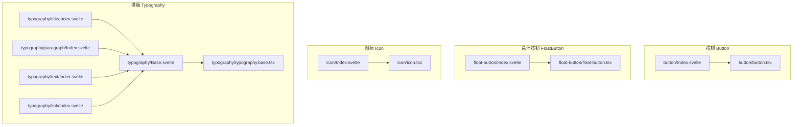
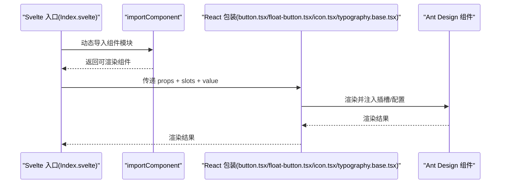
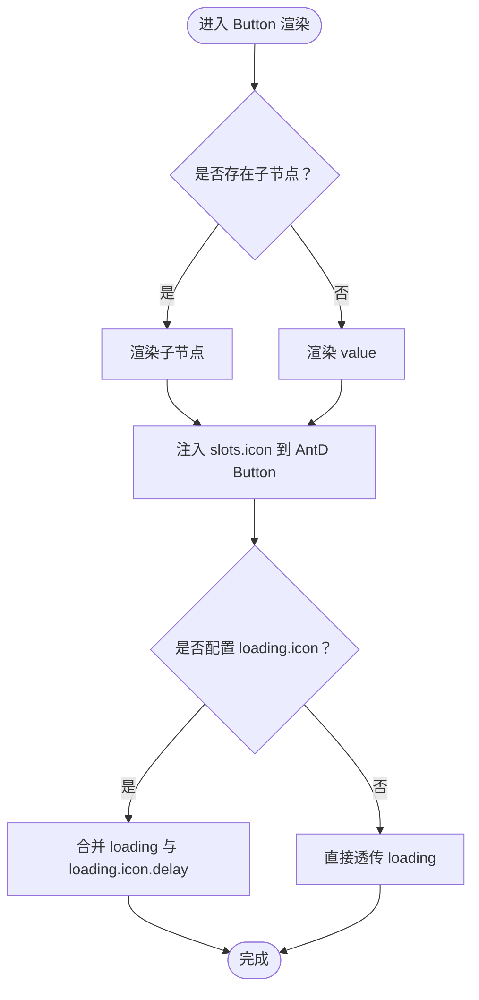
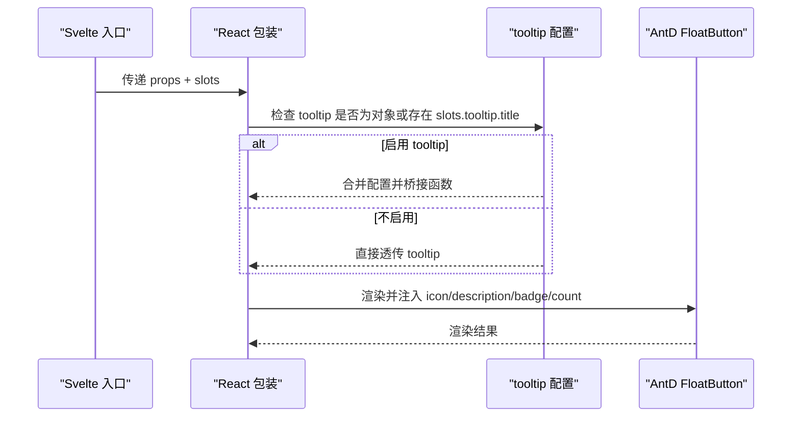
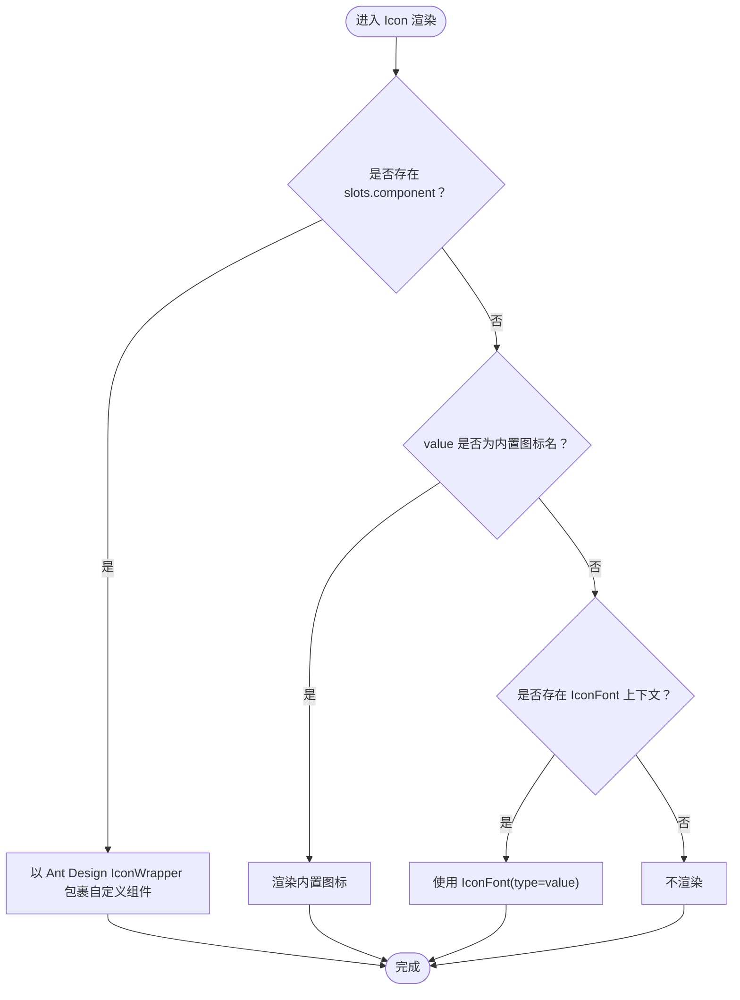
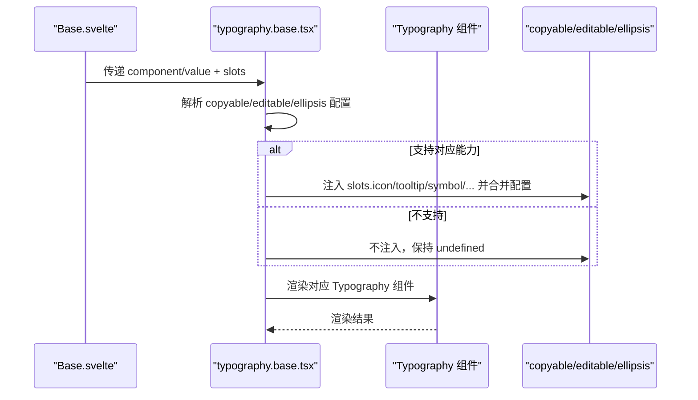
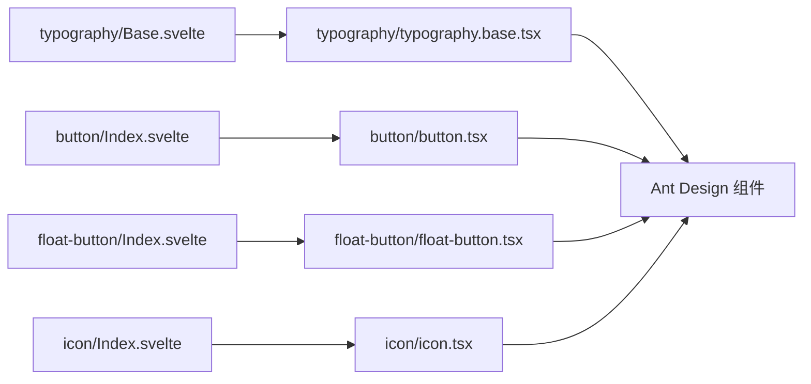

# 通用组件 API

<cite>
**本文引用的文件**
- [frontend/antd/button/button.tsx](file://frontend/antd/button/button.tsx)
- [frontend/antd/button/Index.svelte](file://frontend/antd/button/Index.svelte)
- [frontend/antd/float-button/float-button.tsx](file://frontend/antd/float-button/float-button.tsx)
- [frontend/antd/float-button/Index.svelte](file://frontend/antd/float-button/Index.svelte)
- [frontend/antd/icon/icon.tsx](file://frontend/antd/icon/icon.tsx)
- [frontend/antd/icon/Index.svelte](file://frontend/antd/icon/Index.svelte)
- [frontend/antd/typography/typography.base.tsx](file://frontend/antd/typography/typography.base.tsx)
- [frontend/antd/typography/Base.svelte](file://frontend/antd/typography/Base.svelte)
- [frontend/antd/typography/title/Index.svelte](file://frontend/antd/typography/title/Index.svelte)
- [frontend/antd/typography/paragraph/Index.svelte](file://frontend/antd/typography/paragraph/Index.svelte)
- [frontend/antd/typography/text/Index.svelte](file://frontend/antd/typography/text/Index.svelte)
- [frontend/antd/typography/link/Index.svelte](file://frontend/antd/typography/link/Index.svelte)
</cite>

## 目录

1. [简介](#简介)
2. [项目结构](#项目结构)
3. [核心组件](#核心组件)
4. [架构总览](#架构总览)
5. [组件详解](#组件详解)
6. [依赖关系分析](#依赖关系分析)
7. [性能考量](#性能考量)
8. [故障排查指南](#故障排查指南)
9. [结论](#结论)
10. [附录](#附录)

## 简介

本文件为 ModelScope Studio 中基于 Ant Design 的通用组件 API 参考文档，覆盖 Button、FloatButton、Icon、Typography 等组件。内容包括：

- 属性定义与事件处理
- 插槽（slots）与样式定制
- 使用场景与最佳实践
- TypeScript 类型与与原生 Ant Design 对应关系
- 响应式设计、无障碍与性能优化建议

## 项目结构

这些组件采用“Svelte 入口 + React 包装”的统一模式：Svelte 入口负责属性透传、类名与可见性控制；React 包装负责对接 Ant Design 组件，实现插槽渲染与复杂交互。

图表来源

- [frontend/antd/button/Index.svelte:1-74](file://frontend/antd/button/Index.svelte#L1-L74)
- [frontend/antd/button/button.tsx:1-39](file://frontend/antd/button/button.tsx#L1-L39)
- [frontend/antd/float-button/Index.svelte:1-70](file://frontend/antd/float-button/Index.svelte#L1-L70)
- [frontend/antd/float-button/float-button.tsx:1-75](file://frontend/antd/float-button/float-button.tsx#L1-L75)
- [frontend/antd/icon/Index.svelte:1-67](file://frontend/antd/icon/Index.svelte#L1-L67)
- [frontend/antd/icon/icon.tsx:1-55](file://frontend/antd/icon/icon.tsx#L1-L55)
- [frontend/antd/typography/Base.svelte:1-85](file://frontend/antd/typography/Base.svelte#L1-L85)
- [frontend/antd/typography/typography.base.tsx:1-170](file://frontend/antd/typography/typography.base.tsx#L1-L170)
- [frontend/antd/typography/title/Index.svelte:1-12](file://frontend/antd/typography/title/Index.svelte#L1-L12)
- [frontend/antd/typography/paragraph/Index.svelte:1-12](file://frontend/antd/typography/paragraph/Index.svelte#L1-L12)
- [frontend/antd/typography/text/Index.svelte:1-12](file://frontend/antd/typography/text/Index.svelte#L1-L12)
- [frontend/antd/typography/link/Index.svelte:1-12](file://frontend/antd/typography/link/Index.svelte#L1-L12)

章节来源

- [frontend/antd/button/Index.svelte:1-74](file://frontend/antd/button/Index.svelte#L1-L74)
- [frontend/antd/float-button/Index.svelte:1-70](file://frontend/antd/float-button/Index.svelte#L1-L70)
- [frontend/antd/icon/Index.svelte:1-67](file://frontend/antd/icon/Index.svelte#L1-L67)
- [frontend/antd/typography/Base.svelte:1-85](file://frontend/antd/typography/Base.svelte#L1-L85)

## 核心组件

- Button：对齐 Ant Design Button，支持 icon、loading.icon 插槽，以及 value 与 children 的优先级逻辑。
- FloatButton：对齐 Ant Design FloatButton，支持 icon、description、tooltip、badge.count 插槽，以及 tooltip 配置函数桥接。
- Icon：支持内置 Ant Design 图标与 IconFont，支持自定义 component 插槽。
- Typography：统一的排版基座，支持 title、paragraph、text、link 四种形态，支持 copyable、editable、ellipsis 的插槽化配置。

章节来源

- [frontend/antd/button/button.tsx:1-39](file://frontend/antd/button/button.tsx#L1-L39)
- [frontend/antd/float-button/float-button.tsx:1-75](file://frontend/antd/float-button/float-button.tsx#L1-L75)
- [frontend/antd/icon/icon.tsx:1-55](file://frontend/antd/icon/icon.tsx#L1-L55)
- [frontend/antd/typography/typography.base.tsx:1-170](file://frontend/antd/typography/typography.base.tsx#L1-L170)

## 架构总览

组件统一通过 Svelte 入口完成：

- 属性透传与额外属性合并
- 可见性控制与类名拼接
- 插槽上下文注入
- 懒加载与异步组件渲染

React 包装层完成：

- 与 Ant Design 组件对接
- 插槽到 ReactSlot 的映射
- 复杂配置对象（如 tooltip、ellipsis）的条件渲染与函数桥接

图表来源

- [frontend/antd/button/Index.svelte:10-73](file://frontend/antd/button/Index.svelte#L10-L73)
- [frontend/antd/button/button.tsx:8-36](file://frontend/antd/button/button.tsx#L8-L36)
- [frontend/antd/float-button/Index.svelte:10-69](file://frontend/antd/float-button/Index.svelte#L10-L69)
- [frontend/antd/float-button/float-button.tsx:14-72](file://frontend/antd/float-button/float-button.tsx#L14-L72)
- [frontend/antd/icon/Index.svelte:10-66](file://frontend/antd/icon/Index.svelte#L10-L66)
- [frontend/antd/icon/icon.tsx:12-52](file://frontend/antd/icon/icon.tsx#L12-L52)
- [frontend/antd/typography/Base.svelte:11-83](file://frontend/antd/typography/Base.svelte#L11-L83)
- [frontend/antd/typography/typography.base.tsx:19-167](file://frontend/antd/typography/typography.base.tsx#L19-L167)

## 组件详解

### Button（按钮）

- 能力概览
  - 支持 Ant Design Button 的全部属性与事件
  - 插槽：icon、loading.icon
  - 内容优先级：当存在子节点时优先渲染子节点，否则回退到 value
- 关键行为
  - 将 slots.icon 注入到 Ant Design Button 的 icon
  - 将 slots.loading.icon 注入到 loading.icon，并保留 loading.delay（若为对象）
- 使用场景
  - 基础按钮、带图标的按钮、加载中的按钮
- 示例（路径）
  - 基本用法：[frontend/antd/button/Index.svelte:59-73](file://frontend/antd/button/Index.svelte#L59-L73)
  - 插槽图标：[frontend/antd/button/button.tsx:18-30](file://frontend/antd/button/button.tsx#L18-L30)
- 类型与原生对应
  - 通过 sveltify 包装 Ant Design Button 的 GetProps 类型，保持一致的属性签名
- 样式与无障碍
  - 通过 elem_classes/elem_id/elem_style 控制样式与 ID；无障碍由 Ant Design 提供
- 性能
  - 子节点检测与条件渲染，避免不必要的 DOM 更新

图表来源

- [frontend/antd/button/button.tsx:11-36](file://frontend/antd/button/button.tsx#L11-L36)

章节来源

- [frontend/antd/button/button.tsx:1-39](file://frontend/antd/button/button.tsx#L1-L39)
- [frontend/antd/button/Index.svelte:1-74](file://frontend/antd/button/Index.svelte#L1-L74)

### FloatButton（悬浮按钮）

- 能力概览
  - 支持 Ant Design FloatButton 的全部属性与事件
  - 插槽：icon、description、tooltip、tooltip.title、badge.count
  - tooltip 支持对象配置，内部将 afterOpenChange、getPopupContainer 等函数桥接到 useFunction
- 关键行为
  - 当存在 slots.tooltip 或 tooltip 为对象时启用 tooltip 配置
  - 将 slots.icon/description/badge.count 映射到对应属性
- 使用场景
  - 返回顶部、悬浮操作面板、带描述与徽标的悬浮入口
- 示例（路径）
  - 基本用法：[frontend/antd/float-button/Index.svelte:56-69](file://frontend/antd/float-button/Index.svelte#L56-L69)
  - 插槽与 tooltip 配置：[frontend/antd/float-button/float-button.tsx:19-72](file://frontend/antd/float-button/float-button.tsx#L19-L72)
- 类型与原生对应
  - 通过 sveltify 包装 Ant Design FloatButton 的 GetProps 类型，并扩展 id 字段
- 样式与无障碍
  - 通过 elem_classes/elem_id/elem_style 控制样式与 ID；无障碍由 Ant Design 提供
- 性能
  - 条件渲染 tooltip 与插槽，减少不必要开销

图表来源

- [frontend/antd/float-button/float-button.tsx:14-72](file://frontend/antd/float-button/float-button.tsx#L14-L72)
- [frontend/antd/float-button/Index.svelte:1-70](file://frontend/antd/float-button/Index.svelte#L1-L70)

章节来源

- [frontend/antd/float-button/float-button.tsx:1-75](file://frontend/antd/float-button/float-button.tsx#L1-L75)
- [frontend/antd/float-button/Index.svelte:1-70](file://frontend/antd/float-button/Index.svelte#L1-L70)

### Icon（图标）

- 能力概览
  - 支持 Ant Design 内置图标名称映射
  - 支持 IconFontProvider 提供的字体图标
  - 插槽：component（用于自定义 SVG 组件）
- 关键行为
  - 若提供 slots.component，则以 Ant Design IconWrapper 渲染自定义组件
  - 否则根据 value 查找内置图标或使用 IconFont.type
- 使用场景
  - 文本内嵌图标、按钮图标、自定义矢量图标
- 示例（路径）
  - 基本用法：[frontend/antd/icon/Index.svelte:52-66](file://frontend/antd/icon/Index.svelte#L52-L66)
  - 自定义组件与 IconFont：[frontend/antd/icon/icon.tsx:12-52](file://frontend/antd/icon/icon.tsx#L12-L52)
- 类型与原生对应
  - 通过 sveltify 包装 Ant Design Icons 的 GetProps 类型，并扩展 value 字段
- 样式与无障碍
  - 通过 elem_classes/elem_id/elem_style 控制样式与 ID；无障碍由 Ant Design 提供
- 性能
  - useMemo 缓存自定义组件，避免重复创建

图表来源

- [frontend/antd/icon/icon.tsx:12-52](file://frontend/antd/icon/icon.tsx#L12-L52)
- [frontend/antd/icon/Index.svelte:1-67](file://frontend/antd/icon/Index.svelte#L1-L67)

章节来源

- [frontend/antd/icon/icon.tsx:1-55](file://frontend/antd/icon/icon.tsx#L1-L55)
- [frontend/antd/icon/Index.svelte:1-67](file://frontend/antd/icon/Index.svelte#L1-L67)

### Typography（排版）

- 能力概览
  - 统一基座：title、paragraph、text、link 四种形态
  - 支持 copyable、editable、ellipsis 的插槽化配置
  - 插槽：copyable.icon、copyable.tooltips、editable.icon、editable.tooltip、editable.enterIcon、ellipsis.symbol、ellipsis.tooltip、ellipsis.tooltip.title
- 关键行为
  - 根据 component 选择对应 Ant Design Typography 组件
  - 条件注入 copyable、editable、ellipsis 配置
  - ellipsis 在 link 组件上启用条件不同
- 使用场景
  - 标题、段落、文本、链接的统一排版与交互
- 示例（路径）
  - 基本用法：[frontend/antd/typography/Base.svelte:65-84](file://frontend/antd/typography/Base.svelte#L65-L84)
  - 子组件别名：[frontend/antd/typography/title/Index.svelte:9-11](file://frontend/antd/typography/title/Index.svelte#L9-L11)
  - 插槽与配置合并：[frontend/antd/typography/typography.base.tsx:19-167](file://frontend/antd/typography/typography.base.tsx#L19-L167)
- 类型与原生对应
  - 通过 sveltify 包装 Ant Design Typography 的多种类型，并扩展 component 与 value 字段
- 样式与无障碍
  - 通过 elem_classes/elem_id/elem_style 控制样式与 ID；无障碍由 Ant Design 提供
- 性能
  - 条件渲染与插槽目标收集，减少不必要开销

图表来源

- [frontend/antd/typography/Base.svelte:11-83](file://frontend/antd/typography/Base.svelte#L11-L83)
- [frontend/antd/typography/typography.base.tsx:19-167](file://frontend/antd/typography/typography.base.tsx#L19-L167)

章节来源

- [frontend/antd/typography/typography.base.tsx:1-170](file://frontend/antd/typography/typography.base.tsx#L1-L170)
- [frontend/antd/typography/Base.svelte:1-85](file://frontend/antd/typography/Base.svelte#L1-L85)
- [frontend/antd/typography/title/Index.svelte:1-12](file://frontend/antd/typography/title/Index.svelte#L1-L12)
- [frontend/antd/typography/paragraph/Index.svelte:1-12](file://frontend/antd/typography/paragraph/Index.svelte#L1-L12)
- [frontend/antd/typography/text/Index.svelte:1-12](file://frontend/antd/typography/text/Index.svelte#L1-L12)
- [frontend/antd/typography/link/Index.svelte:1-12](file://frontend/antd/typography/link/Index.svelte#L1-L12)

## 依赖关系分析

- 组件间耦合
  - Typography 的四个子组件仅作为 Base 的别名，降低重复与耦合
  - Button/FloatButton/Icon 的入口与实现分离，便于维护与扩展
- 外部依赖
  - Ant Design 组件库（Button、FloatButton、Typography、Icon 等）
  - @svelte-preprocess-react（sveltify、ReactSlot、useFunction 等）
  - 工具函数：useTargets、useSlotsChildren、omitUndefinedProps、renderParamsSlot 等
- 潜在循环依赖
  - 未发现直接循环依赖；各组件按入口 → 实现 → Ant Design 的单向依赖

图表来源

- [frontend/antd/button/Index.svelte:1-74](file://frontend/antd/button/Index.svelte#L1-L74)
- [frontend/antd/button/button.tsx:1-39](file://frontend/antd/button/button.tsx#L1-L39)
- [frontend/antd/float-button/Index.svelte:1-70](file://frontend/antd/float-button/Index.svelte#L1-L70)
- [frontend/antd/float-button/float-button.tsx:1-75](file://frontend/antd/float-button/float-button.tsx#L1-L75)
- [frontend/antd/icon/Index.svelte:1-67](file://frontend/antd/icon/Index.svelte#L1-L67)
- [frontend/antd/icon/icon.tsx:1-55](file://frontend/antd/icon/icon.tsx#L1-L55)
- [frontend/antd/typography/Base.svelte:1-85](file://frontend/antd/typography/Base.svelte#L1-L85)
- [frontend/antd/typography/typography.base.tsx:1-170](file://frontend/antd/typography/typography.base.tsx#L1-L170)

章节来源

- [frontend/antd/button/Index.svelte:1-74](file://frontend/antd/button/Index.svelte#L1-L74)
- [frontend/antd/float-button/Index.svelte:1-70](file://frontend/antd/float-button/Index.svelte#L1-L70)
- [frontend/antd/icon/Index.svelte:1-67](file://frontend/antd/icon/Index.svelte#L1-L67)
- [frontend/antd/typography/Base.svelte:1-85](file://frontend/antd/typography/Base.svelte#L1-L85)

## 性能考量

- 按需渲染
  - 通过条件判断与 slots 检测，仅在需要时注入配置与插槽，减少渲染成本
- 函数桥接
  - tooltip 等配置中的回调通过 useFunction 桥接，避免每次渲染创建新函数
- 计算缓存
  - Icon 使用 useMemo 缓存自定义组件，避免重复创建
- 异步加载
  - 通过 importComponent 懒加载，降低首屏压力

## 故障排查指南

- 插槽未生效
  - 确认插槽名称与组件支持列表一致（如 Button 的 icon、loading.icon；FloatButton 的 icon/description/tooltip/badge.count；Typography 的 copyable._、editable._、ellipsis.\*）
- Tooltip 回调无效
  - 确认 tooltip 为对象时，相关回调已通过 useFunction 桥接
- 自定义图标不显示
  - 确认 value 为有效图标名或 IconFont 上下文可用
- ellipsis 在 link 上不生效
  - 确认 ellipsis 配置存在或插槽已提供
- 可见性问题
  - 确认 visible 属性正确传递至入口组件

章节来源

- [frontend/antd/button/button.tsx:11-36](file://frontend/antd/button/button.tsx#L11-L36)
- [frontend/antd/float-button/float-button.tsx:19-72](file://frontend/antd/float-button/float-button.tsx#L19-L72)
- [frontend/antd/icon/icon.tsx:12-52](file://frontend/antd/icon/icon.tsx#L12-L52)
- [frontend/antd/typography/typography.base.tsx:19-167](file://frontend/antd/typography/typography.base.tsx#L19-L167)
- [frontend/antd/button/Index.svelte:59-73](file://frontend/antd/button/Index.svelte#L59-L73)
- [frontend/antd/float-button/Index.svelte:56-69](file://frontend/antd/float-button/Index.svelte#L56-L69)
- [frontend/antd/icon/Index.svelte:52-66](file://frontend/antd/icon/Index.svelte#L52-L66)
- [frontend/antd/typography/Base.svelte:65-84](file://frontend/antd/typography/Base.svelte#L65-L84)

## 结论

上述组件通过统一的 Svelte + React 包装模式，实现了与 Ant Design 的深度对齐与灵活扩展。借助插槽系统与工具函数，开发者可以在保持类型安全的同时，实现丰富的交互与样式定制。建议在实际项目中遵循本文档的属性与插槽约定，结合性能与无障碍建议，获得更稳定与可维护的用户体验。

## 附录

- 属性与插槽对照（摘要）
  - Button
    - 属性：继承 Ant Design Button 所有属性
    - 插槽：icon、loading.icon
  - FloatButton
    - 属性：继承 Ant Design FloatButton 所有属性
    - 插槽：icon、description、tooltip、tooltip.title、badge.count
  - Icon
    - 属性：value（字符串），继承 Ant Design Icon 所有属性
    - 插槽：component（自定义 SVG 组件）
  - Typography
    - 属性：component（'title'|'paragraph'|'text'|'link'），value（字符串）
    - 插槽：copyable.icon、copyable.tooltips；editable.icon、editable.tooltip、editable.enterIcon；ellipsis.symbol、ellipsis.tooltip、ellipsis.tooltip.title
