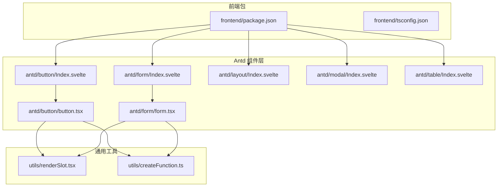
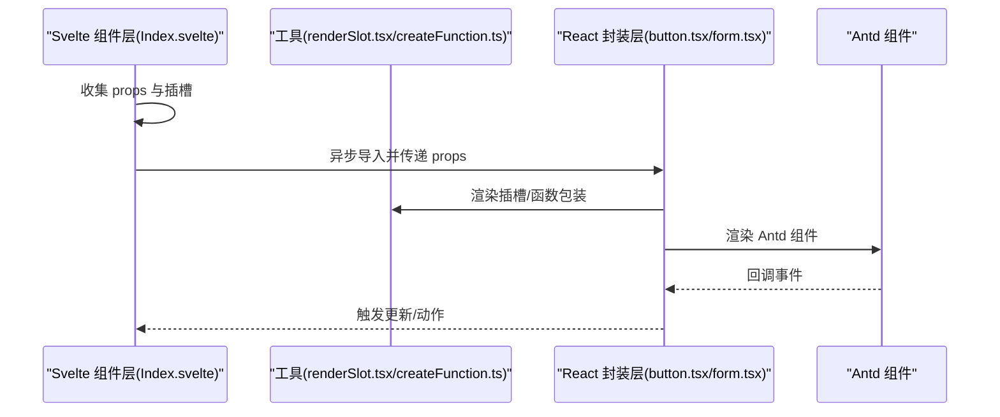
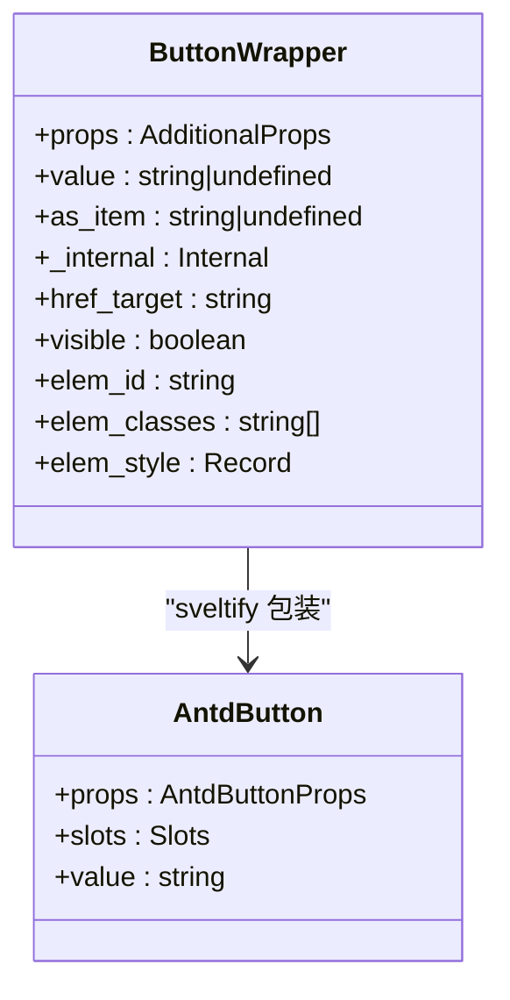
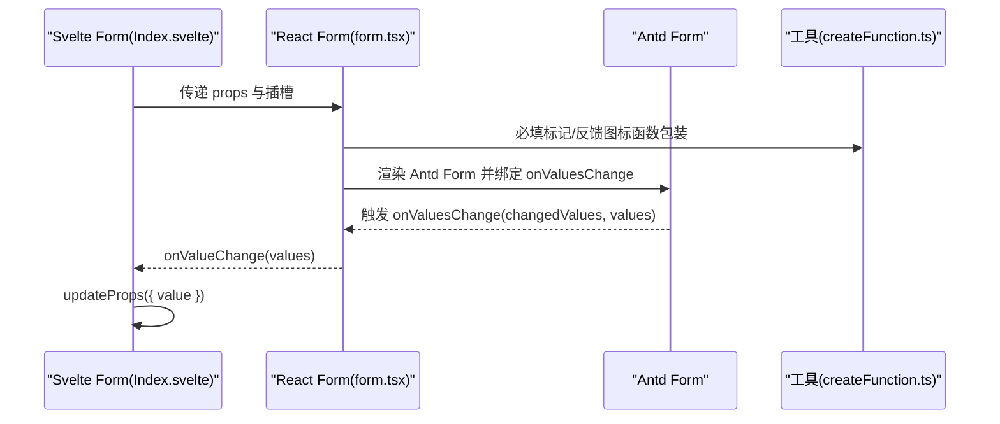
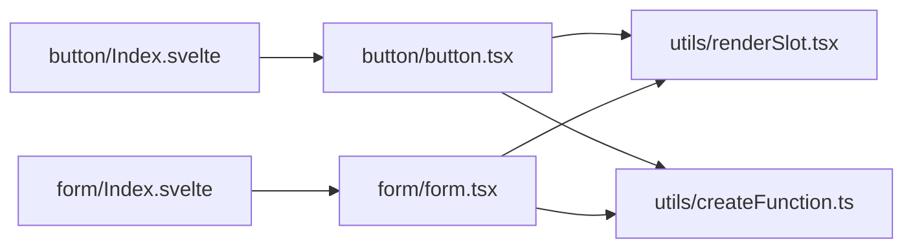

# Svelte 组件 API

<cite>
**本文引用的文件**
- [frontend/package.json](file://frontend/package.json)
- [frontend/tsconfig.json](file://frontend/tsconfig.json)
- [frontend/antd/button/Index.svelte](file://frontend/antd/button/Index.svelte)
- [frontend/antd/button/button.tsx](file://frontend/antd/button/button.tsx)
- [frontend/antd/form/Index.svelte](file://frontend/antd/form/Index.svelte)
- [frontend/antd/form/form.tsx](file://frontend/antd/form/form.tsx)
- [frontend/antd/layout/Index.svelte](file://frontend/antd/layout/Index.svelte)
- [frontend/antd/modal/Index.svelte](file://frontend/antd/modal/Index.svelte)
- [frontend/antd/table/Index.svelte](file://frontend/antd/table/Index.svelte)
- [frontend/utils/renderSlot.tsx](file://frontend/utils/renderSlot.tsx)
- [frontend/utils/createFunction.ts](file://frontend/utils/createFunction.ts)
</cite>

## 目录

1. [简介](#简介)
2. [项目结构](#项目结构)
3. [核心组件](#核心组件)
4. [架构总览](#架构总览)
5. [组件详解](#组件详解)
6. [依赖关系分析](#依赖关系分析)
7. [性能与最佳实践](#性能与最佳实践)
8. [故障排查指南](#故障排查指南)
9. [结论](#结论)
10. [附录](#附录)

## 简介

本文件为 ModelScope Studio 前端 Svelte 组件 API 参考文档，聚焦于基于 Ant Design（Antd）生态的 Svelte 组件封装体系。文档覆盖以下方面：

- 组件属性定义：props 接口、默认值与类型约束
- 事件系统：用户交互事件、状态变更事件与自定义事件
- 插槽系统：默认插槽、具名插槽与作用域插槽的使用
- 生命周期与渲染：组件实例化、异步加载与条件渲染
- 组件间通信：父子、兄弟与跨层级通信模式
- 样式定制：CSS 类名、主题变量与内联样式
- TypeScript 类型：接口规范、泛型使用与类型推导
- 性能优化：按需加载、派生计算与事件节流建议

## 项目结构

前端采用多包组织方式，核心组件位于 frontend/antd 与 frontend/antdx，通过 Svelte 5 与 React 组件桥接方案实现 Antd 组件在 Svelte 中的使用。

**图表来源**

- [frontend/package.json:1-59](file://frontend/package.json#L1-L59)
- [frontend/tsconfig.json:1-8](file://frontend/tsconfig.json#L1-L8)
- [frontend/antd/button/Index.svelte:1-74](file://frontend/antd/button/Index.svelte#L1-L74)
- [frontend/antd/button/button.tsx:1-39](file://frontend/antd/button/button.tsx#L1-L39)
- [frontend/antd/form/Index.svelte:1-99](file://frontend/antd/form/Index.svelte#L1-L99)
- [frontend/antd/form/form.tsx:1-79](file://frontend/antd/form/form.tsx#L1-L79)
- [frontend/antd/layout/Index.svelte:1-18](file://frontend/antd/layout/Index.svelte#L1-L18)
- [frontend/antd/modal/Index.svelte:1-63](file://frontend/antd/modal/Index.svelte#L1-L63)
- [frontend/antd/table/Index.svelte:1-61](file://frontend/antd/table/Index.svelte#L1-L61)
- [frontend/utils/renderSlot.tsx:1-29](file://frontend/utils/renderSlot.tsx#L1-L29)
- [frontend/utils/createFunction.ts:1-38](file://frontend/utils/createFunction.ts#L1-L38)

**章节来源**

- [frontend/package.json:1-59](file://frontend/package.json#L1-L59)
- [frontend/tsconfig.json:1-8](file://frontend/tsconfig.json#L1-L8)

## 核心组件

本节概述主要组件的职责与共性特征：

- 按钮（Button）：封装 Antd Button，支持图标与加载态插槽，具备可见性控制与类名拼接。
- 表单（Form）：封装 Antd Form，提供值同步、动作触发（重置/提交/校验）、必填标记与反馈图标插槽。
- 布局（Layout）：基础布局容器，透传 children 与组件标识。
- 模态框（Modal）：封装 Antd Modal，支持可见性控制与插槽。
- 表格（Table）：封装 Antd Table，支持可见性控制与插槽。

**章节来源**

- [frontend/antd/button/Index.svelte:1-74](file://frontend/antd/button/Index.svelte#L1-L74)
- [frontend/antd/button/button.tsx:1-39](file://frontend/antd/button/button.tsx#L1-L39)
- [frontend/antd/form/Index.svelte:1-99](file://frontend/antd/form/Index.svelte#L1-L99)
- [frontend/antd/form/form.tsx:1-79](file://frontend/antd/form/form.tsx#L1-L79)
- [frontend/antd/layout/Index.svelte:1-18](file://frontend/antd/layout/Index.svelte#L1-L18)
- [frontend/antd/modal/Index.svelte:1-63](file://frontend/antd/modal/Index.svelte#L1-L63)
- [frontend/antd/table/Index.svelte:1-61](file://frontend/antd/table/Index.svelte#L1-L61)

## 架构总览

组件采用“Svelte 层 + React 封装层 + 工具函数”的三层架构：

- Svelte 层：负责属性收集、插槽解析、条件渲染与异步加载。
- React 封装层：使用 sveltify 将 Antd 组件桥接为 Svelte 可用的组件，并处理插槽与回调。
- 工具函数：提供插槽渲染、函数字符串转函数等能力。

**图表来源**

- [frontend/antd/button/Index.svelte:1-74](file://frontend/antd/button/Index.svelte#L1-L74)
- [frontend/antd/button/button.tsx:1-39](file://frontend/antd/button/button.tsx#L1-L39)
- [frontend/antd/form/Index.svelte:1-99](file://frontend/antd/form/Index.svelte#L1-L99)
- [frontend/antd/form/form.tsx:1-79](file://frontend/antd/form/form.tsx#L1-L79)
- [frontend/utils/renderSlot.tsx:1-29](file://frontend/utils/renderSlot.tsx#L1-L29)
- [frontend/utils/createFunction.ts:1-38](file://frontend/utils/createFunction.ts#L1-L38)

## 组件详解

### 按钮（Button）

- 职责：将 Antd Button 暴露为 Svelte 组件，支持图标与加载态插槽；根据可见性条件渲染；拼接样式类名。
- 关键属性（props）
  - additional_props?: Record<string, any>：附加属性透传
  - value?: string | undefined：按钮文本或值
  - as_item?: string | undefined：作为项标识
  - \_internal: { layout?: boolean }：内部布局标记
  - href_target?: string：链接目标属性映射
  - 可见性与样式：visible、elem_id、elem_classes、elem_style
- 事件系统
  - 由底层 Antd Button 触发的事件通过 {...props} 透传
- 插槽系统
  - icon：图标插槽
  - loading.icon：加载态图标插槽
- 生命周期与渲染
  - 使用 importComponent 异步加载封装组件
  - 条件渲染：仅当 visible 为真时渲染
- 样式定制
  - 内联样式 style 与类名 className 透传
  - 固定类名 ms-gr-antd-button
- TypeScript 类型
  - 通过 sveltify 包装 Antd Button 的 GetProps 类型
  - 插槽白名单：['icon', 'loading.icon']

**图表来源**

- [frontend/antd/button/Index.svelte:12-56](file://frontend/antd/button/Index.svelte#L12-L56)
- [frontend/antd/button/button.tsx:8-36](file://frontend/antd/button/button.tsx#L8-L36)

**章节来源**

- [frontend/antd/button/Index.svelte:1-74](file://frontend/antd/button/Index.svelte#L1-L74)
- [frontend/antd/button/button.tsx:1-39](file://frontend/antd/button/button.tsx#L1-L39)

### 表单（Form）

- 职责：封装 Antd Form，提供值同步、动作触发与插槽扩展。
- 关键属性（props）
  - additional_props?: Record<string, any>
  - \_internal: { layout?: boolean }
  - value?: Record<string, any>：表单初始值
  - form_action?: FormProps['formAction'] | null：动作指令（reset/submit/validate/null）
  - form_name?: string：表单名称映射
  - fields_change?: any、finish_failed?: any、values_change?: any：事件映射
  - 可见性与样式：visible、elem_id、elem_classes、elem_style
- 事件系统
  - onValueChange(value: Record<string, any>)：值变化回调
  - onResetFormAction()：动作执行后重置 form_action
- 插槽系统
  - requiredMark：必填标记插槽
- 生命周期与渲染
  - 使用 importComponent 异步加载封装组件
  - 条件渲染：仅当 visible 为真时渲染
- 样式定制
  - 内联样式 style 与类名 className 透传
  - 固定类名 ms-gr-antd-form
- TypeScript 类型
  - FormProps 扩展 Antd Form Props，新增 value、onValueChange、formAction、onResetFormAction
  - 插槽白名单：['requiredMark']

**图表来源**

- [frontend/antd/form/Index.svelte:14-98](file://frontend/antd/form/Index.svelte#L14-L98)
- [frontend/antd/form/form.tsx:8-76](file://frontend/antd/form/form.tsx#L8-L76)
- [frontend/utils/createFunction.ts:10-37](file://frontend/utils/createFunction.ts#L10-L37)

**章节来源**

- [frontend/antd/form/Index.svelte:1-99](file://frontend/antd/form/Index.svelte#L1-L99)
- [frontend/antd/form/form.tsx:1-79](file://frontend/antd/form/form.tsx#L1-L79)

### 布局（Layout）

- 职责：基础布局容器，透传 children 与组件标识。
- 关键属性（props）
  - children: Snippet：默认插槽内容
- 生命周期与渲染
  - 直接将 Base 容器组件渲染为 layout
- 样式定制
  - 通过 Base 组件处理样式与类名

**章节来源**

- [frontend/antd/layout/Index.svelte:1-18](file://frontend/antd/layout/Index.svelte#L1-L18)

### 模态框（Modal）

- 职责：封装 Antd Modal，支持可见性控制与插槽。
- 关键属性（props）
  - additional_props?: Record<string, any>
  - as_item?: string | undefined
  - \_internal: { layout?: boolean }
  - 可见性与样式：visible、elem_id、elem_classes、elem_style
- 插槽系统
  - 默认插槽：内容区域
- 样式定制
  - 固定类名 ms-gr-antd-modal

**章节来源**

- [frontend/antd/modal/Index.svelte:1-63](file://frontend/antd/modal/Index.svelte#L1-L63)

### 表格（Table）

- 职责：封装 Antd Table，支持可见性控制与插槽。
- 关键属性（props）
  - additional_props?: Record<string, any>
  - as_item?: string | undefined
    \_internal: {}
  - 可见性与样式：visible、elem_id、elem_classes、elem_style
- 插槽系统
  - 默认插槽：内容区域
- 样式定制
  - 固定类名 ms-gr-antd-table

**章节来源**

- [frontend/antd/table/Index.svelte:1-61](file://frontend/antd/table/Index.svelte#L1-L61)

## 依赖关系分析

- 组件依赖
  - Svelte 层依赖 @svelte-preprocess-react 提供的 getProps/importComponent/processProps/getSlots
  - React 封装层依赖 Ant Design 组件库与 @svelte-preprocess-react 的 sveltify 与 ReactSlot
  - 工具层提供插槽渲染与函数字符串解析能力
- 外部依赖
  - Svelte 5、Antd、classnames、dayjs、immer、lodash-es、marked、mermaid、monaco-editor 等

**图表来源**

- [frontend/antd/button/Index.svelte:6-7](file://frontend/antd/button/Index.svelte#L6-L7)
- [frontend/antd/button/button.tsx:1-6](file://frontend/antd/button/button.tsx#L1-L6)
- [frontend/antd/form/Index.svelte:6-7](file://frontend/antd/form/Index.svelte#L6-L7)
- [frontend/antd/form/form.tsx:1-6](file://frontend/antd/form/form.tsx#L1-L6)
- [frontend/utils/renderSlot.tsx:1-29](file://frontend/utils/renderSlot.tsx#L1-L29)
- [frontend/utils/createFunction.ts:1-38](file://frontend/utils/createFunction.ts#L1-L38)

**章节来源**

- [frontend/package.json:8-39](file://frontend/package.json#L8-L39)

## 性能与最佳实践

- 按需加载
  - 使用 importComponent 异步导入 React 封装组件，避免首屏阻塞
- 派生计算
  - 使用 $derived 对 props 进行派生，减少重复计算
- 事件节流与去抖
  - 对频繁触发的回调（如 onValuesChange）可结合工具函数进行节流/去抖
- 插槽渲染优化
  - 合理使用 forceClone 与 params，避免不必要的克隆开销
- 样式与主题
  - 优先使用 className 与内联样式组合，必要时引入 Antd 主题变量以保证一致性

[本节为通用指导，无需特定文件引用]

## 故障排查指南

- 插槽未生效
  - 检查插槽名称是否与封装层白名单一致（如 icon、loading.icon、requiredMark）
  - 确认插槽元素已正确传递至 slots
- 函数字符串无法执行
  - 使用 createFunction 将字符串转换为函数，确保格式合法
- 动作未触发
  - 确认 form_action 的值与封装层 switch 分支匹配（reset/submit/validate/null）
  - 在动作执行后及时调用 onResetFormAction 重置状态
- 可见性问题
  - 确保 visible 为真值时才渲染组件，避免空渲染

**章节来源**

- [frontend/antd/button/button.tsx:10-36](file://frontend/antd/button/button.tsx#L10-L36)
- [frontend/antd/form/form.tsx:32-45](file://frontend/antd/form/form.tsx#L32-L45)
- [frontend/utils/createFunction.ts:10-37](file://frontend/utils/createFunction.ts#L10-L37)

## 结论

ModelScope Studio 的 Svelte 组件 API 通过统一的桥接层与工具函数，实现了 Antd 组件在 Svelte 中的稳定使用。其设计强调：

- 明确的 props 接口与类型约束
- 丰富的插槽系统与事件映射
- 可控的渲染与样式策略
- 可扩展的工具链以支撑复杂场景

[本节为总结，无需特定文件引用]

## 附录

### 组件属性与事件速查（摘要）

- 按钮（Button）
  - 属性：additional_props、value、as_item、\_internal、href_target、visible、elem_id、elem_classes、elem_style
  - 事件：由 Antd Button 透传
  - 插槽：icon、loading.icon
  - 类名：固定 ms-gr-antd-button
- 表单（Form）
  - 属性：additional_props、\_internal、value、form_action、form_name、fields_change、finish_failed、values_change、visible、elem_id、elem_classes、elem_style
  - 事件：onValueChange、onResetFormAction
  - 插槽：requiredMark
  - 类名：固定 ms-gr-antd-form
- 布局（Layout）
  - 属性：children（默认插槽）
- 模态框（Modal）
  - 属性：additional_props、as_item、\_internal、visible、elem_id、elem_classes、elem_style
  - 类名：固定 ms-gr-antd-modal
- 表格（Table）
  - 属性：additional_props、as_item、\_internal、visible、elem_id、elem_classes、elem_style
  - 类名：固定 ms-gr-antd-table

**章节来源**

- [frontend/antd/button/Index.svelte:12-56](file://frontend/antd/button/Index.svelte#L12-L56)
- [frontend/antd/button/button.tsx:8-36](file://frontend/antd/button/button.tsx#L8-L36)
- [frontend/antd/form/Index.svelte:14-98](file://frontend/antd/form/Index.svelte#L14-L98)
- [frontend/antd/form/form.tsx:8-76](file://frontend/antd/form/form.tsx#L8-L76)
- [frontend/antd/layout/Index.svelte:6-14](file://frontend/antd/layout/Index.svelte#L6-L14)
- [frontend/antd/modal/Index.svelte:22-44](file://frontend/antd/modal/Index.svelte#L22-L44)
- [frontend/antd/table/Index.svelte:20-42](file://frontend/antd/table/Index.svelte#L20-L42)
