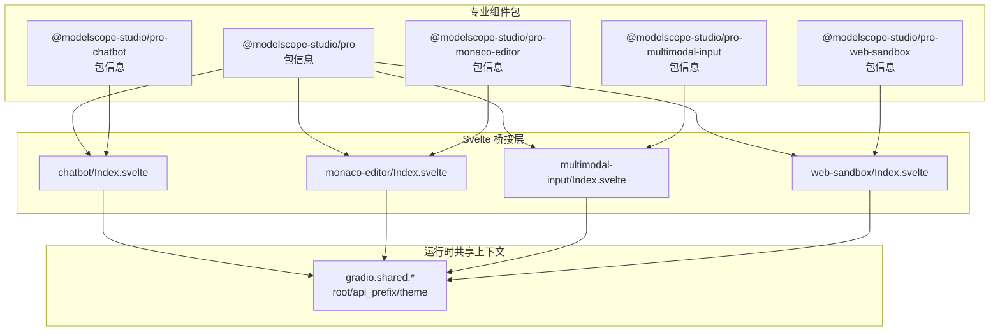
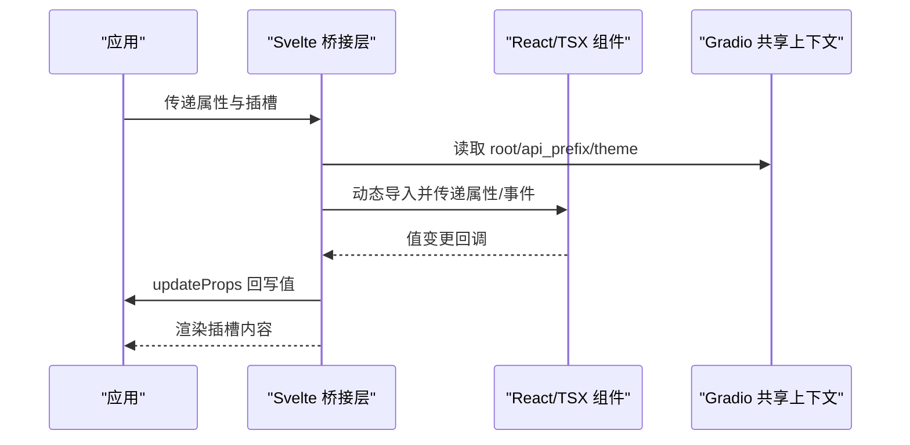
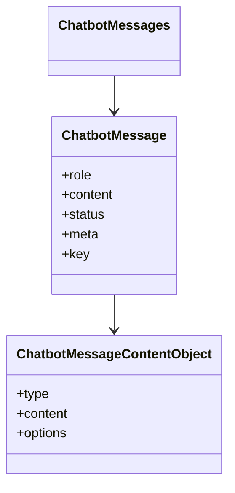
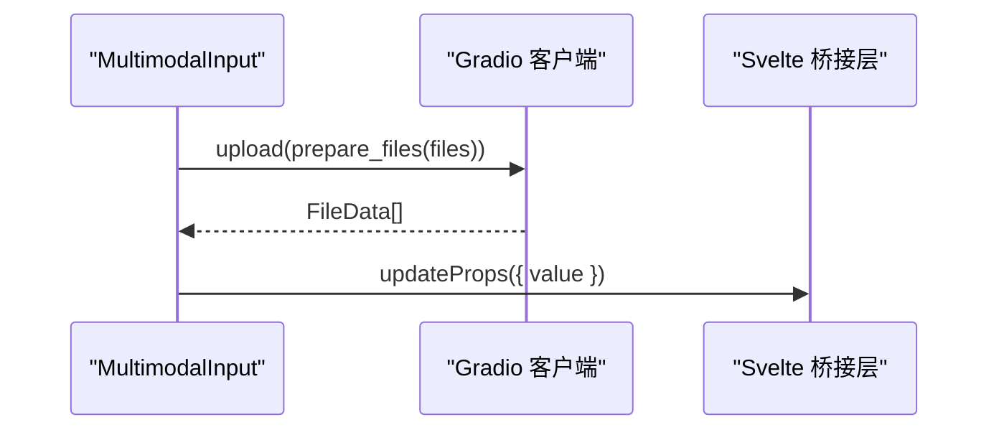
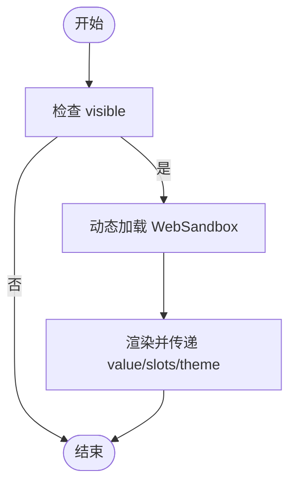
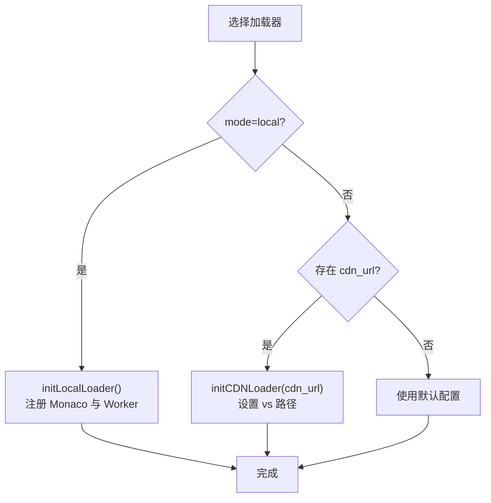
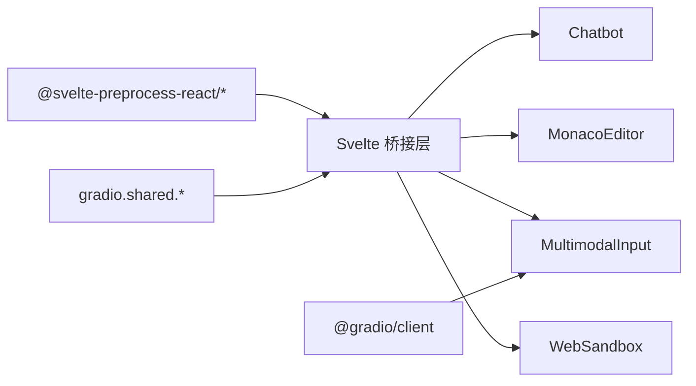

# 专业组件 API

<cite>
**本文引用的文件**
- [frontend/pro/package.json](file://frontend/pro/package.json)
- [frontend/pro/chatbot/package.json](file://frontend/pro/chatbot/package.json)
- [frontend/pro/monaco-editor/package.json](file://frontend/pro/monaco-editor/package.json)
- [frontend/pro/multimodal-input/package.json](file://frontend/pro/multimodal-input/package.json)
- [frontend/pro/web-sandbox/package.json](file://frontend/pro/web-sandbox/package.json)
- [frontend/pro/chatbot/Index.svelte](file://frontend/pro/chatbot/Index.svelte)
- [frontend/pro/monaco-editor/Index.svelte](file://frontend/pro/monaco-editor/Index.svelte)
- [frontend/pro/multimodal-input/Index.svelte](file://frontend/pro/multimodal-input/Index.svelte)
- [frontend/pro/web-sandbox/Index.svelte](file://frontend/pro/web-sandbox/Index.svelte)
- [frontend/pro/chatbot/type.ts](file://frontend/pro/chatbot/type.ts)
- [frontend/pro/monaco-editor/loader.ts](file://frontend/pro/monaco-editor/loader.ts)
</cite>

## 目录

1. [简介](#简介)
2. [项目结构](#项目结构)
3. [核心组件](#核心组件)
4. [架构总览](#架构总览)
5. [详细组件分析](#详细组件分析)
6. [依赖关系分析](#依赖关系分析)
7. [性能考虑](#性能考虑)
8. [故障排查指南](#故障排查指南)
9. [结论](#结论)
10. [附录](#附录)

## 简介

本文件为 ModelScope Studio 专业 Svelte 组件的权威参考文档，覆盖以下专业组件的完整 API：Chatbot（对话机器人）、MultimodalInput（多模态输入）、WebSandbox（网页沙盒）、MonacoEditor（代码编辑器）。内容包括：

- 属性定义与默认行为
- 事件处理与回调
- 插槽系统与渲染扩展
- 高级能力与集成点（如 Gradio 共享上下文）
- 实时通信与状态更新机制
- TypeScript 类型与接口规范
- 性能优化与最佳实践（尤其面向 AI 应用）

## 项目结构

专业组件位于前端工作区的 pro 目录下，每个组件以独立包形式导出，统一通过 Svelte 组件桥接至底层 React/TSX 实现，并借助 @svelte-preprocess-react 提供的 getProps/processProps/importComponent 能力完成属性透传、事件回写与动态加载。

图示来源

- [frontend/pro/package.json:1-6](file://frontend/pro/package.json#L1-L6)
- [frontend/pro/chatbot/package.json:1-15](file://frontend/pro/chatbot/package.json#L1-L15)
- [frontend/pro/monaco-editor/package.json:1-15](file://frontend/pro/monaco-editor/package.json#L1-L15)
- [frontend/pro/multimodal-input/package.json:1-15](file://frontend/pro/multimodal-input/package.json#L1-L15)
- [frontend/pro/web-sandbox/package.json:1-15](file://frontend/pro/web-sandbox/package.json#L1-L15)
- [frontend/pro/chatbot/Index.svelte:1-90](file://frontend/pro/chatbot/Index.svelte#L1-L90)
- [frontend/pro/monaco-editor/Index.svelte:1-101](file://frontend/pro/monaco-editor/Index.svelte#L1-L101)
- [frontend/pro/multimodal-input/Index.svelte:1-99](file://frontend/pro/multimodal-input/Index.svelte#L1-L99)
- [frontend/pro/web-sandbox/Index.svelte:1-76](file://frontend/pro/web-sandbox/Index.svelte#L1-L76)

章节来源

- [frontend/pro/package.json:1-6](file://frontend/pro/package.json#L1-L6)
- [frontend/pro/chatbot/package.json:1-15](file://frontend/pro/chatbot/package.json#L1-L15)
- [frontend/pro/monaco-editor/package.json:1-15](file://frontend/pro/monaco-editor/package.json#L1-L15)
- [frontend/pro/multimodal-input/package.json:1-15](file://frontend/pro/multimodal-input/package.json#L1-L15)
- [frontend/pro/web-sandbox/package.json:1-15](file://frontend/pro/web-sandbox/package.json#L1-L15)

## 核心组件

本节概述四个专业组件的职责与通用能力：

- Chatbot：对话消息流展示与交互，支持文本、工具调用、文件、欢迎语与建议提示等复合内容，具备用户/助手动作（复制、编辑、删除、点赞/踩、重试）与主题适配。
- MultimodalInput：多模态输入入口，支持文本与文件上传，提供上传钩子与事件回调，便于与 Gradio 客户端集成。
- WebSandbox：可编译与渲染的网页沙盒，提供编译错误/成功与渲染错误事件，支持主题模式与插槽扩展。
- MonacoEditor：基于 Monaco 的代码编辑器，支持本地或 CDN 加载器初始化，提供值变更事件与主题模式。

章节来源

- [frontend/pro/chatbot/Index.svelte:1-90](file://frontend/pro/chatbot/Index.svelte#L1-L90)
- [frontend/pro/multimodal-input/Index.svelte:1-99](file://frontend/pro/multimodal-input/Index.svelte#L1-L99)
- [frontend/pro/web-sandbox/Index.svelte:1-76](file://frontend/pro/web-sandbox/Index.svelte#L1-L76)
- [frontend/pro/monaco-editor/Index.svelte:1-101](file://frontend/pro/monaco-editor/Index.svelte#L1-L101)

## 架构总览

四个组件均采用统一的桥接模式：Svelte 层负责属性解析、事件回写、动态导入与插槽渲染；底层 TSX 组件承载具体 UI 逻辑；运行时共享上下文（gradio.shared）提供 root、api_prefix、theme 等全局配置。

图示来源

- [frontend/pro/chatbot/Index.svelte:14-64](file://frontend/pro/chatbot/Index.svelte#L14-L64)
- [frontend/pro/monaco-editor/Index.svelte:14-89](file://frontend/pro/monaco-editor/Index.svelte#L14-L89)
- [frontend/pro/multimodal-input/Index.svelte:17-66](file://frontend/pro/multimodal-input/Index.svelte#L17-L66)
- [frontend/pro/web-sandbox/Index.svelte:14-57](file://frontend/pro/web-sandbox/Index.svelte#L14-L57)

## 详细组件分析

### Chatbot 组件 API

- 包导出与入口
  - 包名与导出映射遵循标准，主入口指向 Index.svelte。
- 属性定义
  - additional_props：附加属性透传
  - as_item：元素标识
  - \_internal：内部布局标记
  - value：消息数组，类型见 ChatbotMessages
  - suggestion_select / welcome_prompt_select：事件回调别名映射
  - 可见性与样式：visible、elem_id、elem_classes、elem_style
  - 运行时共享：gradio.shared.root、gradio.shared.api_prefix、gradio.shared.theme
- 事件与回调
  - onValueChange：值变更回写到父组件
- 插槽系统
  - 支持 children 插槽与 slots 映射
- 数据模型与类型
  - ChatbotMessages、ChatbotMessage、ChatbotMessageContentObject、动作类型（like/dislike/retry/copy/edit/delete）等
- 高级特性
  - 主题模式继承自 gradio.shared.theme
  - 内置欢迎语、建议提示、文件/工具/文本内容的复合展示
- 使用示例（路径）
  - 基础使用与值绑定：[frontend/pro/chatbot/Index.svelte:76-84](file://frontend/pro/chatbot/Index.svelte#L76-L84)
  - 事件回写：[frontend/pro/chatbot/Index.svelte:76-80](file://frontend/pro/chatbot/Index.svelte#L76-L80)
  - 类型定义参考：[frontend/pro/chatbot/type.ts:160-197](file://frontend/pro/chatbot/type.ts#L160-L197)

图示来源

- [frontend/pro/chatbot/type.ts:137-158](file://frontend/pro/chatbot/type.ts#L137-L158)
- [frontend/pro/chatbot/type.ts:121-135](file://frontend/pro/chatbot/type.ts#L121-L135)

章节来源

- [frontend/pro/chatbot/package.json:1-15](file://frontend/pro/chatbot/package.json#L1-L15)
- [frontend/pro/chatbot/Index.svelte:14-64](file://frontend/pro/chatbot/Index.svelte#L14-L64)
- [frontend/pro/chatbot/Index.svelte:76-84](file://frontend/pro/chatbot/Index.svelte#L76-L84)
- [frontend/pro/chatbot/type.ts:160-197](file://frontend/pro/chatbot/type.ts#L160-L197)

### MultimodalInput 组件 API

- 包导出与入口
  - 包名与导出映射遵循标准，主入口指向 Index.svelte。
- 属性定义
  - additional_props：附加属性透传
  - \_internal：内部标记
  - value：多模态输入值，类型来自底层组件
  - key_press / paste_file / key_down：事件回调别名映射
  - 可见性与样式：visible、elem_id、elem_classes、elem_style
  - 运行时共享：gradio.shared.theme
- 事件与回调
  - onValueChange：值变更回写
- 插槽系统
  - 支持 children 插槽与 slots 映射
- 文件上传
  - upload 钩子：通过 gradio.shared.client.upload 上传文件，返回 FileData[]
- 使用示例（路径）
  - 值绑定与事件回写：[frontend/pro/multimodal-input/Index.svelte:88-92](file://frontend/pro/multimodal-input/Index.svelte#L88-L92)
  - 上传流程：[frontend/pro/multimodal-input/Index.svelte:68-75](file://frontend/pro/multimodal-input/Index.svelte#L68-L75)

图示来源

- [frontend/pro/multimodal-input/Index.svelte:68-75](file://frontend/pro/multimodal-input/Index.svelte#L68-L75)
- [frontend/pro/multimodal-input/Index.svelte:88-92](file://frontend/pro/multimodal-input/Index.svelte#L88-L92)

章节来源

- [frontend/pro/multimodal-input/package.json:1-15](file://frontend/pro/multimodal-input/package.json#L1-L15)
- [frontend/pro/multimodal-input/Index.svelte:17-66](file://frontend/pro/multimodal-input/Index.svelte#L17-L66)
- [frontend/pro/multimodal-input/Index.svelte:68-75](file://frontend/pro/multimodal-input/Index.svelte#L68-L75)

### WebSandbox 组件 API

- 包导出与入口
  - 包名与导出映射遵循标准，主入口指向 Index.svelte。
- 属性定义
  - additional_props：附加属性透传
  - \_internal：内部标记
  - value：沙盒值，类型来自底层组件
  - compile_error / compile_success / render_error：事件回调别名映射
  - 可见性与样式：visible、elem_id、elem_classes、elem_style
  - 运行时共享：gradio.shared.theme
- 插槽系统
  - 支持 children 插槽与 slots 映射
- 使用示例（路径）
  - 值绑定与主题：[frontend/pro/web-sandbox/Index.svelte:62-70](file://frontend/pro/web-sandbox/Index.svelte#L62-L70)

图示来源

- [frontend/pro/web-sandbox/Index.svelte:60-75](file://frontend/pro/web-sandbox/Index.svelte#L60-L75)

章节来源

- [frontend/pro/web-sandbox/package.json:1-15](file://frontend/pro/web-sandbox/package.json#L1-L15)
- [frontend/pro/web-sandbox/Index.svelte:14-57](file://frontend/pro/web-sandbox/Index.svelte#L14-L57)
- [frontend/pro/web-sandbox/Index.svelte:62-70](file://frontend/pro/web-sandbox/Index.svelte#L62-L70)

### MonacoEditor 组件 API

- 包导出与入口
  - 包名与导出映射遵循标准，主入口指向 Index.svelte。
- 属性定义
  - additional_props：附加属性透传
  - \_internal：内部标记
  - value：编辑器初始值
  - \_loader：加载器配置
    - mode：'cdn' | 'local'
    - cdn_url：CDN 路径
  - 可见性与样式：visible、elem_id、elem_classes、elem_style
  - 运行时共享：gradio.shared.theme
- 事件与回调
  - onValueChange：值变更回写
- 插槽系统
  - 支持 children 插槽与 slots 映射
- 加载器机制
  - 本地加载：初始化 Monaco 并按语言注册 Worker
  - CDN 加载：设置 vs 路径
- 使用示例（路径）
  - 值绑定与主题：[frontend/pro/monaco-editor/Index.svelte:79-89](file://frontend/pro/monaco-editor/Index.svelte#L79-L89)
  - 加载器选择与初始化：[frontend/pro/monaco-editor/Index.svelte:61-70](file://frontend/pro/monaco-editor/Index.svelte#L61-L70)
  - 加载器实现：[frontend/pro/monaco-editor/loader.ts:27-94](file://frontend/pro/monaco-editor/loader.ts#L27-L94)

图示来源

- [frontend/pro/monaco-editor/Index.svelte:61-70](file://frontend/pro/monaco-editor/Index.svelte#L61-L70)
- [frontend/pro/monaco-editor/loader.ts:27-94](file://frontend/pro/monaco-editor/loader.ts#L27-L94)

章节来源

- [frontend/pro/monaco-editor/package.json:1-15](file://frontend/pro/monaco-editor/package.json#L1-L15)
- [frontend/pro/monaco-editor/Index.svelte:14-89](file://frontend/pro/monaco-editor/Index.svelte#L14-L89)
- [frontend/pro/monaco-editor/loader.ts:27-94](file://frontend/pro/monaco-editor/loader.ts#L27-L94)

## 依赖关系分析

- 统一依赖链
  - Svelte 桥接层依赖 @svelte-preprocess-react 的 getProps/processProps/importComponent 与插槽工具
  - 各组件通过 gradio.shared 获取共享配置（root、api_prefix、theme）
  - 文件上传能力来自 @gradio/client 的 prepare_files 与 client.upload
- 组件间耦合
  - 低耦合：每个组件独立维护自身属性与事件
  - 高内聚：桥接层负责属性处理与动态加载，底层组件专注 UI 逻辑

图示来源

- [frontend/pro/chatbot/Index.svelte:1-12](file://frontend/pro/chatbot/Index.svelte#L1-L12)
- [frontend/pro/monaco-editor/Index.svelte:1-12](file://frontend/pro/monaco-editor/Index.svelte#L1-L12)
- [frontend/pro/multimodal-input/Index.svelte:1-9](file://frontend/pro/multimodal-input/Index.svelte#L1-L9)
- [frontend/pro/web-sandbox/Index.svelte:1-8](file://frontend/pro/web-sandbox/Index.svelte#L1-L8)

章节来源

- [frontend/pro/chatbot/Index.svelte:1-12](file://frontend/pro/chatbot/Index.svelte#L1-L12)
- [frontend/pro/monaco-editor/Index.svelte:1-12](file://frontend/pro/monaco-editor/Index.svelte#L1-L12)
- [frontend/pro/multimodal-input/Index.svelte:1-9](file://frontend/pro/multimodal-input/Index.svelte#L1-L9)
- [frontend/pro/web-sandbox/Index.svelte:1-8](file://frontend/pro/web-sandbox/Index.svelte#L1-L8)

## 性能考虑

- 动态导入与懒加载
  - 通过 importComponent 动态导入底层组件，避免首屏阻塞
- 计算属性与派生值
  - 使用 $derived 复用派生计算，减少不必要的重渲染
- 加载器策略
  - MonacoEditor 支持本地与 CDN 两种加载器，按需选择以平衡体积与网络开销
- 事件回写
  - 仅在值变化时触发 updateProps，避免频繁回写
- 文件上传
  - 使用 prepare_files 与 Gradio 客户端上传，减少手动序列化成本

## 故障排查指南

- 编辑器未加载
  - 检查 \_loader.mode 与 cdn_url 配置是否正确
  - 确认 initCDNLoader/initLocalLoader 已完成初始化
  - 参考：[frontend/pro/monaco-editor/Index.svelte:61-70](file://frontend/pro/monaco-editor/Index.svelte#L61-L70)、[frontend/pro/monaco-editor/loader.ts:27-94](file://frontend/pro/monaco-editor/loader.ts#L27-L94)
- 上传失败
  - 确认 gradio.shared.client 可用且 root 正确
  - 检查 prepare_files 与返回的 FileData[]
  - 参考：[frontend/pro/multimodal-input/Index.svelte:68-75](file://frontend/pro/multimodal-input/Index.svelte#L68-L75)
- 主题不生效
  - 确认 gradio.shared.theme 设置为 light/dark
  - 参考：[frontend/pro/chatbot/Index.svelte:83](file://frontend/pro/chatbot/Index.svelte#L83)、[frontend/pro/web-sandbox/Index.svelte:70](file://frontend/pro/web-sandbox/Index.svelte#L70)、[frontend/pro/monaco-editor/Index.svelte:88](file://frontend/pro/monaco-editor/Index.svelte#L88)

章节来源

- [frontend/pro/monaco-editor/Index.svelte:61-70](file://frontend/pro/monaco-editor/Index.svelte#L61-L70)
- [frontend/pro/monaco-editor/loader.ts:27-94](file://frontend/pro/monaco-editor/loader.ts#L27-L94)
- [frontend/pro/multimodal-input/Index.svelte:68-75](file://frontend/pro/multimodal-input/Index.svelte#L68-L75)
- [frontend/pro/chatbot/Index.svelte:83](file://frontend/pro/chatbot/Index.svelte#L83)
- [frontend/pro/web-sandbox/Index.svelte:70](file://frontend/pro/web-sandbox/Index.svelte#L70)
- [frontend/pro/monaco-editor/Index.svelte:88](file://frontend/pro/monaco-editor/Index.svelte#L88)

## 结论

本参考文档系统梳理了 ModelScope Studio 专业 Svelte 组件的 API 与实现要点，强调了桥接层的统一模式、运行时共享上下文的使用以及与 Gradio 生态的深度集成。通过合理的属性设计、事件回写与动态加载策略，这些组件能够高效支撑 AI 应用中的对话、编辑、多模态输入与沙盒渲染等核心场景。

## 附录

- TypeScript 类型与接口
  - Chatbot 类型：[frontend/pro/chatbot/type.ts:1-197](file://frontend/pro/chatbot/type.ts#L1-L197)
- 包导出与入口
  - Chatbot：[frontend/pro/chatbot/package.json:1-15](file://frontend/pro/chatbot/package.json#L1-L15)
  - MonacoEditor：[frontend/pro/monaco-editor/package.json:1-15](file://frontend/pro/monaco-editor/package.json#L1-L15)
  - MultimodalInput：[frontend/pro/multimodal-input/package.json:1-15](file://frontend/pro/multimodal-input/package.json#L1-L15)
  - WebSandbox：[frontend/pro/web-sandbox/package.json:1-15](file://frontend/pro/web-sandbox/package.json#L1-L15)
- 组件桥接实现
  - Chatbot：[frontend/pro/chatbot/Index.svelte:1-90](file://frontend/pro/chatbot/Index.svelte#L1-L90)
  - MonacoEditor：[frontend/pro/monaco-editor/Index.svelte:1-101](file://frontend/pro/monaco-editor/Index.svelte#L1-L101)
  - MultimodalInput：[frontend/pro/multimodal-input/Index.svelte:1-99](file://frontend/pro/multimodal-input/Index.svelte#L1-L99)
  - WebSandbox：[frontend/pro/web-sandbox/Index.svelte:1-76](file://frontend/pro/web-sandbox/Index.svelte#L1-L76)
