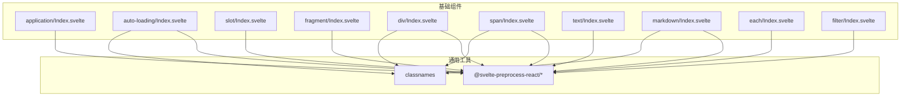
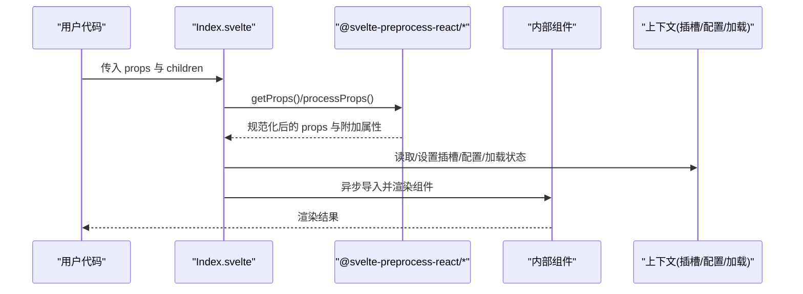
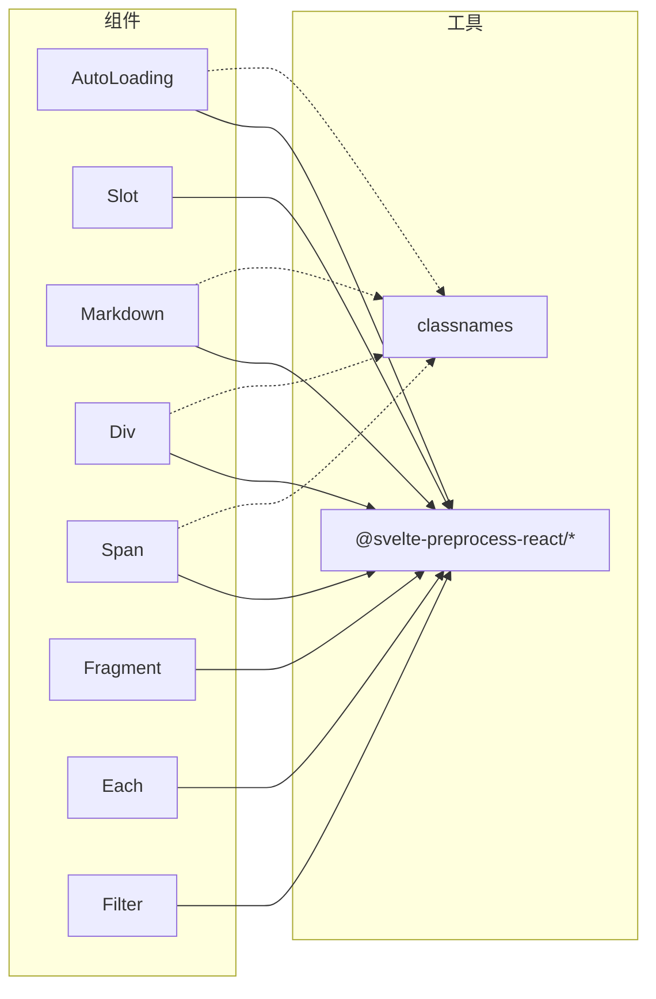

# 基础组件 API

<cite>
**本文引用的文件**
- [frontend/base/application/Index.svelte](file://frontend/base/application/Index.svelte)
- [frontend/base/auto-loading/Index.svelte](file://frontend/base/auto-loading/Index.svelte)
- [frontend/base/slot/Index.svelte](file://frontend/base/slot/Index.svelte)
- [frontend/base/fragment/Index.svelte](file://frontend/base/fragment/Index.svelte)
- [frontend/base/div/Index.svelte](file://frontend/base/div/Index.svelte)
- [frontend/base/span/Index.svelte](file://frontend/base/span/Index.svelte)
- [frontend/base/text/Index.svelte](file://frontend/base/text/Index.svelte)
- [frontend/base/markdown/Index.svelte](file://frontend/base/markdown/Index.svelte)
- [frontend/base/each/Index.svelte](file://frontend/base/each/Index.svelte)
- [frontend/base/filter/Index.svelte](file://frontend/base/filter/Index.svelte)
</cite>

## 目录

1. [简介](#简介)
2. [项目结构](#项目结构)
3. [核心组件](#核心组件)
4. [架构总览](#架构总览)
5. [详细组件分析](#详细组件分析)
6. [依赖关系分析](#依赖关系分析)
7. [性能考虑](#性能考虑)
8. [故障排查指南](#故障排查指南)
9. [结论](#结论)
10. [附录](#附录)

## 简介

本文件为 ModelScope Studio 基础 Svelte 组件的权威参考，覆盖 Application、AutoLoading、Slot、Fragment、Div、Span、Text、Markdown、Each、Filter 等组件的完整 API 规范与使用说明。内容包括：

- 属性定义与默认值
- 事件与回调约定
- 插槽系统与参数映射
- 生命周期与渲染控制（可见性、延迟加载）
- 组件间通信机制（上下文、插槽键、加载状态）
- TypeScript 类型约束与接口规范
- 实例化与配置示例路径
- 性能优化与最佳实践

## 项目结构

基础组件位于前端工作区的 base 目录下，采用“按组件分目录”的组织方式，每个组件包含一个入口 Index.svelte 以及对应的实现文件（如 .tsx 或 .svelte）。组件通过统一的预处理工具链进行属性提取、额外属性注入与延迟加载。

图表来源

- [frontend/base/application/Index.svelte:1-17](file://frontend/base/application/Index.svelte#L1-L17)
- [frontend/base/auto-loading/Index.svelte:1-81](file://frontend/base/auto-loading/Index.svelte#L1-L81)
- [frontend/base/slot/Index.svelte:1-68](file://frontend/base/slot/Index.svelte#L1-L68)
- [frontend/base/fragment/Index.svelte:1-50](file://frontend/base/fragment/Index.svelte#L1-L50)
- [frontend/base/div/Index.svelte:1-65](file://frontend/base/div/Index.svelte#L1-L65)
- [frontend/base/span/Index.svelte:1-64](file://frontend/base/span/Index.svelte#L1-L64)
- [frontend/base/text/Index.svelte:1-42](file://frontend/base/text/Index.svelte#L1-L42)
- [frontend/base/markdown/Index.svelte:1-64](file://frontend/base/markdown/Index.svelte#L1-L64)
- [frontend/base/each/Index.svelte:1-111](file://frontend/base/each/Index.svelte#L1-L111)
- [frontend/base/filter/Index.svelte:1-52](file://frontend/base/filter/Index.svelte#L1-L52)

章节来源

- [frontend/base/application/Index.svelte:1-17](file://frontend/base/application/Index.svelte#L1-L17)
- [frontend/base/auto-loading/Index.svelte:1-81](file://frontend/base/auto-loading/Index.svelte#L1-L81)
- [frontend/base/slot/Index.svelte:1-68](file://frontend/base/slot/Index.svelte#L1-L68)
- [frontend/base/fragment/Index.svelte:1-50](file://frontend/base/fragment/Index.svelte#L1-L50)
- [frontend/base/div/Index.svelte:1-65](file://frontend/base/div/Index.svelte#L1-L65)
- [frontend/base/span/Index.svelte:1-64](file://frontend/base/span/Index.svelte#L1-L64)
- [frontend/base/text/Index.svelte:1-42](file://frontend/base/text/Index.svelte#L1-L42)
- [frontend/base/markdown/Index.svelte:1-64](file://frontend/base/markdown/Index.svelte#L1-L64)
- [frontend/base/each/Index.svelte:1-111](file://frontend/base/each/Index.svelte#L1-L111)
- [frontend/base/filter/Index.svelte:1-52](file://frontend/base/filter/Index.svelte#L1-L52)

## 核心组件

本节对各组件的关键属性、事件、插槽与生命周期进行系统梳理，并给出类型约束与使用要点。

- Application
  - 作用：动态导入并渲染应用级组件，支持延迟加载与 children 渲染。
  - 关键属性
    - children: 可选的渲染函数，用于传递子节点。
    - 其余属性由 getProps 提取并透传至内部组件。
  - 生命周期
    - 使用 {#await} 进行异步渲染，确保组件在导入完成后才挂载。
  - 示例路径
    - [frontend/base/application/Index.svelte:1-17](file://frontend/base/application/Index.svelte#L1-L17)

- AutoLoading
  - 作用：包装任意组件，提供可见性、生成态、错误态与样式透传能力。
  - 关键属性
    - visible: 控制是否渲染。
    - generating: 标识生成态，影响加载状态。
    - showError: 是否显示错误态。
    - elem_id/elem_classes/elem_style: DOM 属性透传。
    - as_item/\_internal: 内部标记与容器化标识。
    - 其余属性经 getComponentProps/processProps 处理后透传。
  - 上下文
    - 读取配置类型、插槽集合、加载状态。
  - 示例路径
    - [frontend/base/auto-loading/Index.svelte:1-81](file://frontend/base/auto-loading/Index.svelte#L1-L81)

- Slot
  - 作用：注册与更新具名插槽，支持参数映射与可见性控制。
  - 关键属性
    - value: 插槽键值。
    - params_mapping: 参数映射表达式字符串，运行时转换为函数。
    - visible/as_item/\_internal: 控制可见性与容器化。
  - 行为
    - 在 effect 中检测 value 变化，调用 setSlot 更新上下文。
    - 设置当前插槽键与参数映射。
  - 示例路径
    - [frontend/base/slot/Index.svelte:1-68](file://frontend/base/slot/Index.svelte#L1-L68)

- Fragment
  - 作用：轻量容器，包裹多个子节点，不引入额外 DOM。
  - 关键属性
    - visible/\_internal/as_item: 控制可见性与容器化。
    - 其余属性透传给内部 Fragment。
  - 注意
    - shouldResetSlotKey: 配置中禁用插槽键重置。
  - 示例路径
    - [frontend/base/fragment/Index.svelte:1-50](file://frontend/base/fragment/Index.svelte#L1-L50)

- Div
  - 作用：块级容器，支持样式、类名、ID 与内部布局标记。
  - 关键属性
    - value: 文本或内容值。
    - elem_style: 内联样式对象。
    - additional_props: 额外属性对象。
    - \_internal.layout: 标记是否为布局相关内部元素。
    - visible/as_item/elem_id/elem_classes: 控制可见性与 DOM 属性。
  - 示例路径
    - [frontend/base/div/Index.svelte:1-65](file://frontend/base/div/Index.svelte#L1-L65)

- Span
  - 作用：行内容器，行为与 Div 类似但语义为行内。
  - 关键属性
    - value: 文本或内容值。
    - additional_props: 额外属性对象。
    - \_internal.layout: 标记是否为布局相关内部元素。
    - visible/as_item/elem_id/elem_classes/elem_style: 控制可见性与 DOM 属性。
  - 示例路径
    - [frontend/base/span/Index.svelte:1-64](file://frontend/base/span/Index.svelte#L1-L64)

- Text
  - 作用：文本展示组件，支持值与通用属性透传。
  - 关键属性
    - value: 文本值。
    - visible/as_item/\_internal: 控制可见性与容器化。
  - 示例路径
    - [frontend/base/text/Index.svelte:1-42](file://frontend/base/text/Index.svelte#L1-L42)

- Markdown
  - 作用：Markdown 渲染组件，支持主题、根路径与插槽。
  - 关键属性
    - value: Markdown 文本。
    - elem_id/elem_classes/elem_style: DOM 属性透传。
    - visible/as_item/\_internal: 控制可见性与容器化。
  - 上下文
    - 读取共享配置中的 root 与 theme。
    - 读取插槽集合以支持自定义组件嵌入。
  - 示例路径
    - [frontend/base/markdown/Index.svelte:1-64](file://frontend/base/markdown/Index.svelte#L1-L64)

- Each
  - 作用：列表渲染组件，支持上下文合并、索引计算与占位符。
  - 关键属性
    - value: 待渲染数组。
    - context_value: 上下文对象。
    - \_internal.index: 内部起始索引。
    - visible/as_item/elem_id/elem_classes/elem_style: 控制可见性与 DOM 属性。
  - 行为
    - 使用 EachPlaceholder 合并外部变更，决定是否强制克隆渲染。
    - 支持嵌套 Each，通过 getSubIndex 与 getSlotKey 计算子索引与插槽键。
  - 示例路径
    - [frontend/base/each/Index.svelte:1-111](file://frontend/base/each/Index.svelte#L1-L111)

- Filter
  - 作用：条件过滤组件，将 children 包裹为可按参数映射过滤的片段。
  - 关键属性
    - params_mapping: 参数映射表达式字符串。
    - visible/as_item/\_internal: 控制可见性与容器化。
  - 示例路径
    - [frontend/base/filter/Index.svelte:1-52](file://frontend/base/filter/Index.svelte#L1-L52)

章节来源

- [frontend/base/application/Index.svelte:1-17](file://frontend/base/application/Index.svelte#L1-L17)
- [frontend/base/auto-loading/Index.svelte:1-81](file://frontend/base/auto-loading/Index.svelte#L1-L81)
- [frontend/base/slot/Index.svelte:1-68](file://frontend/base/slot/Index.svelte#L1-L68)
- [frontend/base/fragment/Index.svelte:1-50](file://frontend/base/fragment/Index.svelte#L1-L50)
- [frontend/base/div/Index.svelte:1-65](file://frontend/base/div/Index.svelte#L1-L65)
- [frontend/base/span/Index.svelte:1-64](file://frontend/base/span/Index.svelte#L1-L64)
- [frontend/base/text/Index.svelte:1-42](file://frontend/base/text/Index.svelte#L1-L42)
- [frontend/base/markdown/Index.svelte:1-64](file://frontend/base/markdown/Index.svelte#L1-L64)
- [frontend/base/each/Index.svelte:1-111](file://frontend/base/each/Index.svelte#L1-L111)
- [frontend/base/filter/Index.svelte:1-52](file://frontend/base/filter/Index.svelte#L1-L52)

## 架构总览

基础组件通过统一的预处理管线完成属性解析、额外属性注入与延迟加载，同时借助上下文系统实现插槽注册、加载状态与配置类型管理。组件间通过 props 与上下文协作，形成清晰的职责边界与可组合性。

图表来源

- [frontend/base/auto-loading/Index.svelte:15-52](file://frontend/base/auto-loading/Index.svelte#L15-L52)
- [frontend/base/slot/Index.svelte:16-54](file://frontend/base/slot/Index.svelte#L16-L54)
- [frontend/base/markdown/Index.svelte:19-44](file://frontend/base/markdown/Index.svelte#L19-L44)

## 详细组件分析

### Application 组件

- 设计要点
  - 使用 importComponent 动态导入内部 Application.svelte。
  - 将 children 渲染为插槽内容。
- API 摘要
  - 属性
    - children: 可选渲染函数
    - 其余属性由 getProps 提取并透传
  - 插槽
    - 默认插槽：children()
  - 生命周期
    - {#await} 异步渲染，避免未导入即挂载
- 示例路径
  - [frontend/base/application/Index.svelte:1-17](file://frontend/base/application/Index.svelte#L1-L17)

章节来源

- [frontend/base/application/Index.svelte:1-17](file://frontend/base/application/Index.svelte#L1-L17)

### AutoLoading 组件

- 设计要点
  - 包装任意组件，提供可见性、生成态、错误态与样式透传。
  - 通过 getLoadingStatus 与配置类型联动。
- API 摘要
  - 属性
    - visible/generating/showError
    - elem_id/elem_classes/elem_style
    - as_item/\_internal
    - 其余属性经 processProps 处理
  - 上下文
    - 读取配置类型、插槽集合、加载状态
  - 插槽
    - 默认插槽：children()
- 示例路径
  - [frontend/base/auto-loading/Index.svelte:1-81](file://frontend/base/auto-loading/Index.svelte#L1-L81)

章节来源

- [frontend/base/auto-loading/Index.svelte:1-81](file://frontend/base/auto-loading/Index.svelte#L1-L81)

### Slot 组件

- 设计要点
  - 注册具名插槽，支持参数映射与可见性控制。
  - 在 effect 中检测 value 变化并更新上下文。
- API 摘要
  - 属性
    - value: 插槽键
    - params_mapping: 参数映射表达式
    - visible/as_item/\_internal
  - 行为
    - setSlotKey/setSlotParamsMapping
    - 通过 svelte-slot bind:this 获取宿主元素
- 示例路径
  - [frontend/base/slot/Index.svelte:1-68](file://frontend/base/slot/Index.svelte#L1-L68)

章节来源

- [frontend/base/slot/Index.svelte:1-68](file://frontend/base/slot/Index.svelte#L1-L68)

### Fragment 组件

- 设计要点
  - 轻量容器，不引入额外 DOM。
  - 禁用插槽键重置，保持上下文稳定性。
- API 摘要
  - 属性
    - visible/\_internal/as_item
    - 其余属性透传
  - 插槽
    - 默认插槽：children()
- 示例路径
  - [frontend/base/fragment/Index.svelte:1-50](file://frontend/base/fragment/Index.svelte#L1-L50)

章节来源

- [frontend/base/fragment/Index.svelte:1-50](file://frontend/base/fragment/Index.svelte#L1-L50)

### Div 组件

- 设计要点
  - 块级容器，支持样式、类名、ID 与内部布局标记。
- API 摘要
  - 属性
    - value/additional_props/\_internal.layout
    - elem_id/elem_classes/elem_style
    - visible/as_item/\_internal
  - 插槽
    - 默认插槽：children()
- 示例路径
  - [frontend/base/div/Index.svelte:1-65](file://frontend/base/div/Index.svelte#L1-L65)

章节来源

- [frontend/base/div/Index.svelte:1-65](file://frontend/base/div/Index.svelte#L1-L65)

### Span 组件

- 设计要点
  - 行内容器，行为与 Div 类似。
- API 摘要
  - 属性
    - value/additional_props/\_internal.layout
    - elem_id/elem_classes/elem_style
    - visible/as_item/\_internal
  - 插槽
    - 默认插槽：children()
- 示例路径
  - [frontend/base/span/Index.svelte:1-64](file://frontend/base/span/Index.svelte#L1-L64)

章节来源

- [frontend/base/span/Index.svelte:1-64](file://frontend/base/span/Index.svelte#L1-L64)

### Text 组件

- 设计要点
  - 文本展示组件，最小化开销。
- API 摘要
  - 属性
    - value
    - visible/as_item/\_internal
- 示例路径
  - [frontend/base/text/Index.svelte:1-42](file://frontend/base/text/Index.svelte#L1-L42)

章节来源

- [frontend/base/text/Index.svelte:1-42](file://frontend/base/text/Index.svelte#L1-L42)

### Markdown 组件

- 设计要点
  - 支持主题与根路径，结合插槽实现可扩展渲染。
- API 摘要
  - 属性
    - value
    - elem_id/elem_classes/elem_style
    - visible/as_item/\_internal
  - 上下文
    - 读取 shared.root 与 theme
    - 读取插槽集合
- 示例路径
  - [frontend/base/markdown/Index.svelte:1-64](file://frontend/base/markdown/Index.svelte#L1-L64)

章节来源

- [frontend/base/markdown/Index.svelte:1-64](file://frontend/base/markdown/Index.svelte#L1-L64)

### Each 组件

- 设计要点
  - 列表渲染，支持上下文合并、索引计算与占位符。
  - 嵌套 Each 通过 getSubIndex 与 getSlotKey 计算子索引与插槽键。
- API 摘要
  - 属性
    - value/context_value/\_internal.index
    - elem_id/elem_classes/elem_style
    - visible/as_item/\_internal
  - 插槽
    - 默认插槽：children()
  - 事件
    - EachPlaceholder.onChange：接收合并后的 value 与 contextValue
- 示例路径
  - [frontend/base/each/Index.svelte:1-111](file://frontend/base/each/Index.svelte#L1-L111)

章节来源

- [frontend/base/each/Index.svelte:1-111](file://frontend/base/each/Index.svelte#L1-L111)

### Filter 组件

- 设计要点
  - 条件过滤容器，将 children 包裹为可按参数映射过滤的片段。
- API 摘要
  - 属性
    - params_mapping
    - visible/as_item/\_internal
  - 插槽
    - 默认插槽：children()
- 示例路径
  - [frontend/base/filter/Index.svelte:1-52](file://frontend/base/filter/Index.svelte#L1-L52)

章节来源

- [frontend/base/filter/Index.svelte:1-52](file://frontend/base/filter/Index.svelte#L1-L52)

## 依赖关系分析

基础组件普遍依赖 @svelte-preprocess-react 工具集与样式库，形成统一的属性处理与延迟加载机制；部分组件还依赖上下文系统以实现插槽注册与加载状态管理。

图表来源

- [frontend/base/auto-loading/Index.svelte:1-10](file://frontend/base/auto-loading/Index.svelte#L1-L10)
- [frontend/base/slot/Index.svelte:1-8](file://frontend/base/slot/Index.svelte#L1-L8)
- [frontend/base/markdown/Index.svelte:1-8](file://frontend/base/markdown/Index.svelte#L1-L8)
- [frontend/base/div/Index.svelte:1-8](file://frontend/base/div/Index.svelte#L1-L8)
- [frontend/base/span/Index.svelte:1-7](file://frontend/base/span/Index.svelte#L1-L7)

章节来源

- [frontend/base/auto-loading/Index.svelte:1-10](file://frontend/base/auto-loading/Index.svelte#L1-L10)
- [frontend/base/slot/Index.svelte:1-8](file://frontend/base/slot/Index.svelte#L1-L8)
- [frontend/base/markdown/Index.svelte:1-8](file://frontend/base/markdown/Index.svelte#L1-L8)
- [frontend/base/div/Index.svelte:1-8](file://frontend/base/div/Index.svelte#L1-L8)
- [frontend/base/span/Index.svelte:1-7](file://frontend/base/span/Index.svelte#L1-L7)

## 性能考虑

- 延迟加载
  - 使用 importComponent 与 {#await} 仅在需要时加载组件，减少首屏负担。
- 可见性控制
  - 通过 visible 属性快速隐藏/显示，避免不必要的渲染与上下文更新。
- 插槽键与上下文
  - 合理设置插槽键与参数映射，避免重复注册与无效更新。
- 样式透传
  - 优先使用 elem_classes 与 elem_style，减少内联样式的频繁变更。
- 列表渲染
  - Each 组件支持占位符与强制克隆策略，按需选择以平衡性能与一致性。
- 加载状态
  - AutoLoading 结合 generating 与 showError 状态，避免重复请求与闪烁。

## 故障排查指南

- 组件未渲染
  - 检查 visible 属性是否为 true。
  - 确认 {#await} 导入流程是否成功。
- 插槽不生效
  - 确认 Slot 的 value 与 params_mapping 是否正确设置。
  - 检查父级组件是否正确注册插槽键。
- Each 渲染异常
  - 检查 value 是否为数组，context_value 是否为对象。
  - 嵌套 Each 时确认索引与插槽键计算逻辑。
- Markdown 主题或资源路径问题
  - 确认 shared.root 与 theme 配置是否正确。
- AutoLoading 状态不同步
  - 检查 generating 与 showError 是否与业务状态一致。

章节来源

- [frontend/base/each/Index.svelte:66-104](file://frontend/base/each/Index.svelte#L66-L104)
- [frontend/base/markdown/Index.svelte:47-63](file://frontend/base/markdown/Index.svelte#L47-L63)
- [frontend/base/auto-loading/Index.svelte:65-80](file://frontend/base/auto-loading/Index.svelte#L65-L80)
- [frontend/base/slot/Index.svelte:57-61](file://frontend/base/slot/Index.svelte#L57-L61)

## 结论

ModelScope Studio 的基础组件通过统一的预处理管线与上下文系统，实现了高内聚、低耦合且易于组合的 UI 基础设施。遵循本文档的属性规范、插槽约定与性能建议，可在保证开发效率的同时获得稳定的运行表现。

## 附录

- TypeScript 类型约束与接口规范
  - getProps<T>()：从 $props() 中提取并规范化组件属性，T 为组件属性接口。
  - processProps(fn, ..., options)：对组件属性进行二次加工，返回派生值。
  - 上下文读取：getConfigType()/getSlots()/getLoadingStatus()/getSetSlot() 等。
  - 样式处理：classnames 用于类名拼接。
- 最佳实践
  - 优先使用 visible 控制渲染，避免在不可见状态下仍执行昂贵操作。
  - 合理拆分 Each 的 value 与 context_value，提升 diff 效率。
  - 使用 params_mapping 将复杂逻辑封装为字符串表达式，便于维护。
  - 对于重型组件，配合 AutoLoading 与延迟加载以优化首屏体验。
