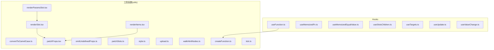
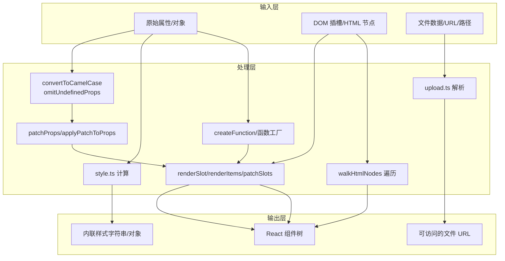
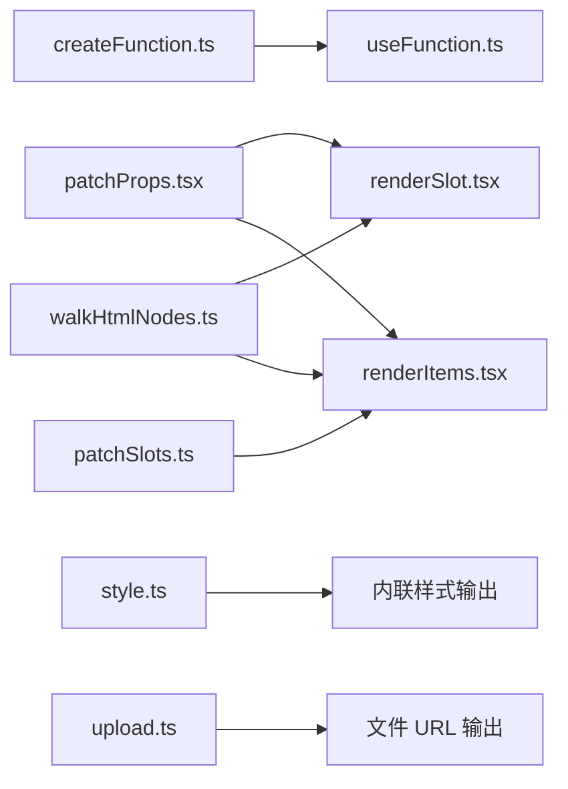
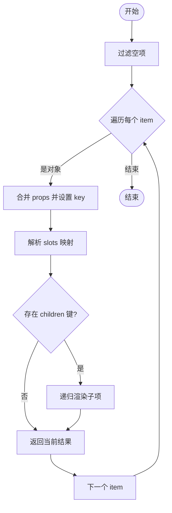
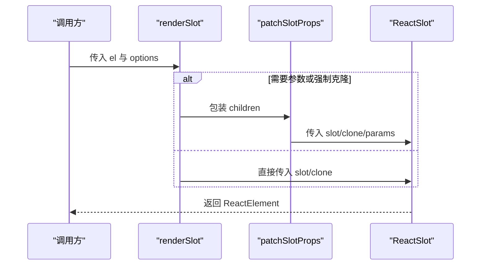

# 工具函数 API

<cite>
**本文引用的文件**
- [convertToCamelCase.ts](file://frontend/utils/convertToCamelCase.ts)
- [patchProps.tsx](file://frontend/utils/patchProps.tsx)
- [omitUndefinedProps.ts](file://frontend/utils/omitUndefinedProps.ts)
- [renderSlot.tsx](file://frontend/utils/renderSlot.tsx)
- [renderItems.tsx](file://frontend/utils/renderItems.tsx)
- [patchSlots.ts](file://frontend/utils/patchSlots.ts)
- [style.ts](file://frontend/utils/style.ts)
- [upload.ts](file://frontend/utils/upload.ts)
- [walkHtmlNodes.ts](file://frontend/utils/walkHtmlNodes.ts)
- [createFunction.ts](file://frontend/utils/createFunction.ts)
- [tick.ts](file://frontend/utils/tick.ts)
- [renderParamsSlot.tsx](file://frontend/utils/renderParamsSlot.tsx)
- [useFunction.ts](file://frontend/utils/hooks/useFunction.ts)
- [useMemoizedEqualValue.ts](file://frontend/utils/hooks/useMemoizedEqualValue.ts)
- [useMemoizedFn.ts](file://frontend/utils/hooks/useMemoizedFn.ts)
- [useSlotsChildren.ts](file://frontend/utils/hooks/useSlotsChildren.ts)
- [useTargets.ts](file://frontend/utils/hooks/useTargets.ts)
- [useUpdate.ts](file://frontend/utils/hooks/useUpdate.ts)
- [useValueChange.ts](file://frontend/utils/hooks/useValueChange.ts)
</cite>

## 目录

1. [简介](#简介)
2. [项目结构](#项目结构)
3. [核心组件](#核心组件)
4. [架构总览](#架构总览)
5. [详细组件分析](#详细组件分析)
6. [依赖分析](#依赖分析)
7. [性能考虑](#性能考虑)
8. [故障排除指南](#故障排除指南)
9. [结论](#结论)
10. [附录](#附录)

## 简介

本文件为 ModelScope Studio 前端工具函数系统的 API 参考与使用指南，覆盖以下主题：

- 属性处理：convertToCamelCase、patchProps、omitUndefinedProps 等
- 插槽处理：renderSlot、renderItems、patchSlots、renderParamsSlot
- 样式处理：style.ts 中的样式计算与应用
- 上传处理：upload.ts 的 URL 解析与文件地址转换
- HTML 遍历：walkHtmlNodes 的节点查找与回调
- 函数与钩子：createFunction、hooks 系列（useFunction、useMemoizedFn、useMemoizedEqualValue、useSlotsChildren、useTargets、useUpdate、useValueChange）
- 实际使用示例、性能特性与最佳实践、错误处理与边界情况

## 项目结构

工具函数集中于 frontend/utils 目录，按功能分层组织；hooks 子目录提供 React Hooks 封装。

图表来源

- [renderSlot.tsx:1-29](file://frontend/utils/renderSlot.tsx#L1-L29)
- [renderItems.tsx:1-114](file://frontend/utils/renderItems.tsx#L1-L114)
- [patchProps.tsx:1-39](file://frontend/utils/patchProps.tsx#L1-L39)
- [patchSlots.ts:1-32](file://frontend/utils/patchSlots.ts#L1-L32)
- [style.ts:1-77](file://frontend/utils/style.ts#L1-L77)
- [upload.ts:1-45](file://frontend/utils/upload.ts#L1-L45)
- [walkHtmlNodes.ts:1-19](file://frontend/utils/walkHtmlNodes.ts#L1-L19)
- [createFunction.ts:1-38](file://frontend/utils/createFunction.ts#L1-L38)
- [tick.ts:1-13](file://frontend/utils/tick.ts#L1-L13)
- [renderParamsSlot.tsx:1-51](file://frontend/utils/renderParamsSlot.tsx#L1-L51)
- [useFunction.ts:1-13](file://frontend/utils/hooks/useFunction.ts#L1-L13)
- [useMemoizedFn.ts:1-11](file://frontend/utils/hooks/useMemoizedFn.ts#L1-L11)
- [useMemoizedEqualValue.ts:1-15](file://frontend/utils/hooks/useMemoizedEqualValue.ts#L1-L15)
- [useSlotsChildren.ts:1-24](file://frontend/utils/hooks/useSlotsChildren.ts#L1-L24)
- [useTargets.ts:1-52](file://frontend/utils/hooks/useTargets.ts#L1-L52)
- [useUpdate.ts:1-7](file://frontend/utils/hooks/useUpdate.ts#L1-L7)
- [useValueChange.ts:1-30](file://frontend/utils/hooks/useValueChange.ts#L1-L30)

章节来源

- [convertToCamelCase.ts:1-22](file://frontend/utils/convertToCamelCase.ts#L1-L22)
- [patchProps.tsx:1-39](file://frontend/utils/patchProps.tsx#L1-L39)
- [omitUndefinedProps.ts:1-17](file://frontend/utils/omitUndefinedProps.ts#L1-L17)
- [renderSlot.tsx:1-29](file://frontend/utils/renderSlot.tsx#L1-L29)
- [renderItems.tsx:1-114](file://frontend/utils/renderItems.tsx#L1-L114)
- [patchSlots.ts:1-32](file://frontend/utils/patchSlots.ts#L1-L32)
- [style.ts:1-77](file://frontend/utils/style.ts#L1-L77)
- [upload.ts:1-45](file://frontend/utils/upload.ts#L1-L45)
- [walkHtmlNodes.ts:1-19](file://frontend/utils/walkHtmlNodes.ts#L1-L19)
- [createFunction.ts:1-38](file://frontend/utils/createFunction.ts#L1-L38)
- [tick.ts:1-13](file://frontend/utils/tick.ts#L1-L13)
- [renderParamsSlot.tsx:1-51](file://frontend/utils/renderParamsSlot.tsx#L1-L51)
- [useFunction.ts:1-13](file://frontend/utils/hooks/useFunction.ts#L1-L13)
- [useMemoizedFn.ts:1-11](file://frontend/utils/hooks/useMemoizedFn.ts#L1-L11)
- [useMemoizedEqualValue.ts:1-15](file://frontend/utils/hooks/useMemoizedEqualValue.ts#L1-L15)
- [useSlotsChildren.ts:1-24](file://frontend/utils/hooks/useSlotsChildren.ts#L1-L24)
- [useTargets.ts:1-52](file://frontend/utils/hooks/useTargets.ts#L1-L52)
- [useUpdate.ts:1-7](file://frontend/utils/hooks/useUpdate.ts#L1-L7)
- [useValueChange.ts:1-30](file://frontend/utils/hooks/useValueChange.ts#L1-L30)

## 核心组件

- 属性处理
  - convertToCamelCase：字符串下划线转驼峰；convertObjectKeyToCamelCase：对象键名批量转换
  - patchProps/applyPatchToProps：key 冲突时的内部标记与还原
  - omitUndefinedProps：过滤未定义（可选过滤 null）属性
- 插槽处理
  - renderSlot：将 DOM 插槽渲染为 React 组件，支持克隆、强制克隆、参数传递
  - renderItems：将结构化 items 渲染为 React 结构，自动注入 slots、上下文与 key
  - patchSlots：为插槽渲染函数注入额外参数（前置或尾随）
  - renderParamsSlot：基于多个目标节点渲染带参数的插槽
- 样式处理
  - styleObject2String：CSSProperties 转字符串
  - styleObject2HtmlStyle：CSSProperties 转 HTML 兼容样式对象（含单位处理）
  - cssUnits：数值到带单位字符串的映射（对特定属性不加单位）
- 上传处理
  - getFetchableUrl：生成可拉取文件的 URL
  - getFileUrl：统一解析 FileData、URL 字符串、相对路径
- HTML 遍历
  - walkHtmlNodes：深度优先遍历节点，按名称、集合或谓词匹配执行回调
- 函数与钩子
  - createFunction：从字符串或函数创建可调用函数
  - hooks：useFunction、useMemoizedFn、useMemoizedEqualValue、useSlotsChildren、useTargets、useUpdate、useValueChange

章节来源

- [convertToCamelCase.ts:1-22](file://frontend/utils/convertToCamelCase.ts#L1-L22)
- [patchProps.tsx:1-39](file://frontend/utils/patchProps.tsx#L1-L39)
- [omitUndefinedProps.ts:1-17](file://frontend/utils/omitUndefinedProps.ts#L1-L17)
- [renderSlot.tsx:1-29](file://frontend/utils/renderSlot.tsx#L1-L29)
- [renderItems.tsx:1-114](file://frontend/utils/renderItems.tsx#L1-L114)
- [patchSlots.ts:1-32](file://frontend/utils/patchSlots.ts#L1-L32)
- [style.ts:1-77](file://frontend/utils/style.ts#L1-L77)
- [upload.ts:1-45](file://frontend/utils/upload.ts#L1-L45)
- [walkHtmlNodes.ts:1-19](file://frontend/utils/walkHtmlNodes.ts#L1-L19)
- [createFunction.ts:1-38](file://frontend/utils/createFunction.ts#L1-L38)
- [useFunction.ts:1-13](file://frontend/utils/hooks/useFunction.ts#L1-L13)
- [useMemoizedFn.ts:1-11](file://frontend/utils/hooks/useMemoizedFn.ts#L1-L11)
- [useMemoizedEqualValue.ts:1-15](file://frontend/utils/hooks/useMemoizedEqualValue.ts#L1-L15)
- [useSlotsChildren.ts:1-24](file://frontend/utils/hooks/useSlotsChildren.ts#L1-L24)
- [useTargets.ts:1-52](file://frontend/utils/hooks/useTargets.ts#L1-L52)
- [useUpdate.ts:1-7](file://frontend/utils/hooks/useUpdate.ts#L1-L7)
- [useValueChange.ts:1-30](file://frontend/utils/hooks/useValueChange.ts#L1-L30)

## 架构总览

工具函数围绕“属性/插槽/样式/上传/遍历/函数/钩子”六大领域协同工作，形成从数据结构到 React 渲染的完整链路。

图表来源

- [convertToCamelCase.ts:1-22](file://frontend/utils/convertToCamelCase.ts#L1-L22)
- [patchProps.tsx:1-39](file://frontend/utils/patchProps.tsx#L1-L39)
- [omitUndefinedProps.ts:1-17](file://frontend/utils/omitUndefinedProps.ts#L1-L17)
- [renderSlot.tsx:1-29](file://frontend/utils/renderSlot.tsx#L1-L29)
- [renderItems.tsx:1-114](file://frontend/utils/renderItems.tsx#L1-L114)
- [patchSlots.ts:1-32](file://frontend/utils/patchSlots.ts#L1-L32)
- [style.ts:1-77](file://frontend/utils/style.ts#L1-L77)
- [upload.ts:1-45](file://frontend/utils/upload.ts#L1-L45)
- [walkHtmlNodes.ts:1-19](file://frontend/utils/walkHtmlNodes.ts#L1-L19)
- [createFunction.ts:1-38](file://frontend/utils/createFunction.ts#L1-L38)

## 详细组件分析

### 属性处理函数

#### convertToCamelCase 与 convertObjectKeyToCamelCase

- 功能：将下划线命名转换为驼峰命名；批量转换对象键名
- 参数与返回：
  - convertToCamelCase(str: string): string
  - convertObjectKeyToCamelCase<T>(obj: T): T
- 使用场景：后端字段常为 snake_case，前端需要驼峰键名时
- 复杂度：O(n) 字符处理；对象转换 O(k) 键迭代
- 边界：非对象直接返回原值

章节来源

- [convertToCamelCase.ts:1-22](file://frontend/utils/convertToCamelCase.ts#L1-L22)

#### patchProps 与 applyPatchToProps

- 功能：解决 React key 冲突问题；内部暂存 key 并在消费端还原
- 参数与返回：
  - patchProps(props: Record<string, any>): Record<string, any>
  - applyPatchToProps(props: Record<string, any>): Record<string, any>
- 使用场景：当传入 props 含有 key 且需透传给子组件时
- 复杂度：O(n) 浅拷贝与条件判断
- 边界：无 key 时不修改

章节来源

- [patchProps.tsx:1-39](file://frontend/utils/patchProps.tsx#L1-L39)

#### omitUndefinedProps

- 功能：过滤未定义（可选过滤 null）的属性
- 参数与返回：
  - omitUndefinedProps<T>(props: T, options?: { omitNull?: boolean }): T
- 使用场景：减少无效属性传递，避免渲染异常
- 复杂度：O(n) 键迭代
- 边界：空对象安全

章节来源

- [omitUndefinedProps.ts:1-17](file://frontend/utils/omitUndefinedProps.ts#L1-L17)

### 插槽处理函数

#### renderSlot

- 功能：将 HTMLElement 插槽渲染为 React 组件，支持克隆、强制克隆、参数传递
- 参数与返回：
  - renderSlot(el?: HTMLElement, options?: { clone?: boolean; forceClone?: boolean; params?: any[] }): ReactElement | null
- 使用场景：将 Svelte/Gradio 的 slot 节点桥接为 React
- 复杂度：O(1) 渲染开销取决于 slot 内容
- 边界：el 为空返回 null；forceClone 与 params 需配合上下文使用

章节来源

- [renderSlot.tsx:1-29](file://frontend/utils/renderSlot.tsx#L1-L29)

#### renderItems

- 功能：将结构化 items 渲染为 React 结构，自动注入 slots、上下文与 key；支持递归 children
- 参数与返回：
  - renderItems<R>(items: Item[], options?: { children?: string; fallback?: (item) => R; clone?: boolean; forceClone?: boolean; itemPropsTransformer?: (props) => props }, key?: React.Key): R[] | undefined
- 使用场景：复杂容器组件的多插槽与嵌套渲染
- 复杂度：O(m) m 为有效 items 数量；slots 注入为 O(s) s 为 slots 数
- 边界：非对象项可回退；children 键可自定义

章节来源

- [renderItems.tsx:1-114](file://frontend/utils/renderItems.tsx#L1-L114)

#### patchSlots

- 功能：为插槽渲染函数注入额外参数（支持前置/尾随），便于向插槽传递上下文
- 参数与返回：
  - patchSlots<T>(params: any[], transform: (patch) => Record): ReturnType
- 使用场景：在插槽函数中统一注入参数，提升复用性
- 复杂度：O(p) p 为 params 长度；函数包装 O(1)
- 边界：非函数 slot 不处理

章节来源

- [patchSlots.ts:1-32](file://frontend/utils/patchSlots.ts#L1-L32)

#### renderParamsSlot

- 功能：基于多个目标节点渲染带参数的插槽，支持强制克隆
- 参数与返回：
  - renderParamsSlot({ key, slots, targets }, options?: { forceClone?: boolean } & RenderSlotOptions)
- 使用场景：多目标节点共享同一插槽模板并传参
- 复杂度：O(t) t 为目标数量
- 边界：无对应 slot 返回 undefined

章节来源

- [renderParamsSlot.tsx:1-51](file://frontend/utils/renderParamsSlot.tsx#L1-L51)

### 样式处理工具

#### style.ts

- 功能：样式对象到字符串与 HTML 样式对象的双向转换，并处理数值单位
- 关键函数：
  - styleObject2String(styleObj: React.CSSProperties): string
  - styleObject2HtmlStyle(styleObj: React.CSSProperties): Record<string, any>
  - cssUnits<T extends string>(prop: T, value: number | string | undefined): string | number
- 使用场景：内联样式拼接、DOM 属性设置
- 复杂度：O(n) n 为样式键数
- 边界：数值类型自动加 px；特定属性不加单位

章节来源

- [style.ts:1-77](file://frontend/utils/style.ts#L1-L77)

### 上传处理函数

#### upload.ts

- 功能：统一解析文件来源，生成可访问 URL
- 关键函数：
  - getFetchableUrl(path: string, rootUrl: string, apiPrefix: string): string
  - getFileUrl<T>(file: T, rootUrl: string, apiPrefix: string): string | Exclude<T, FileData> | undefined
- 使用场景：本地文件、远程 URL、FileData 的统一处理
- 复杂度：O(1)
- 边界：空输入返回 undefined；非 http(s) 字符串按相对路径处理

章节来源

- [upload.ts:1-45](file://frontend/utils/upload.ts#L1-L45)

### HTML 节点遍历工具

#### walkHtmlNodes

- 功能：深度优先遍历节点，按名称、集合或谓词匹配执行回调
- 参数与返回：
  - walkHtmlNodes(node: Node | HTMLElement | null, test: string | string[] | ((node) => boolean), callback: (node) => void): void
- 使用场景：查找特定标签、批量操作节点
- 复杂度：O(n) n 为节点总数
- 边界：空节点安全；数组与函数形式灵活匹配

章节来源

- [walkHtmlNodes.ts:1-19](file://frontend/utils/walkHtmlNodes.ts#L1-L19)

### 函数与钩子

#### createFunction

- 功能：从字符串或函数创建可调用函数，支持纯文本模式校验
- 参数与返回：
  - createFunction<T>(target: any, plainText?: boolean): T | undefined
- 使用场景：动态函数创建、运行时代码注入
- 复杂度：O(1) 创建；执行取决于函数体
- 边界：非法字符串返回 undefined；异常捕获

章节来源

- [createFunction.ts:1-38](file://frontend/utils/createFunction.ts#L1-L38)

#### hooks 系列

- useFunction：memo 化 createFunction 结果
- useMemoizedFn：稳定函数引用，避免闭包陷阱
- useMemoizedEqualValue：等值缓存，避免不必要的重渲染
- useSlotsChildren：区分插槽子节点与普通子节点
- useTargets：根据 slotKey 排序提取 portal 目标节点
- useUpdate：触发一次状态更新以强制刷新
- useValueChange：同步外部值与内部状态变更

章节来源

- [useFunction.ts:1-13](file://frontend/utils/hooks/useFunction.ts#L1-L13)
- [useMemoizedFn.ts:1-11](file://frontend/utils/hooks/useMemoizedFn.ts#L1-L11)
- [useMemoizedEqualValue.ts:1-15](file://frontend/utils/hooks/useMemoizedEqualValue.ts#L1-L15)
- [useSlotsChildren.ts:1-24](file://frontend/utils/hooks/useSlotsChildren.ts#L1-L24)
- [useTargets.ts:1-52](file://frontend/utils/hooks/useTargets.ts#L1-L52)
- [useUpdate.ts:1-7](file://frontend/utils/hooks/useUpdate.ts#L1-L7)
- [useValueChange.ts:1-30](file://frontend/utils/hooks/useValueChange.ts#L1-L30)

## 依赖分析

图表来源

- [createFunction.ts:1-38](file://frontend/utils/createFunction.ts#L1-L38)
- [useFunction.ts:1-13](file://frontend/utils/hooks/useFunction.ts#L1-L13)
- [patchProps.tsx:1-39](file://frontend/utils/patchProps.tsx#L1-L39)
- [renderSlot.tsx:1-29](file://frontend/utils/renderSlot.tsx#L1-L29)
- [renderItems.tsx:1-114](file://frontend/utils/renderItems.tsx#L1-L114)
- [patchSlots.ts:1-32](file://frontend/utils/patchSlots.ts#L1-L32)
- [style.ts:1-77](file://frontend/utils/style.ts#L1-L77)
- [upload.ts:1-45](file://frontend/utils/upload.ts#L1-L45)
- [walkHtmlNodes.ts:1-19](file://frontend/utils/walkHtmlNodes.ts#L1-L19)

## 性能考虑

- 批量对象键转换与属性过滤：O(k) 与 O(n)，建议仅在必要时调用
- 插槽渲染：clone 与 forceClone 会增加渲染成本，尽量按需启用
- 样式转换：数值到字符串与单位拼接为 O(n)，大样式对象建议缓存结果
- 上传 URL 解析：O(1)，但涉及字符串拼接与正则，注意路径合法性
- HTML 遍历：O(n)，建议限制遍历范围或使用更精确的匹配条件
- 函数工厂：new Function 有编译成本，建议缓存结果（useFunction）

## 故障排除指南

- 插槽未显示
  - 检查 el 是否存在；确认是否需要 clone 或 forceClone
  - 若使用参数插槽，确保传入 params 且 targets 正确
- key 冲突或重复
  - 使用 patchProps/applyPatchToProps 处理内部 key 映射
- 样式不生效
  - 检查 cssUnits 对特定属性的处理；确认数值是否应带单位
- 上传文件无法访问
  - 确认 rootUrl 与 apiPrefix 配置；相对路径会被转换为可拉取 URL
- 遍历不到节点
  - 检查 test 类型（字符串/数组/函数）与节点名称大小写
- 动态函数不可用
  - plainText 模式下非法字符串会返回 undefined；检查语法

章节来源

- [renderSlot.tsx:1-29](file://frontend/utils/renderSlot.tsx#L1-L29)
- [renderItems.tsx:1-114](file://frontend/utils/renderItems.tsx#L1-L114)
- [patchProps.tsx:1-39](file://frontend/utils/patchProps.tsx#L1-L39)
- [style.ts:1-77](file://frontend/utils/style.ts#L1-L77)
- [upload.ts:1-45](file://frontend/utils/upload.ts#L1-L45)
- [walkHtmlNodes.ts:1-19](file://frontend/utils/walkHtmlNodes.ts#L1-L19)
- [createFunction.ts:1-38](file://frontend/utils/createFunction.ts#L1-L38)

## 结论

本工具函数体系提供了从属性/插槽/样式/上传/遍历到函数与钩子的全栈能力，既保证了与 Svelte/Gradio 生态的桥接，又兼顾了 React 渲染的灵活性与性能。通过合理的参数配置与边界处理，可在复杂组件场景中获得一致、可维护的开发体验。

## 附录

### API 定义与使用要点

- convertToCamelCase
  - 输入：下划线字符串
  - 输出：驼峰字符串
  - 示例路径：[convertToCamelCase.ts:3-11](file://frontend/utils/convertToCamelCase.ts#L3-L11)

- convertObjectKeyToCamelCase
  - 输入：对象
  - 输出：键名驼峰化的新对象
  - 示例路径：[convertToCamelCase.ts:13-21](file://frontend/utils/convertToCamelCase.ts#L13-L21)

- patchProps / applyPatchToProps
  - 输入：props（可能包含 key）
  - 输出：内部 key 标记或还原后的 props
  - 示例路径：[patchProps.tsx:3-22](file://frontend/utils/patchProps.tsx#L3-L22)

- omitUndefinedProps
  - 输入：props，可选 omitNull
  - 输出：过滤后的 props
  - 示例路径：[omitUndefinedProps.ts:1-16](file://frontend/utils/omitUndefinedProps.ts#L1-L16)

- renderSlot
  - 输入：HTMLElement、可选 clone/forceClone/params
  - 输出：ReactElement 或 null
  - 示例路径：[renderSlot.tsx:13-28](file://frontend/utils/renderSlot.tsx#L13-L28)

- renderItems
  - 输入：Item[]，可选 children/fallback/clone/forceClone/itemPropsTransformer
  - 输出：R[] 或 undefined
  - 示例路径：[renderItems.tsx:8-113](file://frontend/utils/renderItems.tsx#L8-L113)

- patchSlots
  - 输入：params[]，transform 函数
  - 输出：增强后的返回对象
  - 示例路径：[patchSlots.ts:4-31](file://frontend/utils/patchSlots.ts#L4-L31)

- renderParamsSlot
  - 输入：{ key, slots, targets }，可选 options
  - 输出：带参数的插槽函数或 undefined
  - 示例路径：[renderParamsSlot.tsx:5-49](file://frontend/utils/renderParamsSlot.tsx#L5-L49)

- style.ts
  - 输入：React.CSSProperties
  - 输出：样式字符串或 HTML 兼容样式对象
  - 示例路径：[style.ts:39-76](file://frontend/utils/style.ts#L39-L76)

- upload.ts
  - 输入：file（FileData | string | any）、rootUrl、apiPrefix
  - 输出：可访问 URL 或原值
  - 示例路径：[upload.ts:27-44](file://frontend/utils/upload.ts#L27-L44)

- walkHtmlNodes
  - 输入：node、test（字符串/数组/函数）、callback
  - 输出：void
  - 示例路径：[walkHtmlNodes.ts:1-18](file://frontend/utils/walkHtmlNodes.ts#L1-L18)

- createFunction
  - 输入：target（函数/字符串）、plainText
  - 输出：可调用函数或 undefined
  - 示例路径：[createFunction.ts:10-37](file://frontend/utils/createFunction.ts#L10-L37)

- hooks
  - useFunction：[useFunction.ts:5-12](file://frontend/utils/hooks/useFunction.ts#L5-L12)
  - useMemoizedFn：[useMemoizedFn.ts:3-10](file://frontend/utils/hooks/useMemoizedFn.ts#L3-L10)
  - useMemoizedEqualValue：[useMemoizedEqualValue.ts:4-14](file://frontend/utils/hooks/useMemoizedEqualValue.ts#L4-L14)
  - useSlotsChildren：[useSlotsChildren.ts:4-23](file://frontend/utils/hooks/useSlotsChildren.ts#L4-L23)
  - useTargets：[useTargets.ts:5-51](file://frontend/utils/hooks/useTargets.ts#L5-L51)
  - useUpdate：[useUpdate.ts:3-6](file://frontend/utils/hooks/useUpdate.ts#L3-L6)
  - useValueChange：[useValueChange.ts:9-29](file://frontend/utils/hooks/useValueChange.ts#L9-L29)

### 使用流程图示例

#### renderItems 数据流

图表来源

- [renderItems.tsx:18-113](file://frontend/utils/renderItems.tsx#L18-L113)

#### renderSlot 渲染序列

图表来源

- [renderSlot.tsx:13-28](file://frontend/utils/renderSlot.tsx#L13-L28)
- [patchProps.tsx:31-38](file://frontend/utils/patchProps.tsx#L31-L38)
