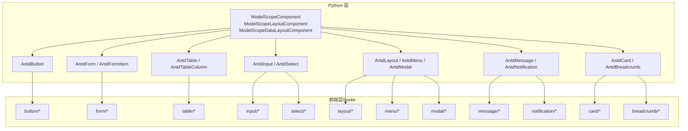
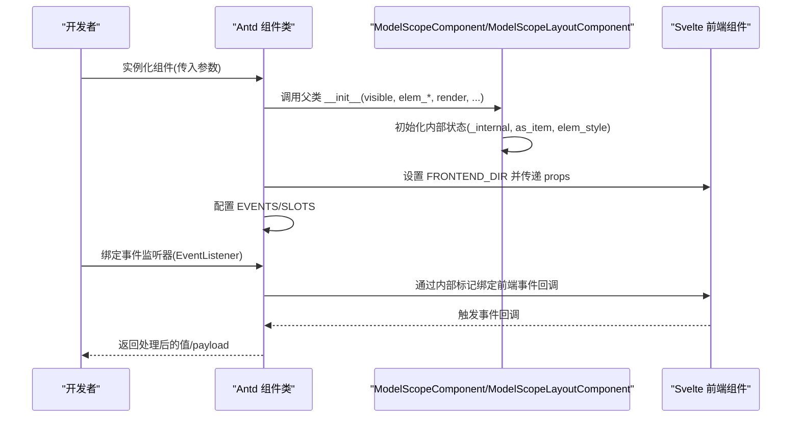
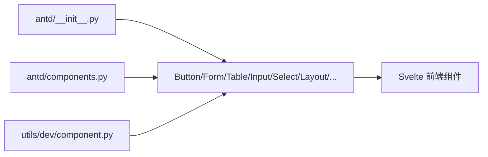

# Antd 组件 API

<cite>
**本文引用的文件**
- [backend/modelscope_studio/components/antd/__init__.py](file://backend/modelscope_studio/components/antd/__init__.py)
- [backend/modelscope_studio/components/antd/components.py](file://backend/modelscope_studio/components/antd/components.py)
- [backend/modelscope_studio/utils/dev/component.py](file://backend/modelscope_studio/utils/dev/component.py)
- [backend/modelscope_studio/components/antd/button/__init__.py](file://backend/modelscope_studio/components/antd/button/__init__.py)
- [backend/modelscope_studio/components/antd/form/__init__.py](file://backend/modelscope_studio/components/antd/form/__init__.py)
- [backend/modelscope_studio/components/antd/table/__init__.py](file://backend/modelscope_studio/components/antd/table/__init__.py)
- [backend/modelscope_studio/components/antd/input/__init__.py](file://backend/modelscope_studio/components/antd/input/__init__.py)
- [backend/modelscope_studio/components/antd/select/__init__.py](file://backend/modelscope_studio/components/antd/select/__init__.py)
- [backend/modelscope_studio/components/antd/form/item/__init__.py](file://backend/modelscope_studio/components/antd/form/item/__init__.py)
- [backend/modelscope_studio/components/antd/table/column/__init__.py](file://backend/modelscope_studio/components/antd/table/column/__init__.py)
- [backend/modelscope_studio/components/antd/layout/__init__.py](file://backend/modelscope_studio/components/antd/layout/__init__.py)
- [backend/modelscope_studio/components/antd/menu/__init__.py](file://backend/modelscope_studio/components/antd/menu/__init__.py)
- [backend/modelscope_studio/components/antd/modal/__init__.py](file://backend/modelscope_studio/components/antd/modal/__init__.py)
- [backend/modelscope_studio/components/antd/message/__init__.py](file://backend/modelscope_studio/components/antd/message/__init__.py)
- [backend/modelscope_studio/components/antd/notification/__init__.py](file://backend/modelscope_studio/components/antd/notification/__init__.py)
- [backend/modelscope_studio/components/antd/card/__init__.py](file://backend/modelscope_studio/components/antd/card/__init__.py)
- [backend/modelscope_studio/components/antd/breadcrumb/__init__.py](file://backend/modelscope_studio/components/antd/breadcrumb/__init__.py)
</cite>

## 目录

1. [简介](#简介)
2. [项目结构](#项目结构)
3. [核心组件](#核心组件)
4. [架构总览](#架构总览)
5. [详细组件分析](#详细组件分析)
6. [依赖分析](#依赖分析)
7. [性能考虑](#性能考虑)
8. [故障排查指南](#故障排查指南)
9. [结论](#结论)
10. [附录：按功能分类的 API 索引](#附录按功能分类的-api-索引)

## 简介

本文件为 Antd 组件库的 Python API 参考文档，覆盖 modelscope_studio.components.antd.\* 下的 150+ 组件。文档面向开发者与非技术读者，提供：

- 完整导入路径与类名
- 构造函数参数、属性定义、方法签名与返回值类型
- 标准实例化示例（以“代码片段路径”形式给出）
- 事件处理机制、数据绑定方式与状态管理接口
- 参数验证规则、异常处理策略与组件间通信模式
- 按功能分类的 API 索引（通用、布局、导航、数据录入、数据展示、反馈等）

## 项目结构

Antd 组件通过 Python 类封装前端 Svelte 组件，统一继承自基础组件基类，支持事件绑定、插槽（slots）与 Gradio 数据流。

图表来源

- [backend/modelscope_studio/utils/dev/component.py:54-169](file://backend/modelscope_studio/utils/dev/component.py#L54-L169)
- [backend/modelscope_studio/components/antd/button/**init**.py:15-157](file://backend/modelscope_studio/components/antd/button/__init__.py#L15-L157)
- [backend/modelscope_studio/components/antd/form/**init**.py:17-133](file://backend/modelscope_studio/components/antd/form/__init__.py#L17-L133)
- [backend/modelscope_studio/components/antd/table/**init**.py:16-153](file://backend/modelscope_studio/components/antd/table/__init__.py#L16-L153)
- [backend/modelscope_studio/components/antd/input/**init**.py:16-127](file://backend/modelscope_studio/components/antd/input/__init__.py#L16-L127)
- [backend/modelscope_studio/components/antd/select/**init**.py:12-231](file://backend/modelscope_studio/components/antd/select/__init__.py#L12-L231)
- [backend/modelscope_studio/components/antd/layout/**init**.py:14-91](file://backend/modelscope_studio/components/antd/layout/__init__.py#L14-L91)
- [backend/modelscope_studio/components/antd/menu/**init**.py:12-123](file://backend/modelscope_studio/components/antd/menu/__init__.py#L12-L123)
- [backend/modelscope_studio/components/antd/modal/**init**.py:11-136](file://backend/modelscope_studio/components/antd/modal/__init__.py#L11-L136)
- [backend/modelscope_studio/components/antd/message/**init**.py:10-91](file://backend/modelscope_studio/components/antd/message/__init__.py#L10-L91)
- [backend/modelscope_studio/components/antd/notification/**init**.py:10-109](file://backend/modelscope_studio/components/antd/notification/__init__.py#L10-L109)
- [backend/modelscope_studio/components/antd/card/**init**.py:12-149](file://backend/modelscope_studio/components/antd/card/__init__.py#L12-L149)
- [backend/modelscope_studio/components/antd/breadcrumb/**init**.py:9-73](file://backend/modelscope_studio/components/antd/breadcrumb/__init__.py#L9-L73)

章节来源

- [backend/modelscope_studio/components/antd/**init**.py:1-151](file://backend/modelscope_studio/components/antd/__init__.py#L1-L151)
- [backend/modelscope_studio/components/antd/components.py:1-145](file://backend/modelscope_studio/components/antd/components.py#L1-L145)
- [backend/modelscope_studio/utils/dev/component.py:1-169](file://backend/modelscope_studio/utils/dev/component.py#L1-L169)

## 核心组件

- 基础组件类
  - ModelScopeComponent：通用组件基类，支持 value、visible、elem\_\*、key、inputs、load_fn、render 等 Gradio 属性；提供 skip_api 控制是否暴露 API。
  - ModelScopeLayoutComponent：布局组件基类，支持 **enter**/**exit** 上下文管理，用于嵌套布局。
  - ModelScopeDataLayoutComponent：数据型布局组件基类，兼具数据组件能力与布局能力。
- 事件与插槽
  - EVENTS：组件支持的事件列表，通过 EventListener 绑定回调。
  - SLOTS：组件支持的插槽名称集合，用于渲染子内容或自定义节点。
- 前端目录解析
  - FRONTEND_DIR：通过 resolve_frontend_dir(...) 指向对应 Svelte 组件目录。

章节来源

- [backend/modelscope_studio/utils/dev/component.py:54-169](file://backend/modelscope_studio/utils/dev/component.py#L54-L169)
- [backend/modelscope_studio/components/antd/button/**init**.py:41-49](file://backend/modelscope_studio/components/antd/button/__init__.py#L41-L49)
- [backend/modelscope_studio/components/antd/table/**init**.py:32-53](file://backend/modelscope_studio/components/antd/table/__init__.py#L32-L53)
- [backend/modelscope_studio/components/antd/input/**init**.py:25-41](file://backend/modelscope_studio/components/antd/input/__init__.py#L25-L41)

## 架构总览

以下序列图展示一个典型组件从构造到事件绑定的调用链：

图表来源

- [backend/modelscope_studio/utils/dev/component.py:54-99](file://backend/modelscope_studio/utils/dev/component.py#L54-L99)
- [backend/modelscope_studio/components/antd/button/**init**.py:51-87](file://backend/modelscope_studio/components/antd/button/__init__.py#L51-L87)
- [backend/modelscope_studio/components/antd/form/**init**.py:23-36](file://backend/modelscope_studio/components/antd/form/__init__.py#L23-L36)

## 详细组件分析

### Button（按钮）

- 导入路径：modelscope_studio.components.antd.AntdButton 或 modelscope_studio.components.antd.Button
- 支持子组件：Group
- 事件：click
- 插槽：icon, loading.icon
- 关键参数（节选）：value, block, danger, ghost, disabled, href, html_type, icon, icon_position, loading, shape, size, type, variant, color, root_class_name
- 方法：preprocess/postprocess/example_payload/example_value
- 代码片段路径（示例）
  - [basic usage:51-157](file://backend/modelscope_studio/components/antd/button/__init__.py#L51-L157)
- 事件绑定流程
  - 通过 EVENTS 中的 EventListener("click", ...) 将回调映射到前端事件。
- 数据绑定
  - 作为输入输出时，value 类型为字符串；preprocess/postprocess 返回字符串。
- 参数验证与异常
  - 参数多为可空标量或字面量枚举；未见显式校验逻辑，建议在应用层进行输入约束。
- 组件间通信
  - 通过 Gradio 的 inputs/outputs 机制与表单或其他组件联动。

章节来源

- [backend/modelscope_studio/components/antd/button/**init**.py:15-157](file://backend/modelscope_studio/components/antd/button/__init__.py#L15-L157)

### Form（表单）与 Form.Item（表单项）

- 导入路径：modelscope_studio.components.antd.AntdForm / AntdFormItem
- 子组件：Item, Provider
- 事件：fields_change, finish, finish_failed, values_change
- 插槽：requiredMark
- Form 关键参数（节选）：colon, disabled, component, feedback_icons, initial_values, label_align, label_col, label_wrap, layout, preserve, required_mark, scroll_to_first_error, size, validate_messages, validate_trigger, variant, wrapper_col, clear_on_destroy, root_class_name, class_names, styles
- FormItem 关键参数（节选）：label, form_name, colon, dependencies, extra, help, hidden, initial_value, label_align, label_col, message_variants, normalize, no_style, preserve, required, rules, should_update, tooltip, trigger, validate_debounce, validate_first, validate_status, validate_trigger, value_prop_name, wrapper_col, layout, root_class_name
- 方法：preprocess/postprocess/example_payload/example_value
- 代码片段路径（示例）
  - [form:43-133](file://backend/modelscope_studio/components/antd/form/__init__.py#L43-L133)
  - [form item:21-126](file://backend/modelscope_studio/components/antd/form/item/__init__.py#L21-L126)

章节来源

- [backend/modelscope_studio/components/antd/form/**init**.py:17-133](file://backend/modelscope_studio/components/antd/form/__init__.py#L17-L133)
- [backend/modelscope_studio/components/antd/form/item/**init**.py:9-126](file://backend/modelscope_studio/components/antd/form/item/__init__.py#L9-L126)

### Table（表格）与 Table.Column（列）

- 导入路径：modelscope_studio.components.antd.AntdTable / AntdTableColumn
- 子组件：Column, ColumnGroup, Expandable, RowSelection
- 事件：change, scroll
- 插槽：footer, title, summary, expandable, rowSelection, loading.tip, loading.indicator, pagination.showQuickJumper.goButton, pagination.itemRender, showSorterTooltip.title
- Table 关键参数（节选）：data_source, columns, bordered, components, expandable, footer, get_popup_container, loading, locale, pagination, row_class_name, row_key, row_selection, row_hoverable, scroll, show_header, show_sorter_tooltip, size, sort_directions, sticky, summary, table_layout, title, virtual, on_row, on_header_row, root_class_name, class_names, styles
- Table.Column 关键参数（节选）：built_in_column, align, col_span, data_index, default_filtered_value, filter_reset_to_default_filtered_value, default_sort_order, ellipsis, filter_dropdown, filter_dropdown_open, filtered, filtered_value, filter_icon, filter_on_close, filter_multiple, filter_mode, filter_search, filters, filter_dropdown_props, fixed, key, column_render, responsive, row_scope, should_cell_update, show_sorter_tooltip, sorter, sort_order, sort_icon, title, width, min_width, hidden, on_cell, on_header_cell, class_names, styles
- 方法：preprocess/postprocess/example_payload/example_value
- 代码片段路径（示例）
  - [table:55-153](file://backend/modelscope_studio/components/antd/table/__init__.py#L55-L153)
  - [table.column:33-150](file://backend/modelscope_studio/components/antd/table/column/__init__.py#L33-L150)

章节来源

- [backend/modelscope_studio/components/antd/table/**init**.py:16-153](file://backend/modelscope_studio/components/antd/table/__init__.py#L16-L153)
- [backend/modelscope_studio/components/antd/table/column/**init**.py:10-150](file://backend/modelscope_studio/components/antd/table/column/__init__.py#L10-L150)

### Input（输入框）与 Select（选择器）

- 导入路径：modelscope_studio.components.antd.AntdInput / AntdSelect
- 子组件：Textarea, Password, OTP, Search（Input），Option（Select）
- Input 事件：change, press_enter, clear
- Select 事件：change, blur, focus, search, select, clear, popup_scroll, dropdown_visible_change, popup_visible_change, active
- 插槽（Input）：addonAfter, addonBefore, allowClear.clearIcon, prefix, suffix, showCount.formatter
- 插槽（Select）：allowClear.clearIcon, maxTagPlaceholder, menuItemSelectedIcon, dropdownRender, popupRender, optionRender, tagRender, labelRender, notFoundContent, removeIcon, suffixIcon, prefix, options
- Input 关键参数（节选）：addon_after, addon_before, allow_clear, count, default_value, read_only, disabled, max_length, prefix, show_count, size, status, suffix, type, placeholder, variant, root_class_name, class_names, styles
- Select 关键参数（节选）：allow_clear, auto_clear_search_value, auto_focus, default_active_first_option, default_open, default_value, disabled, popup_class_name, popup_match_select_width, dropdown_render, popup_render, dropdown_style, field_names, filter_option, filter_sort, get_popup_container, label_in_value, list_height, loading, max_count, max_tag_count, max_tag_placeholder, max_tag_text_length, menu_item_selected_icon, mode, not_found_content, open, option_filter_prop, option_label_prop, options, option_render, placeholder, placement, remove_icon, search_value, show_search, size, status, suffix_icon, prefix, tag_render, label_render, token_separators, variant, virtual, class_names, styles, root_class_name
- 方法：preprocess/postprocess/example_payload/example_value
- 代码片段路径（示例）
  - [input:43-127](file://backend/modelscope_studio/components/antd/input/__init__.py#L43-L127)
  - [select:59-231](file://backend/modelscope_studio/components/antd/select/__init__.py#L59-L231)

章节来源

- [backend/modelscope_studio/components/antd/input/**init**.py:16-127](file://backend/modelscope_studio/components/antd/input/__init__.py#L16-L127)
- [backend/modelscope_studio/components/antd/select/**init**.py:12-231](file://backend/modelscope_studio/components/antd/select/__init__.py#L12-L231)

### Layout（布局）、Menu（菜单）、Modal（模态框）

- 导入路径：modelscope_studio.components.antd.AntdLayout / AntdMenu / AntdModal
- 子组件：Layout.Content/Footer/Header/Sider（Layout）；Menu.Item（Menu）；Modal.Static（Modal）
- 事件（Layout/Menu/Modal）：click、deselect、open_change、select、ok、cancel 等
- 插槽（Layout/Menu/Modal）：详见各组件定义
- 代码片段路径（示例）
  - [layout:39-91](file://backend/modelscope_studio/components/antd/layout/__init__.py#L39-L91)
  - [menu:36-123](file://backend/modelscope_studio/components/antd/menu/__init__.py#L36-L123)
  - [modal:34-136](file://backend/modelscope_studio/components/antd/modal/__init__.py#L34-L136)

章节来源

- [backend/modelscope_studio/components/antd/layout/**init**.py:14-91](file://backend/modelscope_studio/components/antd/layout/__init__.py#L14-L91)
- [backend/modelscope_studio/components/antd/menu/**init**.py:12-123](file://backend/modelscope_studio/components/antd/menu/__init__.py#L12-L123)
- [backend/modelscope_studio/components/antd/modal/**init**.py:11-136](file://backend/modelscope_studio/components/antd/modal/__init__.py#L11-L136)

### Message（消息）、Notification（通知）、Card（卡片）、Breadcrumb（面包屑）

- 导入路径：modelscope_studio.components.antd.AntdMessage / AntdNotification / AntdCard / AntdBreadcrumb
- 事件：click, close（部分组件）
- 插槽：icon/content（Message）；actions/closeIcon/description/icon/message/title（Notification）；title/tabList/tabProps.\*（Card）；separator/itemRender/items/dropdownIcon（Breadcrumb）
- 代码片段路径（示例）
  - [message:26-91](file://backend/modelscope_studio/components/antd/message/__init__.py#L26-L91)
  - [notification:26-109](file://backend/modelscope_studio/components/antd/notification/__init__.py#L26-L109)
  - [card:56-149](file://backend/modelscope_studio/components/antd/card/__init__.py#L56-L149)
  - [breadcrumb:20-73](file://backend/modelscope_studio/components/antd/breadcrumb/__init__.py#L20-L73)

章节来源

- [backend/modelscope_studio/components/antd/message/**init**.py:10-91](file://backend/modelscope_studio/components/antd/message/__init__.py#L10-L91)
- [backend/modelscope_studio/components/antd/notification/**init**.py:10-109](file://backend/modelscope_studio/components/antd/notification/__init__.py#L10-L109)
- [backend/modelscope_studio/components/antd/card/**init**.py:12-149](file://backend/modelscope_studio/components/antd/card/__init__.py#L12-L149)
- [backend/modelscope_studio/components/antd/breadcrumb/**init**.py:9-73](file://backend/modelscope_studio/components/antd/breadcrumb/__init__.py#L9-L73)

## 依赖分析

- 组件导出
  - modelscope_studio.components.antd.**init** 与 components.py 同步导出所有 Antd 组件类，便于统一导入。
- 基类依赖
  - 所有组件均依赖 modelscope_studio.utils.dev.component 中的基础组件类，确保统一的生命周期、事件与插槽机制。
- 前端依赖
  - 每个组件通过 FRONTEND_DIR 指向对应的 Svelte 组件目录，保持前后端一致的目录结构。

图表来源

- [backend/modelscope_studio/components/antd/**init**.py:1-151](file://backend/modelscope_studio/components/antd/__init__.py#L1-L151)
- [backend/modelscope_studio/components/antd/components.py:1-145](file://backend/modelscope_studio/components/antd/components.py#L1-L145)
- [backend/modelscope_studio/utils/dev/component.py:54-169](file://backend/modelscope_studio/utils/dev/component.py#L54-L169)

章节来源

- [backend/modelscope_studio/components/antd/**init**.py:1-151](file://backend/modelscope_studio/components/antd/__init__.py#L1-L151)
- [backend/modelscope_studio/components/antd/components.py:1-145](file://backend/modelscope_studio/components/antd/components.py#L1-L145)
- [backend/modelscope_studio/utils/dev/component.py:54-169](file://backend/modelscope_studio/utils/dev/component.py#L54-L169)

## 性能考虑

- 事件绑定
  - 通过 EVENTS 将 Python 回调映射到前端事件，避免不必要的重渲染；合理设置事件触发频率与防抖。
- 插槽与虚拟化
  - 表格等组件支持 virtual、sticky、scroll 等参数，建议在大数据场景启用虚拟滚动与固定表头以提升性能。
- 渲染控制
  - 使用 render、visible 控制组件初始渲染与可见性，减少首屏压力。
- 数据流
  - 输入组件（如 Input、Select）建议配合 Form 进行批量校验与去抖，降低频繁更新带来的开销。

## 故障排查指南

- 事件未触发
  - 检查 EVENTS 是否正确声明，确认 EventListener 名称与前端事件一致。
  - 确认组件已正确设置 FRONTEND_DIR，且前端事件回调已绑定。
- 插槽不生效
  - 核对 SLOTS 列表中是否存在对应插槽名；确保传入的插槽内容符合预期格式。
- 数据类型不符
  - 输入组件的 preprocess/postprocess 返回值类型需与组件定义一致；若出现类型错误，检查 value 与 api_info 返回类型。
- 表单校验失败
  - 检查 FormItem 的 rules、validate_trigger、validate_status 等配置；必要时调整 validate_first 与 validate_debounce。
- 布局闪烁或样式异常
  - 布局组件（如 Layout、Menu）可通过 has_sider、inline_collapsed、theme_value 等参数优化 SSR 场景下的样式闪烁问题。

章节来源

- [backend/modelscope_studio/components/antd/button/**init**.py:41-46](file://backend/modelscope_studio/components/antd/button/__init__.py#L41-L46)
- [backend/modelscope_studio/components/antd/form/item/**init**.py:13-19](file://backend/modelscope_studio/components/antd/form/item/__init__.py#L13-L19)
- [backend/modelscope_studio/components/antd/table/**init**.py:32-53](file://backend/modelscope_studio/components/antd/table/__init__.py#L32-L53)
- [backend/modelscope_studio/components/antd/menu/**init**.py:96-103](file://backend/modelscope_studio/components/antd/menu/__init__.py#L96-L103)
- [backend/modelscope_studio/components/antd/layout/**init**.py:33-37](file://backend/modelscope_studio/components/antd/layout/__init__.py#L33-L37)

## 结论

本参考文档系统梳理了 Antd 组件库的 Python API，明确了组件类的导入路径、构造参数、事件与插槽、数据绑定与状态管理接口。建议在实际开发中结合示例路径快速定位实现细节，并依据性能与故障排查指南优化组件使用体验。

## 附录：按功能分类的 API 索引

- 通用组件
  - Button、Message、Notification、Card、Breadcrumb
  - 示例路径：[button:51-157](file://backend/modelscope_studio/components/antd/button/__init__.py#L51-L157)，[message:26-91](file://backend/modelscope_studio/components/antd/message/__init__.py#L26-L91)，[notification:26-109](file://backend/modelscope_studio/components/antd/notification/__init__.py#L26-L109)，[card:56-149](file://backend/modelscope_studio/components/antd/card/__init__.py#L56-L149)，[breadcrumb:20-73](file://backend/modelscope_studio/components/antd/breadcrumb/__init__.py#L20-L73)
- 布局组件
  - Layout（含 Content/Footer/Header/Sider）、Menu（含 Item）
  - 示例路径：[layout:39-91](file://backend/modelscope_studio/components/antd/layout/__init__.py#L39-L91)，[menu:36-123](file://backend/modelscope_studio/components/antd/menu/__init__.py#L36-L123)
- 导航组件
  - Breadcrumb（含 Item）
  - 示例路径：[breadcrumb:20-73](file://backend/modelscope_studio/components/antd/breadcrumb/__init__.py#L20-L73)
- 数据录入组件
  - Input（含 Textarea/Password/OTP/Search）、Select（含 Option）
  - 示例路径：[input:43-127](file://backend/modelscope_studio/components/antd/input/__init__.py#L43-L127)，[select:59-231](file://backend/modelscope_studio/components/antd/select/__init__.py#L59-L231)
- 数据展示组件
  - Table（含 Column/ColumnGroup/Expandable/RowSelection）
  - 示例路径：[table:55-153](file://backend/modelscope_studio/components/antd/table/__init__.py#L55-L153)，[table.column:33-150](file://backend/modelscope_studio/components/antd/table/column/__init__.py#L33-L150)
- 反馈组件
  - Modal（含 Static）、Message、Notification
  - 示例路径：[modal:34-136](file://backend/modelscope_studio/components/antd/modal/__init__.py#L34-L136)，[message:26-91](file://backend/modelscope_studio/components/antd/message/__init__.py#L26-L91)，[notification:26-109](file://backend/modelscope_studio/components/antd/notification/__init__.py#L26-L109)
- 表单组件
  - Form（含 Item/Provider）
  - 示例路径：[form:43-133](file://backend/modelscope_studio/components/antd/form/__init__.py#L43-L133)，[form.item:21-126](file://backend/modelscope_studio/components/antd/form/item/__init__.py#L21-L126)
