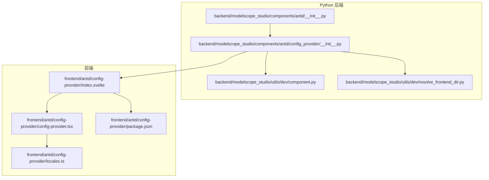
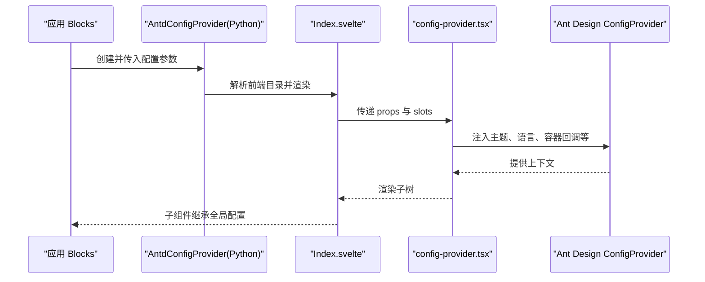
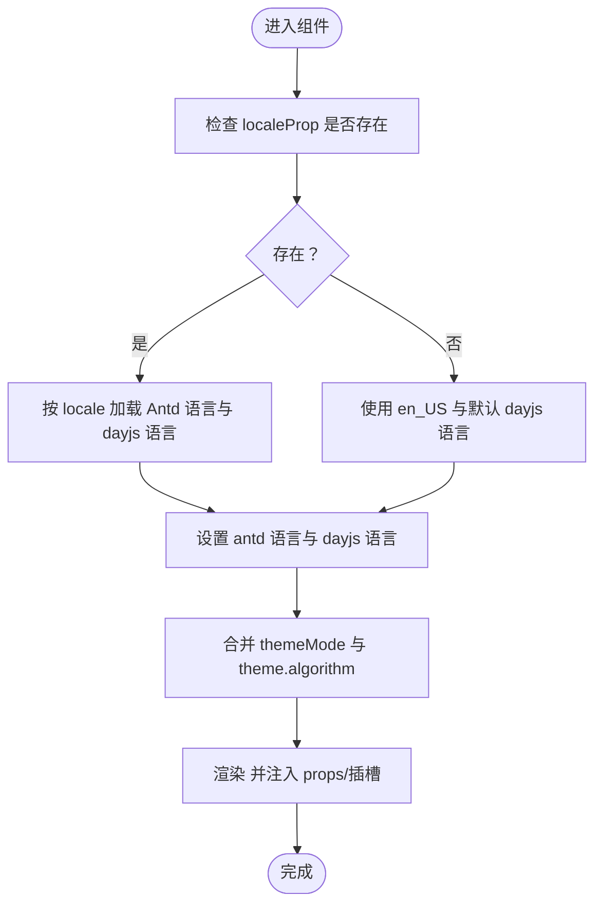
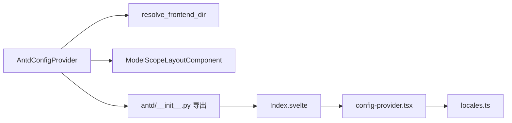

# 其他组件 API

<cite>
**本文引用的文件**
- [backend/modelscope_studio/components/antd/config_provider/__init__.py](file://backend/modelscope_studio/components/antd/config_provider/__init__.py)
- [backend/modelscope_studio/components/antd/components.py](file://backend/modelscope_studio/components/antd/components.py)
- [frontend/antd/config-provider/config-provider.tsx](file://frontend/antd/config-provider/config-provider.tsx)
- [frontend/antd/config-provider/locales.ts](file://frontend/antd/config-provider/locales.ts)
- [frontend/antd/config-provider/Index.svelte](file://frontend/antd/config-provider/Index.svelte)
- [backend/modelscope_studio/utils/dev/component.py](file://backend/modelscope_studio/utils/dev/component.py)
- [backend/modelscope_studio/utils/dev/resolve_frontend_dir.py](file://backend/modelscope_studio/utils/dev/resolve_frontend_dir.py)
- [backend/modelscope_studio/components/antd/__init__.py](file://backend/modelscope_studio/components/antd/__init__.py)
- [docs/demos/example.py](file://docs/demos/example.py)
- [docs/components/antd/config_provider/README.md](file://docs/components/antd/config_provider/README.md)
- [frontend/antd/config-provider/package.json](file://frontend/antd/config-provider/package.json)
</cite>

## 目录

1. [简介](#简介)
2. [项目结构](#项目结构)
3. [核心组件](#核心组件)
4. [架构总览](#架构总览)
5. [详细组件分析](#详细组件分析)
6. [依赖分析](#依赖分析)
7. [性能考虑](#性能考虑)
8. [故障排查指南](#故障排查指南)
9. [结论](#结论)
10. [附录](#附录)

## 简介

本文件为 Ant Design Studio 中“其他组件”的 Python API 参考文档，重点覆盖 ConfigProvider（全局配置提供者）的完整 API 规范与使用说明。内容涵盖：

- 构造函数参数、属性定义、方法签名与返回值类型
- 标准的全局配置用法：主题定制、语言设置、组件默认配置
- 作用域管理、配置继承与动态更新机制
- 国际化配置、主题切换与组件行为定制方案
- 最佳实践与性能优化建议

## 项目结构

ConfigProvider 在后端以 Python 类实现，在前端以 Svelte 包装并对接 Ant Design 的 ConfigProvider，同时通过本地化模块支持多语言。

**图表来源**

- [backend/modelscope_studio/components/antd/**init**.py:32](file://backend/modelscope_studio/components/antd/__init__.py#L32)
- [backend/modelscope_studio/components/antd/config_provider/**init**.py:22](file://backend/modelscope_studio/components/antd/config_provider/__init__.py#L22)
- [backend/modelscope_studio/utils/dev/resolve_frontend_dir.py:4](file://backend/modelscope_studio/utils/dev/resolve_frontend_dir.py#L4)
- [frontend/antd/config-provider/Index.svelte:11](file://frontend/antd/config-provider/Index.svelte#L11)
- [frontend/antd/config-provider/config-provider.tsx:51](file://frontend/antd/config-provider/config-provider.tsx#L51)
- [frontend/antd/config-provider/locales.ts:7](file://frontend/antd/config-provider/locales.ts#L7)
- [frontend/antd/config-provider/package.json:1](file://frontend/antd/config-provider/package.json#L1)

**章节来源**

- [backend/modelscope_studio/components/antd/**init**.py:32](file://backend/modelscope_studio/components/antd/__init__.py#L32)
- [backend/modelscope_studio/components/antd/config_provider/**init**.py:22](file://backend/modelscope_studio/components/antd/config_provider/__init__.py#L22)
- [backend/modelscope_studio/utils/dev/resolve_frontend_dir.py:4](file://backend/modelscope_studio/utils/dev/resolve_frontend_dir.py#L4)
- [frontend/antd/config-provider/Index.svelte:11](file://frontend/antd/config-provider/Index.svelte#L11)
- [frontend/antd/config-provider/config-provider.tsx:51](file://frontend/antd/config-provider/config-provider.tsx#L51)
- [frontend/antd/config-provider/locales.ts:7](file://frontend/antd/config-provider/locales.ts#L7)
- [frontend/antd/config-provider/package.json:1](file://frontend/antd/config-provider/package.json#L1)

## 核心组件

- 组件名称：AntdConfigProvider
- 所属模块：backend.modelscope_studio.components.antd.config_provider
- 基类：ModelScopeLayoutComponent
- 前端映射：frontend/antd/config-provider/Index.svelte → frontend/antd/config-provider/config-provider.tsx
- 作用：为应用内所有 Ant Design 组件提供统一的全局配置（主题、语言、尺寸、前缀、弹层容器等），并支持插槽注入与动态更新。

关键点：

- 支持的插槽：renderEmpty
- 事件：无
- 前端目录解析：通过 resolve_frontend_dir("config-provider") 指向前端组件目录
- 跳过 API 导出：skip_api 返回 True，避免在某些自动化导出中暴露该组件

**章节来源**

- [backend/modelscope_studio/components/antd/config_provider/**init**.py:22](file://backend/modelscope_studio/components/antd/config_provider/__init__.py#L22)
- [backend/modelscope_studio/components/antd/config_provider/**init**.py:28](file://backend/modelscope_studio/components/antd/config_provider/__init__.py#L28)
- [backend/modelscope_studio/components/antd/config_provider/**init**.py:95](file://backend/modelscope_studio/components/antd/config_provider/__init__.py#L95)
- [backend/modelscope_studio/utils/dev/component.py:20](file://backend/modelscope_studio/utils/dev/component.py#L20)

## 架构总览

ConfigProvider 的调用链路如下：

**图表来源**

- [backend/modelscope_studio/components/antd/config_provider/**init**.py:95](file://backend/modelscope_studio/components/antd/config_provider/__init__.py#L95)
- [frontend/antd/config-provider/Index.svelte:11](file://frontend/antd/config-provider/Index.svelte#L11)
- [frontend/antd/config-provider/config-provider.tsx:108](file://frontend/antd/config-provider/config-provider.tsx#L108)

## 详细组件分析

### 构造函数与属性定义

- 类名：AntdConfigProvider
- 继承：ModelScopeLayoutComponent
- 关键属性（部分）：
  - component_disabled: 可选布尔，控制组件禁用状态
  - component_size: 可选字符串，取值 small/middle/large 或 None
  - csp: 可选字典，用于 CSP 配置
  - direction: 可选字符串，取值 ltr/rtl 或 None
  - get_popup_container: 可选字符串，指定弹层挂载容器
  - get_target_container: 可选字符串，指定目标容器
  - icon_prefix_cls: 可选字符串，图标前缀类名
  - locale: 可选字符串，取值为预定义的 LocaleType
  - popup_match_select_width: 可选布尔或数值，影响弹层宽度策略
  - popup_overflow: 可选字符串，取值 viewport/scroll
  - prefix_cls: 可选字符串，组件前缀类名
  - render_empty: 可选字符串，用于空状态渲染
  - theme: 可选字典（已弃用），警告提示使用 theme_config
  - theme_config: 可选字典，主题配置（推荐）
  - variant: 可选字符串，取值 outlined/filled/borderless
  - virtual: 可选布尔
  - warning: 可选字典，警告配置
  - 元素级样式与类名：class_names、styles
  - 布局与可见性：visible、elem_id、elem_classes、elem_style、render、as_item
  - 额外属性：additional_props
  - 其他通用属性：\_internal（内部保留）

注意：

- theme 与 theme_config 的关系：若传入 theme，将触发警告，建议使用 theme_config
- 插槽：仅支持 renderEmpty

方法签名与返回类型：

- preprocess(payload: None) -> None
- postprocess(value: None) -> None
- example_payload() -> Any
- example_value() -> Any

**章节来源**

- [backend/modelscope_studio/components/antd/config_provider/**init**.py:31](file://backend/modelscope_studio/components/antd/config_provider/__init__.py#L31)
- [backend/modelscope_studio/components/antd/config_provider/**init**.py:42](file://backend/modelscope_studio/components/antd/config_provider/__init__.py#L42)
- [backend/modelscope_studio/components/antd/config_provider/**init**.py:86](file://backend/modelscope_studio/components/antd/config_provider/__init__.py#L86)
- [backend/modelscope_studio/components/antd/config_provider/**init**.py:101](file://backend/modelscope_studio/components/antd/config_provider/__init__.py#L101)
- [backend/modelscope_studio/components/antd/config_provider/**init**.py:104](file://backend/modelscope_studio/components/antd/config_provider/__init__.py#L104)
- [backend/modelscope_studio/components/antd/config_provider/**init**.py:108](file://backend/modelscope_studio/components/antd/config_provider/__init__.py#L108)
- [backend/modelscope_studio/components/antd/config_provider/**init**.py:111](file://backend/modelscope_studio/components/antd/config_provider/__init__.py#L111)

### 前端实现要点

- 类型与导入：基于 Ant Design 的 ConfigProvider 类型，扩展 themeMode 与 theme.algorithm 字段
- 主题算法：根据 themeMode 自动选择 dark/compact 算法，可与外部 theme.algorithm 合并
- 语言设置：locale 默认从浏览器环境推断，支持 en_US 作为回退；按需异步加载对应语言包与 dayjs 语言
- 容器回调：getPopupContainer、getTargetContainer、renderEmpty 通过 useFunction 包装，确保响应式更新
- 插槽处理：将 slots 中以点号分隔的路径注入到 props 对应位置，renderEmpty 支持 ReactSlot

**图表来源**

- [frontend/antd/config-provider/config-provider.tsx:96](file://frontend/antd/config-provider/config-provider.tsx#L96)
- [frontend/antd/config-provider/config-provider.tsx:127](file://frontend/antd/config-provider/config-provider.tsx#L127)
- [frontend/antd/config-provider/config-provider.tsx:110](file://frontend/antd/config-provider/config-provider.tsx#L110)

**章节来源**

- [frontend/antd/config-provider/config-provider.tsx:51](file://frontend/antd/config-provider/config-provider.tsx#L51)
- [frontend/antd/config-provider/config-provider.tsx:77](file://frontend/antd/config-provider/config-provider.tsx#L77)
- [frontend/antd/config-provider/config-provider.tsx:96](file://frontend/antd/config-provider/config-provider.tsx#L96)
- [frontend/antd/config-provider/config-provider.tsx:127](file://frontend/antd/config-provider/config-provider.tsx#L127)
- [frontend/antd/config-provider/config-provider.tsx:110](file://frontend/antd/config-provider/config-provider.tsx#L110)

### 国际化配置

- 语言枚举：LocaleType 为字符串字面量联合类型，覆盖多种语言与地区
- 语言映射：lang2RegionMap 将简短语言代码映射到具体区域代码
- 语言加载：locales 映射每个区域代码到异步加载函数，返回 antd 语言与 dayjs 语言
- 默认语言：getDefaultLocale 设置 dayjs 语言为英语

使用建议：

- locale 参数优先使用 LocaleType 中的枚举值
- 若未提供 locale，将自动从浏览器环境推断并回退至 en_US

**章节来源**

- [backend/modelscope_studio/components/antd/config_provider/**init**.py:8](file://backend/modelscope_studio/components/antd/config_provider/__init__.py#L8)
- [frontend/antd/config-provider/locales.ts:12](file://frontend/antd/config-provider/locales.ts#L12)
- [frontend/antd/config-provider/locales.ts:89](file://frontend/antd/config-provider/locales.ts#L89)
- [frontend/antd/config-provider/locales.ts:7](file://frontend/antd/config-provider/locales.ts#L7)

### 主题与变体配置

- 主题入口：theme_config（推荐）或已弃用的 theme
- 主题算法：themeMode 控制 dark/compact，可与外部 algorithm 合并
- 组件变体：variant 支持 outlined/filled/borderless

最佳实践：

- 使用 theme_config 进行主题定制，避免与 Gradio 预设冲突
- 通过开关变量控制 themeMode，实现明暗/紧凑主题的动态切换

**章节来源**

- [backend/modelscope_studio/components/antd/config_provider/**init**.py:86](file://backend/modelscope_studio/components/antd/config_provider/__init__.py#L86)
- [frontend/antd/config-provider/config-provider.tsx:88](file://frontend/antd/config-provider/config-provider.tsx#L88)
- [frontend/antd/config-provider/config-provider.tsx:127](file://frontend/antd/config-provider/config-provider.tsx#L127)

### 作用域管理、继承与动态更新

- 作用域：ConfigProvider 作为布局组件，其子树内的组件均继承全局配置
- 继承：子组件无需重复传入相同配置，直接从上下文读取
- 动态更新：通过 Gradio 的 update 输出到 ConfigProvider，实时变更 theme_config、locale、direction 等

参考示例：

- 文档示例展示了如何在交互中动态更新 ConfigProvider 的 locale、direction 与 theme_config

**章节来源**

- [docs/demos/example.py:6](file://docs/demos/example.py#L6)
- [docs/components/antd/config_provider/README.md:7](file://docs/components/antd/config_provider/README.md#L7)

### API 定义与类型摘要

- 构造函数参数（节选）
  - component_disabled: bool | None
  - component_size: "small"|"middle"|"large" | None
  - csp: dict | None
  - direction: "ltr"|"rtl" | None
  - get_popup_container: str | None
  - get_target_container: str | None
  - icon_prefix_cls: str | None
  - locale: LocaleType | None
  - popup_match_select_width: bool | int | float | None
  - popup_overflow: "viewport"|"scroll" | None
  - prefix_cls: str | None
  - render_empty: str | None
  - theme: dict | None
  - theme_config: dict | None
  - variant: "outlined"|"filled"|"borderless" | None
  - virtual: bool | None
  - warning: dict | None
  - class_names: dict | str | None
  - styles: dict | str | None
  - as_item: str | None
  - \_internal: None
  - visible: bool
  - elem_id: str | None
  - elem_classes: list[str] | str | None
  - elem_style: dict | None
  - render: bool
  - additional_props: dict | None
  - 其他通用关键字参数

- 方法
  - preprocess(payload: None) -> None
  - postprocess(value: None) -> None
  - example_payload() -> Any
  - example_value() -> Any

- 属性
  - skip_api: True
  - FRONTEND_DIR: 由 resolve_frontend_dir("config-provider") 解析

**章节来源**

- [backend/modelscope_studio/components/antd/config_provider/**init**.py:31](file://backend/modelscope_studio/components/antd/config_provider/__init__.py#L31)
- [backend/modelscope_studio/components/antd/config_provider/**init**.py:95](file://backend/modelscope_studio/components/antd/config_provider/__init__.py#L95)
- [backend/modelscope_studio/utils/dev/resolve_frontend_dir.py:4](file://backend/modelscope_studio/utils/dev/resolve_frontend_dir.py#L4)

## 依赖分析

- Python 层
  - 继承自 ModelScopeLayoutComponent，具备布局上下文能力
  - 通过 resolve_frontend_dir 解析前端组件目录
  - 在 antd/**init**.py 中被导出为 ConfigProvider

- 前端层
  - Index.svelte 将 Python 传入的 props 与 slots 转换为 React Props
  - config-provider.tsx 对接 Ant Design ConfigProvider，注入主题、语言、容器回调与插槽
  - locales.ts 提供语言映射与异步加载

**图表来源**

- [backend/modelscope_studio/utils/dev/resolve_frontend_dir.py:4](file://backend/modelscope_studio/utils/dev/resolve_frontend_dir.py#L4)
- [backend/modelscope_studio/utils/dev/component.py:11](file://backend/modelscope_studio/utils/dev/component.py#L11)
- [backend/modelscope_studio/components/antd/**init**.py:32](file://backend/modelscope_studio/components/antd/__init__.py#L32)
- [frontend/antd/config-provider/Index.svelte:11](file://frontend/antd/config-provider/Index.svelte#L11)
- [frontend/antd/config-provider/config-provider.tsx:51](file://frontend/antd/config-provider/config-provider.tsx#L51)
- [frontend/antd/config-provider/locales.ts:7](file://frontend/antd/config-provider/locales.ts#L7)

**章节来源**

- [backend/modelscope_studio/components/antd/**init**.py:32](file://backend/modelscope_studio/components/antd/__init__.py#L32)
- [backend/modelscope_studio/utils/dev/resolve_frontend_dir.py:4](file://backend/modelscope_studio/utils/dev/resolve_frontend_dir.py#L4)
- [frontend/antd/config-provider/Index.svelte:11](file://frontend/antd/config-provider/Index.svelte#L11)
- [frontend/antd/config-provider/config-provider.tsx:51](file://frontend/antd/config-provider/config-provider.tsx#L51)
- [frontend/antd/config-provider/locales.ts:7](file://frontend/antd/config-provider/locales.ts#L7)

## 性能考虑

- 主题切换
  - 使用 themeMode 与 theme.algorithm 合并策略，避免频繁重建主题对象
  - 仅在 locale 变更时触发语言包加载，减少不必要的异步开销
- 弹层容器与目标容器
  - 通过 useFunction 包装回调，降低因函数引用变化导致的重渲染
- 插槽渲染
  - renderEmpty 通过 ReactSlot 渲染，避免额外的 DOM 操作
- 前缀与样式
  - 使用 prefix_cls 与 class_names/styles 控制样式范围，避免全局污染

[本节为通用指导，不直接分析具体文件]

## 故障排查指南

- 主题冲突
  - 若传入 theme，将触发警告，请改用 theme_config
- 语言未生效
  - 确认 locale 为 LocaleType 中的有效值；若为空则回退至 en_US
  - 检查 locales 映射是否包含对应区域代码
- 弹层位置异常
  - 检查 get_popup_container/get_target_container 的返回容器是否存在且正确
- 插槽未显示
  - 确认插槽名称与路径一致（如 renderEmpty），并在前端正确注入

**章节来源**

- [backend/modelscope_studio/components/antd/config_provider/**init**.py:86](file://backend/modelscope_studio/components/antd/config_provider/__init__.py#L86)
- [frontend/antd/config-provider/config-provider.tsx:96](file://frontend/antd/config-provider/config-provider.tsx#L96)
- [frontend/antd/config-provider/config-provider.tsx:117](file://frontend/antd/config-provider/config-provider.tsx#L117)

## 结论

AntdConfigProvider 提供了对 Ant Design 组件的全局配置能力，覆盖主题、语言、尺寸、容器与空状态渲染等关键维度。通过 Python 侧的统一封装与前端的高效对接，开发者可以便捷地实现作用域内的配置继承与动态更新。建议优先使用 theme_config 进行主题定制，并结合 locale 与 direction 实现国际化与布局适配。

[本节为总结性内容，不直接分析具体文件]

## 附录

### 使用示例与参考

- 基础用法示例（文档演示）
  - 示例展示了在 Application 与 AutoLoading 的作用域下嵌套 ConfigProvider，并在其内部使用 DatePicker
  - 参考路径：docs/demos/example.py

- 文档页面
  - README 中包含基本示例占位符，实际演示位于 demos/basic.py

**章节来源**

- [docs/demos/example.py:6](file://docs/demos/example.py#L6)
- [docs/components/antd/config_provider/README.md:7](file://docs/components/antd/config_provider/README.md#L7)

### 组件注册与导出

- 在 antd/**init**.py 中导出 ConfigProvider 别名为 ConfigProvider
- 在 components.py 中导入并导出 AntdConfigProvider

**章节来源**

- [backend/modelscope_studio/components/antd/**init**.py:32](file://backend/modelscope_studio/components/antd/__init__.py#L32)
- [backend/modelscope_studio/components/antd/components.py:31](file://backend/modelscope_studio/components/antd/components.py#L31)
