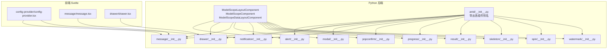
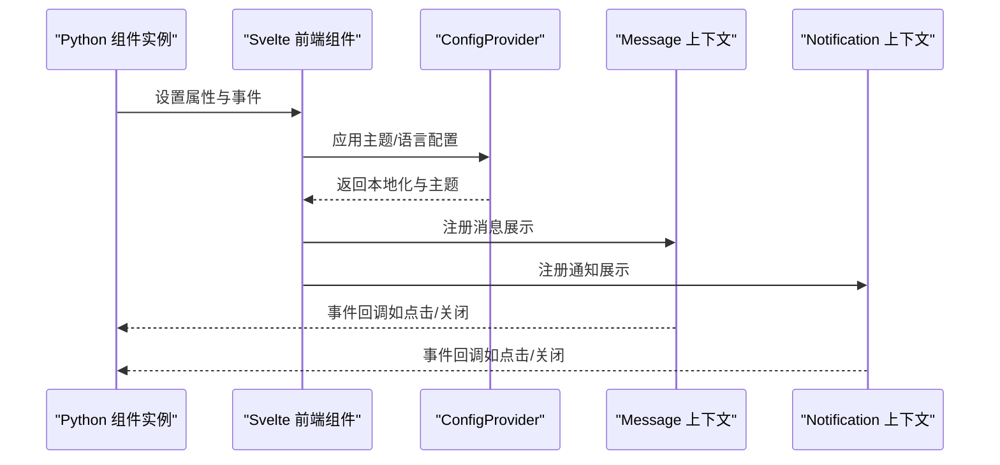
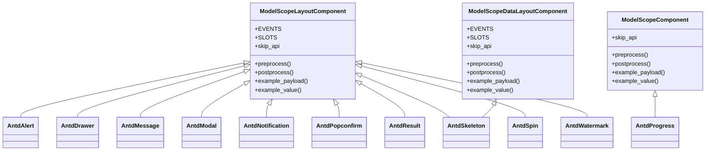

# 反馈组件 API

<cite>
**本文引用的文件**
- [backend/modelscope_studio/components/antd/alert/__init__.py](file://backend/modelscope_studio/components/antd/alert/__init__.py)
- [backend/modelscope_studio/components/antd/drawer/__init__.py](file://backend/modelscope_studio/components/antd/drawer/__init__.py)
- [backend/modelscope_studio/components/antd/message/__init__.py](file://backend/modelscope_studio/components/antd/message/__init__.py)
- [backend/modelscope_studio/components/antd/modal/__init__.py](file://backend/modelscope_studio/components/antd/modal/__init__.py)
- [backend/modelscope_studio/components/antd/notification/__init__.py](file://backend/modelscope_studio/components/antd/notification/__init__.py)
- [backend/modelscope_studio/components/antd/popconfirm/__init__.py](file://backend/modelscope_studio/components/antd/popconfirm/__init__.py)
- [backend/modelscope_studio/components/antd/progress/__init__.py](file://backend/modelscope_studio/components/antd/progress/__init__.py)
- [backend/modelscope_studio/components/antd/result/__init__.py](file://backend/modelscope_studio/components/antd/result/__init__.py)
- [backend/modelscope_studio/components/antd/skeleton/__init__.py](file://backend/modelscope_studio/components/antd/skeleton/__init__.py)
- [backend/modelscope_studio/components/antd/spin/__init__.py](file://backend/modelscope_studio/components/antd/spin/__init__.py)
- [backend/modelscope_studio/components/antd/watermark/__init__.py](file://backend/modelscope_studio/components/antd/watermark/__init__.py)
- [backend/modelscope_studio/utils/dev/component.py](file://backend/modelscope_studio/utils/dev/component.py)
- [backend/modelscope_studio/components/antd/modal/static/__init__.py](file://backend/modelscope_studio/components/antd/modal/static/__init__.py)
- [backend/modelscope_studio/components/antd/__init__.py](file://backend/modelscope_studio/components/antd/__init__.py)
- [frontend/antd/config-provider/config-provider.tsx](file://frontend/antd/config-provider/config-provider.tsx)
- [frontend/antd/config-provider/locales.ts](file://frontend/antd/config-provider/locales.ts)
- [frontend/antd/message/message.tsx](file://frontend/antd/message/message.tsx)
- [frontend/antd/drawer/drawer.tsx](file://frontend/antd/drawer/drawer.tsx)
</cite>

## 目录

1. [简介](#简介)
2. [项目结构](#项目结构)
3. [核心组件](#核心组件)
4. [架构总览](#架构总览)
5. [详细组件分析](#详细组件分析)
6. [依赖分析](#依赖分析)
7. [性能考虑](#性能考虑)
8. [故障排查指南](#故障排查指南)
9. [结论](#结论)
10. [附录](#附录)

## 简介

本文件为 Antd 反馈组件的 Python API 参考文档，覆盖 Alert、Drawer、Message、Modal、Notification、Popconfirm、Progress、Result、Skeleton、Spin、Watermark 等反馈相关组件。内容包括：

- 构造函数参数与属性定义
- 方法签名与返回值类型
- 使用示例（以"示例路径"形式给出）
- 时机控制、动画与交互响应
- 全局配置、主题与国际化
- 用户体验设计原则与通知策略最佳实践

## 项目结构

反馈组件位于后端 Python 包的 antd 子模块下，每个组件均继承自统一的组件基类，前端由对应的 Svelte 组件实现并与 Gradio 事件系统对接。

图表来源

- [backend/modelscope_studio/utils/dev/component.py:11-169](file://backend/modelscope_studio/utils/dev/component.py#L11-L169)
- [backend/modelscope_studio/components/antd/**init**.py:1-151](file://backend/modelscope_studio/components/antd/__init__.py#L1-L151)
- [frontend/antd/config-provider/config-provider.tsx:51-106](file://frontend/antd/config-provider/config-provider.tsx#L51-L106)
- [frontend/antd/message/message.tsx:55-78](file://frontend/antd/message/message.tsx#L55-L78)
- [frontend/antd/drawer/drawer.tsx:14-60](file://frontend/antd/drawer/drawer.tsx#L14-L60)

章节来源

- [backend/modelscope_studio/components/antd/**init**.py:1-151](file://backend/modelscope_studio/components/antd/__init__.py#L1-L151)
- [backend/modelscope_studio/utils/dev/component.py:11-169](file://backend/modelscope_studio/utils/dev/component.py#L11-L169)

## 核心组件

以下为反馈组件的通用构造函数参数与属性概览（按组件分组）：

- 通用参数
  - visible: 布尔，是否渲染
  - elem_id: 字符串，元素 ID
  - elem_classes: 列表或字符串，CSS 类
  - elem_style: 字典，内联样式
  - render: 布尔，是否渲染
  - as_item: 字符串，布局项标识
  - class_names: 字典或字符串，附加类名映射
  - styles: 字典或字符串，附加样式映射
  - root_class_name: 字符串，根节点类名
  - additional_props: 字典，透传给前端组件的额外属性
  - \_internal: 内部参数，框架保留

- 事件绑定（通过 EVENTS 列表注册）
  - 事件回调在构造时通过内部更新绑定到前端组件

章节来源

- [backend/modelscope_studio/utils/dev/component.py:28-98](file://backend/modelscope_studio/utils/dev/component.py#L28-L98)
- [backend/modelscope_studio/components/antd/alert/**init**.py:16-20](file://backend/modelscope_studio/components/antd/alert/__init__.py#L16-L20)
- [backend/modelscope_studio/components/antd/drawer/**init**.py:14-18](file://backend/modelscope_studio/components/antd/drawer/__init__.py#L14-L18)
- [backend/modelscope_studio/components/antd/message/**init**.py:14-21](file://backend/modelscope_studio/components/antd/message/__init__.py#L14-L21)
- [backend/modelscope_studio/components/antd/modal/**init**.py:18-25](file://backend/modelscope_studio/components/antd/modal/__init__.py#L18-L25)
- [backend/modelscope_studio/components/antd/notification/**init**.py:14-21](file://backend/modelscope_studio/components/antd/notification/__init__.py#L14-L21)
- [backend/modelscope_studio/components/antd/popconfirm/**init**.py:14-27](file://backend/modelscope_studio/components/antd/popconfirm/__init__.py#L14-L27)
- [backend/modelscope_studio/components/antd/watermark/**init**.py:12-16](file://backend/modelscope_studio/components/antd/watermark/__init__.py#L12-L16)

## 架构总览

反馈组件的调用链路如下：Python 层构造组件实例，设置属性与事件；前端 Svelte 组件接收 props 并与 Ant Design 组件对接；全局 ConfigProvider 提供主题与国际化；Message/Notification 通过前端上下文进行全局展示。

图表来源

- [frontend/antd/config-provider/config-provider.tsx:51-106](file://frontend/antd/config-provider/config-provider.tsx#L51-L106)
- [frontend/antd/message/message.tsx:55-78](file://frontend/antd/message/message.tsx#L55-L78)
- [backend/modelscope_studio/components/antd/message/**init**.py:14-21](file://backend/modelscope_studio/components/antd/message/__init__.py#L14-L21)
- [backend/modelscope_studio/components/antd/notification/**init**.py:14-21](file://backend/modelscope_studio/components/antd/notification/__init__.py#L14-L21)

## 详细组件分析

### Alert（警告提示）

- 构造函数参数与属性
  - action: 字符串，操作按钮内容
  - after_close: 字符串，关闭后的回调
  - banner: 布尔，横幅模式
  - closable: 布尔或字典，可关闭配置
  - description: 字符串，描述文本
  - icon: 字符串，图标
  - message: 字符串，标题
  - show_icon: 布尔，是否显示图标
  - type: 文本枚举（success/info/warning/error），类型
  - slots: 支持 action、closable.closeIcon、description、icon、message
- 方法
  - preprocess(payload): 输入预处理
  - postprocess(value): 输出后处理
  - example_payload()/example_value(): 示例数据
- 事件
  - close: 关闭事件绑定

章节来源

- [backend/modelscope_studio/components/antd/alert/**init**.py:25-89](file://backend/modelscope_studio/components/antd/alert/__init__.py#L25-L89)

### Drawer（抽屉）

- 构造函数参数与属性
  - after_open_change: 字符串，打开状态变化回调
  - auto_focus: 布尔，自动聚焦
  - body_style: 字典，主体样式
  - close_icon: 字符串，关闭图标
  - closable: 布尔或字典，可关闭
  - destroy_on_close/destroy_on_hidden: 布尔，关闭/隐藏时销毁
  - draggable: 布尔，拖拽
  - extra: 字符串，额外内容
  - footer: 字符串，底部
  - force_render: 布尔，强制渲染
  - get_container: 字符串，容器选择器
  - height/width: 数字或字符串，尺寸
  - keyboard: 布尔，键盘支持
  - mask/mask_closable: 布尔，遮罩与点击遮罩关闭
  - placement: 文本枚举（left/right/top/bottom），位置
  - push: 布尔或字典，推动
  - resizable: 布尔，可调整大小
  - size: 文本枚举（default/large），尺寸
  - title: 字符串，标题
  - loading: 布尔，加载中
  - open: 布尔，是否打开
  - z_index: 整数，层级
  - drawer_render: 字符串，渲染函数
  - slots: 支持 closeIcon、closable.closeIcon、extra、footer、title、drawerRender
- 方法
  - preprocess()/postprocess(): 预处理/后处理
  - example_payload()/example_value(): 示例数据
- 事件
  - close: 关闭事件绑定
  - resizable_resize_start: 调整大小开始事件绑定
  - resizable_resize: 调整大小事件绑定
  - resizable_resize_end: 调整大小结束事件绑定

**更新** Drawer组件新增了三个可调整大小相关的事件处理器：

- resizable_resize_start：当用户开始拖拽调整抽屉大小时触发
- resizable_resize：在调整过程中持续触发
- resizable_resize_end：当调整操作完成时触发

这些事件允许开发者监听抽屉的动态调整过程，实现更精细的交互控制。

章节来源

- [backend/modelscope_studio/components/antd/drawer/**init**.py:14-27](file://backend/modelscope_studio/components/antd/drawer/__init__.py#L14-L27)
- [backend/modelscope_studio/components/antd/drawer/**init**.py:26-126](file://backend/modelscope_studio/components/antd/drawer/__init__.py#L26-L126)
- [frontend/antd/drawer/drawer.tsx:14-60](file://frontend/antd/drawer/drawer.tsx#L14-L60)

### Message（全局消息）

- 构造函数参数与属性
  - content: 字符串，消息内容
  - type: 文本枚举（success/info/warning/error/loading），类型
  - duration: 数字，持续时间
  - icon: 字符串，图标
  - key: 字符串/数字/浮点，唯一键
  - pause_on_hover: 布尔，悬停暂停
  - get_container: 字符串，容器选择器
  - rtl: 布尔，从右到左
  - top: 数字，顶部距离
  - slots: 支持 icon、content
- 方法
  - preprocess(payload: str|None): str|None
  - postprocess(value: str|None): str|None
  - example_payload()/example_value(): 示例数据
- 事件
  - click/close: 点击与关闭事件绑定

章节来源

- [backend/modelscope_studio/components/antd/message/**init**.py:26-91](file://backend/modelscope_studio/components/antd/message/__init__.py#L26-L91)
- [frontend/antd/message/message.tsx:55-78](file://frontend/antd/message/message.tsx#L55-L78)

### Modal（模态框）

- 构造函数参数与属性
  - after_close: 字符串，关闭后回调
  - cancel_button_props/cancel_text: 字典/字符串，取消按钮属性与文本
  - centered: 布尔，居中
  - closable/close_icon: 布尔/字典/字符串，可关闭与关闭图标
  - confirm_loading: 布尔，确认中
  - destroy_on_close/destroy_on_hidden: 布尔，关闭/隐藏时销毁
  - focus_trigger_after_close: 布尔，关闭后焦点触发
  - focusable: 布尔/字典，可聚焦
  - footer: 字符串或默认常量，底部
  - force_render: 布尔，强制渲染
  - get_container: 字符串，容器选择器
  - keyboard: 布尔，键盘支持
  - mask/mask_closable: 布尔，遮罩与点击遮罩关闭
  - modal_render: 字符串，渲染函数
  - ok_text/ok_type/ok_button_props: 字符串/字典，确定按钮属性
  - loading: 布尔，加载中
  - title: 字符串，标题
  - open: 布尔，是否打开
  - width: 数字/字符串，宽度
  - wrap_class_name: 字符串，包裹类名
  - z_index: 整数，层级
  - after_open_change: 字符串，打开状态变化回调
  - slots: 支持 closeIcon、cancelButtonProps.icon、cancelText、closable.closeIcon、closeIcon、footer、title、okButtonProps.icon、okText、modalRender
- 方法
  - preprocess()/postprocess(): 预处理/后处理
  - example_payload()/example_value(): 示例数据
- 事件
  - ok/cancel: 确定与取消事件绑定
- 静态子组件
  - Static: 静态模态组件（用于静态场景）

章节来源

- [backend/modelscope_studio/components/antd/modal/**init**.py:34-136](file://backend/modelscope_studio/components/antd/modal/__init__.py#L34-L136)
- [backend/modelscope_studio/components/antd/modal/static/**init**.py:30-61](file://backend/modelscope_studio/components/antd/modal/static/__init__.py#L30-L61)

### Notification（全局通知）

- 构造函数参数与属性
  - message/description/title: 字符串，消息、描述、标题
  - type: 文本枚举（success/info/warning/error），类型
  - btn: 字符串，按钮
  - close_icon: 字符串/布尔，关闭图标
  - duration: 数字，持续时间
  - show_progress/pause_on_hover: 布尔，进度条与悬停暂停
  - icon: 字符串，图标
  - key: 字符串，唯一键
  - placement: 文本枚举（top/topLeft/topRight/bottom/bottomLeft/bottomRight），位置
  - role: 文本枚举（alert/status），角色
  - bottom/top: 数字，边距
  - rtl: 布尔，从右到左
  - get_container: 字符串，容器选择器
  - stack: 布尔/字典，堆叠配置
  - slots: 支持 actions、closeIcon、description、icon、message、title
- 方法
  - preprocess()/postprocess(): 预处理/后处理
  - example_payload()/example_value(): 示例数据
- 事件
  - click/close: 点击与关闭事件绑定

章节来源

- [backend/modelscope_studio/components/antd/notification/**init**.py:26-109](file://backend/modelscope_studio/components/antd/notification/__init__.py#L26-L109)

### Popconfirm（气泡确认框）

- 构造函数参数与属性
  - title/description: 字符串，标题与描述
  - cancel_button_props/cancel_text: 字典/字符串，取消按钮
  - disabled: 布尔，禁用
  - icon: 字符串，图标
  - ok_button_props/ok_text/ok_type: 字典/字符串/枚举，确定按钮
  - show_cancel: 布尔，显示取消
  - align/arrow/auto_adjust_overflow: 字典/布尔，定位与自适应
  - color: 字符串，颜色
  - default_open: 布尔，初始打开
  - destroy_tooltip_on_hide/destroy_on_hidden: 布尔，销毁策略
  - fresh: 布尔，刷新
  - get_popup_container: 字符串，弹层容器
  - mouse_enter_delay/mouse_leave_delay: 数字，延迟
  - overlay_class_name/overlay_style/overlay_inner_style: 字符串/字典，覆盖层样式
  - placement: 文本枚举（多方向），位置
  - trigger: 文本枚举或列表（hover/focus/click/contextMenu），触发方式
  - open: 布尔，是否打开
  - z_index: 整数，层级
  - slots: 支持 title、description、cancelButtonProps.icon、cancelText、okButtonProps.icon、okText
- 方法
  - preprocess()/postprocess(): 预处理/后处理
  - example_payload()/example_value(): 示例数据
- 事件
  - open_change/cancel/confirm/popup_click: 打开变化、取消、确认、弹层点击事件绑定

章节来源

- [backend/modelscope_studio/components/antd/popconfirm/**init**.py:39-156](file://backend/modelscope_studio/components/antd/popconfirm/__init__.py#L39-L156)

### Progress（进度条）

- 构造函数参数与属性
  - percent: 整数，默认 0，百分比
  - format: 字符串，格式化函数
  - show_info: 布尔，显示信息
  - status: 文本枚举（success/exception/normal/active），状态
  - rounding: 字符串，圆角
  - stroke_color: 字符串/列表/字典，描边颜色
  - stroke_linecap: 文本枚举（round/butt/square），线帽
  - success: 字典，成功区域
  - trail_color: 字符串，轨道颜色
  - type: 文本枚举（line/circle/dashboard），类型
  - size: 数字/列表/字典/枚举（small/default），尺寸
  - steps: 整数/字典，步进
  - percent_position: 字典，百分比位置
  - stroke_width: 数字/浮点，描边宽度
  - gap_degree/gap_position/gap_placement: 数字/枚举，缺口角度与位置
- 方法
  - preprocess()/postprocess(): 预处理/后处理
  - example_payload()/example_value(): 示例数据

章节来源

- [backend/modelscope_studio/components/antd/progress/**init**.py:15-100](file://backend/modelscope_studio/components/antd/progress/__init__.py#L15-L100)

### Result（结果）

- 构造函数参数与属性
  - extra: 字符串，额外内容
  - icon: 字符串，图标
  - status: 文本枚举（success/error/info/warning/404/403/500），状态
  - sub_title: 字符串，副标题
  - title: 字符串，标题
  - slots: 支持 extra、icon、subTitle、title
- 方法
  - preprocess()/postprocess(): 预处理/后处理
  - example_payload()/example_value(): 示例数据

章节来源

- [backend/modelscope_studio/components/antd/result/**init**.py:17-75](file://backend/modelscope_studio/components/antd/result/__init__.py#L17-L75)

### Skeleton（骨架屏）

- 构造函数参数与属性
  - active: 布尔，动画
  - avatar: 布尔/字典，头像骨架
  - loading: 布尔，加载中
  - paragraph: 布尔/字典，段落骨架
  - round: 布尔，圆角
  - title: 布尔/字典，标题骨架
- 子组件
  - Node/Avatar/Button/Image/Input：骨架节点与元素
- 方法
  - preprocess()/postprocess(): 预处理/后处理
  - example_payload()/example_value(): 示例数据

章节来源

- [backend/modelscope_studio/components/antd/skeleton/**init**.py:22-80](file://backend/modelscope_studio/components/antd/skeleton/__init__.py#L22-L80)

### Spin（加载中）

- 构造函数参数与属性
  - spinning: 布尔，是否旋转
  - delay: 数字，延迟
  - fullscreen: 布尔，全屏
  - indicator: 字符串，指示器
  - percent: 数字/浮点/枚举（'auto'），百分比
  - size: 文本枚举（small/default/large），尺寸
  - tip: 字符串，提示
  - wrapper_class_name: 字符串，包装类名
  - slots: 支持 tip、indicator
- 方法
  - preprocess()/postprocess(): 预处理/后处理
  - example_payload()/example_value(): 示例数据

章节来源

- [backend/modelscope_studio/components/antd/spin/**init**.py:17-79](file://backend/modelscope_studio/components/antd/spin/__init__.py#L17-L79)

### Watermark（水印）

- 构造函数参数与属性
  - content: 字符串/列表，内容（文本或数组）
  - width/height: 数字/浮点，尺寸
  - inherit: 布尔，继承
  - rotate: 数字/浮点，旋转角度
  - z_index: 整数，层级
  - image: 字符串，图片水印
  - font: 字典，字体配置
  - gap: 列表，间距
  - offset: 列表，偏移
- 方法
  - preprocess()/postprocess(): 预处理/后处理
  - example_payload()/example_value(): 示例数据
- 事件
  - remove: 移除事件绑定

章节来源

- [backend/modelscope_studio/components/antd/watermark/**init**.py:18-84](file://backend/modelscope_studio/components/antd/watermark/__init__.py#L18-L84)

## 依赖分析

- 组件基类
  - ModelScopeLayoutComponent：布局型组件基类，支持事件与插槽
  - ModelScopeComponent：数据型组件基类，支持值与加载
  - ModelScopeDataLayoutComponent：数据+布局混合基类
- 导出与别名
  - 通过 antd/**init**.py 将各组件导出为公共别名，便于直接 import 使用

图表来源

- [backend/modelscope_studio/utils/dev/component.py:11-169](file://backend/modelscope_studio/utils/dev/component.py#L11-L169)
- [backend/modelscope_studio/components/antd/alert/**init**.py:11-15](file://backend/modelscope_studio/components/antd/alert/__init__.py#L11-L15)
- [backend/modelscope_studio/components/antd/drawer/**init**.py:10-13](file://backend/modelscope_studio/components/antd/drawer/__init__.py#L10-L13)
- [backend/modelscope_studio/components/antd/message/**init**.py:10-13](file://backend/modelscope_studio/components/antd/message/__init__.py#L10-L13)
- [backend/modelscope_studio/components/antd/modal/**init**.py:11-16](file://backend/modelscope_studio/components/antd/modal/__init__.py#L11-L16)
- [backend/modelscope_studio/components/antd/notification/**init**.py:10-13](file://backend/modelscope_studio/components/antd/notification/__init__.py#L10-L13)
- [backend/modelscope_studio/components/antd/popconfirm/**init**.py:10-13](file://backend/modelscope_studio/components/antd/popconfirm/__init__.py#L10-L13)
- [backend/modelscope_studio/components/antd/progress/**init**.py:8-11](file://backend/modelscope_studio/components/antd/progress/__init__.py#L8-L11)
- [backend/modelscope_studio/components/antd/result/**init**.py:8-11](file://backend/modelscope_studio/components/antd/result/__init__.py#L8-L11)
- [backend/modelscope_studio/components/antd/skeleton/**init**.py:11-14](file://backend/modelscope_studio/components/antd/skeleton/__init__.py#L11-L14)
- [backend/modelscope_studio/components/antd/spin/**init**.py:8-11](file://backend/modelscope_studio/components/antd/spin/__init__.py#L8-L11)
- [backend/modelscope_studio/components/antd/watermark/**init**.py:8-11](file://backend/modelscope_studio/components/antd/watermark/__init__.py#L8-L11)

章节来源

- [backend/modelscope_studio/utils/dev/component.py:11-169](file://backend/modelscope_studio/utils/dev/component.py#L11-L169)
- [backend/modelscope_studio/components/antd/**init**.py:1-151](file://backend/modelscope_studio/components/antd/__init__.py#L1-L151)

## 性能考虑

- 事件绑定与回调
  - 通过 EVENTS 列表在构造时绑定回调，避免运行期重复绑定带来的开销
- 渲染策略
  - destroy_on_close/destroy_on_hidden：在关闭或隐藏时销毁，减少内存占用
  - force_render：按需强制渲染，避免不必要的重渲染
- 动画与过渡
  - 通过前端组件的动画配置（如 Spin 的 delay、Progress 的 active）控制视觉反馈与性能平衡
- 全局组件
  - Message/Notification 采用上下文管理，避免频繁创建销毁实例

## 故障排查指南

- 事件未触发
  - 检查 EVENTS 列表与回调绑定是否正确
  - 确认前端组件已正确接收并转发事件
- 显示异常
  - 检查 visible、render、open 等状态参数
  - 对于全局组件（Message/Notification），确认容器选择器与挂载目标
- 主题与国际化不生效
  - 确认 ConfigProvider 的 locale 与 themeMode 设置
  - 检查 locales.ts 中的语言包是否可用

章节来源

- [backend/modelscope_studio/components/antd/alert/**init**.py:16-20](file://backend/modelscope_studio/components/antd/alert/__init__.py#L16-L20)
- [backend/modelscope_studio/components/antd/drawer/**init**.py:14-18](file://backend/modelscope_studio/components/antd/drawer/__init__.py#L14-L18)
- [backend/modelscope_studio/components/antd/message/**init**.py:14-21](file://backend/modelscope_studio/components/antd/message/__init__.py#L14-L21)
- [backend/modelscope_studio/components/antd/modal/**init**.py:18-25](file://backend/modelscope_studio/components/antd/modal/__init__.py#L18-L25)
- [backend/modelscope_studio/components/antd/notification/**init**.py:14-21](file://backend/modelscope_studio/components/antd/notification/__init__.py#L14-L21)
- [backend/modelscope_studio/components/antd/popconfirm/**init**.py:14-27](file://backend/modelscope_studio/components/antd/popconfirm/__init__.py#L14-L27)
- [backend/modelscope_studio/components/antd/watermark/**init**.py:12-16](file://backend/modelscope_studio/components/antd/watermark/__init__.py#L12-L16)
- [frontend/antd/config-provider/config-provider.tsx:51-106](file://frontend/antd/config-provider/config-provider.tsx#L51-L106)
- [frontend/antd/config-provider/locales.ts:159-806](file://frontend/antd/config-provider/locales.ts#L159-L806)

## 结论

本参考文档梳理了反馈组件的 Python API、前端集成与全局配置要点。建议在实际使用中：

- 明确组件职责与适用场景（提示、对话、进度、骨架、加载、水印）
- 合理设置事件与生命周期参数，确保交互顺畅
- 使用 ConfigProvider 进行主题与国际化统一管理
- 遵循通知策略与用户体验设计原则，避免过度打扰

## 附录

- 使用示例（以"示例路径"形式给出）
  - Message：见 [docs/components/antd/message/README-zh_CN.md:1-8](file://docs/components/antd/message/README-zh_CN.md#L1-L8)
  - Notification：见 [docs/components/antd/notification/README-zh_CN.md:1-8](file://docs/components/antd/notification/README-zh_CN.md#L1-L8)
- 全局配置与国际化
  - ConfigProvider：见 [frontend/antd/config-provider/config-provider.tsx:51-106](file://frontend/antd/config-provider/config-provider.tsx#L51-L106)
  - 语言包：见 [frontend/antd/config-provider/locales.ts:159-806](file://frontend/antd/config-provider/locales.ts#L159-L806)
