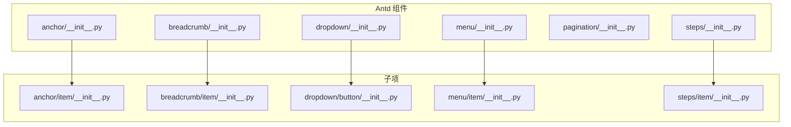
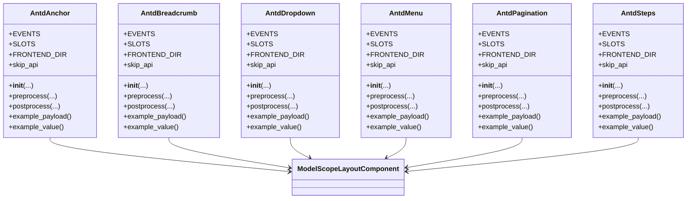
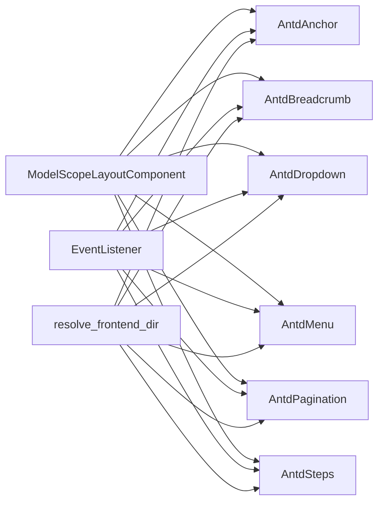

# 导航组件 API

<cite>
**本文引用的文件**
- [anchor/__init__.py](file://backend/modelscope_studio/components/antd/anchor/__init__.py)
- [anchor/item/__init__.py](file://backend/modelscope_studio/components/antd/anchor/item/__init__.py)
- [breadcrumb/__init__.py](file://backend/modelscope_studio/components/antd/breadcrumb/__init__.py)
- [breadcrumb/item/__init__.py](file://backend/modelscope_studio/components/antd/breadcrumb/item/__init__.py)
- [dropdown/__init__.py](file://backend/modelscope_studio/components/antd/dropdown/__init__.py)
- [dropdown/button/__init__.py](file://backend/modelscope_studio/components/antd/dropdown/button/__init__.py)
- [menu/__init__.py](file://backend/modelscope_studio/components/antd/menu/__init__.py)
- [menu/item/__init__.py](file://backend/modelscope_studio/components/antd/menu/item/__init__.py)
- [pagination/__init__.py](file://backend/modelscope_studio/components/antd/pagination/__init__.py)
- [steps/__init__.py](file://backend/modelscope_studio/components/antd/steps/__init__.py)
- [steps/item/__init__.py](file://backend/modelscope_studio/components/antd/steps/item/__init__.py)
</cite>

## 更新摘要

**变更内容**

- 更新Menu组件API文档，新增popupRender插槽功能说明
- 补充Menu组件popupRender参数的详细说明
- 对比Menu与Dropdown组件中popupRender功能的差异

## 目录

1. [简介](#简介)
2. [项目结构](#项目结构)
3. [核心组件](#核心组件)
4. [架构总览](#架构总览)
5. [详细组件分析](#详细组件分析)
6. [依赖分析](#依赖分析)
7. [性能考虑](#性能考虑)
8. [故障排查指南](#故障排查指南)
9. [结论](#结论)
10. [附录](#附录)

## 简介

本文件为 Ant Design 导航相关组件的 Python API 参考与使用指南，覆盖以下组件：

- Anchor（锚点）
- Breadcrumb（面包屑）
- Dropdown（下拉菜单）
- Menu（菜单）
- Pagination（分页）
- Steps（步骤条）

内容包括：类与子项类的构造参数、事件监听、插槽、状态管理要点、与路由/前端交互模式、可访问性与键盘导航建议、以及性能优化与最佳实践。

## 项目结构

导航组件均位于后端 Python 包中，采用"组件级目录 + 子项目录"的组织方式，便于扩展与维护。每个组件类负责渲染与事件绑定，子项类用于承载具体条目数据结构。

**章节来源**

- [anchor/**init**.py:1-117](file://backend/modelscope_studio/components/antd/anchor/__init__.py#L1-L117)
- [breadcrumb/**init**.py:1-73](file://backend/modelscope_studio/components/antd/breadcrumb/__init__.py#L1-L73)
- [dropdown/**init**.py:1-119](file://backend/modelscope_studio/components/antd/dropdown/__init__.py#L1-L119)
- [menu/**init**.py:1-125](file://backend/modelscope_studio/components/antd/menu/__init__.py#L1-L125)
- [pagination/**init**.py:1-107](file://backend/modelscope_studio/components/antd/pagination/__init__.py#L1-L107)
- [steps/**init**.py:1-95](file://backend/modelscope_studio/components/antd/steps/__init__.py#L1-L95)

## 核心组件

本节概述各导航组件的职责、典型用法与关键参数。

- Anchor（锚点）
  - 职责：在单页内提供锚点跳转，支持固定模式与方向设置。
  - 关键参数：affix、bounds、get_container、offset_top、direction、replace、items 等。
  - 事件：change、click、affix_change。
  - 插槽：items。
  - 使用场景：长文档目录、章节定位。

- Breadcrumb（面包屑）
  - 职责：显示当前页面在层级结构中的位置。
  - 关键参数：item_render、params、items、separator。
  - 插槽：separator、itemRender、items、dropdownIcon。
  - 使用场景：页面路径导航、层级浏览。

- Dropdown（下拉菜单）
  - 职责：点击/悬停触发的弹出式菜单。
  - 关键参数：arrow、auto_adjust_overflow、disabled、placement、trigger、menu、open 等。
  - 事件：open_change、menu_click、menu_select、menu_deselect、menu_open_change。
  - 插槽：menu.expandIcon、menu.overflowedIndicator、menu.items、dropdownRender、popupRender。
  - 使用场景：操作入口、功能集合展开。

- Menu（菜单）
  - 职责：垂直/水平/内联的导航菜单。
  - 关键参数：open_keys、selected_keys、mode、theme/theme_value、inline_indent、items、multiple、trigger_sub_menu_action、popup_render 等。
  - 事件：click、deselect、open_change、select。
  - 插槽：expandIcon、overflowedIndicator、items、popupRender。
  - 使用场景：站点主导航、侧边栏导航。

- Pagination（分页）
  - 职责：大数据集分页展示与切换。
  - 关键参数：current、default_current、page_size、default_page_size、total、pageSizeOptions、showQuickJumper、showSizeChanger、simple、size 等。
  - 事件：change、show_size_change。
  - 插槽：showQuickJumper.goButton、itemRender。
  - 使用场景：列表/表格分页。

- Steps（步骤条）
  - 职责：引导用户完成多步骤流程。
  - 关键参数：current、direction、label_placement、title_placement、percent、progress_dot、size、status、type、items。
  - 事件：change。
  - 插槽：progressDot、items。
  - 使用场景：向导、表单分步提交。

**章节来源**

- [anchor/**init**.py:11-117](file://backend/modelscope_studio/components/antd/anchor/__init__.py#L11-L117)
- [breadcrumb/**init**.py:9-73](file://backend/modelscope_studio/components/antd/breadcrumb/__init__.py#L9-L73)
- [dropdown/**init**.py:11-119](file://backend/modelscope_studio/components/antd/dropdown/__init__.py#L11-L119)
- [menu/**init**.py:12-125](file://backend/modelscope_studio/components/antd/menu/__init__.py#L12-L125)
- [pagination/**init**.py:10-107](file://backend/modelscope_studio/components/antd/pagination/__init__.py#L10-L107)
- [steps/**init**.py:11-95](file://backend/modelscope_studio/components/antd/steps/__init__.py#L11-L95)

## 架构总览

导航组件统一继承自布局组件基类，通过前端目录映射与事件绑定实现与前端的交互。组件支持额外属性传递、样式/类名注入、可见性与渲染控制等通用能力。

**图表来源**

- [anchor/**init**.py:11-117](file://backend/modelscope_studio/components/antd/anchor/__init__.py#L11-L117)
- [breadcrumb/**init**.py:9-73](file://backend/modelscope_studio/components/antd/breadcrumb/__init__.py#L9-L73)
- [dropdown/**init**.py:11-119](file://backend/modelscope_studio/components/antd/dropdown/__init__.py#L11-L119)
- [menu/**init**.py:12-125](file://backend/modelscope_studio/components/antd/menu/__init__.py#L12-L125)
- [pagination/**init**.py:10-107](file://backend/modelscope_studio/components/antd/pagination/__init__.py#L10-L107)
- [steps/**init**.py:11-95](file://backend/modelscope_studio/components/antd/steps/__init__.py#L11-L95)

## 详细组件分析

### Anchor（锚点）API

- 类：AntdAnchor
- 子项类：AntdAnchorItem
- 事件
  - change：监听锚点链接变化
  - click：处理点击事件
  - affix_change：固定状态变化回调
- 插槽
  - items：锚点条目集合
- 关键参数
  - affix：是否启用固定模式
  - bounds：锚点区域边界距离
  - get_container：滚动容器选择器
  - get_current_anchor：自定义高亮锚点
  - offset_top：计算滚动位置时的顶部偏移
  - show_ink_in_fixed：固定模式下是否显示墨水条
  - target_offset：锚点滚动偏移，默认使用 offsetTop
  - items：条目数据，支持嵌套 children
  - direction：垂直或水平方向
  - replace：替换浏览器历史而非新增
- 方法
  - preprocess(payload): 返回 None
  - postprocess(value): 返回 None
  - example_payload(): 返回 None
  - example_value(): 返回 None
- 使用示例（路径参考）
  - 页面锚点导航：[anchor/**init**.py:38-98](file://backend/modelscope_studio/components/antd/anchor/__init__.py#L38-L98)

**章节来源**

- [anchor/**init**.py:11-117](file://backend/modelscope_studio/components/antd/anchor/__init__.py#L11-L117)
- [anchor/item/**init**.py](file://backend/modelscope_studio/components/antd/anchor/item/__init__.py)

### Breadcrumb（面包屑）API

- 类：AntdBreadcrumb
- 子项类：AntdBreadcrumbItem
- 插槽
  - separator：分隔符
  - itemRender：自定义条目渲染
  - items：条目集合
  - dropdownIcon：下拉图标
- 关键参数
  - item_render：自定义条目渲染函数
  - params：渲染参数
  - items：条目数组
  - separator：分隔符字符串
- 方法
  - preprocess(payload): 返回 None
  - postprocess(value): 返回 None
  - example_payload(): 返回 None
  - example_value(): 返回 None
- 使用示例（路径参考）
  - 面包屑导航：[breadcrumb/**init**.py:20-54](file://backend/modelscope_studio/components/antd/breadcrumb/__init__.py#L20-L54)

**章节来源**

- [breadcrumb/**init**.py:9-73](file://backend/modelscope_studio/components/antd/breadcrumb/__init__.py#L9-L73)
- [breadcrumb/item/**init**.py](file://backend/modelscope_studio/components/antd/breadcrumb/item/__init__.py)

### Dropdown（下拉菜单）API

- 类：AntdDropdown
- 子项类：AntdDropdownButton
- 事件
  - open_change：下拉打开/关闭状态变化
  - menu_click：菜单项点击
  - menu_select：菜单项选中
  - menu_deselect：菜单项取消选中
  - menu_open_change：子菜单打开/关闭状态变化
- 插槽
  - menu.expandIcon：菜单展开图标
  - menu.overflowedIndicator：溢出指示器
  - menu.items：菜单项集合
  - dropdownRender：自定义下拉渲染
  - popupRender：自定义弹层渲染
- 关键参数
  - arrow：是否显示箭头
  - auto_adjust_overflow：是否自动调整溢出
  - auto_focus：是否自动聚焦
  - disabled：是否禁用
  - destroy_popup_on_hide：隐藏时销毁弹层
  - destroy_on_hidden：隐藏后销毁
  - dropdown_render：下拉渲染函数
  - popup_render：弹层渲染函数
  - get_popup_container：弹层挂载容器
  - menu：菜单配置对象
  - overlay_class_name：覆盖层类名
  - overlay_style：覆盖层样式
  - placement：弹出位置
  - trigger：触发方式（click/hover/contextMenu）
  - open：受控打开状态
  - inner_elem_style：内部元素样式
- 方法
  - preprocess(payload): 返回 None
  - postprocess(value): 返回 None
  - example_payload(): 返回 None
  - example_value(): 返回 None
- 使用示例（路径参考）
  - 下拉菜单：[dropdown/**init**.py:40-100](file://backend/modelscope_studio/components/antd/dropdown/__init__.py#L40-L100)

**章节来源**

- [dropdown/**init**.py:11-119](file://backend/modelscope_studio/components/antd/dropdown/__init__.py#L11-L119)
- [dropdown/button/**init**.py](file://backend/modelscope_studio/components/antd/dropdown/button/__init__.py)

### Menu（菜单）API

- 类：AntdMenu
- 子项类：AntdMenuItem
- 事件
  - click：菜单项点击
  - deselect：菜单项取消选中
  - open_change：子菜单打开/关闭状态变化
  - select：菜单项选中
- 插槽
  - expandIcon：展开图标
  - overflowedIndicator：溢出指示器
  - items：菜单项集合
  - popupRender：弹层渲染
- 关键参数
  - open_keys：受控打开的子菜单键
  - selected_keys：受控选中的菜单键
  - selectable：是否可选
  - default_open_keys：默认打开的子菜单键
  - default_selected_keys：默认选中的菜单键
  - expand_icon：展开图标
  - force_sub_menu_render：是否强制渲染子菜单
  - inline_collapsed：内联折叠
  - inline_indent：内联缩进像素
  - items：菜单项数组
  - mode：模式（vertical/horizontal/inline）
  - multiple：是否多选
  - overflowed_indicator：溢出指示器
  - sub_menu_close_delay：子菜单关闭延迟
  - sub_menu_open_delay：子菜单打开延迟
  - theme/theme_value：主题（light/dark），优先使用 theme_value
  - trigger_sub_menu_action：触发子菜单动作（click/hover）
  - popup_render：弹层渲染函数
- 方法
  - preprocess(payload): 返回 None
  - postprocess(value): 返回 None
  - example_payload(): 返回 None
  - example_value(): 返回 None
- 使用示例（路径参考）
  - 导航菜单：[menu/**init**.py:36-103](file://backend/modelscope_studio/components/antd/menu/__init__.py#L36-L103)

**更新** 新增popupRender参数，用于自定义菜单弹层渲染

**章节来源**

- [menu/**init**.py:12-125](file://backend/modelscope_studio/components/antd/menu/__init__.py#L12-L125)
- [menu/item/**init**.py](file://backend/modelscope_studio/components/antd/menu/item/__init__.py)

### Pagination（分页）API

- 类：AntdPagination
- 事件
  - change：页码或页大小变化
  - show_size_change：页大小改变
- 插槽
  - showQuickJumper.goButton：快速跳转按钮
  - itemRender：自定义页码渲染
- 关键参数
  - align：对齐方式（start/center/end）
  - current：当前页
  - default_current：默认当前页
  - default_page_size：默认页大小
  - page_size：当前页大小
  - disabled：是否禁用
  - hide_on_single_page：单页时隐藏
  - item_render：页码项渲染函数
  - page_size_options：页大小选项
  - responsive：响应式布局
  - show_less_items：较少页码
  - show_quick_jumper：快速跳转开关或配置
  - show_size_changer：页大小切换器开关或配置
  - show_title：是否显示标题
  - show_total：总数渲染模板
  - simple：简单模式开关或配置
  - size：尺寸（small/default）
  - total：总条目数
- 方法
  - preprocess(payload): 返回 None
  - postprocess(value): 返回 None
  - example_payload(): 返回 None
  - example_value(): 返回 None
- 使用示例（路径参考）
  - 分页控件：[pagination/**init**.py:26-88](file://backend/modelscope_studio/components/antd/pagination/__init__.py#L26-L88)

**章节来源**

- [pagination/**init**.py:10-107](file://backend/modelscope_studio/components/antd/pagination/__init__.py#L10-L107)

### Steps（步骤条）API

- 类：AntdSteps
- 子项类：AntdStepsItem
- 事件
  - change：步骤变化
- 插槽
  - progressDot：进度点渲染
  - items：步骤项集合
- 关键参数
  - current：当前步骤索引
  - direction：方向（horizontal/vertical）
  - initial：初始步骤
  - label_placement：标签放置（horizontal/vertical）
  - title_placement：标题放置
  - percent：完成百分比
  - progress_dot：是否使用点状进度
  - responsive：响应式
  - size：尺寸（small/default）
  - status：状态（wait/process/finish/error）
  - type：类型（default/navigation/inline）
  - items：步骤项数组
- 方法
  - preprocess(payload): 返回 None
  - postprocess(value): 返回 None
  - example_payload(): 返回 None
  - example_value(): 返回 None
- 使用示例（路径参考）
  - 步骤条：[steps/**init**.py:25-75](file://backend/modelscope_studio/components/antd/steps/__init__.py#L25-L75)

**章节来源**

- [steps/**init**.py:11-95](file://backend/modelscope_studio/components/antd/steps/__init__.py#L11-L95)
- [steps/item/**init**.py](file://backend/modelscope_studio/components/antd/steps/item/__init__.py)

## 依赖分析

- 组件共同依赖
  - 基类：ModelScopeLayoutComponent（统一生命周期与渲染）
  - 事件系统：gradio.events.EventListener（事件绑定）
  - 前端目录解析：resolve_frontend_dir（按组件名映射前端目录）
- 组件间耦合
  - 各组件相对独立，通过各自子项类承载条目数据，降低耦合度
  - 事件与插槽机制统一，便于扩展与复用
- 外部依赖
  - 与前端 Svelte 组件配合，通过事件绑定与 props 传递实现交互

**图表来源**

- [anchor/**init**.py:7-99](file://backend/modelscope_studio/components/antd/anchor/__init__.py#L7-L99)
- [breadcrumb/**init**.py:5-56](file://backend/modelscope_studio/components/antd/breadcrumb/__init__.py#L5-L56)
- [dropdown/**init**.py:5-102](file://backend/modelscope_studio/components/antd/dropdown/__init__.py#L5-L102)
- [menu/**init**.py:6-105](file://backend/modelscope_studio/components/antd/menu/__init__.py#L6-L105)
- [pagination/**init**.py:5-90](file://backend/modelscope_studio/components/antd/pagination/__init__.py#L5-L90)
- [steps/**init**.py:5-77](file://backend/modelscope_studio/components/antd/steps/__init__.py#L5-L77)

**章节来源**

- [anchor/**init**.py:1-117](file://backend/modelscope_studio/components/antd/anchor/__init__.py#L1-L117)
- [breadcrumb/**init**.py:1-73](file://backend/modelscope_studio/components/antd/breadcrumb/__init__.py#L1-L73)
- [dropdown/**init**.py:1-119](file://backend/modelscope_studio/components/antd/dropdown/__init__.py#L1-L119)
- [menu/**init**.py:1-125](file://backend/modelscope_studio/components/antd/menu/__init__.py#L1-L125)
- [pagination/**init**.py:1-107](file://backend/modelscope_studio/components/antd/pagination/__init__.py#L1-L107)
- [steps/**init**.py:1-95](file://backend/modelscope_studio/components/antd/steps/__init__.py#L1-L95)

## 性能考虑

- 事件绑定按需开启：仅在注册对应事件监听时才启用前端绑定，避免不必要的开销。
- 受控状态：通过 open_keys、selected_keys、current 等受控属性减少重复渲染。
- 插槽与自定义渲染：合理使用 itemRender/dropdownRender 等插槽，避免过度复杂逻辑导致的重渲染。
- 列表渲染：Pagination 与 Menu 的 items 应尽量扁平化，减少深层嵌套带来的渲染成本。
- 固定与滚动：Anchor 的 affix 与 bounds 参数应结合页面滚动性能进行调优，避免频繁重排。
- popupRender使用：Menu组件的popupRender功能应谨慎使用，避免在渲染函数中执行重型计算，影响菜单性能。

## 故障排查指南

- 事件未触发
  - 检查是否正确注册了事件监听（如 change、click、open_change 等）
  - 确认前端已启用相应事件绑定（由组件内部更新 \_internal 属性触发）
- 样式/类名不生效
  - 确认传入 class_names/styles/root_class_name 是否正确
  - 检查覆盖层样式 overlay_style/overlay_class_name 是否冲突
- 下拉菜单未显示
  - 检查 disabled、destroy_on_hidden、get_popup_container 等配置
  - 确认触发方式 trigger 与 placement 是否合适
  - 验证popupRender插槽是否正确配置
- 分页无效
  - 检查 total、page_size、current 等参数是否一致
  - 确认事件回调是否更新受控状态
- 步骤条状态异常
  - 检查 current、status、type、direction 等参数组合
  - 确认 items 结构与索引匹配
- Menu组件popupRender问题
  - 确认popupRender函数或插槽是否正确传递给前端组件
  - 检查popupRender的返回值格式是否符合Ant Design要求
  - 验证popupRender不会导致菜单渲染性能问题

**章节来源**

- [anchor/**init**.py:20-33](file://backend/modelscope_studio/components/antd/anchor/__init__.py#L20-L33)
- [dropdown/**init**.py:16-32](file://backend/modelscope_studio/components/antd/dropdown/__init__.py#L16-L32)
- [menu/**init**.py:18-31](file://backend/modelscope_studio/components/antd/menu/__init__.py#L18-L31)
- [pagination/**init**.py:14-21](file://backend/modelscope_studio/components/antd/pagination/__init__.py#L14-L21)
- [steps/**init**.py:16-20](file://backend/modelscope_studio/components/antd/steps/__init__.py#L16-L20)

## 结论

本指南系统梳理了导航组件的 API、事件、插槽与使用要点，并提供了与前端交互、状态管理、可访问性与性能优化的实践建议。建议在实际项目中结合业务场景选择合适的组件与参数组合，确保良好的用户体验与开发效率。

**更新** Menu组件新增的popupRender插槽功能为开发者提供了更灵活的菜单弹层定制能力，但使用时需要注意性能影响和兼容性要求。

## 附录

- 无障碍与键盘导航建议
  - 为可交互元素提供明确的焦点顺序与键盘操作（如 Enter/Space 触发、Esc 关闭）
  - 为菜单与下拉提供 ARIA 属性（role、aria-expanded、aria-haspopup 等）
  - 为分页与步骤条提供清晰的语义化标签与状态提示
- 路由集成
  - Anchor 与 Steps 可与前端路由联动，通过事件回调更新当前状态
  - Breadcrumb 可根据路由路径动态生成条目
  - Menu组件的popupRender可用于实现自定义的路由导航弹层
- 最佳实践
  - 将 items 数据结构化，避免在渲染函数中做重型计算
  - 合理使用受控属性，避免状态不同步
  - 在移动端适配响应式布局与触摸交互
  - 使用popupRender时，确保返回的React组件结构符合Ant Design规范
  - 避免在popupRender中执行异步操作，以免影响菜单响应性能
