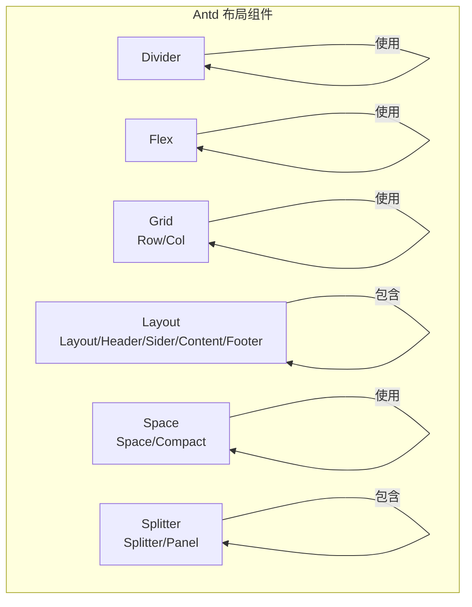
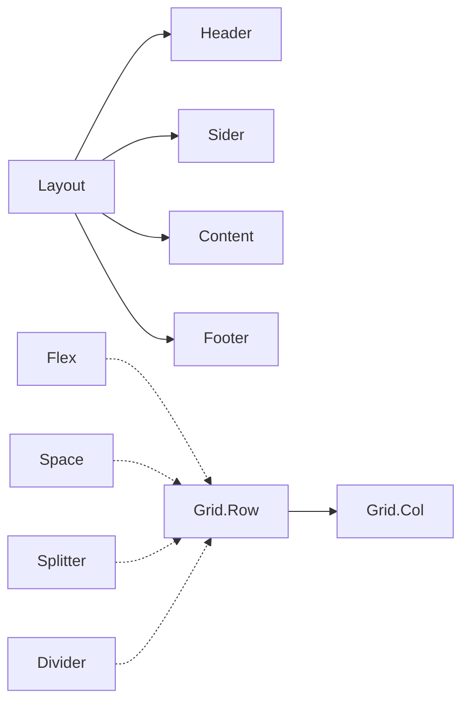

# 布局组件 API

<cite>
**本文引用的文件**
- [divider/__init__.py](file://backend/modelscope_studio/components/antd/divider/__init__.py)
- [flex/__init__.py](file://backend/modelscope_studio/components/antd/flex/__init__.py)
- [grid/row/__init__.py](file://backend/modelscope_studio/components/antd/grid/row/__init__.py)
- [grid/col/__init__.py](file://backend/modelscope_studio/components/antd/grid/col/__init__.py)
- [layout/__init__.py](file://backend/modelscope_studio/components/antd/layout/__init__.py)
- [layout/content/__init__.py](file://backend/modelscope_studio/components/antd/layout/content/__init__.py)
- [layout/footer/__init__.py](file://backend/modelscope_studio/components/antd/layout/footer/__init__.py)
- [layout/header/__init__.py](file://backend/modelscope_studio/components/antd/layout/header/__init__.py)
- [layout/sider/__init__.py](file://backend/modelscope_studio/components/antd/layout/sider/__init__.py)
- [space/__init__.py](file://backend/modelscope_studio/components/antd/space/__init__.py)
- [space/compact/__init__.py](file://backend/modelscope_studio/components/antd/space/compact/__init__.py)
- [splitter/__init__.py](file://backend/modelscope_studio/components/antd/splitter/__init__.py)
- [splitter/panel/__init__.py](file://backend/modelscope_studio/components/antd/splitter/panel/__init__.py)
</cite>

## 目录

1. [简介](#简介)
2. [项目结构](#项目结构)
3. [核心组件](#核心组件)
4. [架构总览](#架构总览)
5. [详细组件分析](#详细组件分析)
6. [依赖分析](#依赖分析)
7. [性能考虑](#性能考虑)
8. [故障排查指南](#故障排查指南)
9. [结论](#结论)
10. [附录](#附录)

## 简介

本文件为 Antd 布局组件的 Python API 参考文档，覆盖 Divider、Flex、Grid（Row/Col）、Layout（Layout/Header/Sider/Content/Footer）、Space、Splitter（Splitter/Panel）等布局相关组件。内容包括：

- 每个组件类的构造函数参数、属性定义、方法签名与返回值类型
- 标准布局组合使用示例（响应式布局、网格系统、弹性布局）
- 嵌套规则、间距控制与对齐方式
- 布局断点配置、媒体查询集成与移动端适配
- 组件协作模式与性能优化建议

## 项目结构

这些布局组件均位于后端 Python 包中，采用统一的基类与前端目录解析机制，便于在运行时映射到对应的前端实现。

**图表来源**

- [divider/**init**.py:1-95](file://backend/modelscope_studio/components/antd/divider/__init__.py#L1-L95)
- [flex/**init**.py:1-98](file://backend/modelscope_studio/components/antd/flex/__init__.py#L1-L98)
- [grid/row/**init**.py:1-94](file://backend/modelscope_studio/components/antd/grid/row/__init__.py#L1-L94)
- [grid/col/**init**.py:1-114](file://backend/modelscope_studio/components/antd/grid/col/__init__.py#L1-L114)
- [layout/**init**.py:1-91](file://backend/modelscope_studio/components/antd/layout/__init__.py#L1-L91)
- [layout/content/**init**.py:1-75](file://backend/modelscope_studio/components/antd/layout/content/__init__.py#L1-L75)
- [layout/footer/**init**.py:1-75](file://backend/modelscope_studio/components/antd/layout/footer/__init__.py#L1-L75)
- [layout/header/**init**.py:1-75](file://backend/modelscope_studio/components/antd/layout/header/__init__.py#L1-L75)
- [layout/sider/**init**.py:1-128](file://backend/modelscope_studio/components/antd/layout/sider/__init__.py#L1-L128)
- [space/**init**.py:1-104](file://backend/modelscope_studio/components/antd/space/__init__.py#L1-L104)
- [space/compact/**init**.py:1-81](file://backend/modelscope_studio/components/antd/space/compact/__init__.py#L1-L81)
- [splitter/**init**.py:1-97](file://backend/modelscope_studio/components/antd/splitter/__init__.py#L1-L97)
- [splitter/panel/**init**.py:1-86](file://backend/modelscope_studio/components/antd/splitter/panel/__init__.py#L1-L86)

**章节来源**

- [divider/**init**.py:1-95](file://backend/modelscope_studio/components/antd/divider/__init__.py#L1-L95)
- [flex/**init**.py:1-98](file://backend/modelscope_studio/components/antd/flex/__init__.py#L1-L98)
- [grid/row/**init**.py:1-94](file://backend/modelscope_studio/components/antd/grid/row/__init__.py#L1-L94)
- [grid/col/**init**.py:1-114](file://backend/modelscope_studio/components/antd/grid/col/__init__.py#L1-L114)
- [layout/**init**.py:1-91](file://backend/modelscope_studio/components/antd/layout/__init__.py#L1-L91)
- [layout/content/**init**.py:1-75](file://backend/modelscope_studio/components/antd/layout/content/__init__.py#L1-L75)
- [layout/footer/**init**.py:1-75](file://backend/modelscope_studio/components/antd/layout/footer/__init__.py#L1-L75)
- [layout/header/**init**.py:1-75](file://backend/modelscope_studio/components/antd/layout/header/__init__.py#L1-L75)
- [layout/sider/**init**.py:1-128](file://backend/modelscope_studio/components/antd/layout/sider/__init__.py#L1-L128)
- [space/**init**.py:1-104](file://backend/modelscope_studio/components/antd/space/__init__.py#L1-L104)
- [space/compact/**init**.py:1-81](file://backend/modelscope_studio/components/antd/space/compact/__init__.py#L1-L81)
- [splitter/**init**.py:1-97](file://backend/modelscope_studio/components/antd/splitter/__init__.py#L1-L97)
- [splitter/panel/**init**.py:1-86](file://backend/modelscope_studio/components/antd/splitter/panel/__init__.py#L1-L86)

## 核心组件

- Divider：用于分隔内容区域的分割线，支持水平/垂直、标题位置、虚线/实线样式、纯文本风格等。
- Flex：弹性布局容器，支持主轴/交叉轴对齐、换行、间距、方向等。
- Grid：栅格系统，Row 提供行级对齐、间距与换行，Col 提供列跨度、偏移、顺序、响应式断点等。
- Layout：页面整体布局，包含 Header、Sider、Content、Footer 子组件，支持响应式折叠与断点事件。
- Space：子元素间距设置，支持方向、对齐、自动换行、分隔符；Space.Compact 用于表单紧凑排列。
- Splitter：可拖拽分割面板，支持水平/垂直布局、面板尺寸范围、折叠与拖拽事件。

**章节来源**

- [divider/**init**.py:8-95](file://backend/modelscope_studio/components/antd/divider/__init__.py#L8-L95)
- [flex/**init**.py:8-98](file://backend/modelscope_studio/components/antd/flex/__init__.py#L8-L98)
- [grid/row/**init**.py:8-94](file://backend/modelscope_studio/components/antd/grid/row/__init__.py#L8-L94)
- [grid/col/**init**.py:8-114](file://backend/modelscope_studio/components/antd/grid/col/__init__.py#L8-L114)
- [layout/**init**.py:14-91](file://backend/modelscope_studio/components/antd/layout/__init__.py#L14-L91)
- [layout/content/**init**.py:10-75](file://backend/modelscope_studio/components/antd/layout/content/__init__.py#L10-L75)
- [layout/footer/**init**.py:10-75](file://backend/modelscope_studio/components/antd/layout/footer/__init__.py#L10-L75)
- [layout/header/**init**.py:10-75](file://backend/modelscope_studio/components/antd/layout/header/__init__.py#L10-L75)
- [layout/sider/**init**.py:11-128](file://backend/modelscope_studio/components/antd/layout/sider/__init__.py#L11-L128)
- [space/**init**.py:9-104](file://backend/modelscope_studio/components/antd/space/__init__.py#L9-L104)
- [space/compact/**init**.py:8-81](file://backend/modelscope_studio/components/antd/space/compact/__init__.py#L8-L81)
- [splitter/**init**.py:11-97](file://backend/modelscope_studio/components/antd/splitter/__init__.py#L11-L97)
- [splitter/panel/**init**.py:8-86](file://backend/modelscope_studio/components/antd/splitter/panel/__init__.py#L8-L86)

## 架构总览

以下类图展示布局组件的继承与组合关系，以及关键属性与方法。

```mermaid
classDiagram
class AntdDivider {
+__init__(value, dashed, variant, orientation, orientation_margin, plain, type, size, ...)
+preprocess(payload)
+postprocess(value)
+example_payload()
+example_value()
}
class AntdFlex {
+__init__(orientation, vertical, wrap, justify, align, flex, gap, component, ...)
+preprocess(payload)
+postprocess(value)
+example_payload()
+example_value()
}
class AntdRow {
+__init__(align, gutter, justify, wrap, ...)
}
class AntdCol {
+__init__(flex, offset, order, pull, push, span, xs, sm, md, lg, xl, xxl, ...)
}
class AntdLayout {
+__init__(has_sider, ...)
+Content
+Footer
+Header
+Sider
}
class AntdLayoutContent
class AntdLayoutFooter
class AntdLayoutHeader
class AntdLayoutSider {
+__init__(breakpoint, collapsed, collapsed_width, collapsible, default_collapsed, reverse_arrow, theme_value, trigger, width, ...)
}
class AntdSpace {
+__init__(align, direction/orientation, size, split/separator, wrap, ...)
+Compact
}
class AntdSpaceCompact {
+__init__(block, direction, size, ...)
}
class AntdSplitter {
+__init__(layout/orientation, lazy, ...)
+Panel
}
class AntdSplitterPanel {
+__init__(default_size, min, max, size, collapsible, resizable, ...)
}
AntdLayout --> AntdLayoutContent : "包含"
AntdLayout --> AntdLayoutFooter : "包含"
AntdLayout --> AntdLayoutHeader : "包含"
AntdLayout --> AntdLayoutSider : "包含"
AntdSpace --> AntdSpaceCompact : "包含"
AntdSplitter --> AntdSplitterPanel : "包含"
```

**图表来源**

- [divider/**init**.py:8-95](file://backend/modelscope_studio/components/antd/divider/__init__.py#L8-L95)
- [flex/**init**.py:8-98](file://backend/modelscope_studio/components/antd/flex/__init__.py#L8-L98)
- [grid/row/**init**.py:8-94](file://backend/modelscope_studio/components/antd/grid/row/__init__.py#L8-L94)
- [grid/col/**init**.py:8-114](file://backend/modelscope_studio/components/antd/grid/col/__init__.py#L8-L114)
- [layout/**init**.py:14-91](file://backend/modelscope_studio/components/antd/layout/__init__.py#L14-L91)
- [layout/content/**init**.py:10-75](file://backend/modelscope_studio/components/antd/layout/content/__init__.py#L10-L75)
- [layout/footer/**init**.py:10-75](file://backend/modelscope_studio/components/antd/layout/footer/__init__.py#L10-L75)
- [layout/header/**init**.py:10-75](file://backend/modelscope_studio/components/antd/layout/header/__init__.py#L10-L75)
- [layout/sider/**init**.py:11-128](file://backend/modelscope_studio/components/antd/layout/sider/__init__.py#L11-L128)
- [space/**init**.py:9-104](file://backend/modelscope_studio/components/antd/space/__init__.py#L9-L104)
- [space/compact/**init**.py:8-81](file://backend/modelscope_studio/components/antd/space/compact/__init__.py#L8-L81)
- [splitter/**init**.py:11-97](file://backend/modelscope_studio/components/antd/splitter/__init__.py#L11-L97)
- [splitter/panel/**init**.py:8-86](file://backend/modelscope_studio/components/antd/splitter/panel/__init__.py#L8-L86)

## 详细组件分析

### Divider（分割线）

- 构造函数参数
  - value：可选字符串，作为分割线内的标题文本
  - dashed：可选布尔，是否为虚线
  - variant：枚举值，'dashed' | 'dotted' | 'solid'
  - orientation：枚举值，'left' | 'right' | 'center' | 'start' | 'end'
  - orientation_margin：可选字符串或数值，标题与边界的边距
  - plain：可选布尔，纯文本风格
  - type：枚举值，'horizontal' | 'vertical'
  - size：可选枚举值，'small' | 'middle' | 'large'（仅水平有效）
  - 其他通用属性：root_class_name、class_names、styles、as_item、elem_id、elem_classes、elem_style、visible、render 等
- 方法
  - preprocess(payload): 接收字符串或 None，返回字符串或 None
  - postprocess(value): 接收字符串或 None，返回字符串或 None
  - example_payload/example_value: 返回 None
- 使用场景
  - 文章段落分隔、表格操作列分隔等

**章节来源**

- [divider/**init**.py:21-95](file://backend/modelscope_studio/components/antd/divider/__init__.py#L21-L95)

### Flex（弹性布局）

- 构造函数参数
  - orientation：枚举值，'horizontal' | 'vertical'
  - vertical：布尔，垂直方向（等价于 flex-direction: column）
  - wrap：枚举值或布尔，'nowrap' | 'wrap' | 'wrap-reverse' 或布尔
  - justify：主轴对齐方式（多种取值）
  - align：交叉轴对齐方式（多种取值）
  - flex：flex 简写属性
  - gap：间距大小，支持枚举或数值
  - component：自定义元素类型
  - 其他通用属性同上
- 方法
  - preprocess/postprocess：接收/返回 None
  - example_payload/example_value：返回 None
- 使用场景
  - 设置元素间距、对齐方式，替代传统 CSS 的 flex 布局

**章节来源**

- [flex/**init**.py:21-98](file://backend/modelscope_studio/components/antd/flex/__init__.py#L21-L98)

### Grid（栅格系统）

- Row（行）
  - 构造函数参数
    - align：垂直对齐，'top' | 'middle' | 'bottom' | 'stretch' 或对象
    - gutter：网格间距，支持数值、字符串、对象或数组
    - justify：水平排列，多种取值
    - wrap：布尔，自动换行
    - 其他通用属性同上
  - 方法
    - preprocess/postprocess：接收/返回 None
    - example_payload/example_value：返回 None
- Col（列）
  - 构造函数参数
    - flex：flex 布局样式
    - offset：向右偏移的栅格数
    - order：排序
    - pull/push：左右移动
    - span：占用栅格数（0 对应 display: none）
    - xs/sm/md/lg/xl/xxl：不同断点下的 span 或包含上述属性的对象
    - 其他通用属性同上
  - 方法
    - preprocess/postprocess：接收/返回 None
    - example_payload/example_value：返回 None
- 使用场景
  - 基于 24 栅格的响应式布局，支持横向/纵向对齐、间距与断点

**章节来源**

- [grid/row/**init**.py:30-94](file://backend/modelscope_studio/components/antd/grid/row/__init__.py#L30-L94)
- [grid/col/**init**.py:30-114](file://backend/modelscope_studio/components/antd/grid/col/__init__.py#L30-L114)

### Layout（页面布局）

- Layout
  - 内嵌子组件：Content、Footer、Header、Sider
  - 构造函数参数
    - has_sider：是否包含侧边栏（SSR 避免闪烁）
    - 其他通用属性同上
  - 方法
    - preprocess/postprocess：接收/返回 None
    - example_payload/example_value：返回 None
- Header/Footer/Content
  - 构造函数参数：class_names、styles、additional_props、root_class_name、elem_id、elem_classes、elem_style、visible、render 等
  - 方法：同上
- Sider
  - 构造函数参数
    - breakpoint：响应式断点
    - collapsed/collapsible/default_collapsed：折叠状态相关
    - collapsed_width：折叠后的宽度
    - reverse_arrow：箭头方向反转（右侧展开）
    - theme_value：主题（light/dark），与 Gradio 预设冲突时使用
    - trigger：自定义触发器
    - width：宽度
    - zero_width_trigger_style：collapsed_width 为 0 时的特殊触发器样式
    - 其他通用属性同上
  - 方法：同上
- 事件
  - Layout/Sider/Header/Footer Content：支持 click 事件绑定
  - Sider：支持 collapse、breakpoint 事件
- 使用场景
  - 页面整体布局，配合 Sider 实现侧边导航与响应式折叠

**章节来源**

- [layout/**init**.py:14-91](file://backend/modelscope_studio/components/antd/layout/__init__.py#L14-L91)
- [layout/content/**init**.py:10-75](file://backend/modelscope_studio/components/antd/layout/content/__init__.py#L10-L75)
- [layout/footer/**init**.py:10-75](file://backend/modelscope_studio/components/antd/layout/footer/__init__.py#L10-L75)
- [layout/header/**init**.py:10-75](file://backend/modelscope_studio/components/antd/layout/header/__init__.py#L10-L75)
- [layout/sider/**init**.py:11-128](file://backend/modelscope_studio/components/antd/layout/sider/__init__.py#L11-L128)

### Space（间距）

- Space
  - 内嵌子组件：Compact
  - 构造函数参数
    - align：子项对齐
    - direction/orientation：方向（orientation 为 v6 别名）
    - size：间距大小，支持枚举、数值或数组
    - split/separator：分隔符（separator 为 v6 别名）
    - wrap：水平时自动换行
    - 其他通用属性同上
  - 方法
    - preprocess/postprocess：接收/返回 None
    - example_payload/example_value：返回 None
- Space.Compact
  - 构造函数参数
    - block：是否占满父宽度
    - direction：方向
    - size：子组件尺寸
    - 其他通用属性同上
  - 方法：同上
- 使用场景
  - 多个内联元素的等间距排列；表单紧凑连接时使用 Compact

**章节来源**

- [space/**init**.py:9-104](file://backend/modelscope_studio/components/antd/space/__init__.py#L9-L104)
- [space/compact/**init**.py:8-81](file://backend/modelscope_studio/components/antd/space/compact/__init__.py#L8-L81)

### Splitter（分割面板）

- Splitter
  - 内嵌子组件：Panel
  - 构造函数参数
    - layout/orientation：布局方向（orientation 为 v6 别名）
    - lazy：是否延迟渲染
    - 其他通用属性同上
  - 事件
    - resize_start、resize、resize_end、collapse
  - 方法
    - preprocess/postprocess：接收/返回 None
    - example_payload/example_value：返回 None
- Splitter.Panel
  - 构造函数参数
    - default_size/min/max/size：初始/最小/最大/受控尺寸（支持 px 或百分比）
    - collapsible：快速折叠
    - resizable：是否启用拖拽
    - 其他通用属性同上
  - 方法：同上
- 使用场景
  - 将页面划分为多个可拖拽调整大小的区域，支持折叠与范围限制

**章节来源**

- [splitter/**init**.py:11-97](file://backend/modelscope_studio/components/antd/splitter/__init__.py#L11-L97)
- [splitter/panel/**init**.py:8-86](file://backend/modelscope_studio/components/antd/splitter/panel/__init__.py#L8-L86)

## 依赖分析

- 组件共同点
  - 均继承自统一的布局组件基类，具备相同的预处理/后处理接口与通用属性（如 visible、elem_id、elem_classes、elem_style、render 等）
  - 通过前端目录解析函数定位对应前端组件实现
- 组件间耦合
  - Layout 作为根容器，内部组合 Header/Sider/Content/Footer
  - Space 与 Flex 在语义上互补：Space 更关注“间距”，Flex 更关注“布局”
  - Grid 的 Row/Col 与 Flex/Splitter 可组合使用以实现复杂布局
  - Splitter 与 Space/Divider 可配合实现面板间分隔与间距控制

**图表来源**

- [layout/**init**.py:28-31](file://backend/modelscope_studio/components/antd/layout/__init__.py#L28-L31)
- [grid/row/**init**.py:1-94](file://backend/modelscope_studio/components/antd/grid/row/__init__.py#L1-L94)
- [grid/col/**init**.py:1-114](file://backend/modelscope_studio/components/antd/grid/col/__init__.py#L1-L114)
- [flex/**init**.py:1-98](file://backend/modelscope_studio/components/antd/flex/__init__.py#L1-L98)
- [space/**init**.py:1-104](file://backend/modelscope_studio/components/antd/space/__init__.py#L1-L104)
- [splitter/**init**.py:1-97](file://backend/modelscope_studio/components/antd/splitter/__init__.py#L1-L97)
- [divider/**init**.py:1-95](file://backend/modelscope_studio/components/antd/divider/__init__.py#L1-L95)

**章节来源**

- [layout/**init**.py:14-91](file://backend/modelscope_studio/components/antd/layout/__init__.py#L14-L91)
- [grid/row/**init**.py:8-94](file://backend/modelscope_studio/components/antd/grid/row/__init__.py#L8-L94)
- [grid/col/**init**.py:8-114](file://backend/modelscope_studio/components/antd/grid/col/__init__.py#L8-L114)
- [flex/**init**.py:8-98](file://backend/modelscope_studio/components/antd/flex/__init__.py#L8-L98)
- [space/**init**.py:9-104](file://backend/modelscope_studio/components/antd/space/__init__.py#L9-L104)
- [splitter/**init**.py:11-97](file://backend/modelscope_studio/components/antd/splitter/__init__.py#L11-L97)
- [divider/**init**.py:8-95](file://backend/modelscope_studio/components/antd/divider/__init__.py#L8-L95)

## 性能考虑

- 合理使用懒加载与延迟渲染：Splitter 支持 lazy，避免不必要的面板初始化
- 控制事件绑定数量：Layout/Sider 的事件回调需按需开启，减少不必要的 DOM 更新
- 栅格与弹性布局选择：大量内联元素间距优先 Space，块级布局优先 Flex，避免重复包装
- 响应式断点：Grid 的 xs/sm/md/lg/xl/xxl 应按实际设备分布配置，避免过度细分导致计算开销
- SSR 优化：Layout 的 has_sider 可在服务端渲染时避免闪烁

## 故障排查指南

- 主题冲突提示：Sider 的 theme 与 Gradio 预设属性冲突，应使用 theme_value 替代
- 事件未生效：确认已正确绑定事件监听器（如 click、collapse、breakpoint），并在前端侧启用相应回调
- 栅格溢出：Row 中 Col 的 span 之和超过 24 时会换行，检查断点配置与布局逻辑
- 分割面板异常：确保面板尺寸单位一致（px 或百分比），并设置合理的 min/max

**章节来源**

- [layout/sider/**init**.py:101-104](file://backend/modelscope_studio/components/antd/layout/sider/__init__.py#L101-L104)

## 结论

本参考文档梳理了 Antd 布局组件的 Python API，明确了各组件的构造参数、方法与典型用法，并提供了组合使用建议与性能优化策略。通过 Layout、Grid、Flex、Space、Splitter、Divider 的协同，可构建从基础栅格到复杂交互的多样化布局方案。

## 附录

### 常见布局组合示例（概念性说明）

- 响应式布局
  - 使用 Layout + Sider，在不同断点下折叠/展开；Sider 支持 breakpoint 与 collapse 事件
  - Grid 的 xs/sm/md/lg/xl/xxl 断点配置实现多端自适应
- 网格系统
  - Row 提供 gutter、justify、align、wrap；Col 提供 span、offset、order、pull/push、响应式断点
- 弹性布局
  - Flex 提供 orientation/vertical、wrap、justify、align、gap、flex 等，适合灵活对齐与间距控制
- 间距与分隔
  - Space 用于内联元素间距；Space.Compact 用于表单紧凑排列；Divider 用于内容分隔

### 断点与媒体查询

- 断点常量：xs（<576px）、sm（≥576px）、md（≥768px）、lg（≥992px）、xl（≥1200px）、xxl（≥1600px）
- 媒体查询集成：通过 Grid 的 xs/sm/md/lg/xl/xxl 参数映射到不同屏幕尺寸的布局行为

### 嵌套规则与最佳实践

- Layout 必须包含 Header/Sider/Content/Footer 中的若干子组件，且子组件必须置于 Layout 内
- Grid 的 Col 必须直接置于 Row 内，内容元素置于 Col 内
- Flex 不添加额外包装，适合块级布局；Space 为每个子元素添加包装以实现内联对齐
- Splitter 的 Panel 之间通过拖拽调整大小，建议设置 min/max 与 collapsible 以提升可用性
