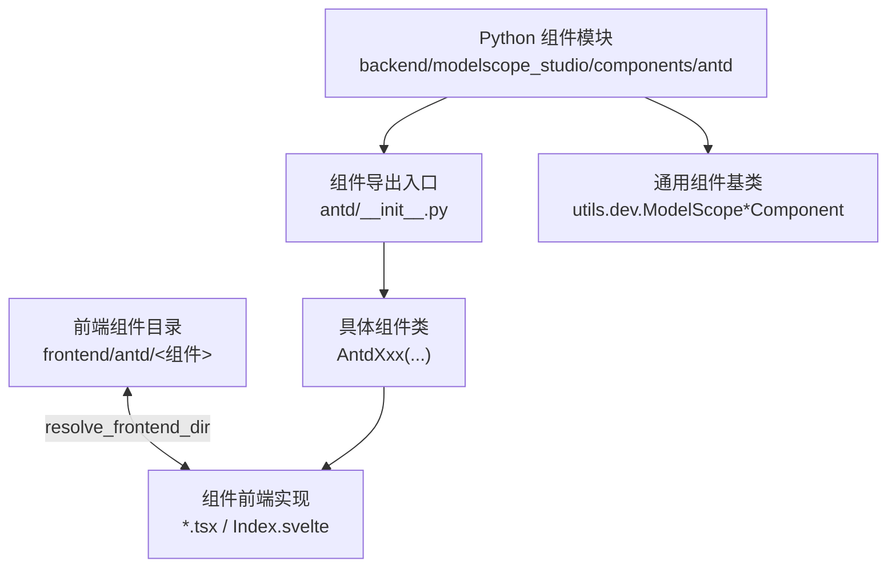
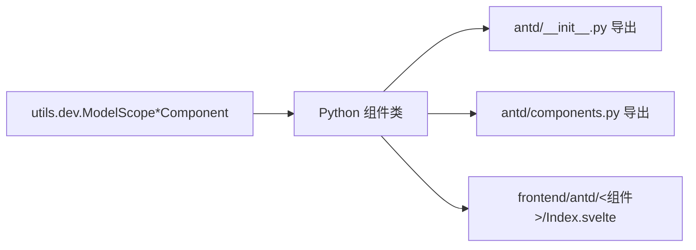

# 数据展示组件 API

<cite>
**本文引用的文件**
- [backend/modelscope_studio/components/antd/__init__.py](file://backend/modelscope_studio/components/antd/__init__.py)
- [backend/modelscope_studio/components/antd/components.py](file://backend/modelscope_studio/components/antd/components.py)
- [backend/modelscope_studio/components/antd/avatar/__init__.py](file://backend/modelscope_studio/components/antd/avatar/__init__.py)
- [backend/modelscope_studio/components/antd/badge/__init__.py](file://backend/modelscope_studio/components/antd/badge/__init__.py)
- [backend/modelscope_studio/components/antd/calendar/__init__.py](file://backend/modelscope_studio/components/antd/calendar/__init__.py)
- [backend/modelscope_studio/components/antd/card/__init__.py](file://backend/modelscope_studio/components/antd/card/__init__.py)
- [backend/modelscope_studio/components/antd/carousel/__init__.py](file://backend/modelscope_studio/components/antd/carousel/__init__.py)
- [backend/modelscope_studio/components/antd/collapse/__init__.py](file://backend/modelscope_studio/components/antd/collapse/__init__.py)
- [backend/modelscope_studio/components/antd/descriptions/__init__.py](file://backend/modelscope_studio/components/antd/descriptions/__init__.py)
- [backend/modelscope_studio/components/antd/empty/__init__.py](file://backend/modelscope_studio/components/antd/empty/__init__.py)
- [backend/modelscope_studio/components/antd/image/__init__.py](file://backend/modelscope_studio/components/antd/image/__init__.py)
- [backend/modelscope_studio/components/antd/list/__init__.py](file://backend/modelscope_studio/components/antd/list/__init__.py)
- [backend/modelscope_studio/components/antd/popover/__init__.py](file://backend/modelscope_studio/components/antd/popover/__init__.py)
- [backend/modelscope_studio/components/antd/qr_code/__init__.py](file://backend/modelscope_studio/components/antd/qr_code/__init__.py)
- [backend/modelscope_studio/components/antd/segmented/__init__.py](file://backend/modelscope_studio/components/antd/segmented/__init__.py)
- [backend/modelscope_studio/components/antd/statistic/__init__.py](file://backend/modelscope_studio/components/antd/statistic/__init__.py)
- [backend/modelscope_studio/components/antd/table/__init__.py](file://backend/modelscope_studio/components/antd/table/__init__.py)
- [backend/modelscope_studio/components/antd/tabs/__init__.py](file://backend/modelscope_studio/components/antd/tabs/__init__.py)
- [backend/modelscope_studio/components/antd/tag/__init__.py](file://backend/modelscope_studio/components/antd/tag/__init__.py)
- [backend/modelscope_studio/components/antd/tag/checkable_tag/__init__.py](file://backend/modelscope_studio/components/antd/tag/checkable_tag/__init__.py)
- [backend/modelscope_studio/components/antd/tag/checkable_tag_group/__init__.py](file://backend/modelscope_studio/components/antd/tag/checkable_tag_group/__init__.py)
- [backend/modelscope_studio/components/antd/timeline/__init__.py](file://backend/modelscope_studio/components/antd/timeline/__init__.py)
- [backend/modelscope_studio/components/antd/tooltip/__init__.py](file://backend/modelscope_studio/components/antd/tooltip/__init__.py)
- [backend/modelscope_studio/components/antd/tour/__init__.py](file://backend/modelscope_studio/components/antd/tour/__init__.py)
- [backend/modelscope_studio/components/antd/tree/__init__.py](file://backend/modelscope_studio/components/antd/tree/__init__.py)
- [frontend/antd/timeline/timeline.tsx](file://frontend/antd/timeline/timeline.tsx)
- [frontend/antd/tag/checkable-tag-group/tag.checkable-tag-group.tsx](file://frontend/antd/tag/checkable-tag-group/tag.checkable-tag-group.tsx)
- [frontend/antd/tag/checkable-tag/Index.svelte](file://frontend/antd/tag/checkable-tag/Index.svelte)
- [frontend/antd/tag/tag.tsx](file://frontend/antd/tag/tag.tsx)
</cite>

## 更新摘要

**所做更改**

- 新增 Timeline 时间轴组件的完整 API 说明，包含最新功能特性
- 新增可勾选标签组组件的详细文档，包括 CheckableTag 和 CheckableTagGroup
- 更新 Tag 组件文档，补充可勾选标签相关功能
- 完善组件间的关联关系和使用场景说明

## 目录

1. [简介](#简介)
2. [项目结构](#项目结构)
3. [核心组件](#核心组件)
4. [架构总览](#架构总览)
5. [详细组件分析](#详细组件分析)
6. [依赖分析](#依赖分析)
7. [性能考虑](#性能考虑)
8. [故障排查指南](#故障排查指南)
9. [结论](#结论)
10. [附录](#附录)

## 简介

本文件为 Antd 数据展示类组件的 Python API 参考与实践指南，覆盖 Avatar、Badge、Calendar、Card、Carousel、Collapse、Descriptions、Empty、Image、List、Popover、QRCode、Segmented、Statistic、Table、Tabs、Tag、Timeline、Tooltip、Tour、Tree 等组件。内容包括：

- 构造函数参数、事件绑定、插槽（slots）与渲染行为
- 预处理与后处理（preprocess/postprocess）流程
- 使用示例路径与常见场景
- 渲染优化、懒加载与响应式设计建议
- 数据格式化、国际化与主题定制思路
- 用户体验与可访问性最佳实践

## 项目结构

Antd 组件在后端以 Python 类的形式封装，统一继承自通用组件基类，并通过前端目录映射到对应的 Svelte 实现。组件导出入口集中于 antd/**init**.py 与 antd/components.py。

**图表来源**

- [backend/modelscope_studio/components/antd/**init**.py:1-151](file://backend/modelscope_studio/components/antd/__init__.py#L1-L151)
- [backend/modelscope_studio/components/antd/components.py:1-145](file://backend/modelscope_studio/components/antd/components.py#L1-L145)

**章节来源**

- [backend/modelscope_studio/components/antd/**init**.py:1-151](file://backend/modelscope_studio/components/antd/__init__.py#L1-L151)
- [backend/modelscope_studio/components/antd/components.py:1-145](file://backend/modelscope_studio/components/antd/components.py#L1-L145)

## 核心组件

以下为本次文档聚焦的数据展示类组件清单与共性特征：

- 统一继承：多数组件继承自 ModelScopeLayoutComponent 或 ModelScopeComponent；部分数据型组件继承自 ModelScopeDataLayoutComponent（如 Avatar、Image）
- 事件系统：通过 EVENTS 列表注册前端事件回调，绑定到内部 \_internal.update
- 插槽系统：通过 SLOTS 定义可用插槽名称，用于传递模板片段或渲染函数
- 前端目录：通过 resolve_frontend_dir("组件名") 指向前端组件目录
- 预处理/后处理：根据组件类型实现 preprocess 与 postprocess，处理字符串、文件路径、Gradio FileData 等输入输出

**章节来源**

- [backend/modelscope_studio/components/antd/avatar/**init**.py:18-114](file://backend/modelscope_studio/components/antd/avatar/__init__.py#L18-L114)
- [backend/modelscope_studio/components/antd/image/**init**.py:18-120](file://backend/modelscope_studio/components/antd/image/__init__.py#L18-L120)
- [backend/modelscope_studio/components/antd/calendar/**init**.py:11-102](file://backend/modelscope_studio/components/antd/calendar/__init__.py#L11-L102)
- [backend/modelscope_studio/components/antd/card/**init**.py:12-149](file://backend/modelscope_studio/components/antd/card/__init__.py#L12-L149)
- [backend/modelscope_studio/components/antd/carousel/**init**.py:8-95](file://backend/modelscope_studio/components/antd/carousel/__init__.py#L8-L95)
- [backend/modelscope_studio/components/antd/collapse/**init**.py:11-99](file://backend/modelscope_studio/components/antd/collapse/__init__.py#L11-L99)
- [backend/modelscope_studio/components/antd/descriptions/**init**.py:9-86](file://backend/modelscope_studio/components/antd/descriptions/__init__.py#L9-L86)
- [backend/modelscope_studio/components/antd/empty/**init**.py:8-71](file://backend/modelscope_studio/components/antd/empty/__init__.py#L8-L71)
- [backend/modelscope_studio/components/antd/list/**init**.py:11-101](file://backend/modelscope_studio/components/antd/list/__init__.py#L11-L101)
- [backend/modelscope_studio/components/antd/popover/**init**.py:10-124](file://backend/modelscope_studio/components/antd/popover/__init__.py#L10-L124)
- [backend/modelscope_studio/components/antd/qr_code/**init**.py:10-96](file://backend/modelscope_studio/components/antd/qr_code/__init__.py#L10-L96)
- [backend/modelscope_studio/components/antd/tabs/**init**.py:1-145](file://backend/modelscope_studio/components/antd/tabs/__init__.py#L1-L145)
- [backend/modelscope_studio/components/antd/timeline/**init**.py:1-81](file://backend/modelscope_studio/components/antd/timeline/__init__.py#L1-L81)
- [backend/modelscope_studio/components/antd/tooltip/**init**.py:1-145](file://backend/modelscope_studio/components/antd/tooltip/__init__.py#L1-L145)
- [backend/modelscope_studio/components/antd/tour/**init**.py:1-145](file://backend/modelscope_studio/components/antd/tour/__init__.py#L1-L145)
- [backend/modelscope_studio/components/antd/tree/**init**.py:1-145](file://backend/modelscope_studio/components/antd/tree/__init__.py#L1-L145)

## 架构总览

下图展示了数据展示组件在 Python 层的类关系与事件绑定方式：

```mermaid
classDiagram
class ModelScopeLayoutComponent
class ModelScopeComponent
class ModelScopeDataLayoutComponent
class AntdAvatar {
+EVENTS
+SLOTS
+FRONTEND_DIR
+preprocess()
+postprocess()
}
class AntdImage {
+EVENTS
+SLOTS
+FRONTEND_DIR
+preprocess()
+postprocess()
}
class AntdCalendar {
+EVENTS
+SLOTS
+FRONTEND_DIR
+api_info()
}
class AntdCard {
+EVENTS
+SLOTS
+FRONTEND_DIR
}
class AntdCarousel {
+EVENTS
+FRONTEND_DIR
}
class AntdCollapse {
+EVENTS
+SLOTS
+FRONTEND_DIR
}
class AntdDescriptions {
+EVENTS
+SLOTS
+FRONTEND_DIR
}
class AntdEmpty {
+EVENTS
+SLOTS
+FRONTEND_DIR
}
class AntdList {
+EVENTS
+SLOTS
+FRONTEND_DIR
}
class AntdPopover {
+EVENTS
+SLOTS
+FRONTEND_DIR
}
class AntdQRCode {
+EVENTS
+SLOTS
+FRONTEND_DIR
}
class AntdTag {
+EVENTS
+SLOTS
+FRONTEND_DIR
}
class AntdTagCheckableTag {
+EVENTS
+SLOTS
+FRONTEND_DIR
+api_info()
}
class AntdTagCheckableTagGroup {
+EVENTS
+SLOTS
+FRONTEND_DIR
+api_info()
}
class AntdTimeline {
+EVENTS
+SLOTS
+FRONTEND_DIR
}
ModelScopeDataLayoutComponent <|-- AntdAvatar
ModelScopeDataLayoutComponent <|-- AntdImage
ModelScopeLayoutComponent <|-- AntdCard
ModelScopeLayoutComponent <|-- AntdCarousel
ModelScopeLayoutComponent <|-- AntdCollapse
ModelScopeLayoutComponent <|-- AntdDescriptions
ModelScopeLayoutComponent <|-- AntdEmpty
ModelScopeLayoutComponent <|-- AntdList
ModelScopeLayoutComponent <|-- AntdPopover
ModelScopeComponent <|-- AntdCalendar
ModelScopeComponent <|-- AntdQRCode
ModelScopeLayoutComponent <|-- AntdTag
ModelScopeDataLayoutComponent <|-- AntdTagCheckableTag
ModelScopeDataLayoutComponent <|-- AntdTagCheckableTagGroup
ModelScopeLayoutComponent <|-- AntdTimeline
```

**图表来源**

- [backend/modelscope_studio/components/antd/avatar/**init**.py:18-114](file://backend/modelscope_studio/components/antd/avatar/__init__.py#L18-L114)
- [backend/modelscope_studio/components/antd/image/**init**.py:18-120](file://backend/modelscope_studio/components/antd/image/__init__.py#L18-L120)
- [backend/modelscope_studio/components/antd/calendar/**init**.py:11-102](file://backend/modelscope_studio/components/antd/calendar/__init__.py#L11-L102)
- [backend/modelscope_studio/components/antd/card/**init**.py:12-149](file://backend/modelscope_studio/components/antd/card/__init__.py#L12-L149)
- [backend/modelscope_studio/components/antd/carousel/**init**.py:8-95](file://backend/modelscope_studio/components/antd/carousel/__init__.py#L8-L95)
- [backend/modelscope_studio/components/antd/collapse/**init**.py:11-99](file://backend/modelscope_studio/components/antd/collapse/__init__.py#L11-L99)
- [backend/modelscope_studio/components/antd/descriptions/**init**.py:9-86](file://backend/modelscope_studio/components/antd/descriptions/__init__.py#L9-L86)
- [backend/modelscope_studio/components/antd/empty/**init**.py:8-71](file://backend/modelscope_studio/components/antd/empty/__init__.py#L8-L71)
- [backend/modelscope_studio/components/antd/list/**init**.py:11-101](file://backend/modelscope_studio/components/antd/list/__init__.py#L11-L101)
- [backend/modelscope_studio/components/antd/popover/**init**.py:10-124](file://backend/modelscope_studio/components/antd/popover/__init__.py#L10-L124)
- [backend/modelscope_studio/components/antd/qr_code/**init**.py:10-96](file://backend/modelscope_studio/components/antd/qr_code/__init__.py#L10-L96)
- [backend/modelscope_studio/components/antd/tag/**init**.py:12-88](file://backend/modelscope_studio/components/antd/tag/__init__.py#L12-L88)
- [backend/modelscope_studio/components/antd/tag/checkable_tag/**init**.py:11-85](file://backend/modelscope_studio/components/antd/tag/checkable_tag/__init__.py#L11-L85)
- [backend/modelscope_studio/components/antd/tag/checkable_tag_group/**init**.py:12-102](file://backend/modelscope_studio/components/antd/tag/checkable_tag_group/__init__.py#L12-L102)
- [backend/modelscope_studio/components/antd/timeline/**init**.py:9-81](file://backend/modelscope_studio/components/antd/timeline/__init__.py#L9-L81)

## 详细组件分析

### Avatar 头像

- 功能定位：头像展示，支持图标、占位与错误处理事件
- 关键点
  - 支持插槽：icon、src
  - 事件：error
  - 数据模型：AntdAvatarData（root 支持 FileData 或 str）
  - 预处理/后处理：将 FileData 转换为路径或封装为 FileData
- 参数要点（节选）
  - value、alt、gap、icon、shape、size、src_set、draggable、cross_origin、class_names、styles、root_class_name
- 使用示例路径
  - [示例：头像与错误处理:18-114](file://backend/modelscope_studio/components/antd/avatar/__init__.py#L18-L114)

**章节来源**

- [backend/modelscope_studio/components/antd/avatar/**init**.py:18-114](file://backend/modelscope_studio/components/antd/avatar/__init__.py#L18-L114)

### Badge 徽标数

- 功能定位：信息标记，支持小红点、计数、状态等
- 关键点
  - 插槽：count、text
  - 参数：count、dot、overflow_count、show_zero、size、status、text、title、颜色等
- 使用示例路径
  - [示例：徽标与状态:9-87](file://backend/modelscope_studio/components/antd/badge/__init__.py#L9-87)

**章节来源**

- [backend/modelscope_studio/components/antd/badge/**init**.py:9-87](file://backend/modelscope_studio/components/antd/badge/__init__.py#L9-L87)

### Calendar 日历

- 功能定位：日期选择与面板切换
- 关键点
  - 事件：change、panel_change、select
  - 插槽：cellRender、fullCellRender、headerRender
  - API：api_info 返回 number|string 的联合类型
- 使用示例路径
  - [示例：日历事件与渲染钩子:11-102](file://backend/modelscope_studio/components/antd/calendar/__init__.py#L11-L102)

**章节来源**

- [backend/modelscope_studio/components/antd/calendar/**init**.py:11-102](file://backend/modelscope_studio/components/antd/calendar/__init__.py#L11-L102)

### Card 卡片

- 功能定位：信息容器，支持标题、额外内容、封面、动作区、标签页等
- 关键点
  - 子组件：Grid、Meta
  - 事件：click、tab_change
  - 插槽：actions、cover、extra、tabBarExtraContent、title、tabList、tabProps.\* 等
  - 生命周期：**exit** 中检测是否包含 Grid
- 使用示例路径
  - [示例：卡片布局与标签页:12-149](file://backend/modelscope_studio/components/antd/card/__init__.py#L12-L149)

**章节来源**

- [backend/modelscope_studio/components/antd/card/**init**.py:12-149](file://backend/modelscope_studio/components/antd/card/__init__.py#L12-L149)

### Carousel 走马灯

- 功能定位：轮播图容器
- 关键点
  - 参数：arrows、autoplay、autoplay_speed、adaptive_height、dot_position、dots、draggable、fade、infinite、speed、effect、after_change、before_change、wait_for_animate
- 使用示例路径
  - [示例：轮播配置:8-95](file://backend/modelscope_studio/components/antd/carousel/__init__.py#L8-L95)

**章节来源**

- [backend/modelscope_studio/components/antd/carousel/**init**.py:8-95](file://backend/modelscope_studio/components/antd/carousel/__init__.py#L8-L95)

### Collapse 折叠面板

- 功能定位：内容折叠/展开
- 关键点
  - 子组件：Item
  - 事件：change
  - 插槽：expandIcon、items
  - 参数：accordion、active_key、bordered、collapsible、default_active_key、destroy_on_hidden、destroy_inactive_panel、expand_icon、ghost、items、size
- 使用示例路径
  - [示例：折叠面板与项:11-99](file://backend/modelscope_studio/components/antd/collapse/__init__.py#L11-L99)

**章节来源**

- [backend/modelscope_studio/components/antd/collapse/**init**.py:11-99](file://backend/modelscope_studio/components/antd/collapse/__init__.py#L11-L99)

### Descriptions 描述列表

- 功能定位：键值对描述展示
- 关键点
  - 子组件：Item
  - 插槽：extra、title、items
  - 参数：bordered、colon、column、content_style、layout、size、title、items、label_style
- 使用示例路径
  - [示例：描述列表与项:9-86](file://backend/modelscope_studio/components/antd/descriptions/__init__.py#L9-86)

**章节来源**

- [backend/modelscope_studio/components/antd/descriptions/**init**.py:9-86](file://backend/modelscope_studio/components/antd/descriptions/__init__.py#L9-L86)

### Empty 空状态

- 功能定位：空态占位
- 关键点
  - 插槽：description、image
  - 参数：description、image（含常量枚举）、image_style
- 使用示例路径
  - [示例：空状态与图片:8-71](file://backend/modelscope_studio/components/antd/empty/__init__.py#L8-71)

**章节来源**

- [backend/modelscope_studio/components/antd/empty/**init**.py:8-71](file://backend/modelscope_studio/components/antd/empty/__init__.py#L8-L71)

### Image 图片

- 功能定位：图片展示与预览
- 关键点
  - 子组件：PreviewGroup
  - 事件：error、preview_transform、preview_visible_change
  - 插槽：placeholder、preview.mask、preview.closeIcon、preview.toolbarRender、preview.imageRender
  - 数据模型：AntdImageData（root 支持 FileData 或 str）
  - 预处理/后处理：与 Avatar 类似，处理 FileData 与本地路径
- 使用示例路径
  - [示例：图片与预览组:18-120](file://backend/modelscope_studio/components/antd/image/__init__.py#L18-120)

**章节来源**

- [backend/modelscope_studio/components/antd/image/**init**.py:18-120](file://backend/modelscope_studio/components/antd/image/__init__.py#L18-L120)

### List 列表

- 功能定位：列表渲染与分页
- 关键点
  - 子组件：Item、Item.Meta
  - 事件：pagination_change、pagination_show_size_change
  - 插槽：footer、header、loadMore、renderItem
  - 参数：bordered、data_source、footer、grid、header、item_layout、loading、load_more、locale、pagination、render_item、row_key、size、split
- 使用示例路径
  - [示例：列表与分页:11-101](file://backend/modelscope_studio/components/antd/list/__init__.py#L11-L101)

**章节来源**

- [backend/modelscope_studio/components/antd/list/**init**.py:11-101](file://backend/modelscope_studio/components/antd/list/__init__.py#L11-L101)

### Popover 气泡卡片

- 功能定位：气泡提示与触发
- 关键点
  - 事件：open_change
  - 插槽：title、content
  - 参数：align、arrow、auto_adjust_overflow、color、default_open、destroy_tooltip_on_hide、destroy_on_hidden、fresh、get_popup_container、mouse_enter_delay、mouse_leave_delay、overlay_class_name、overlay_style、overlay_inner_style、placement、trigger、open、z_index
- 使用示例路径
  - [示例：气泡卡片与触发器:10-124](file://backend/modelscope_studio/components/antd/popover/__init__.py#L10-L124)

**章节来源**

- [backend/modelscope_studio/components/antd/popover/**init**.py:10-124](file://backend/modelscope_studio/components/antd/popover/__init__.py#L10-L124)

### QRCode 二维码

- 功能定位：动态二维码生成与状态管理
- 关键点
  - 事件：refresh
  - 插槽：statusRender
  - 参数：type、bordered、color、bg_color、boost_level、error_level、icon、icon_size、margin_size、size、status、status_render
- 使用示例路径
  - [示例：二维码与状态渲染:10-96](file://backend/modelscope_studio/components/antd/qr_code/__init__.py#L10-96)

**章节来源**

- [backend/modelscope_studio/components/antd/qr_code/**init**.py:10-96](file://backend/modelscope_studio/components/antd/qr_code/__init__.py#L10-L96)

### Segmented 分段器

- 功能定位：分段选择器（数据展示类）
- 关键点
  - 子组件：Option
  - 参数：options、block、size、disabled、onChange 等（按前端定义）
- 使用示例路径
  - [示例：分段器与选项](file://backend/modelscope_studio/components/antd/segmented/__init__.py)

**章节来源**

- [backend/modelscope_studio/components/antd/segmented/__init__.py]

### Statistic 计数

- 功能定位：数值展示与倒计时
- 关键点
  - 子组件：Countdown、Timer
  - 参数：value、precision、prefix、suffix、formatter、groupSeparator、format、onFinish 等
- 使用示例路径
  - [示例：计数与倒计时](file://backend/modelscope_studio/components/antd/statistic/__init__.py)

**章节来源**

- [backend/modelscope_studio/components/antd/statistic/__init__.py]

### Table 表格

- 功能定位：数据表格渲染与交互
- 关键点
  - 子组件：Column、ColumnGroup、Expandable、RowSelection、RowSelection.Selection
  - 参数：dataSource、columns、pagination、scroll、size、loading、onChange、onHeaderRow、onRow 等
- 使用示例路径
  - [示例：表格与列配置](file://backend/modelscope_studio/components/antd/table/__init__.py)

**章节来源**

- [backend/modelscope_studio/components/antd/table/__init__.py]

### Tabs 标签页

- 功能定位：标签页容器与切换
- 关键点
  - 子组件：Item
  - 参数：activeKey、defaultActiveKey、type、tabPosition、size、hideAdd、addIcon、removeIcon、renderTabBar、onEdit、onChange 等
- 使用示例路径
  - [示例：标签页与项](file://backend/modelscope_studio/components/antd/tabs/__init__.py)

**章节来源**

- [backend/modelscope_studio/components/antd/tabs/__init__.py]

### Tag 标签

- 功能定位：标签展示与可选中
- 关键点
  - 子组件：CheckableTag、CheckableTagGroup
  - 事件：close、change、click
  - 插槽：icon、closeIcon
  - 参数：value、disabled、href、bordered、close_icon、color、icon
- 使用示例路径
  - [示例：标签与可选中标签](file://backend/modelscope_studio/components/antd/tag/__init__.py)

**更新** 新增可勾选标签组组件支持，包括单个可勾选标签和可勾选标签组两种形式

**章节来源**

- [backend/modelscope_studio/components/antd/tag/**init**.py:12-88](file://backend/modelscope_studio/components/antd/tag/__init__.py#L12-L88)

### Timeline 时间轴

- 功能定位：时间线展示
- 关键点
  - 子组件：Item
  - 事件：无
  - 插槽：pending、pendingDot
  - 参数：mode、reverse、orientation、title_span、variant、pending、pending_dot、items
- 使用示例路径
  - [示例：时间轴与项](file://backend/modelscope_studio/components/antd/timeline/__init__.py)

**更新** 新增 Timeline 组件的完整 API 说明，包含最新功能特性

**章节来源**

- [backend/modelscope_studio/components/antd/timeline/**init**.py:9-81](file://backend/modelscope_studio/components/antd/timeline/__init__.py#L9-L81)

### Tooltip 文字提示

- 功能定位：文字提示
- 关键点
  - 参数：title、color、placement、trigger、mouseEnterDelay、mouseLeaveDelay、overlayClassName、overlayStyle、overlayInnerStyle、destroyTooltipOnHide 等
- 使用示例路径
  - [示例：文字提示](file://backend/modelscope_studio/components/antd/tooltip/__init__.py)

**章节来源**

- [backend/modelscope_studio/components/antd/tooltip/__init__.py]

### Tour 导览

- 功能定位：引导式导航
- 关键点
  - 子组件：Step
  - 参数：steps、current、scrollIntoViewOptions、mask、gap、indicator、prefixCls、onClose、onChange 等
- 使用示例路径
  - [示例：导览与步骤](file://backend/modelscope_studio/components/antd/tour/__init__.py)

**章节来源**

- [backend/modelscope_studio/components/antd/tour/__init__.py]

### Tree 树形控件

- 功能定位：树形结构展示与交互
- 关键点
  - 子组件：TreeNode、DirectoryTree
  - 参数：treeData、defaultExpandAll、defaultExpandedKeys、expandedKeys、selectedKeys、checkable、checkStrictly、multiple、fieldNames、onChange、onCheck、onSelect 等
- 使用示例路径
  - [示例：树与节点](file://backend/modelscope_studio/components/antd/tree/__init__.py)

**章节来源**

- [backend/modelscope_studio/components/antd/tree/__init__.py]

### 可勾选标签组组件

#### AntdTagCheckableTag 可勾选标签

- 功能定位：支持选中状态的标签组件
- 关键点
  - 事件：change、click
  - 插槽：icon
  - 参数：label、value、icon
  - 数据类型：布尔值，表示选中状态
- 使用示例路径
  - [示例：可勾选标签](file://backend/modelscope_studio/components/antd/tag/checkable_tag/__init__.py)

#### AntdTagCheckableTagGroup 可勾选标签组

- 功能定位：多个可勾选标签的组合容器
- 关键点
  - 事件：change
  - 插槽：options
  - 参数：options、disabled、multiple、default_value
  - 数据类型：字符串、数字或字符串/数字数组，表示选中的标签值
- 使用示例路径
  - [示例：可勾选标签组](file://backend/modelscope_studio/components/antd/tag/checkable_tag_group/__init__.py)

**新增** 完整的可勾选标签组组件文档，包括单个标签和标签组两种使用方式

**章节来源**

- [backend/modelscope_studio/components/antd/tag/checkable_tag/**init**.py:11-85](file://backend/modelscope_studio/components/antd/tag/checkable_tag/__init__.py#L11-L85)
- [backend/modelscope_studio/components/antd/tag/checkable_tag_group/**init**.py:12-102](file://backend/modelscope_studio/components/antd/tag/checkable_tag_group/__init__.py#L12-L102)

## 依赖分析

- 组件导出：所有 Antd 组件均在 antd/**init**.py 与 antd/components.py 中集中导出，便于统一导入与别名使用
- 基类依赖：各组件依赖 utils.dev 中的 ModelScope\*Component 体系，统一事件绑定与前端目录解析
- 前端映射：通过 resolve_frontend_dir("组件名") 将 Python 组件与 frontend/antd/<组件>/Index.svelte 对应

**图表来源**

- [backend/modelscope_studio/components/antd/**init**.py:1-151](file://backend/modelscope_studio/components/antd/__init__.py#L1-L151)
- [backend/modelscope_studio/components/antd/components.py:1-145](file://backend/modelscope_studio/components/antd/components.py#L1-L145)

**章节来源**

- [backend/modelscope_studio/components/antd/**init**.py:1-151](file://backend/modelscope_studio/components/antd/__init__.py#L1-L151)
- [backend/modelscope_studio/components/antd/components.py:1-145](file://backend/modelscope_studio/components/antd/components.py#L1-L145)

## 性能考虑

- 渲染优化
  - 合理使用 destroy_on_hidden、destroy_inactive_panel 等参数在折叠/抽屉等场景减少 DOM 消耗
  - 列表与表格建议启用虚拟滚动（scroll.y）与分页，避免一次性渲染大量节点
  - Timeline 组件支持 items 参数直接传入数据，避免频繁重新渲染
- 懒加载
  - 图片组件支持 placeholder 与 fallback，结合懒加载策略提升首屏性能
  - 列表支持 loadMore 与 pagination，按需加载数据
- 响应式设计
  - 使用 size、responsive、grid 等参数适配不同屏幕尺寸
  - 卡片与描述列表支持 small/default/middle 尺寸，按内容密度调整
  - Timeline 支持 horizontal 和 vertical 两种方向，适应不同布局需求
- 主题与样式
  - 通过 class_names/styles/root_class_name 注入自定义样式，避免全局污染
  - 使用 color、status 等语义化参数表达状态，减少重复样式代码

## 故障排查指南

- 事件未触发
  - 确认 EVENTS 列表中的事件名称与前端绑定一致
  - 检查 \_internal.update 是否被正确调用
- 数据不显示或显示异常
  - Avatar/Image：确认 value 为 http/data 路径或已缓存文件路径；检查 preprocess/postprocess 流程
  - Calendar：确认 value 类型符合 api_info 返回的 number|string
  - Timeline：确认 items 参数格式正确，支持直接传入数据或通过插槽提供
- 插槽无效
  - 确认 SLOTS 中的插槽名称拼写正确，且前端组件已实现对应插槽渲染
  - Timeline 支持 pending 和 pendingDot 插槽，Tag 组件支持 icon 和 closeIcon 插槽
- 性能问题
  - 大列表/表格：开启分页与虚拟滚动；避免频繁重渲染
  - 折叠面板：合理设置 destroy_on_hidden/destroy_inactive_panel
  - 可勾选标签组：合理使用 multiple 参数控制单选或多选模式

**章节来源**

- [backend/modelscope_studio/components/antd/avatar/**init**.py:89-114](file://backend/modelscope_studio/components/antd/avatar/__init__.py#L89-L114)
- [backend/modelscope_studio/components/antd/image/**init**.py:95-120](file://backend/modelscope_studio/components/antd/image/__init__.py#L95-L120)
- [backend/modelscope_studio/components/antd/calendar/**init**.py:84-102](file://backend/modelscope_studio/components/antd/calendar/__init__.py#L84-L102)
- [backend/modelscope_studio/components/antd/collapse/**init**.py:84-99](file://backend/modelscope_studio/components/antd/collapse/__init__.py#L84-L99)
- [backend/modelscope_studio/components/antd/list/**init**.py:86-101](file://backend/modelscope_studio/components/antd/list/__init__.py#L86-L101)
- [backend/modelscope_studio/components/antd/timeline/**init**.py:65-81](file://backend/modelscope_studio/components/antd/timeline/__init__.py#L65-L81)
- [backend/modelscope_studio/components/antd/tag/**init**.py:19-27](file://backend/modelscope_studio/components/antd/tag/__init__.py#L19-L27)

## 结论

本文档基于仓库中的 Python 组件实现，梳理了数据展示类组件的 API 特性、事件与插槽、数据流处理与典型使用路径。本次更新特别加强了 Timeline 时间轴组件和可勾选标签组组件的文档说明，为用户提供了更完整的组件使用指南。建议在实际项目中结合前端组件文档与本参考进行联调，确保事件绑定、插槽渲染与数据格式满足业务需求。

## 附录

- 国际化支持
  - 通过 locale、title、description 等参数传入本地化文本；必要时在 ConfigProvider 中统一配置语言环境
  - Timeline 组件支持通过插槽自定义待完成状态的文本和图标
- 主题定制
  - 使用 class_names/styles/root_class_name 注入样式；通过 color/status 等语义参数表达状态
  - 可勾选标签组支持通过 options 参数批量配置标签选项
- 可访问性
  - 为可交互元素提供明确的 aria-label 或 title；确保键盘可访问与焦点可见
  - Timeline 组件支持 reverse 参数实现反向时间轴，提升用户体验
- 示例索引
  - 各组件示例均可在对应组件文件中找到 example_payload/example_value 的返回值作为参考
  - Timeline 组件支持通过 items 参数直接传入数据，简化使用方式
  - 可勾选标签组支持多种数据格式，包括简单字符串数组和复杂对象数组
