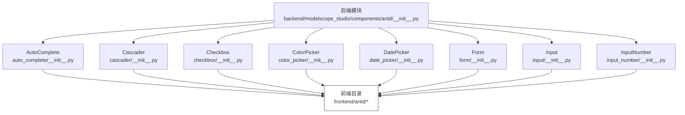
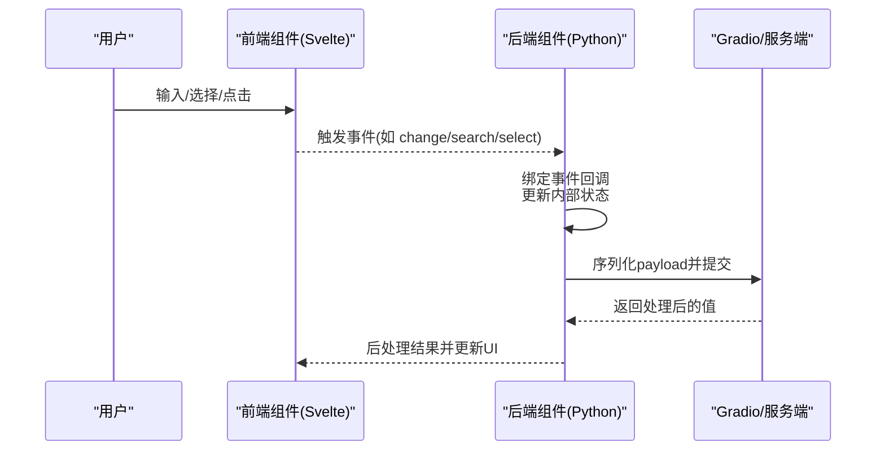
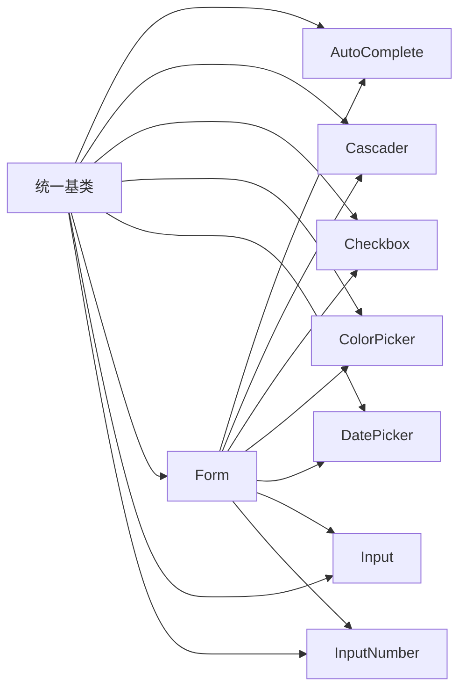

# 数据录入组件 API

<cite>
**本文引用的文件**
- [backend/modelscope_studio/components/antd/__init__.py](file://backend/modelscope_studio/components/antd/__init__.py)
- [backend/modelscope_studio/components/antd/components.py](file://backend/modelscope_studio/components/antd/components.py)
- [backend/modelscope_studio/components/antd/auto_complete/__init__.py](file://backend/modelscope_studio/components/antd/auto_complete/__init__.py)
- [backend/modelscope_studio/components/antd/cascader/__init__.py](file://backend/modelscope_studio/components/antd/cascader/__init__.py)
- [backend/modelscope_studio/components/antd/checkbox/__init__.py](file://backend/modelscope_studio/components/antd/checkbox/__init__.py)
- [backend/modelscope_studio/components/antd/color_picker/__init__.py](file://backend/modelscope_studio/components/antd/color_picker/__init__.py)
- [backend/modelscope_studio/components/antd/date_picker/__init__.py](file://backend/modelscope_studio/components/antd/date_picker/__init__.py)
- [backend/modelscope_studio/components/antd/form/__init__.py](file://backend/modelscope_studio/components/antd/form/__init__.py)
- [backend/modelscope_studio/components/antd/input/__init__.py](file://backend/modelscope_studio/components/antd/input/__init__.py)
- [backend/modelscope_studio/components/antd/input_number/__init__.py](file://backend/modelscope_studio/components/antd/input_number/__init__.py)
</cite>

## 目录

1. [简介](#简介)
2. [项目结构](#项目结构)
3. [核心组件](#核心组件)
4. [架构总览](#架构总览)
5. [详细组件分析](#详细组件分析)
6. [依赖分析](#依赖分析)
7. [性能考虑](#性能考虑)
8. [故障排查指南](#故障排查指南)
9. [结论](#结论)
10. [附录](#附录)

## 简介

本文件为 Antd 数据录入组件的 Python API 参考文档，覆盖以下组件：AutoComplete、Cascader、Checkbox、ColorPicker、DatePicker、Form、Input、InputNumber、Mentions（未在已知后端文件中发现）、Radio（未在已知后端文件中发现）、Rate（未在已知后端文件中发现）、Select（未在已知后端文件中发现）、Slider（未在已知后端文件中发现）、Switch（未在已知后端文件中发现）、TimePicker（未在已知后端文件中发现）、Transfer（未在已知后端文件中发现）、TreeSelect（未在已知后端文件中发现）、Upload（未在已知后端文件中发现）。  
文档内容包括：组件类的构造函数参数、事件与插槽、属性定义、方法签名与返回类型、数据类型规范、预处理/后处理行为、示例用法、验证与格式化、错误处理、序列化与 API 集成、实时验证与用户体验设计原则、性能优化建议等。

## 项目结构

Antd 组件在后端以“按需导入”的方式集中导出，便于统一使用。前端目录中各组件对应独立的 Svelte 实现，后端通过统一基类与前端目录映射进行桥接。

图表来源

- [backend/modelscope_studio/components/antd/**init**.py:1-151](file://backend/modelscope_studio/components/antd/__init__.py#L1-L151)
- [backend/modelscope_studio/components/antd/auto_complete/**init**.py:1-146](file://backend/modelscope_studio/components/antd/auto_complete/__init__.py#L1-L146)
- [backend/modelscope_studio/components/antd/cascader/**init**.py:1-191](file://backend/modelscope_studio/components/antd/cascader/__init__.py#L1-L191)
- [backend/modelscope_studio/components/antd/checkbox/**init**.py:1-83](file://backend/modelscope_studio/components/antd/checkbox/__init__.py#L1-L83)
- [backend/modelscope_studio/components/antd/color_picker/**init**.py:1-148](file://backend/modelscope_studio/components/antd/color_picker/__init__.py#L1-L148)
- [backend/modelscope_studio/components/antd/date_picker/**init**.py:1-208](file://backend/modelscope_studio/components/antd/date_picker/__init__.py#L1-L208)
- [backend/modelscope_studio/components/antd/form/**init**.py:1-133](file://backend/modelscope_studio/components/antd/form/__init__.py#L1-L133)
- [backend/modelscope_studio/components/antd/input/**init**.py:1-127](file://backend/modelscope_studio/components/antd/input/__init__.py#L1-L127)
- [backend/modelscope_studio/components/antd/input_number/**init**.py:1-147](file://backend/modelscope_studio/components/antd/input_number/__init__.py#L1-L147)

章节来源

- [backend/modelscope_studio/components/antd/**init**.py:1-151](file://backend/modelscope_studio/components/antd/__init__.py#L1-L151)
- [backend/modelscope_studio/components/antd/components.py:1-145](file://backend/modelscope_studio/components/antd/components.py#L1-L145)

## 核心组件

本节概述数据录入相关组件的通用能力与差异点：

- 所有组件均继承自统一的数据布局组件基类，具备一致的生命周期与事件绑定机制。
- 每个组件提供：
  - 构造函数参数：支持通用属性（如尺寸、状态、样式、类名等）与组件特有属性。
  - 事件列表：通过事件监听器绑定前端回调。
  - 插槽列表：用于定制渲染（如下拉面板、前缀/后缀、占位内容等）。
  - 数据类型规范：通过 API 规范声明输入输出类型。
  - 预处理/后处理：对 payload/value 进行类型转换或格式化。
  - 示例值与示例载荷：便于快速集成与测试。

章节来源

- [backend/modelscope_studio/components/antd/auto_complete/**init**.py:11-146](file://backend/modelscope_studio/components/antd/auto_complete/__init__.py#L11-L146)
- [backend/modelscope_studio/components/antd/cascader/**init**.py:13-191](file://backend/modelscope_studio/components/antd/cascader/__init__.py#L13-L191)
- [backend/modelscope_studio/components/antd/checkbox/**init**.py:12-83](file://backend/modelscope_studio/components/antd/checkbox/__init__.py#L12-L83)
- [backend/modelscope_studio/components/antd/color_picker/**init**.py:12-148](file://backend/modelscope_studio/components/antd/color_picker/__init__.py#L12-L148)
- [backend/modelscope_studio/components/antd/date_picker/**init**.py:13-208](file://backend/modelscope_studio/components/antd/date_picker/__init__.py#L13-L208)
- [backend/modelscope_studio/components/antd/form/**init**.py:17-133](file://backend/modelscope_studio/components/antd/form/__init__.py#L17-L133)
- [backend/modelscope_studio/components/antd/input/**init**.py:16-127](file://backend/modelscope_studio/components/antd/input/__init__.py#L16-L127)
- [backend/modelscope_studio/components/antd/input_number/**init**.py:11-147](file://backend/modelscope_studio/components/antd/input_number/__init__.py#L11-L147)

## 架构总览

后端组件通过统一基类与前端目录映射连接，前端组件负责 UI 渲染与交互，后端负责数据类型约束、事件绑定与序列化。

图表来源

- [backend/modelscope_studio/components/antd/auto_complete/**init**.py:18-43](file://backend/modelscope_studio/components/antd/auto_complete/__init__.py#L18-L43)
- [backend/modelscope_studio/components/antd/cascader/**init**.py:20-36](file://backend/modelscope_studio/components/antd/cascader/__init__.py#L20-L36)
- [backend/modelscope_studio/components/antd/form/**init**.py:23-36](file://backend/modelscope_studio/components/antd/form/__init__.py#L23-L36)

## 详细组件分析

### AutoComplete（自动完成）

- 类型与用途：字符串输入的自动完成组件，支持选项列表与搜索事件。
- 关键属性
  - 通用：size、status、variant、placeholder、disabled、class_names、styles、root_class_name、as_item 等。
  - 特有：allow_clear、auto_focus、backfill、default_active_first_option、default_open、dropdown_render、popup_render、popup_class_name、popup_match_select_width、filter_option、get_popup_container、not_found_content、open、options、placement、options 等。
- 事件：change、blur、focus、search、select、clear、dropdown_visible_change、popup_visible_change。
- 插槽：allowClear.clearIcon、dropdownRender、popupRender、children、notFoundContent、options。
- 数据类型
  - 输入/输出：字符串。
  - API 规范：字符串类型。
- 预处理/后处理：直接透传。
- 示例用法
  - 在表单中作为单项输入，配合校验规则使用。
  - 使用 options 提供候选列表，结合 search 事件实现远程搜索。
- 错误处理
  - 当未找到匹配项时，可通过 not_found_content 自定义提示。
- 实时验证
  - 通过 search 事件触发远程校验，结合 Form 的校验触发策略使用。

章节来源

- [backend/modelscope_studio/components/antd/auto_complete/**init**.py:12-146](file://backend/modelscope_studio/components/antd/auto_complete/__init__.py#L12-L146)

### Cascader（级联选择）

- 类型与用途：多级联动选择，支持异步加载与搜索。
- 关键属性
  - 通用：size、status、variant、placeholder、disabled、class_names、styles、root_class_name、as_item 等。
  - 特有：allow_clear、auto_clear_search_value、auto_focus、change_on_select、display_render、tag_render、popup_class_name、dropdown_render、popup_render、expand_icon、prefix、expand_trigger、filed_names、get_popup_container、max_tag_count、max_tag_placeholder、max_tag_text_length、not_found_content、open、options、placement、show_search、multiple、show_checked_strategy、remove_icon、search_value、dropdown_menu_column_style、option_render 等。
- 事件：change、search、dropdown_visible_change、popup_visible_change、load_data。
- 插槽：allowClear.clearIcon、suffixIcon、maxTagPlaceholder、notFoundContent、expandIcon、removeIcon、prefix、displayRender、tagRender、dropdownRender、popupRender、showSearch.render。
- 数据类型
  - 输入/输出：字符串数组或数字数组（路径键）。
  - API 规范：字符串数组或字符串。
- 预处理/后处理：直接透传。
- 示例用法
  - 常用于省市区选择、分类筛选等场景。
  - 结合 load_data 实现懒加载。
- 错误处理
  - 通过 not_found_content 定制空状态。
- 实时验证
  - 通过 search 与 change 事件结合 Form 校验。

章节来源

- [backend/modelscope_studio/components/antd/cascader/**init**.py:13-191](file://backend/modelscope_studio/components/antd/cascader/__init__.py#L13-L191)

### Checkbox（复选框）

- 类型与用途：布尔值选择。
- 关键属性
  - 通用：class_names、styles、additional_props、root_class_name、as_item 等。
  - 特有：auto_focus、default_checked、disabled、indeterminate。
- 事件：change。
- 数据类型
  - 输入/输出：布尔值。
  - API 规范：布尔类型。
- 预处理/后处理：直接透传。
- 示例用法
  - 单独使用或组合为组（Group）。
- 错误处理
  - 无特殊错误处理逻辑，遵循布尔值约束。
- 实时验证
  - 可直接参与 Form 校验。

章节来源

- [backend/modelscope_studio/components/antd/checkbox/**init**.py:12-83](file://backend/modelscope_studio/components/antd/checkbox/__init__.py#L12-L83)

### ColorPicker（颜色选择器）

- 类型与用途：颜色值选择，支持单色与渐变模式。
- 关键属性
  - 通用：class_names、styles、additional_props、root_class_name、as_item 等。
  - 特有：value_format、allow_clear、arrow、presets、disabled、disabled_alpha、disabled_format、destroy_tooltip_on_hide、destroy_on_hidden、format、mode、open、default_value、default_format、show_text、placement、trigger、panel_render、size。
- 事件：change、change_complete、clear、open_change、format_change。
- 插槽：presets、panelRender、showText。
- 数据类型
  - 输入/输出：十六进制字符串或渐变颜色数组对象。
  - API 规范：字符串或颜色数组对象。
- 预处理/后处理：直接透传。
- 示例用法
  - 用于主题色、品牌色等配置。
- 错误处理
  - 非法格式会由前端校验拦截。
- 实时验证
  - 通过 change 与 change_complete 事件结合校验。

章节来源

- [backend/modelscope_studio/components/antd/color_picker/**init**.py:12-148](file://backend/modelscope_studio/components/antd/color_picker/__init__.py#L12-L148)

### DatePicker（日期选择器）

- 类型与用途：日期/时间选择，支持多种模式与范围选择。
- 关键属性
  - 通用：class_names、styles、additional_props、root_class_name、as_item 等。
  - 特有：allow_clear、auto_focus、cell_render、components、disabled、disabled_date、format、order、preserve_invalid_on_blur、input_read_only、locale、mode、need_confirm、next_icon、open、panel_render、picker、placement、placeholder、popup_class_name、popup_style、get_popup_container、min_date、max_date、prefix、prev_icon、size、presets、status、suffix_icon、super_next_icon、super_prev_icon、variant、default_picker_value、default_value、disabled_time、multiple、picker_value、render_extra_footer、show_now、show_time、show_week、preview_value。
- 事件：change、ok、panel_change、open_change。
- 插槽：allowClear.clearIcon、prefix、prevIcon、nextIcon、suffixIcon、superNextIcon、superPrevIcon、renderExtraFooter、cellRender、panelRender。
- 数据类型
  - 输入/输出：字符串、数值或数组（范围）。
  - API 规范：字符串、数值或数组。
- 预处理/后处理：直接透传。
- 示例用法
  - 支持日期、周、月、季度、年等多种模式；可开启时间选择与确认按钮。
- 错误处理
  - 通过 disabled_date、min_date、max_date 限制范围。
- 实时验证
  - 通过 panel_change 与 change 事件结合校验。

章节来源

- [backend/modelscope_studio/components/antd/date_picker/**init**.py:13-208](file://backend/modelscope_studio/components/antd/date_picker/__init__.py#L13-L208)

### Form（表单）

- 类型与用途：数据收集与校验容器，支持字段变更、提交、重置与校验。
- 关键属性
  - 通用：class_names、styles、additional_props、root_class_name、as_item 等。
  - 特有：form_action、colon、disabled、component、feedback_icons、initial_values、label_align、label_col、label_wrap、layout、form_name、preserve、required_mark、scroll_to_first_error、size、validate_messages、validate_trigger、variant、wrapper_col、clear_on_destroy。
- 事件：fields_change、finish、finish_failed、values_change。
- 插槽：requiredMark。
- 数据类型
  - 输入/输出：字典或包装模型。
  - 预处理：将包装模型提取为字典。
- 预处理/后处理：将 AntdFormData 解包为 dict。
- 示例用法
  - 将各数据录入组件作为子项放入 Form 中，统一管理校验与提交。
- 错误处理
  - 通过 validate_messages、scroll_to_first_error 控制错误展示与定位。
- 实时验证
  - 通过 validate_trigger 控制触发时机（如 onChange）。

章节来源

- [backend/modelscope_studio/components/antd/form/**init**.py:17-133](file://backend/modelscope_studio/components/antd/form/__init__.py#L17-L133)

### Input（文本输入）

- 类型与用途：基础文本输入，支持密码、搜索、多行文本、OTP 等变体。
- 关键属性
  - 通用：class_names、styles、additional_props、root_class_name、as_item 等。
  - 特有：addon_after、addon_before、allow_clear、count、default_value、read_only、disabled、max_length、prefix、show_count、size、status、suffix、type、placeholder、variant。
- 事件：change、press_enter、clear。
- 插槽：addonAfter、addonBefore、allowClear.clearIcon、prefix、suffix、showCount.formatter。
- 数据类型
  - 输入/输出：字符串。
  - API 规范：字符串。
- 预处理/后处理：直接透传。
- 示例用法
  - 通过 Password、Search、Textarea、OTP 子类扩展不同形态。
- 错误处理
  - 通过 status 与校验规则反馈。
- 实时验证
  - 通过 change 与 press_enter 事件结合校验。

章节来源

- [backend/modelscope_studio/components/antd/input/**init**.py:16-127](file://backend/modelscope_studio/components/antd/input/__init__.py#L16-L127)

### InputNumber（数字输入）

- 类型与用途：数值输入，支持步进、精度、上下控件等。
- 关键属性
  - 通用：class_names、styles、additional_props、root_class_name、as_item 等。
  - 特有：addon_after、addon_before、auto_focus、change_on_blur、change_on_wheel、controls、decimal_separator、placeholder、default_value、disabled、formatter、keyboard、max、min、mode、parser、precision、prefix、read_only、size、status、step、string_mode、suffix、variant。
- 事件：change、press_enter、step。
- 插槽：addonAfter、addonBefore、controls.upIcon、controls.downIcon、prefix、suffix。
- 数据类型
  - 输入/输出：整数或浮点数。
  - API 规范：数值。
- 预处理/后处理：将字符串解析为整数或浮点数。
- 示例用法
  - 适用于价格、数量、评分等数值输入。
- 错误处理
  - 通过 min/max、precision、step 约束范围与粒度。
- 实时验证
  - 通过 change 与 step 事件结合校验。

章节来源

- [backend/modelscope_studio/components/antd/input_number/**init**.py:11-147](file://backend/modelscope_studio/components/antd/input_number/__init__.py#L11-L147)

### Mentions（提及）（未在后端发现）

- 状态：当前仓库未发现后端实现文件。
- 建议：若需要，请参考 Antd 官方文档与前端实现，补充后端适配层。

### Radio（单选）（未在后端发现）

- 状态：当前仓库未发现后端实现文件。
- 建议：若需要，请参考 Antd 官方文档与前端实现，补充后端适配层。

### Rate（评分）（未在后端发现）

- 状态：当前仓库未发现后端实现文件。
- 建议：若需要，请参考 Antd 官方文档与前端实现，补充后端适配层。

### Select（选择器）（未在后端发现）

- 状态：当前仓库未发现后端实现文件。
- 建议：若需要，请参考 Antd 官方文档与前端实现，补充后端适配层。

### Slider（滑块）（未在后端发现）

- 状态：当前仓库未发现后端实现文件。
- 建议：若需要，请参考 Antd 官方文档与前端实现，补充后端适配层。

### Switch（开关）（未在后端发现）

- 状态：当前仓库未发现后端实现文件。
- 建议：若需要，请参考 Antd 官方文档与前端实现，补充后端适配层。

### TimePicker（时间选择器）（未在后端发现）

- 状态：当前仓库未发现后端实现文件。
- 建议：若需要，请参考 Antd 官方文档与前端实现，补充后端适配层。

### Transfer（穿梭框）（未在后端发现）

- 状态：当前仓库未发现后端实现文件。
- 建议：若需要，请参考 Antd 官方文档与前端实现，补充后端适配层。

### TreeSelect（树选择器）（未在后端发现）

- 状态：当前仓库未发现后端实现文件。
- 建议：若需要，请参考 Antd 官方文档与前端实现，补充后端适配层。

### Upload（上传）（未在后端发现）

- 状态：当前仓库未发现后端实现文件。
- 建议：若需要，请参考 Antd 官方文档与前端实现，补充后端适配层。

## 依赖分析

- 组件间耦合
  - 所有组件共享同一基类与事件系统，耦合度低、内聚性高。
  - Form 作为容器，聚合各数据录入组件，形成弱耦合的表单生态。
- 外部依赖
  - 事件系统基于 Gradio 的事件监听器。
  - 前端目录映射通过工具函数解析，确保前后端一致。
- 循环依赖
  - 未发现循环依赖迹象。

图表来源

- [backend/modelscope_studio/components/antd/auto_complete/**init**.py:12](file://backend/modelscope_studio/components/antd/auto_complete/__init__.py#L12)
- [backend/modelscope_studio/components/antd/cascader/**init**.py:13](file://backend/modelscope_studio/components/antd/cascader/__init__.py#L13)
- [backend/modelscope_studio/components/antd/checkbox/**init**.py:12](file://backend/modelscope_studio/components/antd/checkbox/__init__.py#L12)
- [backend/modelscope_studio/components/antd/color_picker/**init**.py:12](file://backend/modelscope_studio/components/antd/color_picker/__init__.py#L12)
- [backend/modelscope_studio/components/antd/date_picker/**init**.py:13](file://backend/modelscope_studio/components/antd/date_picker/__init__.py#L13)
- [backend/modelscope_studio/components/antd/form/**init**.py:17](file://backend/modelscope_studio/components/antd/form/__init__.py#L17)
- [backend/modelscope_studio/components/antd/input/**init**.py:16](file://backend/modelscope_studio/components/antd/input/__init__.py#L16)
- [backend/modelscope_studio/components/antd/input_number/**init**.py:11](file://backend/modelscope_studio/components/antd/input_number/__init__.py#L11)

章节来源

- [backend/modelscope_studio/components/antd/**init**.py:1-151](file://backend/modelscope_studio/components/antd/__init__.py#L1-L151)

## 性能考虑

- 事件绑定与回调
  - 合理设置事件绑定（如仅在必要时启用搜索/可见性变化），避免频繁触发。
- 数据类型与序列化
  - 数字输入组件在预处理阶段进行字符串到数值的转换，减少前端类型不一致带来的开销。
- 下拉与弹窗
  - 对于复杂下拉菜单（如 Cascader），建议使用懒加载与虚拟滚动（如前端支持）降低渲染成本。
- 样式与类名
  - 使用 class_names 与 styles 精简样式，避免重复计算与重绘。
- 表单校验
  - 合理设置 validate_trigger，避免高频校验导致的性能问题。

## 故障排查指南

- 事件未触发
  - 检查是否正确绑定事件监听器，确认前端回调已启用。
- 数据类型不匹配
  - 数字输入组件在输入非数值字符串时，预处理可能失败；请确保输入格式正确。
- 校验不生效
  - 确认 Form 的 validate_trigger 设置与组件事件一致；检查 required_mark 与 scroll_to_first_error 配置。
- 下拉/弹窗异常
  - 检查 get_popup_container 与 placement 配置，确保容器可见且位置合理。
- 级联加载失败
  - 确认 load_data 回调逻辑与 options 结构一致。

章节来源

- [backend/modelscope_studio/components/antd/input_number/**init**.py:128-140](file://backend/modelscope_studio/components/antd/input_number/__init__.py#L128-L140)
- [backend/modelscope_studio/components/antd/form/**init**.py:48-68](file://backend/modelscope_studio/components/antd/form/__init__.py#L48-L68)
- [backend/modelscope_studio/components/antd/cascader/**init**.py:33-36](file://backend/modelscope_studio/components/antd/cascader/__init__.py#L33-L36)

## 结论

本项目提供了统一的 Antd 数据录入组件后端适配层，覆盖了自动完成、级联选择、复选框、颜色选择器、日期选择器、表单、文本输入与数字输入等核心组件。通过一致的事件系统、数据类型规范与预处理/后处理机制，开发者可以高效地构建表单与数据录入界面。对于缺失的组件（如 Mentions、Radio、Rate、Select、Slider、Switch、TimePicker、Transfer、TreeSelect、Upload），建议参考 Antd 官方文档与前端实现，补充后端适配层以保持生态一致性。

## 附录

- 使用建议
  - 将数据录入组件置于 Form 容器中，统一管理初始值、校验与提交。
  - 对于复杂输入（如 Cascader、DatePicker），优先采用受控模式与明确的 API 规范。
  - 利用插槽与变体（variant）提升可访问性与一致性。
- 最佳实践
  - 为每个输入设置合理的默认值与占位符，改善用户体验。
  - 对于大范围输入（如数字），设置 min/max 与 step，避免无效输入。
  - 对于日期输入，明确 format 与 picker 模式，减少歧义。
