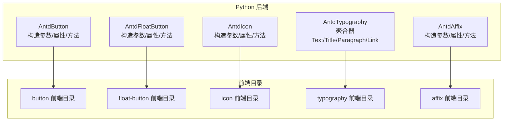
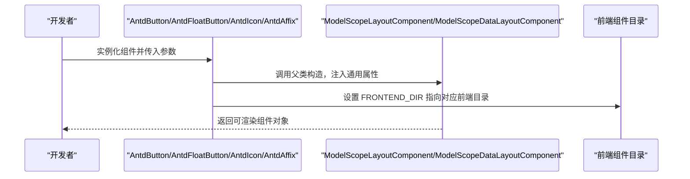

# 通用组件 API

<cite>
**本文引用的文件**
- [button/__init__.py](file://backend/modelscope_studio/components/antd/button/__init__.py)
- [float_button/__init__.py](file://backend/modelscope_studio/components/antd/float_button/__init__.py)
- [icon/__init__.py](file://backend/modelscope_studio/components/antd/icon/__init__.py)
- [typography/__init__.py](file://backend/modelscope_studio/components/antd/typography/__init__.py)
- [affix/__init__.py](file://backend/modelscope_studio/components/antd/affix/__init__.py)
</cite>

## 目录

1. [简介](#简介)
2. [项目结构](#项目结构)
3. [核心组件](#核心组件)
4. [架构总览](#架构总览)
5. [详细组件分析](#详细组件分析)
6. [依赖分析](#依赖分析)
7. [性能考虑](#性能考虑)
8. [故障排查指南](#故障排查指南)
9. [结论](#结论)
10. [附录](#附录)

## 简介

本文件为 Antd 通用组件的 Python API 参考文档，覆盖 Button、FloatButton、Icon、Typography、Affix 等基础通用组件。内容包括：

- 组件类的构造函数参数、属性定义、方法签名与返回值类型
- 标准实例化示例（基本用法与高级配置）
- 事件处理机制、样式定制方式与响应式行为
- 参数验证规则、异常处理策略与最佳实践
- 按功能分类的 API 索引，便于快速查阅

## 项目结构

这些组件均位于后端 Python 包中，通过统一的布局组件基类进行封装，并指向对应的前端目录以渲染 UI。

图表来源

- [button/**init**.py:15-157](file://backend/modelscope_studio/components/antd/button/__init__.py#L15-L157)
- [float_button/**init**.py:12-110](file://backend/modelscope_studio/components/antd/float_button/__init__.py#L12-L110)
- [icon/**init**.py:9-88](file://backend/modelscope_studio/components/antd/icon/__init__.py#L9-L88)
- [typography/**init**.py:1-12](file://backend/modelscope_studio/components/antd/typography/__init__.py#L1-L12)
- [affix/**init**.py:10-86](file://backend/modelscope_studio/components/antd/affix/__init__.py#L10-L86)

章节来源

- [button/**init**.py:15-157](file://backend/modelscope_studio/components/antd/button/__init__.py#L15-L157)
- [float_button/**init**.py:12-110](file://backend/modelscope_studio/components/antd/float_button/__init__.py#L12-L110)
- [icon/**init**.py:9-88](file://backend/modelscope_studio/components/antd/icon/__init__.py#L9-L88)
- [typography/**init**.py:1-12](file://backend/modelscope_studio/components/antd/typography/__init__.py#L1-L12)
- [affix/**init**.py:10-86](file://backend/modelscope_studio/components/antd/affix/__init__.py#L10-L86)

## 核心组件

本节概述五个通用组件的职责与典型用途：

- Button：触发操作的按钮，支持多种类型、变体、尺寸、形状与状态（禁用、危险、幽灵、加载）。
- FloatButton：悬浮全局功能按钮，可带描述、提示、徽标与链接。
- Icon：语义化矢量图标，支持旋转、旋转动画与双色图标颜色设置。
- Typography：文本排版集合，包含 Text、Title、Paragraph、Link 子组件。
- Affix：固定定位容器，用于将子元素粘附到视口顶部或底部。

章节来源

- [button/**init**.py:15-38](file://backend/modelscope_studio/components/antd/button/__init__.py#L15-L38)
- [float_button/**init**.py:12-21](file://backend/modelscope_studio/components/antd/float_button/__init__.py#L12-L21)
- [icon/**init**.py:9-14](file://backend/modelscope_studio/components/antd/icon/__init__.py#L9-L14)
- [typography/**init**.py:7-12](file://backend/modelscope_studio/components/antd/typography/__init__.py#L7-L12)
- [affix/**init**.py:10-20](file://backend/modelscope_studio/components/antd/affix/__init__.py#L10-L20)

## 架构总览

组件遵循“Python 封装 + 前端渲染”的模式，通过统一的布局组件基类注入通用属性（可见性、DOM ID、类名、内联样式、渲染开关等），并通过 resolve_frontend_dir 指向对应前端目录。

图表来源

- [button/**init**.py:15-157](file://backend/modelscope_studio/components/antd/button/__init__.py#L15-L157)
- [float_button/**init**.py:12-110](file://backend/modelscope_studio/components/antd/float_button/__init__.py#L12-L110)
- [icon/**init**.py:9-88](file://backend/modelscope_studio/components/antd/icon/__init__.py#L9-L88)
- [affix/**init**.py:10-86](file://backend/modelscope_studio/components/antd/affix/__init__.py#L10-L86)

## 详细组件分析

### Button 组件 API

- 类型与继承
  - 类名：AntdButton
  - 基类：ModelScopeLayoutComponent
  - 内部嵌套：Group（按钮组）
- 事件
  - click：点击事件，绑定内部回调以启用事件监听
- 插槽
  - icon、loading.icon
- 关键属性与含义
  - auto_insert_space：是否自动在中文字符间插入空格
  - block：是否撑满父容器宽度
  - class_names：语义化 DOM 类名
  - danger/disabled/ghost/loading：危险/禁用/幽灵/加载状态
  - href/html_type：链接跳转与原生 HTML type
  - icon/icon_position：图标与图标位置
  - shape/size/type/variant/color：形状、尺寸、类型、变体、颜色
  - styles/root_class_name：语义化样式与根类名
  - 其他 Gradio 通用属性：visible、elem_id、elem_classes、elem_style、render
- 方法
  - preprocess(payload): 接收字符串或 None，返回字符串或 None
  - postprocess(value): 接收字符串或 None，返回字符串或 None
  - example_payload/example_value: 示例负载与示例值
- 实例化要点
  - 支持通过 type/variant/color/shape/size 控制外观与语义
  - loading 可为布尔或字典（如需自定义加载图标）
  - href 配合 html_type='button' 或 'submit'/'reset'
- 最佳实践
  - 主要操作使用 primary 类型；危险操作使用 danger
  - 需要避免重复提交时设置 loading
  - 图标按钮建议配合 icon_position='start'/'end'

章节来源

- [button/**init**.py:15-157](file://backend/modelscope_studio/components/antd/button/__init__.py#L15-L157)

### FloatButton 组件 API

- 类型与继承
  - 类名：AntdFloatButton
  - 基类：ModelScopeLayoutComponent
  - 内部嵌套：BackTop（回到顶部）、Group（按钮组）
- 事件
  - click：点击事件，绑定内部回调以启用事件监听
- 插槽
  - icon、description、tooltip、tooltip.title、badge.count
- 关键属性与含义
  - icon/description：图标与描述文本
  - tooltip：提示文本或配置对象
  - type/shape：类型（default/primary）、形状（circle/square）
  - href/href_target/html_type：超链接目标与原生 HTML type
  - badge：徽标配置（不支持部分状态相关属性）
  - class_names/styles/root_class_name：样式与类名
  - 其他 Gradio 通用属性：visible、elem_id、elem_classes、elem_style、render
- 方法
  - preprocess(payload): 接收 None，返回 None
  - postprocess(value): 接收 None，返回 None
  - example_payload/example_value: 示例负载与示例值
- 实例化要点
  - 常用于全局功能入口（如回到顶部、快捷操作）
  - tooltip 支持传入字符串或对象以扩展标题等
- 最佳实践
  - 使用 circle 形状提升可发现性
  - 与 BackTop 组合实现“回到顶部”体验

章节来源

- [float_button/**init**.py:12-110](file://backend/modelscope_studio/components/antd/float_button/__init__.py#L12-L110)

### Icon 组件 API

- 类型与继承
  - 类名：AntdIcon
  - 基类：ModelScopeDataLayoutComponent
  - 内部嵌套：IconfontProvider（IconFont 提供者）
- 事件
  - click：点击事件，绑定内部回调以启用事件监听
- 插槽
  - component：自定义根节点组件
- 关键属性与含义
  - value：默认图标名称（如 "GithubOutlined"）
  - spin：是否旋转动画
  - rotate：旋转角度（度）
  - two_tone_color：双色图标主色调
  - component：根节点组件替换
  - class_names/styles：样式与类名
  - 其他 Gradio 通用属性：visible、elem_id、elem_classes、elem_style、render
- 方法
  - preprocess(payload): 接收字符串或 None，返回字符串或 None
  - postprocess(value): 接收字符串或 None，返回字符串或 None
  - example_payload/example_value: 示例负载与示例值
- 实例化要点
  - 作为装饰性元素时，优先使用语义化的图标名称
  - spin 与 rotate 可叠加使用
- 最佳实践
  - 在按钮或导航中搭配 icon_position 使用
  - 双色图标场景下明确主色

章节来源

- [icon/**init**.py:9-88](file://backend/modelscope_studio/components/antd/icon/__init__.py#L9-L88)

### Typography 组件 API

- 类型与继承
  - 类名：AntdTypography
  - 聚合器：包含 Text、Title、Paragraph、Link 四个子组件
- 说明
  - 该聚合类仅导出子组件，具体子组件定义位于各自模块
- 实例化要点
  - 通过 AntdTypography.Text/Title/Paragraph/Link 访问各子组件
- 最佳实践
  - 文档与页面标题使用 Title
  - 正文段落使用 Paragraph
  - 可点击链接使用 Link

章节来源

- [typography/**init**.py:1-12](file://backend/modelscope_studio/components/antd/typography/__init__.py#L1-L12)

### Affix 组件 API

- 类型与继承
  - 类名：AntdAffix
  - 基类：ModelScopeLayoutComponent
- 事件
  - change：状态变化事件（附着/脱离），绑定内部回调以启用事件监听
- 关键属性与含义
  - offset_bottom：距离视口底部偏移（像素）
  - offset_top：距离视口顶部偏移（像素）
  - get_target：指定滚动区域 DOM 节点选择器
  - class_names/styles/root_class_name：样式与类名
  - 其他 Gradio 通用属性：visible、elem_id、elem_classes、elem_style、render
- 方法
  - preprocess(payload): 接收 None，返回 None
  - postprocess(value): 接收 None，返回 None
  - example_payload/example_value: 示例负载与示例值
- 实例化要点
  - 注意不要遮挡页面其他内容，尤其在小屏设备上
  - get_target 可限定滚动容器，避免全局滚动影响
- 最佳实践
  - 用于菜单、工具栏等需要常驻可视区的场景
  - 结合交互反馈（如 change 事件）更新状态

章节来源

- [affix/**init**.py:10-86](file://backend/modelscope_studio/components/antd/affix/__init__.py#L10-L86)

## 依赖分析

- 组件共同依赖
  - 基类：ModelScopeLayoutComponent 或 ModelScopeDataLayoutComponent
  - 事件系统：gradio.events.EventListener
  - 前端目录解析：resolve_frontend_dir
- 组件间关系
  - Button：包含 ButtonGroup
  - FloatButton：包含 BackTop 与 FloatButtonGroup
  - Icon：包含 IconfontProvider
  - Typography：聚合 Text/Title/Paragraph/Link
- 依赖可视化

```mermaid
graph LR
subgraph "事件与基类"
EL["EventListener"]
LCB["ModelScopeLayoutComponent"]
DLCB["ModelScopeDataLayoutComponent"]
end
BTN["AntdButton"] --> LCB
BTN --> EL
BTN --> |"resolve_frontend_dir('button')"| FE_BTN["button 前端目录"]
FLT["AntdFloatButton"] --> LCB
FLT --> EL
FLT --> |"resolve_frontend_dir('float-button')"| FE_FLT["float-button 前端目录"]
ICO["AntdIcon"] --> DLCB
ICO --> EL
ICO --> |"resolve_frontend_dir('icon')"| FE_ICO["icon 前端目录"]
TYP["AntdTypography"] --> |"导出 Text/Title/Paragraph/Link"| SUB["子组件"]
AFF["AntdAffix"] --> LCB
AFF --> EL
AFF --> |"resolve_frontend_dir('affix')"| FE_AFF["affix 前端目录"]
```

图表来源

- [button/**init**.py:15-157](file://backend/modelscope_studio/components/antd/button/__init__.py#L15-L157)
- [float_button/**init**.py:12-110](file://backend/modelscope_studio/components/antd/float_button/__init__.py#L12-L110)
- [icon/**init**.py:9-88](file://backend/modelscope_studio/components/antd/icon/__init__.py#L9-L88)
- [typography/**init**.py:1-12](file://backend/modelscope_studio/components/antd/typography/__init__.py#L1-L12)
- [affix/**init**.py:10-86](file://backend/modelscope_studio/components/antd/affix/__init__.py#L10-L86)

## 性能考虑

- 渲染与事件
  - 通过 Gradio 通用属性控制渲染时机与可见性，减少不必要的重绘
  - 事件绑定仅在需要时开启（如 click/change），避免过度监听
- 图标与加载
  - 合理使用 spin/rotate，避免在低端设备上造成额外开销
  - Button 的 loading 状态可防止重复提交，间接降低服务端压力
- 容器与滚动
  - Affix 的 get_target 应尽量精确，避免对大范围滚动容器频繁计算
- 建议
  - 大批量列表中谨慎使用重型组件（如 Tooltip/Popover），必要时延迟加载
  - 使用 shape/size/type 等外观属性时保持一致性，减少样式切换成本

## 故障排查指南

- 事件未触发
  - 确认已正确设置 EVENTS 并确保组件处于可交互状态（非 disabled/loading）
  - 对于 FloatButton/Affix，检查 click/change 事件是否已绑定
- 样式不生效
  - 检查 class_names/styles 是否与主题变量冲突
  - 确认 root_class_name 未被外部样式覆盖
- 图标显示异常
  - 确认 value 为受支持的图标名称
  - 若使用自定义 component，请确保组件可渲染且无循环依赖
- 悬浮按钮遮挡内容
  - 调整 offset_top/offset_bottom 或使用 get_target 精确控制滚动区域
- 加载态无效
  - Button 的 loading 为布尔或字典时，确认传参格式正确

章节来源

- [button/**init**.py:41-46](file://backend/modelscope_studio/components/antd/button/__init__.py#L41-L46)
- [float_button/**init**.py:24-29](file://backend/modelscope_studio/components/antd/float_button/__init__.py#L24-L29)
- [affix/**init**.py:21-26](file://backend/modelscope_studio/components/antd/affix/__init__.py#L21-L26)

## 结论

以上为 Antd 通用组件的 Python API 参考与最佳实践总结。通过统一的基类与事件系统，这些组件在保持简洁易用的同时，提供了丰富的外观与交互能力。建议在实际项目中结合业务场景合理选择组件类型与配置项，并关注性能与可维护性。

## 附录

- 按功能分类的 API 索引
  - 按钮类：AntdButton（含 Group）、AntdFloatButton（含 BackTop/Group）
  - 图标类：AntdIcon（含 IconfontProvider）
  - 文本排版：AntdTypography（Text/Title/Paragraph/Link）
  - 定位容器：AntdAffix
- 常用参数速查
  - 外观：type、variant、color、shape、size
  - 状态：disabled、danger、ghost、loading
  - 行为：href、html_type、icon、icon_position、tooltip、badge
  - 样式：class_names、styles、root_class_name
  - 事件：click、change
- 示例路径指引（不含代码内容）
  - Button 基本用法与加载态：[button/**init**.py:88-108](file://backend/modelscope_studio/components/antd/button/__init__.py#L88-L108)
  - FloatButton 悬浮入口与回到顶部组合：[float_button/**init**.py:59-70](file://backend/modelscope_studio/components/antd/float_button/__init__.py#L59-L70)
  - Icon 动画与双色图标：[icon/**init**.py:47-53](file://backend/modelscope_studio/components/antd/icon/__init__.py#L47-L53)
  - Affix 定位与滚动区域：[affix/**init**.py:47-52](file://backend/modelscope_studio/components/antd/affix/__init__.py#L47-L52)
