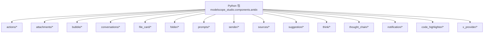
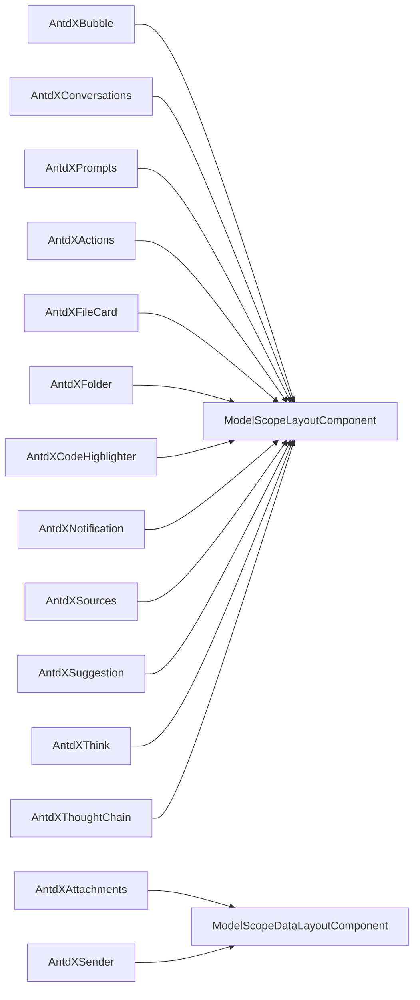

# Antdx 组件 API

<cite>
**本文引用的文件**
- [backend/modelscope_studio/components/antdx/__init__.py](file://backend/modelscope_studio/components/antdx/__init__.py)
- [backend/modelscope_studio/components/antdx/components.py](file://backend/modelscope_studio/components/antdx/components.py)
- [backend/modelscope_studio/components/antdx/bubble/__init__.py](file://backend/modelscope_studio/components/antdx/bubble/__init__.py)
- [backend/modelscope_studio/components/antdx/conversations/__init__.py](file://backend/modelscope_studio/components/antdx/conversations/__init__.py)
- [backend/modelscope_studio/components/antdx/prompts/__init__.py](file://backend/modelscope_studio/components/antdx/prompts/__init__.py)
- [backend/modelscope_studio/components/antdx/attachments/__init__.py](file://backend/modelscope_studio/components/antdx/attachments/__init__.py)
- [backend/modelscope_studio/components/antdx/sender/__init__.py](file://backend/modelscope_studio/components/antdx/sender/__init__.py)
- [backend/modelscope_studio/components/antdx/actions/__init__.py](file://backend/modelscope_studio/components/antdx/actions/__init__.py)
- [backend/modelscope_studio/components/antdx/file_card/__init__.py](file://backend/modelscope_studio/components/antdx/file_card/__init__.py)
- [backend/modelscope_studio/components/antdx/folder/__init__.py](file://backend/modelscope_studio/components/antdx/folder/__init__.py)
- [backend/modelscope_studio/components/antdx/code_highlighter/__init__.py](file://backend/modelscope_studio/components/antdx/code_highlighter/__init__.py)
- [backend/modelscope_studio/components/antdx/notification/__init__.py](file://backend/modelscope_studio/components/antdx/notification/__init__.py)
- [backend/modelscope_studio/components/antdx/sources/__init__.py](file://backend/modelscope_studio/components/antdx/sources/__init__.py)
- [backend/modelscope_studio/components/antdx/suggestion/__init__.py](file://backend/modelscope_studio/components/antdx/suggestion/__init__.py)
- [backend/modelscope_studio/components/antdx/think/__init__.py](file://backend/modelscope_studio/components/antdx/think/__init__.py)
- [backend/modelscope_studio/components/antdx/thought_chain/__init__.py](file://backend/modelscope_studio/components/antdx/thought_chain/__init__.py)
</cite>

## 目录

1. [简介](#简介)
2. [项目结构](#项目结构)
3. [核心组件](#核心组件)
4. [架构总览](#架构总览)
5. [详细组件分析](#详细组件分析)
6. [依赖分析](#依赖分析)
7. [性能考虑](#性能考虑)
8. [故障排查指南](#故障排查指南)
9. [结论](#结论)
10. [附录](#附录)

## 简介

本文件为 Antdx 组件库的 Python API 参考文档，聚焦于 modelscope_studio.components.antdx.\* 下的机器学习与 AI 应用相关组件。内容覆盖 20+ 个组件类的完整导入路径、构造函数参数、属性定义、方法签名与返回值类型说明，并提供面向对话系统、文件处理、用户输入等典型场景的标准实例化示例与最佳实践。同时记录组件的事件处理机制、生命周期管理、状态同步策略以及性能优化建议。

## 项目结构

Antdx 组件位于后端 Python 包 modelscope_studio/components/antdx/ 下，采用按功能域分层的模块组织方式：每个子目录对应一个组件或组件族（如 bubble、conversations、sender 等），并在 **init**.py 中统一导出。components.py 与 **init**.py 提供一致的聚合导出入口，便于从 modelscope_studio.components.antdx.\* 直接导入。

图表来源

- [backend/modelscope_studio/components/antdx/**init**.py:1-42](file://backend/modelscope_studio/components/antdx/__init__.py#L1-L42)
- [backend/modelscope_studio/components/antdx/components.py:1-40](file://backend/modelscope_studio/components/antdx/components.py#L1-L40)

章节来源

- [backend/modelscope_studio/components/antdx/**init**.py:1-42](file://backend/modelscope_studio/components/antdx/__init__.py#L1-L42)
- [backend/modelscope_studio/components/antdx/components.py:1-40](file://backend/modelscope_studio/components/antdx/components.py#L1-L40)

## 核心组件

以下列出 modelscope_studio.components.antdx.\* 的全部机器学习与 AI 场景相关组件类及其导入路径与用途概览：

- 基础布局与展示
  - Bubble（气泡）：用于消息/文本展示与交互，支持编辑、打字动画、变体与形状等。
  - Conversations（会话列表）：用于多会话管理与菜单交互。
  - Prompts（提示词）：用于展示一组可点击的提示词项。
  - Suggestions（建议面板）：用于输入建议与选择。
  - Think（思考态）：用于展示“思考中”状态与展开控制。
  - ThoughtChain（思维链）：用于以树形/链式展示推理过程。
  - CodeHighlighter（代码高亮）：用于代码块渲染与主题控制。
  - Notification（通知）：用于 Web Notification 集成与事件绑定。
  - Sources（来源）：用于展示来源条目与展开控制。
  - Welcome（欢迎）：用于引导页或欢迎信息展示（在导出中存在）。
  - XProvider（上下文提供者）：用于全局上下文注入（在导出中存在）。

- 数据与输入
  - Attachments（附件上传）：用于文件上传、拖拽、预览、下载与移除。
  - Sender（发送器）：用于用户输入、快捷键、语音、粘贴与提交事件。
  - FileCard（文件卡片）：用于单个文件的卡片展示与操作。
  - Folder（文件夹浏览）：用于树形目录浏览与文件/文件夹选择。
  - Actions（动作组）：用于一组可点击的动作项与下拉菜单。

- Pro 扩展（Pro 模块）
  - Chatbot（聊天机器人）：用于对话流程与消息流管理（在导出中存在）。
  - MultimodalInput（多模态输入）：用于图文/音视频等多模态输入（在导出中存在）。
  - MonacoEditor（代码编辑器）：用于代码编辑与高亮（在导出中存在）。
  - WebSandbox（Web 沙盒）：用于安全沙盒运行（在导出中存在）。

章节来源

- [backend/modelscope_studio/components/antdx/**init**.py:1-42](file://backend/modelscope_studio/components/antdx/__init__.py#L1-L42)
- [backend/modelscope_studio/components/antdx/components.py:1-40](file://backend/modelscope_studio/components/antdx/components.py#L1-L40)

## 架构总览

Antdx 组件通过统一的基类进行封装，继承自 Gradio 的组件体系，支持事件监听、插槽（slots）、样式与类名注入、以及前端资源目录解析。大部分组件为布局型组件（skip_api=True），不直接暴露 API Schema；少数数据型组件（如 Attachments、Sender）实现 preprocess/postprocess 并暴露 API 规范。

```mermaid
classDiagram
class ModelScopeLayoutComponent
class ModelScopeDataLayoutComponent
class AntdXBubble
class AntdXConversations
class AntdXPrompts
class AntdXAttachments
class AntdXSender
class AntdXActions
class AntdXFileCard
class AntdXFolder
class AntdXCodeHighlighter
class AntdXNotification
class AntdXSources
class AntdXSuggestion
class AntdXThink
class AntdXThoughtChain
AntdXBubble --|> ModelScopeLayoutComponent
AntdXConversations --|> ModelScopeLayoutComponent
AntdXPrompts --|> ModelScopeLayoutComponent
AntdXFileCard --|> ModelScopeLayoutComponent
AntdXFolder --|> ModelScopeLayoutComponent
AntdXCodeHighlighter --|> ModelScopeLayoutComponent
AntdXNotification --|> ModelScopeLayoutComponent
AntdXSources --|> ModelScopeLayoutComponent
AntdXSuggestion --|> ModelScopeLayoutComponent
AntdXThink --|> ModelScopeLayoutComponent
AntdXThoughtChain --|> ModelScopeLayoutComponent
AntdXAttachments --|> ModelScopeDataLayoutComponent
AntdXSender --|> ModelScopeDataLayoutComponent
AntdXActions --|> ModelScopeLayoutComponent
```

图表来源

- [backend/modelscope_studio/components/antdx/bubble/**init**.py:13-135](file://backend/modelscope_studio/components/antdx/bubble/__init__.py#L13-L135)
- [backend/modelscope_studio/components/antdx/conversations/**init**.py:11-109](file://backend/modelscope_studio/components/antdx/conversations/__init__.py#L11-L109)
- [backend/modelscope_studio/components/antdx/prompts/**init**.py:11-88](file://backend/modelscope_studio/components/antdx/prompts/__init__.py#L11-L88)
- [backend/modelscope_studio/components/antdx/attachments/**init**.py:22-227](file://backend/modelscope_studio/components/antdx/attachments/__init__.py#L22-L227)
- [backend/modelscope_studio/components/antdx/sender/**init**.py:14-149](file://backend/modelscope_studio/components/antdx/sender/__init__.py#L14-L149)
- [backend/modelscope_studio/components/antdx/actions/**init**.py:15-112](file://backend/modelscope_studio/components/antdx/actions/__init__.py#L15-L112)
- [backend/modelscope_studio/components/antdx/file_card/**init**.py:11-112](file://backend/modelscope_studio/components/antdx/file_card/__init__.py#L11-L112)
- [backend/modelscope_studio/components/antdx/folder/**init**.py:12-114](file://backend/modelscope_studio/components/antdx/folder/__init__.py#L12-L114)
- [backend/modelscope_studio/components/antdx/code_highlighter/**init**.py:6-71](file://backend/modelscope_studio/components/antdx/code_highlighter/__init__.py#L6-L71)
- [backend/modelscope_studio/components/antdx/notification/**init**.py:10-97](file://backend/modelscope_studio/components/antdx/notification/__init__.py#L10-L97)
- [backend/modelscope_studio/components/antdx/sources/**init**.py:11-92](file://backend/modelscope_studio/components/antdx/sources/__init__.py#L11-L92)
- [backend/modelscope_studio/components/antdx/suggestion/**init**.py:11-86](file://backend/modelscope_studio/components/antdx/suggestion/__init__.py#L11-L86)
- [backend/modelscope_studio/components/antdx/think/**init**.py:8-79](file://backend/modelscope_studio/components/antdx/think/__init__.py#L8-L79)
- [backend/modelscope_studio/components/antdx/thought_chain/**init**.py:12-86](file://backend/modelscope_studio/components/antdx/thought_chain/__init__.py#L12-L86)

## 详细组件分析

### Bubble（气泡）

- 导入路径：modelscope_studio.components.antdx.Bubble
- 用途：消息/文本展示，支持编辑、打字动画、变体与形状等。
- 关键参数（节选）：content、avatar、footer、header、loading、placement、editable、shape、typing、streaming、variant、footer_placement、loading_render、content_render、root_class_name、class_names、styles、additional_props、可见性与样式属性。
- 事件：typing、typing_complete、edit_confirm、edit_cancel。
- 插槽：avatar、editable.okText、editable.cancelText、content、footer、header、extra、loadingRender、contentRender。
- 生命周期与 API：skip*api=True，不暴露 API；preprocess/postprocess/example*\* 为空实现。

章节来源

- [backend/modelscope_studio/components/antdx/bubble/**init**.py:13-135](file://backend/modelscope_studio/components/antdx/bubble/__init__.py#L13-L135)

### Conversations（会话列表）

- 导入路径：modelscope_studio.components.antdx.Conversations
- 子组件：Item
- 关键参数：active_key、default_active_key、items、menu、groupable、shortcut_keys、creation、styles、class_names、root_class_name、additional_props。
- 事件：active_change、menu_click、menu_deselect、menu_open_change、menu_select、groupable_expand、creation_click。
- 插槽：menu.expandIcon、menu.overflowedIndicator、menu.trigger、groupable.label、items、creation.icon、creation.label。
- 生命周期与 API：skip_api=True。

章节来源

- [backend/modelscope_studio/components/antdx/conversations/**init**.py:11-109](file://backend/modelscope_studio/components/antdx/conversations/__init__.py#L11-L109)

### Prompts（提示词）

- 导入路径：modelscope_studio.components.antdx.Prompts
- 子组件：Item
- 关键参数：items、prefix_cls、title、vertical、fade_in、fade_in_left、wrap、styles、class_names、root_class_name、additional_props。
- 事件：item_click。
- 插槽：title、items。
- 生命周期与 API：skip_api=True。

章节来源

- [backend/modelscope_studio/components/antdx/prompts/**init**.py:11-88](file://backend/modelscope_studio/components/antdx/prompts/__init__.py#L11-L88)

### Attachments（附件上传）

- 导入路径：modelscope_studio.components.antdx.Attachments
- 数据模型：ListFiles
- 关键参数：image_props、accept、action、before_upload、custom_request、data、default_file_list、directory、disabled、items、get_drop_container、overflow、placeholder、headers、icon_render、is_image_url、item_render、list_type、max_count、method、multiple、form_name、open_file_dialog_on_click、preview_file、progress、show_upload_list、with_credentials、class_names、root_style、styles、root_class_name、可见性与定时轮询等。
- 事件：change、drop、download、preview、remove。
- 生命周期与 API：skip_api=False；preprocess 将 payload 转换为文件路径列表；postprocess 将文件路径列表转换为 ListFiles；api_info 返回 ListFiles 的 JSON Schema。
- 典型用法：作为输入组件接收文件列表，作为输出组件返回文件元数据。

章节来源

- [backend/modelscope_studio/components/antdx/attachments/**init**.py:22-227](file://backend/modelscope_studio/components/antdx/attachments/__init__.py#L22-L227)

### Sender（发送器）

- 导入路径：modelscope_studio.components.antdx.Sender
- 子组件：Header、Switch
- 关键参数：value、allow_speech、class_names、components、default_value、disabled、auto_size、loading、suffix、footer、header、prefix、read_only、styles、submit_type、placeholder、slot_config、skill、root_class_name、additional_props。
- 事件：change、submit、cancel、allow_speech_recording_change、key_down、key_press、focus、blur、paste、paste_file、skill_closable_close。
- 插槽：suffix、header、prefix、footer、skill.title、skill.toolTip.title、skill.closable.closeIcon。
- 生命周期与 API：skip*api=False；preprocess/postprocess 返回字符串；api_info 返回字符串类型描述；example*\* 返回 None。

章节来源

- [backend/modelscope_studio/components/antdx/sender/**init**.py:14-149](file://backend/modelscope_studio/components/antdx/sender/__init__.py#L14-L149)

### Actions（动作组）

- 导入路径：modelscope_studio.components.antdx.Actions
- 子组件：ActionItem、Item、Feedback、Copy、Audio
- 关键参数：additional_props、items、variant、dropdown_props、fade_in、fade_in_left、class_names、styles。
- 事件：click、dropdown_open_change、dropdown_menu_click、dropdown_menu_deselect、dropdown_menu_open_change、dropdown_menu_select。
- 插槽：items、dropdownProps.dropdownRender、dropdownProps.popupRender、dropdownProps.menu.expandIcon、dropdownProps.menu.overflowedIndicator、dropdownProps.menu.items。
- 生命周期与 API：skip_api=True。

章节来源

- [backend/modelscope_studio/components/antdx/actions/**init**.py:15-112](file://backend/modelscope_studio/components/antdx/actions/__init__.py#L15-L112)

### FileCard（文件卡片）

- 导入路径：modelscope_studio.components.antdx.FileCard
- 子组件：List
- 关键参数：image_props、filename、byte、size、description、loading、type、src、mask、icon、video_props、audio_props、spin_props、class_names、styles、additional_props。
- 事件：click。
- 插槽：imageProps.placeholder、imageProps.preview.mask、imageProps.preview.closeIcon、imageProps.preview.toolbarRender、imageProps.preview.imageRender、description、icon、mask、spinProps.icon、spinProps.description、spinProps.indicator。
- 生命周期与 API：skip_api=True。

章节来源

- [backend/modelscope_studio/components/antdx/file_card/**init**.py:11-112](file://backend/modelscope_studio/components/antdx/file_card/__init__.py#L11-L112)

### Folder（文件夹）

- 导入路径：modelscope_studio.components.antdx.Folder
- 子组件：TreeNode、DirectoryIcon
- 关键参数：additional_props、tree_data、selectable、selected_file、default_selected_file、directory_tree_width、empty_render、preview_render、expanded_paths、default_expanded_paths、default_expand_all、directory_title、preview_title、directory_icons、class_names、styles、root_class_name。
- 事件：file_click、folder_click、selected_file_change、expanded_paths_change、file_content_service_load_file_content。
- 插槽：emptyRender、previewRender、directoryTitle、previewTitle、treeData、directoryIcons。
- 生命周期与 API：skip_api=True。

章节来源

- [backend/modelscope_studio/components/antdx/folder/**init**.py:12-114](file://backend/modelscope_studio/components/antdx/folder/__init__.py#L12-L114)

### CodeHighlighter（代码高亮）

- 导入路径：modelscope_studio.components.antdx.CodeHighlighter
- 关键参数：value、lang、header、highlight_props、prism_light_mode、styles、class_names、additional_props、root_class_name。
- 插槽：header。
- 生命周期与 API：skip_api=True。

章节来源

- [backend/modelscope_studio/components/antdx/code_highlighter/**init**.py:6-71](file://backend/modelscope_studio/components/antdx/code_highlighter/__init__.py#L6-L71)

### Notification（通知）

- 导入路径：modelscope_studio.components.antdx.Notification
- 关键参数：title、duration、badge、body、data、dir、icon、lang、require_interaction、silent、tag、additional_props。
- 事件：permission、click、close、error、show。
- 生命周期与 API：skip_api=True。

章节来源

- [backend/modelscope_studio/components/antdx/notification/**init**.py:10-97](file://backend/modelscope_studio/components/antdx/notification/__init__.py#L10-L97)

### Sources（来源）

- 导入路径：modelscope_studio.components.antdx.Sources
- 子组件：Item
- 关键参数：title、items、expand_icon_position、default_expanded、expanded、inline、active_key、popover_overlay_width、styles、class_names、root_class_name、additional_props。
- 事件：expand、click。
- 插槽：items。
- 生命周期与 API：skip_api=True。

章节来源

- [backend/modelscope_studio/components/antdx/sources/**init**.py:11-92](file://backend/modelscope_studio/components/antdx/sources/__init__.py#L11-L92)

### Suggestion（建议）

- 导入路径：modelscope_studio.components.antdx.Suggestion
- 子组件：Item
- 关键参数：additional_props、items、block、open、should_trigger、class_names、styles、root_class_name。
- 事件：select、open_change。
- 插槽：items、children。
- 生命周期与 API：skip_api=True。

章节来源

- [backend/modelscope_studio/components/antdx/suggestion/**init**.py:11-86](file://backend/modelscope_studio/components/antdx/suggestion/__init__.py#L11-L86)

### Think（思考态）

- 导入路径：modelscope_studio.components.antdx.Think
- 关键参数：additional_props、icon、styles、class_names、loading、title、root_class_name、default_expanded、expanded、blink。
- 事件：expand。
- 插槽：loading、icon、title。
- 生命周期与 API：skip_api=True。

章节来源

- [backend/modelscope_studio/components/antdx/think/**init**.py:8-79](file://backend/modelscope_studio/components/antdx/think/__init__.py#L8-L79)

### ThoughtChain（思维链）

- 导入路径：modelscope_studio.components.antdx.ThoughtChain
- 子组件：Item、ThoughtChainItem
- 关键参数：expanded_keys、default_expanded_keys、items、line、prefix_cls、styles、class_names、root_class_name、additional_props。
- 事件：expand。
- 插槽：items。
- 生命周期与 API：skip_api=True。

章节来源

- [backend/modelscope_studio/components/antdx/thought_chain/**init**.py:12-86](file://backend/modelscope_studio/components/antdx/thought_chain/__init__.py#L12-L86)

## 依赖分析

- 组件统一继承自 ModelScopeLayoutComponent 或 ModelScopeDataLayoutComponent，后者支持数据类型的 preprocess/postprocess 与 API 规范导出。
- 大多数组件为布局型组件，skip_api=True，不暴露 API；少数数据型组件（Attachments、Sender）实现数据序列化规范。
- 组件通过 resolve_frontend_dir("xxx", type="antdx") 解析前端资源目录，确保与前端组件一一对应。

图表来源

- [backend/modelscope_studio/components/antdx/bubble/**init**.py:13-135](file://backend/modelscope_studio/components/antdx/bubble/__init__.py#L13-L135)
- [backend/modelscope_studio/components/antdx/attachments/**init**.py:22-227](file://backend/modelscope_studio/components/antdx/attachments/__init__.py#L22-L227)
- [backend/modelscope_studio/components/antdx/sender/**init**.py:14-149](file://backend/modelscope_studio/components/antdx/sender/__init__.py#L14-L149)
- [backend/modelscope_studio/components/antdx/conversations/**init**.py:11-109](file://backend/modelscope_studio/components/antdx/conversations/__init__.py#L11-L109)
- [backend/modelscope_studio/components/antdx/prompts/**init**.py:11-88](file://backend/modelscope_studio/components/antdx/prompts/__init__.py#L11-L88)
- [backend/modelscope_studio/components/antdx/actions/**init**.py:15-112](file://backend/modelscope_studio/components/antdx/actions/__init__.py#L15-L112)
- [backend/modelscope_studio/components/antdx/file_card/**init**.py:11-112](file://backend/modelscope_studio/components/antdx/file_card/__init__.py#L11-L112)
- [backend/modelscope_studio/components/antdx/folder/**init**.py:12-114](file://backend/modelscope_studio/components/antdx/folder/__init__.py#L12-L114)
- [backend/modelscope_studio/components/antdx/code_highlighter/**init**.py:6-71](file://backend/modelscope_studio/components/antdx/code_highlighter/__init__.py#L6-L71)
- [backend/modelscope_studio/components/antdx/notification/**init**.py:10-97](file://backend/modelscope_studio/components/antdx/notification/__init__.py#L10-L97)
- [backend/modelscope_studio/components/antdx/sources/**init**.py:11-92](file://backend/modelscope_studio/components/antdx/sources/__init__.py#L11-L92)
- [backend/modelscope_studio/components/antdx/suggestion/**init**.py:11-86](file://backend/modelscope_studio/components/antdx/suggestion/__init__.py#L11-L86)
- [backend/modelscope_studio/components/antdx/think/**init**.py:8-79](file://backend/modelscope_studio/components/antdx/think/__init__.py#L8-L79)
- [backend/modelscope_studio/components/antdx/thought_chain/**init**.py:12-86](file://backend/modelscope_studio/components/antdx/thought_chain/__init__.py#L12-L86)

## 性能考虑

- 事件绑定：通过 EventListener 在构造时绑定回调，避免重复绑定导致的性能损耗。
- 数据组件序列化：Attachments、Sender 明确实现 preprocess/postprocess，减少不必要的数据转换开销。
- 前端资源：resolve_frontend_dir 确保仅加载必要资源，避免冗余打包。
- 渲染优化：布局型组件 skip_api=True，减少 API 层面的额外处理。

## 故障排查指南

- 事件未触发：检查 EVENTS 列表中的回调是否正确绑定，确认前端组件已启用相应事件。
- 文件上传异常：核对 Attachments 的 action、headers、with_credentials、max_count 等参数；确认服务端可访问与缓存目录权限。
- 输入值未更新：Sender 的 value 与 default_value 需保持一致的数据类型；关注 change/submit/cancel 事件的触发时机。
- 样式与插槽：若插槽内容不显示，检查 SLOTS 定义与传入的 slot 名称是否匹配。

## 结论

Antdx 组件库围绕 AI/ML 应用场景提供了丰富的布局、输入与数据组件，既满足对话系统、文件处理与用户输入等典型需求，又通过统一的事件与插槽机制保证了良好的扩展性与一致性。建议在实际项目中优先使用数据型组件（如 Attachments、Sender）以获得更清晰的 API 行为与数据流，同时利用布局型组件构建友好的交互界面。

## 附录

### API 索引（按场景分类）

- 通用组件
  - Bubble、Conversations、Prompts、Suggestions、Think、ThoughtChain、CodeHighlighter、Notification、Sources、FileCard、Folder、Actions
- 唤醒/输入组件
  - Sender（含 Header、Switch）
- 工具组件
  - Attachments（文件上传/下载/预览/移除）
- 反馈组件
  - Actions（动作组与反馈）
- 表达组件
  - CodeHighlighter（代码高亮）
- 状态与流程组件
  - Think、ThoughtChain、Notification、Sources、Folder、FileCard

### 标准实例化示例（路径指引）

- 对话系统
  - 使用 Bubble、Conversations、Prompts、Sender、Actions 组合构建对话界面。
  - 示例路径指引：[Bubble 构造函数:56-116](file://backend/modelscope_studio/components/antdx/bubble/__init__.py#L56-L116)、[Conversations 构造函数:49-91](file://backend/modelscope_studio/components/antdx/conversations/__init__.py#L49-L91)、[Prompts 构造函数:28-71](file://backend/modelscope_studio/components/antdx/prompts/__init__.py#L28-L71)、[Sender 构造函数:68-128](file://backend/modelscope_studio/components/antdx/sender/__init__.py#L68-L128)、[Actions 构造函数:58-94](file://backend/modelscope_studio/components/antdx/actions/__init__.py#L58-L94)
- 文件处理
  - 使用 Attachments 接收文件列表，结合 Sender 的 paste/paste_file 事件实现拖拽与粘贴上传。
  - 示例路径指引：[Attachments 构造函数:66-160](file://backend/modelscope_studio/components/antdx/attachments/__init__.py#L66-L160)、[Sender 事件与参数:21-59](file://backend/modelscope_studio/components/antdx/sender/__init__.py#L21-L59)
- 用户输入
  - 使用 Sender 的 submit/cancel 事件与 value/default_value 控制输入状态。
  - 示例路径指引：[Sender 事件与参数:21-99](file://backend/modelscope_studio/components/antdx/sender/__init__.py#L21-L99)

### 机器学习集成接口与数据格式

- 数据型组件（Attachments、Sender）
  - preprocess：将 payload 转换为组件期望的内部表示（如文件路径列表）。
  - postprocess：将内部值转换为对外输出的数据结构（如 ListFiles）。
  - api_info：导出 JSON Schema，明确 API 输入输出类型。
- 布局型组件（其余组件）
  - 通常 skip_api=True，不暴露 API；通过属性与事件驱动状态变化。

### 生命周期与事件处理机制

- 事件绑定：在构造函数中通过 EventListener 注册回调，组件内部通过 \_internal.update 绑定到前端事件。
- 插槽：通过 SLOTS 定义支持的插槽名称，组件内部解析并渲染对应内容。
- 样式与类名：支持 styles、class_names、root_class_name 等统一注入样式。
