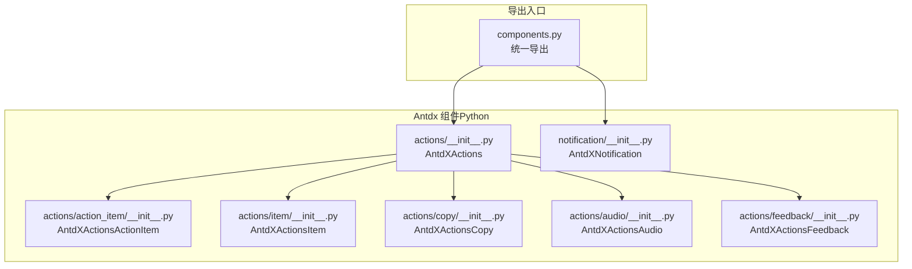
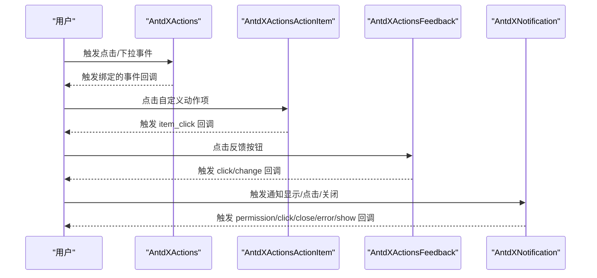
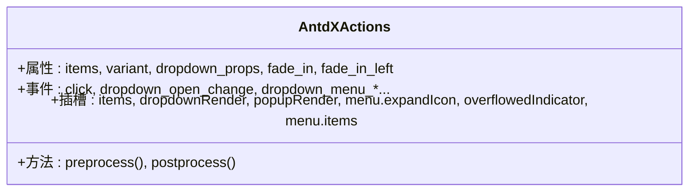
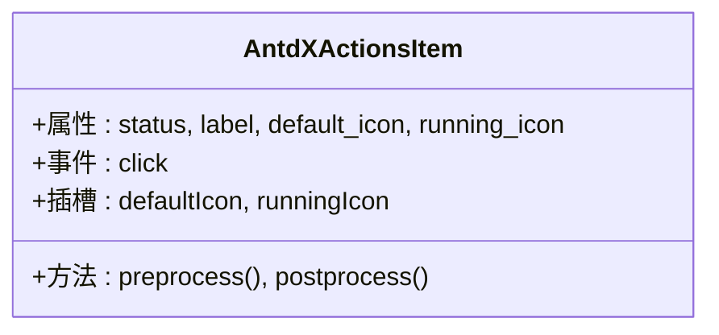
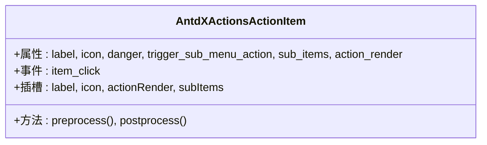
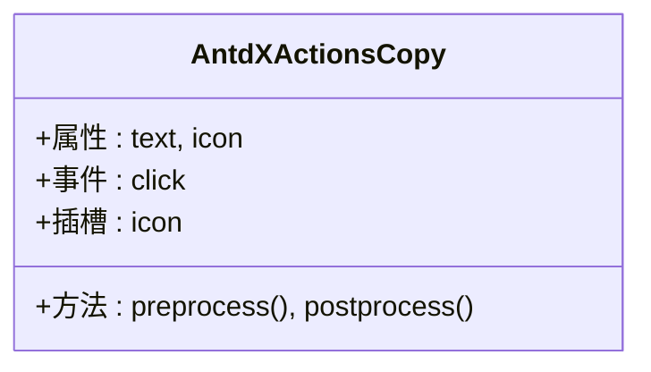
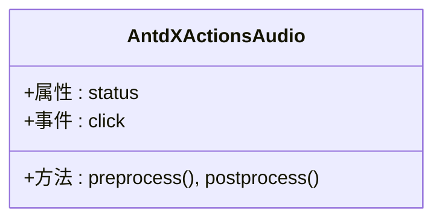
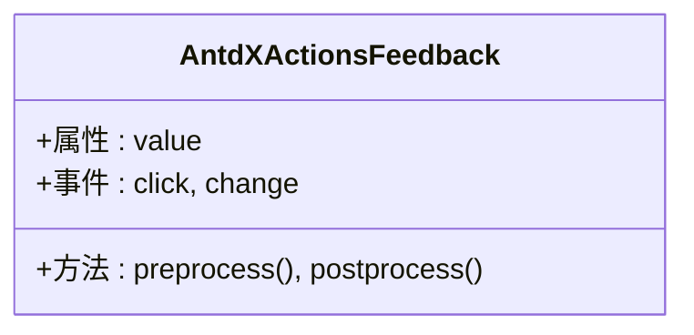
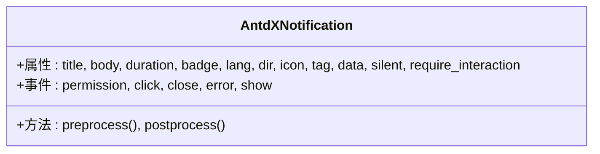
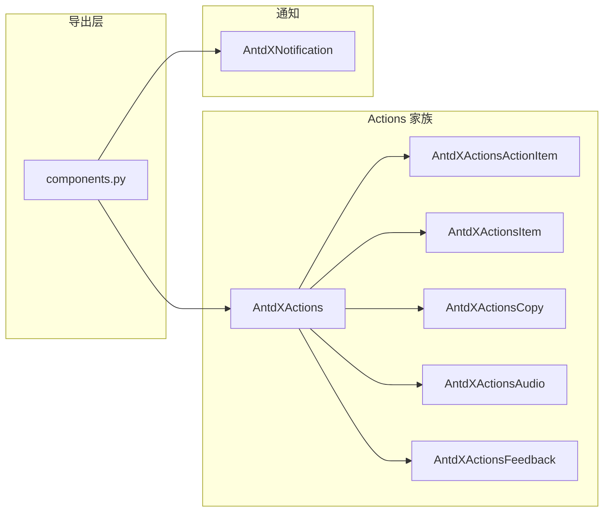

# 反馈组件 API

<cite>
**本文档引用的文件**
- [actions/__init__.py](file://backend/modelscope_studio/components/antdx/actions/__init__.py)
- [action_item/__init__.py](file://backend/modelscope_studio/components/antdx/actions/action_item/__init__.py)
- [item/__init__.py](file://backend/modelscope_studio/components/antdx/actions/item/__init__.py)
- [copy/__init__.py](file://backend/modelscope_studio/components/antdx/actions/copy/__init__.py)
- [audio/__init__.py](file://backend/modelscope_studio/components/antdx/actions/audio/__init__.py)
- [feedback/__init__.py](file://backend/modelscope_studio/components/antdx/actions/feedback/__init__.py)
- [notification/__init__.py](file://backend/modelscope_studio/components/antdx/notification/__init__.py)
- [components.py](file://backend/modelscope_studio/components/antdx/components.py)
</cite>

## 目录

1. [简介](#简介)
2. [项目结构](#项目结构)
3. [核心组件](#核心组件)
4. [架构总览](#架构总览)
5. [详细组件分析](#详细组件分析)
6. [依赖关系分析](#依赖关系分析)
7. [性能考虑](#性能考虑)
8. [故障排查指南](#故障排查指南)
9. [结论](#结论)
10. [附录：使用示例与最佳实践](#附录使用示例与最佳实践)

## 简介

本文件为 Antdx 反馈组件的 Python API 参考文档，覆盖 Actions 组件的操作列表管理、操作项配置与用户交互；ActionsItem 的操作项定义；ActionItem 的具体操作实现；Copy 组件的复制功能；Audio 组件的音频处理；Feedback 组件的反馈收集机制；Notification 组件的通知管理、消息推送与用户反馈响应。文档同时提供事件处理策略、状态同步机制与用户体验优化配置，并给出与聊天机器人集成及用户行为实时反馈的参考方案。

## 项目结构

Antdx 反馈相关组件位于后端 Python 包中，采用按功能模块组织的目录结构，前端资源由前端目录中的 Svelte 组件提供。Python 层通过 Gradio 组件封装与事件绑定，统一暴露给应用层调用。

**图表来源**

- [components.py:1-40](file://backend/modelscope_studio/components/antdx/components.py#L1-L40)
- [actions/**init**.py:15-112](file://backend/modelscope_studio/components/antdx/actions/__init__.py#L15-L112)
- [action_item/**init**.py:10-80](file://backend/modelscope_studio/components/antdx/actions/action_item/__init__.py#L10-L80)
- [item/**init**.py:10-77](file://backend/modelscope_studio/components/antdx/actions/item/__init__.py#L10-L77)
- [copy/**init**.py:10-72](file://backend/modelscope_studio/components/antdx/actions/copy/__init__.py#L10-L72)
- [audio/**init**.py:10-71](file://backend/modelscope_studio/components/antdx/actions/audio/__init__.py#L10-L71)
- [feedback/**init**.py:10-74](file://backend/modelscope_studio/components/antdx/actions/feedback/__init__.py#L10-L74)
- [notification/**init**.py:10-97](file://backend/modelscope_studio/components/antdx/notification/__init__.py#L10-L97)

**章节来源**

- [components.py:1-40](file://backend/modelscope_studio/components/antdx/components.py#L1-L40)

## 核心组件

- AntdXActions：操作集合容器，支持事件绑定与插槽扩展，用于承载多个操作项与子菜单。
- AntdXActionsActionItem：自定义动作项，支持标签、图标、危险样式、触发方式与子项。
- AntdXActionsItem：标准操作项，支持状态（加载/运行/错误/默认）、图标切换与样式定制。
- AntdXActionsCopy：复制操作，绑定点击事件，支持自定义图标与文本。
- AntdXActionsAudio：音频状态指示器，支持状态枚举与样式定制。
- AntdXActionsFeedback：点赞/点踩/默认状态的反馈组件，支持点击与状态变更事件。
- AntdXNotification：通知组件，支持权限、点击、关闭、错误、显示等事件与多语言/方向等属性。

以上组件均继承自统一的布局组件基类，具备 Gradio 兼容的事件绑定与渲染控制能力。

**章节来源**

- [actions/**init**.py:15-112](file://backend/modelscope_studio/components/antdx/actions/__init__.py#L15-L112)
- [action_item/**init**.py:10-80](file://backend/modelscope_studio/components/antdx/actions/action_item/__init__.py#L10-L80)
- [item/**init**.py:10-77](file://backend/modelscope_studio/components/antdx/actions/item/__init__.py#L10-L77)
- [copy/**init**.py:10-72](file://backend/modelscope_studio/components/antdx/actions/copy/__init__.py#L10-L72)
- [audio/**init**.py:10-71](file://backend/modelscope_studio/components/antdx/actions/audio/__init__.py#L10-L71)
- [feedback/**init**.py:10-74](file://backend/modelscope_studio/components/antdx/actions/feedback/__init__.py#L10-L74)
- [notification/**init**.py:10-97](file://backend/modelscope_studio/components/antdx/notification/__init__.py#L10-L97)

## 架构总览

Antdx 反馈组件在 Python 层以 Gradio 组件形式暴露，前端由对应 Svelte 组件实现 UI 行为与交互。组件通过事件监听器绑定回调，实现用户操作到后端的事件传递与状态更新。

**图表来源**

- [actions/**init**.py:26-46](file://backend/modelscope_studio/components/antdx/actions/__init__.py#L26-L46)
- [action_item/**init**.py:15-21](file://backend/modelscope_studio/components/antdx/actions/action_item/__init__.py#L15-L21)
- [feedback/**init**.py:15-23](file://backend/modelscope_studio/components/antdx/actions/feedback/__init__.py#L15-L23)
- [notification/**init**.py:14-30](file://backend/modelscope_studio/components/antdx/notification/__init__.py#L14-L30)

## 详细组件分析

### Actions 组件（AntdXActions）

- 职责：作为操作集合容器，管理操作项列表、下拉菜单属性与动画效果；支持事件绑定与插槽扩展。
- 关键属性
  - items：操作项数组，用于初始化操作列表。
  - variant：外观变体（如 borderless/outlined/filled）。
  - dropdown_props：下拉菜单相关属性对象。
  - fade_in/fade_in_left：进入动画开关。
  - class_names/styles：样式类名与内联样式映射。
  - 插槽：items、dropdownRender、popupRender、menu.expandIcon、overflowedIndicator、menu.items。
- 事件
  - click：任意操作项被点击时触发。
  - dropdown_open_change/dropdown_menu_open_change：下拉打开/菜单打开状态变化。
  - dropdown_menu_click/dropdown_menu_deselect/dropdown_menu_select：菜单项点击/取消选择/选择事件。
- 处理流程
  - 初始化时设置内部绑定标志位，使前端事件可回传至后端。
  - 渲染时根据 items 与 dropdown_props 动态生成操作项与菜单结构。
  - 通过插槽扩展自定义渲染逻辑。

**图表来源**

- [actions/**init**.py:58-94](file://backend/modelscope_studio/components/antdx/actions/__init__.py#L58-L94)

**章节来源**

- [actions/**init**.py:15-112](file://backend/modelscope_studio/components/antdx/actions/__init__.py#L15-L112)

### ActionsItem（AntdXActionsItem）

- 职责：标准操作项，支持状态切换与图标替换。
- 关键属性
  - status：状态枚举（loading/error/running/default）。
  - label：显示标签。
  - default_icon/running_icon：默认图标与运行中图标。
  - class_names/styles：样式类名与内联样式映射。
  - 插槽：defaultIcon、runningIcon。
- 事件
  - click：项被点击时触发。
- 使用建议
  - 结合 Actions 组件的 items 字段进行批量配置。
  - 通过插槽自定义不同状态下的图标与文案。

**图表来源**

- [item/**init**.py:24-59](file://backend/modelscope_studio/components/antdx/actions/item/__init__.py#L24-L59)

**章节来源**

- [item/**init**.py:10-77](file://backend/modelscope_studio/components/antdx/actions/item/__init__.py#L10-L77)

### ActionItem（AntdXActionsActionItem）

- 职责：自定义动作项，支持标签、图标、危险样式、子项与触发方式。
- 关键属性
  - label/icon：标签与图标。
  - danger：是否危险样式。
  - trigger_sub_menu_action：子菜单触发方式（hover/click）。
  - sub_items：子项数组。
  - action_render：自定义渲染函数标识。
  - 插槽：label、icon、actionRender、subItems。
- 事件
  - item_click：自定义动作按钮被点击时触发。
- 使用建议
  - 适用于复杂菜单或需要自定义渲染的场景。
  - 子项通过 subItems 插槽注入，形成嵌套菜单树。

**图表来源**

- [action_item/**init**.py:26-62](file://backend/modelscope_studio/components/antdx/actions/action_item/__init__.py#L26-L62)

**章节来源**

- [action_item/**init**.py:10-80](file://backend/modelscope_studio/components/antdx/actions/action_item/__init__.py#L10-L80)

### Copy 组件（AntdXActionsCopy）

- 职责：提供一键复制功能，常用于代码块、链接等文本复制。
- 关键属性
  - text：待复制文本。
  - icon：自定义图标。
  - class_names/styles：样式类名与内联样式映射。
  - 插槽：icon。
- 事件
  - click：复制按钮被点击时触发。
- 使用建议
  - 与 ActionItem 或 ActionsItem 搭配使用，提升用户操作效率。
  - 注意浏览器权限与剪贴板 API 的兼容性。

**图表来源**

- [copy/**init**.py:24-54](file://backend/modelscope_studio/components/antdx/actions/copy/__init__.py#L24-L54)

**章节来源**

- [copy/**init**.py:10-72](file://backend/modelscope_studio/components/antdx/actions/copy/__init__.py#L10-L72)

### Audio 组件（AntdXActionsAudio）

- 职责：音频状态指示器，用于展示录音/播放/加载/错误等状态。
- 关键属性
  - status：状态枚举（loading/error/running/default）。
  - class_names/styles：样式类名与内联样式映射。
  - 插槽：无。
- 事件
  - click：音频控件被点击时触发。
- 使用建议
  - 与录音/播放功能配合，提供即时状态反馈。
  - 通过样式定制适配主题色板。

**图表来源**

- [audio/**init**.py:24-53](file://backend/modelscope_studio/components/antdx/actions/audio/__init__.py#L24-L53)

**章节来源**

- [audio/**init**.py:10-71](file://backend/modelscope_studio/components/antdx/actions/audio/__init__.py#L10-L71)

### Feedback 组件（AntdXActionsFeedback）

- 职责：收集用户对内容/对话的反馈，支持点赞/点踩/默认状态。
- 关键属性
  - value：当前反馈值（like/dislike/default）。
  - class_names/styles：样式类名与内联样式映射。
  - 插槽：无。
- 事件
  - click：反馈按钮被点击时触发。
  - change：反馈状态发生改变时触发。
- 使用建议
  - 与聊天机器人输出或内容卡片搭配，形成闭环反馈链路。
  - 通过 change 事件上报数据，结合后端存储与统计。

**图表来源**

- [feedback/**init**.py:28-56](file://backend/modelscope_studio/components/antdx/actions/feedback/__init__.py#L28-L56)

**章节来源**

- [feedback/**init**.py:10-74](file://backend/modelscope_studio/components/antdx/actions/feedback/__init__.py#L10-L74)

### Notification 组件（AntdXNotification）

- 职责：系统通知管理，支持权限、点击、关闭、错误、显示等事件与国际化/方向等属性。
- 关键属性
  - title/body：标题与正文。
  - duration：显示时长。
  - badge/lang/dir/icon/tag/data/silent/require_interaction：徽标、语言、方向、图标、标签、数据、静默模式、需交互。
  - 插槽：无。
- 事件
  - permission/click/close/error/show：权限请求、点击、关闭、错误、显示。
- 使用建议
  - 用于系统提示、权限提醒、错误告警与用户反馈响应。
  - 结合 Feedback 组件，形成“通知—反馈”的闭环。

**图表来源**

- [notification/**init**.py:35-79](file://backend/modelscope_studio/components/antdx/notification/__init__.py#L35-L79)

**章节来源**

- [notification/**init**.py:10-97](file://backend/modelscope_studio/components/antdx/notification/__init__.py#L10-L97)

## 依赖关系分析

- 统一导出：components.py 将所有 Antdx 组件集中导出，便于上层应用按需引入。
- 组件间关系：Actions 容器组合 ActionItem、Item、Copy、Audio、Feedback 等子组件；Notification 独立存在，可与 Feedback 协同使用。

**图表来源**

- [components.py:1-40](file://backend/modelscope_studio/components/antdx/components.py#L1-L40)
- [actions/**init**.py:15-25](file://backend/modelscope_studio/components/antdx/actions/__init__.py#L15-L25)
- [notification/**init**.py:10-13](file://backend/modelscope_studio/components/antdx/notification/__init__.py#L10-L13)

**章节来源**

- [components.py:1-40](file://backend/modelscope_studio/components/antdx/components.py#L1-L40)

## 性能考虑

- 事件绑定最小化：仅在需要时启用事件绑定，避免不必要的回调开销。
- 插槽渲染：合理使用插槽减少重复渲染，保持 DOM 结构简洁。
- 状态同步：通过组件状态与事件联动，避免频繁全量刷新。
- 样式与动画：谨慎使用进入动画与复杂样式，确保在低端设备上的流畅度。

## 故障排查指南

- 事件未触发
  - 检查事件绑定是否正确启用（如 click、dropdown\_\*、item_click、change）。
  - 确认前端插槽与属性配置是否匹配。
- 状态不一致
  - 核对 value/status 的取值范围与默认值。
  - 在 change 事件中检查状态变更逻辑。
- 样式异常
  - 检查 class_names/styles 是否覆盖了默认样式。
  - 确认主题与全局样式冲突。
- 通知无效
  - 检查权限事件 permission 的处理流程。
  - 确认显示时长与交互需求配置。

**章节来源**

- [actions/**init**.py:26-46](file://backend/modelscope_studio/components/antdx/actions/__init__.py#L26-L46)
- [action_item/**init**.py:15-21](file://backend/modelscope_studio/components/antdx/actions/action_item/__init__.py#L15-L21)
- [feedback/**init**.py:15-23](file://backend/modelscope_studio/components/antdx/actions/feedback/__init__.py#L15-L23)
- [notification/**init**.py:14-30](file://backend/modelscope_studio/components/antdx/notification/__init__.py#L14-L30)

## 结论

Antdx 反馈组件通过清晰的组件分层与事件绑定机制，提供了从操作项管理、复制与音频状态指示到用户反馈与通知管理的完整能力。结合统一导出与插槽扩展，开发者可在多种场景中快速构建高质量的用户反馈与交互体验。

## 附录：使用示例与最佳实践

- 用户操作反馈
  - 在内容卡片或对话输出后添加 Feedback 组件，绑定 click 与 change 事件，上报用户偏好。
  - 示例路径：[feedback/**init**.py:15-23](file://backend/modelscope_studio/components/antdx/actions/feedback/__init__.py#L15-L23)
- 快捷操作
  - 使用 Actions 组合 ActionItem 与 Item，配置 subItems 形成二级菜单；通过插槽自定义图标与文案。
  - 示例路径：[actions/**init**.py:48-56](file://backend/modelscope_studio/components/antdx/actions/__init__.py#L48-L56)、[action_item/**init**.py:23-24](file://backend/modelscope_studio/components/antdx/actions/action_item/__init__.py#L23-L24)
- 音频交互
  - 使用 Audio 组件展示录音/播放状态，结合 click 事件控制播放/暂停。
  - 示例路径：[audio/**init**.py:15-19](file://backend/modelscope_studio/components/antdx/actions/audio/__init__.py#L15-L19)
- 复制功能
  - 在代码块或链接旁放置 Copy 组件，绑定 click 事件，提升复制效率。
  - 示例路径：[copy/**init**.py:15-19](file://backend/modelscope_studio/components/antdx/actions/copy/__init__.py#L15-L19)
- 通知管理
  - 使用 Notification 组件进行系统提示与权限提醒，绑定 permission/click/close/error/show 事件。
  - 示例路径：[notification/**init**.py:14-30](file://backend/modelscope_studio/components/antdx/notification/__init__.py#L14-L30)
- 与聊天机器人集成
  - 在聊天输出后插入 Feedback 组件，通过 change 事件上报用户反馈；必要时弹出 Notification 进行确认或错误提示。
  - 示例路径：[feedback/**init**.py:15-23](file://backend/modelscope_studio/components/antdx/actions/feedback/__init__.py#L15-L23)、[notification/**init**.py:14-30](file://backend/modelscope_studio/components/antdx/notification/__init__.py#L14-L30)
