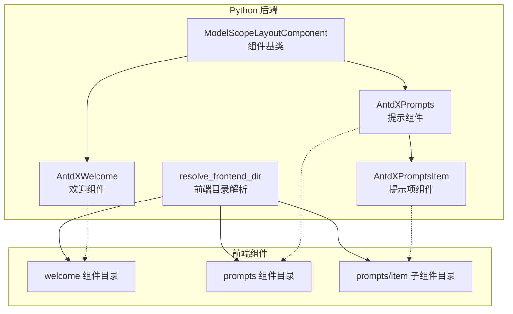
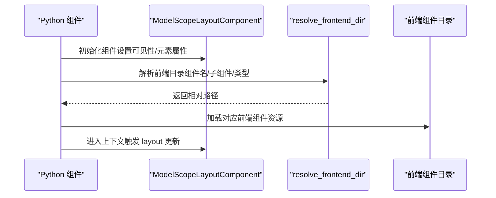
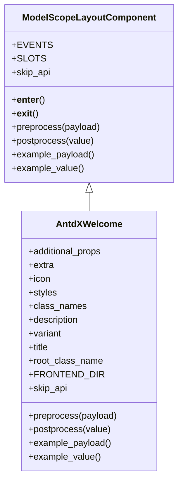
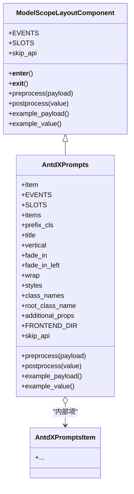
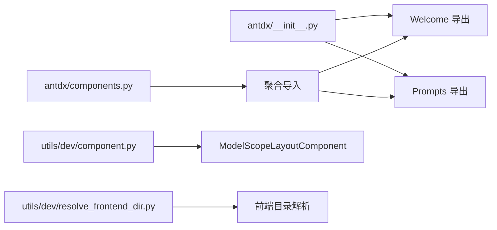

# 唤醒组件 API

<cite>
**本文引用的文件**
- [backend/modelscope_studio/components/antdx/welcome/__init__.py](file://backend/modelscope_studio/components/antdx/welcome/__init__.py)
- [backend/modelscope_studio/components/antdx/prompts/__init__.py](file://backend/modelscope_studio/components/antdx/prompts/__init__.py)
- [backend/modelscope_studio/components/antdx/components.py](file://backend/modelscope_studio/components/antdx/components.py)
- [backend/modelscope_studio/components/antdx/__init__.py](file://backend/modelscope_studio/components/antdx/__init__.py)
- [backend/modelscope_studio/utils/dev/component.py](file://backend/modelscope_studio/utils/dev/component.py)
- [backend/modelscope_studio/utils/dev/resolve_frontend_dir.py](file://backend/modelscope_studio/utils/dev/resolve_frontend_dir.py)
- [docs/components/antdx/welcome/app.py](file://docs/components/antdx/welcome/app.py)
- [docs/components/antdx/prompts/app.py](file://docs/components/antdx/prompts/app.py)
</cite>

## 目录

1. [简介](#简介)
2. [项目结构](#项目结构)
3. [核心组件](#核心组件)
4. [架构总览](#架构总览)
5. [详细组件分析](#详细组件分析)
6. [依赖分析](#依赖分析)
7. [性能考虑](#性能考虑)
8. [故障排查指南](#故障排查指南)
9. [结论](#结论)
10. [附录](#附录)

## 简介

本文件为 Antdx 唤醒组件的 Python API 参考文档，聚焦以下目标：

- 记录 Welcome 组件的欢迎界面展示、欢迎消息配置与用户引导流程
- 说明 Prompts 组件的提示集管理、提示模板定义与动态提示生成机制
- 提供 Welcome 组件的消息格式、个性化配置选项与多语言支持说明
- 给出 AI 助手启动、用户引导、提示激活等标准使用示例
- 说明初始化参数、回调函数配置与用户体验优化策略
- 说明与对话系统的集成方式与状态同步机制

## 项目结构

Antdx 组件位于后端 Python 包中，通过统一的布局组件基类与前端目录解析机制进行桥接。Welcome 与 Prompts 组件均继承自通用布局组件基类，并通过 resolve_frontend_dir 指向对应的前端组件目录。

图表来源

- [backend/modelscope_studio/utils/dev/component.py:11-50](file://backend/modelscope_studio/utils/dev/component.py#L11-L50)
- [backend/modelscope_studio/components/antdx/welcome/**init**.py:55-55](file://backend/modelscope_studio/components/antdx/welcome/__init__.py#L55-L55)
- [backend/modelscope_studio/components/antdx/prompts/**init**.py:70-70](file://backend/modelscope_studio/components/antdx/prompts/__init__.py#L70-L70)
- [backend/modelscope_studio/utils/dev/resolve_frontend_dir.py:4-16](file://backend/modelscope_studio/utils/dev/resolve_frontend_dir.py#L4-L16)

章节来源

- [backend/modelscope_studio/components/antdx/components.py:24-39](file://backend/modelscope_studio/components/antdx/components.py#L24-L39)
- [backend/modelscope_studio/components/antdx/**init**.py:1-42](file://backend/modelscope_studio/components/antdx/__init__.py#L1-L42)

## 核心组件

- AntdXWelcome：用于渲染欢迎界面，支持标题、描述、图标、额外内容等插槽化配置，以及样式与变体控制。
- AntdXPrompts：用于展示一组提示词卡片，支持标题、垂直排列、淡入动画、换行等配置；内置 item_click 回调事件以响应点击行为。

章节来源

- [backend/modelscope_studio/components/antdx/welcome/**init**.py:8-73](file://backend/modelscope_studio/components/antdx/welcome/__init__.py#L8-L73)
- [backend/modelscope_studio/components/antdx/prompts/**init**.py:11-88](file://backend/modelscope_studio/components/antdx/prompts/__init__.py#L11-L88)

## 架构总览

Antdx 组件通过统一的布局组件基类与前端目录解析器连接到对应前端组件目录。组件在初始化时设置前端目录路径，并通过 Gradio 的 BlockContext 机制参与布局更新与内部状态传递。

图表来源

- [backend/modelscope_studio/utils/dev/component.py:24-26](file://backend/modelscope_studio/utils/dev/component.py#L24-L26)
- [backend/modelscope_studio/utils/dev/resolve_frontend_dir.py:4-16](file://backend/modelscope_studio/utils/dev/resolve_frontend_dir.py#L4-L16)
- [backend/modelscope_studio/components/antdx/welcome/**init**.py:55-55](file://backend/modelscope_studio/components/antdx/welcome/__init__.py#L55-L55)
- [backend/modelscope_studio/components/antdx/prompts/**init**.py:70-70](file://backend/modelscope_studio/components/antdx/prompts/__init__.py#L70-L70)

## 详细组件分析

### Welcome 组件 API

- 组件定位：AntdXWelcome
- 继承关系：ModelScopeLayoutComponent
- 插槽支持：extra、icon、description、title
- 关键参数
  - extra：额外内容（字符串或 None）
  - icon：图标资源路径（将通过静态文件服务处理）
  - description：描述文本
  - title：标题文本
  - variant：外观变体（可选 filled 或 borderless）
  - styles/class_names/root_class_name：样式与类名配置
  - 元素属性：elem_id、elem_classes、elem_style、visible、render 等
- 生命周期与预处理
  - preprocess/postprocess/example_payload/example_value 均返回空值，表明该组件不进行数据转换或示例值生成
- 事件
  - 无公开事件绑定（EVENTS 为空）

图表来源

- [backend/modelscope_studio/utils/dev/component.py:11-50](file://backend/modelscope_studio/utils/dev/component.py#L11-L50)
- [backend/modelscope_studio/components/antdx/welcome/**init**.py:8-73](file://backend/modelscope_studio/components/antdx/welcome/__init__.py#L8-L73)

章节来源

- [backend/modelscope_studio/components/antdx/welcome/**init**.py:17-54](file://backend/modelscope_studio/components/antdx/welcome/__init__.py#L17-L54)
- [backend/modelscope_studio/components/antdx/welcome/**init**.py:57-73](file://backend/modelscope_studio/components/antdx/welcome/__init__.py#L57-L73)

### Prompts 组件 API

- 组件定位：AntdXPrompts
- 继承关系：ModelScopeLayoutComponent
- 内部项：AntdXPromptsItem（通过 Item 属性暴露）
- 插槽支持：title、items
- 关键参数
  - items：提示项列表（字典列表，具体字段由前端约定）
  - prefix_cls：前缀类名（用于样式隔离）
  - title：提示集合标题
  - vertical：是否垂直排列
  - fade_in/fade_in_left：淡入动画开关
  - wrap：是否换行
  - styles/class_names/root_class_name/additional_props：样式与扩展属性
  - 元素属性：elem_id、elem_classes、elem_style、visible、render 等
- 事件
  - item_click：当某提示项被点击时触发回调，内部通过 \_internal.update(bind_itemClick_event=True) 配置前端事件绑定
- 生命周期与预处理
  - preprocess/postprocess/example_payload/example_value 均返回空值，表明该组件不进行数据转换或示例值生成

图表来源

- [backend/modelscope_studio/utils/dev/component.py:11-50](file://backend/modelscope_studio/utils/dev/component.py#L11-L50)
- [backend/modelscope_studio/components/antdx/prompts/**init**.py:11-88](file://backend/modelscope_studio/components/antdx/prompts/__init__.py#L11-L88)

章节来源

- [backend/modelscope_studio/components/antdx/prompts/**init**.py:18-23](file://backend/modelscope_studio/components/antdx/prompts/__init__.py#L18-L23)
- [backend/modelscope_studio/components/antdx/prompts/**init**.py:28-68](file://backend/modelscope_studio/components/antdx/prompts/__init__.py#L28-L68)
- [backend/modelscope_studio/components/antdx/prompts/**init**.py:72-88](file://backend/modelscope_studio/components/antdx/prompts/__init__.py#L72-L88)

### 使用示例与最佳实践

- AI 助手启动与欢迎页展示
  - 在应用启动时渲染 Welcome 组件，设置标题、描述与图标，必要时通过 extra 插槽添加引导按钮或操作区
  - 通过 variant 控制外观风格，通过 styles/class_names/root_class_name 实现主题适配
- 用户引导与提示激活
  - 使用 Prompts 组件展示一组提示词卡片，设置 title 与 items，启用 fade_in/fade_in_left 增强视觉体验
  - 通过 item_click 事件监听用户选择，结合对话系统将选中提示注入到输入框或直接发起对话
- 多语言支持
  - 标题、描述、提示文本应来自本地化资源；Welcome 与 Prompts 的文本参数均支持字符串类型，便于替换为不同语言版本
- 状态同步与集成
  - 组件通过 Gradio BlockContext 参与布局更新；如需与对话系统联动，可在 item_click 回调中触发业务逻辑（例如将提示内容写入输入域或发起请求），并在前端完成状态渲染

章节来源

- [docs/components/antdx/welcome/app.py:1-7](file://docs/components/antdx/welcome/app.py#L1-L7)
- [docs/components/antdx/prompts/app.py:1-7](file://docs/components/antdx/prompts/app.py#L1-L7)

## 依赖分析

- 组件导出
  - antdx/**init**.py 将 Welcome 与 Prompts 作为别名导出，便于外部按名称导入
  - antdx/components.py 聚合了各子模块，确保完整导入链路
- 基类与工具
  - ModelScopeLayoutComponent 提供统一的布局组件能力与生命周期钩子
  - resolve_frontend_dir 将组件名映射到前端目录，支持子组件与多级目录拼接

图表来源

- [backend/modelscope_studio/components/antdx/**init**.py:1-42](file://backend/modelscope_studio/components/antdx/__init__.py#L1-L42)
- [backend/modelscope_studio/components/antdx/components.py:24-39](file://backend/modelscope_studio/components/antdx/components.py#L24-L39)
- [backend/modelscope_studio/utils/dev/component.py:11-50](file://backend/modelscope_studio/utils/dev/component.py#L11-L50)
- [backend/modelscope_studio/utils/dev/resolve_frontend_dir.py:4-16](file://backend/modelscope_studio/utils/dev/resolve_frontend_dir.py#L4-L16)

章节来源

- [backend/modelscope_studio/components/antdx/**init**.py:1-42](file://backend/modelscope_studio/components/antdx/__init__.py#L1-L42)
- [backend/modelscope_studio/components/antdx/components.py:24-39](file://backend/modelscope_studio/components/antdx/components.py#L24-L39)

## 性能考虑

- 组件跳过 API：两个组件的 skip_api 均返回 True，意味着不会生成额外的 API 接口层，减少服务端开销
- 预处理与后处理：preprocess/postprocess 返回空值，避免不必要的数据转换，有利于低延迟渲染
- 动画与布局：Prompts 的淡入与换行选项仅影响前端渲染，建议在大量提示项时谨慎开启动画以平衡流畅度与性能

## 故障排查指南

- 组件未显示
  - 检查 visible 与 render 参数是否正确设置
  - 确认 elem_id/ elem_classes/ elem_style 是否导致样式覆盖
- 图标或资源无法加载
  - 确认 icon 路径已通过静态文件服务处理（serve_static_file）
- 事件未触发
  - 确认 item_click 事件已在初始化时绑定（内部通过 \_internal.update(bind_itemClick_event=True) 触发）
- 前端目录解析失败
  - 检查 resolve_frontend_dir 的组件名与类型是否匹配实际前端目录结构

章节来源

- [backend/modelscope_studio/components/antdx/welcome/**init**.py:47-47](file://backend/modelscope_studio/components/antdx/welcome/__init__.py#L47-L47)
- [backend/modelscope_studio/components/antdx/prompts/**init**.py:20-22](file://backend/modelscope_studio/components/antdx/prompts/__init__.py#L20-L22)
- [backend/modelscope_studio/utils/dev/resolve_frontend_dir.py:4-16](file://backend/modelscope_studio/utils/dev/resolve_frontend_dir.py#L4-L16)

## 结论

AntdXWelcome 与 AntdXPrompts 通过统一的布局组件基类与前端目录解析机制，实现了与前端组件的无缝对接。Welcome 注重欢迎页的文案与样式配置，Prompts 则专注于提示集的展示与交互。二者均可通过 Gradio 的布局与事件机制与对话系统集成，实现从“欢迎引导”到“提示激活”的完整用户体验闭环。

## 附录

- 初始化参数速查
  - Welcome：extra、icon、description、title、variant、styles、class_names、root_class_name、elem_id、elem_classes、elem_style、visible、render
  - Prompts：items、prefix_cls、title、vertical、fade_in、fade_in_left、wrap、styles、class_names、root_class_name、additional_props、elem_id、elem_classes、elem_style、visible、render
- 事件速查
  - Prompts：item_click（点击提示项时触发）
