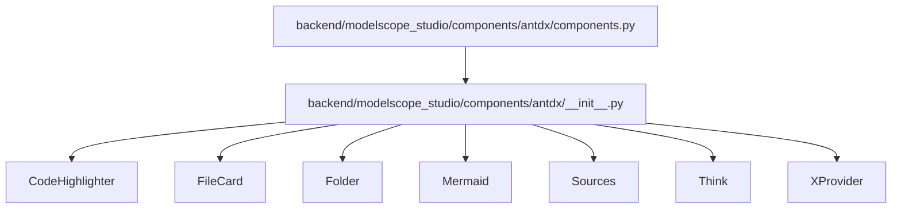
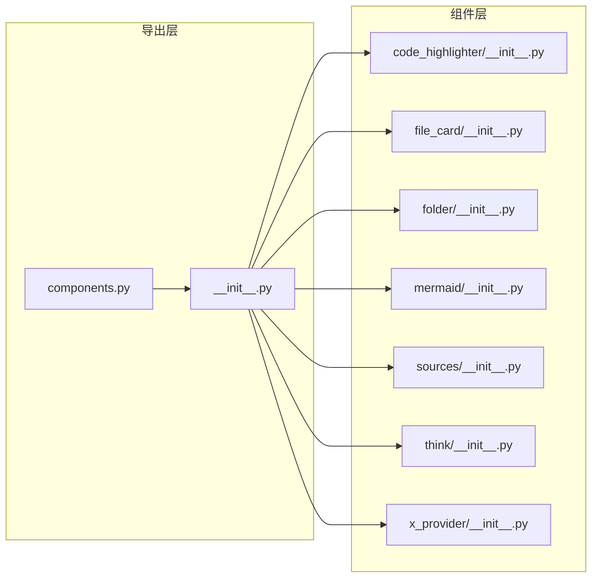

# 工具组件 API

<cite>
**本文档引用的文件**
- [components.py](file://backend/modelscope_studio/components/antdx/components.py)
- [__init__.py](file://backend/modelscope_studio/components/antdx/__init__.py)
- [code_highlighter/__init__.py](file://backend/modelscope_studio/components/antdx/code_highlighter/__init__.py)
- [file_card/__init__.py](file://backend/modelscope_studio/components/antdx/file_card/__init__.py)
- [folder/__init__.py](file://backend/modelscope_studio/components/antdx/folder/__init__.py)
- [mermaid/__init__.py](file://backend/modelscope_studio/components/antdx/mermaid/__init__.py)
- [sources/__init__.py](file://backend/modelscope_studio/components/antdx/sources/__init__.py)
- [think/__init__.py](file://backend/modelscope_studio/components/antdx/think/__init__.py)
- [x_provider/__init__.py](file://backend/modelscope_studio/components/antdx/x_provider/__init__.py)
</cite>

## 目录

1. [简介](#简介)
2. [项目结构](#项目结构)
3. [核心组件](#核心组件)
4. [架构总览](#架构总览)
5. [详细组件分析](#详细组件分析)
6. [依赖关系分析](#依赖关系分析)
7. [性能考虑](#性能考虑)
8. [故障排查指南](#故障排查指南)
9. [结论](#结论)
10. [附录：使用示例与最佳实践](#附录使用示例与最佳实践)

## 简介

本文件为 Antdx 工具组件的 Python API 参考文档，覆盖以下组件的完整 API 规范与使用说明：

- CodeHighlighter：代码高亮显示
- FileCard：文件卡片展示（含列表子组件）
- Folder：文件夹树形结构（含目录图标与树节点子组件）
- Mermaid：流程图绘制
- Sources：源码引用管理（含条目子组件）
- Think：思维标注
- XProvider：全局配置容器

文档从构造函数参数、属性定义、事件与插槽、数据处理与格式化选项、样式与类名定制、性能与渲染策略等方面进行系统梳理，并提供标准使用示例与扩展建议。

## 项目结构

Antdx 组件位于后端 Python 包中，通过统一的布局组件基类封装前端组件，导出别名便于直接使用。核心入口在 antdx 的 **init**.py 中，components.py 负责聚合导出。

图表来源

- [components.py:1-40](file://backend/modelscope_studio/components/antdx/components.py#L1-L40)
- [**init**.py:14-41](file://backend/modelscope_studio/components/antdx/__init__.py#L14-L41)

章节来源

- [components.py:1-40](file://backend/modelscope_studio/components/antdx/components.py#L1-L40)
- [**init**.py:14-41](file://backend/modelscope_studio/components/antdx/__init__.py#L14-L41)

## 核心组件

本节概述各组件的职责与通用特性：

- 均继承自统一的布局组件基类，具备通用的可见性、元素 ID、类名、内联样式、渲染开关等属性。
- 大多组件声明了支持的插槽（SLOTS）与事件（EVENTS），用于前端渲染与交互绑定。
- 多数组件设置 skip_api 为真，表明其不参与标准 API 序列化，而是由前端直连渲染。

章节来源

- [code_highlighter/**init**.py:6-71](file://backend/modelscope_studio/components/antdx/code_highlighter/__init__.py#L6-L71)
- [file_card/**init**.py:11-112](file://backend/modelscope_studio/components/antdx/file_card/__init__.py#L11-L112)
- [folder/**init**.py:12-114](file://backend/modelscope_studio/components/antdx/folder/__init__.py#L12-L114)
- [mermaid/**init**.py:8-77](file://backend/modelscope_studio/components/antdx/mermaid/__init__.py#L8-L77)
- [sources/**init**.py:11-92](file://backend/modelscope_studio/components/antdx/sources/__init__.py#L11-L92)
- [think/**init**.py:8-79](file://backend/modelscope_studio/components/antdx/think/__init__.py#L8-L79)
- [x_provider/**init**.py:10-101](file://backend/modelscope_studio/components/antdx/x_provider/__init__.py#L10-L101)

## 架构总览

下图展示了 Python 层对前端组件的封装关系与导出路径：

```mermaid
classDiagram
class AntdXCodeHighlighter {
+构造函数参数 : value, lang, header, highlight_props, prism_light_mode, styles, class_names, additional_props, root_class_name, as_item, visible, elem_id, elem_classes, elem_style, render
+属性 : SLOTS, EVENTS, skip_api
+方法 : preprocess(), postprocess(), example_payload(), example_value()
}
class AntdXFileCard {
+构造函数参数 : image_props, filename, byte, size, description, loading, type, src, mask, icon, video_props, audio_props, spin_props, styles, class_names, additional_props, as_item, visible, elem_id, elem_classes, elem_style, render
+属性 : SLOTS, EVENTS(List), skip_api
+方法 : preprocess(), postprocess(), example_payload(), example_value()
}
class AntdXFolder {
+构造函数参数 : tree_data, selectable, selected_file, default_selected_file, directory_tree_width, empty_render, preview_render, expanded_paths, default_expanded_paths, default_expand_all, directory_title, preview_title, directory_icons, styles, class_names, additional_props, as_item, visible, elem_id, elem_classes, elem_style, render
+属性 : SLOTS, EVENTS, TreeNode, DirectoryIcon, skip_api
+方法 : preprocess(), postprocess(), example_payload(), example_value()
}
class AntdXMermaid {
+构造函数参数 : value, highlight_props, config, actions, prefix_cls, styles, class_names, additional_props, root_class_name, as_item, visible, elem_id, elem_classes, elem_style, render
+属性 : SLOTS, EVENTS, skip_api
+方法 : preprocess(), postprocess(), example_payload(), example_value()
}
class AntdXSources {
+构造函数参数 : title, items, expand_icon_position, default_expanded, expanded, inline, active_key, popover_overlay_width, styles, class_names, additional_props, as_item, visible, elem_id, elem_classes, elem_style, render
+属性 : SLOTS, EVENTS(Item), skip_api
+方法 : preprocess(), postprocess(), example_payload(), example_value()
}
class AntdXThink {
+构造函数参数 : icon, styles, class_names, loading, title, root_class_name, default_expanded, expanded, blink, as_item, visible, elem_id, elem_classes, elem_style, render
+属性 : SLOTS, EVENTS, skip_api
+方法 : preprocess(), postprocess(), example_payload(), example_value()
}
class AntdXXProvider {
+构造函数参数 : component_disabled, component_size, csp, direction, get_popup_container, get_target_container, icon_prefix_cls, locale, popup_match_select_width, popup_overflow, prefix_cls, render_empty, theme, theme_config, variant, virtual, warning, styles, class_names, additional_props, as_item, visible, elem_id, elem_classes, elem_style, render
+属性 : SLOTS, EVENTS, skip_api
+方法 : preprocess(), postprocess(), example_payload(), example_value()
}
```

图表来源

- [code_highlighter/**init**.py:6-71](file://backend/modelscope_studio/components/antdx/code_highlighter/__init__.py#L6-L71)
- [file_card/**init**.py:11-112](file://backend/modelscope_studio/components/antdx/file_card/__init__.py#L11-L112)
- [folder/**init**.py:12-114](file://backend/modelscope_studio/components/antdx/folder/__init__.py#L12-L114)
- [mermaid/**init**.py:8-77](file://backend/modelscope_studio/components/antdx/mermaid/__init__.py#L8-L77)
- [sources/**init**.py:11-92](file://backend/modelscope_studio/components/antdx/sources/__init__.py#L11-L92)
- [think/**init**.py:8-79](file://backend/modelscope_studio/components/antdx/think/__init__.py#L8-L79)
- [x_provider/**init**.py:10-101](file://backend/modelscope_studio/components/antdx/x_provider/__init__.py#L10-L101)

## 详细组件分析

### CodeHighlighter（代码高亮）

- 组件定位：用于高亮显示代码片段，支持语言与主题模式等配置。
- 关键参数
  - value：要高亮的代码字符串
  - lang：语言标识
  - header：标题或布尔控制
  - highlight_props：高亮相关配置
  - prism_light_mode：浅色模式开关
  - styles/class_names/additional_props/root_class_name/as_item：样式与类名、附加属性、根类名、作为子项
  - visible/elem_id/elem_classes/elem_style/render：通用布局属性
- 插槽：header
- 事件：无
- 数据处理：skip_api 为真，不参与标准 API；preprocess/postprocess 返回原值
- 性能：前端直连渲染，避免额外序列化开销

章节来源

- [code_highlighter/**init**.py:6-71](file://backend/modelscope_studio/components/antdx/code_highlighter/__init__.py#L6-L71)

### FileCard（文件卡片）

- 组件定位：展示文件信息，支持图片、音频、视频、普通文件等多种类型，可配置尺寸、加载状态、遮罩与媒体属性。
- 关键参数
  - image_props：图片预览相关属性
  - filename：文件名
  - byte：字节数
  - size：尺寸 small/default
  - description：描述文本
  - loading：是否显示加载态
  - type：类型 image/file/audio/video 或自定义字符串
  - src：资源地址（支持字符串或包含 path/url 的字典）
  - mask：遮罩文本
  - icon：内置图标类别或自定义字符串
  - video_props/audio_props/spin_props：视频/音频/加载指示器配置
  - styles/class_names/additional_props/as_item/visible/elem_id/elem_classes/elem_style/render：通用布局属性
- 插槽：imageProps.placeholder、imageProps.preview.mask、imageProps.preview.closeIcon、imageProps.preview.toolbarRender、imageProps.preview.imageRender、description、icon、mask、spinProps.icon、spinProps.description、spinProps.indicator
- 事件：click（绑定内部事件）
- 数据处理：skip_api 为真；preprocess/postprocess 返回原值；src 支持静态文件服务包装
- 性能：前端直连渲染；src 字段自动处理静态资源路径

章节来源

- [file_card/**init**.py:11-112](file://backend/modelscope_studio/components/antdx/file_card/__init__.py#L11-L112)

### Folder（文件夹树形结构）

- 组件定位：展示文件夹树与选择/展开行为，支持预览渲染、空态渲染、目录图标等。
- 关键参数
  - tree_data：树形数据
  - selectable：是否可选择
  - selected_file/default_selected_file：选中文件列表
  - directory_tree_width：目录树宽度
  - empty_render/preview_render：空态与预览渲染
  - expanded_paths/default_expanded_paths/default_expand_all：展开路径控制
  - directory_title/preview_title：标题
  - directory_icons：目录图标映射
  - styles/class_names/additional_props/root_class_name/as_item/visible/elem_id/elem_classes/elem_style/render：通用布局属性
- 子组件：TreeNode、DirectoryIcon
- 插槽：emptyRender、previewRender、directoryTitle、previewTitle、treeData、directoryIcons
- 事件：file_click、folder_click、selected_file_change、expanded_paths_change、file_content_service_load_file_content（绑定到内部事件）
- 数据处理：skip_api 为真；preprocess/postprocess 返回原值
- 性能：前端直连渲染；支持默认展开全部

章节来源

- [folder/**init**.py:12-114](file://backend/modelscope_studio/components/antdx/folder/__init__.py#L12-L114)

### Mermaid（流程图绘制）

- 组件定位：基于 Mermaid 语法绘制流程图，支持高亮配置、主题配置与自定义操作。
- 关键参数
  - value：Mermaid 文本
  - highlight_props：高亮配置
  - config：全局配置
  - actions：自定义动作
  - prefix_cls：前缀类名
  - styles/class_names/additional_props/root_class_name/as_item/visible/elem_id/elem_classes/elem_style/render：通用布局属性
- 插槽：header、actions.customActions
- 事件：render_type_change（绑定到内部事件）
- 数据处理：skip_api 为真；preprocess/postprocess 返回原值
- 性能：前端直连渲染

章节来源

- [mermaid/**init**.py:8-77](file://backend/modelscope_studio/components/antdx/mermaid/__init__.py#L8-L77)

### Sources（源码引用管理）

- 组件定位：以折叠面板形式管理源码引用条目，支持展开位置、激活键、弹出层宽度等。
- 关键参数
  - title：标题
  - items：条目列表
  - expand_icon_position：展开图标位置 start/end
  - default_expanded/expanded：默认/当前展开状态
  - inline：是否内联
  - active_key：激活键
  - popover_overlay_width：弹出层宽度
  - styles/class_names/additional_props/root_class_name/as_item/visible/elem_id/elem_classes/elem_style/render：通用布局属性
- 子组件：Item
- 插槽：items
- 事件：expand、click（绑定到内部事件）
- 数据处理：skip_api 为真；preprocess/postprocess 返回原值
- 性能：前端直连渲染

章节来源

- [sources/**init**.py:11-92](file://backend/modelscope_studio/components/antdx/sources/__init__.py#L11-L92)

### Think（思维标注）

- 组件定位：用于展示思维过程或提示信息，支持加载态、标题、闪烁等。
- 关键参数
  - icon：图标
  - styles/class_names/additional_props/root_class_name/as_item/visible/elem_id/elem_classes/elem_style/render：通用布局属性
  - loading：加载态（字符串或布尔）
  - title：标题
  - default_expanded/expanded：默认/当前展开状态
  - blink：闪烁开关
- 插槽：loading、icon、title
- 事件：expand（绑定到内部事件）
- 数据处理：skip_api 为真；preprocess/postprocess 返回原值
- 性能：前端直连渲染

章节来源

- [think/**init**.py:8-79](file://backend/modelscope_studio/components/antdx/think/__init__.py#L8-L79)

### XProvider（全局配置）

- 组件定位：全局配置容器，传递主题、语言、方向、变体等配置至子组件树。
- 关键参数
  - component_disabled：禁用组件
  - component_size：组件尺寸 small/middle/large
  - csp：内容安全策略
  - direction：方向 ltr/rtl
  - get_popup_container/get_target_container：弹窗容器选择器
  - icon_prefix_cls：图标前缀类名
  - locale：语言环境
  - popup_match_select_width：弹窗匹配选择宽度
  - popup_overflow：弹窗溢出策略 viewport/scroll
  - prefix_cls：组件前缀类名
  - render_empty：空状态渲染
  - theme/theme_config：主题与主题配置（存在冲突警告）
  - variant：外观 outlined/filled/borderless
  - virtual：虚拟化
  - warning：警告配置
  - styles/class_names/additional_props/as_item/visible/elem_id/elem_classes/elem_style/render：通用布局属性
- 插槽：renderEmpty
- 事件：无
- 数据处理：skip_api 为真；preprocess/postprocess 返回原值
- 性能：前端直连渲染；注意 theme 与 theme_config 冲突提示

章节来源

- [x_provider/**init**.py:10-101](file://backend/modelscope_studio/components/antdx/x_provider/__init__.py#L10-L101)

## 依赖关系分析

- 导出关系：components.py 聚合导入 antdx 下各组件模块；**init**.py 将组件类导出为易用别名。
- 组件间关系：部分组件提供子组件（如 FileCard.List、Folder.TreeNode/Folder.DirectoryIcon、Sources.Item、Think 等），用于组合复杂 UI。
- 事件绑定：多数组件通过事件监听器回调更新内部状态标志位，从而触发前端事件绑定。

图表来源

- [components.py:1-40](file://backend/modelscope_studio/components/antdx/components.py#L1-L40)
- [**init**.py:14-41](file://backend/modelscope_studio/components/antdx/__init__.py#L14-L41)

章节来源

- [components.py:1-40](file://backend/modelscope_studio/components/antdx/components.py#L1-L40)
- [**init**.py:14-41](file://backend/modelscope_studio/components/antdx/__init__.py#L14-L41)

## 性能考虑

- 跳过 API 序列化：所有组件均设置 skip_api 为真，避免不必要的 Python 到前端数据往返，提升渲染效率。
- 前端直连：组件通过 resolve_frontend_dir 指向前端组件目录，减少中间层转换成本。
- 静态资源：FileCard 对 src 进行静态文件服务包装，降低资源访问延迟。
- 默认展开：Folder 支持 default_expand_all，可在初始化时一次性展开，减少用户交互次数。
- 主题与变体：XProvider 提供统一主题与外观配置，避免重复计算与样式切换开销。

## 故障排查指南

- 组件未生效
  - 检查 visible、render 是否为真
  - 确认 elem_id/elem_classes/elem_style 是否正确传入
- 文件资源无法加载
  - FileCard 的 src 为字典时需确保包含 path 或 url；必要时使用静态文件服务包装
- 事件未触发
  - 确认事件监听器名称与组件 EVENTS 定义一致
  - 检查前端是否正确绑定内部事件标志位
- 主题冲突
  - XProvider 中 theme 与 Gradio 预设属性冲突，应使用 theme_config 替代
- 渲染异常
  - Mermaid/CodeHighlighter/Sources/Think 的插槽内容需按规范提供，避免前端解析错误

章节来源

- [file_card/**init**.py:87-93](file://backend/modelscope_studio/components/antdx/file_card/__init__.py#L87-L93)
- [x_provider/**init**.py:74-78](file://backend/modelscope_studio/components/antdx/x_provider/__init__.py#L74-L78)

## 结论

Antdx 工具组件通过统一的布局组件基类与前端直连渲染策略，提供了简洁而强大的 Python API。各组件围绕“参数驱动 + 插槽 + 事件绑定”的模式组织，既满足常见场景（代码高亮、文件展示、树形导航、流程图、源码引用、思维标注、全局配置），又为扩展与定制留足空间。建议在实际项目中优先使用组件提供的子组件与插槽，配合 XProvider 进行全局样式与主题管理，并遵循静态资源与事件绑定的最佳实践。

## 附录：使用示例与最佳实践

- 代码高亮
  - 场景：在对话或文档中展示代码片段
  - 建议：指定 lang 与 highlight_props；必要时开启 prism_light_mode
  - 参考路径：[code_highlighter/**init**.py:15-52](file://backend/modelscope_studio/components/antdx/code_highlighter/__init__.py#L15-L52)
- 文件卡片
  - 场景：上传或浏览文件列表
  - 建议：根据 type 设置 icon；src 使用静态文件服务包装；合理设置 size 与 loading
  - 参考路径：[file_card/**init**.py:32-94](file://backend/modelscope_studio/components/antdx/file_card/__init__.py#L32-L94)
- 文件夹树
  - 场景：文件浏览与选择
  - 建议：tree_data 结构清晰；default_expand_all 仅在数据量可控时启用；使用 directory_icons 自定义图标
  - 参考路径：[folder/**init**.py:43-96](file://backend/modelscope_studio/components/antdx/folder/__init__.py#L43-L96)
- 流程图
  - 场景：可视化算法或业务流程
  - 建议：value 使用标准 Mermaid 语法；config 与 actions 按需配置
  - 参考路径：[mermaid/**init**.py:21-58](file://backend/modelscope_studio/components/antdx/mermaid/__init__.py#L21-L58)
- 源码引用
  - 场景：展示引用来源与条目
  - 建议：items 结构标准化；inline 与 expand_icon_position 按界面风格选择
  - 参考路径：[sources/**init**.py:30-73](file://backend/modelscope_studio/components/antdx/sources/__init__.py#L30-L73)
- 思维标注
  - 场景：提示用户关注要点或加载状态
  - 建议：title 与 icon 明确表达意图；blink 仅在强调时使用
  - 参考路径：[think/**init**.py:21-60](file://backend/modelscope_studio/components/antdx/think/__init__.py#L21-L60)
- 全局配置
  - 场景：统一主题、语言、方向与外观
  - 建议：优先使用 theme_config；locale 与 direction 按地区配置；prefix_cls 与 icon_prefix_cls 保持一致性
  - 参考路径：[x_provider/**init**.py:19-82](file://backend/modelscope_studio/components/antdx/x_provider/__init__.py#L19-L82)
