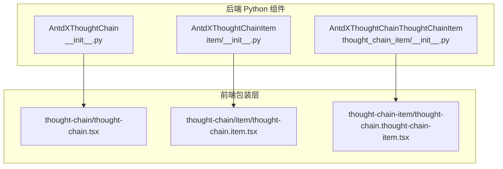
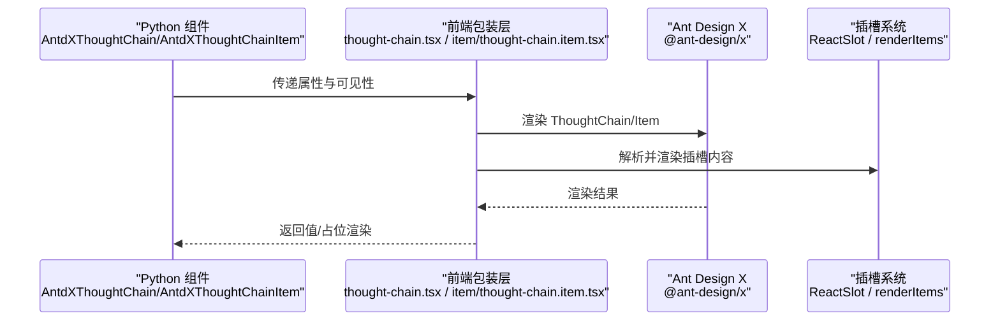
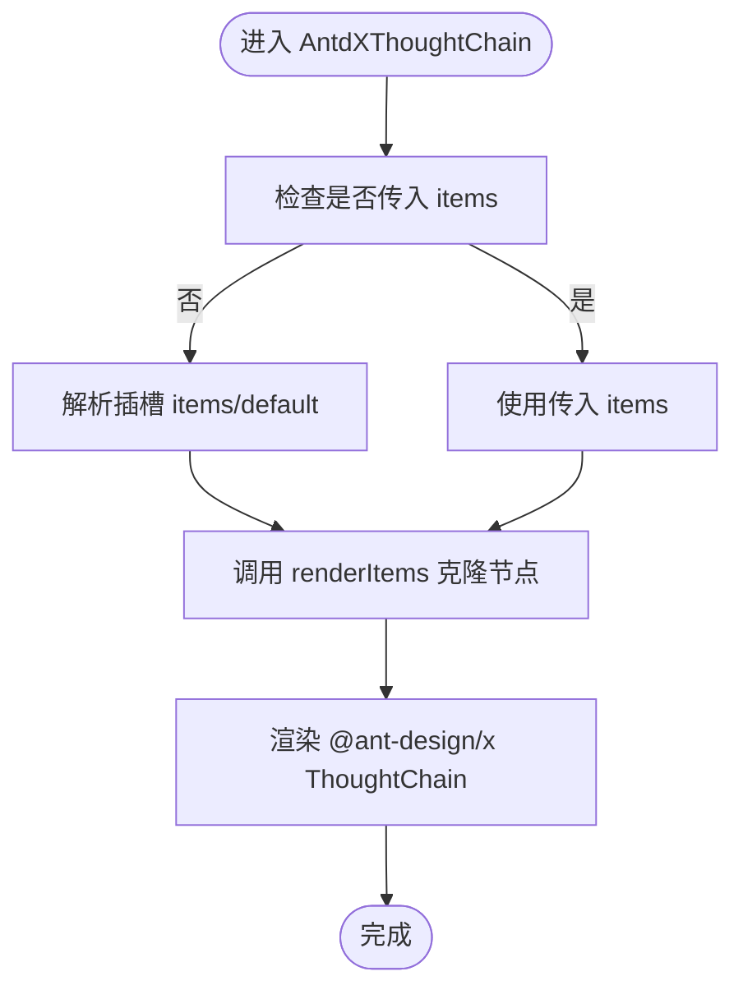
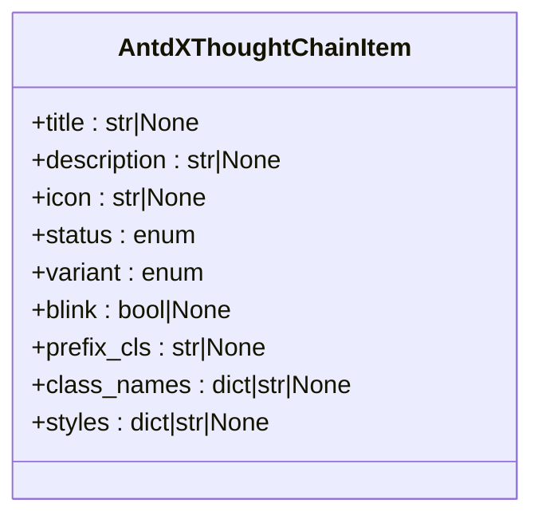
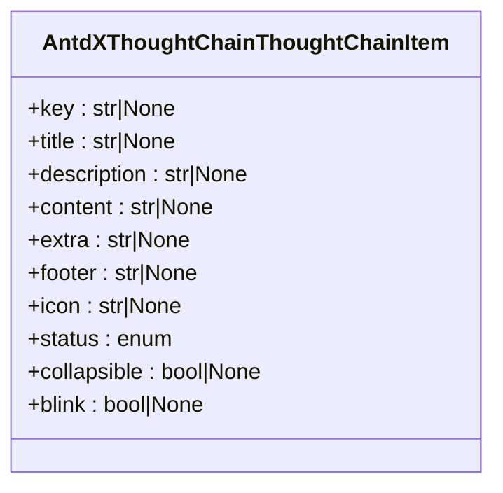
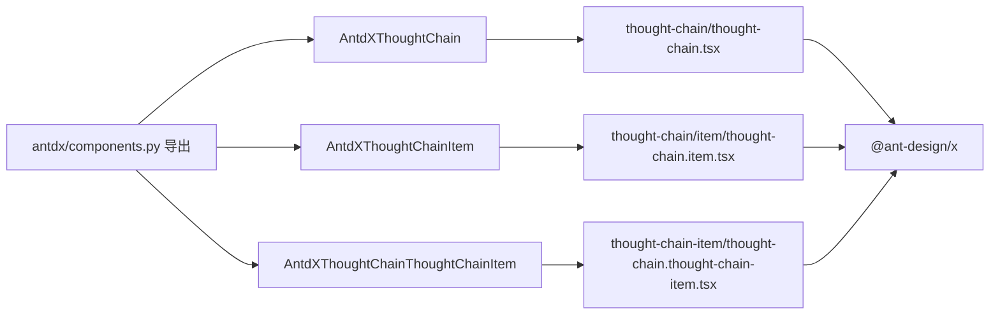

# 确认组件 API

<cite>
**本文引用的文件**
- [backend/modelscope_studio/components/antdx/thought_chain/__init__.py](file://backend/modelscope_studio/components/antdx/thought_chain/__init__.py)
- [backend/modelscope_studio/components/antdx/thought_chain/item/__init__.py](file://backend/modelscope_studio/components/antdx/thought_chain/item/__init__.py)
- [backend/modelscope_studio/components/antdx/thought_chain/thought_chain_item/__init__.py](file://backend/modelscope_studio/components/antdx/thought_chain/thought_chain_item/__init__.py)
- [frontend/antdx/thought-chain/thought-chain.tsx](file://frontend/antdx/thought-chain/thought-chain.tsx)
- [frontend/antdx/thought-chain/item/thought-chain.item.tsx](file://frontend/antdx/thought-chain/item/thought-chain.item.tsx)
- [frontend/antdx/thought-chain/thought-chain-item/thought-chain.thought-chain-item.tsx](file://frontend/antdx/thought-chain/thought-chain-item/thought-chain.thought-chain-item.tsx)
- [backend/modelscope_studio/components/antdx/components.py](file://backend/modelscope_studio/components/antdx/components.py)
- [docs/components/antdx/thought_chain/demos/basic.py](file://docs/components/antdx/thought_chain/demos/basic.py)
- [docs/components/antdx/thought_chain/demos/item_status.py](file://docs/components/antdx/thought_chain/demos/item_status.py)
- [docs/components/antdx/thought_chain/demos/nested_use.py](file://docs/components/antdx/thought_chain/demos/nested_use.py)
</cite>

## 目录

1. [简介](#简介)
2. [项目结构](#项目结构)
3. [核心组件](#核心组件)
4. [架构总览](#架构总览)
5. [详细组件分析](#详细组件分析)
6. [依赖分析](#依赖分析)
7. [性能考虑](#性能考虑)
8. [故障排查指南](#故障排查指南)
9. [结论](#结论)
10. [附录](#附录)

## 简介

本文件为 Antdx 确认组件（AntdX）的 Python API 参考文档，聚焦 ThoughtChain 思考链组件的思考链管理、决策过程跟踪与状态可视化能力。重点覆盖以下方面：

- ThoughtChain 与 ThoughtChainItem 的层级结构管理与节点状态控制
- 链式操作处理与节点连接关系
- 数据结构定义、状态变更监听与结果输出机制
- 面向 AI 决策过程展示、思维链分析、操作确认等场景的标准使用示例
- 组件状态管理策略、事件传播机制与性能监控配置
- 与聊天机器人（Chatbot）的集成方式与推理过程可视化展示

## 项目结构

Antdx 的 ThoughtChain 相关实现由后端 Python 组件与前端 Svelte/React 包装层共同构成：

- 后端 Python 组件：封装 Gradio 布局组件，负责属性透传与前端资源定位
- 前端包装层：将 Ant Design X 的 ThoughtChain 与 ThoughtChain.Item 组件桥接至 Gradio 生态，支持插槽渲染与上下文注入

**图表来源**

- [backend/modelscope_studio/components/antdx/thought_chain/**init**.py:12-86](file://backend/modelscope_studio/components/antdx/thought_chain/__init__.py#L12-L86)
- [backend/modelscope_studio/components/antdx/thought_chain/item/**init**.py:8-78](file://backend/modelscope_studio/components/antdx/thought_chain/item/__init__.py#L8-L78)
- [backend/modelscope_studio/components/antdx/thought_chain/thought_chain_item/**init**.py:8-81](file://backend/modelscope_studio/components/antdx/thought_chain/thought_chain_item/__init__.py#L8-L81)
- [frontend/antdx/thought-chain/thought-chain.tsx:11-42](file://frontend/antdx/thought-chain/thought-chain.tsx#L11-L42)
- [frontend/antdx/thought-chain/item/thought-chain.item.tsx:9-32](file://frontend/antdx/thought-chain/item/thought-chain.item.tsx#L9-L32)
- [frontend/antdx/thought-chain/thought-chain-item/thought-chain.thought-chain-item.tsx:7-13](file://frontend/antdx/thought-chain/thought-chain-item/thought-chain.thought-chain-item.tsx#L7-L13)

**章节来源**

- [backend/modelscope_studio/components/antdx/thought_chain/**init**.py:12-86](file://backend/modelscope_studio/components/antdx/thought_chain/__init__.py#L12-L86)
- [frontend/antdx/thought-chain/thought-chain.tsx:11-42](file://frontend/antdx/thought-chain/thought-chain.tsx#L11-L42)

## 核心组件

- AntdXThoughtChain：思考链容器，支持展开键、线条样式、前缀类名等属性；通过事件监听“expand”实现展开键变更回调；支持插槽“items”
- AntdXThoughtChainItem：顶层节点，支持标题、描述、图标、状态、变体、闪烁等属性；支持“description”、“icon”、“title”插槽
- AntdXThoughtChainThoughtChainItem：嵌套节点，支持内容、额外信息、页脚、图标、标题、状态、可折叠、闪烁等属性；支持“content”、“description”、“footer”、“icon”、“title”插槽

以上组件均继承自 ModelScopeLayoutComponent，具备 Gradio 布局组件通用特性，并通过 resolve_frontend_dir 指定前端目录。

**章节来源**

- [backend/modelscope_studio/components/antdx/thought_chain/**init**.py:12-86](file://backend/modelscope_studio/components/antdx/thought_chain/__init__.py#L12-L86)
- [backend/modelscope_studio/components/antdx/thought_chain/item/**init**.py:8-78](file://backend/modelscope_studio/components/antdx/thought_chain/item/__init__.py#L8-L78)
- [backend/modelscope_studio/components/antdx/thought_chain/thought_chain_item/**init**.py:8-81](file://backend/modelscope_studio/components/antdx/thought_chain/thought_chain_item/__init__.py#L8-L81)

## 架构总览

下图展示了从 Python 调用到前端渲染的完整链路，以及插槽与上下文的作用位置：

**图表来源**

- [frontend/antdx/thought-chain/thought-chain.tsx:11-42](file://frontend/antdx/thought-chain/thought-chain.tsx#L11-L42)
- [frontend/antdx/thought-chain/item/thought-chain.item.tsx:9-32](file://frontend/antdx/thought-chain/item/thought-chain.item.tsx#L9-L32)
- [frontend/antdx/thought-chain/thought-chain-item/thought-chain.thought-chain-item.tsx:7-13](file://frontend/antdx/thought-chain/thought-chain-item/thought-chain.thought-chain-item.tsx#L7-L13)

## 详细组件分析

### AntdXThoughtChain（思考链容器）

- 角色与职责
  - 容器化展示多个思考链节点
  - 支持展开键控制、默认展开键、线条样式、前缀类名等外观与交互参数
  - 事件：expand（展开键变更时触发）
  - 插槽：items（用于批量注入节点）
- 关键属性
  - expanded_keys：当前展开的节点键列表
  - default_expanded_keys：初始默认展开键列表
  - items：节点数据数组（可选）
  - line：连线样式（布尔或特定字符串）
  - prefix_cls：前缀类名
  - styles/class_names/root_class_name：样式与类名扩展
- 处理流程
  - 前端通过上下文解析插槽 items 或直接传入 items
  - 使用 renderItems 将插槽节点克隆为 React 结构
  - 渲染 @ant-design/x 的 ThoughtChain 组件

**图表来源**

- [frontend/antdx/thought-chain/thought-chain.tsx:14-39](file://frontend/antdx/thought-chain/thought-chain.tsx#L14-L39)

**章节来源**

- [backend/modelscope_studio/components/antdx/thought_chain/**init**.py:12-86](file://backend/modelscope_studio/components/antdx/thought_chain/__init__.py#L12-L86)
- [frontend/antdx/thought-chain/thought-chain.tsx:11-42](file://frontend/antdx/thought-chain/thought-chain.tsx#L11-L42)

### AntdXThoughtChainItem（顶层节点）

- 角色与职责
  - 表示思考链中的一个顶层节点
  - 支持标题、描述、图标、状态、变体、闪烁等属性
  - 支持“description”、“icon”、“title”插槽，用于自定义渲染
- 关键属性
  - title/description/icon：节点标题、描述、图标
  - status：节点状态（待定/成功/错误/中止）
  - variant：节点外观变体（实心/描边/文本）
  - blink：是否闪烁提示
  - prefix_cls/class_names/styles：样式与类名扩展
- 插槽
  - description/title/icon：分别替换对应区域的内容

**图表来源**

- [backend/modelscope_studio/components/antdx/thought_chain/item/**init**.py:18-58](file://backend/modelscope_studio/components/antdx/thought_chain/item/__init__.py#L18-L58)

**章节来源**

- [backend/modelscope_studio/components/antdx/thought_chain/item/**init**.py:8-78](file://backend/modelscope_studio/components/antdx/thought_chain/item/__init__.py#L8-L78)
- [frontend/antdx/thought-chain/item/thought-chain.item.tsx:9-32](file://frontend/antdx/thought-chain/item/thought-chain.item.tsx#L9-L32)

### AntdXThoughtChainThoughtChainItem（嵌套节点）

- 角色与职责
  - 表示在 ThoughtChain 内部使用的嵌套节点
  - 支持内容、额外信息、页脚、图标、标题、状态、可折叠、闪烁等属性
  - 支持“content”、“description”、“footer”、“icon”、“title”插槽
- 关键属性
  - key：节点唯一标识
  - title/description/content/extra/footer/icon：节点各区域内容
  - status：节点状态
  - collapsible：是否可折叠
  - blink：是否闪烁提示
- 插槽
  - content/description/footer/icon/title：分别替换对应区域的内容

**图表来源**

- [backend/modelscope_studio/components/antdx/thought_chain/thought_chain_item/**init**.py:18-60](file://backend/modelscope_studio/components/antdx/thought_chain/thought_chain_item/__init__.py#L18-L60)

**章节来源**

- [backend/modelscope_studio/components/antdx/thought_chain/thought_chain_item/**init**.py:8-81](file://backend/modelscope_studio/components/antdx/thought_chain/thought_chain_item/__init__.py#L8-L81)
- [frontend/antdx/thought-chain/thought-chain-item/thought-chain.thought-chain-item.tsx:7-13](file://frontend/antdx/thought-chain/thought-chain-item/thought-chain.thought-chain-item.tsx#L7-L13)

### 数据结构与节点连接关系

- 节点数据结构
  - items 数组：每个元素对应一个 ThoughtChainItem 或 ThoughtChainThoughtChainItem
  - 字段包括但不限于：title、description、content、icon、status、key、collapsible 等
- 连接关系
  - AntdXThoughtChain 作为根容器，内部可嵌套多个 ThoughtChainItem
  - 每个 ThoughtChainItem 的 content 插槽内可再次嵌套 ThoughtChain，形成多级嵌套
- 状态变更与监听
  - expand 事件：当展开键发生变化时触发，可用于动态更新 UI 或日志记录
  - status 属性：用于直观反映节点执行状态（成功/失败/进行中/中止）

**章节来源**

- [frontend/antdx/thought-chain/thought-chain.tsx:14-39](file://frontend/antdx/thought-chain/thought-chain.tsx#L14-L39)
- [docs/components/antdx/thought_chain/demos/nested_use.py:10-64](file://docs/components/antdx/thought_chain/demos/nested_use.py#L10-L64)
- [docs/components/antdx/thought_chain/demos/item_status.py:9-33](file://docs/components/antdx/thought_chain/demos/item_status.py#L9-L33)

### 状态管理策略与事件传播

- 状态管理
  - 通过 status 属性驱动 UI 状态变化（如颜色、图标、闪烁）
  - 通过 expanded_keys/default_expanded_keys 控制节点展开/收起
- 事件传播
  - expand 事件在容器层监听，回调中可设置 bind_expand_event 以启用事件绑定
  - 事件回调通常用于联动更新其他组件或记录日志
- 结果输出机制
  - 组件本身不直接产生输出值；可通过外部逻辑（如按钮点击）配合 Gradio 更新 ThoughtChain 的 items 或状态

**章节来源**

- [backend/modelscope_studio/components/antdx/thought_chain/**init**.py:20-25](file://backend/modelscope_studio/components/antdx/thought_chain/__init__.py#L20-L25)

### 性能监控配置

- 建议实践
  - 对于大量节点的场景，优先使用 items 参数一次性传入，减少插槽解析开销
  - 合理使用 expanded_keys/default_expanded_keys，避免一次性渲染过多节点
  - 在需要频繁更新状态时，尽量批量更新 items，减少多次重渲染
- 监控指标
  - 页面渲染耗时、节点数量、展开/收起频率、状态切换次数

[本节为通用建议，无需特定文件引用]

## 依赖分析

- 组件导出与聚合
  - antdx 组件模块统一导出 ThoughtChain 及其子项，便于在业务代码中按需导入
- 前端依赖
  - @ant-design/x 提供核心渲染能力
  - sveltify 将 Svelte 组件桥接到 React/Gradio
  - renderItems 用于插槽节点的克隆与渲染

**图表来源**

- [backend/modelscope_studio/components/antdx/components.py:35-40](file://backend/modelscope_studio/components/antdx/components.py#L35-L40)
- [frontend/antdx/thought-chain/thought-chain.tsx:3-6](file://frontend/antdx/thought-chain/thought-chain.tsx#L3-L6)
- [frontend/antdx/thought-chain/item/thought-chain.item.tsx:4-7](file://frontend/antdx/thought-chain/item/thought-chain.item.tsx#L4-L7)
- [frontend/antdx/thought-chain/thought-chain-item/thought-chain.thought-chain-item.tsx:3-5](file://frontend/antdx/thought-chain/thought-chain-item/thought-chain.thought-chain-item.tsx#L3-L5)

**章节来源**

- [backend/modelscope_studio/components/antdx/components.py:35-40](file://backend/modelscope_studio/components/antdx/components.py#L35-L40)

## 性能考虑

- 渲染优化
  - 使用 items 参数而非大量插槽，降低前端解析成本
  - 对于长列表，建议分页或懒加载
- 状态更新
  - 批量更新 items，避免逐项频繁变更
  - 合理使用 expand 事件，避免过度响应导致的重绘
- 样式与类名
  - 通过 styles/class_names/root_class_name 精准控制样式，避免全局污染

[本节为通用建议，无需特定文件引用]

## 故障排查指南

- 常见问题
  - 插槽未生效：确认插槽名称正确且与组件支持的插槽一致
  - 状态不更新：检查是否正确设置 status 并确保外部逻辑触发了 Gradio 更新
  - 展开键无效：确认 expand 事件已绑定且 expanded_keys/default_expanded_keys 设置合理
- 排查步骤
  - 使用最小化示例验证组件行为
  - 逐步添加插槽与状态，定位问题范围
  - 查看浏览器控制台与网络面板，确认前端资源加载正常

**章节来源**

- [docs/components/antdx/thought_chain/demos/basic.py:31-74](file://docs/components/antdx/thought_chain/demos/basic.py#L31-L74)
- [docs/components/antdx/thought_chain/demos/item_status.py:9-33](file://docs/components/antdx/thought_chain/demos/item_status.py#L9-L33)

## 结论

Antdx 的 ThoughtChain 组件通过清晰的层级结构与丰富的状态控制，为 AI 决策过程展示、思维链分析与操作确认提供了可靠的可视化基础。结合插槽系统与事件机制，可在复杂场景中灵活扩展与定制。建议在大规模数据场景中采用 items 传参与批量更新策略，以获得更佳的性能表现。

[本节为总结性内容，无需特定文件引用]

## 附录

### 标准使用示例（路径）

- 基础用法：展示多个 ThoughtChainItem 并配置状态与插槽
  - [docs/components/antdx/thought_chain/demos/basic.py:31-74](file://docs/components/antdx/thought_chain/demos/basic.py#L31-L74)
- 状态切换演示：通过按钮驱动节点状态变化
  - [docs/components/antdx/thought_chain/demos/item_status.py:46-67](file://docs/components/antdx/thought_chain/demos/item_status.py#L46-L67)
- 嵌套使用：在节点内容中再次嵌套 ThoughtChain
  - [docs/components/antdx/thought_chain/demos/nested_use.py:19-64](file://docs/components/antdx/thought_chain/demos/nested_use.py#L19-L64)

### API 参考速览（路径）

- 容器组件：AntdXThoughtChain
  - [backend/modelscope_studio/components/antdx/thought_chain/**init**.py:30-68](file://backend/modelscope_studio/components/antdx/thought_chain/__init__.py#L30-L68)
- 顶层节点：AntdXThoughtChainItem
  - [backend/modelscope_studio/components/antdx/thought_chain/item/**init**.py:18-60](file://backend/modelscope_studio/components/antdx/thought_chain/item/__init__.py#L18-L60)
- 嵌套节点：AntdXThoughtChainThoughtChainItem
  - [backend/modelscope_studio/components/antdx/thought_chain/thought_chain_item/**init**.py:18-63](file://backend/modelscope_studio/components/antdx/thought_chain/thought_chain_item/__init__.py#L18-L63)
