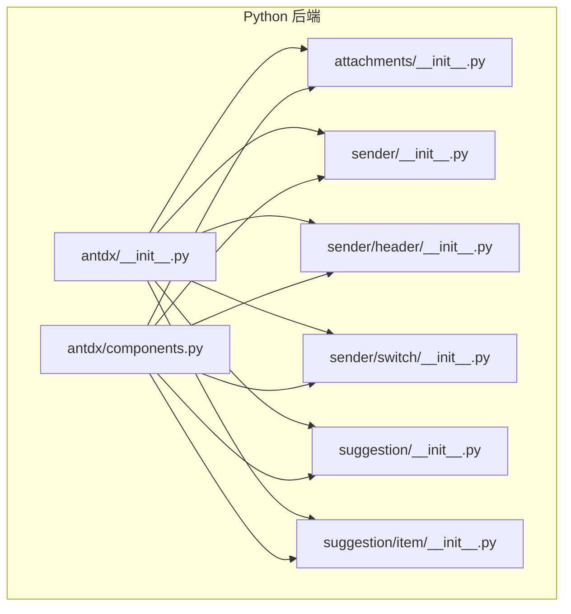
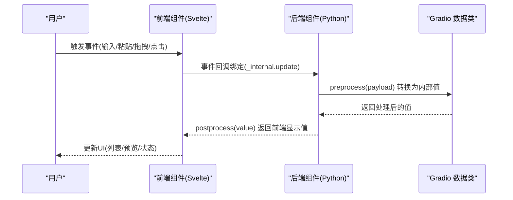
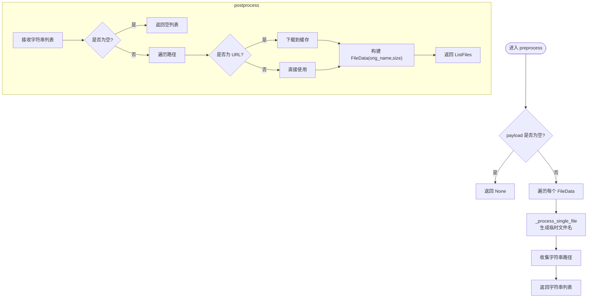
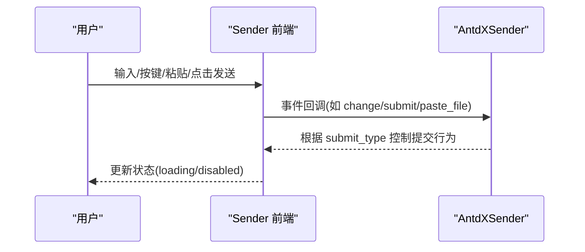
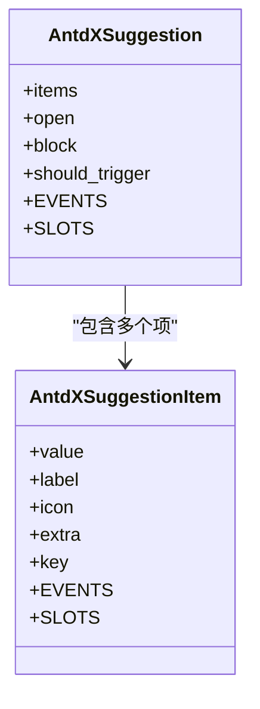
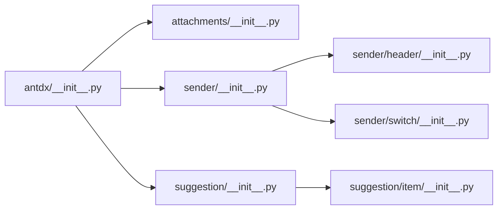

# 表达组件 API

<cite>
**本文引用的文件**
- [backend/modelscope_studio/components/antdx/__init__.py](file://backend/modelscope_studio/components/antdx/__init__.py)
- [backend/modelscope_studio/components/antdx/components.py](file://backend/modelscope_studio/components/antdx/components.py)
- [backend/modelscope_studio/components/antdx/attachments/__init__.py](file://backend/modelscope_studio/components/antdx/attachments/__init__.py)
- [backend/modelscope_studio/components/antdx/sender/__init__.py](file://backend/modelscope_studio/components/antdx/sender/__init__.py)
- [backend/modelscope_studio/components/antdx/sender/header/__init__.py](file://backend/modelscope_studio/components/antdx/sender/header/__init__.py)
- [backend/modelscope_studio/components/antdx/sender/switch/__init__.py](file://backend/modelscope_studio/components/antdx/sender/switch/__init__.py)
- [backend/modelscope_studio/components/antdx/suggestion/__init__.py](file://backend/modelscope_studio/components/antdx/suggestion/__init__.py)
- [backend/modelscope_studio/components/antdx/suggestion/item/__init__.py](file://backend/modelscope_studio/components/antdx/suggestion/item/__init__.py)
</cite>

## 目录

1. [简介](#简介)
2. [项目结构](#项目结构)
3. [核心组件](#核心组件)
4. [架构总览](#架构总览)
5. [组件详解](#组件详解)
6. [依赖关系分析](#依赖关系分析)
7. [性能考量](#性能考量)
8. [故障排查指南](#故障排查指南)
9. [结论](#结论)
10. [附录：使用示例与最佳实践](#附录使用示例与最佳实践)

## 简介

本文件为 Antdx 表达组件的 Python API 参考文档，聚焦以下能力：

- 文件附件处理：上传、拖拽、下载、预览、移除、类型限制与列表展示策略
- 输入与发送控制：文本输入框管理、提交类型（回车/Shift+回车）、粘贴与键盘事件、语音输入开关
- 多模态输入支持：通过 Sender 的子组件扩展头区、开关与技能面板
- 快捷指令：Suggestion 组件及其项的触发、选择与面板状态管理
- 与聊天机器人的集成：基于 Gradio 数据类与事件回调的数据流与交互协议

## 项目结构

Antdx 组件位于后端 Python 包中，通过统一入口导出，并在前端以对应目录映射到 Svelte 实现。表达组件相关模块组织如下：

- 顶层导出：antdx/**init**.py 与 antdx/components.py 提供组件聚合导出
- 附件：antdx/attachments
- 发送器：antdx/sender（含 header、switch 子组件）
- 建议：antdx/suggestion（含 item 子组件）

图表来源

- [backend/modelscope_studio/components/antdx/**init**.py:1-42](file://backend/modelscope_studio/components/antdx/__init__.py#L1-L42)
- [backend/modelscope_studio/components/antdx/components.py:1-40](file://backend/modelscope_studio/components/antdx/components.py#L1-L40)

章节来源

- [backend/modelscope_studio/components/antdx/**init**.py:1-42](file://backend/modelscope_studio/components/antdx/__init__.py#L1-L42)
- [backend/modelscope_studio/components/antdx/components.py:1-40](file://backend/modelscope_studio/components/antdx/components.py#L1-L40)

## 核心组件

- AntdXAttachments：文件附件上传与管理，支持拖拽、预览、下载、移除、类型过滤、列表样式与占位图等
- AntdXSender：输入与发送控制，支持自动高度、只读、加载态、占位符、提交类型、语音输入、粘贴文件、键盘事件等
- AntdXSenderHeader：Sender 头部区域，支持展开/收起、标题、可关闭等
- AntdXSenderSwitch：Sender 内置开关，支持选中/未选中文案与图标
- AntdXSuggestion：快捷指令建议面板，支持 items 列表、打开状态、选择事件
- AntdXSuggestionItem：建议项，支持标签、图标、额外内容等插槽

章节来源

- [backend/modelscope_studio/components/antdx/attachments/**init**.py:22-227](file://backend/modelscope_studio/components/antdx/attachments/__init__.py#L22-L227)
- [backend/modelscope_studio/components/antdx/sender/**init**.py:14-149](file://backend/modelscope_studio/components/antdx/sender/__init__.py#L14-L149)
- [backend/modelscope_studio/components/antdx/sender/header/**init**.py:8-74](file://backend/modelscope_studio/components/antdx/sender/header/__init__.py#L8-L74)
- [backend/modelscope_studio/components/antdx/sender/switch/**init**.py:8-81](file://backend/modelscope_studio/components/antdx/sender/switch/__init__.py#L8-L81)
- [backend/modelscope_studio/components/antdx/suggestion/**init**.py:11-86](file://backend/modelscope_studio/components/antdx/suggestion/__init__.py#L11-L86)
- [backend/modelscope_studio/components/antdx/suggestion/item/**init**.py:8-68](file://backend/modelscope_studio/components/antdx/suggestion/item/__init__.py#L8-L68)

## 架构总览

表达组件的前后端交互遵循 Gradio 数据类与事件模型：

- 后端组件定义数据模型（如 ListFiles）与事件监听器
- 前端根据 FRONTEND_DIR 映射到对应 Svelte 组件
- 通过 preprocess/postprocess 在 Python 与前端之间转换数据格式
- 事件回调通过 \_internal.update 绑定前端事件

图表来源

- [backend/modelscope_studio/components/antdx/attachments/**init**.py:168-207](file://backend/modelscope_studio/components/antdx/attachments/__init__.py#L168-L207)
- [backend/modelscope_studio/components/antdx/sender/**init**.py:134-142](file://backend/modelscope_studio/components/antdx/sender/__init__.py#L134-L142)

## 组件详解

### 附件组件 AntdXAttachments

- 功能要点
  - 支持文件上传、拖拽上传、批量选择、最大数量限制
  - 支持文件类型过滤（accept）、HTTP 请求参数（headers、data、method）
  - 支持自定义上传请求（custom_request）、前置钩子（before_upload）
  - 列表样式与溢出策略（list_type、overflow），默认显示上传列表
  - 占位图与图片预览增强（placeholder、imageProps.\*）
  - 事件：change、drop、download、preview、remove
  - 插槽：showUploadList._、iconRender、itemRender、placeholder._、imageProps.\* 等
- 数据流
  - preprocess：将前端传入的 ListFiles 转为本地路径字符串列表
  - postprocess：将本地路径/URL 下载至缓存并封装为 ListFiles 返回前端
- 文件处理策略
  - 远程 URL：下载到缓存目录
  - 本地路径：直接返回
  - 预览：使用 Gradio FileData 元信息（orig_name、size）

图表来源

- [backend/modelscope_studio/components/antdx/attachments/**init**.py:162-207](file://backend/modelscope_studio/components/antdx/attachments/__init__.py#L162-L207)

章节来源

- [backend/modelscope_studio/components/antdx/attachments/**init**.py:22-227](file://backend/modelscope_studio/components/antdx/attachments/__init__.py#L22-L227)

### 发送器组件 AntdXSender

- 功能要点
  - 输入框管理：auto_size、placeholder、disabled、read_only、loading
  - 提交控制：submit_type（enter 或 shiftEnter）
  - 事件：change、submit、cancel、allow_speech_recording_change、key_down/key_press、focus/blur、paste/paste_file、skill_closable_close
  - 插槽：suffix、header、prefix、footer、skill.\* 等
  - 子组件：Header、Switch（用于扩展头区与开关）
- 数据流
  - preprocess/postprocess：透传字符串值
- 多模态输入支持
  - allow_speech：启用语音输入（可为布尔或字典）
  - paste_file：粘贴文件事件
  - skill.\*：技能面板的标题、提示与可关闭图标

图表来源

- [backend/modelscope_studio/components/antdx/sender/**init**.py:21-59](file://backend/modelscope_studio/components/antdx/sender/__init__.py#L21-L59)

章节来源

- [backend/modelscope_studio/components/antdx/sender/**init**.py:14-149](file://backend/modelscope_studio/components/antdx/sender/__init__.py#L14-L149)

### 发送器头部 AntdXSenderHeader

- 功能要点
  - 展开/收起：open、closable
  - 标题：title
  - 插槽：title
- 用途
  - 作为 Sender 的子组件，用于承载头部标题与可关闭按钮

章节来源

- [backend/modelscope_studio/components/antdx/sender/header/**init**.py:8-74](file://backend/modelscope_studio/components/antdx/sender/header/__init__.py#L8-L74)

### 发送器开关 AntdXSenderSwitch

- 功能要点
  - 值：value（bool）
  - 文案与图标：checked_children、un_checked_children、icon
  - 状态：disabled、loading
  - 插槽：checkedChildren、unCheckedChildren、icon
- 用途
  - 作为 Sender 的子组件，用于切换某些发送行为或模式

章节来源

- [backend/modelscope_studio/components/antdx/sender/switch/**init**.py:8-81](file://backend/modelscope_studio/components/antdx/sender/switch/__init__.py#L8-L81)

### 建议组件 AntdXSuggestion 与项 AntdXSuggestionItem

- 建议面板
  - items：建议项列表（字符串或字典）
  - 打开状态：open、block、should_trigger
  - 事件：select、open_change
  - 插槽：items、children
- 建议项
  - label、icon、extra、key
  - 插槽：label、icon、extra

图表来源

- [backend/modelscope_studio/components/antdx/suggestion/**init**.py:11-86](file://backend/modelscope_studio/components/antdx/suggestion/__init__.py#L11-L86)
- [backend/modelscope_studio/components/antdx/suggestion/item/**init**.py:8-68](file://backend/modelscope_studio/components/antdx/suggestion/item/__init__.py#L8-L68)

章节来源

- [backend/modelscope_studio/components/antdx/suggestion/**init**.py:11-86](file://backend/modelscope_studio/components/antdx/suggestion/__init__.py#L11-L86)
- [backend/modelscope_studio/components/antdx/suggestion/item/**init**.py:8-68](file://backend/modelscope_studio/components/antdx/suggestion/item/__init__.py#L8-L68)

## 依赖关系分析

- 组件聚合
  - antdx/**init**.py 与 antdx/components.py 将各子组件统一导出，便于上层应用按需导入
- 组件内聚
  - 每个组件独立定义 EVENTS、SLOTS、FRONTEND_DIR，职责清晰
- 事件耦合
  - 通过 EventListener 与 \_internal.update 将前端事件映射到后端回调
- 数据类依赖
  - 附件组件使用 Gradio ListFiles 与 FileData，确保跨端数据一致性

图表来源

- [backend/modelscope_studio/components/antdx/**init**.py:1-42](file://backend/modelscope_studio/components/antdx/__init__.py#L1-L42)
- [backend/modelscope_studio/components/antdx/components.py:1-40](file://backend/modelscope_studio/components/antdx/components.py#L1-L40)

章节来源

- [backend/modelscope_studio/components/antdx/**init**.py:1-42](file://backend/modelscope_studio/components/antdx/__init__.py#L1-L42)
- [backend/modelscope_studio/components/antdx/components.py:1-40](file://backend/modelscope_studio/components/antdx/components.py#L1-L40)

## 性能考量

- 文件处理
  - 远程 URL 下载应结合缓存目录与异步策略，避免阻塞主线程
  - 大文件上传建议分块或采用服务端直传策略
- 事件回调
  - 高频事件（如 change、key_down）应避免在回调中执行重计算
- UI 渲染
  - 列表渲染时启用虚拟化（如适用）以减少 DOM 节点
  - 图片预览与缩略图生成尽量在后台线程完成

## 故障排查指南

- 附件无法上传/预览
  - 检查 accept 与 headers/data/method 配置是否正确
  - 确认 custom_request 与 before_upload 回调未抛错
- 远程文件无法下载
  - 核对 URL 可访问性与 with_credentials 设置
  - 查看缓存目录权限与磁盘空间
- 发送器事件无效
  - 确认 submit_type 与键盘事件绑定是否匹配
  - 检查 disabled/read_only/loading 状态是否阻止交互
- 建议面板不显示
  - 检查 items 是否为空或 should_trigger 条件是否满足
  - 确认 open/open_change 事件是否被正确绑定

## 结论

Antdx 表达组件通过清晰的事件与插槽体系，提供了完整的文件附件、输入发送与快捷指令能力。依托 Gradio 数据类与事件模型，可在 Python 侧进行灵活的数据转换与交互控制，同时保持前端 UI 的一致体验。

## 附录：使用示例与最佳实践

- 文件上传与预览
  - 使用 AntdXAttachments 的 accept 限制类型，设置 headers 与 data 完成鉴权与附加参数传递
  - 通过 list_type 与 show_upload_list 控制列表样式与可见性
  - 使用 preview_file 与 imageProps.\* 增强图片预览体验
- 输入与发送控制
  - 使用 submit_type 精细控制提交时机（enter/shiftEnter）
  - 结合 Sender.Header 与 Sender.Switch 扩展头部区域与开关
  - 通过 paste/paste_file 事件处理粘贴文件场景
- 快捷指令
  - 使用 AntdXSuggestion 的 items 与 open 控制建议面板
  - 通过 AntdXSuggestionItem 的 label/icon/extra 丰富指令展示
- 与聊天机器人集成
  - 将 Sender 的 value 作为消息主体，附件列表作为多模态输入
  - 通过事件回调在后端组装消息体并调用机器人接口
  - 使用 preprocess/postprocess 对消息与文件进行序列化/反序列化
