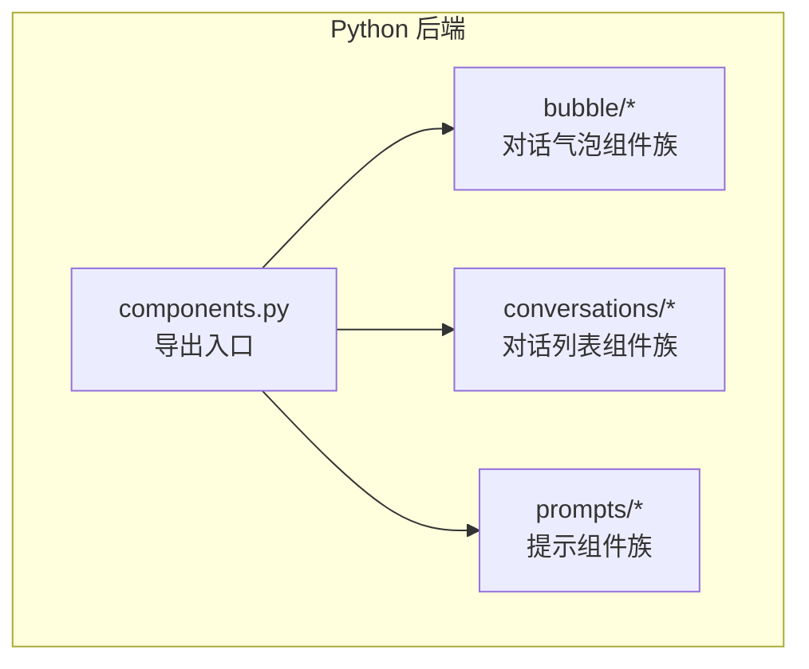
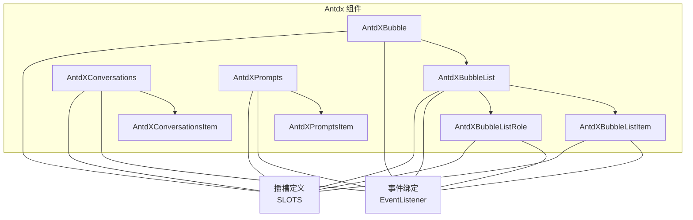
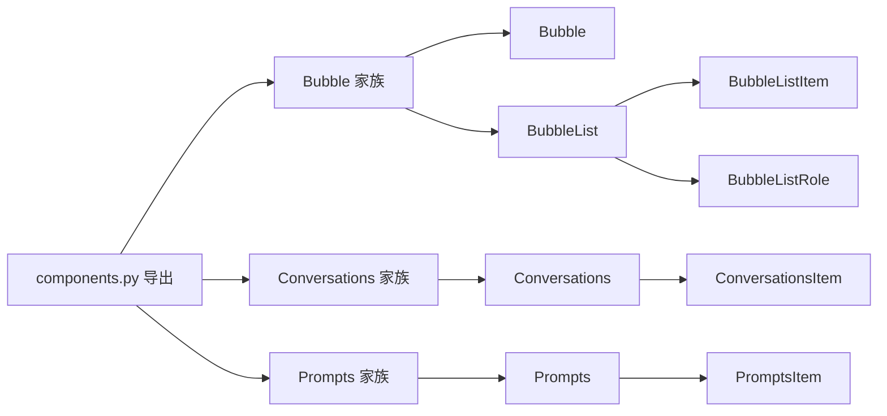

# 通用组件 API

<cite>
**本文引用的文件**
- [backend/modelscope_studio/components/antdx/components.py](file://backend/modelscope_studio/components/antdx/components.py)
- [backend/modelscope_studio/components/antdx/bubble/__init__.py](file://backend/modelscope_studio/components/antdx/bubble/__init__.py)
- [backend/modelscope_studio/components/antdx/bubble/list/__init__.py](file://backend/modelscope_studio/components/antdx/bubble/list/__init__.py)
- [backend/modelscope_studio/components/antdx/bubble/list/item/__init__.py](file://backend/modelscope_studio/components/antdx/bubble/list/item/__init__.py)
- [backend/modelscope_studio/components/antdx/bubble/list/role/__init__.py](file://backend/modelscope_studio/components/antdx/bubble/list/role/__init__.py)
- [backend/modelscope_studio/components/antdx/conversations/__init__.py](file://backend/modelscope_studio/components/antdx/conversations/__init__.py)
- [backend/modelscope_studio/components/antdx/conversations/item/__init__.py](file://backend/modelscope_studio/components/antdx/conversations/item/__init__.py)
- [backend/modelscope_studio/components/antdx/prompts/__init__.py](file://backend/modelscope_studio/components/antdx/prompts/__init__.py)
- [backend/modelscope_studio/components/antdx/prompts/item/__init__.py](file://backend/modelscope_studio/components/antdx/prompts/item/__init__.py)
- [docs/components/antdx/bubble/README-zh_CN.md](file://docs/components/antdx/bubble/README-zh_CN.md)
- [docs/components/antdx/conversations/README-zh_CN.md](file://docs/components/antdx/conversations/README-zh_CN.md)
- [docs/components/antdx/prompts/README-zh_CN.md](file://docs/components/antdx/prompts/README-zh_CN.md)
</cite>

## 目录

1. [简介](#简介)
2. [项目结构](#项目结构)
3. [核心组件](#核心组件)
4. [架构总览](#架构总览)
5. [详细组件分析](#详细组件分析)
6. [依赖分析](#依赖分析)
7. [性能考虑](#性能考虑)
8. [故障排查指南](#故障排查指南)
9. [结论](#结论)
10. [附录](#附录)

## 简介

本文件为 Antdx 通用组件的 Python API 参考，重点覆盖以下核心组件：

- Bubble：对话气泡渲染与交互
- BubbleList：消息列表管理
- BubbleListItem：消息项处理
- BubbleListRole：角色标识
- Conversations：对话管理、消息存储与状态同步
- Prompts：提示模板管理、动态内容渲染与用户交互

文档提供各组件的构造函数参数、属性定义、事件与插槽（slots）规范，并给出典型 AI 场景下的标准组件实例化与组合方式，帮助开发者快速构建对话系统、消息展示与提示管理功能。

## 项目结构

Antdx 组件位于后端 Python 包中，通过统一的布局组件基类进行封装，并映射到前端对应组件目录。组件导出入口集中于 antdx/components.py，便于按需导入。

图表来源

- [backend/modelscope_studio/components/antdx/components.py:1-40](file://backend/modelscope_studio/components/antdx/components.py#L1-L40)

章节来源

- [backend/modelscope_studio/components/antdx/components.py:1-40](file://backend/modelscope_studio/components/antdx/components.py#L1-L40)

## 核心组件

本节概述三大核心组件族及其职责边界：

- Bubble 家族：负责单条消息或角色级气泡的渲染与交互，支持打字动画、可编辑、变体、形状等。
- BubbleList 家族：负责消息列表的滚动、角色分组与项渲染，支持自动滚动、角色配置等。
- Conversations 家族：负责会话列表的管理、选中态切换、菜单操作与创建按钮等。
- Prompts 家族：负责预设提示的展示与点击交互，支持垂直排列、淡入效果、换行等。

章节来源

- [backend/modelscope_studio/components/antdx/bubble/**init**.py:13-135](file://backend/modelscope_studio/components/antdx/bubble/__init__.py#L13-L135)
- [backend/modelscope_studio/components/antdx/bubble/list/**init**.py:12-84](file://backend/modelscope_studio/components/antdx/bubble/list/__init__.py#L12-L84)
- [backend/modelscope_studio/components/antdx/conversations/**init**.py:11-109](file://backend/modelscope_studio/components/antdx/conversations/__init__.py#L11-L109)
- [backend/modelscope_studio/components/antdx/prompts/**init**.py:11-88](file://backend/modelscope_studio/components/antdx/prompts/__init__.py#L11-L88)

## 架构总览

下图展示了 Antdx 组件在 Python 层的组织方式与依赖关系：

图表来源

- [backend/modelscope_studio/components/antdx/bubble/**init**.py:21-54](file://backend/modelscope_studio/components/antdx/bubble/__init__.py#L21-L54)
- [backend/modelscope_studio/components/antdx/bubble/list/**init**.py:19-30](file://backend/modelscope_studio/components/antdx/bubble/list/__init__.py#L19-L30)
- [backend/modelscope_studio/components/antdx/bubble/list/item/**init**.py:14-47](file://backend/modelscope_studio/components/antdx/bubble/list/item/__init__.py#L14-L47)
- [backend/modelscope_studio/components/antdx/bubble/list/role/**init**.py:14-46](file://backend/modelscope_studio/components/antdx/bubble/list/role/__init__.py#L14-L46)
- [backend/modelscope_studio/components/antdx/conversations/**init**.py:18-47](file://backend/modelscope_studio/components/antdx/conversations/__init__.py#L18-L47)
- [backend/modelscope_studio/components/antdx/prompts/**init**.py:18-26](file://backend/modelscope_studio/components/antdx/prompts/__init__.py#L18-L26)

## 详细组件分析

### Bubble 组件

- 组件定位：用于渲染单条对话气泡，支持多种外观变体、形状、打字动画、可编辑、头像、页眉/页脚、额外区域、加载与内容自定义渲染等。
- 关键属性（构造函数参数）
  - content：气泡内容文本
  - avatar：头像地址或占位符
  - extra：附加元素
  - footer/header：页脚/页眉内容
  - loading：是否显示加载态
  - placement：对齐位置（起始/结束）
  - editable：是否可编辑（布尔或字典）
  - shape：气泡形状（圆润/尖角/默认）
  - typing：打字动画（布尔/字典/字符串）
  - streaming：流式渲染开关
  - variant：外观变体（填充/无边框/描边/阴影）
  - footer_placement：页脚位置（外侧/内侧起始/结束）
  - loading_render/content_render：自定义加载与内容渲染
  - class_names/styles/root_class_name：样式与类名控制
  - 其他通用属性：visible、elem_id、elem_classes、elem_style、render 等
- 事件
  - typing：打字动画回调
  - typing_complete：打字完成回调；若未设置打字，则渲染时立即触发
  - edit_confirm：编辑确认回调
  - edit_cancel：编辑取消回调
- 插槽（slots）
  - avatar、editable.okText、editable.cancelText、content、footer、header、extra、loadingRender、contentRender
- 嵌套子组件
  - List：消息列表容器
  - System：系统消息气泡
  - Divider：分割线

章节来源

- [backend/modelscope_studio/components/antdx/bubble/**init**.py:56-116](file://backend/modelscope_studio/components/antdx/bubble/__init__.py#L56-L116)
- [backend/modelscope_studio/components/antdx/bubble/**init**.py:21-54](file://backend/modelscope_studio/components/antdx/bubble/__init__.py#L21-L54)

### BubbleList 组件

- 组件定位：消息列表容器，负责滚动、角色分组与项渲染，支持自动滚动与角色配置。
- 关键属性
  - items：消息项数组（字典）
  - role：角色配置（字典）
  - auto_scroll：是否自动滚动到底部
  - class_names/styles/root_class_name：样式与类名控制
  - 其他通用属性：visible、elem_id、elem_classes、elem_style、render 等
- 事件
  - scroll：列表滚动回调
- 插槽
  - items、role
- 嵌套子组件
  - Item：消息项
  - Role：角色标识

章节来源

- [backend/modelscope_studio/components/antdx/bubble/list/**init**.py:32-64](file://backend/modelscope_studio/components/antdx/bubble/list/__init__.py#L32-L64)
- [backend/modelscope_studio/components/antdx/bubble/list/**init**.py:19-30](file://backend/modelscope_studio/components/antdx/bubble/list/__init__.py#L19-L30)

### BubbleListItem 组件

- 组件定位：消息列表中的单项，行为与 Bubble 基本一致，但作为列表项使用。
- 关键属性
  - content、avatar、extra、footer、header、loading、placement、editable、shape、typing、streaming、variant、footer_placement、loading_render、content_render、class_names/styles/root_class_name 等
- 事件
  - typing、typing_complete、edit_confirm、edit_cancel
- 插槽
  - avatar、editable.okText、editable.cancelText、content、footer、header、extra、loadingRender、contentRender

章节来源

- [backend/modelscope_studio/components/antdx/bubble/list/item/**init**.py:49-108](file://backend/modelscope_studio/components/antdx/bubble/list/item/__init__.py#L49-L108)
- [backend/modelscope_studio/components/antdx/bubble/list/item/**init**.py:14-47](file://backend/modelscope_studio/components/antdx/bubble/list/item/__init__.py#L14-L47)

### BubbleListRole 组件

- 组件定位：用于在列表中标识角色，支持角色头像、页眉/页脚、额外区域、加载与内容自定义渲染等。
- 关键属性
  - role：角色标识文本
  - avatar、extra、footer、header、loading、placement、editable、shape、typing、streaming、variant、footer_placement、loading_render、content_render、class_names/styles/root_class_name 等
- 事件
  - typing、typing_complete、edit_confirm、edit_cancel
- 插槽
  - avatar、editable.okText、editable.cancelText、footer、header、extra、loadingRender、contentRender

章节来源

- [backend/modelscope_studio/components/antdx/bubble/list/role/**init**.py:48-107](file://backend/modelscope_studio/components/antdx/bubble/list/role/__init__.py#L48-L107)
- [backend/modelscope_studio/components/antdx/bubble/list/role/**init**.py:14-46](file://backend/modelscope_studio/components/antdx/bubble/list/role/__init__.py#L14-L46)

### Conversations 组件

- 组件定位：用于管理与查看对话列表，支持选中态切换、菜单操作、分组、快捷键与创建按钮等。
- 关键属性
  - active_key/default_active_key：当前激活项键值
  - items：对话项数组（字典）
  - menu：菜单配置（字符串或字典）
  - groupable：是否可分组（布尔或字典）
  - shortcut_keys：快捷键映射
  - creation：创建按钮配置（字典）
  - styles/class_names/root_class_name：样式与类名控制
  - 其他通用属性：visible、elem_id、elem_classes、elem_style、render 等
- 事件
  - active_change：选中项变更回调
  - menu_click/menu_deselect/menu_open_change/menu_select：菜单相关回调
  - groupable_expand：分组展开回调
  - creation_click：创建按钮点击回调
- 插槽
  - menu.expandIcon、menu.overflowedIndicator、menu.trigger、groupable.label、items、creation.icon、creation.label
- 嵌套子组件
  - Item：对话项

章节来源

- [backend/modelscope_studio/components/antdx/conversations/**init**.py:49-89](file://backend/modelscope_studio/components/antdx/conversations/__init__.py#L49-L89)
- [backend/modelscope_studio/components/antdx/conversations/**init**.py:18-47](file://backend/modelscope_studio/components/antdx/conversations/__init__.py#L18-L47)

### ConversationsItem 组件

- 组件定位：对话列表中的单项，支持标签、图标、类型、分组、禁用、虚线等。
- 关键属性
  - label：标签文本
  - key：唯一键
  - type：类型（如分隔线）
  - group：所属分组
  - icon：图标
  - disabled：是否禁用
  - dashed：是否虚线
  - additional_props/as_item/\_internal：内部与扩展属性
  - 其他通用属性：visible、elem_id、elem_classes、elem_style、render 等

章节来源

- [backend/modelscope_studio/components/antdx/conversations/item/**init**.py:21-55](file://backend/modelscope_studio/components/antdx/conversations/item/__init__.py#L21-L55)

### Prompts 组件

- 组件定位：用于展示预设提示，支持标题、垂直排列、淡入效果、换行等。
- 关键属性
  - items：提示项数组（字典）
  - prefix_cls：前缀类名
  - title：标题
  - vertical：是否垂直排列
  - fade_in/fade_in_left：淡入效果（左右）
  - wrap：是否换行
  - styles/class_names/root_class_name：样式与类名控制
  - 其他通用属性：visible、elem_id、elem_classes、elem_style、render 等
- 事件
  - item_click：提示项点击回调
- 插槽
  - title、items
- 嵌套子组件
  - Item：提示项

章节来源

- [backend/modelscope_studio/components/antdx/prompts/**init**.py:28-68](file://backend/modelscope_studio/components/antdx/prompts/__init__.py#L28-L68)
- [backend/modelscope_studio/components/antdx/prompts/**init**.py:18-26](file://backend/modelscope_studio/components/antdx/prompts/__init__.py#L18-L26)

### PromptsItem 组件

- 组件定位：提示列表中的单项，支持标签、描述、图标、禁用与键值。
- 关键属性
  - label：标签文本
  - key：唯一键
  - description：描述文本
  - icon：图标
  - disabled：是否禁用
  - additional_props/as_item/\_internal：内部与扩展属性
  - 其他通用属性：visible、elem_id、elem_classes、elem_style、render 等

章节来源

- [backend/modelscope_studio/components/antdx/prompts/item/**init**.py:18-48](file://backend/modelscope_studio/components/antdx/prompts/item/__init__.py#L18-L48)

## 依赖分析

- 组件导出：所有 antdx 组件均通过 components.py 集中导出，便于统一导入与使用。
- 组件层次：Bubble 家族（Bubble、BubbleList、BubbleListItem、BubbleListRole）形成完整的消息渲染链路；Conversations 家族与 Prompts 家族分别负责会话管理和提示管理。
- 事件与插槽：各组件均定义了 EVENTS 与 SLOTS 列表，用于声明支持的事件回调与插槽名称，确保前后端约定一致。

图表来源

- [backend/modelscope_studio/components/antdx/components.py:1-40](file://backend/modelscope_studio/components/antdx/components.py#L1-L40)

章节来源

- [backend/modelscope_studio/components/antdx/components.py:1-40](file://backend/modelscope_studio/components/antdx/components.py#L1-L40)

## 性能考虑

- 流式渲染与打字动画：合理使用 streaming 与 typing 参数，避免在大量消息同时渲染时造成卡顿。
- 自动滚动：BubbleList 的 auto_scroll 在消息频繁更新时建议开启，以保持最佳用户体验。
- 插槽与自定义渲染：loadingRender 与 contentRender 虽灵活，但应避免在渲染函数中执行重计算，必要时缓存结果。
- 事件绑定：仅在需要时启用相关事件绑定（如 typing_complete），减少不必要的回调开销。
- 外观与形状：变体（variant）与形状（shape）会影响渲染复杂度，建议按需选择。

## 故障排查指南

- 事件未触发
  - 检查 EVENTS 中的绑定名称是否正确，确认前端已启用相应 bind\_\* 事件。
  - 确认组件的 visible、render 状态是否影响事件传播。
- 插槽内容不显示
  - 确认插槽名称拼写与 SLOTS 列表一致。
  - 检查插槽作用域与父组件传递的插槽内容是否匹配。
- 样式异常
  - 使用 class_names/styles/root_class_name 进行局部覆盖，避免全局样式冲突。
- 滚动问题
  - BubbleList 的 auto_scroll 与外部容器高度设置有关，检查容器高度与 overflow 设置。
- 打字动画不生效
  - 确认 typing 参数类型与值范围，避免传入不支持的类型。

## 结论

Antdx 通用组件提供了从消息渲染、列表管理到会话与提示管理的完整能力。通过统一的事件与插槽约定，开发者可以快速搭建对话系统与提示面板，并结合样式与交互配置实现高性能、可维护的前端体验。

## 附录

### 典型场景与实例化路径

- 对话气泡基础渲染与打字动画
  - 参考路径：[docs/components/antdx/bubble/README-zh_CN.md:7-12](file://docs/components/antdx/bubble/README-zh_CN.md#L7-L12)
- 消息列表与自动滚动
  - 参考路径：[docs/components/antdx/bubble/README-zh_CN.md:10-12](file://docs/components/antdx/bubble/README-zh_CN.md#L10-L12)
- 会话列表与菜单操作
  - 参考路径：[docs/components/antdx/conversations/README-zh_CN.md:7-9](file://docs/components/antdx/conversations/README-zh_CN.md#L7-L9)
- 提示面板与嵌套使用
  - 参考路径：[docs/components/antdx/prompts/README-zh_CN.md:7-8](file://docs/components/antdx/prompts/README-zh_CN.md#L7-L8)

### 数据格式与字段说明（摘要）

- Bubble/BubbleListItem/BubbleListRole
  - content、avatar、extra、footer、header、loading、placement、editable、shape、typing、streaming、variant、footer_placement、loading_render、content_render、class_names、styles、root_class_name
- BubbleList
  - items、role、auto_scroll、class_names、styles、root_class_name
- Conversations
  - active_key、default_active_key、items、menu、groupable、shortcut_keys、creation、styles、class_names、root_class_name
- ConversationsItem
  - label、key、type、group、icon、disabled、dashed、additional_props、as_item、\_internal
- Prompts
  - items、prefix_cls、title、vertical、fade_in、fade_in_left、wrap、styles、class_names、root_class_name
- PromptsItem
  - label、key、description、icon、disabled、additional_props、as_item、\_internal
