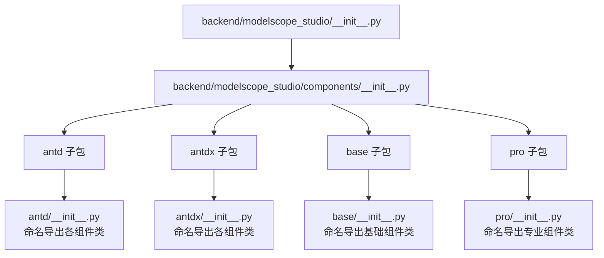
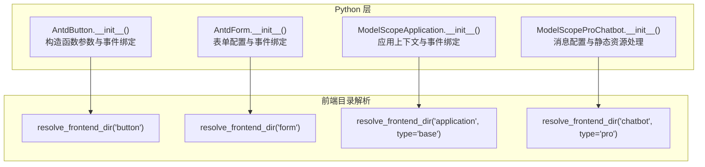
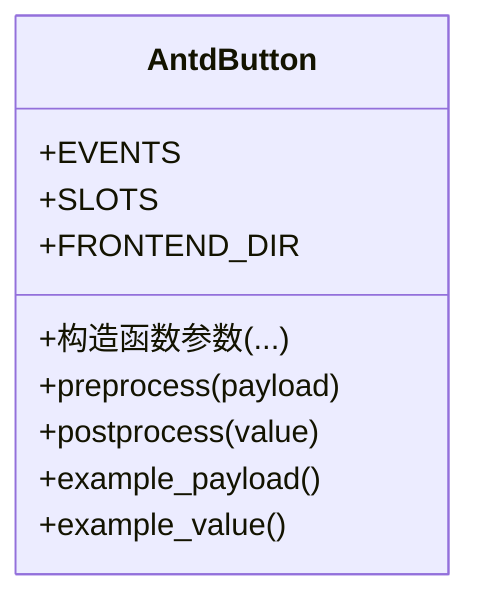
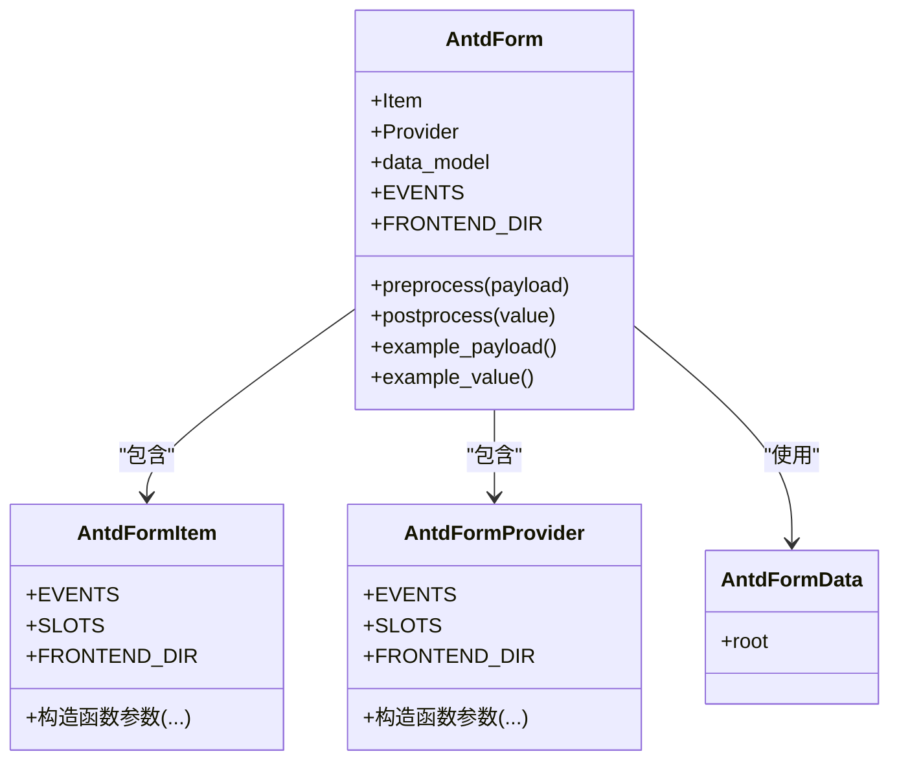
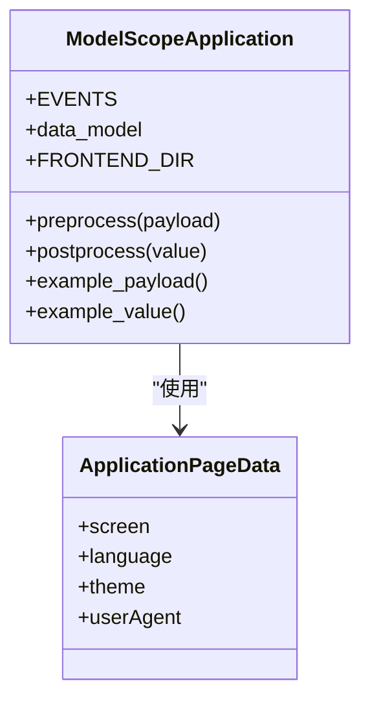
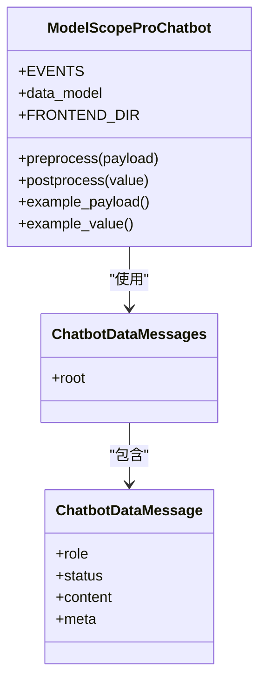
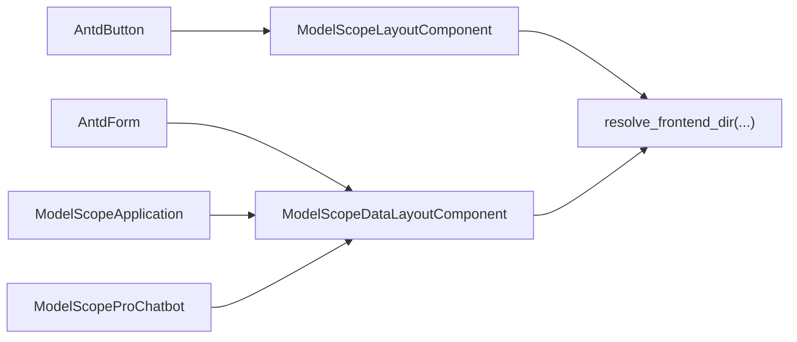

# Python API

<cite>
**本文引用的文件**
- [backend/modelscope_studio/__init__.py](file://backend/modelscope_studio/__init__.py)
- [backend/modelscope_studio/components/__init__.py](file://backend/modelscope_studio/components/__init__.py)
- [backend/modelscope_studio/version.py](file://backend/modelscope_studio/version.py)
- [backend/modelscope_studio/components/antd/__init__.py](file://backend/modelscope_studio/components/antd/__init__.py)
- [backend/modelscope_studio/components/antd/components.py](file://backend/modelscope_studio/components/antd/components.py)
- [backend/modelscope_studio/components/antdx/__init__.py](file://backend/modelscope_studio/components/antdx/__init__.py)
- [backend/modelscope_studio/components/antdx/components.py](file://backend/modelscope_studio/components/antdx/components.py)
- [backend/modelscope_studio/components/base/__init__.py](file://backend/modelscope_studio/components/base/__init__.py)
- [backend/modelscope_studio/components/pro/__init__.py](file://backend/modelscope_studio/components/pro/__init__.py)
- [backend/modelscope_studio/components/pro/components.py](file://backend/modelscope_studio/components/pro/components.py)
- [backend/modelscope_studio/components/antd/button/__init__.py](file://backend/modelscope_studio/components/antd/button/__init__.py)
- [backend/modelscope_studio/components/antd/form/__init__.py](file://backend/modelscope_studio/components/antd/form/__init__.py)
- [backend/modelscope_studio/components/base/application/__init__.py](file://backend/modelscope_studio/components/base/application/__init__.py)
- [backend/modelscope_studio/components/pro/chatbot/__init__.py](file://backend/modelscope_studio/components/pro/chatbot/__init__.py)
</cite>

## 目录

1. [简介](#简介)
2. [项目结构](#项目结构)
3. [核心组件](#核心组件)
4. [架构总览](#架构总览)
5. [详细组件分析](#详细组件分析)
6. [依赖分析](#依赖分析)
7. [性能考虑](#性能考虑)
8. [故障排查指南](#故障排查指南)
9. [结论](#结论)
10. [附录：API 索引与使用示例](#附录api-索引与使用示例)

## 简介

本文件为 ModelScope Studio 的 Python API 参考文档，聚焦于后端 Python 包 modelscope_studio 的组件体系与调用方式。文档覆盖以下内容：

- 组件导入路径与命名导出规范（modelscope*studio.components.antd.*、modelscope*studio.components.antdx.*、modelscope*studio.components.base.*、modelscope*studio.components.pro.*）
- 关键组件类的构造函数参数、支持的事件、插槽、数据模型与预处理/后处理流程
- 标准实例化示例（基本用法与高级配置），以及生命周期与状态管理要点
- 参数校验与异常处理机制提示
- 版本兼容性信息与常见问题排查

## 项目结构

Python 包位于 backend/modelscope_studio，顶层通过 **all** 导出聚合各子模块；组件按类型分层组织在 antd、antdx、base、pro 四个子包中，每个子包提供 **init**.py 与 components.py 两种入口，分别用于不同聚合策略。

**图表来源**

- [backend/modelscope_studio/**init**.py:1-3](file://backend/modelscope_studio/__init__.py#L1-L3)
- [backend/modelscope_studio/components/**init**.py:1-5](file://backend/modelscope_studio/components/__init__.py#L1-L5)

**章节来源**

- [backend/modelscope_studio/**init**.py:1-3](file://backend/modelscope_studio/__init__.py#L1-L3)
- [backend/modelscope_studio/components/**init**.py:1-5](file://backend/modelscope_studio/components/__init__.py#L1-L5)

## 核心组件

本节给出四大组件族的导入路径与命名导出概览，并说明各组件族的职责边界与典型用途。

- modelscope_studio.components.antd.\*
  - 职责：Ant Design 组件生态的 Python 封装，覆盖布局、表单、反馈、导航、数据录入等常用 UI 组件。
  - 典型组件：Button、Form、Input、Select、Table、Modal、Message、Notification 等。
  - 导入方式：from modelscope_studio.components.antd import Button, Form, ...
  - 命名导出：见 [backend/modelscope_studio/components/antd/**init**.py:1-150](file://backend/modelscope_studio/components/antd/__init__.py#L1-L150) 与 [backend/modelscope_studio/components/antd/components.py:1-144](file://backend/modelscope_studio/components/antd/components.py#L1-L144)

- modelscope_studio.components.antdx.\*
  - 职责：Ant Design X 扩展组件集合，面向对话式交互与知识工作场景（如消息气泡、会话列表、提示词面板等）。
  - 典型组件：Bubble、Conversations、Prompts、Sender、ThoughtChain、Welcome 等。
  - 导入方式：from modelscope_studio.components.antdx import Bubble, Conversations, ...
  - 命名导出：见 [backend/modelscope_studio/components/antdx/**init**.py:1-42](file://backend/modelscope_studio/components/antdx/__init__.py#L1-L42) 与 [backend/modelscope_studio/components/antdx/components.py:1-40](file://backend/modelscope_studio/components/antdx/components.py#L1-L40)

- modelscope_studio.components.base.\*
  - 职责：基础布局与容器组件，提供应用级容器、循环渲染、条件过滤、占位文本等通用能力。
  - 典型组件：Application、Each、Filter、Fragment、Markdown、Slot、Text、Div 等。
  - 导入方式：from modelscope_studio.components.base import Application, Each, ...
  - 命名导出：见 [backend/modelscope_studio/components/base/**init**.py:1-11](file://backend/modelscope_studio/components/base/__init__.py#L1-L11)

- modelscope_studio.components.pro.\*
  - 职责：专业领域组件，面向特定业务形态（如聊天机器人、代码编辑器、多模态输入、网页沙盒等）。
  - 典型组件：Chatbot、MonacoEditor、MultimodalInput、WebSandbox。
  - 导入方式：from modelscope_studio.components.pro import Chatbot, MonacoEditor, ...
  - 命名导出：见 [backend/modelscope_studio/components/pro/**init**.py:1-7](file://backend/modelscope_studio/components/pro/__init__.py#L1-L7) 与 [backend/modelscope_studio/components/pro/components.py:1-8](file://backend/modelscope_studio/components/pro/components.py#L1-L8)

**章节来源**

- [backend/modelscope_studio/components/antd/**init**.py:1-150](file://backend/modelscope_studio/components/antd/__init__.py#L1-L150)
- [backend/modelscope_studio/components/antd/components.py:1-144](file://backend/modelscope_studio/components/antd/components.py#L1-L144)
- [backend/modelscope_studio/components/antdx/**init**.py:1-42](file://backend/modelscope_studio/components/antdx/__init__.py#L1-L42)
- [backend/modelscope_studio/components/antdx/components.py:1-40](file://backend/modelscope_studio/components/antdx/components.py#L1-L40)
- [backend/modelscope_studio/components/base/**init**.py:1-11](file://backend/modelscope_studio/components/base/__init__.py#L1-L11)
- [backend/modelscope_studio/components/pro/**init**.py:1-7](file://backend/modelscope_studio/components/pro/__init__.py#L1-L7)
- [backend/modelscope_studio/components/pro/components.py:1-8](file://backend/modelscope_studio/components/pro/components.py#L1-L8)

## 架构总览

下图展示 Python 层组件类与前端目录解析的关系，以及事件绑定与数据流的关键节点。

**图表来源**

- [backend/modelscope_studio/components/antd/button/**init**.py:15-157](file://backend/modelscope_studio/components/antd/button/__init__.py#L15-L157)
- [backend/modelscope_studio/components/antd/form/**init**.py:17-133](file://backend/modelscope_studio/components/antd/form/__init__.py#L17-L133)
- [backend/modelscope_studio/components/base/application/**init**.py:26-115](file://backend/modelscope_studio/components/base/application/__init__.py#L26-L115)
- [backend/modelscope_studio/components/pro/chatbot/**init**.py:286-495](file://backend/modelscope_studio/components/pro/chatbot/__init__.py#L286-L495)

## 详细组件分析

### 组件：AntdButton（按钮）

- 导入路径：from modelscope_studio.components.antd import Button
- 作用：封装 Ant Design 按钮，支持多种类型、尺寸、形状、加载态、危险态、幽灵态等。
- 关键点：
  - 支持事件：click
  - 插槽：icon、loading.icon
  - 预处理/后处理：字符串到字符串的简单转换
  - 前端目录：resolve_frontend_dir("button")

**图表来源**

- [backend/modelscope_studio/components/antd/button/**init**.py:15-157](file://backend/modelscope_studio/components/antd/button/__init__.py#L15-L157)

**章节来源**

- [backend/modelscope_studio/components/antd/button/**init**.py:15-157](file://backend/modelscope_studio/components/antd/button/__init__.py#L15-L157)

### 组件：AntdForm（表单）与 AntdFormItem（表单项）

- 导入路径：from modelscope_studio.components.antd import Form, Form.Item
- 作用：封装 Ant Design 表单，支持字段变更、提交、失败、值变更等事件，以及表单项规则与提供者。
- 关键点：
  - 支持事件：fields_change、finish、finish_failed、values_change
  - 数据模型：AntdFormData
  - 预处理/后处理：对数据模型进行 root 字段提取或原样返回
  - 前端目录：resolve_frontend_dir("form")

**图表来源**

- [backend/modelscope_studio/components/antd/form/**init**.py:17-133](file://backend/modelscope_studio/components/antd/form/__init__.py#L17-L133)

**章节来源**

- [backend/modelscope_studio/components/antd/form/**init**.py:17-133](file://backend/modelscope_studio/components/antd/form/__init__.py#L17-L133)

### 组件：ModelScopeApplication（应用容器）

- 导入路径：from modelscope_studio.components.base import Application
- 作用：应用级容器，提供页面环境数据（屏幕尺寸、主题、语言等）与生命周期事件（mount、resize、unmount、custom）。
- 关键点：
  - 支持事件：custom、mount、resize、unmount
  - 数据模型：ApplicationPageData
  - 预处理/后处理：原样传递
  - 前端目录：resolve_frontend_dir("application", type="base")

**图表来源**

- [backend/modelscope_studio/components/base/application/**init**.py:26-115](file://backend/modelscope_studio/components/base/application/__init__.py#L26-L115)

**章节来源**

- [backend/modelscope_studio/components/base/application/**init**.py:26-115](file://backend/modelscope_studio/components/base/application/__init__.py#L26-L115)

### 组件：ModelScopeProChatbot（专业聊天机器人）

- 导入路径：from modelscope_studio.components.pro import Chatbot
- 作用：专业聊天机器人组件，支持欢迎语、提示词、用户/助手消息、动作按钮、文件/工具/建议内容等丰富配置。
- 关键点：
  - 支持事件：change、copy、edit、delete、like、retry、suggestion_select、welcome_prompt_select
  - 数据模型：ChatbotDataMessages（根为消息列表）
  - 预处理/后处理：消息内容的类型化处理（文件转 FileData、静态资源路径处理）
  - 前端目录：resolve_frontend_dir("chatbot", type="pro")

**图表来源**

- [backend/modelscope_studio/components/pro/chatbot/**init**.py:286-495](file://backend/modelscope_studio/components/pro/chatbot/__init__.py#L286-L495)

**章节来源**

- [backend/modelscope_studio/components/pro/chatbot/**init**.py:286-495](file://backend/modelscope_studio/components/pro/chatbot/__init__.py#L286-L495)

## 依赖分析

- 组件类普遍继承自 ModelScopeDataLayoutComponent 或 ModelScopeLayoutComponent，统一了前端目录解析与事件绑定机制。
- 事件系统基于 gradio.events.EventListener，通过回调将事件绑定标记注入内部更新逻辑。
- 数据模型多采用 GradioRootModel/GradioModel，便于前后端一致的数据结构与序列化。

**图表来源**

- [backend/modelscope_studio/components/antd/button/**init**.py:7-8](file://backend/modelscope_studio/components/antd/button/__init__.py#L7-L8)
- [backend/modelscope_studio/components/antd/form/**init**.py:8-9](file://backend/modelscope_studio/components/antd/form/__init__.py#L8-L9)
- [backend/modelscope_studio/components/base/application/**init**.py:8-9](file://backend/modelscope_studio/components/base/application/__init__.py#L8-L9)
- [backend/modelscope_studio/components/pro/chatbot/**init**.py:11](file://backend/modelscope_studio/components/pro/chatbot/__init__.py#L11)

**章节来源**

- [backend/modelscope_studio/components/antd/button/**init**.py:7-8](file://backend/modelscope_studio/components/antd/button/__init__.py#L7-L8)
- [backend/modelscope_studio/components/antd/form/**init**.py:8-9](file://backend/modelscope_studio/components/antd/form/__init__.py#L8-L9)
- [backend/modelscope_studio/components/base/application/**init**.py:8-9](file://backend/modelscope_studio/components/base/application/__init__.py#L8-L9)
- [backend/modelscope_studio/components/pro/chatbot/**init**.py:11](file://backend/modelscope_studio/components/pro/chatbot/__init__.py#L11)

## 性能考虑

- 组件预处理/后处理尽量保持轻量，避免在 Python 层做重型计算。
- 对大文件内容（如聊天机器人的文件消息）建议在后处理阶段进行最小化包装（如仅保留必要元数据），减少传输开销。
- 合理设置组件高度与滚动行为，避免不必要的重排与重绘。

## 故障排查指南

- 事件未触发
  - 检查是否正确注册事件监听（如 Button 的 click、Form 的 finish 等），确认回调已注入绑定标记。
  - 参考：[backend/modelscope_studio/components/antd/button/**init**.py:41-46](file://backend/modelscope_studio/components/antd/button/__init__.py#L41-L46)，[backend/modelscope_studio/components/antd/form/**init**.py:23-36](file://backend/modelscope_studio/components/antd/form/__init__.py#L23-L36)
- 前端目录解析失败
  - 确认 resolve_frontend_dir 返回的路径存在且可访问。
  - 参考：[backend/modelscope_studio/components/antd/button/**init**.py:139](file://backend/modelscope_studio/components/antd/button/__init__.py#L139)，[backend/modelscope_studio/components/antd/form/**init**.py:114](file://backend/modelscope_studio/components/antd/form/__init__.py#L114)
- 数据模型不匹配
  - 使用 data_model 进行预处理/后处理，确保 payload/value 结构与模型一致。
  - 参考：[backend/modelscope_studio/components/antd/form/**init**.py:13-14](file://backend/modelscope_studio/components/antd/form/__init__.py#L13-L14)，[backend/modelscope_studio/components/pro/chatbot/**init**.py:388](file://backend/modelscope_studio/components/pro/chatbot/__init__.py#L388)

**章节来源**

- [backend/modelscope_studio/components/antd/button/**init**.py:41-46](file://backend/modelscope_studio/components/antd/button/__init__.py#L41-L46)
- [backend/modelscope_studio/components/antd/form/**init**.py:13-14](file://backend/modelscope_studio/components/antd/form/__init__.py#L13-L14)
- [backend/modelscope_studio/components/antd/form/**init**.py:23-36](file://backend/modelscope_studio/components/antd/form/__init__.py#L23-L36)
- [backend/modelscope_studio/components/antd/button/**init**.py:139](file://backend/modelscope_studio/components/antd/button/__init__.py#L139)
- [backend/modelscope_studio/components/antd/form/**init**.py:114](file://backend/modelscope_studio/components/antd/form/__init__.py#L114)
- [backend/modelscope_studio/components/pro/chatbot/**init**.py:388](file://backend/modelscope_studio/components/pro/chatbot/__init__.py#L388)

## 结论

ModelScope Studio 的 Python API 以清晰的组件族划分与统一的事件/数据模型设计，提供了从基础布局到专业领域的完整组件体系。通过明确的导入路径与命名导出，开发者可以快速定位并使用所需组件；同时，事件绑定与数据预处理/后处理机制保证了前后端协同的一致性与可扩展性。

## 附录：API 索引与使用示例

### API 索引（按组件族）

- modelscope_studio.components.antd.\*
  - Button：from modelscope_studio.components.antd import Button
  - Form：from modelscope_studio.components.antd import Form
  - Form.Item：from modelscope_studio.components.antd import Form.Item
  - 更多组件：参见 [backend/modelscope_studio/components/antd/**init**.py:1-150](file://backend/modelscope_studio/components/antd/__init__.py#L1-L150)

- modelscope_studio.components.antdx.\*
  - Actions、Bubble、Conversations、Prompts、Sender、ThoughtChain、Welcome 等
  - 导入示例：from modelscope_studio.components.antdx import Bubble, Conversations
  - 参见 [backend/modelscope_studio/components/antdx/**init**.py:1-42](file://backend/modelscope_studio/components/antdx/__init__.py#L1-L42)

- modelscope_studio.components.base.\*
  - Application、Each、Filter、Fragment、Markdown、Slot、Text、Div 等
  - 导入示例：from modelscope_studio.components.base import Application
  - 参见 [backend/modelscope_studio/components/base/**init**.py:1-11](file://backend/modelscope_studio/components/base/__init__.py#L1-L11)

- modelscope_studio.components.pro.\*
  - Chatbot、MonacoEditor、MultimodalInput、WebSandbox 等
  - 导入示例：from modelscope_studio.components.pro import Chatbot
  - 参见 [backend/modelscope_studio/components/pro/**init**.py:1-7](file://backend/modelscope_studio/components/pro/__init__.py#L1-L7)

### 使用示例（路径指引）

- 基础按钮（AntdButton）
  - 示例路径：[backend/modelscope_studio/components/antd/button/**init**.py:51-87](file://backend/modelscope_studio/components/antd/button/__init__.py#L51-L87)
- 表单（AntdForm）与表单项（AntdFormItem）
  - 示例路径：[backend/modelscope_studio/components/antd/form/**init**.py:43-80](file://backend/modelscope_studio/components/antd/form/__init__.py#L43-L80)
- 应用容器（ModelScopeApplication）
  - 示例路径：[backend/modelscope_studio/components/base/application/**init**.py:59-71](file://backend/modelscope_studio/components/base/application/__init__.py#L59-L71)
- 聊天机器人（ModelScopeProChatbot）
  - 示例路径：[backend/modelscope_studio/components/pro/chatbot/**init**.py:319-343](file://backend/modelscope_studio/components/pro/chatbot/__init__.py#L319-L343)

### 生命周期与事件回调

- AntdButton
  - 事件：click
  - 插槽：icon、loading.icon
  - 参考：[backend/modelscope_studio/components/antd/button/**init**.py:41-49](file://backend/modelscope_studio/components/antd/button/__init__.py#L41-L49)
- AntdForm
  - 事件：fields_change、finish、finish_failed、values_change
  - 数据模型：AntdFormData
  - 参考：[backend/modelscope_studio/components/antd/form/**init**.py:23-36](file://backend/modelscope_studio/components/antd/form/__init__.py#L23-L36)
- ModelScopeApplication
  - 事件：custom、mount、resize、unmount
  - 数据模型：ApplicationPageData
  - 参考：[backend/modelscope_studio/components/base/application/**init**.py:30-54](file://backend/modelscope_studio/components/base/application/__init__.py#L30-L54)
- ModelScopeProChatbot
  - 事件：change、copy、edit、delete、like、retry、suggestion_select、welcome_prompt_select
  - 数据模型：ChatbotDataMessages
  - 参考：[backend/modelscope_studio/components/pro/chatbot/**init**.py:289-314](file://backend/modelscope_studio/components/pro/chatbot/__init__.py#L289-L314)

### 参数验证与异常处理

- 参数验证
  - 组件构造函数参数多为可选或带默认值，类型注解覆盖常见枚举与字典结构。
  - 参考：[backend/modelscope_studio/components/antd/button/**init**.py:51-87](file://backend/modelscope_studio/components/antd/button/__init__.py#L51-L87)，[backend/modelscope_studio/components/antd/form/**init**.py:43-80](file://backend/modelscope_studio/components/antd/form/__init__.py#L43-L80)
- 异常处理
  - 建议在业务层捕获事件回调中的异常，并结合日志输出错误上下文。
  - 前端目录解析失败时，检查 resolve_frontend_dir 返回路径是否存在。

### 版本兼容性

- 当前版本：2.0.0
  - 参考：[backend/modelscope_studio/version.py:1-2](file://backend/modelscope_studio/version.py#L1-L2)
