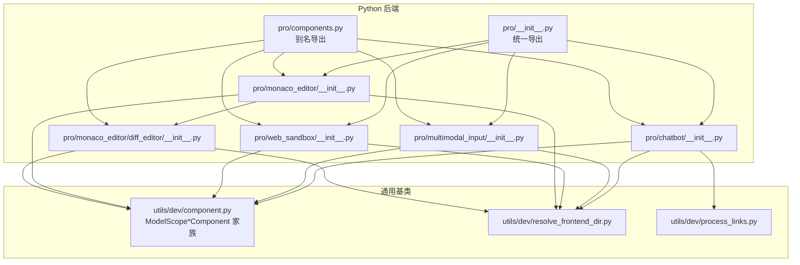
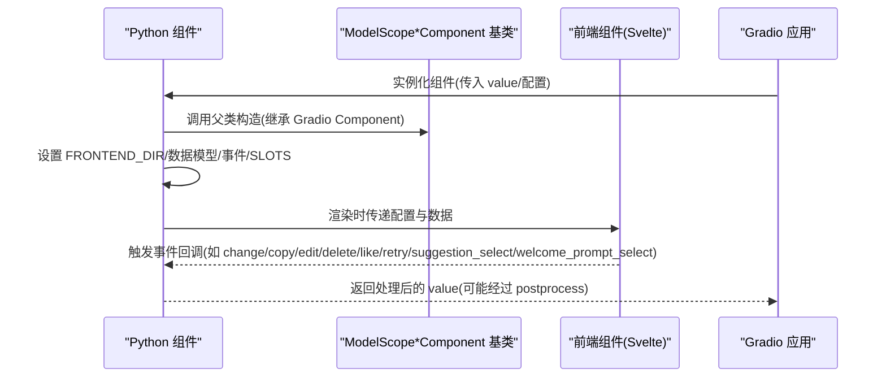
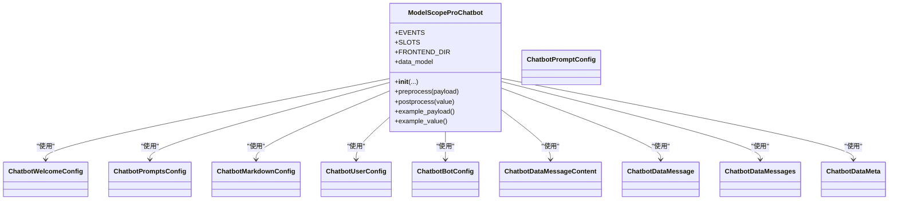
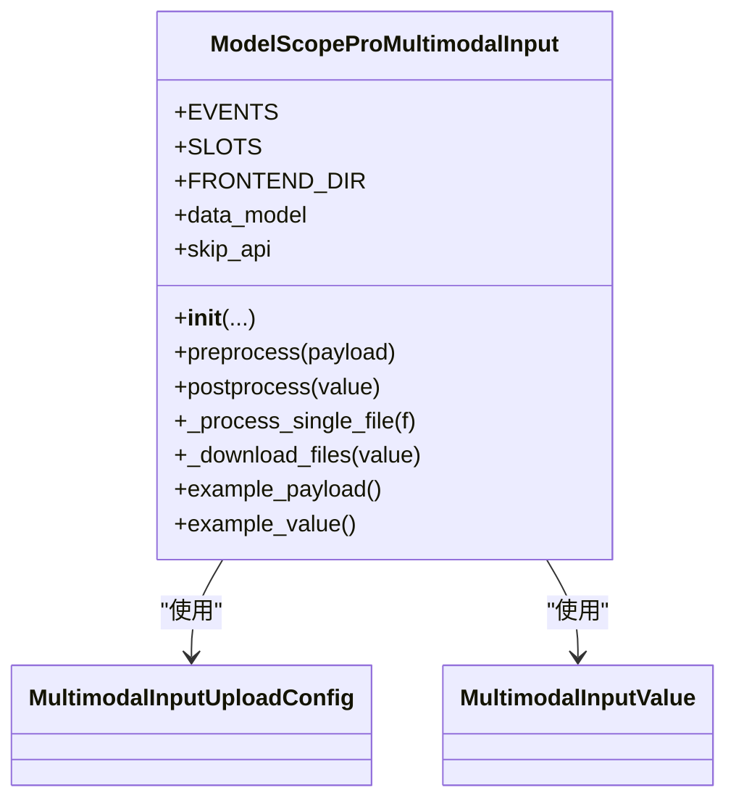
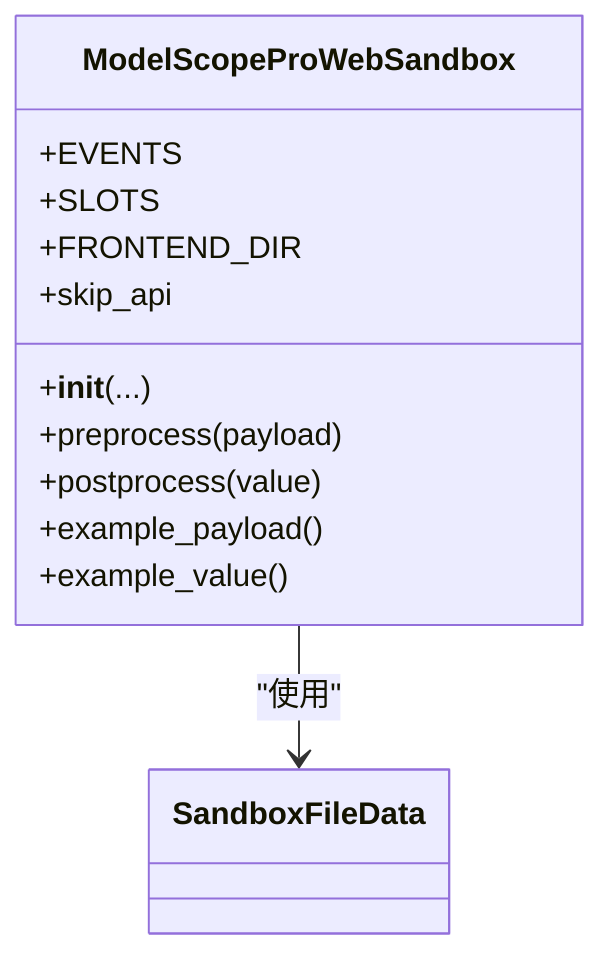
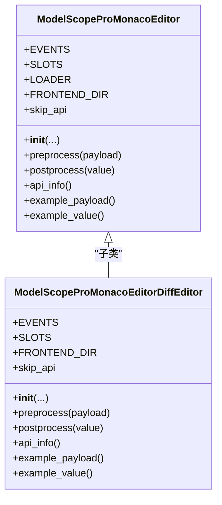
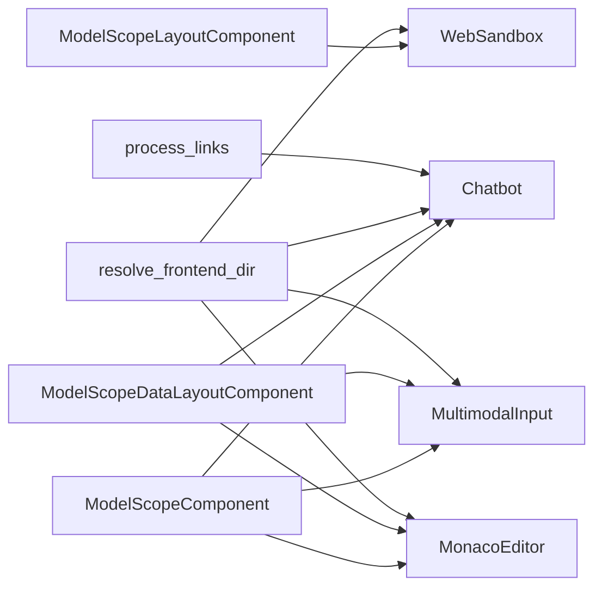

# 专业组件 API

<cite>
**本文引用的文件**
- [backend/modelscope_studio/components/pro/__init__.py](file://backend/modelscope_studio/components/pro/__init__.py)
- [backend/modelscope_studio/components/pro/components.py](file://backend/modelscope_studio/components/pro/components.py)
- [backend/modelscope_studio/components/pro/chatbot/__init__.py](file://backend/modelscope_studio/components/pro/chatbot/__init__.py)
- [backend/modelscope_studio/components/pro/multimodal_input/__init__.py](file://backend/modelscope_studio/components/pro/multimodal_input/__init__.py)
- [backend/modelscope_studio/components/pro/web_sandbox/__init__.py](file://backend/modelscope_studio/components/pro/web_sandbox/__init__.py)
- [backend/modelscope_studio/components/pro/monaco_editor/__init__.py](file://backend/modelscope_studio/components/pro/monaco_editor/__init__.py)
- [backend/modelscope_studio/components/pro/monaco_editor/diff_editor/__init__.py](file://backend/modelscope_studio/components/pro/monaco_editor/diff_editor/__init__.py)
- [backend/modelscope_studio/utils/dev/component.py](file://backend/modelscope_studio/utils/dev/component.py)
- [backend/modelscope_studio/utils/dev/resolve_frontend_dir.py](file://backend/modelscope_studio/utils/dev/resolve_frontend_dir.py)
- [backend/modelscope_studio/utils/dev/process_links.py](file://backend/modelscope_studio/utils/dev/process_links.py)
- [docs/demos/example.py](file://docs/demos/example.py)
- [docs/layout_templates/chatbot/app.py](file://docs/layout_templates/chatbot/app.py)
- [docs/layout_templates/chatbot/demos/basic.py](file://docs/layout_templates/chatbot/demos/basic.py)
- [docs/components/pro/chatbot/demos/chatbot_config.py](file://docs/components/pro/chatbot/demos/chatbot_config.py)
</cite>

## 目录

1. [简介](#简介)
2. [项目结构](#项目结构)
3. [核心组件](#核心组件)
4. [架构总览](#架构总览)
5. [详细组件分析](#详细组件分析)
6. [依赖分析](#依赖分析)
7. [性能考虑](#性能考虑)
8. [故障排查指南](#故障排查指南)
9. [结论](#结论)
10. [附录](#附录)

## 简介

本文件为专业组件库（modelscope_studio.components.pro）的 Python API 参考文档，覆盖以下 AI 应用专用组件：

- Chatbot：对话消息容器与渲染组件，支持用户/助手消息、欢迎提示、建议提示、工具调用、文件内容等丰富能力。
- MultimodalInput：多模态输入组件，支持文本与附件上传、粘贴、拖拽、语音等输入形态。
- WebSandbox：网页沙盒组件，用于在隔离环境中渲染 React/HTML 模板，支持编译与渲染错误事件。
- MonacoEditor：代码编辑器组件，支持语言高亮、只读、选项配置、挂载/变更/校验事件；提供 DiffEditor 子类。

文档记录各组件的导入路径、构造函数参数、属性定义、方法签名与返回值类型，并给出面向复杂 AI 应用的标准实例化与使用示例，涵盖聊天机器人集成、多模态输入处理、网页沙盒隔离等高级用法。同时说明组件的事件绑定、数据流处理策略、前后端数据转换逻辑以及性能与并发相关注意事项。

## 项目结构

专业组件位于后端 Python 包 modelscope_studio/components/pro 下，按功能划分为 chatbot、multimodal_input、web_sandbox、monaco_editor 四个子模块，另有统一导出入口与别名导出。

图表来源

- [backend/modelscope_studio/components/pro/**init**.py:1-7](file://backend/modelscope_studio/components/pro/__init__.py#L1-L7)
- [backend/modelscope_studio/components/pro/components.py:1-8](file://backend/modelscope_studio/components/pro/components.py#L1-L8)
- [backend/modelscope_studio/components/pro/chatbot/**init**.py:286-495](file://backend/modelscope_studio/components/pro/chatbot/__init__.py#L286-L495)
- [backend/modelscope_studio/components/pro/multimodal_input/**init**.py:82-259](file://backend/modelscope_studio/components/pro/multimodal_input/__init__.py#L82-L259)
- [backend/modelscope_studio/components/pro/web_sandbox/**init**.py:15-86](file://backend/modelscope_studio/components/pro/web_sandbox/__init__.py#L15-L86)
- [backend/modelscope_studio/components/pro/monaco_editor/**init**.py:16-107](file://backend/modelscope_studio/components/pro/monaco_editor/__init__.py#L16-L107)
- [backend/modelscope_studio/components/pro/monaco_editor/diff_editor/**init**.py:10-106](file://backend/modelscope_studio/components/pro/monaco_editor/diff_editor/__init__.py#L10-L106)
- [backend/modelscope_studio/utils/dev/component.py:11-169](file://backend/modelscope_studio/utils/dev/component.py#L11-L169)
- [backend/modelscope_studio/utils/dev/resolve_frontend_dir.py:4-17](file://backend/modelscope_studio/utils/dev/resolve_frontend_dir.py#L4-L17)
- [backend/modelscope_studio/utils/dev/process_links.py:9-61](file://backend/modelscope_studio/utils/dev/process_links.py#L9-L61)

章节来源

- [backend/modelscope_studio/components/pro/**init**.py:1-7](file://backend/modelscope_studio/components/pro/__init__.py#L1-L7)
- [backend/modelscope_studio/components/pro/components.py:1-8](file://backend/modelscope_studio/components/pro/components.py#L1-L8)

## 核心组件

本节概述四个专业组件的职责与典型用途：

- Chatbot：用于构建对话界面，管理消息列表、欢迎提示、建议提示、动作按钮、Markdown 渲染、文件/工具内容等。
- MultimodalInput：用于接收文本与附件的多模态输入，支持上传、粘贴、拖拽、预览、下载等流程。
- WebSandbox：用于在隔离环境中渲染模板（React/HTML），捕获编译与渲染错误事件。
- MonacoEditor：用于在浏览器中嵌入代码编辑器，支持语言、只读、选项、挂载/变更/校验事件；提供 DiffEditor 对比视图。

章节来源

- [backend/modelscope_studio/components/pro/chatbot/**init**.py:286-495](file://backend/modelscope_studio/components/pro/chatbot/__init__.py#L286-L495)
- [backend/modelscope_studio/components/pro/multimodal_input/**init**.py:82-259](file://backend/modelscope_studio/components/pro/multimodal_input/__init__.py#L82-L259)
- [backend/modelscope_studio/components/pro/web_sandbox/**init**.py:15-86](file://backend/modelscope_studio/components/pro/web_sandbox/__init__.py#L15-L86)
- [backend/modelscope_studio/components/pro/monaco_editor/**init**.py:16-107](file://backend/modelscope_studio/components/pro/monaco_editor/__init__.py#L16-L107)

## 架构总览

专业组件基于 Gradio 组件体系扩展，通过统一的基类与前端目录解析实现前后端桥接。组件在初始化时设置 FRONTEND_DIR，指向对应前端 Svelte 组件目录；通过 preprocess/postprocess 实现数据的前后端转换；通过 EVENTS/SLOTS 提供事件与插槽扩展点。

图表来源

- [backend/modelscope_studio/utils/dev/component.py:11-169](file://backend/modelscope_studio/utils/dev/component.py#L11-L169)
- [backend/modelscope_studio/utils/dev/resolve_frontend_dir.py:4-17](file://backend/modelscope_studio/utils/dev/resolve_frontend_dir.py#L4-L17)
- [backend/modelscope_studio/components/pro/chatbot/**init**.py:286-495](file://backend/modelscope_studio/components/pro/chatbot/__init__.py#L286-L495)
- [backend/modelscope_studio/components/pro/multimodal_input/**init**.py:82-259](file://backend/modelscope_studio/components/pro/multimodal_input/__init__.py#L82-L259)
- [backend/modelscope_studio/components/pro/web_sandbox/**init**.py:15-86](file://backend/modelscope_studio/components/pro/web_sandbox/__init__.py#L15-L86)
- [backend/modelscope_studio/components/pro/monaco_editor/**init**.py:16-107](file://backend/modelscope_studio/components/pro/monaco_editor/__init__.py#L16-L107)

## 详细组件分析

### Chatbot 组件

- 导入路径
  - 主类：modelscope_studio.components.pro.Chatbot
  - 别名：modelscope_studio.components.pro.ProChatbot
- 作用
  - 管理对话消息列表，支持用户/助手消息、欢迎提示、建议提示、动作按钮、Markdown 渲染、文件/工具内容等。
- 关键数据模型
  - ChatbotWelcomeConfig、ChatbotPromptsConfig、ChatbotPromptConfig、ChatbotMarkdownConfig、ChatbotUserConfig、ChatbotBotConfig、ChatbotDataMessageContent、ChatbotDataMessage、ChatbotDataMessages、ChatbotDataMeta
- 构造函数参数要点
  - value：可为回调或消息列表/字典，支持消息状态 pending/done、分隔符、元数据反馈等
  - 高度与滚动：height、min_height、max_height、auto_scroll、show_scroll_to_bottom_button、scroll_to_bottom_button_offset
  - 欢迎与 Markdown：welcome_config、markdown_config
  - 用户/助手样式与动作：user_config、bot_config（含 actions/disabled_actions、avatar、typing 等）
  - 其他：elem_id、elem_classes、elem_style、visible、render 等
- 方法与行为
  - preprocess：将消息内容中的文件路径标准化，便于前端展示
  - postprocess：将文件路径转换为 FileData 结构，支持本地与远程 URL
  - 事件：change、copy、edit、delete、like、retry、suggestion_select、welcome_prompt_select
  - 插槽：role
- 使用示例（参考）
  - 基础聊天模板应用入口：[docs/layout_templates/chatbot/app.py:1-7](file://docs/layout_templates/chatbot/app.py#L1-L7)
  - 聊天配置与事件演示：[docs/components/pro/chatbot/demos/chatbot_config.py:1-40](file://docs/components/pro/chatbot/demos/chatbot_config.py#L1-L40)

图表来源

- [backend/modelscope_studio/components/pro/chatbot/**init**.py:14-285](file://backend/modelscope_studio/components/pro/chatbot/__init__.py#L14-L285)
- [backend/modelscope_studio/components/pro/chatbot/**init**.py:286-495](file://backend/modelscope_studio/components/pro/chatbot/__init__.py#L286-L495)

章节来源

- [backend/modelscope_studio/components/pro/chatbot/**init**.py:14-285](file://backend/modelscope_studio/components/pro/chatbot/__init__.py#L14-L285)
- [backend/modelscope_studio/components/pro/chatbot/**init**.py:286-495](file://backend/modelscope_studio/components/pro/chatbot/__init__.py#L286-L495)
- [docs/layout_templates/chatbot/app.py:1-7](file://docs/layout_templates/chatbot/app.py#L1-L7)
- [docs/components/pro/chatbot/demos/chatbot_config.py:1-40](file://docs/components/pro/chatbot/demos/chatbot_config.py#L1-L40)

### MultimodalInput 组件

- 导入路径
  - 主类：modelscope_studio.components.pro.MultimodalInput
  - 别名：modelscope_studio.components.pro.ProMultimodalInput
- 作用
  - 接收文本与附件的多模态输入，支持上传、粘贴、拖拽、预览、下载等流程。
- 关键数据模型
  - MultimodalInputUploadConfig：上传行为与 UI 配置
  - MultimodalInputValue：包含 files 与 text 的输入值
- 构造函数参数要点
  - value：MultimodalInputValue 或其字典形式
  - 模式与尺寸：mode、auto_size、footer/header/prefix/suffix、placeholder、submit_type
  - 上传配置：upload_config（fullscreen_drop、allow_upload、allow_paste_file、allow_speech、max_count、directory、multiple、overflow、title、image_props、placeholder 等）
  - 样式与状态：disabled、read_only、loading、class_names、styles、root_class_name
  - 其他：elem_id、elem_classes、elem_style、visible、render 等
- 方法与行为
  - preprocess：将上传的文件转换为可缓存的命名字符串，便于后续处理
  - postprocess：将文件路径下载到本地缓存并封装为 FileData 列表
  - 事件：change、submit、cancel、key_down/key_press、focus、blur、upload、paste、paste_file、skill_closable_close、drop、download、preview、remove
  - 插槽：suffix、header、prefix、footer、skill.title、skill.toolTip.title、skill.closable.closeIcon
- 使用示例（参考）
  - 示例应用入口：[docs/demos/example.py:1-11](file://docs/demos/example.py#L1-L11)

图表来源

- [backend/modelscope_studio/components/pro/multimodal_input/**init**.py:18-259](file://backend/modelscope_studio/components/pro/multimodal_input/__init__.py#L18-L259)
- [backend/modelscope_studio/components/pro/multimodal_input/**init**.py:82-259](file://backend/modelscope_studio/components/pro/multimodal_input/__init__.py#L82-L259)

章节来源

- [backend/modelscope_studio/components/pro/multimodal_input/**init**.py:18-259](file://backend/modelscope_studio/components/pro/multimodal_input/__init__.py#L18-L259)
- [backend/modelscope_studio/components/pro/multimodal_input/**init**.py:82-259](file://backend/modelscope_studio/components/pro/multimodal_input/__init__.py#L82-L259)
- [docs/demos/example.py:1-11](file://docs/demos/example.py#L1-L11)

### WebSandbox 组件

- 导入路径
  - 主类：modelscope_studio.components.pro.WebSandbox
  - 别名：modelscope_studio.components.pro.ProWebSandbox
- 作用
  - 在隔离环境中渲染 React/HTML 模板，支持编译与渲染错误事件监听。
- 关键数据模型
  - SandboxFileData：模板文件结构（code、is_entry）
- 构造函数参数要点
  - value：字典，键为文件名，值为字符串或 SandboxFileData
  - 模板类型：template（'react' | 'html'）
  - 错误显示：show_render_error、show_compile_error、compile_error_render
  - 外部依赖：imports（模块映射）
  - 尺寸：height
  - 其他：elem_id、elem_classes、elem_style、visible、render 等
- 方法与行为
  - preprocess/postprocess：直接透传（skip_api=True）
  - 事件：compile_success、compile_error、render_error、custom
  - 插槽：compileErrorRender
- 使用示例（参考）
  - 示例应用入口：[docs/demos/example.py:1-11](file://docs/demos/example.py#L1-L11)

图表来源

- [backend/modelscope_studio/components/pro/web_sandbox/**init**.py:10-86](file://backend/modelscope_studio/components/pro/web_sandbox/__init__.py#L10-L86)
- [backend/modelscope_studio/components/pro/web_sandbox/**init**.py:15-86](file://backend/modelscope_studio/components/pro/web_sandbox/__init__.py#L15-L86)

章节来源

- [backend/modelscope_studio/components/pro/web_sandbox/**init**.py:10-86](file://backend/modelscope_studio/components/pro/web_sandbox/__init__.py#L10-L86)
- [backend/modelscope_studio/components/pro/web_sandbox/**init**.py:15-86](file://backend/modelscope_studio/components/pro/web_sandbox/__init__.py#L15-L86)
- [docs/demos/example.py:1-11](file://docs/demos/example.py#L1-L11)

### MonacoEditor 组件

- 导入路径
  - 主类：modelscope_studio.components.pro.MonacoEditor
  - 别名：modelscope_studio.components.pro.ProMonacoEditor
  - DiffEditor：modelscope_studio.components.pro.MonacoEditorDiffEditor（作为子类）
- 作用
  - 提供代码编辑器，支持语言、只读、选项、挂载/变更/校验事件；DiffEditor 提供对比视图。
- 构造函数参数要点
  - value：初始编辑内容
  - 语言与只读：language、read_only
  - 生命周期钩子：before_mount、after_mount
  - 服务覆盖：override_services
  - 加载文案：loading
  - 编辑器选项：options
  - 行定位：line
  - 尺寸：height
  - 其他：elem_id、elem_classes、elem_style、visible、render 等
- 方法与行为
  - preprocess/postprocess：直接透传（skip_api=False）
  - 事件：mount、change、validate
  - 插槽：loading
  - DiffEditor：与主编辑器共享加载器配置，支持 original/original_language/modified_language
- 使用示例（参考）
  - 示例应用入口：[docs/demos/example.py:1-11](file://docs/demos/example.py#L1-L11)

图表来源

- [backend/modelscope_studio/components/pro/monaco_editor/**init**.py:16-107](file://backend/modelscope_studio/components/pro/monaco_editor/__init__.py#L16-L107)
- [backend/modelscope_studio/components/pro/monaco_editor/diff_editor/**init**.py:10-106](file://backend/modelscope_studio/components/pro/monaco_editor/diff_editor/__init__.py#L10-L106)

章节来源

- [backend/modelscope_studio/components/pro/monaco_editor/**init**.py:16-107](file://backend/modelscope_studio/components/pro/monaco_editor/__init__.py#L16-L107)
- [backend/modelscope_studio/components/pro/monaco_editor/diff_editor/**init**.py:10-106](file://backend/modelscope_studio/components/pro/monaco_editor/diff_editor/__init__.py#L10-L106)
- [docs/demos/example.py:1-11](file://docs/demos/example.py#L1-L11)

## 依赖分析

- 组件基类
  - ModelScopeLayoutComponent：布局型组件基类，适用于无需数据传输的容器组件（如 WebSandbox）
  - ModelScopeComponent：基础组件基类，适用于数据型组件（如 Chatbot/MultimodalInput/MonacoEditor）
  - ModelScopeDataLayoutComponent：兼具数据与布局能力，适用于需要前后端数据交换的组件（如 Chatbot/MultimodalInput/MonacoEditor）
- 前端目录解析
  - resolve_frontend_dir：根据组件名与类型（pro/antd/antdx/base）生成相对路径，确保前端资源正确加载
- 数据链接处理
  - process_links：对 HTML/Markdown 中的链接进行转换，将本地文件转为可访问的缓存 URL

图表来源

- [backend/modelscope_studio/utils/dev/component.py:11-169](file://backend/modelscope_studio/utils/dev/component.py#L11-L169)
- [backend/modelscope_studio/utils/dev/resolve_frontend_dir.py:4-17](file://backend/modelscope_studio/utils/dev/resolve_frontend_dir.py#L4-L17)
- [backend/modelscope_studio/utils/dev/process_links.py:9-61](file://backend/modelscope_studio/utils/dev/process_links.py#L9-L61)

章节来源

- [backend/modelscope_studio/utils/dev/component.py:11-169](file://backend/modelscope_studio/utils/dev/component.py#L11-L169)
- [backend/modelscope_studio/utils/dev/resolve_frontend_dir.py:4-17](file://backend/modelscope_studio/utils/dev/resolve_frontend_dir.py#L4-L17)
- [backend/modelscope_studio/utils/dev/process_links.py:9-61](file://backend/modelscope_studio/utils/dev/process_links.py#L9-L61)

## 性能考虑

- 数据序列化与传输
  - Chatbot/MultimodalInput/MonacoEditor 为数据型组件，preprocess/postprocess 会进行文件路径与 FileData 的转换，避免在前端直接处理大文件导致的内存压力。
- 前端资源加载
  - MonacoEditor 支持本地或 CDN 加载器配置，合理选择可减少首屏加载时间；DiffEditor 复用主编辑器的加载器配置。
- 事件绑定与更新
  - 组件通过 \_internal.update 动态绑定事件，避免不必要的重渲染；WebSandbox 的 skip_api=True，减少 API 层开销。
- 文件处理
  - MultimodalInput 在 postprocess 中将远程 URL 下载至缓存目录，避免重复网络请求；process_links 将本地资源转为缓存 URL，提升稳定性与性能。

## 故障排查指南

- 编辑器加载失败
  - 检查 MonacoEditor 的 LOADER 配置（mode/local/cdn），确认 CDN 可达性或切换为本地加载。
  - 查看 mount/change/validate 事件是否触发，定位问题阶段。
- 文件无法显示或下载异常
  - Chatbot 的文件内容在 postprocess 中转换为 FileData，检查路径是否为本地文件或有效 URL。
  - MultimodalInput 的 postprocess 会将远程 URL 下载到缓存，确认缓存目录权限与网络可达性。
- 沙盒编译/渲染错误
  - WebSandbox 提供 compile_error/render_error 事件，结合 compileErrorRender 插槽定位错误。
- 链接失效
  - 使用 process_links 对 HTML/Markdown 中的链接进行转换，确保本地资源被正确缓存与访问。

章节来源

- [backend/modelscope_studio/components/pro/monaco_editor/**init**.py:44-107](file://backend/modelscope_studio/components/pro/monaco_editor/__init__.py#L44-L107)
- [backend/modelscope_studio/components/pro/chatbot/**init**.py:475-495](file://backend/modelscope_studio/components/pro/chatbot/__init__.py#L475-L495)
- [backend/modelscope_studio/components/pro/multimodal_input/**init**.py:233-259](file://backend/modelscope_studio/components/pro/multimodal_input/__init__.py#L233-L259)
- [backend/modelscope_studio/components/pro/web_sandbox/**init**.py:19-86](file://backend/modelscope_studio/components/pro/web_sandbox/__init__.py#L19-L86)
- [backend/modelscope_studio/utils/dev/process_links.py:9-61](file://backend/modelscope_studio/utils/dev/process_links.py#L9-L61)

## 结论

专业组件库围绕对话、多模态输入、网页沙盒与代码编辑四大方向，提供了完整的 Python API 与前端集成方案。通过统一的基类体系、灵活的事件与插槽机制、完善的前后端数据转换，能够满足复杂 AI 应用的开发需求。建议在实际项目中结合示例与最佳实践，合理配置加载器、事件与数据流，以获得稳定且高性能的用户体验。

## 附录

- 统一导出与别名
  - 主模块导出：Chatbot、MonacoEditor、MonacoEditorDiffEditor、MultimodalInput、WebSandbox
  - 别名导出：ProChatbot、ProMonacoEditor、ProMonacoEditorDiffEditor、ProMultimodalInput、ProWebSandbox
- 示例入口
  - 基础示例：[docs/demos/example.py:1-11](file://docs/demos/example.py#L1-L11)
  - 聊天模板应用：[docs/layout_templates/chatbot/app.py:1-7](file://docs/layout_templates/chatbot/app.py#L1-L7)
  - 聊天配置与事件演示：[docs/components/pro/chatbot/demos/chatbot_config.py:1-40](file://docs/components/pro/chatbot/demos/chatbot_config.py#L1-L40)

章节来源

- [backend/modelscope_studio/components/pro/**init**.py:1-7](file://backend/modelscope_studio/components/pro/__init__.py#L1-L7)
- [backend/modelscope_studio/components/pro/components.py:1-8](file://backend/modelscope_studio/components/pro/components.py#L1-L8)
- [docs/demos/example.py:1-11](file://docs/demos/example.py#L1-L11)
- [docs/layout_templates/chatbot/app.py:1-7](file://docs/layout_templates/chatbot/app.py#L1-L7)
- [docs/components/pro/chatbot/demos/chatbot_config.py:1-40](file://docs/components/pro/chatbot/demos/chatbot_config.py#L1-L40)
