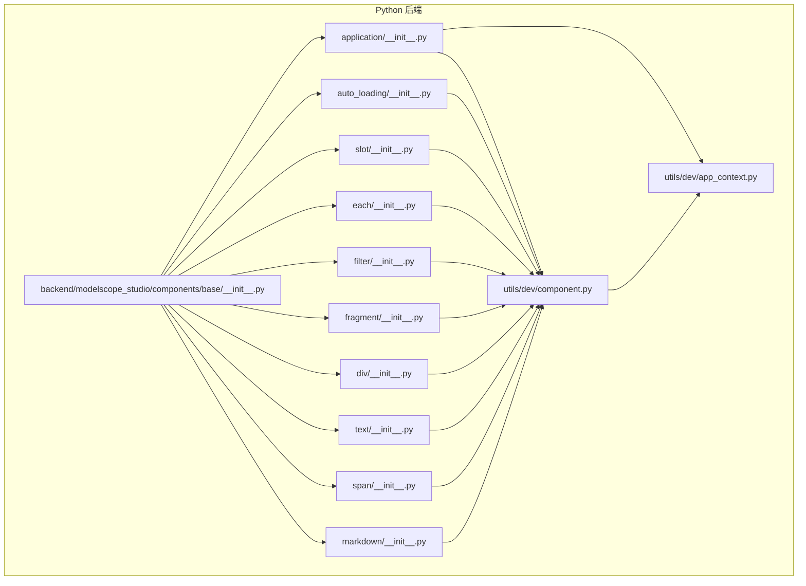
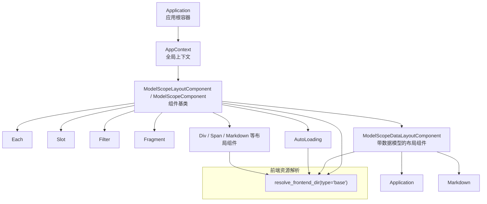
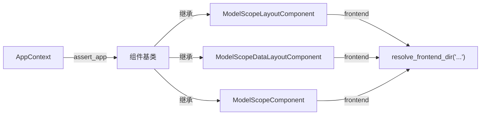

# 基础组件 API

<cite>
**本文引用的文件**
- [backend/modelscope_studio/components/base/__init__.py](file://backend/modelscope_studio/components/base/__init__.py)
- [backend/modelscope_studio/components/base/application/__init__.py](file://backend/modelscope_studio/components/base/application/__init__.py)
- [backend/modelscope_studio/components/base/auto_loading/__init__.py](file://backend/modelscope_studio/components/base/auto_loading/__init__.py)
- [backend/modelscope_studio/components/base/slot/__init__.py](file://backend/modelscope_studio/components/base/slot/__init__.py)
- [backend/modelscope_studio/components/base/each/__init__.py](file://backend/modelscope_studio/components/base/each/__init__.py)
- [backend/modelscope_studio/components/base/filter/__init__.py](file://backend/modelscope_studio/components/base/filter/__init__.py)
- [backend/modelscope_studio/components/base/fragment/__init__.py](file://backend/modelscope_studio/components/base/fragment/__init__.py)
- [backend/modelscope_studio/components/base/div/__init__.py](file://backend/modelscope_studio/components/base/div/__init__.py)
- [backend/modelscope_studio/components/base/text/__init__.py](file://backend/modelscope_studio/components/base/text/__init__.py)
- [backend/modelscope_studio/components/base/span/__init__.py](file://backend/modelscope_studio/components/base/span/__init__.py)
- [backend/modelscope_studio/components/base/markdown/__init__.py](file://backend/modelscope_studio/components/base/markdown/__init__.py)
- [backend/modelscope_studio/utils/dev/component.py](file://backend/modelscope_studio/utils/dev/component.py)
- [backend/modelscope_studio/utils/dev/app_context.py](file://backend/modelscope_studio/utils/dev/app_context.py)
- [docs/components/base/application/README.md](file://docs/components/base/application/README.md)
- [docs/components/base/each/README.md](file://docs/components/base/each/README.md)
- [docs/components/base/slot/README.md](file://docs/components/base/slot/README.md)
</cite>

## 目录

1. [简介](#简介)
2. [项目结构](#项目结构)
3. [核心组件](#核心组件)
4. [架构总览](#架构总览)
5. [详细组件分析](#详细组件分析)
6. [依赖分析](#依赖分析)
7. [性能考虑](#性能考虑)
8. [故障排查指南](#故障排查指南)
9. [结论](#结论)
10. [附录：使用示例与最佳实践](#附录使用示例与最佳实践)

## 简介

本文件为基础组件库的 Python API 参考文档，覆盖 modelscope_studio.components.base.\* 下的核心组件，包括 Application、AutoLoading、Slot、Each、Filter、Fragment、Layout（以 Div/Span/Markdown 等常用布局型组件为代表）、Text 等。文档内容基于仓库源码与配套文档整理，重点说明：

- 完整导入路径与使用方式
- 构造函数参数、属性定义、方法签名与返回值类型
- 组件组合模式（应用容器、条件渲染、循环遍历）
- 生命周期管理、上下文传递与插槽系统接口
- 性能优化策略、内存管理与错误处理机制
- 组件继承模式、扩展开发与最佳实践

## 项目结构

基础组件位于后端 Python 包 modelscope_studio/components/base，通过统一的导出入口聚合；前端资源由工具模块解析并绑定到对应前端目录。

图表来源

- [backend/modelscope_studio/components/base/**init**.py:1-11](file://backend/modelscope_studio/components/base/__init__.py#L1-L11)
- [backend/modelscope_studio/components/base/application/**init**.py:26-115](file://backend/modelscope_studio/components/base/application/__init__.py#L26-L115)
- [backend/modelscope_studio/components/base/auto_loading/**init**.py:8-65](file://backend/modelscope_studio/components/base/auto_loading/__init__.py#L8-L65)
- [backend/modelscope_studio/components/base/slot/**init**.py:8-50](file://backend/modelscope_studio/components/base/slot/__init__.py#L8-L50)
- [backend/modelscope_studio/components/base/each/**init**.py:17-73](file://backend/modelscope_studio/components/base/each/__init__.py#L17-L73)
- [backend/modelscope_studio/components/base/filter/**init**.py:8-45](file://backend/modelscope_studio/components/base/filter/__init__.py#L8-L45)
- [backend/modelscope_studio/components/base/fragment/**init**.py:8-49](file://backend/modelscope_studio/components/base/fragment/__init__.py#L8-L49)
- [backend/modelscope_studio/components/base/div/**init**.py:10-86](file://backend/modelscope_studio/components/base/div/__init__.py#L10-L86)
- [backend/modelscope_studio/components/base/text/**init**.py:8-57](file://backend/modelscope_studio/components/base/text/__init__.py#L8-L57)
- [backend/modelscope_studio/components/base/span/**init**.py:10-87](file://backend/modelscope_studio/components/base/span/__init__.py#L10-L87)
- [backend/modelscope_studio/components/base/markdown/**init**.py:11-174](file://backend/modelscope_studio/components/base/markdown/__init__.py#L11-L174)
- [backend/modelscope_studio/utils/dev/component.py:11-169](file://backend/modelscope_studio/utils/dev/component.py#L11-L169)
- [backend/modelscope_studio/utils/dev/app_context.py:4-25](file://backend/modelscope_studio/utils/dev/app_context.py#L4-L25)

章节来源

- [backend/modelscope_studio/components/base/**init**.py:1-11](file://backend/modelscope_studio/components/base/__init__.py#L1-L11)

## 核心组件

以下为核心基础组件的导入路径与关键能力概览（按字母排序）：

- Application
  - 导入路径：from modelscope_studio.components.base import Application
  - 能力：应用根容器，监听页面生命周期事件（mount、resize、unmount、custom），提供页面环境数据（屏幕尺寸、语言、主题、userAgent）。
  - 关键点：必须作为所有组件的根容器；支持自定义事件桥接（window.ms_globals.dispatch → Python 侧事件）。

- AutoLoading
  - 导入路径：from modelscope_studio.components.base import AutoLoading
  - 能力：自动加载状态包装器，支持插槽（render、errorRender、loadingText），可控制遮罩、计时器与错误展示。

- Slot
  - 导入路径：from modelscope_studio.components.base import Slot
  - 能力：插槽占位组件，配合目标组件的 SLOTS 使用，支持 params_mapping 参数映射。

- Each
  - 导入路径：from modelscope_studio.components.base import Each
  - 能力：列表遍历渲染，注入上下文，支持 as_item 过滤与 context_value 深合并。

- Filter
  - 导入路径：from modelscope_studio.components.base import Filter
  - 能力：条件过滤组件，用于根据参数映射决定是否渲染子树。

- Fragment
  - 导入路径：from modelscope_studio.components.base import Fragment
  - 能力：分组容器，不产生额外 DOM，适合逻辑分组与插槽挂载。

- Div/Text/Span/Markdown
  - 导入路径：from modelscope_studio.components.base import Div, Text, Span, Markdown
  - 能力：基础布局与文本组件，支持附加属性、事件绑定、复制按钮等特性。

章节来源

- [backend/modelscope_studio/components/base/**init**.py:1-11](file://backend/modelscope_studio/components/base/__init__.py#L1-L11)
- [docs/components/base/application/README.md:1-56](file://docs/components/base/application/README.md#L1-L56)
- [docs/components/base/each/README.md:1-32](file://docs/components/base/each/README.md#L1-L32)
- [docs/components/base/slot/README.md:1-17](file://docs/components/base/slot/README.md#L1-L17)

## 架构总览

基础组件的运行时架构围绕“应用上下文 + 组件基类 + 前端资源解析”展开。组件在构造时会断言已存在 Application 上下文，并通过内部 \_internal 字典传递布局与索引信息给前端；部分组件支持插槽与事件绑定，最终由前端渲染引擎消费。

图表来源

- [backend/modelscope_studio/utils/dev/app_context.py:4-25](file://backend/modelscope_studio/utils/dev/app_context.py#L4-L25)
- [backend/modelscope_studio/utils/dev/component.py:11-169](file://backend/modelscope_studio/utils/dev/component.py#L11-L169)
- [backend/modelscope_studio/components/base/application/**init**.py:26-115](file://backend/modelscope_studio/components/base/application/__init__.py#L26-L115)
- [backend/modelscope_studio/components/base/markdown/**init**.py:11-174](file://backend/modelscope_studio/components/base/markdown/__init__.py#L11-L174)
- [backend/modelscope_studio/components/base/auto_loading/**init**.py:8-65](file://backend/modelscope_studio/components/base/auto_loading/__init__.py#L8-L65)
- [backend/modelscope_studio/components/base/div/**init**.py:10-86](file://backend/modelscope_studio/components/base/div/__init__.py#L10-L86)
- [backend/modelscope_studio/components/base/slot/**init**.py:8-50](file://backend/modelscope_studio/components/base/slot/__init__.py#L8-L50)
- [backend/modelscope_studio/components/base/each/**init**.py:17-73](file://backend/modelscope_studio/components/base/each/__init__.py#L17-L73)
- [backend/modelscope_studio/components/base/filter/**init**.py:8-45](file://backend/modelscope_studio/components/base/filter/__init__.py#L8-L45)
- [backend/modelscope_studio/components/base/fragment/**init**.py:8-49](file://backend/modelscope_studio/components/base/fragment/__init__.py#L8-L49)

## 详细组件分析

### Application

- 导入路径：from modelscope_studio.components.base import Application
- 继承关系：ModelScopeDataLayoutComponent
- 事件：
  - mount：页面挂载
  - resize：窗口大小变化
  - unmount：页面卸载
  - custom：通过 window.ms_globals.dispatch 触发的自定义事件
- 数据模型：
  - ApplicationPageScreenData：width、height、scrollX、scrollY
  - ApplicationPageData：screen、language、theme、userAgent
- 关键行为：
  - 构造时设置 AppContext
  - 支持 preprocess/postprocess 原样透传
  - 提供 example_payload/example_value

章节来源

- [backend/modelscope_studio/components/base/application/**init**.py:26-115](file://backend/modelscope_studio/components/base/application/__init__.py#L26-L115)
- [docs/components/base/application/README.md:1-56](file://docs/components/base/application/README.md#L1-L56)

### AutoLoading

- 导入路径：from modelscope_studio.components.base import AutoLoading
- 继承关系：ModelScopeLayoutComponent
- 插槽：render、errorRender、loadingText
- 关键属性：
  - generating、show_error、show_mask、show_timer、loading_text
- 关键行为：
  - skip_api=True，不参与常规 API 流程
  - preprocess/postprocess 对字符串进行原样处理

章节来源

- [backend/modelscope_studio/components/base/auto_loading/**init**.py:8-65](file://backend/modelscope_studio/components/base/auto_loading/__init__.py#L8-L65)

### Slot

- 导入路径：from modelscope_studio.components.base import Slot
- 继承关系：ModelScopeLayoutComponent
- 关键属性：
  - value：插槽名称
  - params_mapping：JS 函数字符串，用于参数映射
- 关键行为：
  - 当父级为 Slot 时，value 会拼接形成层级路径
  - skip_api=True

章节来源

- [backend/modelscope_studio/components/base/slot/**init**.py:8-50](file://backend/modelscope_studio/components/base/slot/__init__.py#L8-L50)
- [docs/components/base/slot/README.md:1-17](file://docs/components/base/slot/README.md#L1-L17)

### Each

- 导入路径：from modelscope_studio.components.base import Each
- 继承关系：ModelScopeDataLayoutComponent
- 数据模型：ModelScopeEachData（root: list）
- 关键属性：
  - value：list[dict] 或 Callable
  - context_value：dict，用于深合并到上下文
  - as_item：字符串，过滤上下文字段
- 关键行为：
  - preprocess 将 ModelScopeEachData 解包为 list
  - postprocess 返回 list
  - skip_api=False，参与 API 流程

章节来源

- [backend/modelscope_studio/components/base/each/**init**.py:17-73](file://backend/modelscope_studio/components/base/each/__init__.py#L17-L73)
- [docs/components/base/each/README.md:1-32](file://docs/components/base/each/README.md#L1-L32)

### Filter

- 导入路径：from modelscope_studio.components.base import Filter
- 继承关系：ModelScopeLayoutComponent
- 关键属性：
  - params_mapping：参数映射字符串
- 关键行为：
  - skip_api=True，不参与 API 流程

章节来源

- [backend/modelscope_studio/components/base/filter/**init**.py:8-45](file://backend/modelscope_studio/components/base/filter/__init__.py#L8-L45)

### Fragment

- 导入路径：from modelscope_studio.components.base import Fragment
- 继承关系：ModelScopeLayoutComponent
- 关键行为：
  - skip_api=True，不参与 API 流程
  - 适合逻辑分组与插槽挂载

章节来源

- [backend/modelscope_studio/components/base/fragment/**init**.py:8-49](file://backend/modelscope_studio/components/base/fragment/__init__.py#L8-L49)

### Div

- 导入路径：from modelscope_studio.components.base import Div
- 继承关系：ModelScopeLayoutComponent
- 事件：click、dblclick、mousedown、mouseup、mouseover、mouseout、mousemove、scroll
- 关键属性：
  - value：字符串
  - additional_props：字典，附加属性
- 关键行为：
  - skip_api=True

章节来源

- [backend/modelscope_studio/components/base/div/**init**.py:10-86](file://backend/modelscope_studio/components/base/div/__init__.py#L10-L86)

### Text

- 导入路径：from modelscope_studio.components.base import Text
- 继承关系：ModelScopeComponent
- 关键行为：
  - skip_api=True

章节来源

- [backend/modelscope_studio/components/base/text/**init**.py:8-57](file://backend/modelscope_studio/components/base/text/__init__.py#L8-L57)

### Span

- 导入路径：from modelscope_studio.components.base import Span
- 继承关系：ModelScopeLayoutComponent
- 事件：click、dblclick、mousedown、mouseup、mouseover、mouseout、mousemove、scroll
- 关键属性：
  - value：字符串
  - additional_props：字典，附加属性
- 关键行为：
  - skip_api=True

章节来源

- [backend/modelscope_studio/components/base/span/**init**.py:10-87](file://backend/modelscope_studio/components/base/span/__init__.py#L10-L87)

### Markdown

- 导入路径：from modelscope_studio.components.base import Markdown
- 继承关系：ModelScopeDataLayoutComponent
- 事件：change、copy、click、dblclick、mousedown、mouseup、mouseover、mouseout、mousemove、scroll
- 插槽：copyButtons
- 关键属性：
  - value：字符串
  - rtl、latex_delimiters、sanitize_html、line_breaks、header_links、allow_tags、show_copy_button、copy_buttons、additional_props
- 关键行为：
  - preprocess 原样返回
  - postprocess 清理缩进并返回字符串
  - api_info 返回 {"type": "string"}

章节来源

- [backend/modelscope_studio/components/base/markdown/**init**.py:11-174](file://backend/modelscope_studio/components/base/markdown/__init__.py#L11-L174)

## 依赖分析

- 组件基类与上下文
  - 所有基础组件均依赖 utils/dev/component.py 中的基类（ModelScopeLayoutComponent、ModelScopeComponent、ModelScopeDataLayoutComponent），并在构造时断言 AppContext 存在。
  - utils/dev/app_context.py 提供 set_app/assert_app/get_app，确保组件在 Application 根容器内使用。

- 前端资源解析
  - 各组件通过 resolve_frontend_dir("xxx", type="base") 解析前端目录，保证前后端资源一致。

图表来源

- [backend/modelscope_studio/utils/dev/app_context.py:4-25](file://backend/modelscope_studio/utils/dev/app_context.py#L4-L25)
- [backend/modelscope_studio/utils/dev/component.py:11-169](file://backend/modelscope_studio/utils/dev/component.py#L11-L169)

章节来源

- [backend/modelscope_studio/utils/dev/component.py:11-169](file://backend/modelscope_studio/utils/dev/component.py#L11-L169)
- [backend/modelscope_studio/utils/dev/app_context.py:4-25](file://backend/modelscope_studio/utils/dev/app_context.py#L4-L25)

## 性能考虑

- 避免不必要的 API 交互
  - 多数基础组件 skip_api=True（如 AutoLoading、Slot、Filter、Fragment、Div/Span/Text/Markdown），不参与常规 API 流程，减少前后端往返开销。
- 列表渲染优化
  - Each 的 value 支持 Callable，可在复杂场景延迟计算；结合 as_item/context_value 可减少重复属性传递与冲突。
- 事件绑定
  - 仅在需要时绑定事件（如 Div/Markdown 的鼠标与滚动事件），避免过度绑定导致的前端压力。
- 内存管理
  - 组件在 **exit** 中统一标记 layout=True，确保前端正确释放与重建；避免在组件树中持有过长生命周期的引用。
- HTML 清理
  - Markdown 的 postprocess 会对内容进行清理，减少渲染抖动与异常字符影响。

## 故障排查指南

- 缺少 Application 根容器
  - 现象：出现警告提示未找到 Application 组件。
  - 处理：确保所有组件包裹在 Application 内部。
  - 参考：AppContext.assert_app 的警告信息。

- 插槽未生效
  - 现象：Slot 无法插入到目标组件。
  - 处理：确认目标组件 SLOTS 支持该插槽名；检查 params_mapping 是否正确配置。

- Each 上下文冲突
  - 现象：多个组件迭代时属性冲突或覆盖。
  - 处理：使用 as_item 进行字段过滤；必要时通过 context_value 深合并统一注入。

- AutoLoading 不显示
  - 现象：loading/error/render 插槽未显示。
  - 处理：确认 generating/show_error/show_mask 状态与插槽命名一致。

章节来源

- [backend/modelscope_studio/utils/dev/app_context.py:16-20](file://backend/modelscope_studio/utils/dev/app_context.py#L16-L20)
- [docs/components/base/slot/README.md:1-17](file://docs/components/base/slot/README.md#L1-L17)
- [docs/components/base/each/README.md:16-22](file://docs/components/base/each/README.md#L16-L22)
- [backend/modelscope_studio/components/base/auto_loading/**init**.py:15-46](file://backend/modelscope_studio/components/base/auto_loading/__init__.py#L15-L46)

## 结论

基础组件库提供了统一的应用根容器、布局与文本组件、条件与循环渲染辅助组件以及插槽系统。通过严格的上下文约束与前端资源解析机制，确保组件在 Gradio 生态中的稳定运行。建议优先使用 Each 的 as_item 与 context_value 进行上下文管理，合理选择 skip_api 组件以降低 API 开销，并在需要时利用 Application 的生命周期事件与自定义事件实现页面行为控制。

## 附录：使用示例与最佳实践

### 应用容器与页面环境

- 在应用最外层包裹 Application，并监听页面生命周期事件。
- 通过 Application 的 value 获取用户语言、主题、屏幕信息与 UA。

章节来源

- [docs/components/base/application/README.md:12-20](file://docs/components/base/application/README.md#L12-L20)
- [backend/modelscope_studio/components/base/application/**init**.py:30-54](file://backend/modelscope_studio/components/base/application/__init__.py#L30-L54)

### 条件渲染（Filter）

- 使用 Filter 根据 params_mapping 决定是否渲染子树。
- 适用于根据上下文参数动态隐藏/显示部分内容。

章节来源

- [backend/modelscope_studio/components/base/filter/**init**.py:13-25](file://backend/modelscope_studio/components/base/filter/__init__.py#L13-L25)

### 循环遍历（Each）

- Each 接收列表或可调用对象，注入上下文；支持 as_item 与 context_value。
- 适用于不确定长度的列表渲染与统一属性注入。

章节来源

- [docs/components/base/each/README.md:7-22](file://docs/components/base/each/README.md#L7-L22)
- [backend/modelscope_studio/components/base/each/**init**.py:23-52](file://backend/modelscope_studio/components/base/each/__init__.py#L23-L52)

### 插槽系统（Slot）

- Slot 与目标组件的 SLOTS 协作，params_mapping 支持参数映射。
- 适用于复杂布局与可插拔内容区。

章节来源

- [docs/components/base/slot/README.md:1-17](file://docs/components/base/slot/README.md#L1-L17)
- [backend/modelscope_studio/components/base/slot/**init**.py:13-30](file://backend/modelscope_studio/components/base/slot/__init__.py#L13-L30)

### 自动加载（AutoLoading）

- 包裹可能耗时的操作区域，使用 render/errorRender/loadingText 插槽。
- 控制遮罩、计时器与错误展示，提升用户体验。

章节来源

- [backend/modelscope_studio/components/base/auto_loading/**init**.py:17-46](file://backend/modelscope_studio/components/base/auto_loading/__init__.py#L17-L46)

### 布局与文本组件

- Div/Span：用于基础块级/行内布局，支持多种鼠标与滚动事件。
- Text/Markdown：文本渲染，Markdown 支持复制按钮与 LaTeX 表达式配置。

章节来源

- [backend/modelscope_studio/components/base/div/**init**.py:44-67](file://backend/modelscope_studio/components/base/div/__init__.py#L44-L67)
- [backend/modelscope_studio/components/base/span/**init**.py:44-67](file://backend/modelscope_studio/components/base/span/__init__.py#L44-L67)
- [backend/modelscope_studio/components/base/text/**init**.py:17-37](file://backend/modelscope_studio/components/base/text/__init__.py#L17-L37)
- [backend/modelscope_studio/components/base/markdown/**init**.py:54-141](file://backend/modelscope_studio/components/base/markdown/__init__.py#L54-L141)

### 组件继承与扩展开发

- 新组件建议继承相应基类：
  - 需要数据模型与布局：ModelScopeDataLayoutComponent
  - 仅需布局：ModelScopeLayoutComponent
  - 纯组件：ModelScopeComponent
- 在构造函数中设置 FRONTEND_DIR，确保前端资源正确解析。
- 如需插槽，定义 SLOTS 并在文档中说明支持的插槽名与用途。

章节来源

- [backend/modelscope_studio/utils/dev/component.py:11-169](file://backend/modelscope_studio/utils/dev/component.py#L11-L169)
