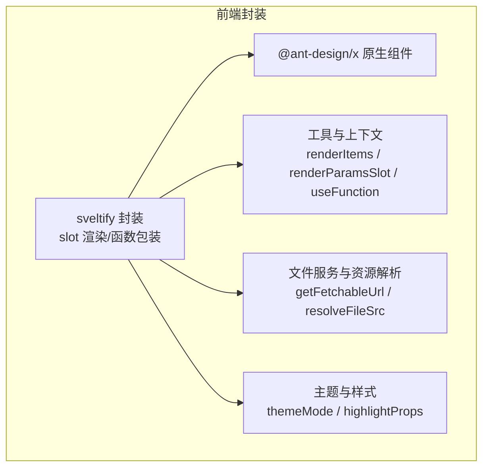
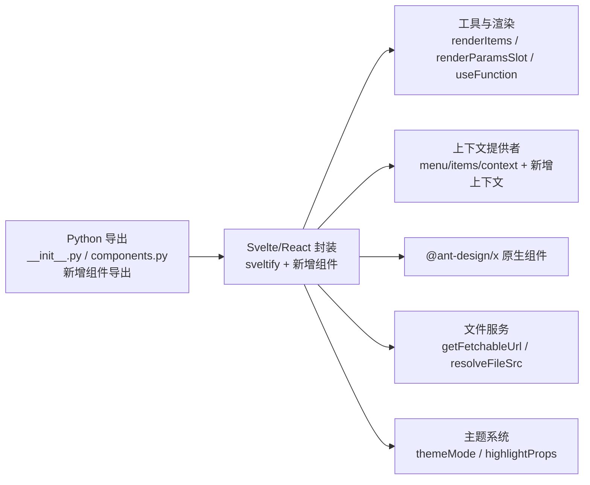
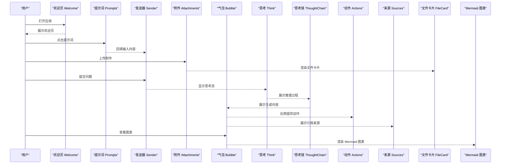

# Ant Design X 组件库

<cite>
**本文引用的文件**
- [backend/modelscope_studio/components/antdx/__init__.py](file://backend/modelscope_studio/components/antdx/__init__.py)
- [backend/modelscope_studio/components/antdx/components.py](file://backend/modelscope_studio/components/antdx/components.py)
- [backend/modelscope_studio/components/antdx/file_card/__init__.py](file://backend/modelscope_studio/components/antdx/file_card/__init__.py)
- [backend/modelscope_studio/components/antdx/file_card/list/__init__.py](file://backend/modelscope_studio/components/antdx/file_card/list/__init__.py)
- [backend/modelscope_studio/components/antdx/file_card/list/item/__init__.py](file://backend/modelscope_studio/components/antdx/file_card/list/item/__init__.py)
- [backend/modelscope_studio/components/antdx/mermaid/__init__.py](file://backend/modelscope_studio/components/antdx/mermaid/__init__.py)
- [backend/modelscope_studio/components/antdx/folder/directory_icon/__init__.py](file://backend/modelscope_studio/components/antdx/folder/directory_icon/__init__.py)
- [backend/modelscope_studio/components/antdx/folder/tree_node/__init__.py](file://backend/modelscope_studio/components/antdx/folder/tree_node/__init__.py)
- [frontend/antdx/file-card/file-card.tsx](file://frontend/antdx/file-card/file-card.tsx)
- [frontend/antdx/file-card/base.tsx](file://frontend/antdx/file-card/base.tsx)
- [frontend/antdx/mermaid/mermaid.tsx](file://frontend/antdx/mermaid/mermaid.tsx)
- [frontend/antdx/folder/folder.tsx](file://frontend/antdx/folder/folder.tsx)
- [frontend/antdx/thought-chain/thought-chain.tsx](file://frontend/antdx/thought-chain/thought-chain.tsx)
- [frontend/antdx/bubble/bubble.tsx](file://frontend/antdx/bubble/bubble.tsx)
- [frontend/antdx/conversations/conversations.tsx](file://frontend/antdx/conversations/conversations.tsx)
- [frontend/antdx/welcome/welcome.tsx](file://frontend/antdx/welcome/welcome.tsx)
- [frontend/antdx/prompts/prompts.tsx](file://frontend/antdx/prompts/prompts.tsx)
- [frontend/antdx/attachments/attachments.tsx](file://frontend/antdx/attachments/attachments.tsx)
- [frontend/antdx/sender/sender.tsx](file://frontend/antdx/sender/sender.tsx)
- [frontend/antdx/suggestion/suggestion.tsx](file://frontend/antdx/suggestion/suggestion.tsx)
- [frontend/antdx/actions/actions.tsx](file://frontend/antdx/actions/actions.tsx)
- [frontend/antdx/think/think.tsx](file://frontend/antdx/think/think.tsx)
- [frontend/antdx/notification/notification.tsx](file://frontend/antdx/notification/notification.tsx)
- [frontend/antdx/sources/sources.tsx](file://frontend/antdx/sources/sources.tsx)
</cite>

## 更新摘要

**所做更改**

- 新增文件卡片组件体系（FileCard、FileCardList、FileCardListItem）
- 新增 Mermaid 图表组件
- 新增文件夹组件（Folder）及其子组件（DirectoryIcon、TreeNode）
- 新增思考链组件（ThoughtChain）及其子组件
- 更新组件导出结构，与 Ant Design X 版本保持同步
- 增强组件间协作能力，支持更丰富的插槽化渲染

## 目录

1. [简介](#简介)
2. [项目结构](#项目结构)
3. [核心组件](#核心组件)
4. [架构总览](#架构总览)
5. [组件详解](#组件详解)
6. [依赖关系分析](#依赖关系分析)
7. [性能与可用性建议](#性能与可用性建议)
8. [故障排查指南](#故障排查指南)
9. [结论](#结论)
10. [附录](#附录)

## 简介

本文件面向 ModelScope Studio 的 Ant Design X 组件库，聚焦于机器学习与 AI 应用场景下的专用组件。文档系统性梳理通用组件（如气泡、会话列表）、唤醒组件（欢迎页、提示词）、表达组件（附件、发送器、建议）、确认组件（思考链）、反馈组件（动作）等，并新增文件卡片、Mermaid 图表、文件夹等高级组件。提供端到端示例思路与最佳实践，帮助开发者在对话式 AI、多模态输入、知识检索增强、图表可视化等场景下构建一致、可扩展且体验友好的界面。

## 项目结构

Ant Design X 组件库在后端通过 Python 包导出，在前端以 Svelte/React 双向桥接的方式封装 @ant-design/x 的能力，统一对外暴露为可组合的组件。整体结构如下：

```mermaid
graph TB
subgraph "后端导出层"
A["backend/modelscope_studio/components/antdx/__init__.py"]
B["backend/modelscope_studio/components/antdx/components.py"]
end
subgraph "前端封装层"
C["frontend/antdx/bubble/bubble.tsx"]
D["frontend/antdx/conversations/conversations.tsx"]
E["frontend/antdx/welcome/welcome.tsx"]
F["frontend/antdx/prompts/prompts.tsx"]
G["frontend/antdx/attachments/attachments.tsx"]
H["frontend/antdx/sender/sender.tsx"]
I["frontend/antdx/suggestion/suggestion.tsx"]
J["frontend/antdx/actions/actions.tsx"]
K["frontend/antdx/think/think.tsx"]
L["frontend/antdx/notification/notification.tsx"]
M["frontend/antdx/sources/sources.tsx"]
N["frontend/antdx/file-card/file-card.tsx"]
O["frontend/antdx/mermaid/mermaid.tsx"]
P["frontend/antdx/folder/folder.tsx"]
Q["frontend/antdx/thought-chain/thought-chain.tsx"]
end
A --> C
A --> D
A --> E
A --> F
A --> G
A --> H
A --> I
A --> J
A --> K
A --> L
A --> M
A --> N
A --> O
A --> P
A --> Q
B --> C
B --> D
B --> E
B --> F
B --> G
B --> H
B --> I
B --> J
B --> K
B --> L
B --> M
B --> N
B --> O
B --> P
B --> Q
```

**图示来源**

- [backend/modelscope_studio/components/antdx/**init**.py:1-42](file://backend/modelscope_studio/components/antdx/__init__.py#L1-L42)
- [backend/modelscope_studio/components/antdx/components.py:1-40](file://backend/modelscope_studio/components/antdx/components.py#L1-L40)
- [frontend/antdx/file-card/file-card.tsx:1-127](file://frontend/antdx/file-card/file-card.tsx#L1-L127)
- [frontend/antdx/mermaid/mermaid.tsx:1-87](file://frontend/antdx/mermaid/mermaid.tsx#L1-L87)
- [frontend/antdx/folder/folder.tsx:1-124](file://frontend/antdx/folder/folder.tsx#L1-L124)
- [frontend/antdx/thought-chain/thought-chain.tsx:1-43](file://frontend/antdx/thought-chain/thought-chain.tsx#L1-L43)

**章节来源**

- [backend/modelscope_studio/components/antdx/**init**.py:1-42](file://backend/modelscope_studio/components/antdx/__init__.py#L1-L42)
- [backend/modelscope_studio/components/antdx/components.py:1-40](file://backend/modelscope_studio/components/antdx/components.py#L1-L40)

## 核心组件

本节对 AI 场景关键组件进行分类与功能概览，包括新增的高级组件，便于快速定位与组合使用。

- 通用组件
  - 气泡 Bubble：用于展示消息内容、头像、额外信息与脚注，支持插槽化渲染与可编辑配置。
  - 会话列表 Conversations：用于展示与管理历史会话，支持菜单、分组与展开控制。
- 唤醒组件
  - 欢迎页 Welcome：用于应用启动或重置后的引导页面，支持标题、描述、图标与附加区域。
  - 提示词 Prompts：用于展示一组可点击的提示词模板，辅助用户快速开始对话。
- 表达组件
  - 附件 Attachments：用于上传与管理文件，支持占位、预览、图片属性与上传钩子。
  - 发送器 Sender：用于输入文本与粘贴文件上传，支持技能提示、前缀/后缀与提交拦截。
  - 建议 Suggestion：用于输入上下文中的自动补全/建议面板，支持触发策略与插槽化项渲染。
- 确认组件
  - 思考 Think：用于展示推理过程中的加载状态、图标与标题，提升可感知性。
  - 思考链 ThoughtChain：用于展示多步骤推理过程，支持子项组件与插槽化渲染。
- 反馈组件
  - 动作 Actions：用于在内容区右侧提供操作入口（如复制、下载、反馈），支持下拉菜单与弹出渲染。
- 高级组件
  - 文件卡片 FileCard：用于展示文件信息，支持多种类型、预览、遮罩与加载状态。
  - Mermaid 图表：用于渲染 Mermaid 流程图、序列图等，支持主题切换与自定义动作。
  - 文件夹 Folder：用于文件系统浏览，支持目录图标映射、文件内容服务与预览渲染。
- 工具组件
  - XProvider：全局配置与上下文提供器，扩展 antd 的 ConfigProvider，统一为 @ant-design/x 组件提供主题、语言、弹层容器等全局能力。
  - CodeHighlighter：代码高亮展示组件，支持主题定制、头部插槽、语法高亮样式覆盖。
  - Mermaid：流程图/思维导图组件，集成高亮与动作项渲染，支持深浅主题切换与自定义动作。
  - Notification：浏览器通知封装，提供权限请求、打开/关闭、可见性控制与回调。
- 数据组件
  - FileCard：用于展示单个文件卡片，支持图片占位、预览配置、遮罩与加载指示器的插槽化定制。
  - Folder：用于展示文件夹树形结构，支持 treeData、directoryIcons、空态渲染、目录标题、预览渲染等插槽。
  - Sources：用于展示数据源列表，支持 items 与 title 插槽。
  - Think：用于展示“思考”记录与状态，支持 loading、icon、title 插槽，便于在不同状态下显示不同的视觉反馈。

**章节来源**

- [frontend/antdx/bubble/bubble.tsx:1-119](file://frontend/antdx/bubble/bubble.tsx#L1-L119)
- [frontend/antdx/conversations/conversations.tsx:1-178](file://frontend/antdx/conversations/conversations.tsx#L1-L178)
- [frontend/antdx/welcome/welcome.tsx:1-44](file://frontend/antdx/welcome/welcome.tsx#L1-L44)
- [frontend/antdx/prompts/prompts.tsx:1-43](file://frontend/antdx/prompts/prompts.tsx#L1-L43)
- [frontend/antdx/attachments/attachments.tsx:1-413](file://frontend/antdx/attachments/attachments.tsx#L1-L413)
- [frontend/antdx/sender/sender.tsx:1-174](file://frontend/antdx/sender/sender.tsx#L1-L174)
- [frontend/antdx/suggestion/suggestion.tsx:1-165](file://frontend/antdx/suggestion/suggestion.tsx#L1-L165)
- [frontend/antdx/think/think.tsx:1-24](file://frontend/antdx/think/think.tsx#L1-L24)
- [frontend/antdx/thought-chain/thought-chain.tsx:1-43](file://frontend/antdx/thought-chain/thought-chain.tsx#L1-L43)
- [frontend/antdx/actions/actions.tsx:1-123](file://frontend/antdx/actions/actions.tsx#L1-L123)
- [frontend/antdx/file-card/file-card.tsx:1-127](file://frontend/antdx/file-card/file-card.tsx#L1-L127)
- [frontend/antdx/mermaid/mermaid.tsx:1-87](file://frontend/antdx/mermaid/mermaid.tsx#L1-L87)
- [frontend/antdx/folder/folder.tsx:1-124](file://frontend/antdx/folder/folder.tsx#L1-L124)

## 架构总览

下图展示了前端组件如何桥接到 @ant-design/x 并通过插槽与函数包装实现灵活渲染与事件处理，包括新增组件的架构。

**图示来源**

- [frontend/antdx/file-card/file-card.tsx:1-127](file://frontend/antdx/file-card/file-card.tsx#L1-L127)
- [frontend/antdx/mermaid/mermaid.tsx:1-87](file://frontend/antdx/mermaid/mermaid.tsx#L1-L87)
- [frontend/antdx/folder/folder.tsx:1-124](file://frontend/antdx/folder/folder.tsx#L1-L124)
- [frontend/antdx/thought-chain/thought-chain.tsx:1-43](file://frontend/antdx/thought-chain/thought-chain.tsx#L1-L43)

## 组件详解

### 通用组件

#### 气泡 Bubble

- 能力要点
  - 支持头像、标题、内容、底部、额外区域等插槽化渲染。
  - 支持可编辑配置（含"确定/取消"文案插槽）。
  - 支持加载态与内容渲染函数包装。
- 使用建议
  - 在对话流中作为消息载体，结合 Sender 输入与 Attachments 附件使用。
  - 对长内容建议开启可编辑与内容渲染函数，提升交互效率。
- 关键路径
  - [frontend/antdx/bubble/bubble.tsx:14-116](file://frontend/antdx/bubble/bubble.tsx#L14-L116)

**章节来源**

- [frontend/antdx/bubble/bubble.tsx:1-119](file://frontend/antdx/bubble/bubble.tsx#L1-L119)

#### 会话列表 Conversations

- 能力要点
  - 支持菜单项、溢出指示器、展开图标等插槽化配置。
  - 支持分组与折叠行为的函数化配置。
  - 内部复用菜单上下文，统一事件传播与 DOM 阻断。
- 使用建议
  - 与 Sender/Attachments 配合，形成"输入-生成-回看"的闭环。
  - 通过菜单项实现"删除、重命名、导出"等操作。
- 关键路径
  - [frontend/antdx/conversations/conversations.tsx:59-175](file://frontend/antdx/conversations/conversations.tsx#L59-L175)

**章节来源**

- [frontend/antdx/conversations/conversations.tsx:1-178](file://frontend/antdx/conversations/conversations.tsx#L1-L178)

### 唤醒组件

#### 欢迎页 Welcome

- 能力要点
  - 支持标题、描述、图标与附加区域的插槽化。
  - 图标支持传入文件数据并自动解析为可访问 URL。
- 使用建议
  - 作为应用初始化或会话重置后的首屏引导。
- 关键路径
  - [frontend/antdx/welcome/welcome.tsx:8-41](file://frontend/antdx/welcome/welcome.tsx#L8-L41)

**章节来源**

- [frontend/antdx/welcome/welcome.tsx:1-44](file://frontend/antdx/welcome/welcome.tsx#L1-L44)

#### 提示词 Prompts

- 能力要点
  - 支持标题插槽与项集合的插槽化渲染。
  - 通过上下文提供项集合，简化外部传参。
- 使用建议
  - 在欢迎页或输入框上方放置，帮助用户快速选择意图模板。
- 关键路径
  - [frontend/antdx/prompts/prompts.tsx:13-40](file://frontend/antdx/prompts/prompts.tsx#L13-L40)

**章节来源**

- [frontend/antdx/prompts/prompts.tsx:1-43](file://frontend/antdx/prompts/prompts.tsx#L1-L43)

### 表达组件

#### 附件 Attachments

- 能力要点
  - 支持占位、预览、图片属性、上传钩子与最大数量限制。
  - 支持自定义 beforeUpload、customRequest、isImageUrl、previewFile 等函数。
  - 通过插槽化扩展"额外图标、下载/移除/预览图标、占位内容"等。
- 使用建议
  - 与 Sender 的粘贴上传配合，实现拖拽/粘贴即传。
  - 注意 maxCount 与上传状态的联动，避免并发冲突。
- 关键路径
  - [frontend/antdx/attachments/attachments.tsx:36-410](file://frontend/antdx/attachments/attachments.tsx#L36-L410)

**章节来源**

- [frontend/antdx/attachments/attachments.tsx:1-413](file://frontend/antdx/attachments/attachments.tsx#L1-L413)

#### 发送器 Sender

- 能力要点
  - 支持前缀/后缀/头部/底部插槽；支持"技能提示"配置。
  - 支持粘贴文件上传回调，统一输出文件路径数组。
  - 通过值变化钩子与提交拦截，避免在建议面板打开时误提交。
- 使用建议
  - 与 Suggestion 协作，确保建议面板关闭后再提交。
  - 通过 onValueChange 与后端流式输出对接。
- 关键路径
  - [frontend/antdx/sender/sender.tsx:18-171](file://frontend/antdx/sender/sender.tsx#L18-L171)

**章节来源**

- [frontend/antdx/sender/sender.tsx:1-174](file://frontend/antdx/sender/sender.tsx#L1-L174)

#### 建议 Suggestion

- 能力要点
  - 支持 items 插槽化与 children 插槽化渲染。
  - 通过上下文传递键盘事件与触发逻辑，支持自定义 shouldTrigger。
  - 支持 getPopupContainer 函数化配置。
- 使用建议
  - 与 Sender/Textarea 结合，实现@提及、/命令、关键词补全。
  - 控制 open 状态与 shouldTrigger，避免在输入法组合字阶段触发。
- 关键路径
  - [frontend/antdx/suggestion/suggestion.tsx:64-162](file://frontend/antdx/suggestion/suggestion.tsx#L64-L162)

**章节来源**

- [frontend/antdx/suggestion/suggestion.tsx:1-165](file://frontend/antdx/suggestion/suggestion.tsx#L1-L165)

### 确认组件

#### 思考 Think

- 能力要点
  - 展示推理过程中的加载态、图标与标题，提升可感知性。
  - 支持插槽化覆盖默认渲染。
- 使用建议
  - 在流式输出前插入，明确告知用户模型正在思考。
- 关键路径
  - [frontend/antdx/think/think.tsx:6-21](file://frontend/antdx/think/think.tsx#L6-L21)

**章节来源**

- [frontend/antdx/think/think.tsx:1-24](file://frontend/antdx/think/think.tsx#L1-L24)

#### 思考链 ThoughtChain

- 能力要点
  - 支持多步骤推理过程展示，内置默认与子项渲染逻辑。
  - 通过上下文提供项集合，支持插槽化与默认项回退。
  - 复用通用渲染工具，保持与其它组件的一致性。
- 使用建议
  - 在复杂推理场景中展示逐步思考过程。
  - 与 Bubble 组件配合，形成完整的推理展示链路。
- 关键路径
  - [frontend/antdx/thought-chain/thought-chain.tsx:11-40](file://frontend/antdx/thought-chain/thought-chain.tsx#L11-L40)

**章节来源**

- [frontend/antdx/thought-chain/thought-chain.tsx:1-43](file://frontend/antdx/thought-chain/thought-chain.tsx#L1-L43)

### 反馈组件

#### 动作 Actions

- 能力要点
  - 支持下拉菜单、弹出渲染与菜单项插槽化。
  - 复用菜单上下文，统一事件传播。
- 使用建议
  - 在 Bubble 或内容卡片右侧提供"复制、下载、反馈"等操作。
- 关键路径
  - [frontend/antdx/actions/actions.tsx:17-120](file://frontend/antdx/actions/actions.tsx#L17-L120)

**章节来源**

- [frontend/antdx/actions/actions.tsx:1-123](file://frontend/antdx/actions/actions.tsx#L1-L123)

### 高级组件

#### 文件卡片 FileCard

- 能力要点
  - 支持多种文件类型（image、file、audio、video）展示。
  - 支持图标、描述、遮罩、加载状态等插槽化配置。
  - 内置图片预览功能，支持自定义预览容器与工具栏。
  - 自动解析文件源，支持本地文件与远程 URL。
- 使用建议
  - 在文件上传完成后展示文件信息。
  - 与文件列表组件配合，形成完整的文件管理界面。
- 关键路径
  - [frontend/antdx/file-card/file-card.tsx:17-124](file://frontend/antdx/file-card/file-card.tsx#L17-L124)
  - [frontend/antdx/file-card/base.tsx:15-41](file://frontend/antdx/file-card/base.tsx#L15-L41)

**章节来源**

- [frontend/antdx/file-card/file-card.tsx:1-127](file://frontend/antdx/file-card/file-card.tsx#L1-L127)
- [frontend/antdx/file-card/base.tsx:1-44](file://frontend/antdx/file-card/base.tsx#L1-L44)

#### Mermaid 图表

- 能力要点
  - 支持 Mermaid 语法图表渲染，包括流程图、序列图等。
  - 内置语法高亮，支持明暗主题切换。
  - 支持自定义动作按钮与头部插槽。
  - 复用动作组件上下文，保持一致的交互体验。
- 使用建议
  - 在文档生成或流程展示场景中使用。
  - 结合思考链组件，展示复杂的算法流程。
- 关键路径
  - [frontend/antdx/mermaid/mermaid.tsx:33-82](file://frontend/antdx/mermaid/mermaid.tsx#L33-L82)

**章节来源**

- [frontend/antdx/mermaid/mermaid.tsx:1-87](file://frontend/antdx/mermaid/mermaid.tsx#L1-L87)

#### 文件夹 Folder

- 能力要点
  - 支持文件系统浏览与目录结构展示。
  - 支持自定义目录图标映射与节点渲染。
  - 内置文件内容服务，支持动态加载文件内容。
  - 支持空态渲染、预览渲染与标题插槽化。
- 使用建议
  - 在知识库或工程文件管理场景中使用。
  - 与文件卡片组件配合，提供完整的文件浏览体验。
- 关键路径
  - [frontend/antdx/folder/folder.tsx:16-121](file://frontend/antdx/folder/folder.tsx#L16-L121)

**章节来源**

- [frontend/antdx/folder/folder.tsx:1-124](file://frontend/antdx/folder/folder.tsx#L1-L124)

### 其他实用组件

#### 通知 Notification

- 能力要点
  - 基于浏览器通知权限的轻量提示，支持可见性控制与权限回调。
- 使用建议
  - 在后台任务完成或重要事件发生时推送桌面通知。
- 关键路径
  - [frontend/antdx/notification/notification.tsx:6-50](file://frontend/antdx/notification/notification.tsx#L6-L50)

**章节来源**

- [frontend/antdx/notification/notification.tsx:1-51](file://frontend/antdx/notification/notification.tsx#L1-L51)

#### 来源 Sources

- 能力要点
  - 支持标题插槽与项集合的插槽化渲染。
- 使用建议
  - 在回答末尾展示引用来源，增强可信度。
- 关键路径
  - [frontend/antdx/sources/sources.tsx:9-41](file://frontend/antdx/sources/sources.tsx#L9-L41)

**章节来源**

- [frontend/antdx/sources/sources.tsx:1-42](file://frontend/antdx/sources/sources.tsx#L1-L42)

## 依赖关系分析

- 后端导出层
  - 通过 **init**.py 与 components.py 将 Ant Design X 组件统一导出，包括新增的文件卡片、Mermaid、文件夹等组件。
- 前端封装层
  - 所有组件均采用 sveltify 包裹，统一处理插槽、函数包装与事件透传。
  - 大量使用 renderItems、renderParamsSlot、useFunction 等工具，保证渲染一致性与灵活性。
  - 多数组件复用菜单与项集合上下文，降低重复配置成本。
  - 新增组件引入文件服务解析与主题切换机制。

**图示来源**

- [backend/modelscope_studio/components/antdx/**init**.py:1-42](file://backend/modelscope_studio/components/antdx/__init__.py#L1-L42)
- [backend/modelscope_studio/components/antdx/components.py:1-40](file://backend/modelscope_studio/components/antdx/components.py#L1-L40)
- [frontend/antdx/file-card/file-card.tsx:1-127](file://frontend/antdx/file-card/file-card.tsx#L1-L127)
- [frontend/antdx/mermaid/mermaid.tsx:1-87](file://frontend/antdx/mermaid/mermaid.tsx#L1-L87)
- [frontend/antdx/folder/folder.tsx:1-124](file://frontend/antdx/folder/folder.tsx#L1-L124)

**章节来源**

- [backend/modelscope_studio/components/antdx/**init**.py:1-42](file://backend/modelscope_studio/components/antdx/__init__.py#L1-L42)
- [backend/modelscope_studio/components/antdx/components.py:1-40](file://backend/modelscope_studio/components/antdx/components.py#L1-L40)

## 性能与可用性建议

- 渲染优化
  - 使用 useMemo 包裹复杂计算结果（如菜单项、建议项、树数据、文件列表），减少不必要的重渲染。
  - 合理拆分插槽渲染，避免在父级频繁变更导致子级插槽重复挂载。
  - 对大型文件列表使用虚拟滚动，提升渲染性能。
- 事件与状态
  - 在建议面板打开期间拦截提交，避免误触发。
  - 上传过程中禁用交互或显示进度，防止重复上传。
  - 文件卡片组件支持懒加载，避免一次性渲染过多图片。
- 可访问性
  - 为图标与按钮提供替代文本，确保屏幕阅读器友好。
  - 为通知与提示提供键盘可达性与焦点管理。
  - Mermaid 图表提供无障碍标签，支持屏幕阅读器朗读。
- 数据一致性
  - 上传成功后统一更新文件列表，避免状态漂移。
  - 在流式输出场景中，保持"思考态-内容态-动作态"的清晰过渡。
  - 文件服务采用缓存机制，避免重复加载相同文件。
- 主题适配
  - Mermaid 组件自动适配主题模式，确保图表可读性。
  - 文件卡片支持暗色模式，提升视觉体验。

## 故障排查指南

- 插槽未生效
  - 检查是否正确传入 slots 对象与对应 key 名称。
  - 确认插槽渲染函数是否被正确包裹为可执行函数。
- 上传失败或卡住
  - 核查 beforeUpload/customRequest/isImageUrl 等函数返回值与异常处理。
  - 检查 maxCount 与当前文件列表长度，避免超出限制。
- 建议面板不出现
  - 确认 shouldTrigger 触发条件与输入焦点状态。
  - 检查 open 状态与 getPopupContainer 容器是否存在。
- 通知未显示
  - 确认浏览器通知权限已授予，必要时调用请求权限流程。
- 菜单事件异常
  - 检查 onClick 是否被正确阻止冒泡，避免影响外层交互。
- 文件卡片显示异常
  - 检查文件源解析是否正确，确认 getFetchableUrl 函数正常工作。
  - 确认文件类型与图标映射是否匹配。
- Mermaid 图表渲染失败
  - 检查 Mermaid 语法是否正确，确认图表类型支持。
  - 确认主题模式配置是否正确。
- 文件夹组件无响应
  - 检查文件内容服务是否正确实现，确认异步加载函数正常工作。
  - 确认目录图标映射与节点数据格式是否正确。

**章节来源**

- [frontend/antdx/attachments/attachments.tsx:275-354](file://frontend/antdx/attachments/attachments.tsx#L275-L354)
- [frontend/antdx/sender/sender.tsx:126-130](file://frontend/antdx/sender/sender.tsx#L126-L130)
- [frontend/antdx/suggestion/suggestion.tsx:135-140](file://frontend/antdx/suggestion/suggestion.tsx#L135-L140)
- [frontend/antdx/notification/notification.tsx:20-46](file://frontend/antdx/notification/notification.tsx#L20-L46)
- [frontend/antdx/file-card/file-card.tsx:17-124](file://frontend/antdx/file-card/file-card.tsx#L17-L124)
- [frontend/antdx/mermaid/mermaid.tsx:33-82](file://frontend/antdx/mermaid/mermaid.tsx#L33-L82)
- [frontend/antdx/folder/folder.tsx:16-121](file://frontend/antdx/folder/folder.tsx#L16-L121)

## 结论

Ant Design X 组件库在 ModelScope Studio 中为 AI 应用提供了从"输入-生成-反馈-确认-展示"的完整闭环。通过统一的插槽化与函数包装机制，组件既保持了与 @ant-design/x 的强一致性，又增强了在多模态、对话式、图表可视化场景下的可定制性与可维护性。新增的文件卡片、Mermaid 图表、文件夹等组件进一步丰富了 AI 应用的展示能力。建议在实际项目中遵循"先模板后生成、先思考后展示、先确认再提交"的交互节奏，结合最佳实践持续优化性能与可访问性。

## 附录

### 组件协作与集成示例（概念流程）

以下为典型"问答+附件+图表+文件管理"的端到端流程示意，帮助理解新增组件间的协作方式。

**图示来源**

- [frontend/antdx/welcome/welcome.tsx:8-41](file://frontend/antdx/welcome/welcome.tsx#L8-L41)
- [frontend/antdx/prompts/prompts.tsx:13-40](file://frontend/antdx/prompts/prompts.tsx#L13-L40)
- [frontend/antdx/sender/sender.tsx:18-171](file://frontend/antdx/sender/sender.tsx#L18-L171)
- [frontend/antdx/attachments/attachments.tsx:36-410](file://frontend/antdx/attachments/attachments.tsx#L36-L410)
- [frontend/antdx/bubble/bubble.tsx:14-116](file://frontend/antdx/bubble/bubble.tsx#L14-L116)
- [frontend/antdx/think/think.tsx:6-21](file://frontend/antdx/think/think.tsx#L6-L21)
- [frontend/antdx/thought-chain/thought-chain.tsx:11-40](file://frontend/antdx/thought-chain/thought-chain.tsx#L11-L40)
- [frontend/antdx/actions/actions.tsx:17-120](file://frontend/antdx/actions/actions.tsx#L17-L120)
- [frontend/antdx/sources/sources.tsx:9-41](file://frontend/antdx/sources/sources.tsx#L9-L41)
- [frontend/antdx/file-card/file-card.tsx:17-124](file://frontend/antdx/file-card/file-card.tsx#L17-L124)
- [frontend/antdx/mermaid/mermaid.tsx:33-82](file://frontend/antdx/mermaid/mermaid.tsx#L33-L82)

### 新增组件功能对比表

| 组件类别 | 组件名称               | 主要功能                     | 适用场景                   |
| -------- | ---------------------- | ---------------------------- | -------------------------- |
| 通用组件 | 气泡 Bubble            | 消息内容展示、头像、额外信息 | 对话界面、消息展示         |
| 通用组件 | 会话列表 Conversations | 历史会话管理、菜单操作       | 会话管理、历史记录         |
| 唤醒组件 | 欢迎页 Welcome         | 应用引导、初始化界面         | 首次访问、重置界面         |
| 唤醒组件 | 提示词 Prompts         | 模板化提示词、快速开始       | 引导用户、提高效率         |
| 表达组件 | 附件 Attachments       | 文件上传管理、预览           | 多模态输入、文件处理       |
| 表达组件 | 发送器 Sender          | 文本输入、粘贴上传           | 用户输入、实时交互         |
| 表达组件 | 建议 Suggestion        | 自动补全、建议面板           | 提升输入效率、智能提示     |
| 确认组件 | 思考 Think             | 推理过程指示、加载状态       | 流式输出、状态反馈         |
| 确认组件 | 思考链 ThoughtChain    | 多步骤推理展示               | 复杂算法、流程展示         |
| 反馈组件 | 动作 Actions           | 操作入口、菜单渲染           | 内容操作、快捷功能         |
| 高级组件 | 文件卡片 FileCard      | 文件信息展示、预览           | 文件管理、内容展示         |
| 高级组件 | Mermaid 图表           | 流程图、序列图渲染           | 文档生成、算法展示         |
| 高级组件 | 文件夹 Folder          | 文件系统浏览、内容服务       | 知识库、工程管理           |
| 工具组件 | XProvider              | 全局配置、主题/语言提供器    | 应用根节点、全局配置       |
| 工具组件 | CodeHighlighter        | 代码高亮、主题定制           | 代码展示、文档生成         |
| 数据组件 | Sources                | 数据源列表展示、标题插槽     | 引用来源展示、知识检索增强 |
| 数据组件 | Think                  | 思考状态展示、插槽化         | AI 思考过程可视化          |

**章节来源**

- [frontend/antdx/file-card/file-card.tsx:1-127](file://frontend/antdx/file-card/file-card.tsx#L1-L127)
- [frontend/antdx/mermaid/mermaid.tsx:1-87](file://frontend/antdx/mermaid/mermaid.tsx#L1-L87)
- [frontend/antdx/folder/folder.tsx:1-124](file://frontend/antdx/folder/folder.tsx#L1-L124)
- [frontend/antdx/thought-chain/thought-chain.tsx:1-43](file://frontend/antdx/thought-chain/thought-chain.tsx#L1-L43)
