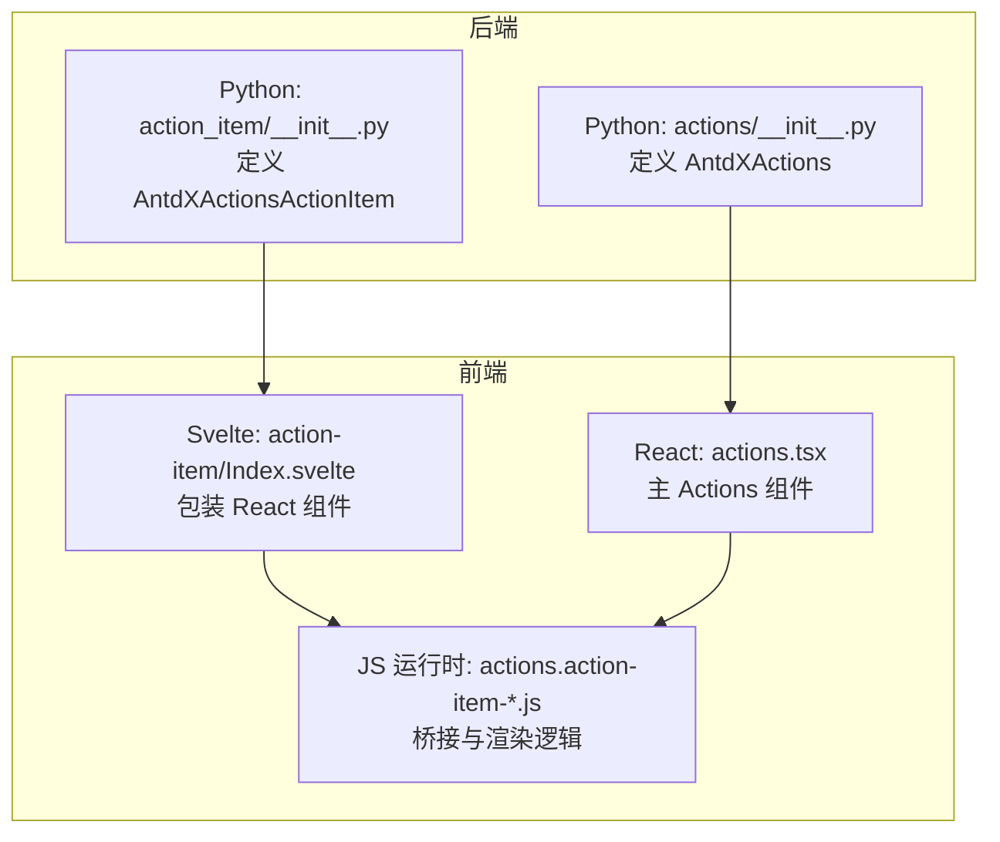
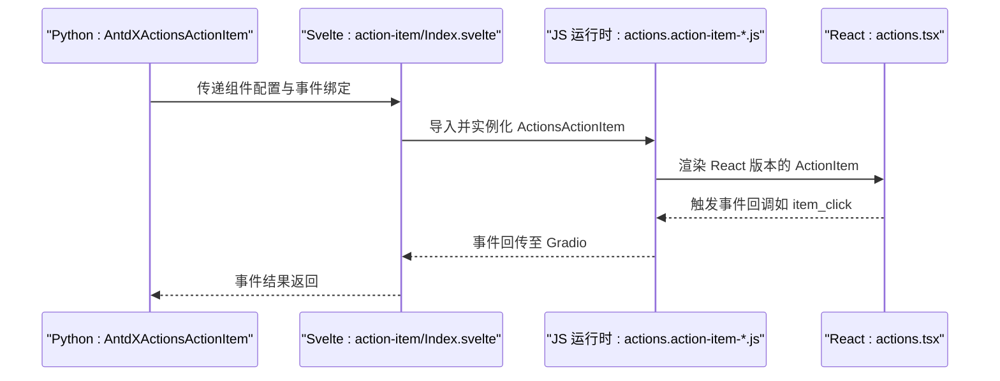
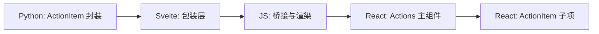

# ActionItem 操作项

<cite>
**本文引用的文件**
- [frontend/antdx/actions/action-item/Index.svelte](file://frontend/antdx/actions/action-item/Index.svelte)
- [frontend/antdx/actions/actions.tsx](file://frontend/antdx/actions/actions.tsx)
- [backend/modelscope_studio/components/antdx/actions/__init__.py](file://backend/modelscope_studio/components/antdx/actions/__init__.py)
- [backend/modelscope_studio/components/antdx/actions/action_item/__init__.py](file://backend/modelscope_studio/components/antdx/actions/action_item/__init__.py)
- [backend/modelscope_studio/components/antdx/actions/action_item/templates/component/actions.action-item-76joNQSL.js](file://backend/modelscope_studio/components/antdx/actions/action_item/templates/component/actions.action-item-76joNQSL.js)
</cite>

## 目录

1. [简介](#简介)
2. [项目结构](#项目结构)
3. [核心组件](#核心组件)
4. [架构总览](#架构总览)
5. [详细组件分析](#详细组件分析)
6. [依赖关系分析](#依赖关系分析)
7. [性能考量](#性能考量)
8. [故障排查指南](#故障排查指南)
9. [结论](#结论)
10. [附录：使用示例与参数参考](#附录使用示例与参数参考)

## 简介

ActionItem 是 Ant Design X Actions 组件体系中的核心子组件，用于在 Actions 容器中呈现单个可点击或可交互的操作项。它支持多种形态（文本、图标、自定义渲染）、嵌套子菜单、危险态、触发策略（悬停/点击）以及通过插槽扩展内容的能力。该组件同时提供前端 Svelte 包装层与后端 Gradio Python 封装层，形成“Python 配置 + 前端渲染”的完整链路。

## 项目结构

ActionItem 所在的目录与相关文件组织如下：

- 前端包装层（Svelte）：frontend/antdx/actions/action-item/Index.svelte
- 前端主组件（React）：frontend/antdx/actions/actions.tsx（包含主 Actions 组件）
- 后端封装层（Gradio Python）：backend/modelscope_studio/components/antdx/actions/action_item/**init**.py
- 前端桥接与运行时（打包产物）：backend/modelscope_studio/components/antdx/actions/action_item/templates/component/actions.action-item-76joNQSL.js
- 后端 Actions 主组件：backend/modelscope_studio/components/antdx/actions/**init**.py

图表来源

- [backend/modelscope_studio/components/antdx/actions/**init**.py:15-94](file://backend/modelscope_studio/components/antdx/actions/__init__.py#L15-L94)
- [backend/modelscope_studio/components/antdx/actions/action_item/**init**.py:10-62](file://backend/modelscope_studio/components/antdx/actions/action_item/__init__.py#L10-L62)
- [frontend/antdx/actions/action-item/Index.svelte:14-98](file://frontend/antdx/actions/action-item/Index.svelte#L14-L98)
- [frontend/antdx/actions/actions.tsx:1-200](file://frontend/antdx/actions/actions.tsx#L1-L200)
- [backend/modelscope_studio/components/antdx/actions/action_item/templates/component/actions.action-item-76joNQSL.js:419-431](file://backend/modelscope_studio/components/antdx/actions/action_item/templates/component/actions.action-item-76joNQSL.js#L419-L431)

章节来源

- [backend/modelscope_studio/components/antdx/actions/**init**.py:15-94](file://backend/modelscope_studio/components/antdx/actions/__init__.py#L15-L94)
- [backend/modelscope_studio/components/antdx/actions/action_item/**init**.py:10-62](file://backend/modelscope_studio/components/antdx/actions/action_item/__init__.py#L10-L62)
- [frontend/antdx/actions/action-item/Index.svelte:14-98](file://frontend/antdx/actions/action-item/Index.svelte#L14-L98)
- [frontend/antdx/actions/actions.tsx:1-200](file://frontend/antdx/actions/actions.tsx#L1-L200)
- [backend/modelscope_studio/components/antdx/actions/action_item/templates/component/actions.action-item-76joNQSL.js:419-431](file://backend/modelscope_studio/components/antdx/actions/action_item/templates/component/actions.action-item-76joNQSL.js#L419-L431)

## 核心组件

- AntdXActionsActionItem（后端封装）：负责将 Python 层的配置映射到前端组件，并声明事件与插槽能力。
- ActionsActionItem（前端桥接）：由 Svelte 包装层动态导入并渲染，负责处理插槽、附加属性、事件映射与可见性控制。
- Actions（主组件）：AntdXActions 的前端实现，承载多个 ActionItem 并提供下拉、动画等高级特性。

关键职责与关系

- 后端封装：定义 ActionItem 的参数、事件、插槽；决定前端资源路径。
- 前端包装：解析 props、处理插槽、生成最终渲染所需的 props 与 slots。
- 运行时桥接：将 Svelte/React 渲染树与 Gradio 上下文打通，支持事件透传与上下文合并。

章节来源

- [backend/modelscope_studio/components/antdx/actions/action_item/**init**.py:10-62](file://backend/modelscope_studio/components/antdx/actions/action_item/__init__.py#L10-L62)
- [frontend/antdx/actions/action-item/Index.svelte:19-84](file://frontend/antdx/actions/action-item/Index.svelte#L19-L84)
- [backend/modelscope_studio/components/antdx/actions/**init**.py:15-94](file://backend/modelscope_studio/components/antdx/actions/__init__.py#L15-L94)

## 架构总览

ActionItem 的调用链从 Python 到前端的完整流程如下：

图表来源

- [backend/modelscope_studio/components/antdx/actions/action_item/**init**.py:15-21](file://backend/modelscope_studio/components/antdx/actions/action_item/__init__.py#L15-L21)
- [frontend/antdx/actions/action-item/Index.svelte:14-98](file://frontend/antdx/actions/action-item/Index.svelte#L14-L98)
- [backend/modelscope_studio/components/antdx/actions/action_item/templates/component/actions.action-item-76joNQSL.js:419-431](file://backend/modelscope_studio/components/antdx/actions/action_item/templates/component/actions.action-item-76joNQSL.js#L419-L431)
- [frontend/antdx/actions/actions.tsx:1-200](file://frontend/antdx/actions/actions.tsx#L1-L200)

## 详细组件分析

### 后端封装：AntdXActionsActionItem

- 事件绑定
  - item_click：当操作项被点击时触发，后端通过内部标志位启用事件绑定。
- 插槽支持
  - 支持 label、icon、actionRender、subItems 等插槽，便于灵活扩展。
- 关键属性
  - label、icon、danger、trigger_sub_menu_action、sub_items、action_render、as_item、key 等。
- 资源定位
  - 使用 resolve_frontend_dir("actions", "action-item", type="antdx") 指定前端资源目录。

章节来源

- [backend/modelscope_studio/components/antdx/actions/action_item/**init**.py:10-62](file://backend/modelscope_studio/components/antdx/actions/action_item/__init__.py#L10-L62)
- [backend/modelscope_studio/components/antdx/actions/action_item/**init**.py:15-21](file://backend/modelscope_studio/components/antdx/actions/action_item/__init__.py#L15-L21)
- [backend/modelscope_studio/components/antdx/actions/action_item/**init**.py:24](file://backend/modelscope_studio/components/antdx/actions/action_item/__init__.py#L24)

### 前端包装：Svelte 包装层

- 动态导入
  - 通过 importComponent 动态加载 React 版本的 ActionItem。
- Props 处理
  - 使用 getProps/processProps 提取并转换 props，将 item_click 映射为前端事件名。
  - 合并 elem_id、elem_classes、elem_style、additionalProps 等。
- 插槽处理
  - 通过 getSlots 获取插槽内容，并对 actionRender 设置 withParams 与 clone。
- 可见性与索引
  - 根据 visible 控制渲染；传入 itemIndex 与 itemSlotKey 以配合上下文。

章节来源

- [frontend/antdx/actions/action-item/Index.svelte:14-98](file://frontend/antdx/actions/action-item/Index.svelte#L14-L98)

### 运行时桥接：JS 运行时

- 组件桥接
  - 通过 Ge(...) 创建 Svelte-React 桥接实例，将 React 组件挂载到共享根节点。
- 上下文与插槽
  - 使用 createItemsContext 提供 items 上下文，支持默认插槽与子项渲染。
- 事件与属性透传
  - 将 Gradio 上下文与 props 合并，确保事件与样式正确传递。

章节来源

- [backend/modelscope_studio/components/antdx/actions/action_item/templates/component/actions.action-item-76joNQSL.js:419-431](file://backend/modelscope_studio/components/antdx/actions/action_item/templates/component/actions.action-item-76joNQSL.js#L419-L431)

### 主组件：AntdXActions（关联）

- 作用
  - 作为 ActionItem 的容器，提供 items 列表、变体、下拉配置、动画等能力。
- 事件与插槽
  - 支持 click、dropdown*open_change、dropdown_menu*\* 系列事件与多处插槽。

章节来源

- [backend/modelscope_studio/components/antdx/actions/**init**.py:15-94](file://backend/modelscope_studio/components/antdx/actions/__init__.py#L15-L94)

## 依赖关系分析

- 后端到前端
  - AntdXActionsActionItem 通过 FRONTEND_DIR 指向前端资源，Svelte 包装层动态导入对应 JS 模块。
- 前端到运行时
  - Svelte 包装层将 props 与 slots 传给运行时桥接模块，后者负责渲染 React 组件并与 Gradio 上下文集成。
- 组件间协作
  - ActionItem 通常作为 Actions 的子项存在，二者共同构成操作面板。

图表来源

- [backend/modelscope_studio/components/antdx/actions/action_item/**init**.py:62](file://backend/modelscope_studio/components/antdx/actions/action_item/__init__.py#L62)
- [frontend/antdx/actions/action-item/Index.svelte:14-98](file://frontend/antdx/actions/action-item/Index.svelte#L14-L98)
- [backend/modelscope_studio/components/antdx/actions/action_item/templates/component/actions.action-item-76joNQSL.js:419-431](file://backend/modelscope_studio/components/antdx/actions/action_item/templates/component/actions.action-item-76joNQSL.js#L419-L431)
- [frontend/antdx/actions/actions.tsx:1-200](file://frontend/antdx/actions/actions.tsx#L1-L200)

## 性能考量

- 动态导入与懒加载
  - Svelte 侧通过 importComponent 实现按需加载，降低初始包体与首屏压力。
- 渲染优化
  - 使用 $derived 与 useMemo 化策略，避免不必要的重渲染。
- 事件透传
  - 事件在运行时桥接层进行统一处理，减少重复绑定与内存占用。
- 插槽克隆
  - 对 actionRender 设置 clone 与 withParams，确保插槽内容稳定复用与参数传递。

章节来源

- [frontend/antdx/actions/action-item/Index.svelte:14-98](file://frontend/antdx/actions/action-item/Index.svelte#L14-L98)
- [backend/modelscope_studio/components/antdx/actions/action_item/templates/component/actions.action-item-76joNQSL.js:163-209](file://backend/modelscope_studio/components/antdx/actions/action_item/templates/component/actions.action-item-76joNQSL.js#L163-L209)

## 故障排查指南

- 事件未触发
  - 检查后端是否启用 item_click 事件绑定；确认前端 props 中 item_click 是否正确映射。
- 插槽不生效
  - 确认插槽名称与支持列表一致（label、icon、actionRender、subItems）；检查 actionRender 的 withParams 与 clone 设置。
- 样式或类名异常
  - 检查 elem_id、elem_classes、elem_style 是否正确传入；确认运行时桥接层对样式与类名的合并逻辑。
- 子菜单不显示
  - 检查 trigger_sub_menu_action（hover/click）与 sub_items 结构是否正确；确认主 Actions 的 dropdown 配置。

章节来源

- [backend/modelscope_studio/components/antdx/actions/action_item/**init**.py:15-21](file://backend/modelscope_studio/components/antdx/actions/action_item/__init__.py#L15-L21)
- [backend/modelscope_studio/components/antdx/actions/action_item/**init**.py:24](file://backend/modelscope_studio/components/antdx/actions/action_item/__init__.py#L24)
- [frontend/antdx/actions/action-item/Index.svelte:61-84](file://frontend/antdx/actions/action-item/Index.svelte#L61-L84)

## 结论

ActionItem 通过后端 Python 封装与前端 Svelte/React 桥接，实现了高可配置、可扩展、可维护的操作项组件。其事件、插槽、样式与上下文整合能力，使其能够适配复杂场景下的操作面板需求。结合 AntdXActions 主组件，可快速构建美观且功能完备的操作区。

## 附录：使用示例与参数参考

以下为常见使用场景与参数说明（以路径代替具体代码）：

- 文本操作项
  - 参数：label、danger、as_item
  - 示例路径：[frontend/antdx/actions/action-item/Index.svelte:61-84](file://frontend/antdx/actions/action-item/Index.svelte#L61-L84)
- 图标操作项
  - 参数：icon、label、elem_classes
  - 示例路径：[frontend/antdx/actions/action-item/Index.svelte:61-84](file://frontend/antdx/actions/action-item/Index.svelte#L61-L84)
- 自定义渲染（actionRender）
  - 参数：actionRender（函数字符串）、插槽 withParams/clone
  - 示例路径：[frontend/antdx/actions/action-item/Index.svelte:71-83](file://frontend/antdx/actions/action-item/Index.svelte#L71-L83)
- 危险态与触发策略
  - 参数：danger、trigger_sub_menu_action（hover/click）
  - 示例路径：[backend/modelscope_studio/components/antdx/actions/action_item/**init**.py:26-61](file://backend/modelscope_studio/components/antdx/actions/action_item/__init__.py#L26-L61)
- 子菜单
  - 参数：sub_items、插槽 subItems
  - 示例路径：[backend/modelscope_studio/components/antdx/actions/action_item/**init**.py:24](file://backend/modelscope_studio/components/antdx/actions/action_item/__init__.py#L24)

章节来源

- [frontend/antdx/actions/action-item/Index.svelte:61-84](file://frontend/antdx/actions/action-item/Index.svelte#L61-L84)
- [backend/modelscope_studio/components/antdx/actions/action_item/**init**.py:24-61](file://backend/modelscope_studio/components/antdx/actions/action_item/__init__.py#L24-L61)
