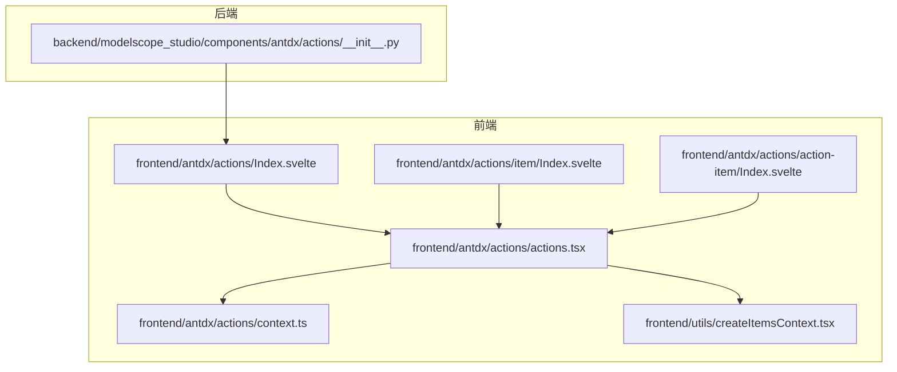
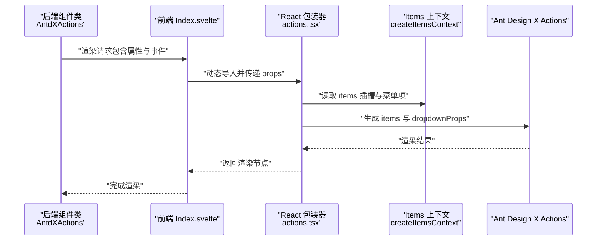
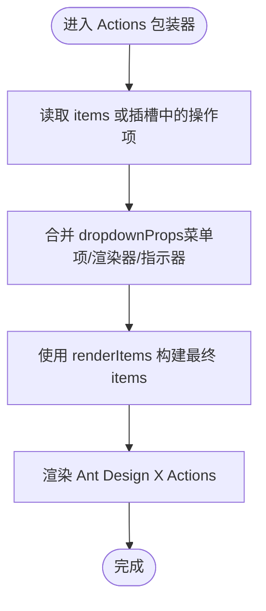
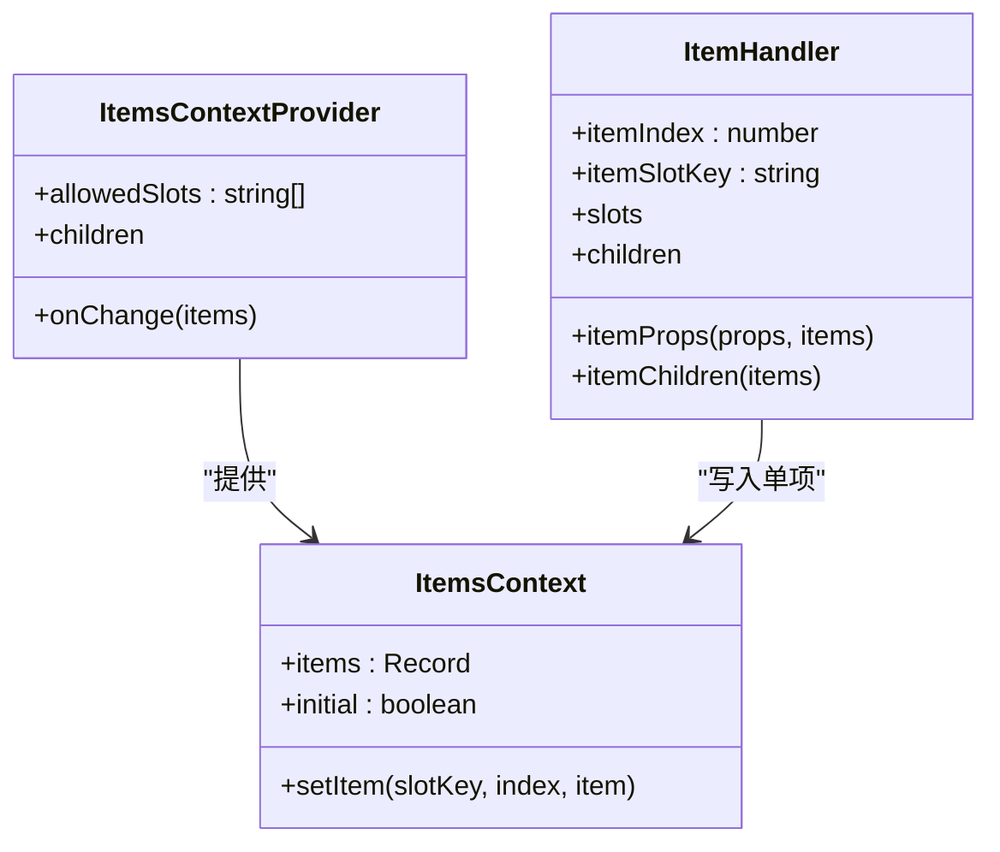
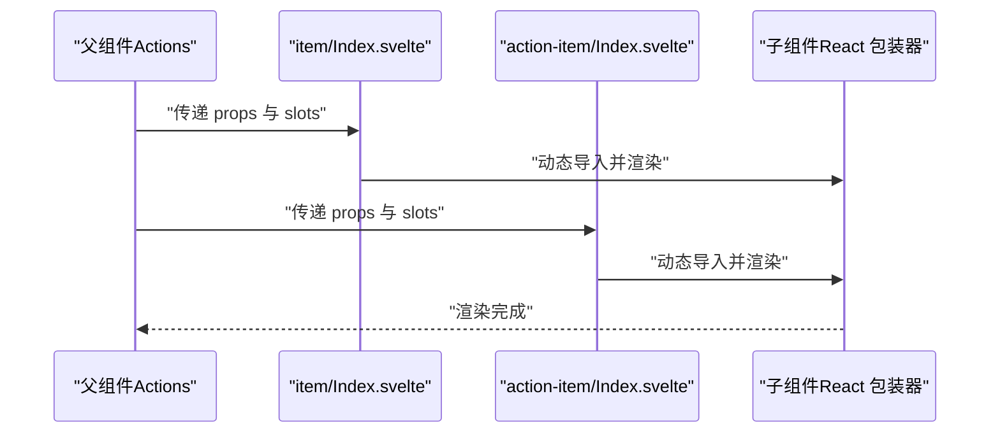
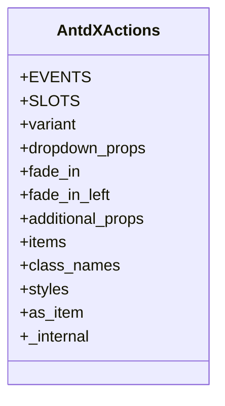
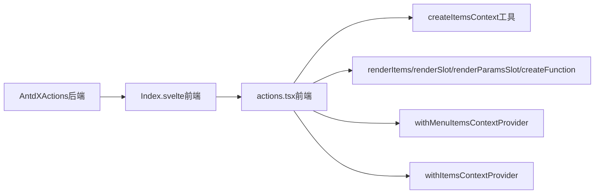

# Actions 概览

<cite>
**本文引用的文件**
- [frontend/antdx/actions/Index.svelte](file://frontend/antdx/actions/Index.svelte)
- [frontend/antdx/actions/actions.tsx](file://frontend/antdx/actions/actions.tsx)
- [frontend/antdx/actions/context.ts](file://frontend/antdx/actions/context.ts)
- [frontend/antdx/actions/item/Index.svelte](file://frontend/antdx/actions/item/Index.svelte)
- [frontend/antdx/actions/action-item/Index.svelte](file://frontend/antdx/actions/action-item/Index.svelte)
- [frontend/utils/createItemsContext.tsx](file://frontend/utils/createItemsContext.tsx)
- [backend/modelscope_studio/components/antdx/actions/__init__.py](file://backend/modelscope_studio/components/antdx/actions/__init__.py)
- [docs/components/antdx/actions/README.md](file://docs/components/antdx/actions/README.md)
</cite>

## 目录

1. [引言](#引言)
2. [项目结构](#项目结构)
3. [核心组件](#核心组件)
4. [架构总览](#架构总览)
5. [详细组件分析](#详细组件分析)
6. [依赖关系分析](#依赖关系分析)
7. [性能考量](#性能考量)
8. [故障排查指南](#故障排查指南)
9. [结论](#结论)
10. [附录](#附录)

## 引言

Actions 是 Ant Design X 组件库在 ModelScope Studio 中的一个布局与交互组件，用于在 AI 场景中快速配置一组可复用的操作按钮或功能入口。它通过统一的“操作项”模型与插槽（slots）机制，将静态配置与动态渲染解耦，既支持直接传入 items 列表，也支持以子组件形式声明式地组织操作项，从而提升开发效率与可维护性。

在 ModelScope Studio 的整体架构中，Actions 位于前端 Svelte 层与后端 Gradio 组件层之间，承担“桥接与适配”的角色：前端负责将 Ant Design X 的 Actions 渲染到页面；后端通过自定义组件类暴露事件与插槽能力，并将额外属性透传给前端，实现从 Python 端到浏览器端的完整交互闭环。

## 项目结构

Actions 组件由前后端两部分组成：

- 前端（Svelte + React）：负责将 Ant Design X 的 Actions 渲染为页面元素，并通过插槽与上下文系统收集子项。
- 后端（Python + Gradio）：定义组件接口、事件与插槽，负责属性与事件的绑定与转发。

**图表来源**

- [frontend/antdx/actions/Index.svelte:1-77](file://frontend/antdx/actions/Index.svelte#L1-L77)
- [frontend/antdx/actions/actions.tsx:1-123](file://frontend/antdx/actions/actions.tsx#L1-L123)
- [frontend/antdx/actions/context.ts:1-7](file://frontend/antdx/actions/context.ts#L1-L7)
- [frontend/antdx/actions/item/Index.svelte:1-60](file://frontend/antdx/actions/item/Index.svelte#L1-L60)
- [frontend/antdx/actions/action-item/Index.svelte:1-99](file://frontend/antdx/actions/action-item/Index.svelte#L1-L99)
- [frontend/utils/createItemsContext.tsx:1-274](file://frontend/utils/createItemsContext.tsx#L1-L274)
- [backend/modelscope_studio/components/antdx/actions/**init**.py:1-112](file://backend/modelscope_studio/components/antdx/actions/__init__.py#L1-L112)

**章节来源**

- [frontend/antdx/actions/Index.svelte:1-77](file://frontend/antdx/actions/Index.svelte#L1-L77)
- [frontend/antdx/actions/actions.tsx:1-123](file://frontend/antdx/actions/actions.tsx#L1-L123)
- [frontend/antdx/actions/context.ts:1-7](file://frontend/antdx/actions/context.ts#L1-L7)
- [frontend/antdx/actions/item/Index.svelte:1-60](file://frontend/antdx/actions/item/Index.svelte#L1-L60)
- [frontend/antdx/actions/action-item/Index.svelte:1-99](file://frontend/antdx/actions/action-item/Index.svelte#L1-L99)
- [frontend/utils/createItemsContext.tsx:1-274](file://frontend/utils/createItemsContext.tsx#L1-L274)
- [backend/modelscope_studio/components/antdx/actions/**init**.py:1-112](file://backend/modelscope_studio/components/antdx/actions/__init__.py#L1-L112)

## 核心组件

- Actions 主组件：负责接收 items 或插槽中的操作项，结合 dropdownProps 对下拉菜单进行定制化渲染，并将最终的 Ant Design X Actions 渲染到页面。
- 操作项上下文：通过 createItemsContext 提供的 ItemsContext，收集子级操作项（含默认插槽与命名插槽），并支持子项的 props、slots、children 的合并与传递。
- 子组件包装器：item 与 action-item 分别对“操作容器”和“具体操作项”进行包装，负责属性透传、可见性控制、样式与 ID 注入，以及事件映射（如 item_click 映射为 itemClick）。

**章节来源**

- [frontend/antdx/actions/actions.tsx:1-123](file://frontend/antdx/actions/actions.tsx#L1-L123)
- [frontend/antdx/actions/context.ts:1-7](file://frontend/antdx/actions/context.ts#L1-L7)
- [frontend/utils/createItemsContext.tsx:1-274](file://frontend/utils/createItemsContext.tsx#L1-L274)
- [frontend/antdx/actions/item/Index.svelte:1-60](file://frontend/antdx/actions/item/Index.svelte#L1-L60)
- [frontend/antdx/actions/action-item/Index.svelte:1-99](file://frontend/antdx/actions/action-item/Index.svelte#L1-L99)

## 架构总览

Actions 的运行时流程如下：

- 前端 Svelte 层通过 Index.svelte 动态导入 React 包装器 actions.tsx。
- actions.tsx 使用上下文与插槽工具函数，将 items 与 dropdownProps 转换为 Ant Design X 所需的数据结构。
- 后端组件类在 Python 端声明事件与插槽，将额外属性与可见性等信息透传至前端。
- 最终由 Ant Design X 的 Actions 渲染出 UI，并触发回调事件。

**图表来源**

- [backend/modelscope_studio/components/antdx/actions/**init**.py:1-112](file://backend/modelscope_studio/components/antdx/actions/__init__.py#L1-L112)
- [frontend/antdx/actions/Index.svelte:1-77](file://frontend/antdx/actions/Index.svelte#L1-L77)
- [frontend/antdx/actions/actions.tsx:1-123](file://frontend/antdx/actions/actions.tsx#L1-L123)
- [frontend/utils/createItemsContext.tsx:1-274](file://frontend/utils/createItemsContext.tsx#L1-L274)

## 详细组件分析

### Actions 主组件（React 包装器）

- 职责：将 Ant Design X 的 Actions 与插槽、上下文系统集成，负责 items 与 dropdownProps 的合并与渲染。
- 关键点：
  - 使用 withItemsContextProvider 与 withMenuItemsContextProvider 将 items 与菜单项上下文注入。
  - 通过 renderItems、renderSlot、renderParamsSlot 等工具函数，将插槽内容转换为 Ant Design X 所需的结构。
  - 对 dropdownProps 进行条件性合并，仅在存在有效值时才注入，避免冗余配置。

**图表来源**

- [frontend/antdx/actions/actions.tsx:1-123](file://frontend/antdx/actions/actions.tsx#L1-L123)
- [frontend/utils/createItemsContext.tsx:1-274](file://frontend/utils/createItemsContext.tsx#L1-L274)

**章节来源**

- [frontend/antdx/actions/actions.tsx:1-123](file://frontend/antdx/actions/actions.tsx#L1-L123)

### 操作项上下文（createItemsContext）

- 职责：提供 ItemsContext，用于收集与更新“操作项”数据，支持多插槽（default 与其他命名插槽）。
- 关键点：
  - setItem 支持按插槽键与索引更新单项，内部使用不可变更新策略，配合 useEffect 触发 onChange 回调。
  - ItemHandler 负责将子组件的 props、slots、children 等封装为标准 Item 结构，并写入上下文。
  - 通过 useMemoizedEqualValue 与 useMemoizedFn 优化渲染与回调开销。

**图表来源**

- [frontend/utils/createItemsContext.tsx:1-274](file://frontend/utils/createItemsContext.tsx#L1-L274)

**章节来源**

- [frontend/utils/createItemsContext.tsx:1-274](file://frontend/utils/createItemsContext.tsx#L1-L274)
- [frontend/antdx/actions/context.ts:1-7](file://frontend/antdx/actions/context.ts#L1-L7)

### 子组件包装器（item 与 action-item）

- 职责：对“操作容器”与“具体操作项”进行包装，负责属性透传、可见性控制、样式与 ID 注入，以及事件映射。
- 关键点：
  - Index.svelte 通过 importComponent 动态加载对应 React 组件，确保按需加载。
  - 对 additionalProps、elem\_\*、visible 等通用属性进行统一处理。
  - action-item 对 item_click 事件进行映射，确保与 Ant Design X 的回调约定一致。

**图表来源**

- [frontend/antdx/actions/item/Index.svelte:1-60](file://frontend/antdx/actions/item/Index.svelte#L1-L60)
- [frontend/antdx/actions/action-item/Index.svelte:1-99](file://frontend/antdx/actions/action-item/Index.svelte#L1-L99)

**章节来源**

- [frontend/antdx/actions/item/Index.svelte:1-60](file://frontend/antdx/actions/item/Index.svelte#L1-L60)
- [frontend/antdx/actions/action-item/Index.svelte:1-99](file://frontend/antdx/actions/action-item/Index.svelte#L1-L99)

### 后端组件类（AntdXActions）

- 职责：在 Python 端声明 Actions 组件的接口、事件与插槽，负责将额外属性与可见性等信息透传至前端。
- 关键点：
  - 定义 EVENTS：click、dropdown_open_change、dropdown_menu_click、dropdown_menu_deselect、dropdown_menu_open_change、dropdown_menu_select。
  - 定义 SLOTS：items、dropdownProps.dropdownRender、dropdownProps.popupRender、dropdownProps.menu.expandIcon、dropdownProps.menu.overflowedIndicator、dropdownProps.menu.items。
  - 提供 variant、dropdown_props、fade_in、fade_in_left 等属性，便于主题与动画控制。

**图表来源**

- [backend/modelscope_studio/components/antdx/actions/**init**.py:1-112](file://backend/modelscope_studio/components/antdx/actions/__init__.py#L1-L112)

**章节来源**

- [backend/modelscope_studio/components/antdx/actions/**init**.py:1-112](file://backend/modelscope_studio/components/antdx/actions/__init__.py#L1-L112)

## 依赖关系分析

- 前端依赖链：
  - Index.svelte 依赖 actions.tsx。
  - actions.tsx 依赖 createItemsContext、withItemsContextProvider、withMenuItemsContextProvider、renderItems、renderSlot、renderParamsSlot、createFunction。
  - item/Index.svelte 与 action-item/Index.svelte 依赖各自的 React 包装器。
- 后端依赖链：
  - AntdXActions 依赖前端目录解析与 Gradio 事件系统。

**图表来源**

- [backend/modelscope_studio/components/antdx/actions/**init**.py:1-112](file://backend/modelscope_studio/components/antdx/actions/__init__.py#L1-L112)
- [frontend/antdx/actions/Index.svelte:1-77](file://frontend/antdx/actions/Index.svelte#L1-L77)
- [frontend/antdx/actions/actions.tsx:1-123](file://frontend/antdx/actions/actions.tsx#L1-L123)
- [frontend/utils/createItemsContext.tsx:1-274](file://frontend/utils/createItemsContext.tsx#L1-L274)

**章节来源**

- [frontend/antdx/actions/actions.tsx:1-123](file://frontend/antdx/actions/actions.tsx#L1-L123)
- [frontend/utils/createItemsContext.tsx:1-274](file://frontend/utils/createItemsContext.tsx#L1-L274)
- [backend/modelscope_studio/components/antdx/actions/**init**.py:1-112](file://backend/modelscope_studio/components/antdx/actions/__init__.py#L1-L112)

## 性能考量

- 按需加载：Index.svelte 通过动态 importComponent 按需加载 React 包装器，减少首屏体积。
- 不可变更新：createItemsContext 使用不可变更新策略，避免不必要的重渲染。
- 计算缓存：actions.tsx 使用 useMemo 缓存 dropdownProps 与最终 items，降低渲染成本。
- 事件映射：通过 createFunction 将字符串形式的回调转换为函数，避免重复绑定。

[本节为通用性能建议，无需特定文件引用]

## 故障排查指南

- 无法显示操作项
  - 检查是否正确使用插槽或传入 items；确认插槽键名与组件声明一致。
  - 参考：[frontend/antdx/actions/actions.tsx:31-116](file://frontend/antdx/actions/actions.tsx#L31-L116)
- 下拉菜单未生效
  - 确认 dropdownProps 是否被正确合并；检查菜单项是否为空。
  - 参考：[frontend/antdx/actions/actions.tsx:39-96](file://frontend/antdx/actions/actions.tsx#L39-L96)
- 事件未触发
  - 确认后端 EVENTS 是否已注册；检查前端事件映射（如 item_click -> itemClick）。
  - 参考：[backend/modelscope_studio/components/antdx/actions/**init**.py:26-46](file://backend/modelscope_studio/components/antdx/actions/__init__.py#L26-L46)
  - 参考：[frontend/antdx/actions/action-item/Index.svelte:54-57](file://frontend/antdx/actions/action-item/Index.svelte#L54-L57)

**章节来源**

- [frontend/antdx/actions/actions.tsx:31-116](file://frontend/antdx/actions/actions.tsx#L31-L116)
- [backend/modelscope_studio/components/antdx/actions/**init**.py:26-46](file://backend/modelscope_studio/components/antdx/actions/__init__.py#L26-L46)
- [frontend/antdx/actions/action-item/Index.svelte:54-57](file://frontend/antdx/actions/action-item/Index.svelte#L54-L57)

## 结论

Actions 在 ModelScope Studio 中扮演“操作入口聚合器”的角色，通过 Ant Design X 的强大能力与插槽/上下文机制，实现了灵活、可扩展且高性能的操作列表渲染。它既适合在 AI 应用中快速搭建“一键执行”类功能，也能在复杂场景中通过插槽与事件系统实现高度定制化的交互体验。

[本节为总结性内容，无需特定文件引用]

## 附录

- 快速上手示例请参考官方文档示例页。
  - 参考：[docs/components/antdx/actions/README.md:1-8](file://docs/components/antdx/actions/README.md#L1-L8)

**章节来源**

- [docs/components/antdx/actions/README.md:1-8](file://docs/components/antdx/actions/README.md#L1-L8)
