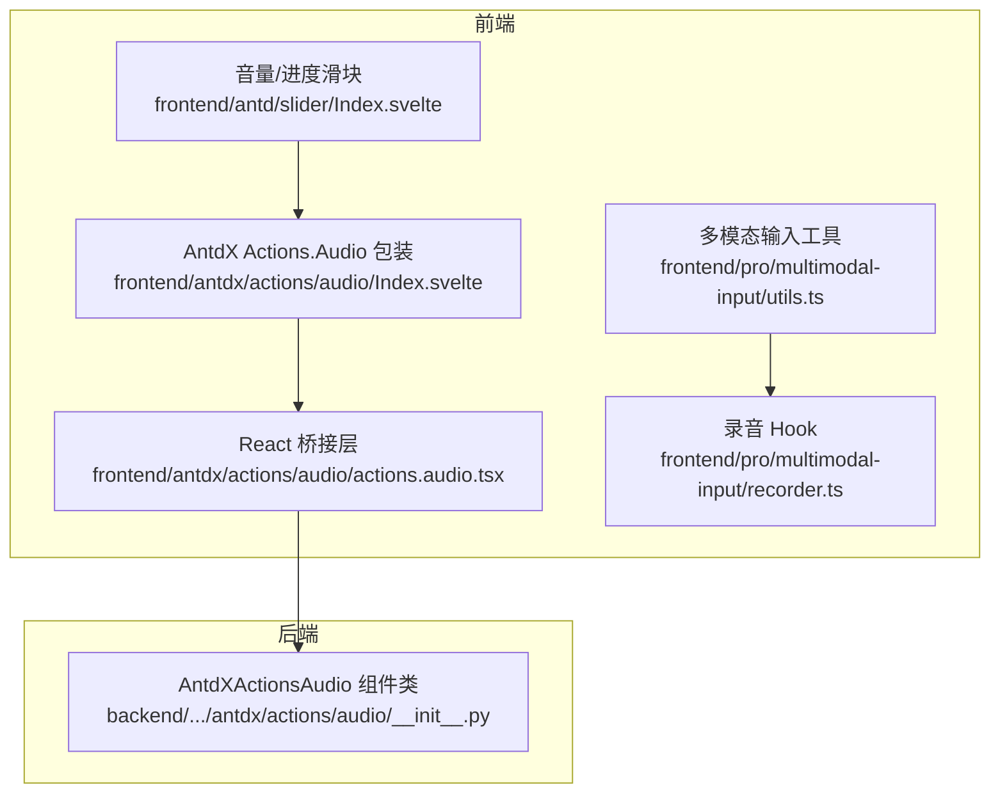
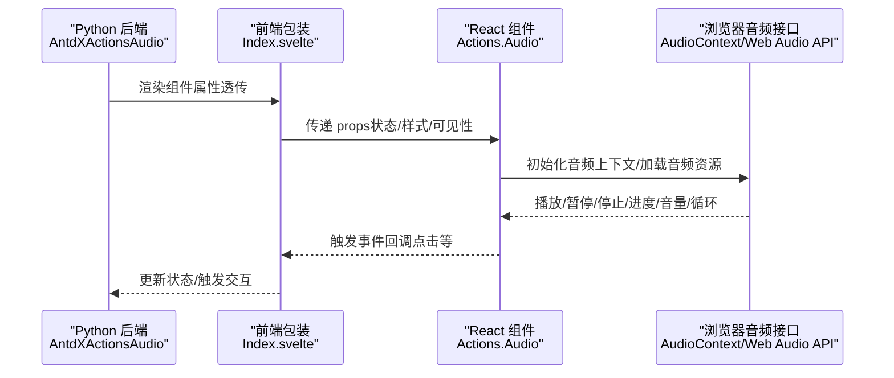
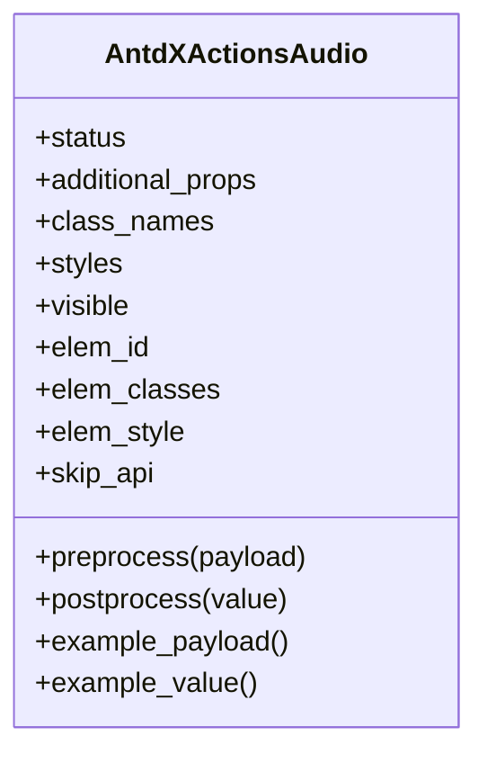
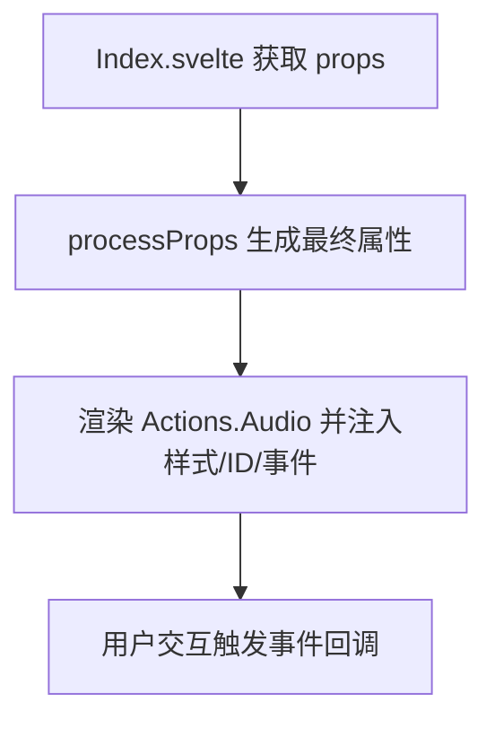
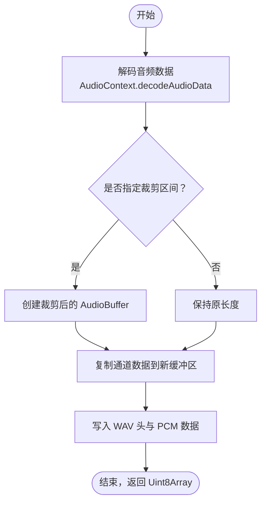
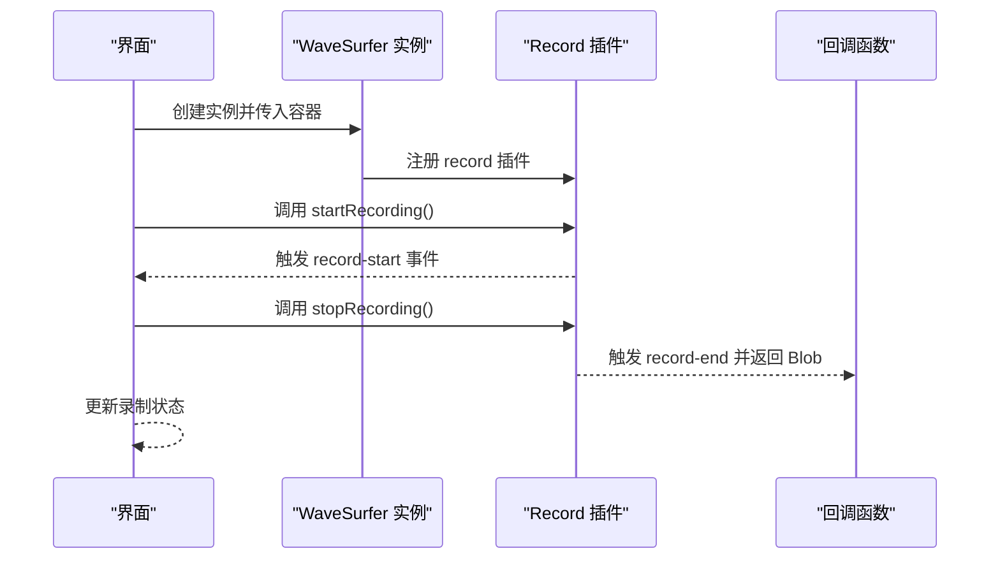
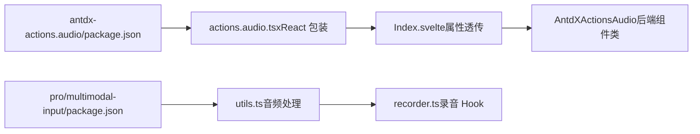

# Audio 音频操作

<cite>
**本文引用的文件**
- [frontend/antdx/actions/audio/Index.svelte](file://frontend/antdx/actions/audio/Index.svelte)
- [frontend/antdx/actions/audio/actions.audio.tsx](file://frontend/antdx/actions/audio/actions.audio.tsx)
- [backend/modelscope_studio/components/antdx/actions/audio/__init__.py](file://backend/modelscope_studio/components/antdx/actions/audio/__init__.py)
- [frontend/pro/multimodal-input/utils.ts](file://frontend/pro/multimodal-input/utils.ts)
- [frontend/pro/multimodal-input/recorder.ts](file://frontend/pro/multimodal-input/recorder.ts)
- [frontend/antd/slider/Index.svelte](file://frontend/antd/slider/Index.svelte)
- [docs/components/pro/multimodal_input/README.md](file://docs/components/pro/multimodal_input/README.md)
- [docs/components/pro/multimodal_input/README-zh_CN.md](file://docs/components/pro/multimodal_input/README-zh_CN.md)
- [frontend/pro/multimodal-input/package.json](file://frontend/pro/multimodal-input/package.json)
- [frontend/antdx/actions/audio/package.json](file://frontend/antdx/actions/audio/package.json)
</cite>

## 目录

1. [简介](#简介)
2. [项目结构](#项目结构)
3. [核心组件](#核心组件)
4. [架构总览](#架构总览)
5. [组件详解](#组件详解)
6. [依赖关系分析](#依赖关系分析)
7. [性能考量](#性能考量)
8. [故障排查指南](#故障排查指南)
9. [结论](#结论)
10. [附录](#附录)

## 简介

本文件系统性梳理并说明 Audio 音频操作组件在模型库前端中的实现与使用方式，重点覆盖以下方面：

- 音频播放与控制能力（播放/暂停/停止、进度、音量、循环）
- 音频文件加载与处理（解码、裁剪、导出）
- 录音与波形可视化（麦克风录音、波形绘制）
- 在不同业务场景下的集成实践（语音播报、音效播放、音频预览）
- 兼容性与性能优化建议
- 增强用户体验的设计技巧

## 项目结构

Audio 相关能力主要分布在以下位置：

- 前端 Svelte 包装层：将 Ant Design X 的 Actions.Audio 组件桥接到 Gradio 生态
- 后端 Python 组件：AntdXActionsAudio，负责属性透传与渲染控制
- 多模态输入 Pro 组件：提供录音、音频处理与导出能力
- 通用 UI 组件：如 Slider，用于音量/进度控制

**图表来源**

- [frontend/antdx/actions/audio/Index.svelte:1-59](file://frontend/antdx/actions/audio/Index.svelte#L1-L59)
- [frontend/antdx/actions/audio/actions.audio.tsx:1-17](file://frontend/antdx/actions/audio/actions.audio.tsx#L1-L17)
- [backend/modelscope_studio/components/antdx/actions/audio/**init**.py:10-71](file://backend/modelscope_studio/components/antdx/actions/audio/__init__.py#L10-L71)
- [frontend/pro/multimodal-input/utils.ts:1-126](file://frontend/pro/multimodal-input/utils.ts#L1-L126)
- [frontend/pro/multimodal-input/recorder.ts:1-48](file://frontend/pro/multimodal-input/recorder.ts#L1-L48)
- [frontend/antd/slider/Index.svelte:62-84](file://frontend/antd/slider/Index.svelte#L62-L84)

**章节来源**

- [frontend/antdx/actions/audio/Index.svelte:1-59](file://frontend/antdx/actions/audio/Index.svelte#L1-L59)
- [frontend/antdx/actions/audio/actions.audio.tsx:1-17](file://frontend/antdx/actions/audio/actions.audio.tsx#L1-L17)
- [backend/modelscope_studio/components/antdx/actions/audio/**init**.py:10-71](file://backend/modelscope_studio/components/antdx/actions/audio/__init__.py#L10-L71)
- [frontend/pro/multimodal-input/utils.ts:1-126](file://frontend/pro/multimodal-input/utils.ts#L1-L126)
- [frontend/pro/multimodal-input/recorder.ts:1-48](file://frontend/pro/multimodal-input/recorder.ts#L1-L48)
- [frontend/antd/slider/Index.svelte:62-84](file://frontend/antd/slider/Index.svelte#L62-L84)

## 核心组件

- AntdXActionsAudio（后端组件类）：封装 Ant Design X 的 Actions.Audio，提供状态、样式、可见性等属性，并声明跳过 API 调用以直接渲染前端组件。
- Actions.Audio（前端包装）：通过 Svelte 包装桥接 React 组件，将属性透传到 Ant Design X 的 Actions.Audio。
- 音频处理工具（Pro 多模态输入）：提供音频缓冲区转 WAV、按时间范围裁剪音频、从 Blob 解码并导出等能力。
- 录音 Hook：基于 wavesurfer.js 的 record 插件，提供录音开始/结束回调与录制状态管理。

**章节来源**

- [backend/modelscope_studio/components/antdx/actions/audio/**init**.py:10-71](file://backend/modelscope_studio/components/antdx/actions/audio/__init__.py#L10-L71)
- [frontend/antdx/actions/audio/actions.audio.tsx:1-17](file://frontend/antdx/actions/audio/actions.audio.tsx#L1-L17)
- [frontend/pro/multimodal-input/utils.ts:1-126](file://frontend/pro/multimodal-input/utils.ts#L1-L126)
- [frontend/pro/multimodal-input/recorder.ts:1-48](file://frontend/pro/multimodal-input/recorder.ts#L1-L48)

## 架构总览

Audio 能力在前端通过 Svelte 组件桥接 React 组件，后端通过自定义组件类将属性传递给前端；同时提供录音与音频处理工具，便于在多模态输入场景中完成“录音 → 预览 → 导出”的闭环。

**图表来源**

- [backend/modelscope_studio/components/antdx/actions/audio/**init**.py:10-71](file://backend/modelscope_studio/components/antdx/actions/audio/__init__.py#L10-L71)
- [frontend/antdx/actions/audio/Index.svelte:19-41](file://frontend/antdx/actions/audio/Index.svelte#L19-L41)
- [frontend/antdx/actions/audio/actions.audio.tsx:6-14](file://frontend/antdx/actions/audio/actions.audio.tsx#L6-L14)

## 组件详解

### AntdXActionsAudio（后端组件类）

- 责任边界：负责将前端组件映射到 Python 端，提供状态、样式、可见性等属性；声明跳过 API 调用，避免重复处理。
- 关键点：事件监听绑定、属性透传、渲染控制。

**图表来源**

- [backend/modelscope_studio/components/antdx/actions/audio/**init**.py:10-71](file://backend/modelscope_studio/components/antdx/actions/audio/__init__.py#L10-L71)

**章节来源**

- [backend/modelscope_studio/components/antdx/actions/audio/**init**.py:10-71](file://backend/modelscope_studio/components/antdx/actions/audio/__init__.py#L10-L71)

### Actions.Audio（前端包装）

- 责任边界：将 Ant Design X 的 Actions.Audio 通过 Svelte 包装桥接至 Gradio 生态，统一属性与事件。
- 关键点：sveltify 包装、slots 透传、样式与 ID 注入。

**图表来源**

- [frontend/antdx/actions/audio/Index.svelte:19-41](file://frontend/antdx/actions/audio/Index.svelte#L19-L41)
- [frontend/antdx/actions/audio/actions.audio.tsx:6-14](file://frontend/antdx/actions/audio/actions.audio.tsx#L6-L14)

**章节来源**

- [frontend/antdx/actions/audio/Index.svelte:1-59](file://frontend/antdx/actions/audio/Index.svelte#L1-L59)
- [frontend/antdx/actions/audio/actions.audio.tsx:1-17](file://frontend/antdx/actions/audio/actions.audio.tsx#L1-L17)

### 音频处理工具（裁剪/导出）

- 功能概览：将 AudioBuffer 写入 WAV 头部与 PCM 数据；按起止时间裁剪音频；从 Blob 解码并导出 WAV。
- 关键流程：解码 → 创建裁剪缓冲区 → 写入 WAV → 返回二进制数据。

**图表来源**

- [frontend/pro/multimodal-input/utils.ts:1-126](file://frontend/pro/multimodal-input/utils.ts#L1-L126)

**章节来源**

- [frontend/pro/multimodal-input/utils.ts:1-126](file://frontend/pro/multimodal-input/utils.ts#L1-L126)

### 录音与波形可视化

- 录音：基于 wavesurfer.js 的 record 插件，提供 start/stop 回调与录制状态。
- 波形：初始化 WaveSurfer 容器并注册 record 插件，实时显示波形。

**图表来源**

- [frontend/pro/multimodal-input/recorder.ts:24-41](file://frontend/pro/multimodal-input/recorder.ts#L24-L41)

**章节来源**

- [frontend/pro/multimodal-input/recorder.ts:1-48](file://frontend/pro/multimodal-input/recorder.ts#L1-L48)

### 音量/进度控制（Slider）

- 通过 Slider 组件实现音量与进度的双向控制，onValueChange 事件用于同步状态。
- 适配 Gradio 的属性透传机制，确保与后端状态一致。

**章节来源**

- [frontend/antd/slider/Index.svelte:62-84](file://frontend/antd/slider/Index.svelte#L62-L84)

## 依赖关系分析

- 前端包导出：两个关键包分别导出 Svelte 入口，供 Gradio 运行时加载。
- 组件耦合：AntdXActionsAudio 与前端包装组件松耦合，通过属性透传实现交互。
- 工具链：音频处理依赖 Web Audio API；录音依赖 wavesurfer.js 及其 record 插件。

**图表来源**

- [frontend/pro/multimodal-input/package.json:1-14](file://frontend/pro/multimodal-input/package.json#L1-L14)
- [frontend/antdx/actions/audio/package.json:1-14](file://frontend/antdx/actions/audio/package.json#L1-L14)
- [frontend/pro/multimodal-input/utils.ts:1-126](file://frontend/pro/multimodal-input/utils.ts#L1-L126)
- [frontend/pro/multimodal-input/recorder.ts:1-48](file://frontend/pro/multimodal-input/recorder.ts#L1-L48)
- [frontend/antdx/actions/audio/Index.svelte:1-59](file://frontend/antdx/actions/audio/Index.svelte#L1-L59)
- [backend/modelscope_studio/components/antdx/actions/audio/**init**.py:10-71](file://backend/modelscope_studio/components/antdx/actions/audio/__init__.py#L10-L71)

**章节来源**

- [frontend/pro/multimodal-input/package.json:1-14](file://frontend/pro/multimodal-input/package.json#L1-L14)
- [frontend/antdx/actions/audio/package.json:1-14](file://frontend/antdx/actions/audio/package.json#L1-L14)

## 性能考量

- 音频解码与裁剪：优先在浏览器端进行，避免大文件在网络传输中的开销；对长音频建议分段处理或延迟解码。
- 缓冲区管理：裁剪时仅复制必要片段，减少内存占用；导出前确认采样率与通道数一致性。
- 录音性能：合理设置 normalize 与容器大小，避免频繁重绘；在移动端注意后台播放限制与权限申请。
- UI 响应：音量/进度滑块采用受控组件模式，避免不必要的重渲染；事件回调使用记忆化函数降低抖动。

## 故障排查指南

- 无法播放音频
  - 检查音频格式是否被浏览器支持；尝试转换为 WAV/MP3 等常见格式。
  - 确认 AudioContext 初始化与权限（部分浏览器需要用户手势激活）。
- 录音无输出
  - 确认设备权限已授权；检查容器是否正确挂载。
  - 核对 record-end 回调是否被触发，Blob 是否为空。
- 导出失败
  - 确认裁剪区间合法（start/end 不越界）；检查采样率与通道数是否一致。
- 滑块不生效
  - 检查 onValueChange 事件是否正确更新状态；确认受控值与后备值的同步逻辑。

**章节来源**

- [frontend/pro/multimodal-input/utils.ts:60-126](file://frontend/pro/multimodal-input/utils.ts#L60-L126)
- [frontend/pro/multimodal-input/recorder.ts:24-41](file://frontend/pro/multimodal-input/recorder.ts#L24-L41)
- [frontend/antd/slider/Index.svelte:62-84](file://frontend/antd/slider/Index.svelte#L62-L84)

## 结论

Audio 音频操作组件在模型库前端中通过“后端组件类 + 前端包装 + 工具链”的方式实现了从播放控制到录音导出的完整能力。结合多模态输入场景，可快速构建语音播报、音效播放与音频预览等体验。建议在实际工程中关注格式兼容、性能优化与权限处理，以获得更稳定的用户体验。

## 附录

### 使用示例（场景化）

- 语音播报
  - 使用 AntdXActionsAudio 渲染播放按钮，结合 Slider 控制音量；通过事件回调触发播放/暂停。
- 音效播放
  - 加载本地音效文件，设置循环播放与音量；在交互事件中切换状态。
- 音频预览
  - 录音完成后，将 Blob 解码为 AudioBuffer，再导出为 WAV；在预览区域播放并提供下载。

**章节来源**

- [docs/components/pro/multimodal_input/README.md:1-43](file://docs/components/pro/multimodal_input/README.md#L1-L43)
- [docs/components/pro/multimodal_input/README-zh_CN.md:1-43](file://docs/components/pro/multimodal_input/README-zh_CN.md#L1-L43)
