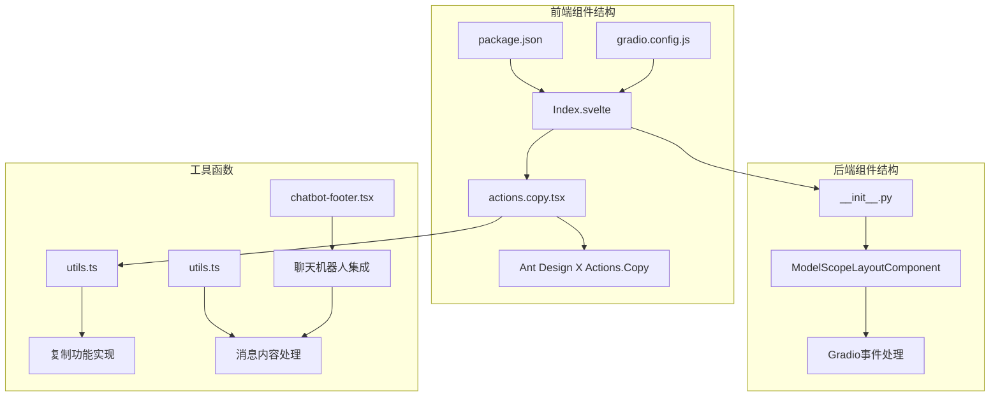
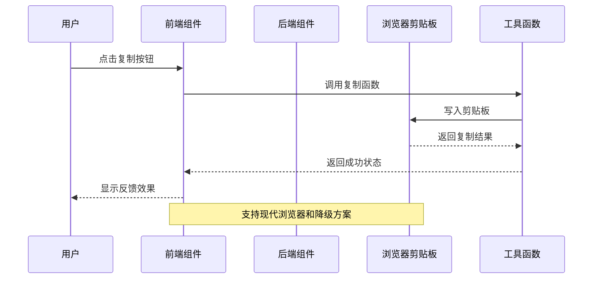
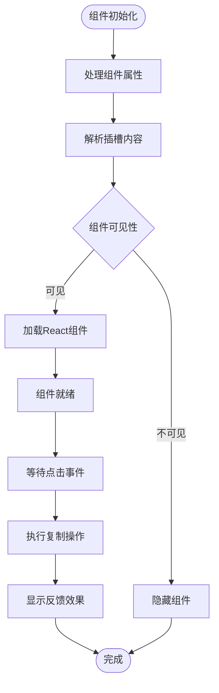
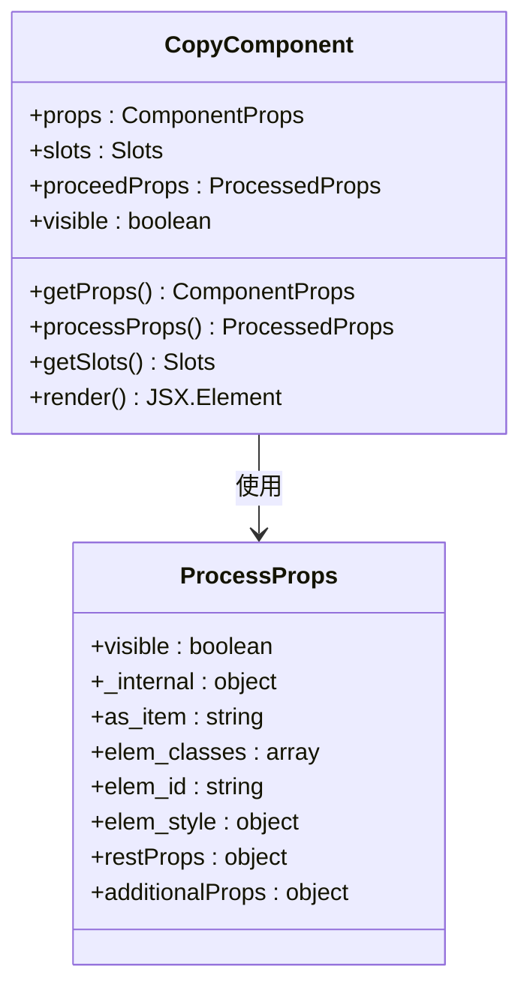
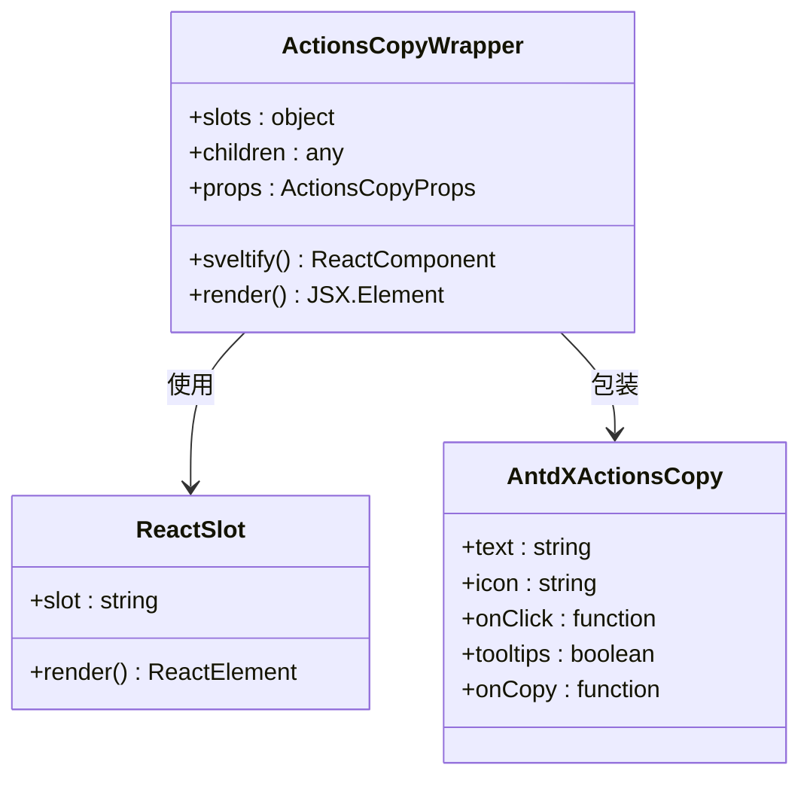
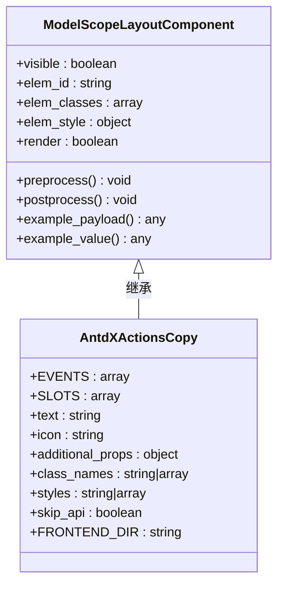
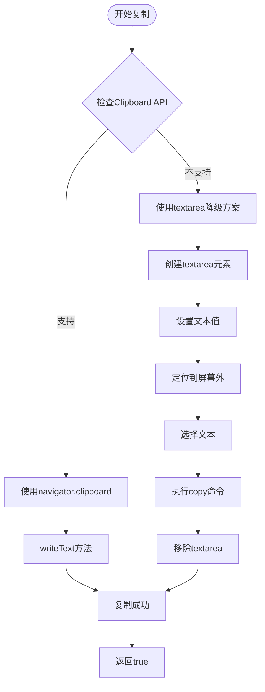
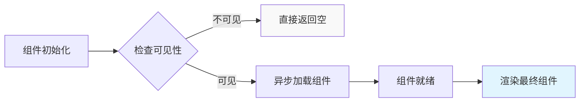

# 复制操作组件

<cite>
**本文档引用的文件**
- [actions.copy.tsx](file://frontend/antdx/actions/copy/actions.copy.tsx)
- [Index.svelte](file://frontend/antdx/actions/copy/Index.svelte)
- [__init__.py](file://backend/modelscope_studio/components/antdx/actions/copy/__init__.py)
- [package.json](file://frontend/antdx/actions/copy/package.json)
- [gradio.config.js](file://frontend/antdx/actions/copy/gradio.config.js)
- [utils.ts](file://frontend/globals/components/markdown/utils.ts)
- [chatbot-footer.tsx](file://frontend/pro/chatbot/chatbot-footer.tsx)
- [utils.ts](file://frontend/pro/chatbot/utils.ts)
- [basic.py](file://docs/components/antdx/actions/demos/basic.py)
</cite>

## 目录

1. [简介](#简介)
2. [项目结构](#项目结构)
3. [核心组件](#核心组件)
4. [架构概览](#架构概览)
5. [详细组件分析](#详细组件分析)
6. [依赖分析](#依赖分析)
7. [性能考虑](#性能考虑)
8. [故障排除指南](#故障排除指南)
9. [结论](#结论)

## 简介

复制操作组件是 ModelScope Studio 中用于快速配置复制功能的组件，基于 Ant Design X 的 Actions.Copy 实现。该组件提供了统一的复制操作接口，支持多种数据类型的复制，包括纯文本、链接、代码片段等常见场景。

该组件采用前后端分离的设计模式，前端使用 Svelte 构建，后端通过 Gradio 组件包装，实现了完整的复制功能生命周期管理。

## 项目结构

复制操作组件位于 Ant Design X 组件库中，具体结构如下：



**图表来源**

- [Index.svelte:1-60](file://frontend/antdx/actions/copy/Index.svelte#L1-L60)
- [actions.copy.tsx:1-22](file://frontend/antdx/actions/copy/actions.copy.tsx#L1-L22)
- [**init**.py:1-72](file://backend/modelscope_studio/components/antdx/actions/copy/__init__.py#L1-L72)

**章节来源**

- [Index.svelte:1-60](file://frontend/antdx/actions/copy/Index.svelte#L1-L60)
- [actions.copy.tsx:1-22](file://frontend/antdx/actions/copy/actions.copy.tsx#L1-L22)
- [**init**.py:1-72](file://backend/modelscope_studio/components/antdx/actions/copy/__init__.py#L1-L72)

## 核心组件

复制操作组件由三个主要部分组成：

### 前端组件层

- **Index.svelte**: 主要的前端入口组件，负责属性处理和渲染逻辑
- **actions.copy.tsx**: React 包装器，将 Ant Design X 的 Actions.Copy 组件适配到 Svelte 环境

### 后端组件层

- ****init**.py**: Python 后端组件定义，继承自 ModelScopeLayoutComponent

### 工具函数层

- **utils.ts**: 提供复制功能的核心实现，包括剪贴板 API 和降级方案

**章节来源**

- [Index.svelte:19-44](file://frontend/antdx/actions/copy/Index.svelte#L19-L44)
- [actions.copy.tsx:7-19](file://frontend/antdx/actions/copy/actions.copy.tsx#L7-L19)
- [**init**.py:10-72](file://backend/modelscope_studio/components/antdx/actions/copy/__init__.py#L10-L72)

## 架构概览

复制操作组件采用分层架构设计，实现了清晰的关注点分离：



**图表来源**

- [utils.ts:382-410](file://frontend/globals/components/markdown/utils.ts#L382-L410)
- [Index.svelte:46-59](file://frontend/antdx/actions/copy/Index.svelte#L46-L59)

### 组件交互流程



**图表来源**

- [Index.svelte:19-44](file://frontend/antdx/actions/copy/Index.svelte#L19-L44)
- [actions.copy.tsx:8-18](file://frontend/antdx/actions/copy/actions.copy.tsx#L8-L18)

## 详细组件分析

### 前端组件实现

#### Index.svelte 分析

Index.svelte 是复制组件的主要前端入口，负责以下关键功能：



**图表来源**

- [Index.svelte:12-44](file://frontend/antdx/actions/copy/Index.svelte#L12-L44)

#### actions.copy.tsx 分析

actions.copy.tsx 作为 React 包装器，实现了与 Ant Design X 的无缝集成：



**图表来源**

- [actions.copy.tsx:7-19](file://frontend/antdx/actions/copy/actions.copy.tsx#L7-L19)

**章节来源**

- [Index.svelte:19-59](file://frontend/antdx/actions/copy/Index.svelte#L19-L59)
- [actions.copy.tsx:7-21](file://frontend/antdx/actions/copy/actions.copy.tsx#L7-L21)

### 后端组件实现

#### Python 组件分析

后端组件继承自 ModelScopeLayoutComponent，提供了完整的 Gradio 集成：



**图表来源**

- [**init**.py:10-72](file://backend/modelscope_studio/components/antdx/actions/copy/__init__.py#L10-L72)

**章节来源**

- [**init**.py:15-19](file://backend/modelscope_studio/components/antdx/actions/copy/__init__.py#L15-L19)
- [**init**.py:21-22](file://backend/modelscope_studio/components/antdx/actions/copy/__init__.py#L21-L22)

### 复制功能实现

#### 核心复制逻辑

复制功能通过 utils.ts 中的工具函数实现，支持现代浏览器和传统浏览器两种方案：



**图表来源**

- [utils.ts:382-410](file://frontend/globals/components/markdown/utils.ts#L382-L410)

**章节来源**

- [utils.ts:382-410](file://frontend/globals/components/markdown/utils.ts#L382-L410)

## 依赖分析

### 组件依赖关系

复制操作组件的依赖关系相对简单，主要依赖于 Ant Design X 和 Gradio 生态系统：

```mermaid
graph TB
subgraph "外部依赖"
A[@ant-design/x] --> B[Actions.Copy]
C[Gradio] --> D[事件系统]
E[Svelte Preprocess React] --> F[组件包装]
end
subgraph "内部依赖"
G[utils.ts] --> H[复制功能]
I[markdown组件] --> J[代码块复制]
K[chatbot组件] --> L[消息复制]
end
subgraph "复制组件"
B --> M[ActionsCopyWrapper]
F --> M
H --> M
M --> N[Index.svelte]
end
M --> O[Python后端组件]
O --> D
```

**图表来源**

- [actions.copy.tsx:4](file://frontend/antdx/actions/copy/actions.copy.tsx#L4)
- [Index.svelte:10](file://frontend/antdx/actions/copy/Index.svelte#L10)

### 版本兼容性

组件支持的版本要求：

- Node.js: >= 14.0.0
- Svelte: >= 3.0.0
- Ant Design X: >= latest
- Gradio: >= latest

**章节来源**

- [package.json:1-15](file://frontend/antdx/actions/copy/package.json#L1-L15)
- [gradio.config.js:1-4](file://frontend/antdx/actions/copy/gradio.config.js#L1-L4)

## 性能考虑

### 渲染优化

复制组件采用了懒加载策略，只有在需要时才加载 React 组件：



**图表来源**

- [Index.svelte:46-59](file://frontend/antdx/actions/copy/Index.svelte#L46-L59)

### 内存管理

组件实现了适当的内存清理机制：

- 自动移除事件监听器
- 及时清理临时 DOM 元素
- 避免内存泄漏

## 故障排除指南

### 常见问题及解决方案

#### 复制功能失效

**问题描述**: 用户点击复制按钮但无法复制到剪贴板

**可能原因**:

1. 浏览器安全策略限制
2. HTTPS 环境问题
3. 权限不足

**解决方案**:

1. 确保网站运行在 HTTPS 环境
2. 检查浏览器权限设置
3. 尝试手动触发复制操作

#### 组件渲染异常

**问题描述**: 复制组件无法正常显示或渲染

**可能原因**:

1. 前端构建配置问题
2. 依赖包版本冲突
3. 插槽内容格式错误

**解决方案**:

1. 检查前端构建日志
2. 更新依赖包到兼容版本
3. 验证插槽内容格式

**章节来源**

- [utils.ts:382-410](file://frontend/globals/components/markdown/utils.ts#L382-L410)
- [Index.svelte:46-59](file://frontend/antdx/actions/copy/Index.svelte#L46-L59)

## 结论

复制操作组件是一个设计精良的通用组件，具有以下特点：

### 技术优势

- **模块化设计**: 清晰的前后端分离架构
- **兼容性强**: 支持多种浏览器环境
- **易于扩展**: 插槽系统支持灵活定制
- **性能优化**: 懒加载和内存管理

### 使用场景

- 文本内容复制
- 代码片段复制
- 链接分享
- 文件下载链接复制

### 最佳实践

1. 合理使用插槽系统进行定制
2. 注意浏览器兼容性问题
3. 实现适当的错误处理机制
4. 考虑用户体验的反馈设计

该组件为 ModelScope Studio 提供了可靠的复制功能基础，可以满足大多数应用场景的需求。
