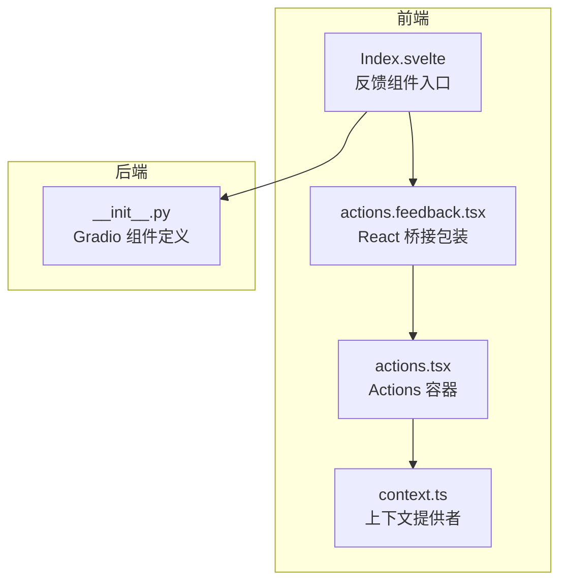
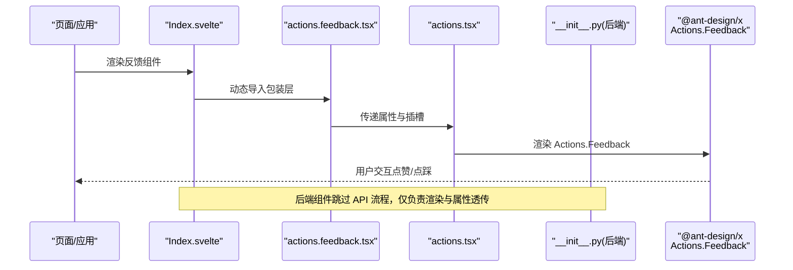
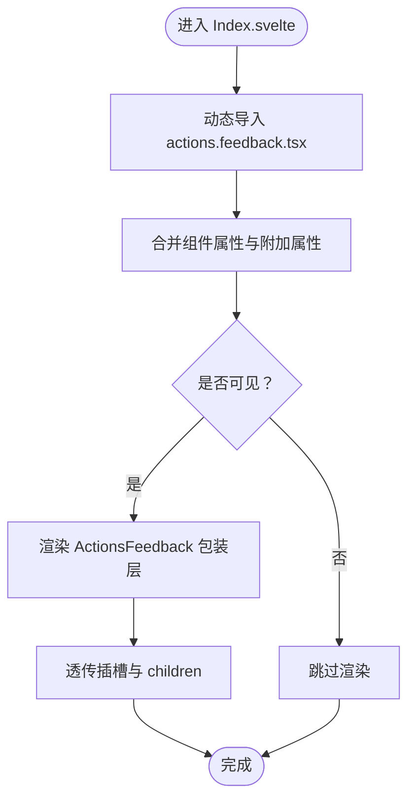
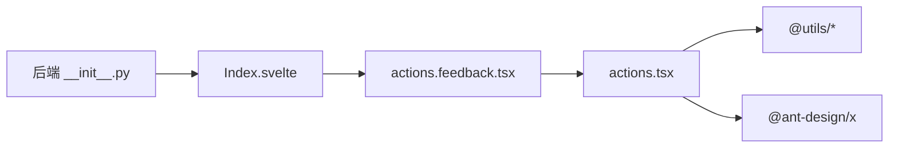

# Feedback 反馈操作

<cite>
**本文档引用的文件**
- [frontend/antdx/actions/feedback/actions.feedback.tsx](file://frontend/antdx/actions/feedback/actions.feedback.tsx)
- [frontend/antdx/actions/feedback/Index.svelte](file://frontend/antdx/actions/feedback/Index.svelte)
- [frontend/antdx/actions/feedback/package.json](file://frontend/antdx/actions/feedback/package.json)
- [frontend/antdx/actions/actions.tsx](file://frontend/antdx/actions/actions.tsx)
- [frontend/antdx/actions/context.ts](file://frontend/antdx/actions/context.ts)
- [backend/modelscope_studio/components/antdx/actions/feedback/__init__.py](file://backend/modelscope_studio/components/antdx/actions/feedback/__init__.py)
- [backend/modelscope_studio/components/antdx/__init__.py](file://backend/modelscope_studio/components/antdx/__init__.py)
</cite>

## 目录

1. [简介](#简介)
2. [项目结构](#项目结构)
3. [核心组件](#核心组件)
4. [架构总览](#架构总览)
5. [详细组件分析](#详细组件分析)
6. [依赖关系分析](#依赖关系分析)
7. [性能考虑](#性能考虑)
8. [故障排查指南](#故障排查指南)
9. [结论](#结论)
10. [附录](#附录)

## 简介

本文件系统性阐述 Feedback 反馈操作组件的设计与实现，聚焦于用户反馈收集、数据流转与处理机制，并提供可复用的使用范式（如满意度调查、功能评价、问题报告等）。该组件基于 Ant Design X 的 Actions.Feedback 能力，通过 Gradio 生态中的 Svelte 包装层实现前后端一体化集成，具备以下关键特性：

- 前端以 Svelte 组件形式暴露，内部桥接 React 实现；
- 后端作为 Gradio 组件参与界面渲染与事件分发；
- 支持“点赞/点踩/默认”三种反馈值，便于后续统计与分析；
- 面向产品改进与体验优化，提供可扩展的反馈采集与响应能力。

## 项目结构

Feedback 组件位于前端 antdx/actions/feedback 目录，后端位于 backend/modelscope_studio/components/antdx/actions/feedback。其与 Actions 主容器组件协同工作，形成“容器-子项”的组合关系。

图表来源

- [frontend/antdx/actions/feedback/Index.svelte:1-62](file://frontend/antdx/actions/feedback/Index.svelte#L1-L62)
- [frontend/antdx/actions/feedback/actions.feedback.tsx:1-16](file://frontend/antdx/actions/feedback/actions.feedback.tsx#L1-L16)
- [frontend/antdx/actions/actions.tsx:1-123](file://frontend/antdx/actions/actions.tsx#L1-L123)
- [frontend/antdx/actions/context.ts:1-7](file://frontend/antdx/actions/context.ts#L1-L7)
- [backend/modelscope_studio/components/antdx/actions/feedback/**init**.py:25-73](file://backend/modelscope_studio/components/antdx/actions/feedback/__init__.py#L25-L73)

章节来源

- [frontend/antdx/actions/feedback/Index.svelte:1-62](file://frontend/antdx/actions/feedback/Index.svelte#L1-L62)
- [frontend/antdx/actions/feedback/actions.feedback.tsx:1-16](file://frontend/antdx/actions/feedback/actions.feedback.tsx#L1-L16)
- [frontend/antdx/actions/actions.tsx:1-123](file://frontend/antdx/actions/actions.tsx#L1-L123)
- [frontend/antdx/actions/context.ts:1-7](file://frontend/antdx/actions/context.ts#L1-L7)
- [backend/modelscope_studio/components/antdx/actions/feedback/**init**.py:25-73](file://backend/modelscope_studio/components/antdx/actions/feedback/__init__.py#L25-L73)

## 核心组件

- 前端入口组件：Index.svelte 将反馈组件按需加载并注入属性与插槽，支持可见性控制与样式类名拼接。
- React 桥接包装：actions.feedback.tsx 将 @ant-design/x 的 Actions.Feedback 以 Svelte 形式导出，简化调用。
- Actions 容器：actions.tsx 提供 Actions 容器能力，负责菜单项、下拉渲染、插槽与事件的统一处理。
- 上下文提供者：context.ts 提供 Items 上下文，支撑 Actions 子项的注册与渲染。
- 后端 Gradio 组件：反馈组件后端定义了属性、可见性、样式等基础能力，并声明跳过标准 API 流程，直接由前端驱动交互。

章节来源

- [frontend/antdx/actions/feedback/Index.svelte:10-61](file://frontend/antdx/actions/feedback/Index.svelte#L10-L61)
- [frontend/antdx/actions/feedback/actions.feedback.tsx:5-13](file://frontend/antdx/actions/feedback/actions.feedback.tsx#L5-L13)
- [frontend/antdx/actions/actions.tsx:17-120](file://frontend/antdx/actions/actions.tsx#L17-L120)
- [frontend/antdx/actions/context.ts:1-7](file://frontend/antdx/actions/context.ts#L1-L7)
- [backend/modelscope_studio/components/antdx/actions/feedback/**init**.py:28-73](file://backend/modelscope_studio/components/antdx/actions/feedback/__init__.py#L28-L73)

## 架构总览

Feedback 组件的运行时架构如下：前端 Svelte 组件通过 importComponent 动态加载 React 包装层，再由 React 层调用 @ant-design/x 的 Actions.Feedback；后端组件负责属性透传与渲染控制，不参与数据 API 处理，事件由前端完成。

图表来源

- [frontend/antdx/actions/feedback/Index.svelte:10-61](file://frontend/antdx/actions/feedback/Index.svelte#L10-L61)
- [frontend/antdx/actions/feedback/actions.feedback.tsx:5-13](file://frontend/antdx/actions/feedback/actions.feedback.tsx#L5-L13)
- [frontend/antdx/actions/actions.tsx:98-116](file://frontend/antdx/actions/actions.tsx#L98-L116)
- [backend/modelscope_studio/components/antdx/actions/feedback/**init**.py:56-60](file://backend/modelscope_studio/components/antdx/actions/feedback/__init__.py#L56-L60)

## 详细组件分析

### 前端组件链路分析

- Index.svelte
  - 负责动态导入包装层，处理组件属性与额外属性合并，支持可见性、样式、类名、元素 ID 等通用属性透传。
  - 使用 getSlots 获取插槽内容，将 children 渲染到包装层。
- actions.feedback.tsx
  - 通过 sveltify 将 React 组件 Actions.Feedback 包装为 Svelte 组件，保持属性透传与事件兼容。
- actions.tsx（Actions 容器）
  - 统一处理 items、dropdownProps、插槽渲染与函数参数化，确保 Actions.Feedback 在容器内正确渲染。
- context.ts
  - 提供 Items 上下文，支撑 Actions 子项注册与渲染。

图表来源

- [frontend/antdx/actions/feedback/Index.svelte:21-61](file://frontend/antdx/actions/feedback/Index.svelte#L21-L61)
- [frontend/antdx/actions/feedback/actions.feedback.tsx:5-13](file://frontend/antdx/actions/feedback/actions.feedback.tsx#L5-L13)

章节来源

- [frontend/antdx/actions/feedback/Index.svelte:10-61](file://frontend/antdx/actions/feedback/Index.svelte#L10-L61)
- [frontend/antdx/actions/feedback/actions.feedback.tsx:5-13](file://frontend/antdx/actions/feedback/actions.feedback.tsx#L5-L13)
- [frontend/antdx/actions/actions.tsx:27-120](file://frontend/antdx/actions/actions.tsx#L27-L120)
- [frontend/antdx/actions/context.ts:1-7](file://frontend/antdx/actions/context.ts#L1-L7)

### 数据收集与处理机制

- 反馈值类型
  - 支持 value 字段取值："like"（点赞）、"dislike"（点踩）、"default"（默认），用于区分用户反馈倾向。
- 事件与状态
  - 组件本身不执行后端 API，交互结果由前端处理；后端组件声明 skip_api=True，避免进入标准 API 流程。
- 插槽与扩展
  - 通过插槽机制可扩展反馈按钮组、自定义文案或图标，配合 Actions 容器实现更丰富的交互形态。

章节来源

- [backend/modelscope_studio/components/antdx/actions/feedback/**init**.py:30-54](file://backend/modelscope_studio/components/antdx/actions/feedback/__init__.py#L30-L54)
- [backend/modelscope_studio/components/antdx/actions/feedback/**init**.py:59-60](file://backend/modelscope_studio/components/antdx/actions/feedback/__init__.py#L59-L60)

### 使用示例与最佳实践

- 满意度调查
  - 场景：在对话记录末尾提供“满意/不满意”反馈按钮，点击后更新对应记录的元信息。
  - 实施要点：使用 Actions 容器承载反馈按钮，设置 value 为 "like"/"dislike"，结合业务状态更新逻辑。
- 功能评价
  - 场景：在功能模块页提供“有用/无用”评价入口，便于收集功能使用反馈。
  - 实施要点：通过插槽扩展按钮文案与图标，结合后端状态管理进行统计归档。
- 问题报告
  - 场景：在错误提示或异常路径提供“问题反馈”入口，引导用户提供问题描述。
  - 实施要点：结合表单组件与 Actions，收集用户输入与上下文信息，统一提交至问题跟踪系统。

说明：以上为通用使用范式，具体实现需结合业务状态与后端服务进行扩展。

### 分析方法、统计展示与响应处理

- 分析方法
  - 基于 value 字段进行聚合统计（如“like”占比、“dislike”占比）。
  - 结合时间维度、会话维度、功能模块维度进行交叉分析。
- 统计展示
  - 前端可采用图表组件（如柱状图、饼图）直观呈现反馈分布。
  - 后端可提供聚合接口，返回各维度统计结果。
- 响应处理
  - 对“dislike”反馈建议触发告警或自动转人工客服。
  - 对高频负面反馈进行根因分析与修复优先级排序。

说明：上述为通用分析与处理思路，具体实现需根据产品需求与数据平台能力定制。

## 依赖关系分析

- 前端依赖
  - @svelte-preprocess-react：实现 React 组件到 Svelte 的桥接。
  - @ant-design/x：提供 Actions.Feedback 的 React 实现。
  - @utils/\*：提供渲染工具（renderItems、renderParamsSlot、createFunction）与上下文工具。
- 后端依赖
  - Gradio 组件基类：提供 visible、elem_id、elem_classes、elem_style 等通用属性。
  - 前端目录解析：通过 resolve_frontend_dir 指定前端资源路径。

图表来源

- [frontend/antdx/actions/feedback/Index.svelte:10-12](file://frontend/antdx/actions/feedback/Index.svelte#L10-L12)
- [frontend/antdx/actions/feedback/actions.feedback.tsx](file://frontend/antdx/actions/feedback/actions.feedback.tsx#L3)
- [frontend/antdx/actions/actions.tsx:1-10](file://frontend/antdx/actions/actions.tsx#L1-L10)
- [backend/modelscope_studio/components/antdx/actions/feedback/**init**.py](file://backend/modelscope_studio/components/antdx/actions/feedback/__init__.py#L56)

章节来源

- [frontend/antdx/actions/feedback/package.json:1-15](file://frontend/antdx/actions/feedback/package.json#L1-L15)
- [frontend/antdx/actions/feedback/actions.feedback.tsx:1-3](file://frontend/antdx/actions/feedback/actions.feedback.tsx#L1-L3)
- [frontend/antdx/actions/actions.tsx:1-10](file://frontend/antdx/actions/actions.tsx#L1-L10)
- [backend/modelscope_studio/components/antdx/actions/feedback/**init**.py](file://backend/modelscope_studio/components/antdx/actions/feedback/__init__.py#L56)

## 性能考虑

- 按需加载：Index.svelte 通过 importComponent 动态导入包装层，减少初始包体与首屏渲染压力。
- 属性透传：仅透传必要属性，避免冗余计算与 DOM 更新。
- 插槽渲染：利用 renderItems/renderParamsSlot 等工具，确保插槽内容按需渲染与克隆，降低重复开销。
- 事件绑定：Actions 容器集中处理事件与渲染，避免多层嵌套导致的事件风暴。

## 故障排查指南

- 组件未显示
  - 检查 visible 属性是否为 true。
  - 确认 elem_id、elem_classes、elem_style 是否影响布局或被覆盖。
- 交互无效
  - 确认 Actions 容器已正确渲染，且 dropdownProps、items 等属性已正确传递。
  - 检查插槽键名是否匹配（如 dropdownProps.menu.items）。
- 后端报错
  - 后端组件 skip_api=True，若出现 API 相关错误，请检查前端是否误用后端 API 流程。
  - 确认 FRONTEND_DIR 指向的前端目录存在且可访问。

章节来源

- [frontend/antdx/actions/feedback/Index.svelte:48-61](file://frontend/antdx/actions/feedback/Index.svelte#L48-L61)
- [frontend/antdx/actions/actions.tsx:39-96](file://frontend/antdx/actions/actions.tsx#L39-L96)
- [backend/modelscope_studio/components/antdx/actions/feedback/**init**.py:59-60](file://backend/modelscope_studio/components/antdx/actions/feedback/__init__.py#L59-L60)

## 结论

Feedback 反馈操作组件通过“Svelte 入口 + React 包装 + Actions 容器”的架构，实现了对用户反馈的高效采集与扩展。其设计强调前后端解耦、按需加载与插槽扩展，适用于满意度调查、功能评价、问题报告等多种场景。结合合理的统计分析与响应处理策略，可显著提升产品改进效率与用户体验质量。

## 附录

- 组件导出与打包
  - package.json 中通过 exports 映射将 Gradio 与默认入口指向同一 Svelte 文件，便于不同环境加载。
- 相关组件索引
  - 后端 antdx 组件索引包含 Feedback 组件映射，便于统一管理与查找。

章节来源

- [frontend/antdx/actions/feedback/package.json:4-13](file://frontend/antdx/actions/feedback/package.json#L4-L13)
- [backend/modelscope_studio/components/antdx/**init**.py](file://backend/modelscope_studio/components/antdx/__init__.py#L5)
