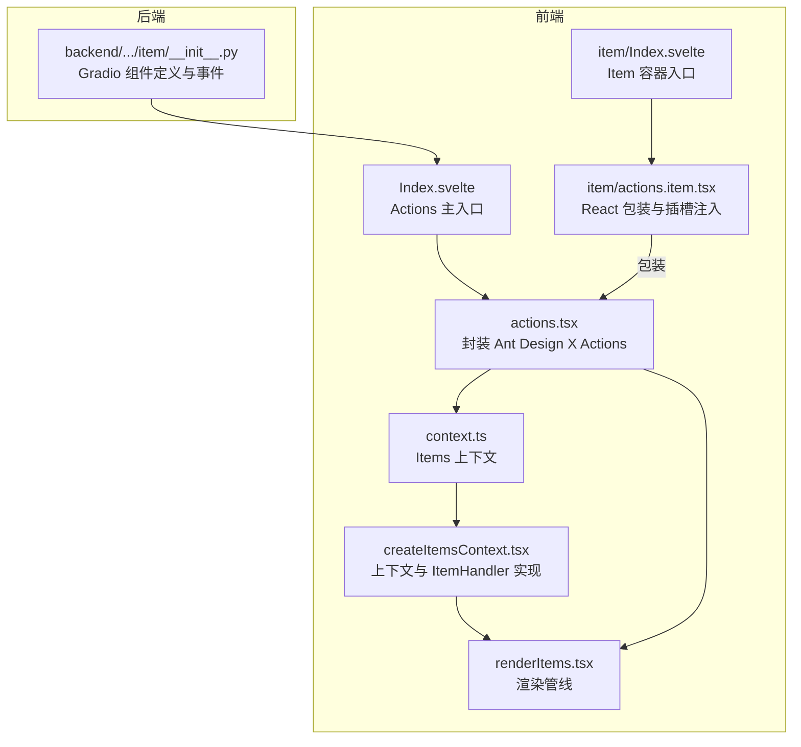
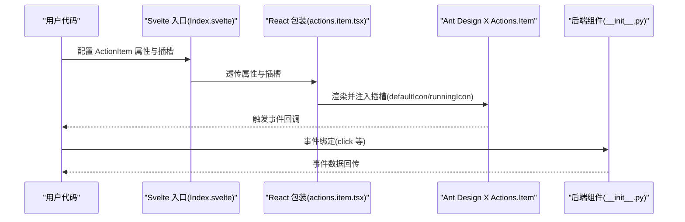
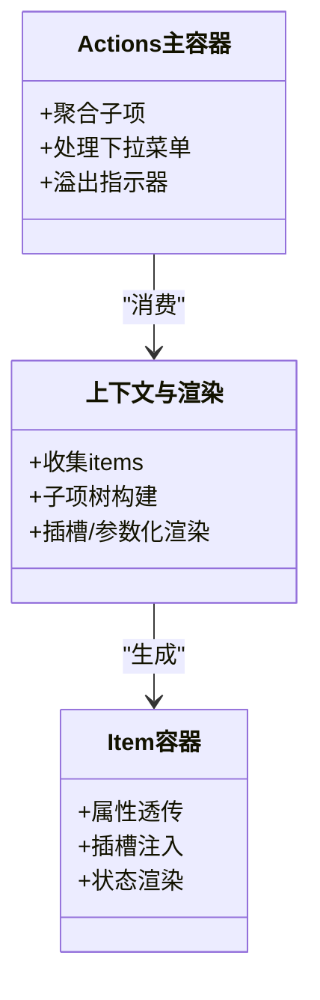
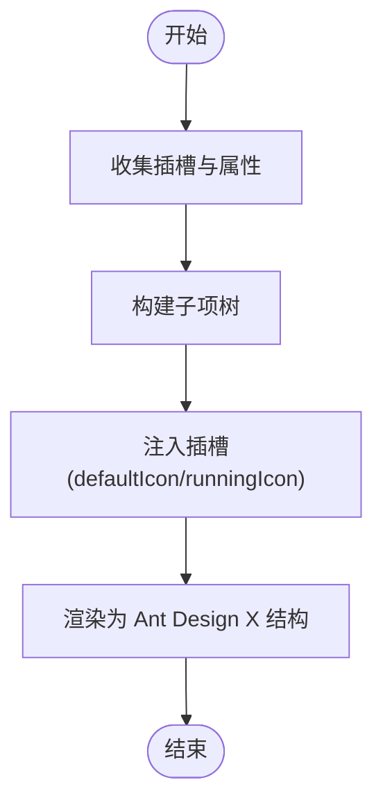
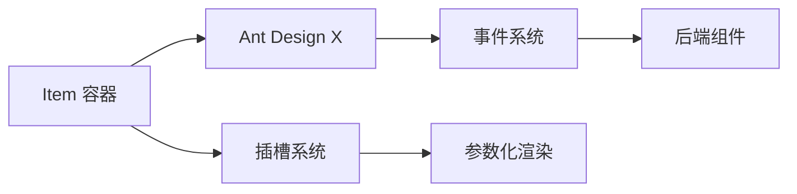

# Item 容器

<cite>
**本文引用的文件**
- [frontend/antdx/actions/item/Index.svelte](file://frontend/antdx/actions/item/Index.svelte)
- [frontend/antdx/actions/item/actions.item.tsx](file://frontend/antdx/actions/item/actions.item.tsx)
- [backend/modelscope_studio/components/antdx/actions/item/__init__.py](file://backend/modelscope_studio/components/antdx/actions/item/__init__.py)
- [frontend/antdx/actions/actions.tsx](file://frontend/antdx/actions/actions.tsx)
- [frontend/antdx/actions/context.ts](file://frontend/antdx/actions/context.ts)
- [frontend/utils/createItemsContext.tsx](file://frontend/utils/createItemsContext.tsx)
- [frontend/utils/renderItems.tsx](file://frontend/utils/renderItems.tsx)
- [frontend/antdx/actions/Index.svelte](file://frontend/antdx/actions/Index.svelte)
- [docs/components/antdx/actions/demos/basic.py](file://docs/components/antdx/actions/demos/basic.py)
</cite>

## 目录

1. [简介](#简介)
2. [项目结构](#项目结构)
3. [核心组件](#核心组件)
4. [架构总览](#架构总览)
5. [详细组件分析](#详细组件分析)
6. [依赖关系分析](#依赖关系分析)
7. [性能考量](#性能考量)
8. [故障排查指南](#故障排查指南)
9. [结论](#结论)
10. [附录](#附录)

## 简介

本篇文档聚焦于 AntdX Actions 组件体系中的 Item 容器（ActionItem），系统阐述其作为 Actions 内部容器的职责、布局与样式控制、响应式设计思路、与子操作项的协作机制、事件传递与状态同步，并给出多种布局（水平、垂直、网格）的实践建议与最佳实践。该容器在整体组件架构中承担“子项定义与渲染”的关键角色，是构建复杂操作列表的基础构件。

## 项目结构

- 前端层：Svelte 入口负责属性透传与可见性控制；React 包装层负责对接 Ant Design X 的 Actions.Item；后端 Python 组件负责 Gradio 集成与事件绑定。
- 工具层：通用的 items 上下文与渲染管线，支撑多级子项、插槽（slots）与参数化渲染。

图表来源

- [frontend/antdx/actions/Index.svelte:1-77](file://frontend/antdx/actions/Index.svelte#L1-L77)
- [frontend/antdx/actions/actions.tsx:1-123](file://frontend/antdx/actions/actions.tsx#L1-L123)
- [frontend/antdx/actions/context.ts:1-7](file://frontend/antdx/actions/context.ts#L1-L7)
- [frontend/utils/createItemsContext.tsx:1-274](file://frontend/utils/createItemsContext.tsx#L1-L274)
- [frontend/utils/renderItems.tsx:1-114](file://frontend/utils/renderItems.tsx#L1-L114)
- [frontend/antdx/actions/item/Index.svelte:1-60](file://frontend/antdx/actions/item/Index.svelte#L1-L60)
- [frontend/antdx/actions/item/actions.item.tsx:1-35](file://frontend/antdx/actions/item/actions.item.tsx#L1-L35)
- [backend/modelscope_studio/components/antdx/actions/item/**init**.py:1-77](file://backend/modelscope_studio/components/antdx/actions/item/__init__.py#L1-L77)

章节来源

- [frontend/antdx/actions/Index.svelte:1-77](file://frontend/antdx/actions/Index.svelte#L1-L77)
- [frontend/antdx/actions/actions.tsx:1-123](file://frontend/antdx/actions/actions.tsx#L1-L123)
- [frontend/antdx/actions/context.ts:1-7](file://frontend/antdx/actions/context.ts#L1-L7)
- [frontend/utils/createItemsContext.tsx:1-274](file://frontend/utils/createItemsContext.tsx#L1-L274)
- [frontend/utils/renderItems.tsx:1-114](file://frontend/utils/renderItems.tsx#L1-L114)
- [frontend/antdx/actions/item/Index.svelte:1-60](file://frontend/antdx/actions/item/Index.svelte#L1-L60)
- [frontend/antdx/actions/item/actions.item.tsx:1-35](file://frontend/antdx/actions/item/actions.item.tsx#L1-L35)
- [backend/modelscope_studio/components/antdx/actions/item/**init**.py:1-77](file://backend/modelscope_studio/components/antdx/actions/item/__init__.py#L1-L77)

## 核心组件

- Item 容器入口（Svelte）
  - 负责接收父级传入的属性、额外属性、可见性、样式与类名，并将这些信息透传给 React 包装层。
  - 使用延迟派生计算最终属性，确保只在必要时更新。
  - 支持插槽（slots）与子节点渲染，便于在子项内注入图标、动作渲染器等。
- React 包装层（sveltify）
  - 将 Ant Design X 的 Actions.Item 与插槽系统对接，支持 defaultIcon、runningIcon 等插槽。
  - 通过 ReactSlot 将 Svelte 插槽内容克隆并注入到对应位置。
- 后端组件（Python）
  - 定义支持的插槽（defaultIcon、runningIcon）、事件（如 click）与属性（label、status、样式等）。
  - 控制是否跳过 API（skip_api），以及预处理/后处理流程。

章节来源

- [frontend/antdx/actions/item/Index.svelte:1-60](file://frontend/antdx/actions/item/Index.svelte#L1-L60)
- [frontend/antdx/actions/item/actions.item.tsx:1-35](file://frontend/antdx/actions/item/actions.item.tsx#L1-L35)
- [backend/modelscope_studio/components/antdx/actions/item/**init**.py:1-77](file://backend/modelscope_studio/components/antdx/actions/item/__init__.py#L1-L77)

## 架构总览

Item 容器在 Actions 体系中的定位：作为子项的“容器”，负责将用户配置的属性与插槽内容转换为 Ant Design X 所需的结构，并参与整体的渲染与事件分发。

图表来源

- [frontend/antdx/actions/item/Index.svelte:1-60](file://frontend/antdx/actions/item/Index.svelte#L1-L60)
- [frontend/antdx/actions/item/actions.item.tsx:1-35](file://frontend/antdx/actions/item/actions.item.tsx#L1-L35)
- [backend/modelscope_studio/components/antdx/actions/item/**init**.py:1-77](file://backend/modelscope_studio/components/antdx/actions/item/__init__.py#L1-L77)

## 详细组件分析

### 组件关系与职责

- Actions 主容器：负责聚合子项、处理下拉菜单、溢出指示器、扩展图标等高级能力。
- Item 容器：负责单个子项的渲染、插槽注入、状态（如 loading/error/running/default）与标签展示。
- 上下文与渲染管线：统一管理 items 的收集、子项树构建、插槽与参数化渲染。

图表来源

- [frontend/antdx/actions/actions.tsx:1-123](file://frontend/antdx/actions/actions.tsx#L1-L123)
- [frontend/utils/createItemsContext.tsx:1-274](file://frontend/utils/createItemsContext.tsx#L1-L274)
- [frontend/utils/renderItems.tsx:1-114](file://frontend/utils/renderItems.tsx#L1-L114)
- [frontend/antdx/actions/item/actions.item.tsx:1-35](file://frontend/antdx/actions/item/actions.item.tsx#L1-L35)

章节来源

- [frontend/antdx/actions/actions.tsx:1-123](file://frontend/antdx/actions/actions.tsx#L1-L123)
- [frontend/utils/createItemsContext.tsx:1-274](file://frontend/utils/createItemsContext.tsx#L1-L274)
- [frontend/utils/renderItems.tsx:1-114](file://frontend/utils/renderItems.tsx#L1-L114)
- [frontend/antdx/actions/item/actions.item.tsx:1-35](file://frontend/antdx/actions/item/actions.item.tsx#L1-L35)

### 布局管理与样式控制

- 可见性控制：通过 visible 属性决定是否渲染，避免无用 DOM。
- 类名与 ID：elem_classes、elem_id 用于样式覆盖与定位。
- 行为样式：elem_style 用于动态样式注入，适合响应式场景下的尺寸、间距调整。
- 容器样式：在 Svelte 入口处将样式与类名合并应用到根元素，保证与上层布局一致。

章节来源

- [frontend/antdx/actions/item/Index.svelte:19-60](file://frontend/antdx/actions/item/Index.svelte#L19-L60)
- [frontend/antdx/actions/Index.svelte:27-77](file://frontend/antdx/actions/Index.svelte#L27-L77)

### 响应式设计

- 基于 Ant Design X 的 Actions 自带的溢出与下拉菜单能力，Item 容器无需额外响应式逻辑即可适配窄屏。
- 若需自定义响应式行为，可在 elem_style 中按断点设置宽度、间距等；或通过外部容器（如 Space、Grid）进行布局约束。

章节来源

- [frontend/antdx/actions/actions.tsx:39-96](file://frontend/antdx/actions/actions.tsx#L39-L96)

### 子操作项协作机制

- 插槽注入：defaultIcon、runningIcon 等插槽通过 ReactSlot 注入到 Ant Design X 的对应字段，实现图标与运行态图标的差异化展示。
- 子项树：通过 createItemsContext 与 renderItems 构建子项树，支持嵌套 ActionItem 与 subItems 插槽。
- 参数化渲染：插槽可携带 withParams，实现按需传参的渲染。

图表来源

- [frontend/utils/createItemsContext.tsx:190-261](file://frontend/utils/createItemsContext.tsx#L190-L261)
- [frontend/utils/renderItems.tsx:8-114](file://frontend/utils/renderItems.tsx#L8-L114)
- [frontend/antdx/actions/item/actions.item.tsx:10-32](file://frontend/antdx/actions/item/actions.item.tsx#L10-L32)

章节来源

- [frontend/utils/createItemsContext.tsx:1-274](file://frontend/utils/createItemsContext.tsx#L1-L274)
- [frontend/utils/renderItems.tsx:1-114](file://frontend/utils/renderItems.tsx#L1-L114)
- [frontend/antdx/actions/item/actions.item.tsx:1-35](file://frontend/antdx/actions/item/actions.item.tsx#L1-L35)

### 事件传递与状态同步

- 事件绑定：后端组件声明 click 事件监听，并通过内部标记启用事件绑定。
- 状态同步：Item 的状态（如 loading/error/running/default）由后端属性驱动，前端根据状态切换图标与交互反馈。
- 回调数据：事件回调中可获取 keyPath、key 等关键信息，便于业务侧做分支处理。

章节来源

- [backend/modelscope_studio/components/antdx/actions/item/**init**.py:15-19](file://backend/modelscope_studio/components/antdx/actions/item/__init__.py#L15-L19)
- [docs/components/antdx/actions/demos/basic.py:7-10](file://docs/components/antdx/actions/demos/basic.py#L7-L10)

### 复杂布局实践建议

- 水平排列：直接在 Actions 下放置多个 ActionItem，利用 Ant Design X 的默认行内布局。
- 垂直排列：通过外层容器（如 Flex、Space）控制方向与对齐。
- 网格布局：在更复杂的场景中，可结合 Grid 或自定义容器，配合 elem_style 控制列宽与间距。
- 溢出策略：当子项较多时，利用 Actions 的下拉菜单与溢出指示器自动折叠，保持界面整洁。

章节来源

- [frontend/antdx/actions/actions.tsx:39-96](file://frontend/antdx/actions/actions.tsx#L39-L96)
- [frontend/antdx/actions/Index.svelte:27-77](file://frontend/antdx/actions/Index.svelte#L27-L77)

## 依赖关系分析

- 组件耦合
  - Item 容器与 Actions 主容器通过上下文与渲染管线解耦，仅在渲染阶段产生依赖。
  - 插槽系统通过 ReactSlot 与 ContextPropsProvider 解耦插槽内容与宿主组件。
- 外部依赖
  - Ant Design X：提供 Actions 与 Actions.Item 的基础能力。
  - Gradio：后端组件桥接前端事件与数据流。

图表来源

- [frontend/antdx/actions/item/actions.item.tsx:10-32](file://frontend/antdx/actions/item/actions.item.tsx#L10-L32)
- [frontend/antdx/actions/actions.tsx:39-96](file://frontend/antdx/actions/actions.tsx#L39-L96)
- [backend/modelscope_studio/components/antdx/actions/item/**init**.py:15-19](file://backend/modelscope_studio/components/antdx/actions/item/__init__.py#L15-L19)

章节来源

- [frontend/antdx/actions/item/actions.item.tsx:1-35](file://frontend/antdx/actions/item/actions.item.tsx#L1-L35)
- [frontend/antdx/actions/actions.tsx:1-123](file://frontend/antdx/actions/actions.tsx#L1-L123)
- [backend/modelscope_studio/components/antdx/actions/item/**init**.py:1-77](file://backend/modelscope_studio/components/antdx/actions/item/__init__.py#L1-L77)

## 性能考量

- 渲染优化
  - 使用延迟派生（$derived）与 useMemo 化简不必要的重渲染。
  - 通过 renderItems 的 clone/forceClone 控制克隆策略，减少重复渲染成本。
- 事件与状态
  - 事件绑定仅在需要时启用，避免全局监听带来的开销。
  - 状态切换（如 loading/error/running/default）尽量通过属性驱动，减少副作用。

章节来源

- [frontend/antdx/actions/item/Index.svelte:19-41](file://frontend/antdx/actions/item/Index.svelte#L19-L41)
- [frontend/antdx/actions/actions.tsx:104-113](file://frontend/antdx/actions/actions.tsx#L104-L113)
- [frontend/utils/renderItems.tsx:8-114](file://frontend/utils/renderItems.tsx#L8-L114)

## 故障排查指南

- 插槽未生效
  - 检查插槽键名是否正确（如 defaultIcon、runningIcon）。
  - 确认插槽内容是否为有效元素或配置对象。
- 图标不显示
  - 确保插槽内容已通过 ReactSlot 正确注入。
  - 检查 Ant Design X 对应字段是否被覆盖。
- 事件未触发
  - 确认后端组件已声明相应事件（如 click）。
  - 检查事件绑定是否启用（\_internal 标记）。
- 子项不显示
  - 检查 visible 属性与渲染条件。
  - 确认 items 上下文是否正确收集并传递。

章节来源

- [frontend/antdx/actions/item/actions.item.tsx:15-28](file://frontend/antdx/actions/item/actions.item.tsx#L15-L28)
- [backend/modelscope_studio/components/antdx/actions/item/**init**.py:15-19](file://backend/modelscope_studio/components/antdx/actions/item/__init__.py#L15-L19)
- [frontend/antdx/actions/item/Index.svelte:46-59](file://frontend/antdx/actions/item/Index.svelte#L46-L59)

## 结论

Item 容器在 Actions 体系中扮演“子项定义与渲染”的核心角色。它通过插槽系统与上下文渲染管线，将用户配置转化为 Ant Design X 所需的数据结构，并与事件系统协同完成状态同步与交互反馈。借助其解耦的设计与灵活的插槽机制，开发者可以轻松实现从简单到复杂的操作列表布局，并在响应式场景中获得良好的兼容性。

## 附录

- 使用示例参考：演示了如何在 Actions 中添加 ActionItem 并通过插槽注入图标与动作渲染器，同时绑定点击事件与子项删除事件。

章节来源

- [docs/components/antdx/actions/demos/basic.py:17-53](file://docs/components/antdx/actions/demos/basic.py#L17-L53)
