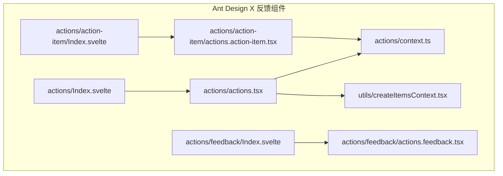
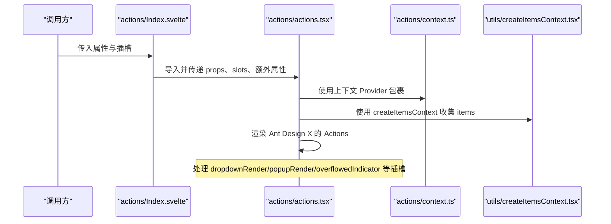
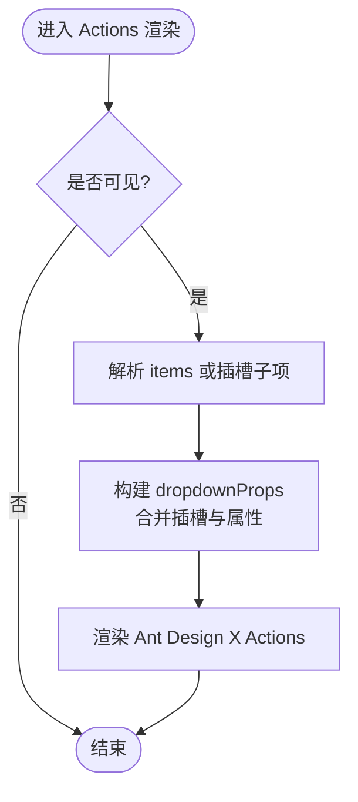
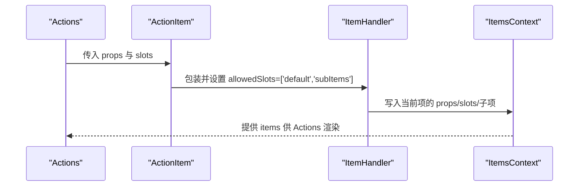
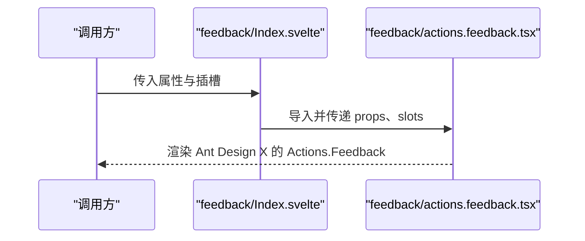
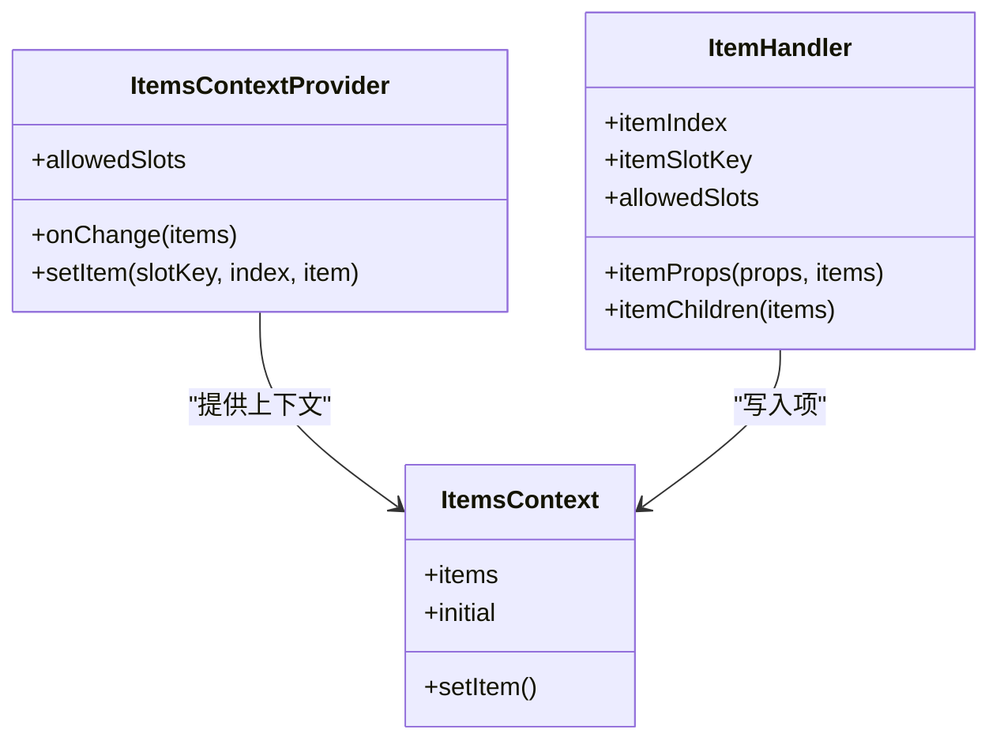
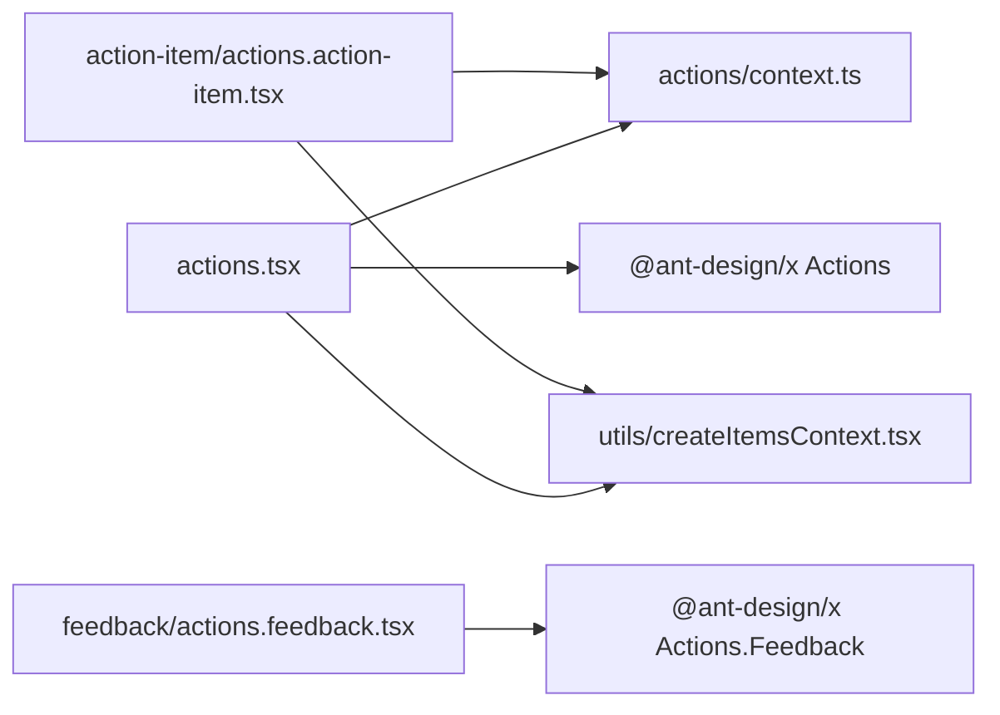

# 反馈组件

<cite>
**本文引用的文件**
- [frontend/antdx/actions/Index.svelte](file://frontend/antdx/actions/Index.svelte)
- [frontend/antdx/actions/actions.tsx](file://frontend/antdx/actions/actions.tsx)
- [frontend/antdx/actions/context.ts](file://frontend/antdx/actions/context.ts)
- [frontend/antdx/actions/action-item/Index.svelte](file://frontend/antdx/actions/action-item/Index.svelte)
- [frontend/antdx/actions/action-item/actions.action-item.tsx](file://frontend/antdx/actions/action-item/actions.action-item.tsx)
- [frontend/antdx/actions/feedback/Index.svelte](file://frontend/antdx/actions/feedback/Index.svelte)
- [frontend/antdx/actions/feedback/actions.feedback.tsx](file://frontend/antdx/actions/feedback/actions.feedback.tsx)
- [frontend/utils/createItemsContext.tsx](file://frontend/utils/createItemsContext.tsx)
</cite>

## 目录

1. [简介](#简介)
2. [项目结构](#项目结构)
3. [核心组件](#核心组件)
4. [架构总览](#架构总览)
5. [详细组件分析](#详细组件分析)
6. [依赖关系分析](#依赖关系分析)
7. [性能考量](#性能考量)
8. [故障排查指南](#故障排查指南)
9. [结论](#结论)
10. [附录](#附录)

## 简介

本文件聚焦于 Ant Design X 的反馈组件体系，尤其是 Actions 操作列表组件与 ActionItem 子组件。Actions 提供统一的操作入口与反馈收集能力，支持通过插槽与属性灵活配置菜单项、下拉渲染、溢出指示器等；ActionItem 则作为子项容器，负责将子树（默认插槽或子项插槽）转换为可被 Actions 解析的结构化数据，并通过上下文机制完成父子通信与状态管理。反馈组件（ActionsFeedback）则封装了 Ant Design X 的反馈能力，便于在对话气泡、消息流等场景中快速集成。

该组件体系在改善用户交互体验方面的关键价值在于：

- 统一的操作入口与视觉风格，降低认知负担
- 基于插槽的灵活扩展，支持复杂嵌套与动态渲染
- 通过上下文与状态管理，确保操作项的生命周期与事件正确传递
- 将“反馈”能力内嵌到操作列表中，提升信息闭环与可用性

## 项目结构

Ant Design X 的反馈组件位于前端目录的 antdx/actions 下，包含主组件 Actions、子项 ActionItem、反馈组件 ActionsFeedback，以及用于构建操作项结构的上下文工具 createItemsContext。

**图表来源**

- [frontend/antdx/actions/Index.svelte](file://frontend/antdx/actions/Index.svelte)
- [frontend/antdx/actions/actions.tsx](file://frontend/antdx/actions/actions.tsx)
- [frontend/antdx/actions/context.ts](file://frontend/antdx/actions/context.ts)
- [frontend/antdx/actions/action-item/Index.svelte](file://frontend/antdx/actions/action-item/Index.svelte)
- [frontend/antdx/actions/action-item/actions.action-item.tsx](file://frontend/antdx/actions/action-item/actions.action-item.tsx)
- [frontend/antdx/actions/feedback/Index.svelte](file://frontend/antdx/actions/feedback/Index.svelte)
- [frontend/antdx/actions/feedback/actions.feedback.tsx](file://frontend/antdx/actions/feedback/actions.feedback.tsx)
- [frontend/utils/createItemsContext.tsx](file://frontend/utils/createItemsContext.tsx)

**章节来源**

- [frontend/antdx/actions/Index.svelte](file://frontend/antdx/actions/Index.svelte)
- [frontend/antdx/actions/actions.tsx](file://frontend/antdx/actions/actions.tsx)
- [frontend/antdx/actions/context.ts](file://frontend/antdx/actions/context.ts)
- [frontend/antdx/actions/action-item/Index.svelte](file://frontend/antdx/actions/action-item/Index.svelte)
- [frontend/antdx/actions/action-item/actions.action-item.tsx](file://frontend/antdx/actions/action-item/actions.action-item.tsx)
- [frontend/antdx/actions/feedback/Index.svelte](file://frontend/antdx/actions/feedback/Index.svelte)
- [frontend/antdx/actions/feedback/actions.feedback.tsx](file://frontend/antdx/actions/feedback/actions.feedback.tsx)
- [frontend/utils/createItemsContext.tsx](file://frontend/utils/createItemsContext.tsx)

## 核心组件

- Actions 主组件：负责接收 items 或插槽中的子项，结合上下文与插槽渲染，生成 Ant Design X 的操作列表，并支持下拉渲染、溢出指示器等高级特性。
- ActionItem 子组件：作为单个操作项的容器，将默认插槽与子项插槽合并为统一的数据结构，交由上下文进行收集与传递。
- ActionsFeedback 反馈组件：对 Ant Design X 的反馈能力进行轻量封装，便于直接在界面中插入反馈入口。
- 上下文工具 createItemsContext：提供 ItemsContext 的创建、Provider 包装、useItems 钩子与 ItemHandler 组件，支撑操作项的结构化收集与子项递归处理。

**章节来源**

- [frontend/antdx/actions/actions.tsx](file://frontend/antdx/actions/actions.tsx)
- [frontend/antdx/actions/action-item/actions.action-item.tsx](file://frontend/antdx/actions/action-item/actions.action-item.tsx)
- [frontend/antdx/actions/feedback/actions.feedback.tsx](file://frontend/antdx/actions/feedback/actions.feedback.tsx)
- [frontend/utils/createItemsContext.tsx](file://frontend/utils/createItemsContext.tsx)

## 架构总览

Actions 的渲染链路分为两层：

- Svelte 层：Index.svelte 负责解析属性、附加类名与 ID、处理插槽映射，并按需导入 React 实现。
- React 层：actions.tsx 将插槽与属性转换为 Ant Design X 所需的 items 结构，同时处理下拉菜单的渲染与溢出指示器等高级配置。

ActionItem 的职责是将自身包裹的子树（默认插槽与 subItems 插槽）转化为结构化的 Item 数据，并通过上下文写入到父级 Actions 中。

**图表来源**

- [frontend/antdx/actions/Index.svelte](file://frontend/antdx/actions/Index.svelte)
- [frontend/antdx/actions/actions.tsx](file://frontend/antdx/actions/actions.tsx)
- [frontend/antdx/actions/context.ts](file://frontend/antdx/actions/context.ts)
- [frontend/utils/createItemsContext.tsx](file://frontend/utils/createItemsContext.tsx)

## 详细组件分析

### Actions 主组件

- 输入与属性处理：通过 Svelte 的 getProps/processProps 对可见性、元素样式/类名、ID、额外属性等进行统一处理，并将部分事件映射为 Ant Design X 所需的命名。
- 插槽与渲染：支持 children、dropdownRender、popupRender、overflowedIndicator、expandIcon 等插槽；通过 renderSlot/renderParamsSlot 将插槽转换为 React 可识别的渲染函数或节点。
- 下拉菜单增强：当存在 dropdownProps.menu.items 或插槽时，优先使用插槽生成的 items；同时支持自定义 expandIcon 与 overflowedIndicator。
- 状态与事件：通过 useItems 与 useMenuItems 获取上下文中的 items，避免重复渲染；事件如 openChange/select/deselect 等通过 props 透传给底层组件。

**图表来源**

- [frontend/antdx/actions/actions.tsx](file://frontend/antdx/actions/actions.tsx)

**章节来源**

- [frontend/antdx/actions/Index.svelte](file://frontend/antdx/actions/Index.svelte)
- [frontend/antdx/actions/actions.tsx](file://frontend/antdx/actions/actions.tsx)

### ActionItem 子组件

- 插槽与属性：支持 actionRender 插槽与 actionRender 属性，通过 createFunction 将字符串或函数转换为可执行函数；同时保留默认插槽与子项插槽。
- 上下文写入：通过 ItemHandler 将当前项的 props、slots、子项等结构化数据写入上下文，供父级 Actions 消费。
- 子项选择策略：若存在 subItems，则优先使用 subItems；否则回退到 default 插槽，形成灵活的层级结构。

**图表来源**

- [frontend/antdx/actions/action-item/Index.svelte](file://frontend/antdx/actions/action-item/Index.svelte)
- [frontend/antdx/actions/action-item/actions.action-item.tsx](file://frontend/antdx/actions/action-item/actions.action-item.tsx)
- [frontend/antdx/actions/context.ts](file://frontend/antdx/actions/context.ts)
- [frontend/utils/createItemsContext.tsx](file://frontend/utils/createItemsContext.tsx)

**章节来源**

- [frontend/antdx/actions/action-item/Index.svelte](file://frontend/antdx/actions/action-item/Index.svelte)
- [frontend/antdx/actions/action-item/actions.action-item.tsx](file://frontend/antdx/actions/action-item/actions.action-item.tsx)
- [frontend/antdx/actions/context.ts](file://frontend/antdx/actions/context.ts)
- [frontend/utils/createItemsContext.tsx](file://frontend/utils/createItemsContext.tsx)

### ActionsFeedback 反馈组件

- 角色定位：对 Ant Design X 的 Actions.Feedback 进行轻量封装，简化调用方式。
- 插槽与属性：保持与上层一致的插槽与属性处理流程，便于在对话气泡、消息流等场景中直接使用。

**图表来源**

- [frontend/antdx/actions/feedback/Index.svelte](file://frontend/antdx/actions/feedback/Index.svelte)
- [frontend/antdx/actions/feedback/actions.feedback.tsx](file://frontend/antdx/actions/feedback/actions.feedback.tsx)

**章节来源**

- [frontend/antdx/actions/feedback/Index.svelte](file://frontend/antdx/actions/feedback/Index.svelte)
- [frontend/antdx/actions/feedback/actions.feedback.tsx](file://frontend/antdx/actions/feedback/actions.feedback.tsx)

### 上下文与状态管理（createItemsContext）

- ItemsContext：维护每个插槽下的 Item 数组，提供 setItem 以按索引更新项；onChange 回调用于通知父级更新。
- ItemHandler：在组件挂载时将当前项的 props、slots、子项等结构化数据写入上下文；支持 itemProps 与 itemChildren 的动态计算。
- withItemsContextProvider：为子树提供 ItemsContextProvider，使子项可继续写入自己的子项，形成递归结构。

**图表来源**

- [frontend/utils/createItemsContext.tsx](file://frontend/utils/createItemsContext.tsx)

**章节来源**

- [frontend/utils/createItemsContext.tsx](file://frontend/utils/createItemsContext.tsx)

## 依赖关系分析

- Actions 依赖：
  - 上下文：actions/context.ts 与 utils/createItemsContext.tsx 共同构成项收集与传递的基础。
  - 插槽渲染：renderSlot/renderParamsSlot 将插槽转换为 React 可执行函数或节点。
  - Ant Design X：最终渲染由 @ant-design/x 的 Actions 组件承担。
- ActionItem 依赖：
  - ItemHandler 与上下文：将自身结构写入上下文，供父级消费。
  - 插槽处理：支持 actionRender 与默认/子项插槽。
- ActionsFeedback 依赖：
  - 直接封装 Ant Design X 的 Actions.Feedback。

**图表来源**

- [frontend/antdx/actions/actions.tsx](file://frontend/antdx/actions/actions.tsx)
- [frontend/antdx/actions/context.ts](file://frontend/antdx/actions/context.ts)
- [frontend/utils/createItemsContext.tsx](file://frontend/utils/createItemsContext.tsx)
- [frontend/antdx/actions/feedback/actions.feedback.tsx](file://frontend/antdx/actions/feedback/actions.feedback.tsx)

**章节来源**

- [frontend/antdx/actions/actions.tsx](file://frontend/antdx/actions/actions.tsx)
- [frontend/antdx/actions/context.ts](file://frontend/antdx/actions/context.ts)
- [frontend/utils/createItemsContext.tsx](file://frontend/utils/createItemsContext.tsx)
- [frontend/antdx/actions/feedback/actions.feedback.tsx](file://frontend/antdx/actions/feedback/actions.feedback.tsx)

## 性能考量

- 渲染优化：
  - 使用 useMemo 缓存 dropdownProps 的构建结果，避免不必要的重渲染。
  - 仅在存在有效值时才注入 dropdownProps，减少空对象带来的副作用。
- 事件与属性：
  - 通过 processProps 将事件名映射为底层组件所需的命名，避免运行时转换开销。
- 插槽处理：
  - renderSlot/renderParamsSlot 在必要时才进行克隆与参数化包装，降低 DOM 操作成本。
- 上下文写入：
  - 使用 useRef 与 isEqual 比较前后值，仅在变化时触发 setItem，避免重复写入。

[本节为通用性能建议，不直接分析具体文件]

## 故障排查指南

- 问题：操作项未显示
  - 排查点：确认 visible 属性为真；检查 items 是否为空；确认插槽键名是否匹配 allowedSlots。
  - 参考路径：[frontend/antdx/actions/actions.tsx](file://frontend/antdx/actions/actions.tsx)
- 问题：下拉菜单未生效
  - 排查点：检查 dropdownProps.menu.items 是否正确传入；确认插槽 dropdownProps.menu.items 是否被渲染。
  - 参考路径：[frontend/antdx/actions/actions.tsx](file://frontend/antdx/actions/actions.tsx)
- 问题：子项未正确嵌套
  - 排查点：确认 ActionItem 的 subItems 插槽是否正确命名；检查 ItemHandler 的 itemChildrenKey 设置。
  - 参考路径：[frontend/antdx/actions/action-item/actions.action-item.tsx](file://frontend/antdx/actions/action-item/actions.action-item.tsx)
- 问题：事件未触发
  - 排查点：确认事件名映射是否正确；检查 props 是否透传到底层组件。
  - 参考路径：[frontend/antdx/actions/Index.svelte](file://frontend/antdx/actions/Index.svelte)

**章节来源**

- [frontend/antdx/actions/actions.tsx](file://frontend/antdx/actions/actions.tsx)
- [frontend/antdx/actions/action-item/actions.action-item.tsx](file://frontend/antdx/actions/action-item/actions.action-item.tsx)
- [frontend/antdx/actions/Index.svelte](file://frontend/antdx/actions/Index.svelte)

## 结论

Actions 操作列表组件通过清晰的上下文与插槽机制，实现了灵活且高性能的操作项管理；ActionItem 作为子项容器，提供了稳定的结构化数据写入能力；ActionsFeedback 则将反馈能力无缝集成到操作列表中。整体设计在保证易用性的同时，兼顾了扩展性与性能，能够显著提升用户在对话、消息、提示等场景中的交互体验。

[本节为总结性内容，不直接分析具体文件]

## 附录

- 使用示例（场景指引）
  - 反馈收集：在需要收集用户反馈的区域放置 ActionsFeedback，通过插槽与属性配置反馈入口。
  - 操作执行：在 Actions 中配置 items，结合插槽 dropdownRender/popupRender 自定义菜单外观；通过事件回调处理点击与选择。
  - 结果展示：利用插槽 overflowedIndicator 与 expandIcon 控制菜单的溢出与展开行为，确保在小屏设备上的良好体验。
- 最佳实践
  - 合理划分插槽键名，避免冲突；统一命名规范，便于维护。
  - 使用 useMemo 缓存复杂计算，减少渲染压力。
  - 事件处理函数尽量保持稳定，避免因函数引用变化导致的重渲染。

[本节为概念性内容，不直接分析具体文件]
