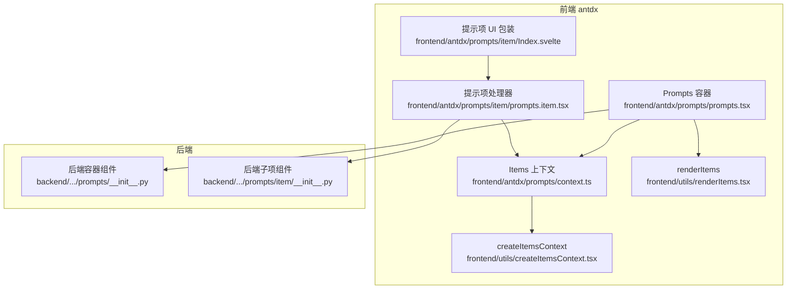
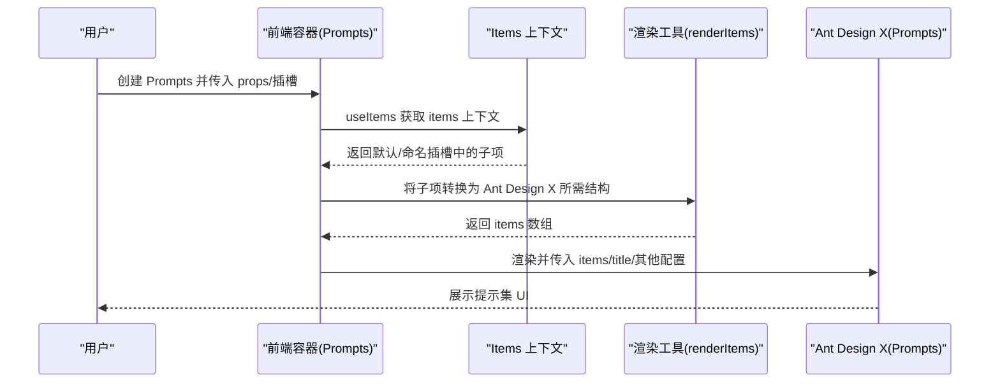
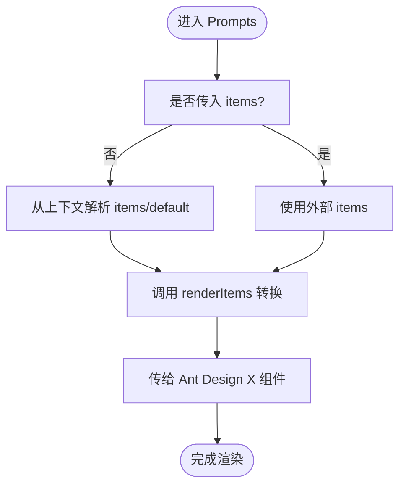
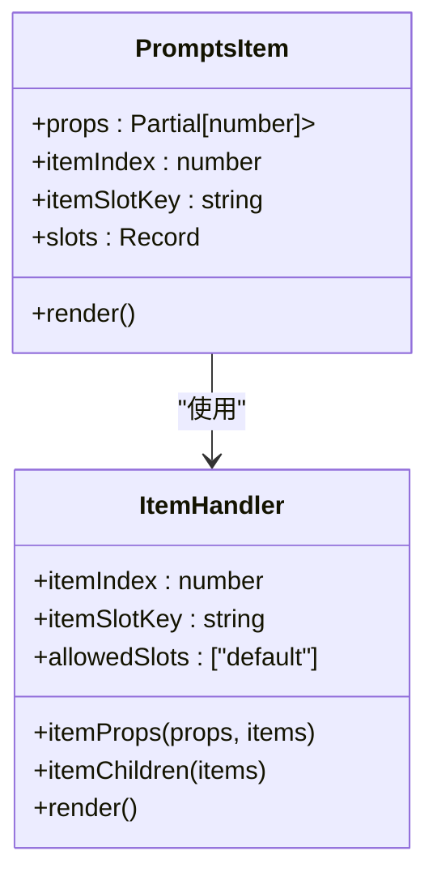
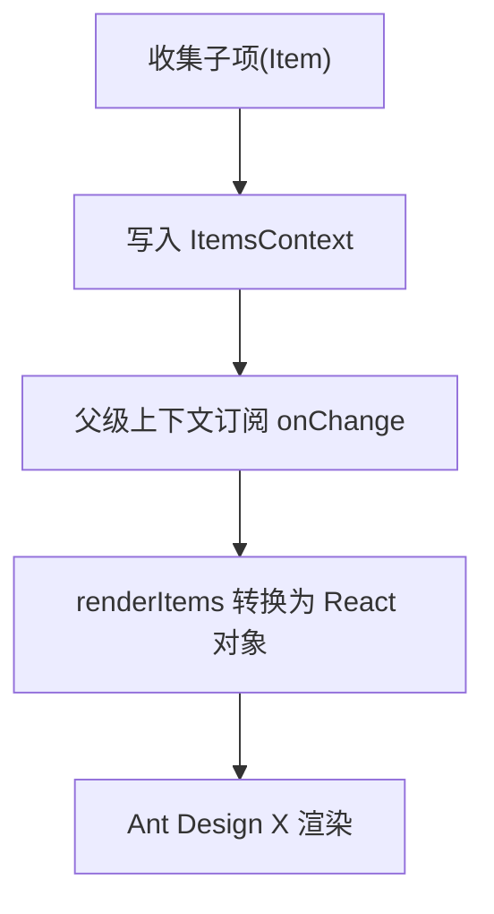
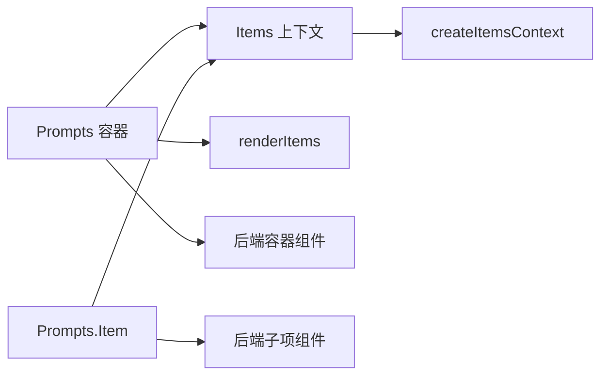

# Prompts 提示集组件

<cite>
**本文引用的文件**
- [frontend/antdx/prompts/prompts.tsx](file://frontend/antdx/prompts/prompts.tsx)
- [frontend/antdx/prompts/context.ts](file://frontend/antdx/prompts/context.ts)
- [frontend/antdx/prompts/item/Index.svelte](file://frontend/antdx/prompts/item/Index.svelte)
- [frontend/antdx/prompts/item/prompts.item.tsx](file://frontend/antdx/prompts/item/prompts.item.tsx)
- [frontend/utils/createItemsContext.tsx](file://frontend/utils/createItemsContext.tsx)
- [frontend/utils/renderItems.tsx](file://frontend/utils/renderItems.tsx)
- [backend/modelscope_studio/components/antdx/prompts/__init__.py](file://backend/modelscope_studio/components/antdx/prompts/__init__.py)
- [backend/modelscope_studio/components/antdx/prompts/item/__init__.py](file://backend/modelscope_studio/components/antdx/prompts/item/__init__.py)
- [docs/components/antdx/prompts/README.md](file://docs/components/antdx/prompts/README.md)
- [docs/components/antdx/prompts/demos/basic.py](file://docs/components/antdx/prompts/demos/basic.py)
- [docs/components/antdx/prompts/demos/nest_usage.py](file://docs/components/antdx/prompts/demos/nest_usage.py)
</cite>

## 目录

1. [简介](#简介)
2. [项目结构](#项目结构)
3. [核心组件](#核心组件)
4. [架构总览](#架构总览)
5. [详细组件分析](#详细组件分析)
6. [依赖关系分析](#依赖关系分析)
7. [性能考量](#性能考量)
8. [故障排查指南](#故障排查指南)
9. [结论](#结论)
10. [附录：使用示例与配置](#附录使用示例与配置)

## 简介

Prompts 提示集组件用于展示一组预设的问题或建议项，帮助用户快速选择输入方向，提升对话引导的自然性与效率。该组件基于 Ant Design X 的 Prompts 实现，并在前端通过 Svelte/React 混合框架进行桥接，支持：

- 提示模板管理：通过插槽（slots）灵活组织标题、图标、标签、描述等子内容
- 预设指令配置：支持垂直布局、换行、样式覆盖、类名等配置
- 嵌套使用：支持在提示项内部再嵌套提示项，形成层级化建议
- 动态内容生成：通过上下文收集子项并渲染为 Ant Design X 所需的数据结构
- 事件处理：提供 item_click 回调，便于在点击提示项时执行业务逻辑

## 项目结构

本组件位于前端 antdx 分类下，采用“容器组件 + 子项处理器”的分层设计：

- 容器组件：负责收集插槽内容、解析上下文、渲染为 Ant Design X 所需的 items 结构
- 子项处理器：负责将每个提示项包装为可被容器识别的结构，并支持嵌套
- 工具函数：提供通用的“项目上下文”与“渲染子项”能力，复用到多个组件中

图表来源

- [frontend/antdx/prompts/prompts.tsx:1-43](file://frontend/antdx/prompts/prompts.tsx#L1-L43)
- [frontend/antdx/prompts/context.ts:1-7](file://frontend/antdx/prompts/context.ts#L1-L7)
- [frontend/antdx/prompts/item/prompts.item.tsx:1-22](file://frontend/antdx/prompts/item/prompts.item.tsx#L1-L22)
- [frontend/antdx/prompts/item/Index.svelte:1-69](file://frontend/antdx/prompts/item/Index.svelte#L1-L69)
- [frontend/utils/createItemsContext.tsx:1-274](file://frontend/utils/createItemsContext.tsx#L1-L274)
- [frontend/utils/renderItems.tsx:1-114](file://frontend/utils/renderItems.tsx#L1-L114)
- [backend/modelscope_studio/components/antdx/prompts/**init**.py:1-88](file://backend/modelscope_studio/components/antdx/prompts/__init__.py#L1-L88)
- [backend/modelscope_studio/components/antdx/prompts/item/**init**.py:1-48](file://backend/modelscope_studio/components/antdx/prompts/item/__init__.py#L1-L48)

章节来源

- [frontend/antdx/prompts/prompts.tsx:1-43](file://frontend/antdx/prompts/prompts.tsx#L1-L43)
- [frontend/antdx/prompts/context.ts:1-7](file://frontend/antdx/prompts/context.ts#L1-L7)
- [frontend/antdx/prompts/item/prompts.item.tsx:1-22](file://frontend/antdx/prompts/item/prompts.item.tsx#L1-L22)
- [frontend/antdx/prompts/item/Index.svelte:1-69](file://frontend/antdx/prompts/item/Index.svelte#L1-L69)
- [frontend/utils/createItemsContext.tsx:1-274](file://frontend/utils/createItemsContext.tsx#L1-L274)
- [frontend/utils/renderItems.tsx:1-114](file://frontend/utils/renderItems.tsx#L1-L114)
- [backend/modelscope_studio/components/antdx/prompts/**init**.py:1-88](file://backend/modelscope_studio/components/antdx/prompts/__init__.py#L1-L88)
- [backend/modelscope_studio/components/antdx/prompts/item/**init**.py:1-48](file://backend/modelscope_studio/components/antdx/prompts/item/__init__.py#L1-L48)

## 核心组件

- 容器组件：Prompts
  - 职责：收集插槽（title、items）与子项，解析上下文，将子项转换为 Ant Design X 所需的 items 数据结构，并渲染
  - 关键点：支持传入 items 外部数据；若未传入，则从上下文解析默认或命名插槽中的子项；title 插槽优先于 props.title
- 子项处理器：Prompts.Item
  - 职责：将每个提示项包装为可被容器识别的结构，支持插槽（label、icon、description）与可见性控制
  - 关键点：仅允许 default 插槽作为子项内容；支持额外属性透传与内部索引、插槽键传递
- 项目上下文：createItemsContext
  - 职责：提供 ItemsContext，统一收集与更新各插槽中的子项，支持嵌套子上下文
  - 关键点：setItem 支持按插槽键与索引更新；onChange 回调通知父级上下文
- 渲染工具：renderItems
  - 职责：将上下文中的 Item 结构渲染为 React 可用的对象树，自动处理插槽、克隆与参数化渲染
  - 关键点：支持 children 键、withParams 参数化渲染、forceClone 强制克隆

章节来源

- [frontend/antdx/prompts/prompts.tsx:13-40](file://frontend/antdx/prompts/prompts.tsx#L13-L40)
- [frontend/antdx/prompts/item/prompts.item.tsx:7-19](file://frontend/antdx/prompts/item/prompts.item.tsx#L7-L19)
- [frontend/antdx/prompts/item/Index.svelte:16-68](file://frontend/antdx/prompts/item/Index.svelte#L16-L68)
- [frontend/utils/createItemsContext.tsx:97-273](file://frontend/utils/createItemsContext.tsx#L97-L273)
- [frontend/utils/renderItems.tsx:8-113](file://frontend/utils/renderItems.tsx#L8-L113)

## 架构总览

Prompts 的运行时架构由“前端容器 + 子项处理器 + 上下文收集 + 渲染工具”构成，后端通过 Gradio 组件桥接到前端。

图表来源

- [frontend/antdx/prompts/prompts.tsx:16-38](file://frontend/antdx/prompts/prompts.tsx#L16-L38)
- [frontend/utils/renderItems.tsx:23-38](file://frontend/utils/renderItems.tsx#L23-L38)
- [frontend/utils/createItemsContext.tsx:108-170](file://frontend/utils/createItemsContext.tsx#L108-L170)

## 详细组件分析

### 容器组件：Prompts

- 插槽与属性
  - 支持插槽：title、items
  - 支持属性：vertical、wrap、styles、class_names、root_class_name、fade_in、fade_in_left 等
- 上下文解析
  - 若外部传入 items 则直接使用；否则从上下文解析 default 或 items 插槽
  - title 插槽优先于 props.title
- 渲染策略
  - 使用 renderItems 将上下文中的 Item 结构转换为 Ant Design X 所需对象数组
  - 对插槽内容进行克隆与参数化处理，确保 React 渲染正确

图表来源

- [frontend/antdx/prompts/prompts.tsx:16-38](file://frontend/antdx/prompts/prompts.tsx#L16-L38)
- [frontend/utils/renderItems.tsx:23-38](file://frontend/utils/renderItems.tsx#L23-L38)

章节来源

- [frontend/antdx/prompts/prompts.tsx:13-40](file://frontend/antdx/prompts/prompts.tsx#L13-L40)
- [backend/modelscope_studio/components/antdx/prompts/**init**.py:28-69](file://backend/modelscope_studio/components/antdx/prompts/__init__.py#L28-L69)

### 子项处理器：Prompts.Item

- 插槽与属性
  - 支持插槽：label、icon、description
  - 支持属性：key、label、description、icon、disabled、visible、elem_id、elem_classes、elem_style 等
- 内部处理
  - 通过 ItemHandler 将子项注册到上下文中，并支持子项的 children 递归渲染
  - 仅允许 default 插槽作为子项内容，避免多级插槽导致的歧义
- 可见性与样式
  - visible 控制是否渲染；elem_id/ elem_classes/ elem_style 支持样式定制

图表来源

- [frontend/antdx/prompts/item/prompts.item.tsx:7-19](file://frontend/antdx/prompts/item/prompts.item.tsx#L7-L19)
- [frontend/antdx/prompts/item/Index.svelte:16-68](file://frontend/antdx/prompts/item/Index.svelte#L16-L68)

章节来源

- [frontend/antdx/prompts/item/prompts.item.tsx:1-22](file://frontend/antdx/prompts/item/prompts.item.tsx#L1-L22)
- [frontend/antdx/prompts/item/Index.svelte:1-69](file://frontend/antdx/prompts/item/Index.svelte#L1-L69)
- [backend/modelscope_studio/components/antdx/prompts/item/**init**.py:18-48](file://backend/modelscope_studio/components/antdx/prompts/item/__init__.py#L18-L48)

### 项目上下文与渲染工具

- createItemsContext
  - 提供 ItemsContextProvider、withItemsContextProvider、useItems、ItemHandler
  - 支持按插槽键与索引更新子项，onChange 回调通知父级上下文
- renderItems
  - 将 Item 结构转换为 React 对象树，自动处理插槽、克隆与参数化渲染
  - 支持 children 键、withParams、forceClone、itemPropsTransformer 等选项

图表来源

- [frontend/utils/createItemsContext.tsx:108-170](file://frontend/utils/createItemsContext.tsx#L108-L170)
- [frontend/utils/renderItems.tsx:23-98](file://frontend/utils/renderItems.tsx#L23-L98)

章节来源

- [frontend/utils/createItemsContext.tsx:97-273](file://frontend/utils/createItemsContext.tsx#L97-L273)
- [frontend/utils/renderItems.tsx:8-113](file://frontend/utils/renderItems.tsx#L8-L113)

### 后端桥接

- AntdXPrompts
  - 支持事件：item_click
  - 支持插槽：title、items
  - 支持属性：items、prefix_cls、title、vertical、wrap、styles、class_names、root_class_name、fade_in、fade_in_left 等
- AntdXPromptsItem
  - 支持插槽：label、icon、description
  - 支持属性：label、key、description、icon、disabled、visible、elem_id、elem_classes、elem_style 等

章节来源

- [backend/modelscope_studio/components/antdx/prompts/**init**.py:18-69](file://backend/modelscope_studio/components/antdx/prompts/__init__.py#L18-L69)
- [backend/modelscope_studio/components/antdx/prompts/item/**init**.py:18-48](file://backend/modelscope_studio/components/antdx/prompts/item/__init__.py#L18-L48)

## 依赖关系分析

- 组件耦合
  - Prompts 依赖 Items 上下文与渲染工具；子项通过 ItemHandler 注册到上下文
  - 后端组件作为前端组件的桥接层，暴露事件与属性
- 外部依赖
  - Ant Design X 的 Prompts 组件用于实际渲染
  - Svelte/React 混合工具链用于桥接与插槽渲染

图表来源

- [frontend/antdx/prompts/prompts.tsx:13-40](file://frontend/antdx/prompts/prompts.tsx#L13-L40)
- [frontend/antdx/prompts/item/prompts.item.tsx:7-19](file://frontend/antdx/prompts/item/prompts.item.tsx#L7-L19)
- [frontend/utils/createItemsContext.tsx:97-273](file://frontend/utils/createItemsContext.tsx#L97-L273)
- [frontend/utils/renderItems.tsx:8-113](file://frontend/utils/renderItems.tsx#L8-L113)
- [backend/modelscope_studio/components/antdx/prompts/**init**.py:11-69](file://backend/modelscope_studio/components/antdx/prompts/__init__.py#L11-L69)
- [backend/modelscope_studio/components/antdx/prompts/item/**init**.py:8-48](file://backend/modelscope_studio/components/antdx/prompts/item/__init__.py#L8-L48)

章节来源

- [frontend/antdx/prompts/prompts.tsx:13-40](file://frontend/antdx/prompts/prompts.tsx#L13-L40)
- [frontend/antdx/prompts/item/prompts.item.tsx:7-19](file://frontend/antdx/prompts/item/prompts.item.tsx#L7-L19)
- [frontend/utils/createItemsContext.tsx:97-273](file://frontend/utils/createItemsContext.tsx#L97-L273)
- [frontend/utils/renderItems.tsx:8-113](file://frontend/utils/renderItems.tsx#L8-L113)
- [backend/modelscope_studio/components/antdx/prompts/**init**.py:11-69](file://backend/modelscope_studio/components/antdx/prompts/__init__.py#L11-L69)
- [backend/modelscope_studio/components/antdx/prompts/item/**init**.py:8-48](file://backend/modelscope_studio/components/antdx/prompts/item/__init__.py#L8-L48)

## 性能考量

- 渲染优化
  - 使用 useMemo 缓存 items 计算结果，避免不必要的重渲染
  - renderItems 默认启用克隆（clone: true），确保 React 渲染安全与状态隔离
- 上下文更新
  - setItem 仅在值变化时触发更新，减少无效渲染
  - onChange 回调在 items 更新时触发，便于外部监听
- 嵌套渲染
  - 子项 children 递归渲染时，按索引生成稳定 key，避免列表重排

章节来源

- [frontend/antdx/prompts/prompts.tsx:27-34](file://frontend/antdx/prompts/prompts.tsx#L27-L34)
- [frontend/utils/renderItems.tsx:30-38](file://frontend/utils/renderItems.tsx#L30-L38)
- [frontend/utils/createItemsContext.tsx:124-153](file://frontend/utils/createItemsContext.tsx#L124-L153)

## 故障排查指南

- 问题：提示项不显示
  - 检查 visible 是否为 true
  - 检查插槽名称是否正确（label、icon、description）
- 问题：嵌套提示项无效
  - 确保子项使用 default 插槽作为内容
  - 确认子项未使用非法插槽键
- 问题：点击无响应
  - 确认已绑定 item_click 事件
  - 检查后端事件映射是否生效
- 问题：样式未生效
  - 检查 elem_id、elem_classes、elem_style 是否正确传入
  - 检查 styles、class_names 是否覆盖了目标样式

章节来源

- [frontend/antdx/prompts/item/Index.svelte:53-68](file://frontend/antdx/prompts/item/Index.svelte#L53-L68)
- [frontend/antdx/prompts/item/prompts.item.tsx:11-18](file://frontend/antdx/prompts/item/prompts.item.tsx#L11-L18)
- [backend/modelscope_studio/components/antdx/prompts/**init**.py:18-23](file://backend/modelscope_studio/components/antdx/prompts/__init__.py#L18-L23)

## 结论

Prompts 提示集组件通过“容器 + 子项处理器 + 上下文 + 渲染工具”的架构，实现了对 Ant Design X 的无缝桥接与扩展。它不仅支持基础提示集创建与样式定制，还提供了强大的嵌套能力与事件处理接口，能够有效提升用户的对话引导体验。配合后端事件桥接，开发者可以轻松实现从点击提示项到业务逻辑的完整闭环。

## 附录：使用示例与配置

### 基础提示集创建

- 示例路径：[docs/components/antdx/prompts/demos/basic.py:24-72](file://docs/components/antdx/prompts/demos/basic.py#L24-L72)
- 关键点
  - 使用 XProvider 包裹
  - 设置 title、vertical、wrap 等属性
  - 在每个提示项中使用插槽（icon、label、description）

章节来源

- [docs/components/antdx/prompts/demos/basic.py:24-72](file://docs/components/antdx/prompts/demos/basic.py#L24-L72)

### 嵌套使用场景

- 示例路径：[docs/components/antdx/prompts/demos/nest_usage.py:16-83](file://docs/components/antdx/prompts/demos/nest_usage.py#L16-L83)
- 关键点
  - 在提示项内部继续使用提示项，形成层级化建议
  - 使用 styles 与 class_names 进行样式定制
  - 通过 item_click 获取点击事件并处理

章节来源

- [docs/components/antdx/prompts/demos/nest_usage.py:16-83](file://docs/components/antdx/prompts/demos/nest_usage.py#L16-L83)

### 组件配置选项（前端容器）

- 属性
  - items：外部传入的提示项数组
  - title：标题文本或插槽
  - vertical：是否垂直排列
  - wrap：是否换行
  - styles：样式覆盖
  - class_names：类名映射
  - root_class_name：根类名
  - fade_in/fade_in_left：入场动画
- 插槽
  - title：自定义标题
  - items：自定义提示项集合

章节来源

- [frontend/antdx/prompts/prompts.tsx:24-34](file://frontend/antdx/prompts/prompts.tsx#L24-L34)
- [backend/modelscope_studio/components/antdx/prompts/**init**.py:28-69](file://backend/modelscope_studio/components/antdx/prompts/__init__.py#L28-L69)

### 事件处理

- item_click：当某提示项被点击时触发
- 示例绑定：[docs/components/antdx/prompts/demos/basic.py:72](file://docs/components/antdx/prompts/demos/basic.py#L72)、[docs/components/antdx/prompts/demos/nest_usage.py:83](file://docs/components/antdx/prompts/demos/nest_usage.py#L83)

章节来源

- [backend/modelscope_studio/components/antdx/prompts/**init**.py:18-23](file://backend/modelscope_studio/components/antdx/prompts/__init__.py#L18-L23)
- [docs/components/antdx/prompts/demos/basic.py:72](file://docs/components/antdx/prompts/demos/basic.py#L72)
- [docs/components/antdx/prompts/demos/nest_usage.py:83](file://docs/components/antdx/prompts/demos/nest_usage.py#L83)

### 样式定制

- 可通过 elem_id、elem_classes、elem_style 对单个提示项进行样式定制
- 可通过 styles、class_names、root_class_name 对整体布局与主题进行定制
- 示例参考：[docs/components/antdx/prompts/demos/nest_usage.py:19-29](file://docs/components/antdx/prompts/demos/nest_usage.py#L19-L29)

章节来源

- [frontend/antdx/prompts/item/Index.svelte:56-58](file://frontend/antdx/prompts/item/Index.svelte#L56-L58)
- [backend/modelscope_studio/components/antdx/prompts/item/**init**.py:30-35](file://backend/modelscope_studio/components/antdx/prompts/item/__init__.py#L30-L35)
- [backend/modelscope_studio/components/antdx/prompts/**init**.py:38-69](file://backend/modelscope_studio/components/antdx/prompts/__init__.py#L38-L69)
