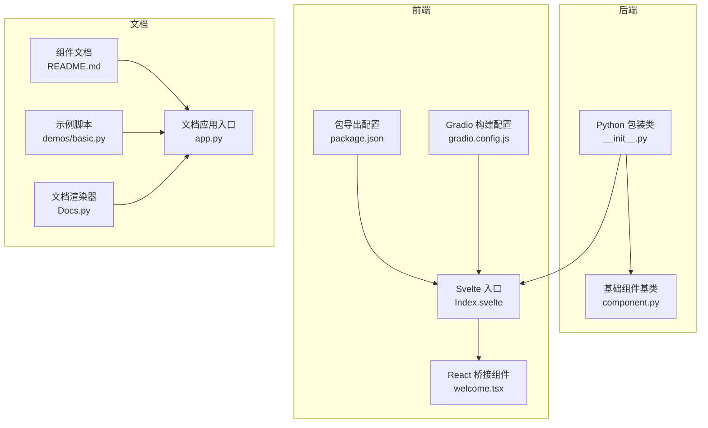
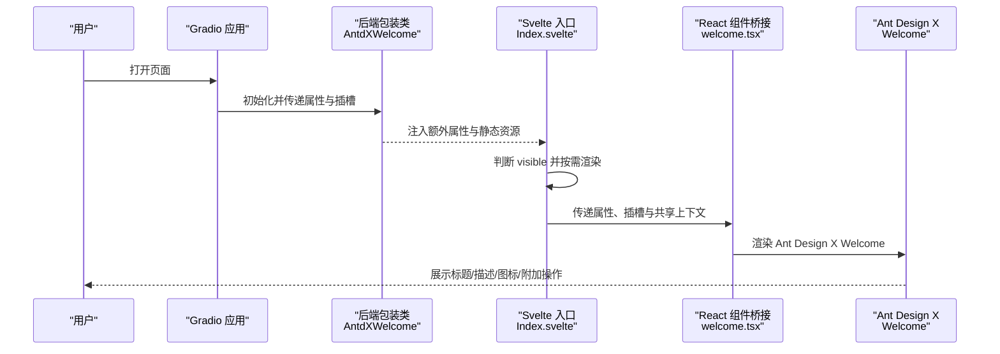
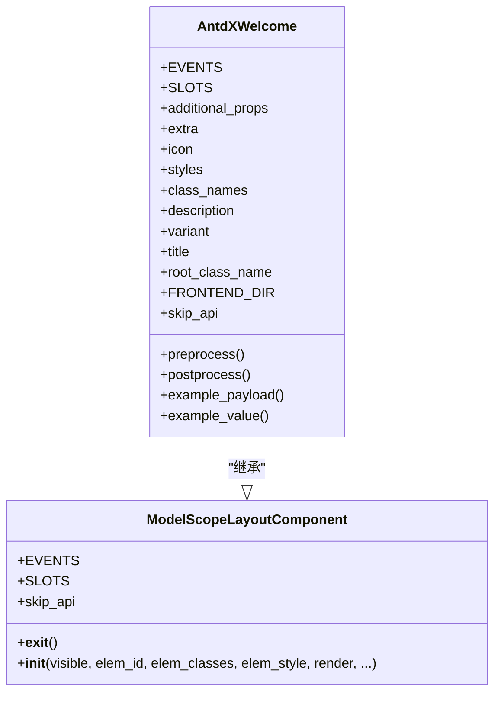
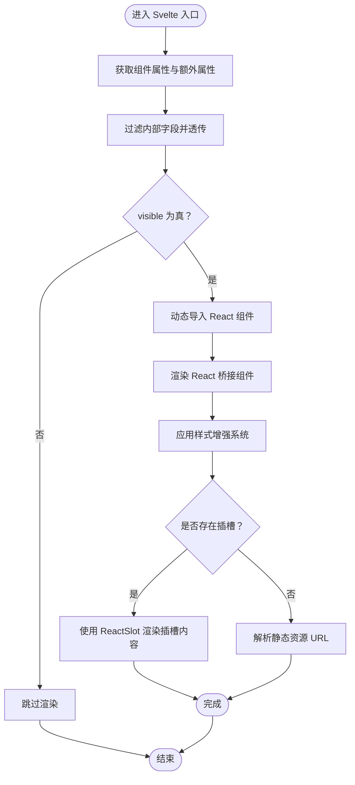
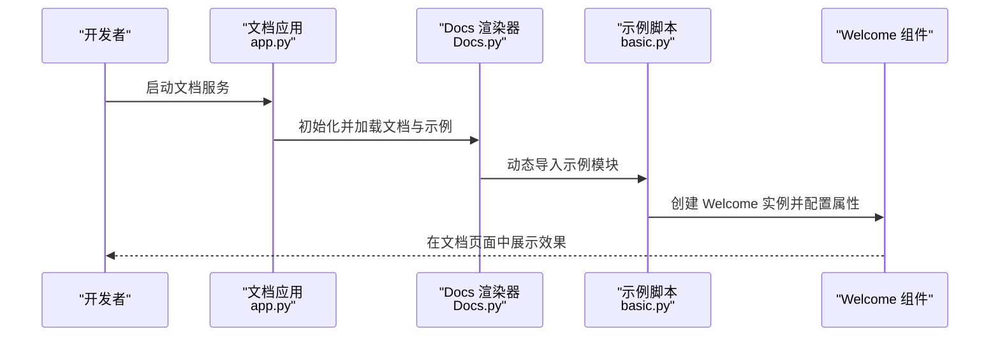
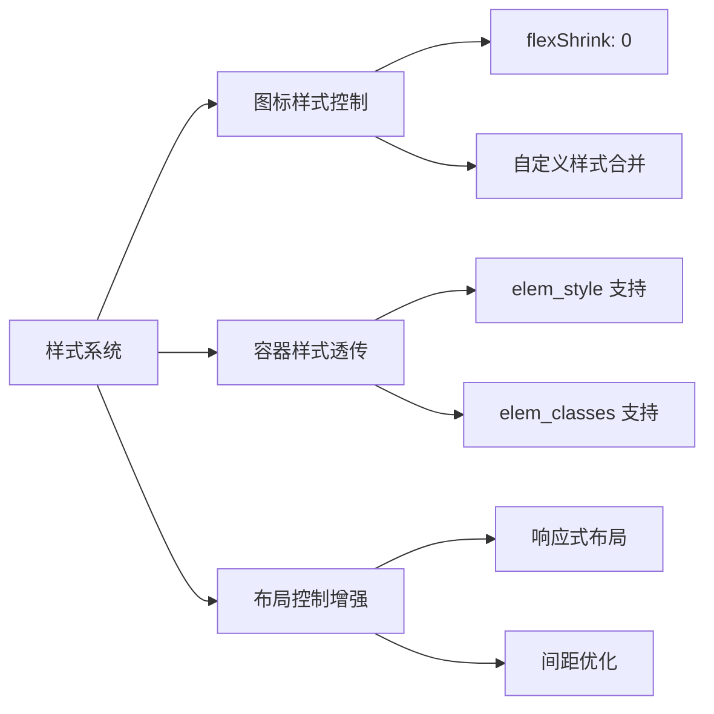
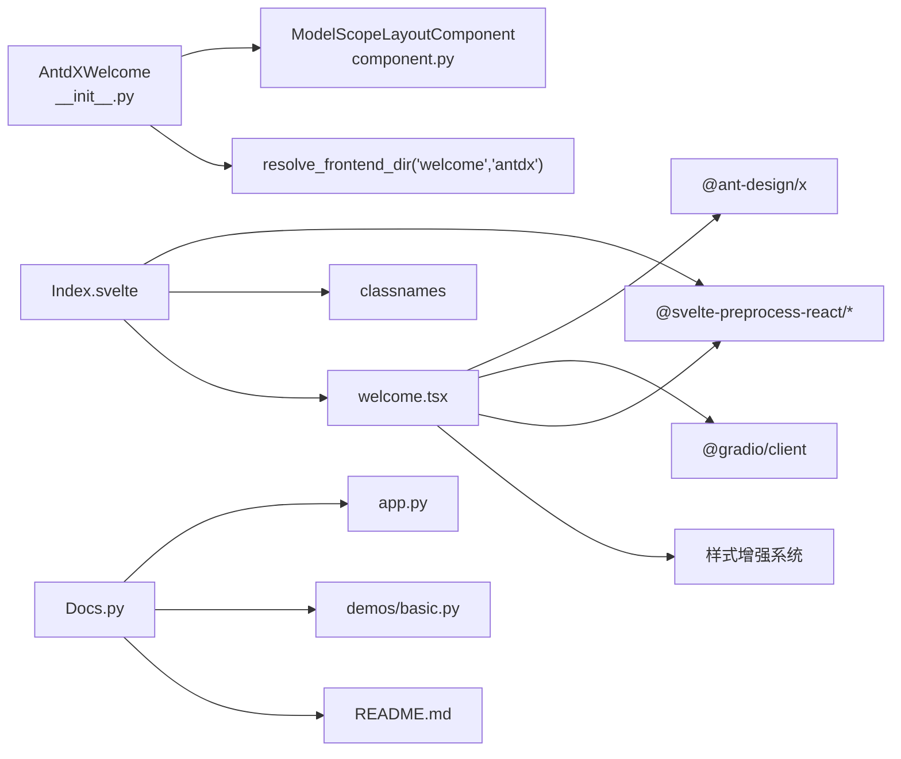

# Welcome 欢迎组件

<cite>
**本文引用的文件**
- [frontend/antdx/welcome/Index.svelte](file://frontend/antdx/welcome/Index.svelte)
- [frontend/antdx/welcome/welcome.tsx](file://frontend/antdx/welcome/welcome.tsx)
- [backend/modelscope_studio/components/antdx/welcome/__init__.py](file://backend/modelscope_studio/components/antdx/welcome/__init__.py)
- [docs/components/antdx/welcome/README.md](file://docs/components/antdx/welcome/README.md)
- [docs/components/antdx/welcome/demos/basic.py](file://docs/components/antdx/welcome/demos/basic.py)
- [frontend/antdx/welcome/package.json](file://frontend/antdx/welcome/package.json)
- [frontend/antdx/welcome/gradio.config.js](file://frontend/antdx/welcome/gradio.config.js)
- [docs/components/antdx/welcome/app.py](file://docs/components/antdx/welcome/app.py)
- [docs/helper/Docs.py](file://docs/helper/Docs.py)
- [backend/modelscope_studio/utils/dev/component.py](file://backend/modelscope_studio/utils/dev/component.py)
</cite>

## 更新摘要

**所做更改**

- 增强了样式支持系统，提供了更好的布局控制能力
- 新增了图标区域的 flexShrink 控制，优化了响应式布局表现
- 改进了样式合并机制，支持更精细的样式定制

## 目录

1. [简介](#简介)
2. [项目结构](#项目结构)
3. [核心组件](#核心组件)
4. [架构总览](#架构总览)
5. [详细组件分析](#详细组件分析)
6. [样式增强特性](#样式增强特性)
7. [依赖关系分析](#依赖关系分析)
8. [性能考量](#性能考量)
9. [故障排查指南](#故障排查指南)
10. [结论](#结论)
11. [附录](#附录)

## 简介

Welcome 欢迎组件用于在界面中清晰传达目标意图与预期功能，面向"智能体产品界面方案"的场景。该组件基于 Ant Design X 的 Welcome 实现，通过 Python 后端包装与 Svelte 前端桥接，提供可插槽（slot）扩展、图标与文案自定义、变体样式控制等能力，并支持在 Gradio 应用中作为布局元素使用。

**更新** 本次更新增强了样式支持系统，提供了更好的布局控制能力和响应式设计优化。

## 项目结构

Welcome 组件由后端 Python 包装类与前端 Svelte/React 桥接层组成，文档系统通过 Docs 助手渲染示例与说明。

**图表来源**

- [backend/modelscope_studio/components/antdx/welcome/**init**.py:1-73](file://backend/modelscope_studio/components/antdx/welcome/__init__.py#L1-L73)
- [backend/modelscope_studio/utils/dev/component.py:11-50](file://backend/modelscope_studio/utils/dev/component.py#L11-L50)
- [frontend/antdx/welcome/Index.svelte:1-65](file://frontend/antdx/welcome/Index.svelte#L1-L65)
- [frontend/antdx/welcome/welcome.tsx:1-51](file://frontend/antdx/welcome/welcome.tsx#L1-L51)
- [frontend/antdx/welcome/package.json:1-15](file://frontend/antdx/welcome/package.json#L1-L15)
- [frontend/antdx/welcome/gradio.config.js:1-4](file://frontend/antdx/welcome/gradio.config.js#L1-L4)
- [docs/components/antdx/welcome/README.md:1-8](file://docs/components/antdx/welcome/README.md#L1-L8)
- [docs/components/antdx/welcome/demos/basic.py:1-37](file://docs/components/antdx/welcome/demos/basic.py#L1-L37)
- [docs/components/antdx/welcome/app.py:1-7](file://docs/components/antdx/welcome/app.py#L1-L7)
- [docs/helper/Docs.py:1-178](file://docs/helper/Docs.py#L1-L178)

## 核心组件

- 后端包装类：负责声明支持的插槽、属性、样式与渲染生命周期，同时将静态资源路径转换为可访问的 URL。
- 前端桥接层：将 Ant Design X 的 React 组件以 Svelte 方式封装，支持 slot 渲染与静态资源 URL 解析。
- 文档与示例：提供最小可用示例与文档页面，便于快速上手。

关键职责与行为

- 插槽支持：title、description、icon、extra。
- 属性配置：icon、title、description、variant（filled/borderless）、样式与类名注入、可见性与 DOM 属性透传。
- 资源处理：对后端传入的图标路径进行解析，确保在 Gradio 环境下可正确加载。
- 渲染策略：根据 visible 控制是否渲染；在 Gradio 上下文中注入共享的 rootUrl 与 apiPrefix。

**章节来源**

- [backend/modelscope_studio/components/antdx/welcome/**init**.py:14-55](file://backend/modelscope_studio/components/antdx/welcome/__init__.py#L14-L55)
- [frontend/antdx/welcome/welcome.tsx:8-41](file://frontend/antdx/welcome/welcome.tsx#L8-L41)
- [frontend/antdx/welcome/Index.svelte:12-44](file://frontend/antdx/welcome/Index.svelte#L12-L44)

## 架构总览

Welcome 组件采用"后端组件 + 前端桥接 + 文档示例"的分层设计。后端负责组件语义与资源处理，前端负责 UI 渲染与插槽对接，文档系统负责示例与说明的统一呈现。

**图表来源**

- [backend/modelscope_studio/components/antdx/welcome/**init**.py:37-55](file://backend/modelscope_studio/components/antdx/welcome/__init__.py#L37-L55)
- [frontend/antdx/welcome/Index.svelte:49-64](file://frontend/antdx/welcome/Index.svelte#L49-L64)
- [frontend/antdx/welcome/welcome.tsx:16-41](file://frontend/antdx/welcome/welcome.tsx#L16-L41)

## 详细组件分析

### 后端包装类（Python）

- 支持的插槽：extra、icon、description、title。
- 关键属性：
  - 图标：icon（支持本地静态文件路径，经后端转换为可访问 URL）。
  - 标题与描述：title、description。
  - 变体：variant（filled 或 borderless）。
  - 样式与类名：styles、class_names、elem_id、elem_classes、elem_style。
  - 渲染控制：visible、render、as_item。
- 生命周期：
  - preprocess/postprocess/example_payload/example_value 等占位实现，skip_api 返回 True，表明该组件不参与标准 API 流程。
- 前端目录定位：通过 resolve_frontend_dir("welcome", type="antdx") 指向前端实现。

**图表来源**

- [backend/modelscope_studio/utils/dev/component.py:11-50](file://backend/modelscope_studio/utils/dev/component.py#L11-L50)
- [backend/modelscope_studio/components/antdx/welcome/**init**.py:8-73](file://backend/modelscope_studio/components/antdx/welcome/__init__.py#L8-L73)

**章节来源**

- [backend/modelscope_studio/components/antdx/welcome/**init**.py:14-55](file://backend/modelscope_studio/components/antdx/welcome/__init__.py#L14-L55)
- [backend/modelscope_studio/utils/dev/component.py:11-50](file://backend/modelscope_studio/utils/dev/component.py#L11-L50)

### 前端桥接层（Svelte + React）

- Svelte 入口负责：
  - 获取组件属性与额外属性，过滤掉内部保留字段（如 visible、\_internal），并将剩余属性透传给 React 组件。
  - 使用条件渲染仅在 visible 为真时加载并渲染 React 组件。
  - 将 Gradio 共享的 rootUrl 与 apiPrefix 传递给 React 组件，以便解析静态资源。
- React 桥接负责：
  - 将 Ant Design X 的 Welcome 组件以 sveltify 包裹，支持 slot 渲染。
  - 对 icon 进行优先级处理：若存在 slot 则渲染 slot 内容，否则解析静态资源 URL。
  - 对 title、description、extra 同样支持 slot 与字符串值的双模式。
  - **新增**：增强样式支持系统，提供更好的布局控制能力。

**图表来源**

- [frontend/antdx/welcome/Index.svelte:22-44](file://frontend/antdx/welcome/Index.svelte#L22-L44)
- [frontend/antdx/welcome/welcome.tsx:16-41](file://frontend/antdx/welcome/welcome.tsx#L16-L41)

**章节来源**

- [frontend/antdx/welcome/Index.svelte:12-44](file://frontend/antdx/welcome/Index.svelte#L12-L44)
- [frontend/antdx/welcome/welcome.tsx:8-41](file://frontend/antdx/welcome/welcome.tsx#L8-L41)

### 文档与示例（Docs 系统）

- 文档应用通过 Docs 类扫描 README 与 demos 目录，自动渲染示例代码与运行结果。
- 示例脚本演示了两种变体（默认与 borderless），并通过插槽注入额外操作按钮。

**图表来源**

- [docs/components/antdx/welcome/app.py:1-7](file://docs/components/antdx/welcome/app.py#L1-L7)
- [docs/helper/Docs.py:58-75](file://docs/helper/Docs.py#L58-L75)
- [docs/components/antdx/welcome/demos/basic.py:6-36](file://docs/components/antdx/welcome/demos/basic.py#L6-L36)

**章节来源**

- [docs/components/antdx/welcome/README.md:1-8](file://docs/components/antdx/welcome/README.md#L1-L8)
- [docs/components/antdx/welcome/demos/basic.py:1-37](file://docs/components/antdx/welcome/demos/basic.py#L1-L37)
- [docs/components/antdx/welcome/app.py:1-7](file://docs/components/antdx/welcome/app.py#L1-L7)
- [docs/helper/Docs.py:58-75](file://docs/helper/Docs.py#L58-L75)

## 样式增强特性

### 增强的样式支持系统

Welcome 组件现已提供更强大的样式支持和布局控制能力，主要体现在以下几个方面：

#### 图标区域布局优化

- **flexShrink 控制**：为图标区域设置了 `flexShrink: 0`，确保图标在响应式布局中保持固定尺寸
- **样式合并机制**：支持用户自定义样式与默认样式的智能合并
- **响应式适配**：优化了不同屏幕尺寸下的布局表现

#### 样式定制能力

- **styles 参数支持**：完全支持 Ant Design X 的 styles 参数传递
- **icon 样式独立控制**：允许对图标区域进行单独的样式定制
- **主题一致性**：保持与 Ant Design X 主题系统的兼容性

#### 布局控制增强

- **容器样式透传**：支持通过 elem_style 和 elem_classes 进行容器级别的样式控制
- **Flexbox 优化**：利用 Flexbox 布局提供更好的内容排列效果
- **间距控制**：优化了图标、标题、描述之间的间距表现

**图表来源**

- [frontend/antdx/welcome/welcome.tsx:23-29](file://frontend/antdx/welcome/welcome.tsx#L23-L29)
- [frontend/antdx/welcome/Index.svelte:52-53](file://frontend/antdx/welcome/Index.svelte#L52-L53)

**章节来源**

- [frontend/antdx/welcome/welcome.tsx:23-29](file://frontend/antdx/welcome/welcome.tsx#L23-L29)
- [frontend/antdx/welcome/Index.svelte:52-53](file://frontend/antdx/welcome/Index.svelte#L52-L53)

## 依赖关系分析

- 后端依赖：
  - 基础组件基类：提供通用的布局组件能力与上下文管理。
  - 前端目录解析：通过 resolve_frontend_dir 定位到前端实现。
- 前端依赖：
  - Ant Design X 的 React 组件库。
  - Gradio 客户端工具：用于静态资源 URL 解析。
  - Svelte 预处理工具链：实现 React 组件与 Svelte 的桥接。
  - **新增**：样式系统增强依赖，提供更好的布局控制能力。
- 文档系统依赖：
  - Docs 渲染器负责扫描与渲染 README 与 demos。

**图表来源**

- [backend/modelscope_studio/components/antdx/welcome/**init**.py:55-55](file://backend/modelscope_studio/components/antdx/welcome/__init__.py#L55-L55)
- [backend/modelscope_studio/utils/dev/component.py:11-50](file://backend/modelscope_studio/utils/dev/component.py#L11-L50)
- [frontend/antdx/welcome/Index.svelte:1-10](file://frontend/antdx/welcome/Index.svelte#L1-L10)
- [frontend/antdx/welcome/welcome.tsx:1-7](file://frontend/antdx/welcome/welcome.tsx#L1-L7)
- [docs/helper/Docs.py:58-75](file://docs/helper/Docs.py#L58-L75)
- [docs/components/antdx/welcome/demos/basic.py:1-5](file://docs/components/antdx/welcome/demos/basic.py#L1-L5)

**章节来源**

- [backend/modelscope_studio/components/antdx/welcome/**init**.py:55-55](file://backend/modelscope_studio/components/antdx/welcome/__init__.py#L55-L55)
- [frontend/antdx/welcome/Index.svelte:1-10](file://frontend/antdx/welcome/Index.svelte#L1-L10)
- [frontend/antdx/welcome/welcome.tsx:1-7](file://frontend/antdx/welcome/welcome.tsx#L1-L7)
- [docs/helper/Docs.py:58-75](file://docs/helper/Docs.py#L58-L75)

## 性能考量

- 条件渲染：仅当 visible 为真时才加载并渲染 React 组件，避免不必要的初始化与网络请求。
- 动态导入：通过异步导入 React 组件，减少首屏负载。
- 资源解析：在前端统一解析静态资源 URL，避免重复计算与跨域问题。
- 插槽渲染：优先使用 slot 内容，减少字符串拼接与模板渲染成本。
- **新增**：样式增强系统采用高效的样式合并算法，避免重复渲染和样式冲突。

## 故障排查指南

- 图标无法显示
  - 检查后端传入的 icon 是否为有效路径或 URL。
  - 确认 Gradio 共享的 rootUrl 与 apiPrefix 已正确传递至前端。
- 插槽未生效
  - 确认插槽名称是否为 title、description、icon、extra。
  - 确保插槽内容在运行时已正确挂载。
- 组件未渲染
  - 检查 visible 是否为真。
  - 确认 FRONTEND_DIR 指向的前端实现存在且可被构建。
- 文档示例无法运行
  - 检查 demos/basic.py 中的组件嵌套与 Provider 使用是否正确。
  - 确认文档应用入口与 Docs 渲染器配置无误。
- **新增**：样式显示异常
  - 检查 styles 参数格式是否正确。
  - 确认样式合并逻辑不会导致冲突。
  - 验证 flexShrink 属性是否影响了布局表现。

**章节来源**

- [frontend/antdx/welcome/Index.svelte:49-64](file://frontend/antdx/welcome/Index.svelte#L49-L64)
- [frontend/antdx/welcome/welcome.tsx:16-41](file://frontend/antdx/welcome/welcome.tsx#L16-L41)
- [docs/components/antdx/welcome/demos/basic.py:6-36](file://docs/components/antdx/welcome/demos/basic.py#L6-L36)
- [docs/helper/Docs.py:58-75](file://docs/helper/Docs.py#L58-L75)

## 结论

Welcome 欢迎组件通过后端与前端的协同，提供了简洁而强大的欢迎页展示能力。其插槽化设计与资源解析机制，使得在不同场景下都能灵活地进行个性化定制与集成。配合文档系统的示例与渲染能力，开发者可以快速理解并使用该组件。

**更新** 本次样式增强进一步提升了组件的布局控制能力和响应式设计表现，为开发者提供了更精细的样式定制选项和更好的用户体验。

## 附录

### 使用示例（概述）

- 创建一个基础欢迎页，设置图标、标题与描述。
- 使用 borderless 变体以适配更轻量的界面风格。
- 通过插槽注入额外操作按钮，增强用户引导。
- **新增**：利用增强的样式系统进行更精细的布局控制。

参考示例脚本路径

- [docs/components/antdx/welcome/demos/basic.py:6-36](file://docs/components/antdx/welcome/demos/basic.py#L6-L36)

**章节来源**

- [docs/components/antdx/welcome/demos/basic.py:1-37](file://docs/components/antdx/welcome/demos/basic.py#L1-L37)

### 属性与事件清单（概述）

- 支持插槽：extra、icon、description、title。
- 关键属性：icon、title、description、variant（filled/borderless）、样式与类名、可见性与 DOM 属性。
- 事件：当前版本未定义事件。
- 生命周期：skip_api 为真，不参与标准 API 流程。
- **新增**：样式增强支持，提供更丰富的布局控制选项。

**章节来源**

- [backend/modelscope_studio/components/antdx/welcome/**init**.py:12-15](file://backend/modelscope_studio/components/antdx/welcome/__init__.py#L12-L15)
- [backend/modelscope_studio/components/antdx/welcome/**init**.py:31-37](file://backend/modelscope_studio/components/antdx/welcome/__init__.py#L31-L37)
