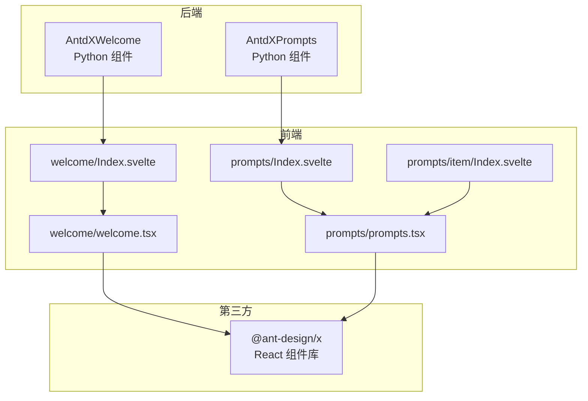
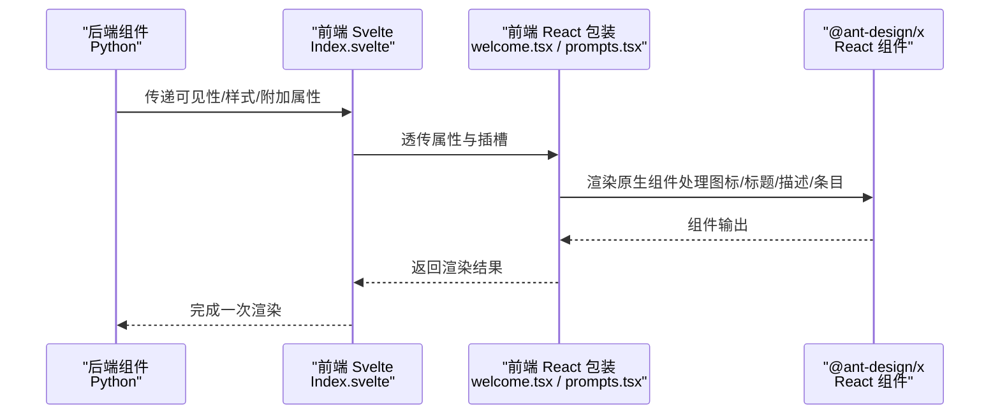
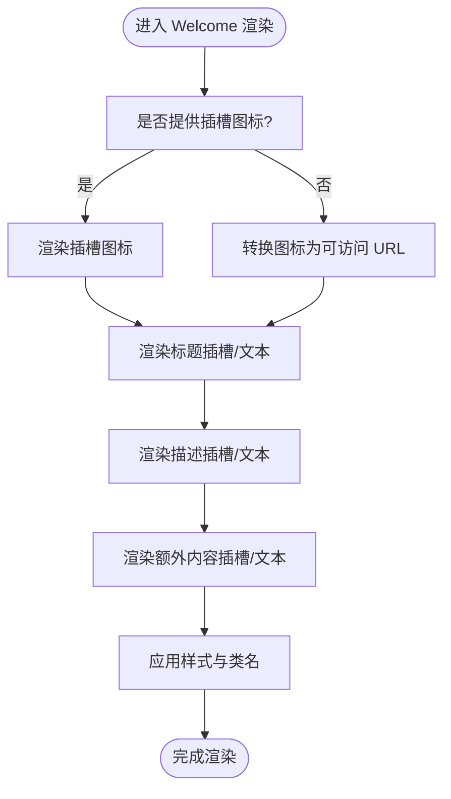
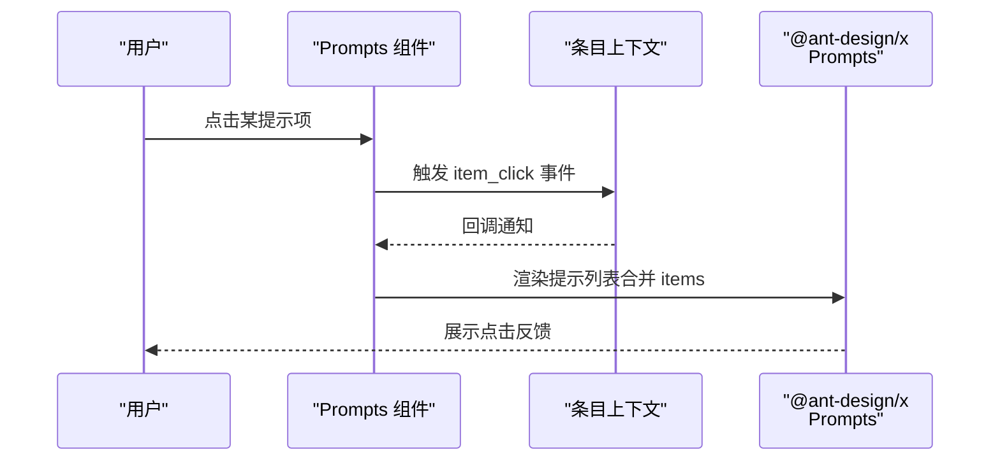
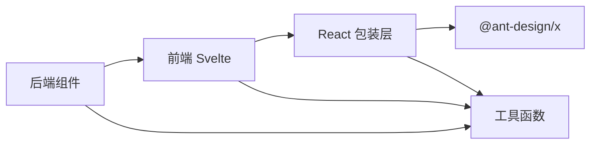

# 唤醒组件

<cite>
**本文引用的文件**
- [backend/modelscope_studio/components/antdx/welcome/__init__.py](file://backend/modelscope_studio/components/antdx/welcome/__init__.py)
- [frontend/antdx/welcome/Index.svelte](file://frontend/antdx/welcome/Index.svelte)
- [frontend/antdx/welcome/welcome.tsx](file://frontend/antdx/welcome/welcome.tsx)
- [backend/modelscope_studio/components/antdx/prompts/__init__.py](file://backend/modelscope_studio/components/antdx/prompts/__init__.py)
- [frontend/antdx/prompts/Index.svelte](file://frontend/antdx/prompts/Index.svelte)
- [frontend/antdx/prompts/prompts.tsx](file://frontend/antdx/prompts/prompts.tsx)
- [frontend/antdx/prompts/item/Index.svelte](file://frontend/antdx/prompts/item/Index.svelte)
- [frontend/antdx/prompts/item/prompts.item.tsx](file://frontend/antdx/prompts/item/prompts.item.tsx)
- [frontend/pro/chatbot/chatbot.tsx](file://frontend/pro/chatbot/chatbot.tsx)
- [docs/layout_templates/chatbot/demos/fine_grained_control.py](file://docs/layout_templates/chatbot/demos/fine_grained_control.py)
</cite>

## 目录

1. [简介](#简介)
2. [项目结构](#项目结构)
3. [核心组件](#核心组件)
4. [架构总览](#架构总览)
5. [详细组件分析](#详细组件分析)
6. [依赖关系分析](#依赖关系分析)
7. [性能考量](#性能考量)
8. [故障排查指南](#故障排查指南)
9. [结论](#结论)
10. [附录](#附录)

## 简介

本文件面向 Ant Design X 唤醒组件，系统性说明 Welcome 欢迎组件与 Prompts 提示集组件的设计与用法，帮助开发者快速构建高质量的初始用户体验：Welcome 负责欢迎页的展示与个性化；Prompts 负责提示模板的组织、预设指令与智能推荐的承载。文档包含组件职责、数据流、交互逻辑、可扩展点以及完整使用示例，便于在实际项目中落地。

## 项目结构

Ant Design X 唤醒组件由后端 Python 组件与前端 Svelte/React 层协同实现：

- 后端组件负责参数解析、静态资源处理、事件绑定与渲染开关
- 前端 Svelte 层负责属性透传、插槽解析与异步加载 React 组件
- React 层直接对接 @ant-design/x 的原生组件，完成最终渲染

图表来源

- [backend/modelscope_studio/components/antdx/welcome/**init**.py:8-55](file://backend/modelscope_studio/components/antdx/welcome/__init__.py#L8-L55)
- [backend/modelscope_studio/components/antdx/prompts/**init**.py:11-70](file://backend/modelscope_studio/components/antdx/prompts/__init__.py#L11-L70)
- [frontend/antdx/welcome/Index.svelte:1-65](file://frontend/antdx/welcome/Index.svelte#L1-L65)
- [frontend/antdx/prompts/Index.svelte:1-70](file://frontend/antdx/prompts/Index.svelte#L1-L70)
- [frontend/antdx/welcome/welcome.tsx:1-44](file://frontend/antdx/welcome/welcome.tsx#L1-L44)
- [frontend/antdx/prompts/prompts.tsx:1-43](file://frontend/antdx/prompts/prompts.tsx#L1-L43)
- [frontend/antdx/prompts/item/Index.svelte:1-68](file://frontend/antdx/prompts/item/Index.svelte#L1-L68)

章节来源

- [backend/modelscope_studio/components/antdx/welcome/**init**.py:8-73](file://backend/modelscope_studio/components/antdx/welcome/__init__.py#L8-L73)
- [backend/modelscope_studio/components/antdx/prompts/**init**.py:11-88](file://backend/modelscope_studio/components/antdx/prompts/__init__.py#L11-L88)
- [frontend/antdx/welcome/Index.svelte:1-65](file://frontend/antdx/welcome/Index.svelte#L1-L65)
- [frontend/antdx/prompts/Index.svelte:1-70](file://frontend/antdx/prompts/Index.svelte#L1-L70)

## 核心组件

- Welcome 欢迎组件：用于首屏欢迎页展示，支持标题、描述、图标与额外内容的插槽化定制，并可设置样式与变体
- Prompts 提示集组件：用于展示一组提示模板，支持标题插槽、条目插槽、垂直布局、渐入动画、换行等配置，并提供点击回调事件

章节来源

- [backend/modelscope_studio/components/antdx/welcome/**init**.py:8-55](file://backend/modelscope_studio/components/antdx/welcome/__init__.py#L8-L55)
- [backend/modelscope_studio/components/antdx/prompts/**init**.py:11-70](file://backend/modelscope_studio/components/antdx/prompts/__init__.py#L11-L70)

## 架构总览

下图展示了从后端到前端再到第三方组件库的数据与控制流：

图表来源

- [frontend/antdx/welcome/Index.svelte:49-64](file://frontend/antdx/welcome/Index.svelte#L49-L64)
- [frontend/antdx/welcome/welcome.tsx:16-41](file://frontend/antdx/welcome/welcome.tsx#L16-L41)
- [frontend/antdx/prompts/Index.svelte:56-69](file://frontend/antdx/prompts/Index.svelte#L56-L69)
- [frontend/antdx/prompts/prompts.tsx:13-40](file://frontend/antdx/prompts/prompts.tsx#L13-L40)

## 详细组件分析

### Welcome 欢迎组件

- 组件职责
  - 展示欢迎页，支持标题、描述、图标与额外内容的插槽化定制
  - 支持样式与类名注入，以及多种变体风格
  - 图标支持静态资源路径或文件对象，统一通过工具函数转换为可用 URL
- 关键属性
  - 插槽：extra、icon、description、title
  - 变体：filled、borderless
  - 样式：styles、class_names、root_class_name
  - 元信息：elem_id、elem_classes、elem_style、visible、render
- 数据流
  - 后端接收参数并处理静态资源路径
  - 前端 Svelte 将属性与插槽透传给 React 包装层
  - React 层根据插槽优先策略决定渲染内容，并将图标转换为可访问的 URL
- 交互逻辑
  - 作为欢迎页入口，通常在应用初始化时显示
  - 可结合业务逻辑在用户选择提示后隐藏或切换到对话区域

图表来源

- [frontend/antdx/welcome/welcome.tsx:16-41](file://frontend/antdx/welcome/welcome.tsx#L16-L41)
- [backend/modelscope_studio/components/antdx/welcome/**init**.py:47-53](file://backend/modelscope_studio/components/antdx/welcome/__init__.py#L47-L53)

章节来源

- [backend/modelscope_studio/components/antdx/welcome/**init**.py:8-73](file://backend/modelscope_studio/components/antdx/welcome/__init__.py#L8-L73)
- [frontend/antdx/welcome/Index.svelte:1-65](file://frontend/antdx/welcome/Index.svelte#L1-L65)
- [frontend/antdx/welcome/welcome.tsx:1-44](file://frontend/antdx/welcome/welcome.tsx#L1-L44)

### Prompts 提示集组件

- 组件职责
  - 展示一组提示模板，支持标题与条目插槽
  - 提供条目点击事件回调，便于触发后续交互
  - 支持垂直布局、渐入动画、换行等视觉配置
- 关键属性
  - 插槽：title、items
  - 列表配置：items、vertical、fade_in、fade_in_left、wrap
  - 样式与类名：styles、class_names、root_class_name
  - 元信息：elem_id、elem_classes、elem_style、visible、render
- 数据流
  - 后端定义事件监听器，将 item_click 映射为前端事件
  - 前端 Svelte 将属性与插槽透传给 React 包装层
  - React 层合并外部 items 与插槽 items，按需克隆以避免副作用
- 交互逻辑
  - 用户点击提示项时触发回调，可在上层业务中绑定具体行为（如填充输入框、发起请求）

图表来源

- [backend/modelscope_studio/components/antdx/prompts/**init**.py:18-23](file://backend/modelscope_studio/components/antdx/prompts/__init__.py#L18-L23)
- [frontend/antdx/prompts/Index.svelte:48-49](file://frontend/antdx/prompts/Index.svelte#L48-L49)
- [frontend/antdx/prompts/prompts.tsx:13-40](file://frontend/antdx/prompts/prompts.tsx#L13-L40)

章节来源

- [backend/modelscope_studio/components/antdx/prompts/**init**.py:11-88](file://backend/modelscope_studio/components/antdx/prompts/__init__.py#L11-L88)
- [frontend/antdx/prompts/Index.svelte:1-70](file://frontend/antdx/prompts/Index.svelte#L1-L70)
- [frontend/antdx/prompts/prompts.tsx:1-43](file://frontend/antdx/prompts/prompts.tsx#L1-L43)
- [frontend/antdx/prompts/item/Index.svelte:1-68](file://frontend/antdx/prompts/item/Index.svelte#L1-L68)
- [frontend/antdx/prompts/item/prompts.item.tsx:1-21](file://frontend/antdx/prompts/item/prompts.item.tsx#L1-L21)

## 依赖关系分析

- 组件耦合
  - 后端组件仅负责参数与静态资源处理，耦合度低
  - 前端 Svelte 层承担属性透传与插槽解析，耦合度低
  - React 包装层与 @ant-design/x 强耦合，但对上层透明
- 外部依赖
  - @ant-design/x：提供 Welcome 与 Prompts 的原生实现
  - 工具函数：文件 URL 转换、插槽渲染、条目渲染等
- 事件映射
  - 后端将 item_click 事件映射为前端事件名称，确保跨层一致

图表来源

- [frontend/antdx/welcome/welcome.tsx:6-7](file://frontend/antdx/welcome/welcome.tsx#L6-L7)
- [frontend/antdx/prompts/prompts.tsx:9-11](file://frontend/antdx/prompts/prompts.tsx#L9-L11)
- [backend/modelscope_studio/components/antdx/prompts/**init**.py:18-23](file://backend/modelscope_studio/components/antdx/prompts/__init__.py#L18-L23)

章节来源

- [backend/modelscope_studio/components/antdx/welcome/**init**.py:8-55](file://backend/modelscope_studio/components/antdx/welcome/__init__.py#L8-L55)
- [backend/modelscope_studio/components/antdx/prompts/**init**.py:11-70](file://backend/modelscope_studio/components/antdx/prompts/__init__.py#L11-L70)
- [frontend/antdx/welcome/welcome.tsx:1-44](file://frontend/antdx/welcome/welcome.tsx#L1-L44)
- [frontend/antdx/prompts/prompts.tsx:1-43](file://frontend/antdx/prompts/prompts.tsx#L1-L43)

## 性能考量

- 渲染优化
  - 使用异步导入组件，避免首屏阻塞
  - 插槽内容延迟渲染，减少不必要的计算
- 资源优化
  - 图标统一走 URL 转换，避免重复下载
  - 条目渲染采用克隆策略，降低状态共享带来的重渲染
- 事件处理
  - 事件映射在前端完成，减少后端负担

## 故障排查指南

- 图标不显示
  - 检查图标路径是否正确，确认已通过工具函数转换为可访问 URL
  - 若使用插槽图标，请确认插槽内容是否正确渲染
- 插槽内容未生效
  - 确认插槽名称与组件支持的插槽一致（Welcome：extra、icon、description、title；Prompts：title、items）
  - 确认插槽内容是否在 React 包装层被正确包裹
- 点击事件无效
  - 确认后端事件监听器已启用且前端事件映射正确
  - 检查上层业务是否正确绑定回调

章节来源

- [frontend/antdx/welcome/welcome.tsx:23-37](file://frontend/antdx/welcome/welcome.tsx#L23-L37)
- [frontend/antdx/prompts/Index.svelte:48-49](file://frontend/antdx/prompts/Index.svelte#L48-L49)
- [backend/modelscope_studio/components/antdx/prompts/**init**.py:18-23](file://backend/modelscope_studio/components/antdx/prompts/__init__.py#L18-L23)

## 结论

Welcome 与 Prompts 组件通过清晰的职责划分与插槽化设计，为初始体验提供了高可定制性与良好扩展性。配合 @ant-design/x 的原生能力，既能满足基础展示需求，也能承载复杂的交互与推荐场景。建议在实际项目中结合业务目标，合理配置样式与事件，以获得更佳的用户体验。

## 附录

### 使用示例与最佳实践

- 欢迎页面设计
  - 使用 Welcome 组件作为首屏入口，通过插槽配置标题、描述与图标
  - 配置变体与样式，使其与整体设计风格一致
  - 在用户选择提示后，隐藏欢迎页并进入对话区域
- 提示集配置
  - 使用 Prompts 组件展示一组提示模板，支持分组与层级
  - 通过插槽与外部 items 组合，灵活管理提示内容
  - 绑定 item_click 事件，实现点击即用的交互
- 用户引导流程
  - 在应用初始化时显示欢迎页
  - 展示精选提示集，引导用户快速开始
  - 根据用户行为动态调整提示集内容与排序

章节来源

- [frontend/pro/chatbot/chatbot.tsx:108-115](file://frontend/pro/chatbot/chatbot.tsx#L108-L115)
- [docs/layout_templates/chatbot/demos/fine_grained_control.py:603-619](file://docs/layout_templates/chatbot/demos/fine_grained_control.py#L603-L619)
