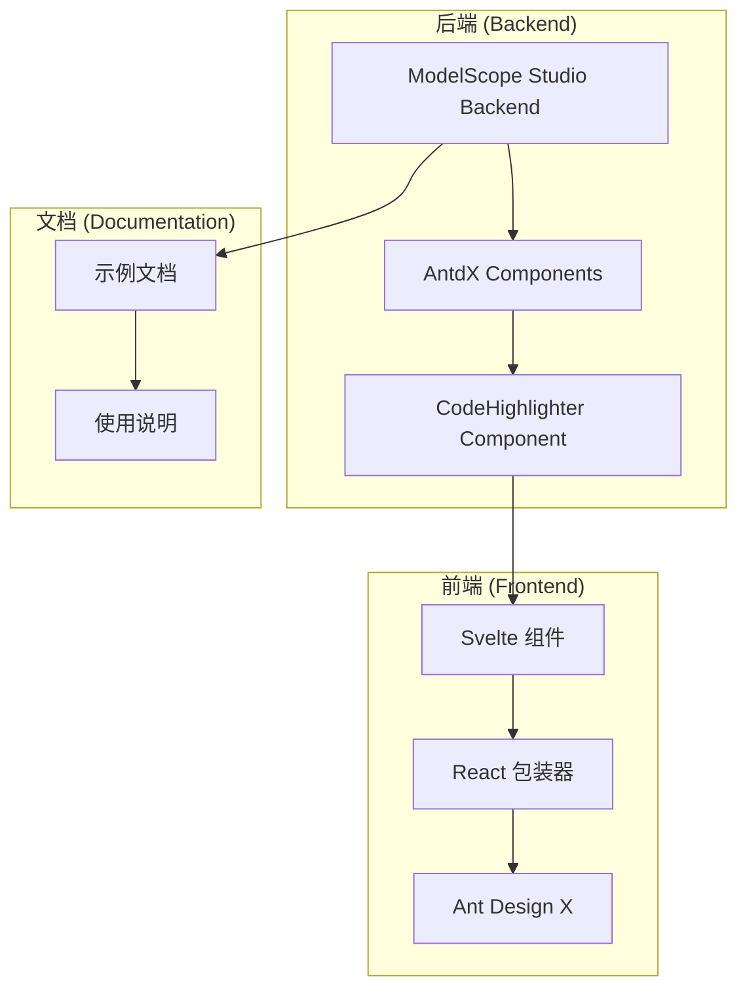
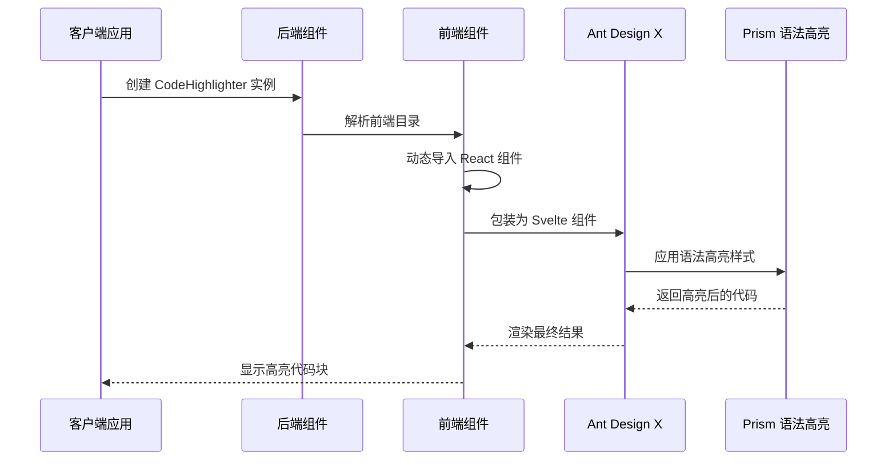
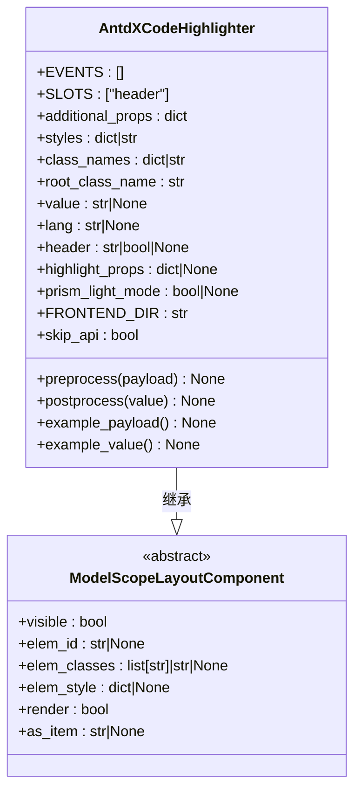
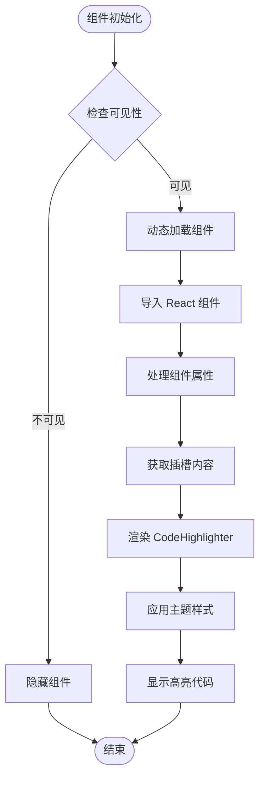
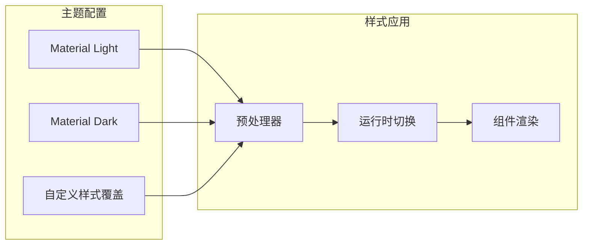

# CodeHighlighter 代码高亮

<cite>
**本文档引用的文件**
- [backend/modelscope_studio/components/antdx/code_highlighter/__init__.py](file://backend/modelscope_studio/components/antdx/code_highlighter/__init__.py)
- [frontend/antdx/code-highlighter/Index.svelte](file://frontend/antdx/code-highlighter/Index.svelte)
- [frontend/antdx/code-highlighter/code-highlighter.tsx](file://frontend/antdx/code-highlighter/code-highlighter.tsx)
- [frontend/antdx/code-highlighter/package.json](file://frontend/antdx/code-highlighter/package.json)
- [backend/modelscope_studio/components/antdx/components.py](file://backend/modelscope_studio/components/antdx/components.py)
- [docs/components/antdx/code_highlighter/README.md](file://docs/components/antdx/code_highlighter/README.md)
- [docs/components/antdx/code_highlighter/README-zh_CN.md](file://docs/components/antdx/code_highlighter/README-zh_CN.md)
</cite>

## 目录

1. [简介](#简介)
2. [项目结构](#项目结构)
3. [核心组件](#核心组件)
4. [架构概览](#架构概览)
5. [详细组件分析](#详细组件分析)
6. [依赖关系分析](#依赖关系分析)
7. [性能考虑](#性能考虑)
8. [故障排除指南](#故障排除指南)
9. [结论](#结论)

## 简介

CodeHighlighter 是一个基于 Ant Design X 的代码高亮组件，用于在模型空间工作室（ModelScope Studio）中提供语法高亮显示功能。该组件支持多种编程语言的语法高亮，包括暗色和亮色主题模式，并提供了灵活的配置选项来满足不同的使用场景。

该组件通过 Gradio 集成，实现了前后端的无缝连接，为用户提供了一个强大而易用的代码展示工具。组件支持自定义样式、语言选择、头部内容等高级功能。

## 项目结构

CodeHighlighter 组件在整个项目架构中的位置如下：



**图表来源**

- [backend/modelscope_studio/components/antdx/code_highlighter/**init**.py:1-71](file://backend/modelscope_studio/components/antdx/code_highlighter/__init__.py#L1-L71)
- [frontend/antdx/code-highlighter/Index.svelte:1-65](file://frontend/antdx/code-highlighter/Index.svelte#L1-L65)
- [frontend/antdx/code-highlighter/code-highlighter.tsx:1-54](file://frontend/antdx/code-highlighter/code-highlighter.tsx#L1-L54)

**章节来源**

- [backend/modelscope_studio/components/antdx/code_highlighter/**init**.py:1-71](file://backend/modelscope_studio/components/antdx/code_highlighter/__init__.py#L1-L71)
- [backend/modelscope_studio/components/antdx/components.py:1-40](file://backend/modelscope_studio/components/antdx/components.py#L1-L40)

## 核心组件

### 后端组件类

CodeHighlighter 后端组件继承自 `ModelScopeLayoutComponent`，提供了完整的组件生命周期管理和属性处理机制。

**主要特性：**

- 支持多种编程语言的语法高亮
- 自动主题适配（暗色/亮色模式）
- 可定制的样式和类名
- 插槽系统支持头部内容
- API 跳过机制优化性能

**关键属性：**

- `value`: 要高亮显示的代码内容
- `lang`: 编程语言类型
- `header`: 头部显示内容
- `highlight_props`: 高亮配置属性
- `prism_light_mode`: Prism 主题模式设置

**章节来源**

- [backend/modelscope_studio/components/antdx/code_highlighter/**init**.py:15-52](file://backend/modelscope_studio/components/antdx/code_highlighter/__init__.py#L15-L52)

### 前端组件实现

前端采用 Svelte + React 的混合架构，通过 `sveltify` 工具实现组件桥接。

**技术特点：**

- 动态导入优化加载性能
- 支持插槽系统
- 主题自动检测和切换
- 自定义样式覆盖

**章节来源**

- [frontend/antdx/code-highlighter/Index.svelte:1-65](file://frontend/antdx/code-highlighter/Index.svelte#L1-L65)
- [frontend/antdx/code-highlighter/code-highlighter.tsx:1-54](file://frontend/antdx/code-highlighter/code-highlighter.tsx#L1-L54)

## 架构概览

CodeHighlighter 采用了分层架构设计，实现了前后端的清晰分离：



**图表来源**

- [backend/modelscope_studio/components/antdx/code_highlighter/**init**.py:53-53](file://backend/modelscope_studio/components/antdx/code_highlighter/__init__.py#L53-L53)
- [frontend/antdx/code-highlighter/Index.svelte:10-12](file://frontend/antdx/code-highlighter/Index.svelte#L10-L12)
- [frontend/antdx/code-highlighter/code-highlighter.tsx:29-51](file://frontend/antdx/code-highlighter/code-highlighter.tsx#L29-L51)

## 详细组件分析

### 组件类结构图



**图表来源**

- [backend/modelscope_studio/components/antdx/code_highlighter/**init**.py:6-71](file://backend/modelscope_studio/components/antdx/code_highlighter/__init__.py#L6-L71)

### 前端渲染流程



**图表来源**

- [frontend/antdx/code-highlighter/Index.svelte:50-64](file://frontend/antdx/code-highlighter/Index.svelte#L50-L64)
- [frontend/antdx/code-highlighter/code-highlighter.tsx:35-51](file://frontend/antdx/code-highlighter/code-highlighter.tsx#L35-L51)

### 主题系统设计

组件支持两种主题模式的自定义样式：



**图表来源**

- [frontend/antdx/code-highlighter/code-highlighter.tsx:13-27](file://frontend/antdx/code-highlighter/code-highlighter.tsx#L13-L27)

**章节来源**

- [frontend/antdx/code-highlighter/code-highlighter.tsx:1-54](file://frontend/antdx/code-highlighter/code-highlighter.tsx#L1-L54)

## 依赖关系分析

### 组件依赖图

```mermaid
graph TB
subgraph "外部依赖"
A[@ant-design/x]
B[react-syntax-highlighter]
C[classnames]
D[svelte-preprocess-react]
end
subgraph "内部依赖"
E[ModelScopeLayoutComponent]
F[resolve_frontend_dir]
G[Gradio 集成]
end
subgraph "组件层次"
H[AntdXCodeHighlighter]
I[Index.svelte]
J[code-highlighter.tsx]
end
H --> E
H --> F
H --> G
I --> H
I --> D
I --> C
J --> A
J --> B
J --> D
```

**图表来源**

- [frontend/antdx/code-highlighter/code-highlighter.tsx:1-11](file://frontend/antdx/code-highlighter/code-highlighter.tsx#L1-L11)
- [frontend/antdx/code-highlighter/Index.svelte:1-8](file://frontend/antdx/code-highlighter/Index.svelte#L1-L8)
- [backend/modelscope_studio/components/antdx/code_highlighter/**init**.py:3-3](file://backend/modelscope_studio/components/antdx/code_highlighter/__init__.py#L3-L3)

### 包管理配置

组件的包配置支持多入口导出：

**章节来源**

- [frontend/antdx/code-highlighter/package.json:1-15](file://frontend/antdx/code-highlighter/package.json#L1-L15)

## 性能考虑

### 加载优化策略

1. **动态导入**: 使用 `importComponent` 和 `import()` 实现按需加载
2. **懒加载**: 组件在需要时才进行渲染
3. **缓存机制**: 已解析的组件会被缓存以提高重复访问性能

### 内存管理

- 组件销毁时会清理相关的事件监听器
- 插槽内容在不需要时会被正确释放
- 主题样式对象会被合理复用

## 故障排除指南

### 常见问题及解决方案

**问题1: 代码不显示高亮**

- 检查 `value` 属性是否正确设置
- 确认 `lang` 属性的语言标识是否有效
- 验证 `highlightProps` 配置是否正确

**问题2: 主题显示异常**

- 检查 `themeMode` 属性设置
- 确认共享主题配置是否正确
- 验证自定义样式覆盖是否冲突

**问题3: 组件不渲染**

- 检查 `visible` 属性状态
- 确认 `elem_id` 和 `elem_classes` 配置
- 验证 Gradio 集成是否正常

**章节来源**

- [frontend/antdx/code-highlighter/Index.svelte:50-64](file://frontend/antdx/code-highlighter/Index.svelte#L50-L64)
- [frontend/antdx/code-highlighter/code-highlighter.tsx:35-51](file://frontend/antdx/code-highlighter/code-highlighter.tsx#L35-L51)

## 结论

CodeHighlighter 组件是一个功能完整、架构清晰的代码高亮解决方案。它成功地将 Ant Design X 的强大功能与 Gradio 生态系统相结合，为用户提供了优秀的代码展示体验。

**主要优势：**

- 完整的语法高亮支持
- 灵活的主题配置
- 良好的性能表现
- 易于使用的 API 接口
- 完善的文档支持

该组件为模型空间工作室提供了强大的代码展示能力，能够满足各种开发和演示场景的需求。通过合理的架构设计和性能优化，确保了在不同环境下的稳定运行。
