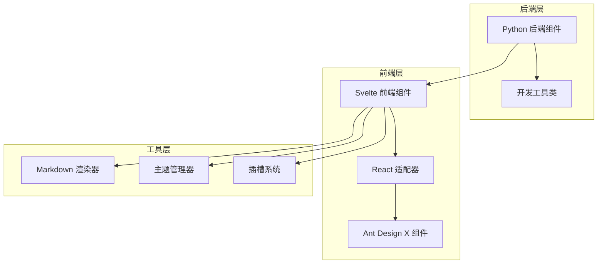
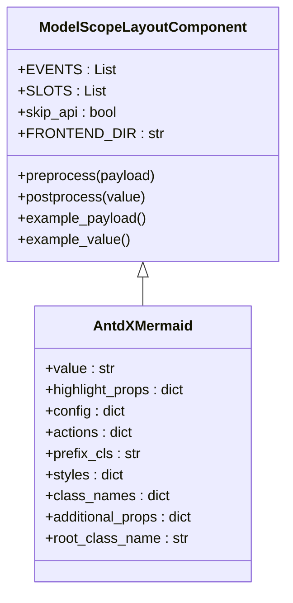
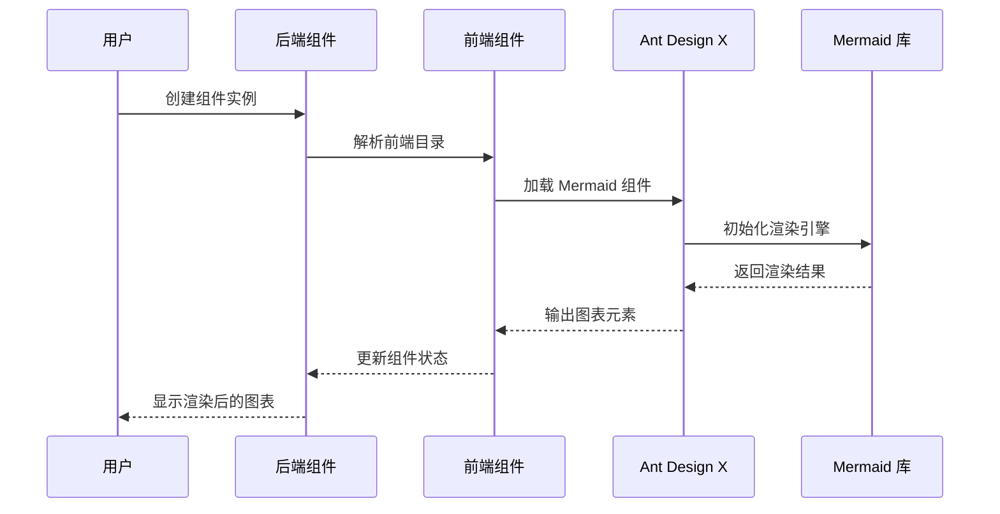
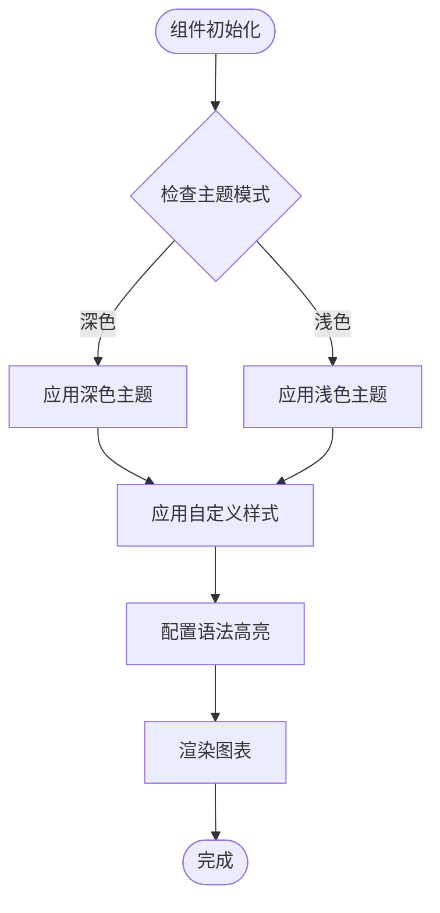
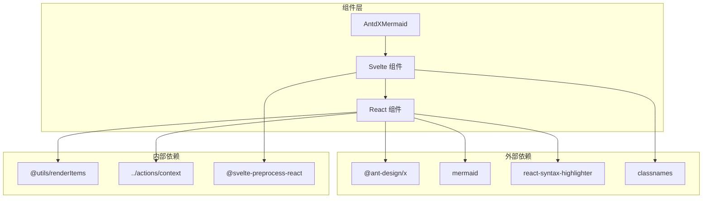
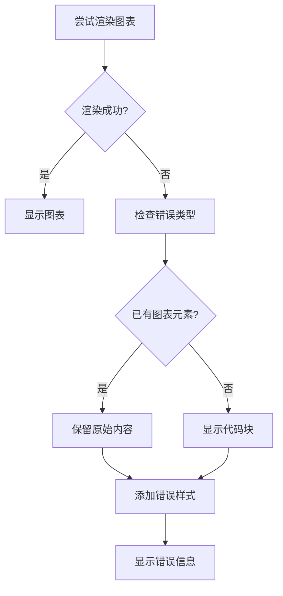

# Mermaid 流程图

<cite>
**本文档引用的文件**
- [backend/modelscope_studio/components/antdx/mermaid/__init__.py](file://backend/modelscope_studio/components/antdx/mermaid/__init__.py)
- [frontend/antdx/mermaid/Index.svelte](file://frontend/antdx/mermaid/Index.svelte)
- [frontend/antdx/mermaid/mermaid.tsx](file://frontend/antdx/mermaid/mermaid.tsx)
- [frontend/antdx/mermaid/gradio.config.js](file://frontend/antdx/mermaid/gradio.config.js)
- [frontend/antdx/mermaid/package.json](file://frontend/antdx/mermaid/package.json)
- [frontend/globals/components/markdown/utils.ts](file://frontend/globals/components/markdown/utils.ts)
- [backend/modelscope_studio/utils/dev/component.py](file://backend/modelscope_studio/utils/dev/component.py)
</cite>

## 目录

1. [简介](#简介)
2. [项目结构](#项目结构)
3. [核心组件](#核心组件)
4. [架构概览](#架构概览)
5. [详细组件分析](#详细组件分析)
6. [依赖关系分析](#依赖关系分析)
7. [性能考虑](#性能考虑)
8. [故障排除指南](#故障排除指南)
9. [结论](#结论)

## 简介

ModelScope Studio 中的 Mermaid 流程图组件是一个基于 Ant Design X 的可视化图表渲染组件，专门用于在 Gradio 应用中展示 Mermaid 格式的流程图、序列图、甘特图等图表。该组件提供了完整的前端渲染能力，支持主题切换、自定义操作按钮和插槽系统。

## 项目结构

Mermaid 组件采用分层架构设计，主要包含以下层次：

**图表来源**

- [backend/modelscope_studio/components/antdx/mermaid/**init**.py:1-77](file://backend/modelscope_studio/components/antdx/mermaid/__init__.py#L1-L77)
- [frontend/antdx/mermaid/Index.svelte:1-69](file://frontend/antdx/mermaid/Index.svelte#L1-L69)
- [frontend/antdx/mermaid/mermaid.tsx:1-87](file://frontend/antdx/mermaid/mermaid.tsx#L1-L87)

**章节来源**

- [backend/modelscope_studio/components/antdx/mermaid/**init**.py:1-77](file://backend/modelscope_studio/components/antdx/mermaid/__init__.py#L1-L77)
- [frontend/antdx/mermaid/Index.svelte:1-69](file://frontend/antdx/mermaid/Index.svelte#L1-L69)
- [frontend/antdx/mermaid/mermaid.tsx:1-87](file://frontend/antdx/mermaid/mermaid.tsx#L1-L87)

## 核心组件

### AntdXMermaid Python 组件

AntdXMermaid 是后端的核心组件类，继承自 `ModelScopeLayoutComponent`，提供完整的 Gradio 集成能力。

**图表来源**

- [backend/modelscope_studio/utils/dev/component.py:11-127](file://backend/modelscope_studio/utils/dev/component.py#L11-L127)
- [backend/modelscope_studio/components/antdx/mermaid/**init**.py:8-77](file://backend/modelscope_studio/components/antdx/mermaid/__init__.py#L8-L77)

### 前端渲染组件

前端层采用 Svelte + React 的混合架构，通过 `sveltify` 适配器将 React 组件包装为 Svelte 组件。

**章节来源**

- [backend/modelscope_studio/utils/dev/component.py:11-127](file://backend/modelscope_studio/utils/dev/component.py#L11-L127)
- [backend/modelscope_studio/components/antdx/mermaid/**init**.py:8-77](file://backend/modelscope_studio/components/antdx/mermaid/__init__.py#L8-L77)

## 架构概览

Mermaid 组件的整体架构采用分层设计，实现了前后端分离和组件化管理：

**图表来源**

- [frontend/antdx/mermaid/Index.svelte:10-68](file://frontend/antdx/mermaid/Index.svelte#L10-L68)
- [frontend/antdx/mermaid/mermaid.tsx:50-79](file://frontend/antdx/mermaid/mermaid.tsx#L50-L79)

## 详细组件分析

### 后端组件实现

后端组件继承自 `ModelScopeLayoutComponent`，实现了以下关键功能：

#### 组件属性配置

- `value`: 图表内容字符串
- `highlight_props`: 语法高亮配置
- `config`: Mermaid 配置选项
- `actions`: 自定义操作按钮
- `styles/class_names`: 样式配置

#### 事件处理机制

组件支持 `render_type_change` 事件，通过回调函数绑定渲染类型变更事件。

**章节来源**

- [backend/modelscope_studio/components/antdx/mermaid/**init**.py:12-16](file://backend/modelscope_studio/components/antdx/mermaid/__init__.py#L12-L16)
- [backend/modelscope_studio/components/antdx/mermaid/**init**.py:21-58](file://backend/modelscope_studio/components/antdx/mermaid/__init__.py#L21-L58)

### 前端组件架构

前端采用三层架构设计：

#### Svelte 层 (Index.svelte)

负责组件的生命周期管理和属性传递，使用 `importComponent` 动态加载 React 组件。

#### React 适配层 (mermaid.tsx)

通过 `sveltify` 将 React 组件包装为 Svelte 可用的组件，实现属性转换和事件处理。

#### Ant Design X 集成

直接使用 `@ant-design/x` 的 `Mermaid` 组件，提供丰富的图表渲染能力。

**章节来源**

- [frontend/antdx/mermaid/Index.svelte:1-69](file://frontend/antdx/mermaid/Index.svelte#L1-L69)
- [frontend/antdx/mermaid/mermaid.tsx:1-87](file://frontend/antdx/mermaid/mermaid.tsx#L1-L87)

### 主题和样式系统

组件支持深色和浅色两种主题模式，通过 `themeMode` 属性控制：

**图表来源**

- [frontend/antdx/mermaid/mermaid.tsx:17-31](file://frontend/antdx/mermaid/mermaid.tsx#L17-L31)
- [frontend/antdx/mermaid/mermaid.tsx:56-61](file://frontend/antdx/mermaid/mermaid.tsx#L56-L61)

**章节来源**

- [frontend/antdx/mermaid/mermaid.tsx:17-31](file://frontend/antdx/mermaid/mermaid.tsx#L17-L31)
- [frontend/antdx/mermaid/mermaid.tsx:56-61](file://frontend/antdx/mermaid/mermaid.tsx#L56-L61)

### 插槽系统

组件支持两个主要插槽：

- `header`: 头部内容插槽
- `actions.customActions`: 自定义操作按钮插槽

插槽系统通过 `getSlots()` 和 `ReactSlot` 实现，支持动态内容渲染。

**章节来源**

- [frontend/antdx/mermaid/Index.svelte:51-51](file://frontend/antdx/mermaid/Index.svelte#L51-L51)
- [frontend/antdx/mermaid/mermaid.tsx:38-38](file://frontend/antdx/mermaid/mermaid.tsx#L38-L38)

## 依赖关系分析

组件的依赖关系呈现清晰的分层结构：

**图表来源**

- [frontend/antdx/mermaid/mermaid.tsx:1-15](file://frontend/antdx/mermaid/mermaid.tsx#L1-L15)
- [frontend/antdx/mermaid/Index.svelte:2-8](file://frontend/antdx/mermaid/Index.svelte#L2-L8)

**章节来源**

- [frontend/antdx/mermaid/mermaid.tsx:1-15](file://frontend/antdx/mermaid/mermaid.tsx#L1-L15)
- [frontend/antdx/mermaid/Index.svelte:2-8](file://frontend/antdx/mermaid/Index.svelte#L2-L8)

## 性能考虑

### 按需加载优化

组件采用动态导入 (`importComponent`) 机制，只有在需要时才加载 React 组件，减少初始包体积。

### 渲染性能优化

- 使用 `useMemo` 缓存计算结果，避免不必要的重新渲染
- 通过 `tick()` 确保 DOM 更新时机正确
- 支持异步渲染，提升用户体验

### 内存管理

- 组件销毁时自动清理事件监听器
- 及时释放不再使用的资源

## 故障排除指南

### 常见问题及解决方案

#### 图表渲染失败

当 Mermaid 图表渲染失败时，系统会自动降级为代码显示模式：

**图表来源**

- [frontend/globals/components/markdown/utils.ts:191-222](file://frontend/globals/components/markdown/utils.ts#L191-L222)

#### 主题不匹配问题

确保 `themeMode` 属性正确传递到组件，深色模式下使用 `dark`，浅色模式下使用 `base`。

#### 插槽内容不显示

检查插槽名称是否正确（`header` 或 `actions.customActions`），以及插槽内容是否正确传递。

**章节来源**

- [frontend/globals/components/markdown/utils.ts:191-222](file://frontend/globals/components/markdown/utils.ts#L191-L222)

## 结论

ModelScope Studio 的 Mermaid 流程图组件通过精心设计的分层架构，实现了高性能、可扩展的图表渲染解决方案。组件具有以下优势：

1. **完整的 Gradio 集成**：通过 `ModelScopeLayoutComponent` 提供原生的 Gradio 支持
2. **灵活的主题系统**：支持深色和浅色主题自动切换
3. **强大的插槽系统**：提供头部内容和自定义操作按钮的灵活配置
4. **优秀的错误处理**：智能的降级机制确保用户体验
5. **高效的渲染性能**：按需加载和缓存优化提升性能

该组件为开发者提供了一个强大而易用的图表渲染工具，适用于各种数据可视化场景。
