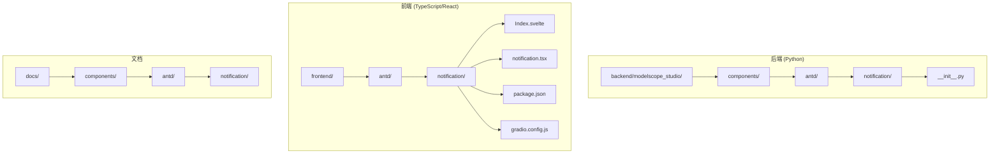
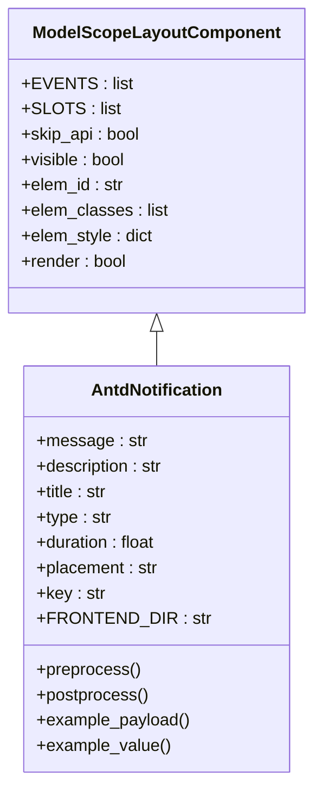
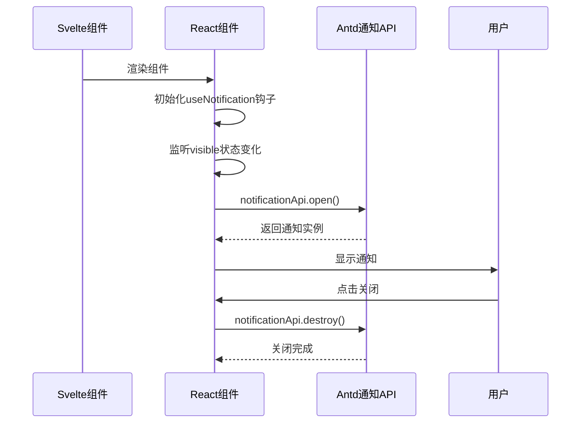
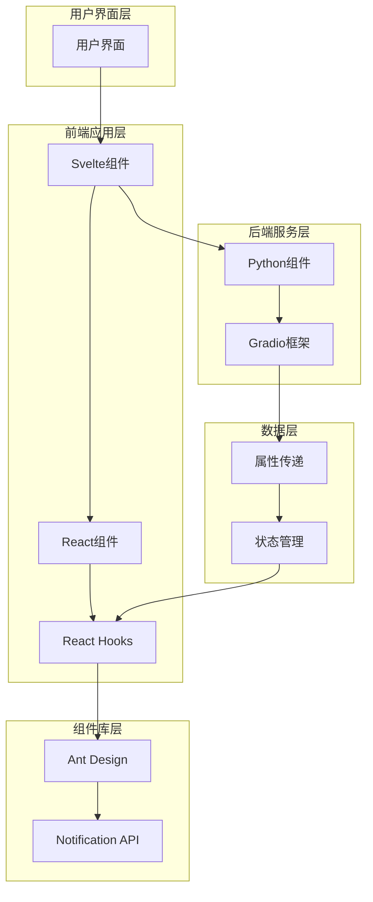
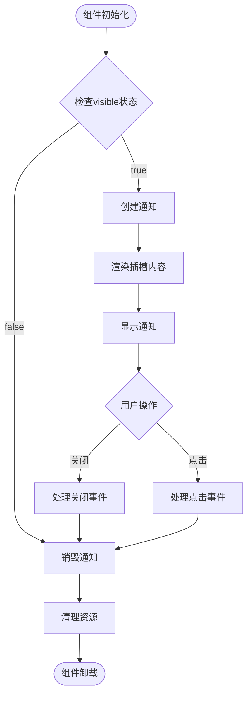
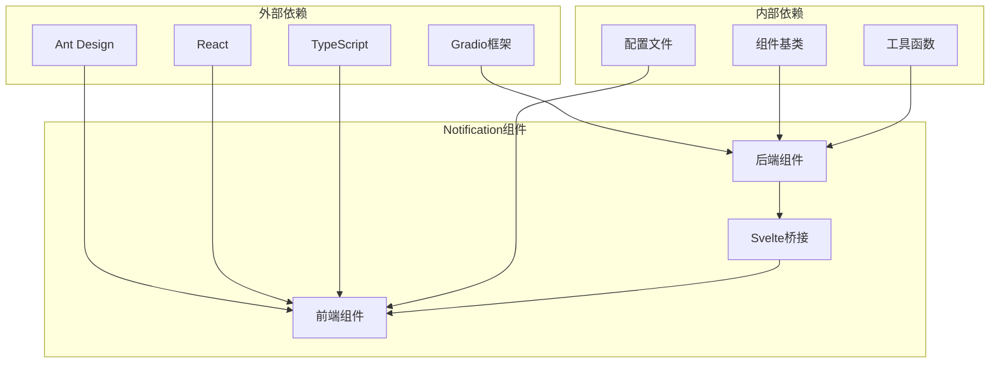

# Notification 通知

<cite>
**本文档引用的文件**
- [backend/modelscope_studio/components/antd/notification/__init__.py](file://backend/modelscope_studio/components/antd/notification/__init__.py)
- [frontend/antd/notification/notification.tsx](file://frontend/antd/notification/notification.tsx)
- [frontend/antd/notification/Index.svelte](file://frontend/antd/notification/Index.svelte)
- [backend/modelscope_studio/utils/dev/component.py](file://backend/modelscope_studio/utils/dev/component.py)
- [backend/modelscope_studio/components/antd/__init__.py](file://backend/modelscope_studio/components/antd/__init__.py)
- [backend/modelscope_studio/components/antd/components.py](file://backend/modelscope_studio/components/antd/components.py)
- [frontend/antd/notification/package.json](file://frontend/antd/notification/package.json)
- [frontend/antd/notification/gradio.config.js](file://frontend/antd/notification/gradio.config.js)
- [docs/components/antd/notification/README.md](file://docs/components/antd/notification/README.md)
</cite>

## 目录

1. [简介](#简介)
2. [项目结构](#项目结构)
3. [核心组件](#核心组件)
4. [架构概览](#架构概览)
5. [详细组件分析](#详细组件分析)
6. [依赖关系分析](#依赖关系分析)
7. [性能考虑](#性能考虑)
8. [故障排除指南](#故障排除指南)
9. [结论](#结论)

## 简介

Notification 通知是 ModelScope Studio 中基于 Ant Design 的全局通知组件，用于在应用程序中显示各种类型的通知消息。该组件支持多种通知类型（成功、信息、警告、错误），提供可定制的通知位置、持续时间、进度条等功能。

该组件采用前后端分离的架构设计，后端使用 Python 实现组件定义，前端使用 React 和 TypeScript 构建，通过 Gradio 框架进行集成。

## 项目结构

ModelScope Studio 项目采用模块化组织方式，Notification 组件位于以下目录结构中：

**图表来源**

- [backend/modelscope_studio/components/antd/notification/**init**.py:1-109](file://backend/modelscope_studio/components/antd/notification/__init__.py#L1-L109)
- [frontend/antd/notification/Index.svelte:1-80](file://frontend/antd/notification/Index.svelte#L1-L80)

**章节来源**

- [backend/modelscope_studio/components/antd/notification/**init**.py:1-109](file://backend/modelscope_studio/components/antd/notification/__init__.py#L1-L109)
- [frontend/antd/notification/notification.tsx:1-106](file://frontend/antd/notification/notification.tsx#L1-L106)

## 核心组件

Notification 通知组件的核心实现包含三个主要部分：

### 后端组件类

后端使用 `AntdNotification` 类继承自 `ModelScopeLayoutComponent`，提供完整的组件功能定义：

**图表来源**

- [backend/modelscope_studio/utils/dev/component.py:11-169](file://backend/modelscope_studio/utils/dev/component.py#L11-L169)
- [backend/modelscope_studio/components/antd/notification/**init**.py:10-109](file://backend/modelscope_studio/components/antd/notification/__init__.py#L10-L109)

### 前端 React 组件

前端使用 React Hooks 和 Ant Design 的 notification API 实现通知功能：

**图表来源**

- [frontend/antd/notification/notification.tsx:31-95](file://frontend/antd/notification/notification.tsx#L31-L95)
- [frontend/antd/notification/Index.svelte:59-79](file://frontend/antd/notification/Index.svelte#L59-L79)

**章节来源**

- [backend/modelscope_studio/components/antd/notification/**init**.py:10-109](file://backend/modelscope_studio/components/antd/notification/__init__.py#L10-L109)
- [frontend/antd/notification/notification.tsx:8-106](file://frontend/antd/notification/notification.tsx#L8-L106)

## 架构概览

Notification 组件采用分层架构设计，确保前后端的清晰分离和良好的可维护性：

**图表来源**

- [backend/modelscope_studio/utils/dev/component.py:11-169](file://backend/modelscope_studio/utils/dev/component.py#L11-L169)
- [frontend/antd/notification/notification.tsx:31-95](file://frontend/antd/notification/notification.tsx#L31-L95)

## 详细组件分析

### 后端组件实现

后端 `AntdNotification` 类提供了完整的组件定义，包括事件处理、插槽支持和属性配置：

#### 主要特性

1. **事件系统**: 支持点击和关闭事件监听
2. **插槽系统**: 支持多个插槽（actions、closeIcon、description、icon、message、title）
3. **属性配置**: 提供丰富的配置选项如类型、位置、持续时间等

#### 关键方法说明

- `EVENTS`: 定义支持的事件列表
- `SLOTS`: 定义支持的插槽名称
- `preprocess()`: 预处理输入数据
- `postprocess()`: 处理输出结果
- `example_payload()`: 提供示例负载数据

**章节来源**

- [backend/modelscope_studio/components/antd/notification/**init**.py:14-21](file://backend/modelscope_studio/components/antd/notification/__init__.py#L14-L21)
- [backend/modelscope_studio/components/antd/notification/**init**.py:24](file://backend/modelscope_studio/components/antd/notification/__init__.py#L24)
- [backend/modelscope_studio/components/antd/notification/**init**.py:97-108](file://backend/modelscope_studio/components/antd/notification/__init__.py#L97-L108)

### 前端 React 组件实现

前端组件使用现代 React 开发模式，结合 Ant Design 的通知功能：

#### 核心功能

1. **状态管理**: 使用 React Hooks 管理通知状态
2. **生命周期**: 自动处理通知的创建和销毁
3. **插槽渲染**: 支持动态插槽内容渲染
4. **事件处理**: 处理用户交互事件

#### 组件流程

**图表来源**

- [frontend/antd/notification/notification.tsx:38-95](file://frontend/antd/notification/notification.tsx#L38-L95)

**章节来源**

- [frontend/antd/notification/notification.tsx:8-106](file://frontend/antd/notification/notification.tsx#L8-L106)

### Svelte 组件桥接

Svelte 组件作为前后端的桥梁，负责属性传递和事件处理：

#### 主要职责

1. **属性处理**: 将 Python 属性转换为 React 可用格式
2. **事件绑定**: 处理用户交互事件
3. **插槽管理**: 管理组件插槽内容
4. **状态同步**: 同步组件状态到后端

**章节来源**

- [frontend/antd/notification/Index.svelte:19-79](file://frontend/antd/notification/Index.svelte#L19-L79)

## 依赖关系分析

Notification 组件的依赖关系相对简单，主要依赖于 Ant Design 和 Gradio 框架：

**图表来源**

- [frontend/antd/notification/package.json:1-15](file://frontend/antd/notification/package.json#L1-L15)
- [backend/modelscope_studio/utils/dev/component.py:11-169](file://backend/modelscope_studio/utils/dev/component.py#L11-L169)

**章节来源**

- [backend/modelscope_studio/components/antd/**init**.py:82](file://backend/modelscope_studio/components/antd/__init__.py#L82)
- [backend/modelscope_studio/components/antd/components.py:79](file://backend/modelscope_studio/components/antd/components.py#L79)

## 性能考虑

Notification 组件在设计时考虑了以下性能优化：

### 内存管理

- 自动销毁不再使用的通知实例
- 合理的组件卸载处理
- 避免内存泄漏

### 渲染优化

- 条件渲染避免不必要的更新
- 有效的状态管理
- 插槽内容的延迟加载

### 用户体验

- 合适的通知持续时间
- 平滑的动画效果
- 响应式的布局

## 故障排除指南

### 常见问题及解决方案

#### 通知不显示

1. 检查 `visible` 属性是否设置为 `True`
2. 确认 `message` 或 `description` 是否正确设置
3. 验证组件是否正确渲染

#### 事件不响应

1. 检查事件监听器是否正确绑定
2. 确认回调函数是否正确实现
3. 验证事件参数传递

#### 样式问题

1. 检查 CSS 类名是否正确
2. 验证样式覆盖规则
3. 确认主题配置

**章节来源**

- [frontend/antd/notification/notification.tsx:65-68](file://frontend/antd/notification/notification.tsx#L65-L68)
- [backend/modelscope_studio/components/antd/notification/**init**.py:14-21](file://backend/modelscope_studio/components/antd/notification/__init__.py#L14-L21)

## 结论

Notification 通知组件是 ModelScope Studio 中一个设计精良的组件，具有以下特点：

1. **完整的功能支持**: 支持多种通知类型和丰富的配置选项
2. **良好的架构设计**: 前后端分离，易于维护和扩展
3. **用户体验优秀**: 提供流畅的交互和视觉效果
4. **性能优化**: 考虑了内存管理和渲染优化
5. **文档完善**: 提供了清晰的使用说明和示例

该组件为开发者提供了一个强大而灵活的通知解决方案，可以满足各种应用场景的需求。
