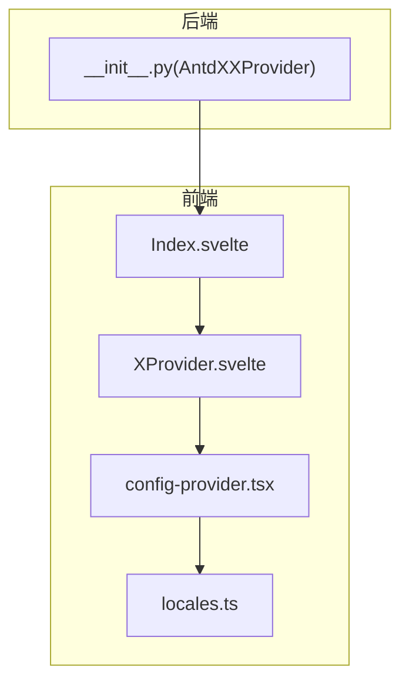
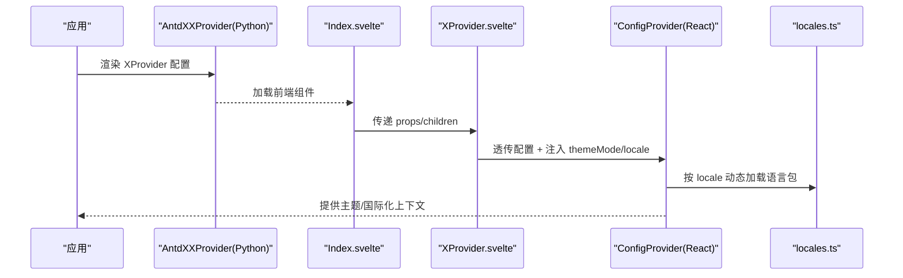
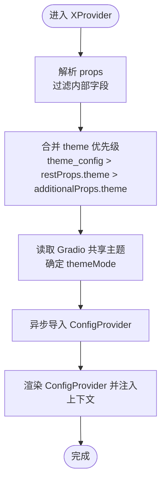
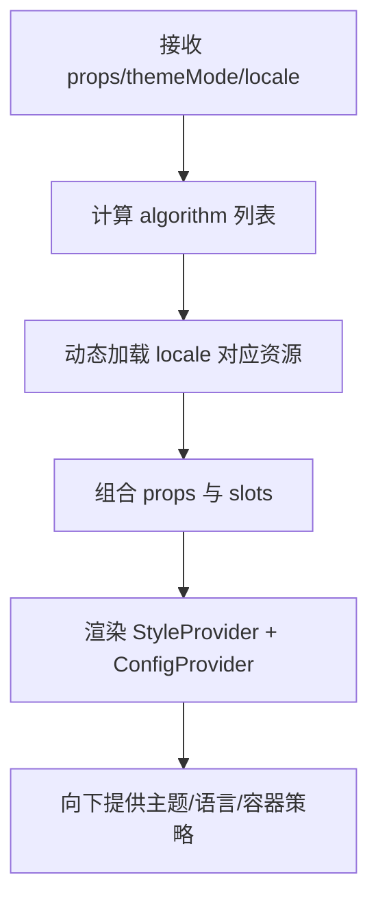
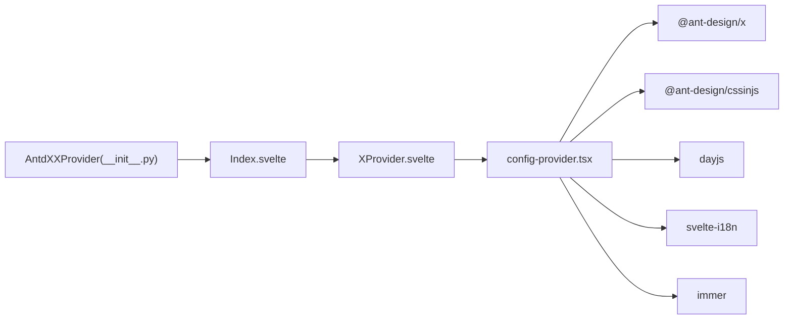

# XProvider 全局配置

<cite>
**本文引用的文件**
- [XProvider.svelte](file://frontend/antdx/x-provider/XProvider.svelte)
- [Index.svelte](file://frontend/antdx/x-provider/Index.svelte)
- [config-provider.tsx](file://frontend/antd/config-provider/config-provider.tsx)
- [locales.ts](file://frontend/antd/config-provider/locales.ts)
- [__init__.py](file://backend/modelscope_studio/components/antdx/x_provider/__init__.py)
- [README.md](file://README.md)
</cite>

## 目录

1. [简介](#简介)
2. [项目结构](#项目结构)
3. [核心组件](#核心组件)
4. [架构总览](#架构总览)
5. [详细组件分析](#详细组件分析)
6. [依赖分析](#依赖分析)
7. [性能考虑](#性能考虑)
8. [故障排查指南](#故障排查指南)
9. [结论](#结论)
10. [附录](#附录)

## 简介

本文件系统性阐述 XProvider 全局配置组件的设计与使用，重点覆盖以下方面：

- 上下文提供机制：如何通过 XProvider 为整应用注入统一的配置上下文（主题、国际化、组件默认行为等）。
- 主题配置：支持明暗模式与紧凑算法联动，以及与 Gradio 共享主题状态的集成。
- 国际化设置：自动识别浏览器语言并按需动态加载对应语言包。
- 与 ANTDX 组件的协作关系与最佳实践：如何在应用层统一配置，避免重复设置。

## 项目结构

XProvider 在前端采用“包装器 + 同步渲染”的模式，后端通过 Python 组件桥接前端组件，形成完整的配置提供链路。

图示来源

- [XProvider.svelte:1-75](file://frontend/antdx/x-provider/XProvider.svelte#L1-L75)
- [Index.svelte:1-20](file://frontend/antdx/x-provider/Index.svelte#L1-L20)
- [config-provider.tsx:1-154](file://frontend/antd/config-provider/config-provider.tsx#L1-L154)
- [locales.ts:1-863](file://frontend/antd/config-provider/locales.ts#L1-L863)
- [**init**.py:1-101](file://backend/modelscope_studio/components/antdx/x_provider/__init__.py#L1-L101)

章节来源

- [XProvider.svelte:1-75](file://frontend/antdx/x-provider/XProvider.svelte#L1-L75)
- [Index.svelte:1-20](file://frontend/antdx/x-provider/Index.svelte#L1-L20)
- [config-provider.tsx:1-154](file://frontend/antd/config-provider/config-provider.tsx#L1-L154)
- [locales.ts:1-863](file://frontend/antd/config-provider/locales.ts#L1-L863)
- [**init**.py:1-101](file://backend/modelscope_studio/components/antdx/x_provider/__init__.py#L1-L101)

## 核心组件

- 前端组件
  - XProvider 包装器：负责接收 props、处理额外属性、透传到 ConfigProvider，并注入主题与国际化能力。
  - ConfigProvider 实现：基于 Ant Design 的 ConfigProvider，扩展主题模式与国际化加载逻辑。
  - locales 语言映射：提供多语言资源按需加载与 dayjs 本地化同步。
- 后端组件
  - AntdXXProvider：Python 层的布局组件，声明可选插槽与配置项，桥接前端组件并屏蔽 API 调用。

章节来源

- [XProvider.svelte:1-75](file://frontend/antdx/x-provider/XProvider.svelte#L1-L75)
- [config-provider.tsx:51-151](file://frontend/antd/config-provider/config-provider.tsx#L51-L151)
- [locales.ts:12-87](file://frontend/antd/config-provider/locales.ts#L12-L87)
- [**init**.py:10-101](file://backend/modelscope_studio/components/antdx/x_provider/__init__.py#L10-L101)

## 架构总览

XProvider 的运行时流程如下：

图示来源

- [XProvider.svelte:12-74](file://frontend/antdx/x-provider/XProvider.svelte#L12-L74)
- [config-provider.tsx:71-149](file://frontend/antd/config-provider/config-provider.tsx#L71-L149)
- [locales.ts:89-105](file://frontend/antd/config-provider/locales.ts#L89-L105)
- [**init**.py:83-101](file://backend/modelscope_studio/components/antdx/x_provider/__init__.py#L83-L101)

## 详细组件分析

### XProvider 包装器（前端）

职责与要点

- 接收并处理 props：过滤内部字段，保留 restProps 与 additionalProps，同时支持 theme_config 与 theme 的优先级合并。
- 动态导入 ConfigProvider：通过异步组件确保按需加载，减少首屏负担。
- 主题与国际化注入：从 Gradio 共享主题获取明暗模式，从 props 或 theme_config 注入主题配置；国际化由底层 ConfigProvider 处理。
- 插槽与样式：透传 slots、elem_id、elem_classes、elem_style 等通用属性。

图示来源

- [XProvider.svelte:17-74](file://frontend/antdx/x-provider/XProvider.svelte#L17-L74)

章节来源

- [XProvider.svelte:1-75](file://frontend/antdx/x-provider/XProvider.svelte#L1-L75)

### ConfigProvider 实现（前端）

职责与要点

- 主题算法：根据 themeMode 与 props.theme.algorithm 自动组合暗色与紧凑算法。
- 国际化：支持 locale 字符串或自动识别浏览器语言，按需动态加载对应语言包与 dayjs 本地化。
- 容器挂载：提供 getPopupContainer 与 getTargetContainer 的函数包装，便于弹层容器自定义。
- 插槽整合：将 slots 中的嵌套键路径转换为对应的 React 组件树，支持 renderEmpty 等插槽。

图示来源

- [config-provider.tsx:71-149](file://frontend/antd/config-provider/config-provider.tsx#L71-L149)
- [locales.ts:89-105](file://frontend/antd/config-provider/locales.ts#L89-L105)

章节来源

- [config-provider.tsx:51-151](file://frontend/antd/config-provider/config-provider.tsx#L51-L151)
- [locales.ts:12-87](file://frontend/antd/config-provider/locales.ts#L12-L87)

### 后端组件（AntdXXProvider）

职责与要点

- 参数声明：包含组件禁用、尺寸、方向、前缀类、语言、主题、变体、虚拟化、警告等配置项。
- 插槽声明：声明 renderEmpty 等可注入插槽。
- 前端目录：指向前端 x-provider 组件目录。
- API 跳过：skip_api=True，避免生成冗余 API。

章节来源

- [**init**.py:10-101](file://backend/modelscope_studio/components/antdx/x_provider/__init__.py#L10-L101)

## 依赖分析

- 前端依赖
  - @ant-design/x：XProvider React 组件源。
  - @ant-design/cssinjs：样式注入与哈希控制。
  - dayjs：日期本地化。
  - svelte-i18n：浏览器语言检测。
  - immer：不可变更新工具。
- 后端依赖
  - ModelScopeLayoutComponent：布局组件基类。
  - resolve_frontend_dir：定位前端组件目录。

图示来源

- [XProvider.svelte:1-14](file://frontend/antdx/x-provider/XProvider.svelte#L1-L14)
- [config-provider.tsx:1-11](file://frontend/antd/config-provider/config-provider.tsx#L1-L11)
- [**init**.py:6-8](file://backend/modelscope_studio/components/antdx/x_provider/__init__.py#L6-L8)

章节来源

- [XProvider.svelte:1-14](file://frontend/antdx/x-provider/XProvider.svelte#L1-L14)
- [config-provider.tsx:1-11](file://frontend/antd/config-provider/config-provider.tsx#L1-L11)
- [**init**.py:6-8](file://backend/modelscope_studio/components/antdx/x_provider/__init__.py#L6-L8)

## 性能考虑

- 异步加载：XProvider 通过动态导入 ConfigProvider，避免首屏阻塞，提升启动速度。
- 主题算法：仅在 themeMode 或 props.theme.algorithm 变更时重组算法数组，降低重渲染成本。
- 语言包：按需加载语言包与 dayjs 本地化，避免一次性引入所有语言资源。
- 样式注入：使用高优先级哈希策略，减少样式冲突与回流。

## 故障排查指南

- 主题冲突告警
  - 现象：当同时设置 theme 与 Gradio 预设主题时触发告警。
  - 处理：统一使用 theme_config，避免与 Gradio 预设属性冲突。
  - 参考：[**init**.py:74-77](file://backend/modelscope_studio/components/antdx/x_provider/__init__.py#L74-L77)
- 明暗模式不生效
  - 确认 Gradio 共享主题已正确设置 themeMode。
  - 参考：[XProvider.svelte](file://frontend/antdx/x-provider/XProvider.svelte#L69)
- 语言未按预期切换
  - 检查 locale 字符串格式是否符合映射规则（如 zh_CN、en_US），或依赖自动识别。
  - 参考：[locales.ts:12-87](file://frontend/antd/config-provider/locales.ts#L12-L87)
- 插槽未生效
  - 确保插槽键路径正确（如 renderEmpty），并在 slots 中提供对应内容。
  - 参考：[config-provider.tsx:29-49](file://frontend/antd/config-provider/config-provider.tsx#L29-L49)

章节来源

- [**init**.py:74-77](file://backend/modelscope_studio/components/antdx/x_provider/__init__.py#L74-L77)
- [XProvider.svelte](file://frontend/antdx/x-provider/XProvider.svelte#L69)
- [locales.ts:12-87](file://frontend/antd/config-provider/locales.ts#L12-L87)
- [config-provider.tsx:29-49](file://frontend/antd/config-provider/config-provider.tsx#L29-L49)

## 结论

XProvider 通过“前端包装器 + 后端桥接”的设计，为应用提供了统一的主题与国际化上下文，具备良好的扩展性与性能表现。建议在应用入口处集中配置，避免各组件重复设置，从而获得一致的用户体验与更低的维护成本。

## 附录

### 配置选项说明（摘要）

- 组件级配置
  - component_disabled：组件禁用开关
  - component_size：组件尺寸（small/middle/large）
  - direction：文本方向（ltr/rtl）
  - prefix_cls/icon_prefix_cls：前缀类名
  - variant：组件外观变体（outlined/filled/borderless）
  - virtual：虚拟滚动
  - warning：警告配置
- 容器与弹层
  - get_popup_container/get_target_container：弹层与目标容器函数
- 国际化
  - locale：语言代码（如 zh_CN、en_US），支持自动识别
- 主题
  - theme/theme_config：主题对象与配置，优先使用 theme_config
  - themeMode：由 Gradio 共享主题提供（light/dark）
- 其他
  - render_empty：空状态渲染插槽
  - 元素属性：elem_id、elem_classes、elem_style
  - 可见性：visible 控制渲染

章节来源

- [**init**.py:19-82](file://backend/modelscope_studio/components/antdx/x_provider/__init__.py#L19-L82)
- [config-provider.tsx:53-70](file://frontend/antd/config-provider/config-provider.tsx#L53-L70)
- [locales.ts:12-87](file://frontend/antd/config-provider/locales.ts#L12-L87)
- [XProvider.svelte:25-74](file://frontend/antdx/x-provider/XProvider.svelte#L25-L74)
