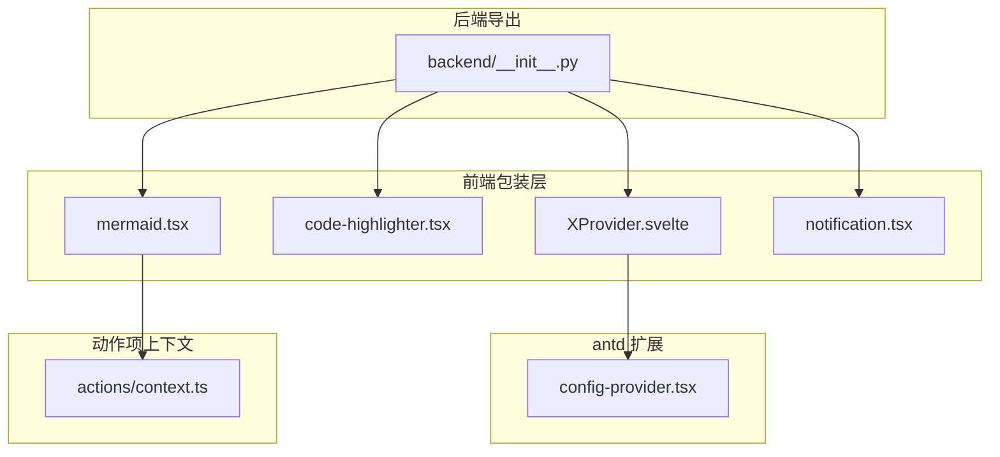
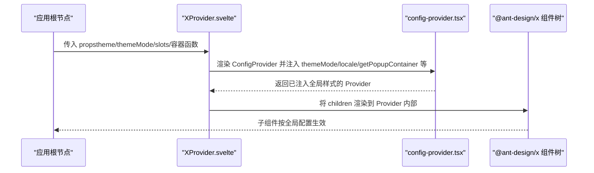
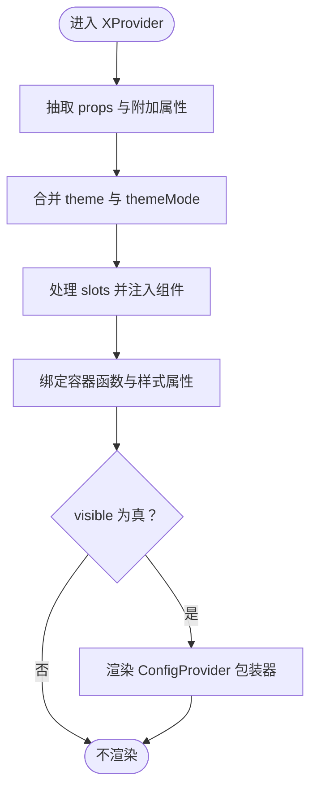
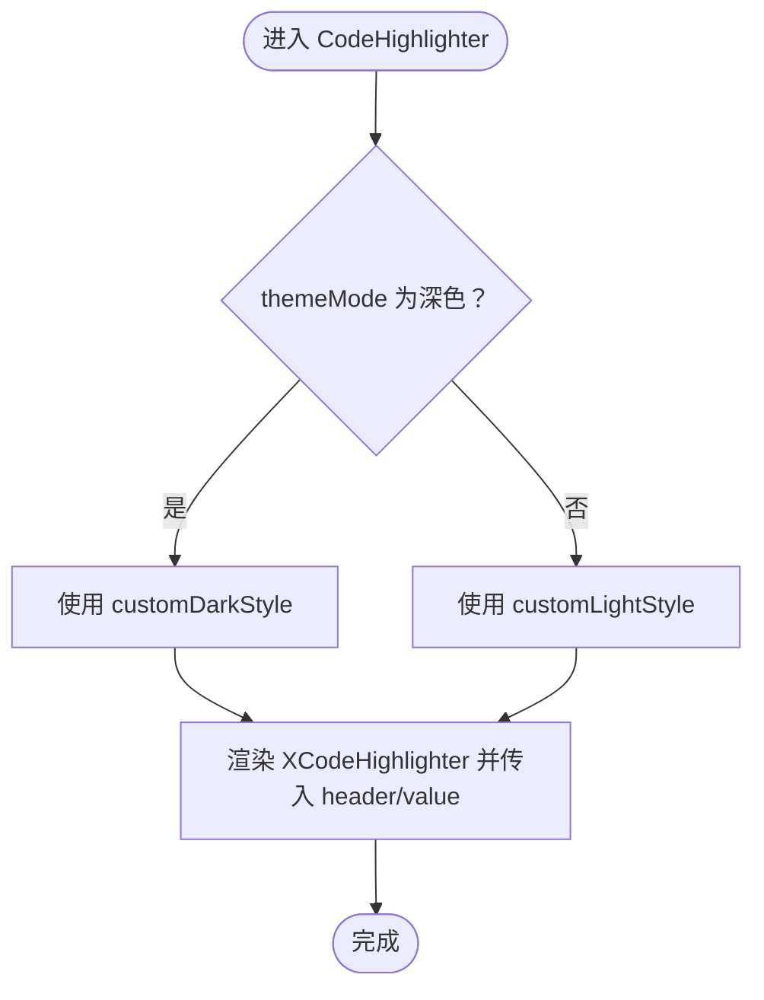
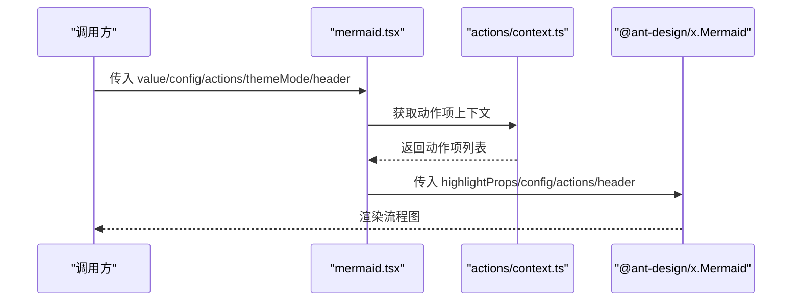
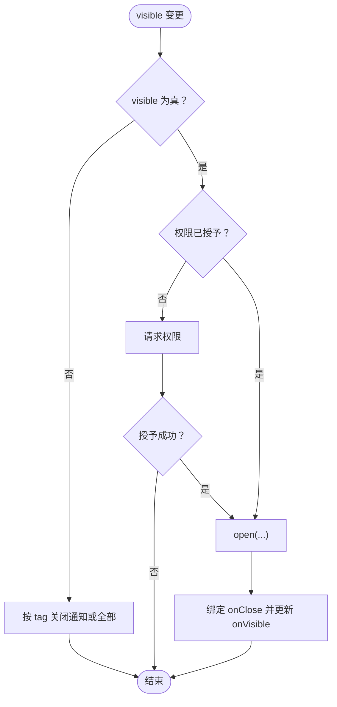
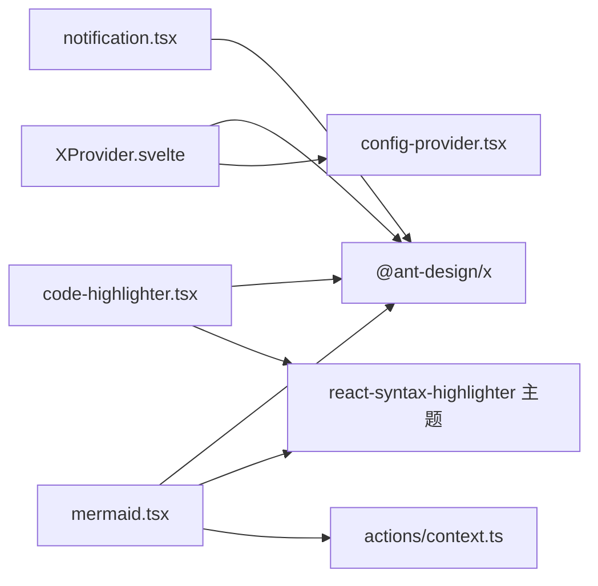

# 工具组件

<cite>
**本文引用的文件**
- [XProvider.svelte](file://frontend/antdx/x-provider/XProvider.svelte)
- [Index.svelte（XProvider 导出包装）](file://frontend/antdx/x-provider/Index.svelte)
- [config-provider.tsx](file://frontend/antd/config-provider/config-provider.tsx)
- [code-highlighter.tsx](file://frontend/antdx/code-highlighter/code-highlighter.tsx)
- [mermaid.tsx](file://frontend/antdx/mermaid/mermaid.tsx)
- [notification.tsx](file://frontend/antdx/notification/notification.tsx)
- [actions/context.ts](file://frontend/antdx/actions/context.ts)
- [backend/__init__.py（antdx 汇总导出）](file://backend/modelscope_studio/components/antdx/__init__.py)
- [x_provider 文档](file://docs/components/antdx/x_provider/README.md)
</cite>

## 目录

1. [简介](#简介)
2. [项目结构](#项目结构)
3. [核心组件](#核心组件)
4. [架构总览](#架构总览)
5. [组件详解](#组件详解)
6. [依赖关系分析](#依赖关系分析)
7. [性能考量](#性能考量)
8. [故障排查指南](#故障排查指南)
9. [结论](#结论)
10. [附录：使用示例与最佳实践](#附录使用示例与最佳实践)

## 简介

本文件面向 Ant Design X 工具组件，系统性梳理以下组件的设计与用法：

- XProvider：全局配置与上下文提供器，扩展 antd 的 ConfigProvider，统一为 @ant-design/x 组件提供主题、语言、弹层容器等全局能力。
- CodeHighlighter：代码高亮展示组件，支持主题定制、头部插槽、语法高亮样式覆盖。
- Mermaid：流程图/思维导图组件，集成高亮与动作项渲染，支持深浅主题切换与自定义动作。
- Notification：浏览器通知封装，提供权限请求、打开/关闭、可见性控制与回调。

## 项目结构

围绕工具组件的关键目录与文件如下：

- 前端 Svelte 包装层：frontend/antdx 下的各组件包装文件，负责将 @ant-design/x 的组件以 Svelte 方式接入 Gradio 生态。
- antd ConfigProvider 扩展：frontend/antd/config-provider 提供主题、语言、弹层容器等全局能力。
- 动作项上下文：frontend/antdx/actions/context 提供动作项的上下文注入与渲染工具。
- 后端汇总导出：backend/modelscope_studio/components/antdx/**init**.py 将 antdx 组件统一导出，便于 Python 层使用。

**图表来源**

- [XProvider.svelte:1-75](file://frontend/antdx/x-provider/XProvider.svelte#L1-L75)
- [config-provider.tsx:1-154](file://frontend/antd/config-provider/config-provider.tsx#L1-L154)
- [code-highlighter.tsx:1-54](file://frontend/antdx/code-highlighter/code-highlighter.tsx#L1-L54)
- [mermaid.tsx:1-87](file://frontend/antdx/mermaid/mermaid.tsx#L1-L87)
- [actions/context.ts:1-7](file://frontend/antdx/actions/context.ts#L1-L7)
- [backend/**init**.py（antdx 汇总导出）:1-42](file://backend/modelscope_studio/components/antdx/__init__.py#L1-L42)

**章节来源**

- [XProvider.svelte:1-75](file://frontend/antdx/x-provider/XProvider.svelte#L1-L75)
- [config-provider.tsx:1-154](file://frontend/antd/config-provider/config-provider.tsx#L1-L154)
- [code-highlighter.tsx:1-54](file://frontend/antdx/code-highlighter/code-highlighter.tsx#L1-L54)
- [mermaid.tsx:1-87](file://frontend/antdx/mermaid/mermaid.tsx#L1-L87)
- [actions/context.ts:1-7](file://frontend/antdx/actions/context.ts#L1-L7)
- [backend/**init**.py（antdx 汇总导出）:1-42](file://backend/modelscope_studio/components/antdx/__init__.py#L1-L42)

## 核心组件

- XProvider：在 Svelte 中通过 importComponent 异步加载并注入 ConfigProvider，统一透传 theme、themeMode、slots、容器函数等属性，作为 @ant-design/x 组件的全局上下文根节点。
- CodeHighlighter：对 @ant-design/x 的 CodeHighlighter 进行二次封装，支持 header 插槽、主题模式切换、highlightProps 覆盖。
- Mermaid：对 @ant-design/x 的 Mermaid 进行二次封装，支持 header、actions.customActions 插槽与上下文注入，自动根据 themeMode 切换 mermaid 主题与高亮样式。
- Notification：对 @ant-design/x 的 notification 进行二次封装，暴露 visible 控制、权限回调、标签化关闭等能力。

**后端导出入口说明**
以上工具组件均通过 [backend/modelscope_studio/components/antdx/**init**.py](file://backend/modelscope_studio/components/antdx/__init__.py) 统一导出，对应导出名称如下：

- `XProvider`：`from modelscope_studio.components.antdx import XProvider`
- `CodeHighlighter`：`from modelscope_studio.components.antdx import CodeHighlighter`
- `Mermaid`：`from modelscope_studio.components.antdx import Mermaid`
- `Notification`：`from modelscope_studio.components.antdx import Notification`

**章节来源**

- [XProvider.svelte:12-74](file://frontend/antdx/x-provider/XProvider.svelte#L12-L74)
- [config-provider.tsx:53-151](file://frontend/antd/config-provider/config-provider.tsx#L53-L151)
- [code-highlighter.tsx:29-51](file://frontend/antdx/code-highlighter/code-highlighter.tsx#L29-L51)
- [mermaid.tsx:33-84](file://frontend/antdx/mermaid/mermaid.tsx#L33-L84)
- [notification.tsx:6-50](file://frontend/antdx/notification/notification.tsx#L6-L50)

## 架构总览

下图展示了 XProvider 如何将 antd 的 ConfigProvider 与 @ant-design/x 组件串联起来，并通过 Svelte 上下文与 slots 机制完成属性与内容的传递。

**图表来源**

- [XProvider.svelte:56-74](file://frontend/antdx/x-provider/XProvider.svelte#L56-L74)
- [config-provider.tsx:108-149](file://frontend/antd/config-provider/config-provider.tsx#L108-L149)

**章节来源**

- [XProvider.svelte:1-75](file://frontend/antdx/x-provider/XProvider.svelte#L1-L75)
- [config-provider.tsx:1-154](file://frontend/antd/config-provider/config-provider.tsx#L1-L154)

## 组件详解

### XProvider 全局配置与上下文提供机制

- 设计要点
  - 使用 importComponent 异步加载 antd 的 ConfigProvider 包装组件，避免首屏阻塞。
  - 通过 getProps/processProps 抽取并合并 gradio 额外属性、主题配置与通用布局属性，形成最终透传 props。
  - setConfigType('antd') 明确配置类型，确保后续组件消费一致的上下文。
  - 支持 slots 注入，将 Svelte 插槽转换为 React 可识别的结构。
- 关键行为
  - theme 与 themeMode：优先从 additionalProps 或 restProps 获取 theme；themeMode 来自共享主题状态。
  - 容器函数：getPopupContainer、getTargetContainer 通过 useFunction 包裹，保证在组件生命周期内稳定可用。
  - 可见性控制：仅当 visible 为真时渲染 Provider，便于按需挂载。
- 最佳实践
  - 在应用根部放置 XProvider，确保子组件继承全局主题与语言设置。
  - 若已有 antd.ConfigProvider，请替换为 antdx.XProvider，保持配置一致性。

**图表来源**

- [XProvider.svelte:25-74](file://frontend/antdx/x-provider/XProvider.svelte#L25-L74)
- [config-provider.tsx:93-149](file://frontend/antd/config-provider/config-provider.tsx#L93-L149)

**章节来源**

- [XProvider.svelte:1-75](file://frontend/antdx/x-provider/XProvider.svelte#L1-L75)
- [Index.svelte（XProvider 导出包装）:1-20](file://frontend/antdx/x-provider/Index.svelte#L1-L20)
- [config-provider.tsx:1-154](file://frontend/antd/config-provider/config-provider.tsx#L1-L154)
- [x_provider 文档:1-19](file://docs/components/antdx/x_provider/README.md#L1-L19)

### CodeHighlighter 代码高亮组件

- 设计要点
  - 对接 @ant-design/x 的 CodeHighlighter，支持 header 插槽与 highlightProps 自定义。
  - 主题定制：基于 materialDark/materialLight，统一去除代码块外边距，适配卡片/对话场景。
  - 值来源：支持通过 value 属性直接传入代码字符串，或通过 children 传入。
- 使用建议
  - 在深色主题下使用 customDarkStyle，在浅色主题下使用 customLightStyle。
  - 通过 highlightProps.style 覆盖默认样式，或追加其他 react-syntax-highlighter 支持的属性。
  - 使用 header 插槽添加标题/操作区。

**图表来源**

- [code-highlighter.tsx:29-51](file://frontend/antdx/code-highlighter/code-highlighter.tsx#L29-L51)

**章节来源**

- [code-highlighter.tsx:1-54](file://frontend/antdx/code-highlighter/code-highlighter.tsx#L1-L54)

### Mermaid 流程图组件

- 设计要点
  - 对接 @ant-design/x 的 Mermaid，支持 header、actions.customActions 插槽与上下文注入。
  - 主题与高亮：根据 themeMode 切换 mermaid 主题（dark/base），同时同步高亮样式。
  - 动作项：通过 withItemsContextProvider 注入动作项上下文，支持动态渲染自定义动作。
- 使用建议
  - 在深色主题下启用 mermaid dark 主题，浅色主题下使用 base。
  - 通过 actions.customActions 传入自定义动作项，或使用插槽注入。
  - 通过 config 透传 mermaid 渲染配置（如方向、主题色等）。

**图表来源**

- [mermaid.tsx:40-84](file://frontend/antdx/mermaid/mermaid.tsx#L40-L84)
- [actions/context.ts:1-7](file://frontend/antdx/actions/context.ts#L1-L7)

**章节来源**

- [mermaid.tsx:1-87](file://frontend/antdx/mermaid/mermaid.tsx#L1-L87)
- [actions/context.ts:1-7](file://frontend/antdx/actions/context.ts#L1-L7)

### Notification 通知组件

- 设计要点
  - 对接 @ant-design/x 的 notification.useNotification，暴露 visible 控制与权限回调。
  - 自动请求权限：当 visible 为真且权限未授予时，触发权限请求；若授予则打开通知。
  - 标签化管理：支持按 tag 关闭指定通知，便于多实例管理。
  - 生命周期：在 visible 变更与组件卸载时自动清理通知。
- 使用建议
  - 将 visible 与 onVisible 与上层状态联动，实现受控显示/隐藏。
  - 通过 onPermission 监听权限变化，引导用户授权。
  - 使用 tag 区分不同通知实例，避免互相干扰。

**图表来源**

- [notification.tsx:17-46](file://frontend/antdx/notification/notification.tsx#L17-L46)

**章节来源**

- [notification.tsx:1-51](file://frontend/antdx/notification/notification.tsx#L1-L51)

## 依赖关系分析

- 组件耦合
  - XProvider 依赖 antd 的 ConfigProvider 包装，形成全局上下文根节点。
  - Mermaid 依赖 actions/context 提供的动作项上下文，实现动态动作渲染。
  - CodeHighlighter/Mermaid 共同依赖 react-syntax-highlighter 的主题样式，统一高亮风格。
- 外部依赖
  - @ant-design/x：核心组件库，提供 CodeHighlighter、Mermaid、Notification 等能力。
  - antd：提供 ConfigProvider、主题算法、语言包与 dayjs 国际化支持。
  - svelte-preprocess-react：桥接 Svelte 与 React，支持 slots 与函数包裹。

**图表来源**

- [XProvider.svelte:12-14](file://frontend/antdx/x-provider/XProvider.svelte#L12-L14)
- [config-provider.tsx:1-11](file://frontend/antd/config-provider/config-provider.tsx#L1-L11)
- [code-highlighter.tsx:4-11](file://frontend/antdx/code-highlighter/code-highlighter.tsx#L4-L11)
- [mermaid.tsx:4-15](file://frontend/antdx/mermaid/mermaid.tsx#L4-L15)
- [actions/context.ts:1-4](file://frontend/antdx/actions/context.ts#L1-L4)
- [notification.tsx:3-4](file://frontend/antdx/notification/notification.tsx#L3-L4)

**章节来源**

- [XProvider.svelte:1-75](file://frontend/antdx/x-provider/XProvider.svelte#L1-L75)
- [config-provider.tsx:1-154](file://frontend/antd/config-provider/config-provider.tsx#L1-L154)
- [code-highlighter.tsx:1-54](file://frontend/antdx/code-highlighter/code-highlighter.tsx#L1-L54)
- [mermaid.tsx:1-87](file://frontend/antdx/mermaid/mermaid.tsx#L1-L87)
- [actions/context.ts:1-7](file://frontend/antdx/actions/context.ts#L1-L7)
- [notification.tsx:1-51](file://frontend/antdx/notification/notification.tsx#L1-L51)

## 性能考量

- 异步加载：XProvider 使用 importComponent 异步加载 ConfigProvider 包装组件，减少首屏负担。
- 函数稳定化：通过 useFunction 包裹容器函数，避免每次渲染导致的函数引用变化引发的重渲染。
- 记忆化：Mermaid 中对 actions.customActions 与 config 使用 useMemo，降低不必要的重新计算与渲染。
- 主题样式：统一高亮样式对象，避免重复构建样式对象带来的开销。

[本节为通用指导，无需列出具体文件来源]

## 故障排查指南

- XProvider 未生效
  - 确认已在应用根部放置 XProvider，并确保 visible 为真。
  - 检查 theme 与 themeMode 是否正确传入，theme 与 Gradio 预设冲突时请使用 theme_config。
- Mermaid 图表不显示
  - 确认 value 有效，且 themeMode 与 config 正确。
  - 检查 actions.customActions 是否正确注入上下文或通过插槽传入。
- CodeHighlighter 样式异常
  - 确认 themeMode 与 highlightProps.style 的组合是否正确。
  - 检查 header 插槽是否被意外覆盖。
- Notification 无法弹出
  - 检查浏览器权限状态，确认 onPermission 回调是否触发。
  - 确认 visible 与 tag 的使用是否符合预期。

**章节来源**

- [XProvider.svelte:56-74](file://frontend/antdx/x-provider/XProvider.svelte#L56-L74)
- [mermaid.tsx:40-84](file://frontend/antdx/mermaid/mermaid.tsx#L40-L84)
- [code-highlighter.tsx:29-51](file://frontend/antdx/code-highlighter/code-highlighter.tsx#L29-L51)
- [notification.tsx:17-46](file://frontend/antdx/notification/notification.tsx#L17-L46)

## 结论

本文档系统梳理了 XProvider、CodeHighlighter、Mermaid、Notification 四个工具组件的实现与使用方法。它们通过统一的全局配置（XProvider）、主题与高亮策略（CodeHighlighter/Mermaid）、以及浏览器通知能力（Notification），为 Ant Design X 在前端生态中的落地提供了稳定、可扩展的基础。建议在应用根部统一引入 XProvider，并结合主题与语言配置，确保子组件获得一致的全局体验。

[本节为总结性内容，无需列出具体文件来源]

## 附录：使用示例与最佳实践

- XProvider
  - 在应用根部放置 XProvider，传入 theme_config 或 theme 与 themeMode，确保子组件继承全局配置。
  - 如已使用 antd.ConfigProvider，请替换为 antdx.XProvider，保持配置一致性。
- CodeHighlighter
  - 通过 value 或 children 传入代码内容；通过 header 插槽添加标题/操作区。
  - 根据 themeMode 选择对应高亮样式，必要时通过 highlightProps.style 覆盖细节。
- Mermaid
  - 传入 value 作为 mermaid 语法文本；通过 config 调整渲染参数；通过 actions.customActions 注入自定义动作。
  - 根据 themeMode 切换 mermaid 主题（dark/base），保持与页面主题一致。
- Notification
  - 使用 visible 与 onVisible 实现受控显示；监听 onPermission 获取权限状态；通过 tag 管理多实例。

**章节来源**

- [x_provider 文档:1-19](file://docs/components/antdx/x_provider/README.md#L1-L19)
- [backend/**init**.py（antdx 汇总导出）:1-42](file://backend/modelscope_studio/components/antdx/__init__.py#L1-L42)
