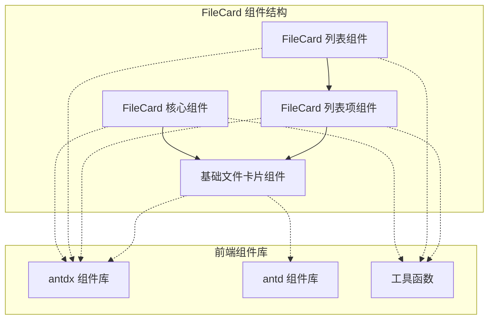
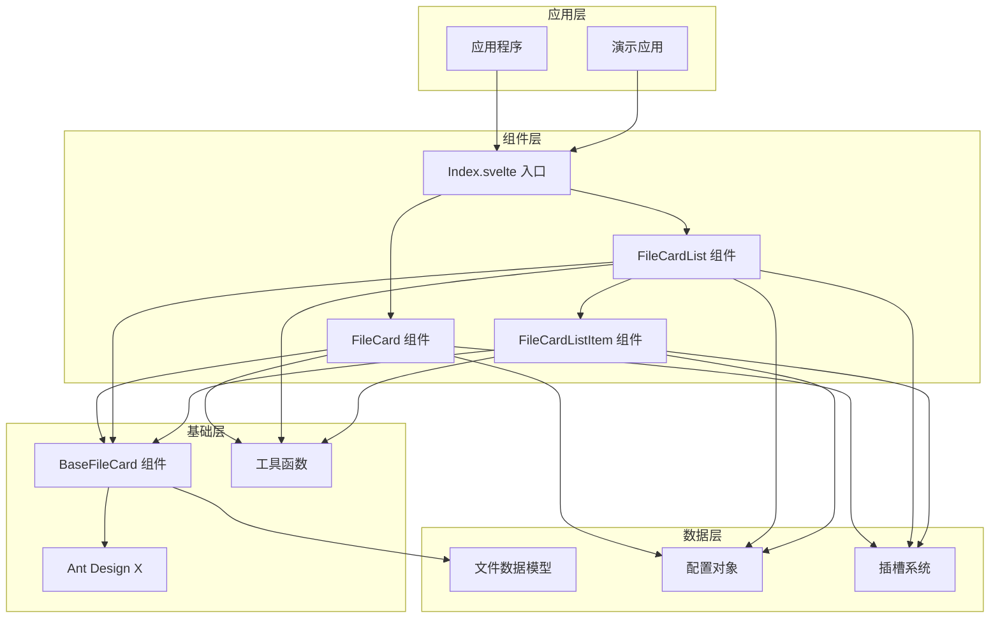
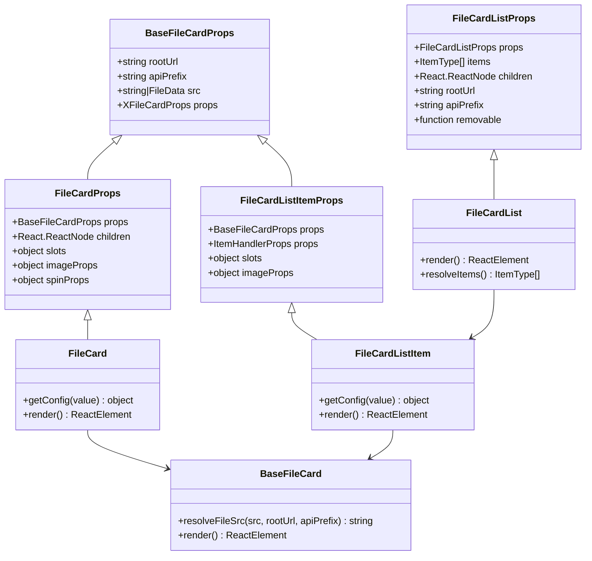
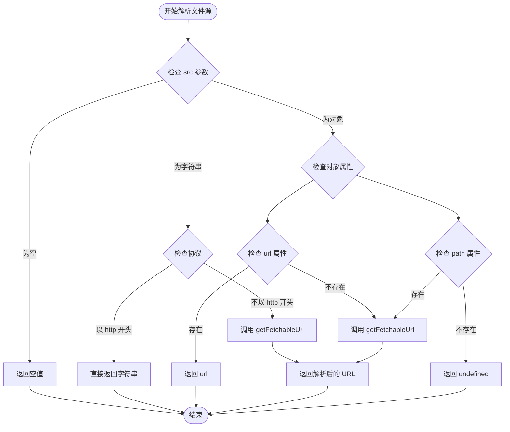
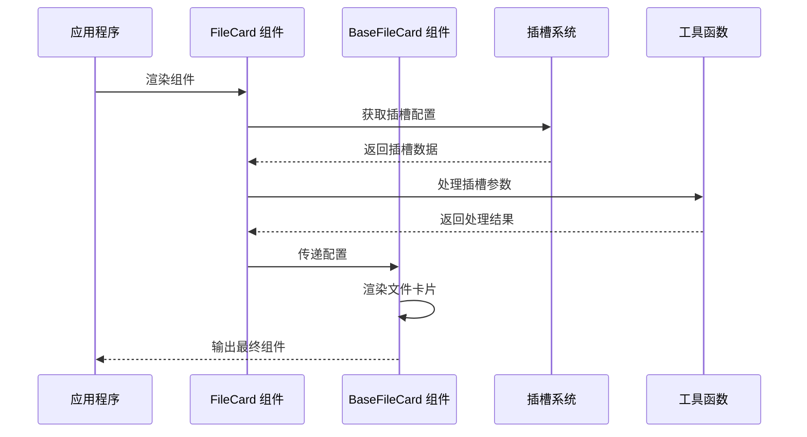
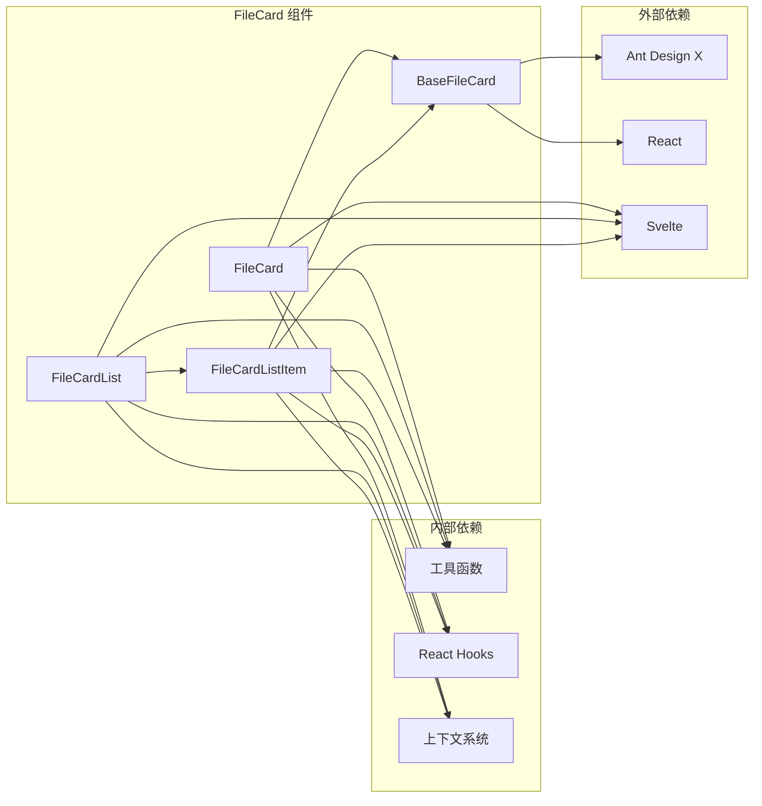

# FileCard 文件卡片组件

<cite>
**本文档引用的文件**
- [frontend/antdx/file-card/file-card.tsx](file://frontend/antdx/file-card/file-card.tsx)
- [frontend/antdx/file-card/base.tsx](file://frontend/antdx/file-card/base.tsx)
- [frontend/antdx/file-card/Index.svelte](file://frontend/antdx/file-card/Index.svelte)
- [frontend/antdx/file-card/list/file-card.list.tsx](file://frontend/antdx/file-card/list/file-card.list.tsx)
- [frontend/antdx/file-card/list/context.ts](file://frontend/antdx/file-card/list/context.ts)
- [frontend/antdx/file-card/list/item/file-card.list.item.tsx](file://frontend/antdx/file-card/list/item/file-card.list.item.tsx)
</cite>

## 目录

1. [简介](#简介)
2. [项目结构](#项目结构)
3. [核心组件](#核心组件)
4. [架构概览](#架构概览)
5. [详细组件分析](#详细组件分析)
6. [依赖关系分析](#依赖关系分析)
7. [性能考虑](#性能考虑)
8. [故障排除指南](#故障排除指南)
9. [结论](#结论)

## 简介

FileCard 文件卡片组件是 ModelScope Studio 前端框架中的一个重要组件，基于 Ant Design X 的 FileCard 组件进行扩展和封装。该组件提供了文件展示、预览、上传等功能，支持多种文件类型和自定义配置选项。

组件主要包含三个核心部分：

- **基础文件卡片组件**：提供核心的文件显示功能
- **文件卡片列表组件**：用于展示多个文件卡片的列表视图
- **文件卡片列表项组件**：单个文件卡片在列表中的具体实现

## 项目结构

FileCard 组件位于前端项目的 antdx 组件库中，采用模块化组织方式：

**图表来源**

- [frontend/antdx/file-card/file-card.tsx:1-127](file://frontend/antdx/file-card/file-card.tsx#L1-L127)
- [frontend/antdx/file-card/list/file-card.list.tsx:1-68](file://frontend/antdx/file-card/list/file-card.list.tsx#L1-L68)

**章节来源**

- [frontend/antdx/file-card/file-card.tsx:1-127](file://frontend/antdx/file-card/file-card.tsx#L1-L127)
- [frontend/antdx/file-card/list/file-card.list.tsx:1-68](file://frontend/antdx/file-card/list/file-card.list.tsx#L1-L68)

## 核心组件

### 基础文件卡片组件 (BaseFileCard)

基础文件卡片组件是整个 FileCard 系统的核心，负责处理文件源解析和基本的文件显示逻辑。

**主要特性：**

- 支持字符串和 FileData 类型的文件源
- 自动解析可访问的文件 URL
- 集成 Ant Design X 的 FileCard 组件
- 提供根 URL 和 API 前缀配置

**关键方法：**

- `resolveFileSrc()`: 解析文件源，支持本地文件和远程文件
- `BaseFileCard`: 主要组件渲染逻辑

**章节来源**

- [frontend/antdx/file-card/base.tsx:1-44](file://frontend/antdx/file-card/base.tsx#L1-L44)

### 文件卡片组件 (FileCard)

文件卡片组件是对基础组件的进一步封装，增加了 React Slot 支持和更丰富的配置选项。

**主要功能：**

- 支持 React Slot 插槽系统
- 图片预览功能增强
- 加载状态指示器配置
- 自定义图标和描述内容

**核心配置：**

- `imageProps.placeholder`: 占位符配置
- `imageProps.preview`: 预览功能配置
- `spinProps`: 加载状态配置
- `slots`: 插槽系统支持

**章节来源**

- [frontend/antdx/file-card/file-card.tsx:1-127](file://frontend/antdx/file-card/file-card.tsx#L1-L127)

### 文件卡片列表组件 (FileCardList)

文件卡片列表组件用于展示多个文件卡片，支持批量操作和统一配置。

**主要特性：**

- 批量文件管理
- 可移除功能
- 插槽系统集成
- 项目上下文管理

**章节来源**

- [frontend/antdx/file-card/list/file-card.list.tsx:1-68](file://frontend/antdx/file-card/list/file-card.list.tsx#L1-L68)

### 文件卡片列表项组件 (FileCardListItem)

单个文件卡片在列表中的具体实现，继承了基础文件卡片的所有功能。

**关键功能：**

- 列表项处理机制
- 插槽参数传递
- 预览功能配置
- 项目上下文集成

**章节来源**

- [frontend/antdx/file-card/list/item/file-card.list.item.tsx:1-83](file://frontend/antdx/file-card/list/item/file-card.list.item.tsx#L1-L83)

## 架构概览

FileCard 组件采用了分层架构设计，从底层的基础组件到上层的应用组件，形成了清晰的层次结构：

**图表来源**

- [frontend/antdx/file-card/Index.svelte:1-66](file://frontend/antdx/file-card/Index.svelte#L1-L66)
- [frontend/antdx/file-card/file-card.tsx:1-127](file://frontend/antdx/file-card/file-card.tsx#L1-L127)
- [frontend/antdx/file-card/list/file-card.list.tsx:1-68](file://frontend/antdx/file-card/list/file-card.list.tsx#L1-L68)

## 详细组件分析

### 基础文件卡片组件类图

**图表来源**

- [frontend/antdx/file-card/base.tsx:9-13](file://frontend/antdx/file-card/base.tsx#L9-L13)
- [frontend/antdx/file-card/file-card.tsx:17-34](file://frontend/antdx/file-card/file-card.tsx#L17-L34)
- [frontend/antdx/file-card/list/file-card.list.tsx:14-21](file://frontend/antdx/file-card/list/file-card.list.tsx#L14-L21)
- [frontend/antdx/file-card/list/item/file-card.list.item.tsx:16-31](file://frontend/antdx/file-card/list/item/file-card.list.item.tsx#L16-L31)

### 文件源解析流程

**图表来源**

- [frontend/antdx/file-card/base.tsx:15-29](file://frontend/antdx/file-card/base.tsx#L15-L29)

### 插槽系统工作流程

**图表来源**

- [frontend/antdx/file-card/file-card.tsx:34-124](file://frontend/antdx/file-card/file-card.tsx#L34-L124)
- [frontend/antdx/file-card/base.tsx:31-41](file://frontend/antdx/file-card/base.tsx#L31-L41)

**章节来源**

- [frontend/antdx/file-card/base.tsx:1-44](file://frontend/antdx/file-card/base.tsx#L1-L44)
- [frontend/antdx/file-card/file-card.tsx:1-127](file://frontend/antdx/file-card/file-card.tsx#L1-L127)
- [frontend/antdx/file-card/list/file-card.list.tsx:1-68](file://frontend/antdx/file-card/list/file-card.list.tsx#L1-L68)
- [frontend/antdx/file-card/list/item/file-card.list.item.tsx:1-83](file://frontend/antdx/file-card/list/item/file-card.list.item.tsx#L1-L83)

## 依赖关系分析

FileCard 组件的依赖关系相对清晰，主要依赖于 Ant Design X 组件库和内部工具函数：

**图表来源**

- [frontend/antdx/file-card/file-card.tsx:1-7](file://frontend/antdx/file-card/file-card.tsx#L1-L7)
- [frontend/antdx/file-card/base.tsx:1-7](file://frontend/antdx/file-card/base.tsx#L1-L7)
- [frontend/antdx/file-card/list/file-card.list.tsx:1-8](file://frontend/antdx/file-card/list/file-card.list.tsx#L1-L8)

**章节来源**

- [frontend/antdx/file-card/file-card.tsx:1-127](file://frontend/antdx/file-card/file-card.tsx#L1-L127)
- [frontend/antdx/file-card/base.tsx:1-44](file://frontend/antdx/file-card/base.tsx#L1-L44)
- [frontend/antdx/file-card/list/file-card.list.tsx:1-68](file://frontend/antdx/file-card/list/file-card.list.tsx#L1-L68)

## 性能考虑

FileCard 组件在设计时充分考虑了性能优化：

### 内存管理

- 使用 `useMemo` 缓存文件源解析结果
- 避免不必要的组件重渲染
- 合理使用 React Slot 减少 DOM 操作

### 渲染优化

- 条件渲染插槽内容
- 懒加载组件避免初始渲染压力
- 优化图片预览功能的性能

### 数据流优化

- 单向数据流设计
- 避免深层嵌套的对象传递
- 合理的事件处理机制

## 故障排除指南

### 常见问题及解决方案

**文件无法显示**

- 检查文件源 URL 是否正确
- 确认网络连接和权限设置
- 验证文件格式是否受支持

**预览功能异常**

- 检查图片预览配置
- 确认插槽系统正常工作
- 验证容器元素是否存在

**组件渲染错误**

- 检查 React Slot 的使用
- 确认必要的依赖已正确安装
- 验证组件的导入路径

**章节来源**

- [frontend/antdx/file-card/base.tsx:15-29](file://frontend/antdx/file-card/base.tsx#L15-L29)
- [frontend/antdx/file-card/file-card.tsx:34-124](file://frontend/antdx/file-card/file-card.tsx#L34-L124)

## 结论

FileCard 文件卡片组件是一个功能完整、设计合理的前端组件系统。它通过清晰的分层架构、灵活的插槽系统和完善的配置选项，为用户提供了强大的文件管理和展示能力。

组件的主要优势包括：

- **模块化设计**：清晰的组件层次结构
- **灵活配置**：丰富的配置选项和插槽系统
- **性能优化**：合理的内存管理和渲染优化
- **易于扩展**：标准化的接口设计便于功能扩展

该组件系统为 ModelScope Studio 提供了可靠的文件处理能力，能够满足各种文件展示和管理场景的需求。
