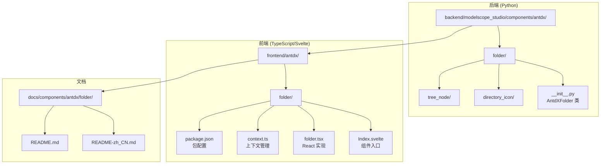
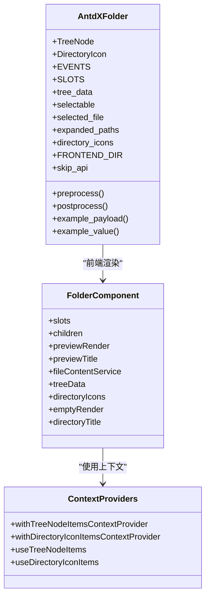
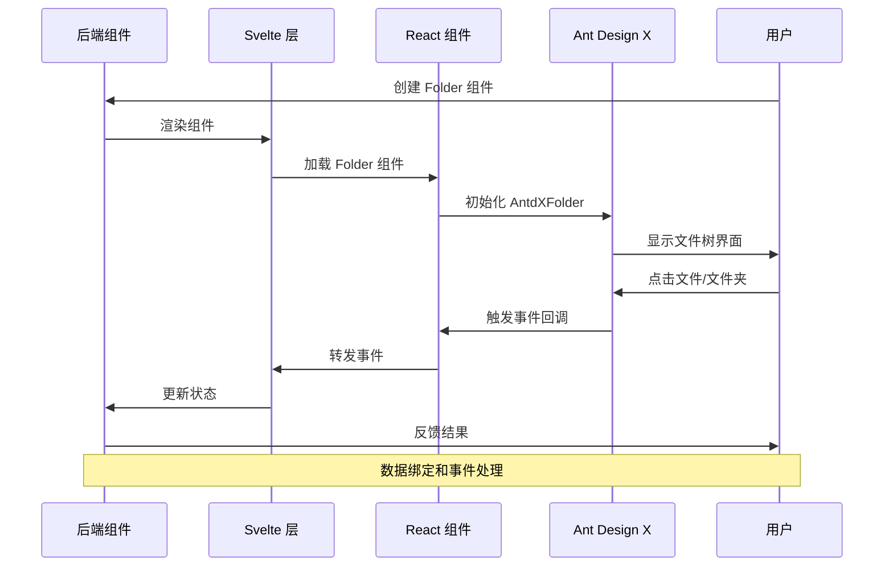
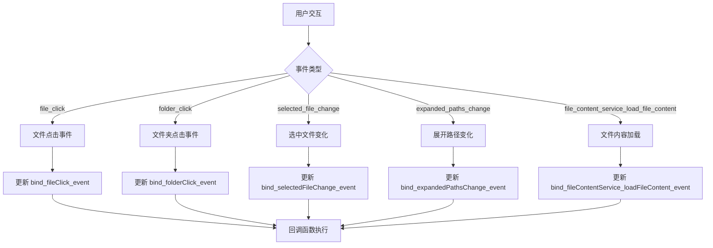
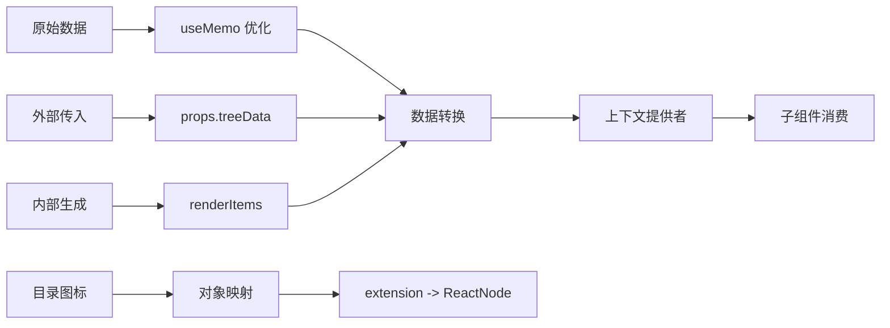

# Folder 文件夹组件

<cite>
**本文档引用的文件**
- [backend/modelscope_studio/components/antdx/folder/__init__.py](file://backend/modelscope_studio/components/antdx/folder/__init__.py)
- [frontend/antdx/folder/Index.svelte](file://frontend/antdx/folder/Index.svelte)
- [frontend/antdx/folder/folder.tsx](file://frontend/antdx/folder/folder.tsx)
- [frontend/antdx/folder/context.ts](file://frontend/antdx/folder/context.ts)
- [frontend/antdx/folder/package.json](file://frontend/antdx/folder/package.json)
- [backend/modelscope_studio/components/antd/__init__.py](file://backend/modelscope_studio/components/antd/__init__.py)
- [backend/modelscope_studio/components/antd/components.py](file://backend/modelscope_studio/components/antd/components.py)
- [docs/components/antdx/folder/README-zh_CN.md](file://docs/components/antdx/folder/README-zh_CN.md)
- [docs/components/antdx/folder/README.md](file://docs/components/antdx/folder/README.md)
</cite>

## 目录

1. [简介](#简介)
2. [项目结构](#项目结构)
3. [核心组件](#核心组件)
4. [架构概览](#架构概览)
5. [详细组件分析](#详细组件分析)
6. [依赖关系分析](#依赖关系分析)
7. [性能考虑](#性能考虑)
8. [故障排除指南](#故障排除指南)
9. [结论](#结论)

## 简介

Folder 文件夹组件是 ModelScope Studio 中的一个重要文件树组件，基于 Ant Design X 的 Folder 组件构建。该组件主要用于展示文件系统结构，提供文件和文件夹的层次化浏览功能。它支持文件点击、文件夹点击、选中文件变化、展开路径变化等事件处理，并提供了丰富的自定义选项。

该组件在前端使用 Svelte 框架实现，通过 React 预处理机制与 Ant Design X 的原生组件进行桥接，实现了从 Python 后端到 React 前端的完整数据流和事件流。

## 项目结构

Folder 组件在整个项目中的位置和组织结构如下：



**图表来源**

- [backend/modelscope_studio/components/antdx/folder/**init**.py:1-114](file://backend/modelscope_studio/components/antdx/folder/__init__.py#L1-L114)
- [frontend/antdx/folder/Index.svelte:1-81](file://frontend/antdx/folder/Index.svelte#L1-L81)
- [frontend/antdx/folder/folder.tsx:1-124](file://frontend/antdx/folder/folder.tsx#L1-L124)

**章节来源**

- [backend/modelscope_studio/components/antdx/folder/**init**.py:1-114](file://backend/modelscope_studio/components/antdx/folder/__init__.py#L1-L114)
- [frontend/antdx/folder/Index.svelte:1-81](file://frontend/antdx/folder/Index.svelte#L1-L81)
- [frontend/antdx/folder/folder.tsx:1-124](file://frontend/antdx/folder/folder.tsx#L1-L124)

## 核心组件

### AntdXFolder 类

AntdXFolder 是后端的核心组件类，继承自 ModelScopeLayoutComponent。它定义了完整的组件接口和行为规范。

**主要特性：**

- 支持多种事件监听器（file_click, folder_click, selected_file_change, expanded_paths_change）
- 提供丰富的配置属性（tree_data, selectable, selected_file, expanded_paths 等）
- 支持插槽系统（emptyRender, previewRender, directoryTitle 等）
- 集成 Gradio 生态系统的组件生命周期管理

**关键属性说明：**

- `tree_data`: 文件树数据结构，定义文件和文件夹的层次关系
- `selectable`: 是否允许选择文件
- `selected_file`: 当前选中的文件路径列表
- `expanded_paths`: 默认展开的路径列表
- `directory_icons`: 自定义目录图标映射

**章节来源**

- [backend/modelscope_studio/components/antdx/folder/**init**.py:12-114](file://backend/modelscope_studio/components/antdx/folder/__init__.py#L12-L114)

### 前端组件架构

前端组件采用分层架构设计，通过 Svelte 和 React 的桥接实现：



**图表来源**

- [backend/modelscope_studio/components/antdx/folder/**init**.py:12-114](file://backend/modelscope_studio/components/antdx/folder/__init__.py#L12-L114)
- [frontend/antdx/folder/folder.tsx:16-124](file://frontend/antdx/folder/folder.tsx#L16-L124)
- [frontend/antdx/folder/context.ts:1-16](file://frontend/antdx/folder/context.ts#L1-L16)

**章节来源**

- [frontend/antdx/folder/folder.tsx:16-124](file://frontend/antdx/folder/folder.tsx#L16-L124)
- [frontend/antdx/folder/context.ts:1-16](file://frontend/antdx/folder/context.ts#L1-L16)

## 架构概览

Folder 组件的整体架构采用分层设计，实现了从后端 Python 到前端 React 的完整数据流：



**图表来源**

- [backend/modelscope_studio/components/antdx/folder/**init**.py:19-35](file://backend/modelscope_studio/components/antdx/folder/__init__.py#L19-L35)
- [frontend/antdx/folder/Index.svelte:10-81](file://frontend/antdx/folder/Index.svelte#L10-L81)
- [frontend/antdx/folder/folder.tsx:25-121](file://frontend/antdx/folder/folder.tsx#L25-L121)

## 详细组件分析

### 事件处理机制

Folder 组件支持多种事件监听器，每种事件都有其特定的功能和触发条件：



**图表来源**

- [backend/modelscope_studio/components/antdx/folder/**init**.py:19-35](file://backend/modelscope_studio/components/antdx/folder/__init__.py#L19-L35)

### 插槽系统

组件提供了灵活的插槽系统，允许开发者自定义各种显示内容：

| 插槽名称       | 功能描述   | 使用场景                     |
| -------------- | ---------- | ---------------------------- |
| emptyRender    | 空状态渲染 | 当文件树为空时显示自定义内容 |
| previewRender  | 预览渲染   | 自定义文件预览内容           |
| directoryTitle | 目录标题   | 自定义目录显示标题           |
| previewTitle   | 预览标题   | 自定义预览标题显示           |
| treeData       | 树数据     | 自定义树形数据结构           |
| directoryIcons | 目录图标   | 自定义文件类型图标           |

**章节来源**

- [backend/modelscope_studio/components/antdx/folder/**init**.py:37-41](file://backend/modelscope_studio/components/antdx/folder/__init__.py#L37-L41)

### 数据流处理

组件的数据流处理采用了 React 的 useMemo 优化机制：



**图表来源**

- [frontend/antdx/folder/folder.tsx:60-88](file://frontend/antdx/folder/folder.tsx#L60-L88)

**章节来源**

- [frontend/antdx/folder/folder.tsx:60-88](file://frontend/antdx/folder/folder.tsx#L60-L88)

## 依赖关系分析

Folder 组件的依赖关系体现了清晰的分层架构：

```mermaid
graph TB
subgraph "外部依赖"
A[@ant-design/x] --> B[AntdXFolder]
C[classnames] --> D[Svelte 样式处理]
E[react] --> F[React Slot]
end
subgraph "内部依赖"
G[createItemsContext] --> H[上下文提供者]
I[renderItems] --> J[项目渲染]
K[renderParamsSlot] --> L[参数化插槽]
M[useFunction] --> N[函数包装]
end
subgraph "组件层次"
O[AntdXFolder] --> P[Index.svelte]
P --> Q[folder.tsx]
Q --> R[React 组件]
R --> S[Ant Design X]
end
A --> R
G --> Q
I --> Q
K --> Q
M --> Q
```

**图表来源**

- [frontend/antdx/folder/folder.tsx:1-15](file://frontend/antdx/folder/folder.tsx#L1-L15)
- [frontend/antdx/folder/Index.svelte:1-10](file://frontend/antdx/folder/Index.svelte#L1-L10)
- [frontend/antdx/folder/context.ts:1-16](file://frontend/antdx/folder/context.ts#L1-L16)

**章节来源**

- [frontend/antdx/folder/package.json:1-15](file://frontend/antdx/folder/package.json#L1-L15)
- [frontend/antdx/folder/folder.tsx:1-15](file://frontend/antdx/folder/folder.tsx#L1-L15)

## 性能考虑

### 渲染优化

组件采用了多项性能优化策略：

1. **useMemo 优化**: 对 treeData 和 directoryIcons 进行记忆化处理，避免不必要的重新计算
2. **条件渲染**: 仅在需要时渲染 children 内容，减少 DOM 节点数量
3. **懒加载**: 通过 importComponent 实现组件的动态导入和懒加载

### 内存管理

- 上下文提供者使用了适当的清理机制
- 事件处理器通过 useFunction 包装，确保正确的 this 绑定
- 插槽内容按需渲染，避免内存泄漏

## 故障排除指南

### 常见问题及解决方案

**问题 1: 组件不显示**

- 检查 tree_data 是否正确设置
- 确认 FRONTEND_DIR 路径是否正确解析
- 验证组件的 visible 属性

**问题 2: 事件不触发**

- 确认事件监听器是否正确注册
- 检查 bind\_\*\_event 属性是否设置
- 验证回调函数的签名是否正确

**问题 3: 图标不显示**

- 检查 directory_icons 配置
- 确认扩展名映射是否正确
- 验证图标组件的导入路径

**章节来源**

- [backend/modelscope_studio/components/antdx/folder/**init**.py:97-101](file://backend/modelscope_studio/components/antdx/folder/__init__.py#L97-L101)

## 结论

Folder 文件夹组件是一个功能完整、架构清晰的文件树组件。它成功地将 Ant Design X 的强大功能与 ModelScope Studio 的生态系统相结合，为用户提供了优秀的文件浏览体验。

**主要优势：**

- 完整的事件处理机制
- 灵活的插槽系统
- 优秀的性能表现
- 清晰的代码结构
- 良好的可扩展性

**适用场景：**

- 文件管理系统
- 代码编辑器
- 资源管理工具
- 文档浏览应用

该组件为 ModelScope Studio 提供了强大的文件树展示能力，是构建复杂前端应用的重要基础组件。
