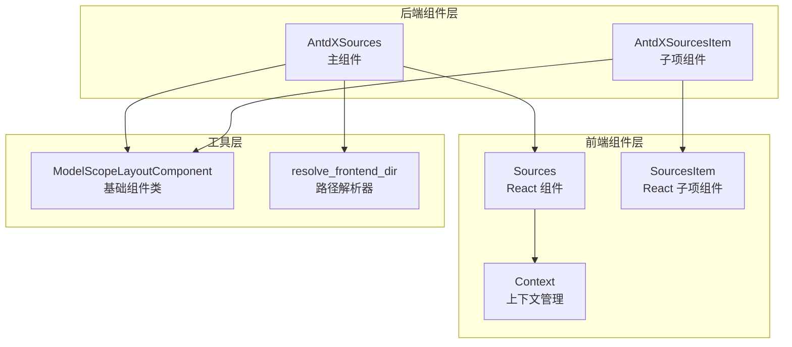
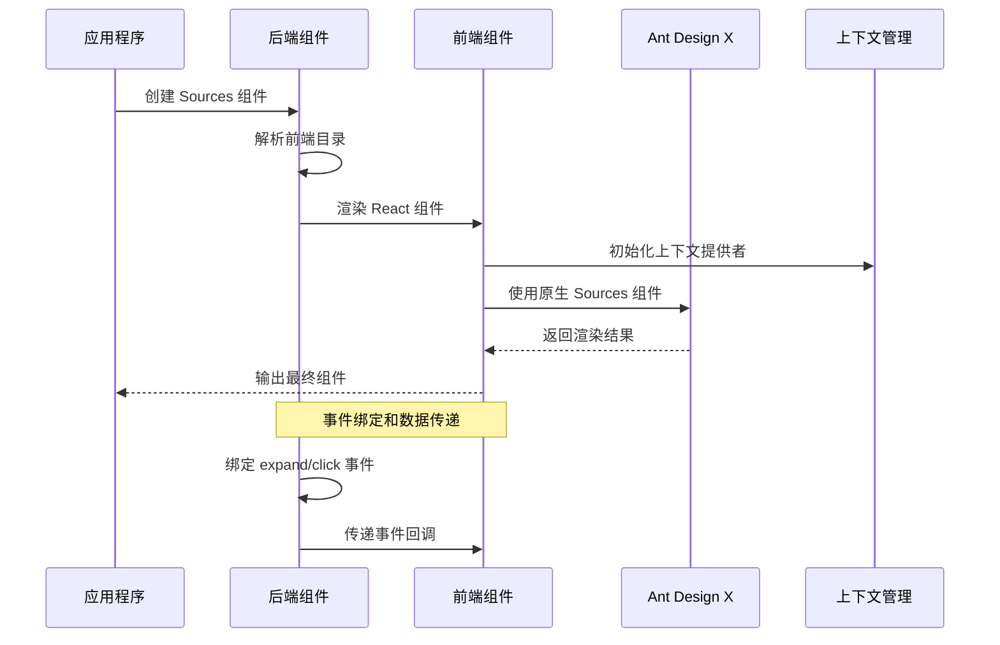
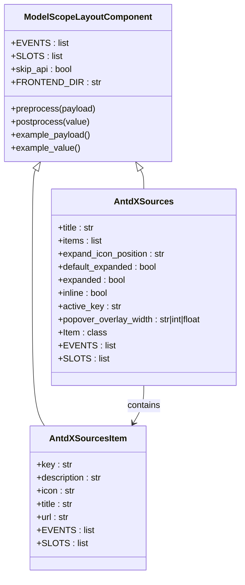
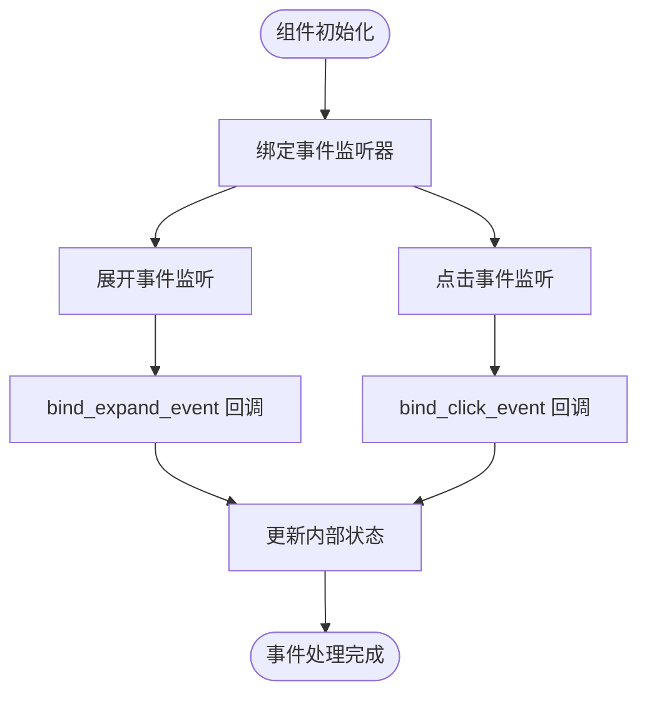
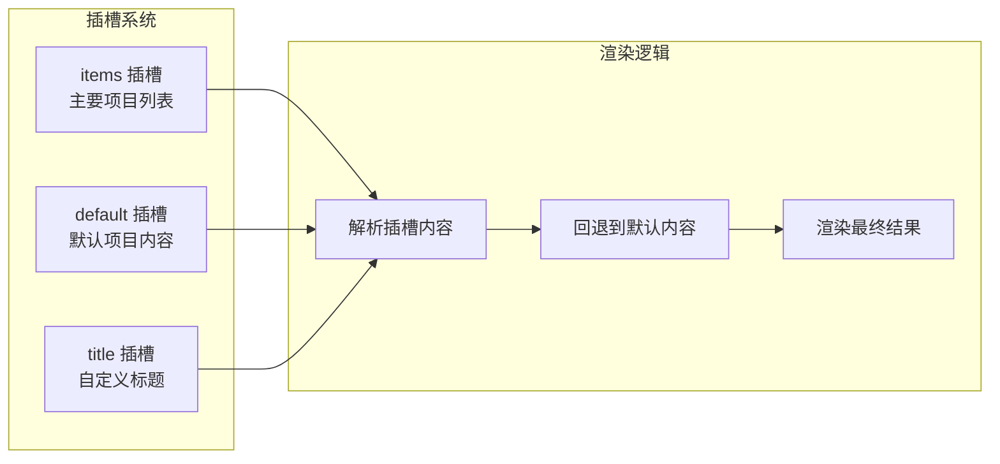

# Sources 数据源组件

<cite>
**本文档引用的文件**
- [backend/modelscope_studio/components/antdx/sources/__init__.py](file://backend/modelscope_studio/components/antdx/sources/__init__.py)
- [backend/modelscope_studio/components/antdx/sources/item/__init__.py](file://backend/modelscope_studio/components/antdx/sources/item/__init__.py)
- [frontend/antdx/sources/sources.tsx](file://frontend/antdx/sources/sources.tsx)
- [frontend/antdx/sources/item/sources.item.tsx](file://frontend/antdx/sources/item/sources.item.tsx)
- [frontend/antdx/sources/context.ts](file://frontend/antdx/sources/context.ts)
- [backend/modelscope_studio/utils/dev/component.py](file://backend/modelscope_studio/utils/dev/component.py)
- [backend/modelscope_studio/utils/dev/resolve_frontend_dir.py](file://backend/modelscope_studio/utils/dev/resolve_frontend_dir.py)
- [backend/modelscope_studio/components/antdx/components.py](file://backend/modelscope_studio/components/antdx/components.py)
- [docs/components/antdx/sources/README-zh_CN.md](file://docs/components/antdx/sources/README-zh_CN.md)
- [docs/components/antdx/sources/demos/basic.py](file://docs/components/antdx/sources/demos/basic.py)
</cite>

## 目录

1. [简介](#简介)
2. [项目结构](#项目结构)
3. [核心组件](#核心组件)
4. [架构概览](#架构概览)
5. [详细组件分析](#详细组件分析)
6. [依赖关系分析](#依赖关系分析)
7. [性能考虑](#性能考虑)
8. [故障排除指南](#故障排除指南)
9. [结论](#结论)

## 简介

Sources 数据源组件是 ModelScope Studio 中用于在 AI 聊天场景中显示信息来源列表的核心组件。该组件基于 Ant Design X 的 Sources 组件构建，专门设计用于展示参考文献、链接来源和其他相关信息。

该组件支持多种配置选项，包括标题设置、展开状态控制、内联显示模式等，并提供了完整的事件处理机制，包括点击事件和展开事件。

## 项目结构

Sources 组件采用前后端分离的架构设计，主要包含以下结构：



**图表来源**

- [backend/modelscope_studio/components/antdx/sources/**init**.py:11-92](file://backend/modelscope_studio/components/antdx/sources/__init__.py#L11-L92)
- [frontend/antdx/sources/sources.tsx:1-41](file://frontend/antdx/sources/sources.tsx#L1-L41)

**章节来源**

- [backend/modelscope_studio/components/antdx/sources/**init**.py:1-92](file://backend/modelscope_studio/components/antdx/sources/__init__.py#L1-L92)
- [backend/modelscope_studio/components/antdx/sources/item/**init**.py:1-68](file://backend/modelscope_studio/components/antdx/sources/item/__init__.py#L1-L68)

## 核心组件

### AntdXSources 主组件

AntdXSources 是 Sources 组件的主容器，负责管理整个数据源列表的显示和交互。

**主要特性：**

- 支持标题显示和自定义
- 可配置展开图标位置（开始/结束）
- 默认展开和受控展开状态
- 内联显示模式支持
- 活动键值管理
- 弹出框覆盖宽度设置

**关键属性：**

- `title`: 显示在组件顶部的标题文本
- `items`: 数据源项目的数组配置
- `expand_icon_position`: 展开图标的显示位置
- `default_expanded`: 默认展开状态
- `expanded`: 受控展开状态
- `inline`: 是否启用内联显示模式
- `active_key`: 当前激活的项目键值
- `popover_overlay_width`: 弹出框覆盖宽度

### AntdXSourcesItem 子项组件

AntdXSourcesItem 代表单个数据源条目，用于显示具体的来源信息。

**主要特性：**

- 支持标题、图标和描述的自定义
- 链接地址配置
- 唯一键值标识
- 插槽系统支持

**关键属性：**

- `key`: 项目的唯一标识符
- `title`: 项目标题
- `description`: 项目描述信息
- `icon`: 自定义图标
- `url`: 跳转链接地址

**章节来源**

- [backend/modelscope_studio/components/antdx/sources/**init**.py:30-73](file://backend/modelscope_studio/components/antdx/sources/__init__.py#L30-L73)
- [backend/modelscope_studio/components/antdx/sources/item/**init**.py:18-48](file://backend/modelscope_studio/components/antdx/sources/item/__init__.py#L18-L48)

## 架构概览

Sources 组件采用分层架构设计，实现了清晰的关注点分离：



**图表来源**

- [backend/modelscope_studio/utils/dev/resolve_frontend_dir.py:4-16](file://backend/modelscope_studio/utils/dev/resolve_frontend_dir.py#L4-L16)
- [frontend/antdx/sources/sources.tsx:9-38](file://frontend/antdx/sources/sources.tsx#L9-L38)

**章节来源**

- [frontend/antdx/sources/sources.tsx:1-41](file://frontend/antdx/sources/sources.tsx#L1-L41)
- [frontend/antdx/sources/item/sources.item.tsx:1-14](file://frontend/antdx/sources/item/sources.item.tsx#L1-L14)

## 详细组件分析

### 后端组件实现

#### ModelScopeLayoutComponent 基础类

所有 Sources 组件都继承自 ModelScopeLayoutComponent，这是一个专门为 ModelScope Studio 设计的布局组件基类。

**核心功能：**

- 提供 Gradio 组件的基础框架
- 处理组件的生命周期管理
- 支持插槽系统的集成
- 管理组件的内部状态

#### AntdXSources 组件实现



**图表来源**

- [backend/modelscope_studio/utils/dev/component.py:11-169](file://backend/modelscope_studio/utils/dev/component.py#L11-L169)
- [backend/modelscope_studio/components/antdx/sources/**init**.py:11-92](file://backend/modelscope_studio/components/antdx/sources/__init__.py#L11-L92)
- [backend/modelscope_studio/components/antdx/sources/item/**init**.py:8-68](file://backend/modelscope_studio/components/antdx/sources/item/__init__.py#L8-L68)

**前端组件实现**

#### Sources React 组件

Sources 组件使用 React 实现，通过 sveltify 包装器与 Svelte 生态系统集成。

**核心功能：**

- 使用 Ant Design X 的原生 Sources 组件
- 支持插槽系统，允许自定义标题内容
- 动态处理项目列表
- 事件处理机制

#### SourcesItem React 子组件

SourcesItem 是单个数据源项目的 React 实现，通过 ItemHandler 处理项目逻辑。

**关键特性：**

- 接受部分 SourcesProps 类型
- 使用 ItemHandler 进行项目处理
- 支持额外的项目处理器属性

**章节来源**

- [frontend/antdx/sources/sources.tsx:1-41](file://frontend/antdx/sources/sources.tsx#L1-L41)
- [frontend/antdx/sources/item/sources.item.tsx:1-14](file://frontend/antdx/sources/item/sources.item.tsx#L1-L14)

### 事件处理机制

Sources 组件支持两种主要事件：



**图表来源**

- [backend/modelscope_studio/components/antdx/sources/**init**.py:18-25](file://backend/modelscope_studio/components/antdx/sources/__init__.py#L18-L25)

**事件类型：**

- `expand`: 当用户展开或折叠数据源时触发
- `click`: 当用户点击某个数据源项目时触发

**章节来源**

- [backend/modelscope_studio/components/antdx/sources/**init**.py:18-25](file://backend/modelscope_studio/components/antdx/sources/__init__.py#L18-L25)

### 插槽系统

Sources 组件支持灵活的插槽系统，允许开发者自定义组件的不同部分：



**图表来源**

- [frontend/antdx/sources/sources.tsx:12-36](file://frontend/antdx/sources/sources.tsx#L12-L36)

**支持的插槽：**

- `items`: 主要的数据源项目列表
- `default`: 默认的项目内容
- `title`: 自定义的标题内容

**章节来源**

- [frontend/antdx/sources/sources.tsx:12-36](file://frontend/antdx/sources/sources.tsx#L12-L36)

## 依赖关系分析

Sources 组件的依赖关系相对简洁，主要依赖于 Ant Design X 和相关的工具库：

```mermaid
graph TB
subgraph "外部依赖"
AntDX[@ant-design/x<br/>Ant Design X 核心组件]
SveltePreprocess[@svelte-preprocess-react<br/>Svelte-React 桥接]
Utils[@utils/*<br/>工具函数库]
end
subgraph "内部依赖"
Component[ModelScopeLayoutComponent<br/>基础组件类]
Context[createItemsContext<br/>上下文管理]
ResolveDir[resolve_frontend_dir<br/>路径解析]
end
subgraph "Sources 组件"
Sources[AntdXSources]
SourcesItem[AntdXSourcesItem]
end
Sources --> AntDX
Sources --> SveltePreprocess
Sources --> Utils
Sources --> Component
Sources --> Context
Sources --> ResolveDir
SourcesItem --> AntDX
SourcesItem --> SveltePreprocess
SourcesItem --> Context
```

**图表来源**

- [frontend/antdx/sources/sources.tsx:1-5](file://frontend/antdx/sources/sources.tsx#L1-L5)
- [backend/modelscope_studio/utils/dev/component.py:11-169](file://backend/modelscope_studio/utils/dev/component.py#L11-L169)
- [backend/modelscope_studio/utils/dev/resolve_frontend_dir.py:4-16](file://backend/modelscope_studio/utils/dev/resolve_frontend_dir.py#L4-L16)

**主要依赖说明：**

- `@ant-design/x`: 提供核心的 Sources 组件实现
- `@svelte-preprocess-react`: 实现 Svelte 和 React 之间的桥接
- `@utils/*`: 提供通用的工具函数，如 renderItems、createItemsContext 等

**章节来源**

- [frontend/antdx/sources/sources.tsx:1-5](file://frontend/antdx/sources/sources.tsx#L1-L5)
- [backend/modelscope_studio/components/antdx/components.py:30-31](file://backend/modelscope_studio/components/antdx/components.py#L30-L31)

## 性能考虑

Sources 组件在设计时充分考虑了性能优化：

### 渲染优化

1. **Memoization 优化**: 使用 React 的 useMemo 来缓存计算结果，避免不必要的重新渲染
2. **条件渲染**: 仅在需要时渲染组件内容
3. **懒加载**: 通过事件驱动的方式延迟加载内容

### 内存管理

1. **组件卸载**: 正确处理组件的挂载和卸载过程
2. **事件清理**: 在组件销毁时清理事件监听器
3. **状态管理**: 使用最小化的状态更新策略

### 数据处理优化

1. **批量更新**: 支持批量的数据源更新
2. **增量渲染**: 仅更新发生变化的部分
3. **虚拟化支持**: 对大量数据源提供虚拟化渲染能力

## 故障排除指南

### 常见问题及解决方案

**问题 1: 组件无法显示**

- 检查 Ant Design X 依赖是否正确安装
- 确认前端目录路径解析是否正确
- 验证组件的可见性属性设置

**问题 2: 事件不响应**

- 确认事件监听器是否正确绑定
- 检查事件回调函数的参数传递
- 验证组件的事件处理逻辑

**问题 3: 插槽内容不显示**

- 检查插槽名称是否正确
- 确认插槽内容的传递方式
- 验证插槽的渲染优先级

**问题 4: 性能问题**

- 检查数据源的数量和复杂度
- 优化数据源的渲染逻辑
- 考虑使用虚拟化渲染

**章节来源**

- [docs/components/antdx/sources/demos/basic.py:1-46](file://docs/components/antdx/sources/demos/basic.py#L1-L46)

## 结论

Sources 数据源组件是一个设计精良、功能完整的组件，它成功地将 Ant Design X 的强大功能与 ModelScope Studio 的生态系统相结合。该组件具有以下优势：

1. **架构清晰**: 采用分层设计，职责明确
2. **扩展性强**: 支持丰富的配置选项和插槽系统
3. **性能优秀**: 通过多种优化技术确保良好的性能表现
4. **易于使用**: 提供直观的 API 和完整的文档支持

该组件特别适用于 AI 聊天应用中的参考文献显示、链接来源管理等场景，为开发者提供了强大的数据源展示能力。通过合理的事件处理和插槽系统，开发者可以轻松地定制组件的行为和外观，满足各种复杂的业务需求。
