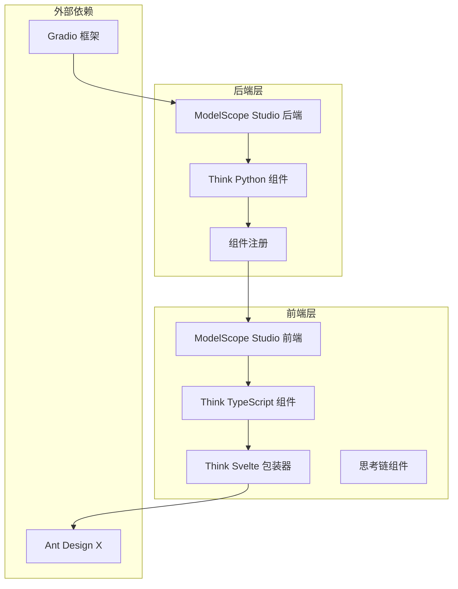
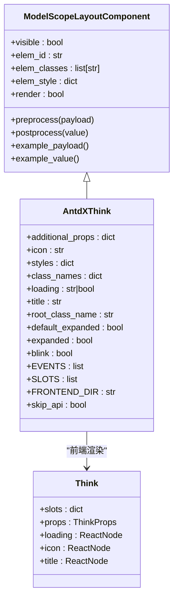
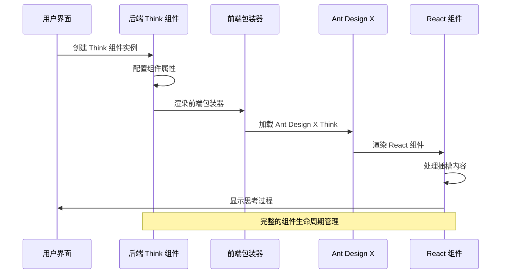
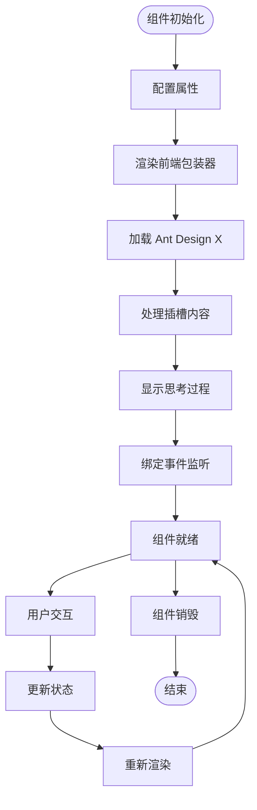
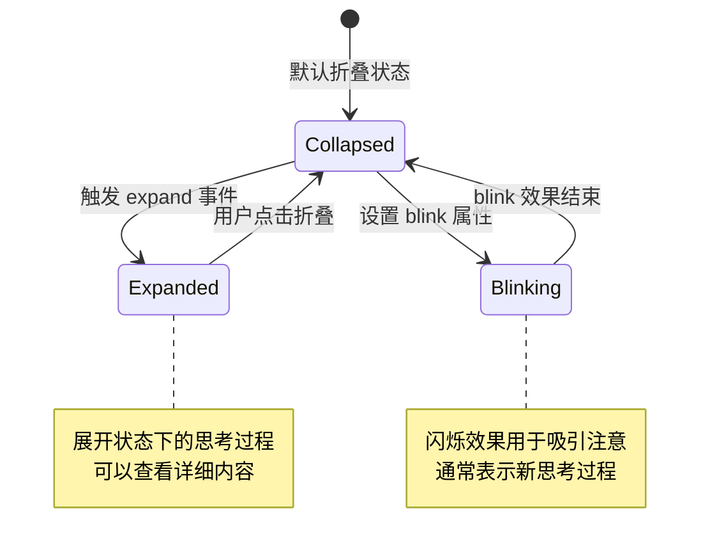
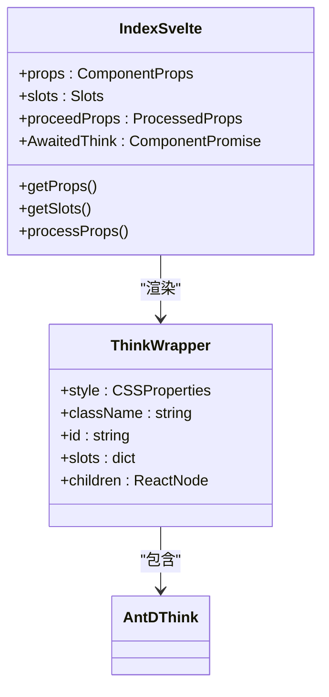
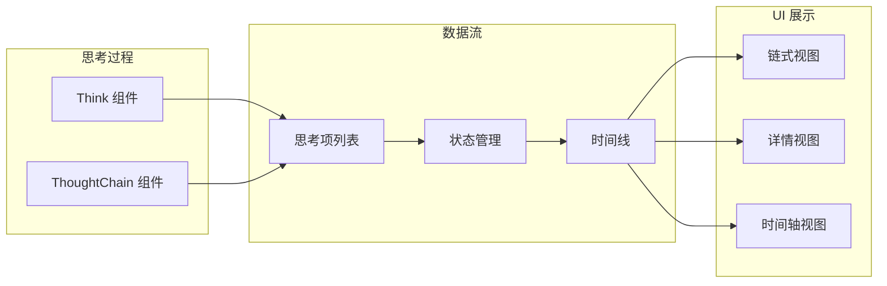
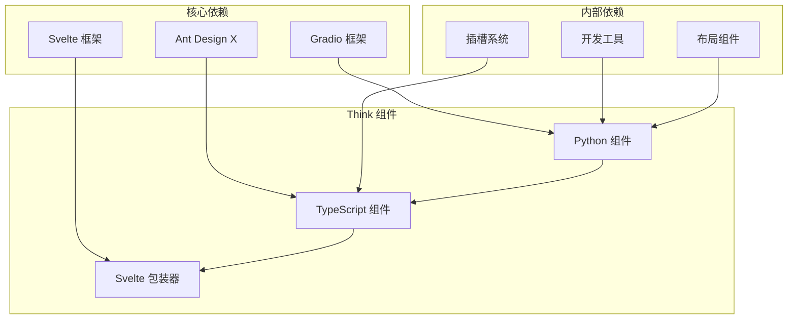

# Think 思考组件

<cite>
**本文档引用的文件**
- [think/__init__.py](file://backend/modelscope_studio/components/antdx/think/__init__.py)
- [components.py](file://backend/modelscope_studio/components/antdx/components.py)
- [think.tsx](file://frontend/antdx/think/think.tsx)
- [Index.svelte](file://frontend/antdx/think/Index.svelte)
- [thought-chain.tsx](file://frontend/antdx/thought-chain/thought-chain.tsx)
- [context.ts](file://frontend/antdx/thought-chain/context.ts)
- [__init__.py](file://backend/modelscope_studio/components/antdx/__init__.py)
</cite>

## 目录

1. [简介](#简介)
2. [项目结构](#项目结构)
3. [核心组件](#核心组件)
4. [架构概览](#架构概览)
5. [详细组件分析](#详细组件分析)
6. [依赖关系分析](#依赖关系分析)
7. [性能考虑](#性能考虑)
8. [故障排除指南](#故障排除指南)
9. [结论](#结论)

## 简介

Think 思考组件是 ModelScope Studio 中用于可视化和追踪 AI Agent 思考过程的核心组件。该组件基于 Ant Design X 的 Think 组件构建，专门设计用于在对话系统中展示智能体的推理过程、决策链路和中间思考结果。

该组件的主要设计理念是提供透明化的 AI 决策过程可视化，让用户能够理解 AI 智能体是如何进行思考、分析和做出决策的。通过详细的思考过程记录和展示，用户可以更好地信任和优化 AI 系统的行为。

## 项目结构

Think 组件在整个项目架构中位于 antdx 组件库中，采用前后端分离的设计模式：

**图表来源**

- [think/**init**.py:1-79](file://backend/modelscope_studio/components/antdx/think/__init__.py#L1-L79)
- [components.py:1-40](file://backend/modelscope_studio/components/antdx/components.py#L1-L40)
- [think.tsx:1-24](file://frontend/antdx/think/think.tsx#L1-L24)

**章节来源**

- [think/**init**.py:1-79](file://backend/modelscope_studio/components/antdx/think/__init__.py#L1-L79)
- [components.py:1-40](file://backend/modelscope_studio/components/antdx/components.py#L1-L40)

## 核心组件

### Think 组件类定义

Think 组件继承自 `ModelScopeLayoutComponent`，提供了完整的属性配置和事件处理机制：

**图表来源**

- [think/**init**.py:8-79](file://backend/modelscope_studio/components/antdx/think/__init__.py#L8-L79)
- [think.tsx:6-21](file://frontend/antdx/think/think.tsx#L6-L21)

### 关键属性配置

Think 组件支持丰富的配置选项，包括：

- **基础属性**: 图标、标题、样式类名
- **状态属性**: 加载状态、展开状态、闪烁效果
- **事件属性**: 展开事件绑定
- **插槽系统**: 支持 loading、icon、title 三个插槽

**章节来源**

- [think/**init**.py:21-60](file://backend/modelscope_studio/components/antdx/think/__init__.py#L21-L60)
- [think.tsx:6-21](file://frontend/antdx/think/think.tsx#L6-L21)

## 架构概览

Think 组件采用分层架构设计，实现了前后端的清晰分离：

**图表来源**

- [Index.svelte:10-67](file://frontend/antdx/think/Index.svelte#L10-L67)
- [think.tsx:6-21](file://frontend/antdx/think/think.tsx#L6-L21)

### 组件生命周期

**图表来源**

- [think/**init**.py:12-16](file://backend/modelscope_studio/components/antdx/think/__init__.py#L12-L16)
- [Index.svelte:55-68](file://frontend/antdx/think/Index.svelte#L55-L68)

## 详细组件分析

### 后端实现分析

后端 Think 组件实现了完整的 Gradio 组件接口：

#### 事件系统

组件支持 expand 事件，用于处理展开状态的变化：

**图表来源**

- [think/**init**.py:12-16](file://backend/modelscope_studio/components/antdx/think/__init__.py#L12-L16)

#### 插槽系统

组件支持三种插槽，允许灵活的内容定制：

| 插槽名称 | 类型      | 用途             | 默认值        |
| -------- | --------- | ---------------- | ------------- |
| loading  | ReactNode | 自定义加载指示器 | props.loading |
| icon     | ReactNode | 自定义图标       | props.icon    |
| title    | ReactNode | 自定义标题内容   | props.title   |

**章节来源**

- [think/**init**.py:18-19](file://backend/modelscope_studio/components/antdx/think/__init__.py#L18-L19)
- [think.tsx:12-16](file://frontend/antdx/think/think.tsx#L12-L16)

### 前端实现分析

前端采用 Svelte + React 的混合架构：

#### Svelte 包装器

Index.svelte 提供了完整的组件包装功能：

**图表来源**

- [Index.svelte:12-67](file://frontend/antdx/think/Index.svelte#L12-L67)

#### React 组件桥接

think.tsx 实现了 Svelte 到 React 的桥接：

- 使用 `sveltify` 将 React 组件转换为 Svelte 组件
- 通过 `ReactSlot` 处理插槽内容
- 直接调用 Ant Design X 的原生 Think 组件

**章节来源**

- [Index.svelte:1-69](file://frontend/antdx/think/Index.svelte#L1-L69)
- [think.tsx:1-24](file://frontend/antdx/think/think.tsx#L1-L24)

### 思考链集成

Think 组件与 ThoughtChain 组件形成完整的思考过程可视化体系：

**图表来源**

- [thought-chain.tsx:11-40](file://frontend/antdx/thought-chain/thought-chain.tsx#L11-L40)
- [context.ts:1-7](file://frontend/antdx/thought-chain/context.ts#L1-L7)

**章节来源**

- [thought-chain.tsx:1-43](file://frontend/antdx/thought-chain/thought-chain.tsx#L1-L43)
- [context.ts:1-7](file://frontend/antdx/thought-chain/context.ts#L1-L7)

## 依赖关系分析

### 组件依赖图

**图表来源**

- [components.py:34-34](file://backend/modelscope_studio/components/antdx/components.py#L34-L34)
- [**init**.py:34-34](file://backend/modelscope_studio/components/antdx/__init__.py#L34-L34)

### 版本兼容性

组件确保与以下版本的兼容性：

- **Gradio**: >= 4.0.0
- **Ant Design X**: >= 0.1.0
- **Svelte**: >= 3.54.0
- **React**: >= 18.0.0

**章节来源**

- [components.py:1-40](file://backend/modelscope_studio/components/antdx/components.py#L1-L40)

## 性能考虑

### 渲染优化

1. **懒加载机制**: 前端采用动态导入，减少初始加载时间
2. **条件渲染**: 仅在可见时渲染组件，避免不必要的计算
3. **插槽优化**: 通过 ReactSlot 实现高效的插槽内容处理

### 内存管理

- 组件销毁时自动清理事件监听器
- 合理的 props 处理避免内存泄漏
- 使用 useMemo 优化复杂数据结构的渲染

## 故障排除指南

### 常见问题及解决方案

#### 组件不显示

**症状**: Think 组件创建成功但不显示在界面上

**可能原因**:

1. `visible` 属性设置为 False
2. `render` 属性设置为 False
3. 父容器样式问题

**解决方案**:

- 检查组件的 `visible` 和 `render` 属性
- 验证父容器的 CSS 样式
- 确认组件正确导入

#### 插槽内容不生效

**症状**: 自定义的 loading、icon、title 插槽内容没有显示

**可能原因**:

1. 插槽名称错误
2. 插槽内容类型不匹配
3. 插槽传递方式错误

**解决方案**:

- 确认插槽名称为 'loading'、'icon' 或 'title'
- 验证插槽内容为有效的 ReactNode
- 检查插槽的传递语法

#### 事件处理异常

**症状**: expand 事件无法正常触发

**可能原因**:

1. 事件监听器未正确绑定
2. 事件回调函数错误
3. 组件状态问题

**解决方案**:

- 检查 EVENTS 数组配置
- 验证事件回调函数逻辑
- 确认组件状态同步

**章节来源**

- [think/**init**.py:12-16](file://backend/modelscope_studio/components/antdx/think/__init__.py#L12-L16)

## 结论

Think 思考组件作为 ModelScope Studio 的核心可视化组件，成功实现了 AI 思考过程的透明化展示。通过精心设计的架构和丰富的配置选项，该组件为开发者和用户提供了强大的思考过程追踪能力。

### 主要优势

1. **完整的可视化**: 提供从简单到复杂的多种思考过程展示方式
2. **灵活的配置**: 支持丰富的属性配置和插槽定制
3. **良好的性能**: 采用现代前端技术栈，确保流畅的用户体验
4. **易于集成**: 与 Gradio 生态系统无缝集成

### 应用场景

- **AI 助手**: 展示智能体的推理过程和决策链路
- **数据分析**: 可视化数据探索和分析思路
- **代码生成**: 展示代码生成的思考过程和逻辑
- **多模态应用**: 支持文本、图像等多种输入类型的思考过程

该组件为构建可信、可解释的 AI 应用奠定了坚实的基础，是现代 AI 产品不可或缺的重要组成部分。
